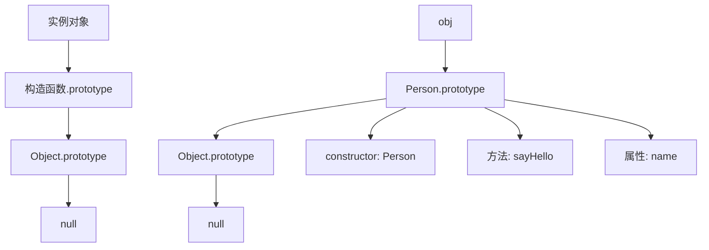

# 原型链机制

## 原型链概述

### 原型链结构


### 原型链查找机制
| 查找步骤 | 描述 | 示例 |
|----------|------|------|
| 1 | 在实例对象上查找 | obj.name |
| 2 | 在构造函数原型上查找 | Person.prototype.name |
| 3 | 在Object.prototype上查找 | Object.prototype.name |
| 4 | 返回undefined | undefined |

## 原型对象

### 基本原型概念
```javascript
// 1. 构造函数和原型
function Person(name) {
    this.name = name;
}

// 为原型添加方法
Person.prototype.sayHello = function() {
    return `Hello, I'm ${this.name}`;
};

// 为原型添加属性
Person.prototype.species = 'Homo sapiens';

// 创建实例
const person1 = new Person('John');
const person2 = new Person('Jane');

// 访问原型属性和方法
console.log(person1.sayHello()); // "Hello, I'm John"
console.log(person2.species); // "Homo sapiens"
```

### 原型对象特性
```javascript
// 1. 原型共享
function Person(name) {
    this.name = name;
}

Person.prototype.sayHello = function() {
    return `Hello, I'm ${this.name}`;
};

const person1 = new Person('John');
const person2 = new Person('Jane');

// 所有实例共享同一个原型方法
console.log(person1.sayHello === person2.sayHello); // true

// 2. 原型修改影响所有实例
Person.prototype.newMethod = function() {
    return 'New method added';
};

console.log(person1.newMethod()); // "New method added"
console.log(person2.newMethod()); // "New method added"

// 3. 实例属性覆盖原型属性
person1.species = 'Custom species';
console.log(person1.species); // "Custom species"
console.log(person2.species); // undefined (原型上没有这个属性)
```

### 原型链查找
```javascript
// 1. 属性查找过程
function Person(name) {
    this.name = name;
}

Person.prototype.age = 30;
Person.prototype.sayHello = function() {
    return `Hello, I'm ${this.name}`;
};

const person = new Person('John');

// 查找过程演示
console.log(person.name); // "John" (实例属性)
console.log(person.age); // 30 (原型属性)
console.log(person.sayHello()); // "Hello, I'm John" (原型方法)

// 2. 使用hasOwnProperty检查属性来源
console.log(person.hasOwnProperty('name')); // true (实例属性)
console.log(person.hasOwnProperty('age')); // false (原型属性)
console.log(person.hasOwnProperty('sayHello')); // false (原型方法)

// 3. 使用in操作符检查属性存在
console.log('name' in person); // true
console.log('age' in person); // true
console.log('toString' in person); // true (Object.prototype上的方法)
```

## 原型链继承

### 基本继承实现
```javascript
// 1. 原型链继承
function Animal(name) {
    this.name = name;
}

Animal.prototype.eat = function() {
    return `${this.name} is eating`;
};

function Dog(name, breed) {
    Animal.call(this, name); // 调用父构造函数
    this.breed = breed;
}

// 设置原型链
Dog.prototype = Object.create(Animal.prototype);
Dog.prototype.constructor = Dog;

Dog.prototype.bark = function() {
    return `${this.name} is barking`;
};

const dog = new Dog('Buddy', 'Golden Retriever');
console.log(dog.eat()); // "Buddy is eating"
console.log(dog.bark()); // "Buddy is barking"
```

### 继承链分析
```javascript
// 1. 完整的继承链
function Animal(name) {
    this.name = name;
}

Animal.prototype.eat = function() {
    return `${this.name} is eating`;
};

function Mammal(name) {
    Animal.call(this, name);
}

Mammal.prototype = Object.create(Animal.prototype);
Mammal.prototype.constructor = Mammal;

Mammal.prototype.warmBlooded = function() {
    return `${this.name} is warm-blooded`;
};

function Dog(name, breed) {
    Mammal.call(this, name);
    this.breed = breed;
}

Dog.prototype = Object.create(Mammal.prototype);
Dog.prototype.constructor = Dog;

Dog.prototype.bark = function() {
    return `${this.name} is barking`;
};

const dog = new Dog('Buddy', 'Golden Retriever');

// 原型链: dog -> Dog.prototype -> Mammal.prototype -> Animal.prototype -> Object.prototype -> null
console.log(dog instanceof Dog); // true
console.log(dog instanceof Mammal); // true
console.log(dog instanceof Animal); // true
console.log(dog instanceof Object); // true
```

### 方法重写
```javascript
// 1. 方法重写
function Animal(name) {
    this.name = name;
}

Animal.prototype.move = function() {
    return `${this.name} is moving`;
};

function Bird(name) {
    Animal.call(this, name);
}

Bird.prototype = Object.create(Animal.prototype);
Bird.prototype.constructor = Bird;

// 重写父类方法
Bird.prototype.move = function() {
    return `${this.name} is flying`;
};

Bird.prototype.fly = function() {
    return `${this.name} is flying high`;
};

const bird = new Bird('Eagle');
console.log(bird.move()); // "Eagle is flying" (重写的方法)
console.log(bird.fly()); // "Eagle is flying high" (子类特有方法)
```

## 原型链操作

### 原型链检查
```javascript
// 1. instanceof操作符
function Person(name) {
    this.name = name;
}

const person = new Person('John');

console.log(person instanceof Person); // true
console.log(person instanceof Object); // true
console.log(person instanceof Array); // false

// 2. isPrototypeOf方法
console.log(Person.prototype.isPrototypeOf(person)); // true
console.log(Object.prototype.isPrototypeOf(person)); // true

// 3. getPrototypeOf方法
console.log(Object.getPrototypeOf(person) === Person.prototype); // true
console.log(Object.getPrototypeOf(Person.prototype) === Object.prototype); // true
```

### 原型链修改
```javascript
// 1. 修改原型链
function Person(name) {
    this.name = name;
}

Person.prototype.sayHello = function() {
    return `Hello, I'm ${this.name}`;
};

const person = new Person('John');

// 修改原型方法
Person.prototype.sayHello = function() {
    return `Hi, I'm ${this.name}`;
};

console.log(person.sayHello()); // "Hi, I'm John" (所有实例都会受影响)

// 2. 添加新方法到原型
Person.prototype.sayGoodbye = function() {
    return `Goodbye, ${this.name}`;
};

console.log(person.sayGoodbye()); // "Goodbye, John"

// 3. 删除原型方法
delete Person.prototype.sayHello;
// console.log(person.sayHello()); // TypeError: person.sayHello is not a function
```

### 原型链遍历
```javascript
// 1. 遍历原型链
function Person(name) {
    this.name = name;
}

Person.prototype.sayHello = function() {
    return `Hello, I'm ${this.name}`;
};

const person = new Person('John');

// 遍历所有可枚举属性
for (let key in person) {
    console.log(key); // name, sayHello
}

// 只遍历实例属性
for (let key in person) {
    if (person.hasOwnProperty(key)) {
        console.log(key); // name
    }
}

// 2. 获取原型链上的所有属性
function getAllProperties(obj) {
    const properties = [];
    let current = obj;
    
    while (current) {
        properties.push(...Object.getOwnPropertyNames(current));
        current = Object.getPrototypeOf(current);
    }
    
    return [...new Set(properties)]; // 去重
}

console.log(getAllProperties(person));
```

## 原型链最佳实践

### 继承模式
```javascript
// 1. 组合继承 (推荐)
function Person(name) {
    this.name = name;
}

Person.prototype.sayHello = function() {
    return `Hello, I'm ${this.name}`;
};

function Student(name, grade) {
    Person.call(this, name); // 继承实例属性
    this.grade = grade;
}

Student.prototype = Object.create(Person.prototype); // 继承原型方法
Student.prototype.constructor = Student;

Student.prototype.study = function() {
    return `${this.name} is studying`;
};

const student = new Student('Alice', 'A');
console.log(student.sayHello()); // "Hello, I'm Alice"
console.log(student.study()); // "Alice is studying"

// 2. 寄生组合继承
function inheritPrototype(subType, superType) {
    const prototype = Object.create(superType.prototype);
    prototype.constructor = subType;
    subType.prototype = prototype;
}

function Teacher(name, subject) {
    Person.call(this, name);
    this.subject = subject;
}

inheritPrototype(Teacher, Person);

Teacher.prototype.teach = function() {
    return `${this.name} is teaching ${this.subject}`;
};
```

### 原型链安全操作
```javascript
// 1. 安全的原型链检查
function hasPrototypeProperty(obj, property) {
    return !obj.hasOwnProperty(property) && property in obj;
}

function Person(name) {
    this.name = name;
}

Person.prototype.sayHello = function() {
    return `Hello, I'm ${this.name}`;
};

const person = new Person('John');

console.log(hasPrototypeProperty(person, 'name')); // false (实例属性)
console.log(hasPrototypeProperty(person, 'sayHello')); // true (原型属性)

// 2. 安全的原型链遍历
function getPrototypeProperties(obj) {
    const properties = [];
    let current = obj;
    
    while (current && current !== Object.prototype) {
        const ownProps = Object.getOwnPropertyNames(current);
        properties.push(...ownProps);
        current = Object.getPrototypeOf(current);
    }
    
    return properties;
}

// 3. 原型链深度检查
function getPrototypeChain(obj) {
    const chain = [];
    let current = obj;
    
    while (current) {
        chain.push(current.constructor.name);
        current = Object.getPrototypeOf(current);
    }
    
    return chain;
}

console.log(getPrototypeChain(person)); // ["Person", "Object"]
```

## 相关链接
- [[02-理解掌握层/02-原型与继承/02-构造函数与原型]] - 构造函数与原型
- [[02-理解掌握层/02-原型与继承/03-继承模式对比]] - 继承模式对比
- [[02-理解掌握层/02-原型与继承/04-ES6类语法]] - ES6类语法
- [[02-理解掌握层/02-原型与继承/05-继承最佳实践]] - 继承最佳实践
