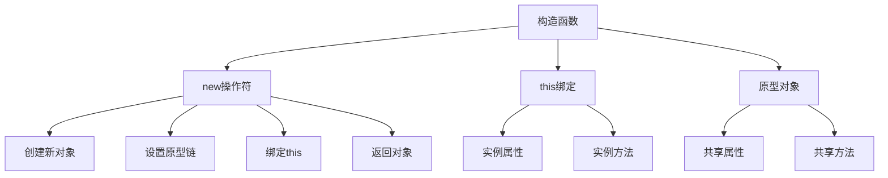

# 构造函数与原型

## 构造函数概述

### 构造函数概念


### 构造函数执行过程
| 步骤 | 描述 | 代码示例 |
|------|------|----------|
| 1 | 创建新对象 | `const obj = {}` |
| 2 | 设置原型链 | `obj.__proto__ = Constructor.prototype` |
| 3 | 绑定this | `Constructor.call(obj, args)` |
| 4 | 返回对象 | `return obj` |

## 构造函数定义

### 基本构造函数
```javascript
// 1. 函数声明方式
function Person(name, age) {
    this.name = name;
    this.age = age;
    this.sayHello = function() {
        return `Hello, I'm ${this.name}`;
    };
}

const person1 = new Person('John', 30);
const person2 = new Person('Jane', 25);

console.log(person1.sayHello()); // "Hello, I'm John"
console.log(person2.sayHello()); // "Hello, I'm Jane"

// 2. 函数表达式方式
const Animal = function(name) {
    this.name = name;
    this.eat = function() {
        return `${this.name} is eating`;
    };
};

const animal = new Animal('Dog');
console.log(animal.eat()); // "Dog is eating"

// 3. 箭头函数不能作为构造函数
const InvalidConstructor = (name) => {
    this.name = name; // TypeError: Cannot set property 'name' of undefined
};

// const invalid = new InvalidConstructor('test'); // TypeError
```

### 构造函数特性
```javascript
// 1. 构造函数名约定
function User(name, email) {
    this.name = name;
    this.email = email;
}

// 2. 检查是否为构造函数调用
function Person(name) {
    if (!(this instanceof Person)) {
        throw new Error('Person must be called with new');
    }
    this.name = name;
}

// 正确调用
const person = new Person('John');

// 错误调用
// Person('John'); // Error: Person must be called with new

// 3. 使用new.target检查
function Person(name) {
    if (new.target === undefined) {
        throw new Error('Person must be called with new');
    }
    this.name = name;
}

// 4. 返回值的处理
function Person(name) {
    this.name = name;
    
    // 返回原始值会被忽略
    return 'ignored';
    
    // 返回对象会替换this
    // return { custom: 'object' };
}

const person = new Person('John');
console.log(person); // Person { name: 'John' }
```

## 原型对象

### 原型对象概念
```javascript
// 1. 每个函数都有prototype属性
function Person(name) {
    this.name = name;
}

console.log(Person.prototype); // Person {}
console.log(typeof Person.prototype); // "object"

// 2. 原型对象默认有constructor属性
console.log(Person.prototype.constructor === Person); // true

// 3. 实例的__proto__指向构造函数的prototype
const person = new Person('John');
console.log(person.__proto__ === Person.prototype); // true

// 4. 原型链查找
Person.prototype.sayHello = function() {
    return `Hello, I'm ${this.name}`;
};

console.log(person.sayHello()); // "Hello, I'm John"
console.log(person.hasOwnProperty('sayHello')); // false
console.log('sayHello' in person); // true
```

### 原型对象操作
```javascript
// 1. 添加原型方法
function Person(name) {
    this.name = name;
}

Person.prototype.sayHello = function() {
    return `Hello, I'm ${this.name}`;
};

Person.prototype.sayGoodbye = function() {
    return `Goodbye, ${this.name}`;
};

// 2. 添加原型属性
Person.prototype.species = 'Homo sapiens';
Person.prototype.planet = 'Earth';

// 3. 批量添加原型方法
Object.assign(Person.prototype, {
    walk() {
        return `${this.name} is walking`;
    },
    run() {
        return `${this.name} is running`;
    },
    sleep() {
        return `${this.name} is sleeping`;
    }
});

const person = new Person('John');
console.log(person.sayHello()); // "Hello, I'm John"
console.log(person.walk()); // "John is walking"
console.log(person.species); // "Homo sapiens"
```

### 原型对象修改
```javascript
// 1. 修改原型方法
function Person(name) {
    this.name = name;
}

Person.prototype.sayHello = function() {
    return `Hello, I'm ${this.name}`;
};

const person1 = new Person('John');
const person2 = new Person('Jane');

console.log(person1.sayHello()); // "Hello, I'm John"

// 修改原型方法影响所有实例
Person.prototype.sayHello = function() {
    return `Hi, I'm ${this.name}`;
};

console.log(person1.sayHello()); // "Hi, I'm John"
console.log(person2.sayHello()); // "Hi, I'm Jane"

// 2. 删除原型方法
delete Person.prototype.sayHello;
// console.log(person1.sayHello()); // TypeError: person1.sayHello is not a function

// 3. 重新定义原型对象
Person.prototype = {
    constructor: Person, // 重要：保持constructor引用
    sayHello() {
        return `Hello from new prototype, I'm ${this.name}`;
    },
    sayGoodbye() {
        return `Goodbye from new prototype, ${this.name}`;
    }
};

const person3 = new Person('Bob');
console.log(person3.sayHello()); // "Hello from new prototype, I'm Bob"
console.log(person3.sayGoodbye()); // "Goodbye from new prototype, Bob"
```

## 构造函数与原型结合

### 实例属性与原型方法
```javascript
// 1. 实例属性 + 原型方法模式
function Person(name, age) {
    // 实例属性
    this.name = name;
    this.age = age;
}

// 原型方法
Person.prototype.sayHello = function() {
    return `Hello, I'm ${this.name} and I'm ${this.age} years old`;
};

Person.prototype.getAge = function() {
    return this.age;
};

Person.prototype.setAge = function(newAge) {
    this.age = newAge;
};

const person = new Person('John', 30);
console.log(person.sayHello()); // "Hello, I'm John and I'm 30 years old"
console.log(person.getAge()); // 30

person.setAge(31);
console.log(person.getAge()); // 31
```

### 静态方法
```javascript
// 1. 静态方法定义
function Person(name, age) {
    this.name = name;
    this.age = age;
}

// 静态方法
Person.createAdult = function(name) {
    return new Person(name, 18);
};

Person.createChild = function(name) {
    return new Person(name, 5);
};

Person.getSpecies = function() {
    return 'Homo sapiens';
};

// 使用静态方法
const adult = Person.createAdult('John');
const child = Person.createChild('Alice');
console.log(adult.age); // 18
console.log(child.age); // 5
console.log(Person.getSpecies()); // "Homo sapiens"

// 2. 静态属性
Person.species = 'Homo sapiens';
Person.planet = 'Earth';

console.log(Person.species); // "Homo sapiens"
console.log(Person.planet); // "Earth"
```

### 私有属性模拟
```javascript
// 1. 使用闭包模拟私有属性
function Person(name, age) {
    // 私有属性
    let _age = age;
    let _secret = 'secret';
    
    // 公共属性
    this.name = name;
    
    // 公共方法
    this.getAge = function() {
        return _age;
    };
    
    this.setAge = function(newAge) {
        if (newAge >= 0 && newAge <= 150) {
            _age = newAge;
        }
    };
    
    this.getSecret = function() {
        return _secret;
    };
}

const person = new Person('John', 30);
console.log(person.name); // "John"
console.log(person.getAge()); // 30
console.log(person.getSecret()); // "secret"

// 无法直接访问私有属性
console.log(person._age); // undefined
console.log(person._secret); // undefined

// 2. 使用Symbol模拟私有属性
const _age = Symbol('age');
const _secret = Symbol('secret');

function Person(name, age) {
    this.name = name;
    this[_age] = age;
    this[_secret] = 'secret';
}

Person.prototype.getAge = function() {
    return this[_age];
};

Person.prototype.setAge = function(newAge) {
    this[_age] = newAge;
};

const person = new Person('John', 30);
console.log(person.getAge()); // 30
console.log(person[_age]); // 30 (仍然可以访问，但不太明显)
```

## 构造函数最佳实践

### 设计模式
```javascript
// 1. 单例模式
function Singleton() {
    if (Singleton.instance) {
        return Singleton.instance;
    }
    
    this.name = 'Singleton';
    Singleton.instance = this;
    
    return this;
}

const s1 = new Singleton();
const s2 = new Singleton();
console.log(s1 === s2); // true

// 2. 工厂模式
function PersonFactory() {}

PersonFactory.createPerson = function(type, name) {
    switch (type) {
        case 'adult':
            return new Person(name, 18);
        case 'child':
            return new Person(name, 5);
        case 'senior':
            return new Person(name, 65);
        default:
            throw new Error('Unknown person type');
    }
};

function Person(name, age) {
    this.name = name;
    this.age = age;
}

const adult = PersonFactory.createPerson('adult', 'John');
const child = PersonFactory.createPerson('child', 'Alice');

// 3. 建造者模式
function PersonBuilder() {
    this.person = {};
}

PersonBuilder.prototype.setName = function(name) {
    this.person.name = name;
    return this;
};

PersonBuilder.prototype.setAge = function(age) {
    this.person.age = age;
    return this;
};

PersonBuilder.prototype.setEmail = function(email) {
    this.person.email = email;
    return this;
};

PersonBuilder.prototype.build = function() {
    return new Person(this.person.name, this.person.age, this.person.email);
};

function Person(name, age, email) {
    this.name = name;
    this.age = age;
    this.email = email;
}

const person = new PersonBuilder()
    .setName('John')
    .setAge(30)
    .setEmail('john@example.com')
    .build();
```

### 错误处理
```javascript
// 1. 参数验证
function Person(name, age) {
    if (typeof name !== 'string' || name.trim() === '') {
        throw new TypeError('Name must be a non-empty string');
    }
    
    if (typeof age !== 'number' || age < 0 || age > 150) {
        throw new RangeError('Age must be a number between 0 and 150');
    }
    
    this.name = name.trim();
    this.age = age;
}

// 2. 安全调用检查
function Person(name) {
    if (new.target === undefined) {
        throw new Error('Person must be called with new');
    }
    
    this.name = name;
}

// 3. 原型方法错误处理
Person.prototype.sayHello = function() {
    if (!this.name) {
        throw new Error('Person name is not set');
    }
    
    return `Hello, I'm ${this.name}`;
};
```

## 相关链接
- [[02-理解掌握层/02-原型与继承/01-原型链机制]] - 原型链机制
- [[02-理解掌握层/02-原型与继承/03-继承模式对比]] - 继承模式对比
- [[02-理解掌握层/02-原型与继承/04-ES6类语法]] - ES6类语法
- [[02-理解掌握层/02-原型与继承/05-继承最佳实践]] - 继承最佳实践
