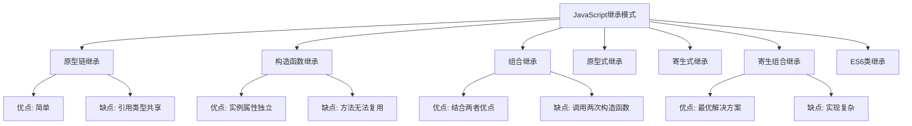

# 继承模式对比

## 继承模式概述

### 继承模式分类


### 继承模式对比表
| 继承模式 | 优点 | 缺点 | 适用场景 |
|----------|------|------|----------|
| 原型链继承 | 简单易实现 | 引用类型共享问题 | 简单继承需求 |
| 构造函数继承 | 实例属性独立 | 方法无法复用 | 需要独立实例属性 |
| 组合继承 | 结合两者优点 | 调用两次构造函数 | 一般继承需求 |
| 原型式继承 | 基于已有对象创建 | 引用类型共享 | 对象复制 |
| 寄生式继承 | 增强对象功能 | 方法无法复用 | 对象增强 |
| 寄生组合继承 | 最优解决方案 | 实现复杂 | 生产环境推荐 |
| ES6类继承 | 语法简洁 | 需要ES6支持 | 现代开发 |

## 原型链继承

### 基本实现
```javascript
// 1. 原型链继承
function SuperType() {
    this.property = true;
    this.colors = ['red', 'blue', 'green'];
}

SuperType.prototype.getSuperValue = function() {
    return this.property;
};

function SubType() {
    this.subproperty = false;
}

// 继承SuperType
SubType.prototype = new SuperType();

SubType.prototype.getSubValue = function() {
    return this.subproperty;
};

const instance1 = new SubType();
const instance2 = new SubType();

console.log(instance1.getSuperValue()); // true
console.log(instance1.getSubValue()); // false

// 2. 引用类型共享问题
instance1.colors.push('black');
console.log(instance1.colors); // ['red', 'blue', 'green', 'black']
console.log(instance2.colors); // ['red', 'blue', 'green', 'black'] (共享问题)
```

### 问题分析
```javascript
// 1. 引用类型共享问题
function Parent() {
    this.colors = ['red', 'blue', 'green'];
    this.obj = { name: 'parent' };
}

function Child() {
    this.name = 'child';
}

Child.prototype = new Parent();

const child1 = new Child();
const child2 = new Child();

child1.colors.push('black');
child1.obj.name = 'modified';

console.log(child2.colors); // ['red', 'blue', 'green', 'black'] (被修改)
console.log(child2.obj.name); // 'modified' (被修改)

// 2. 无法向父构造函数传参
function Parent(name) {
    this.name = name;
}

function Child() {
    this.age = 0;
}

Child.prototype = new Parent(); // 无法传参

const child = new Child();
console.log(child.name); // undefined
```

## 构造函数继承

### 基本实现
```javascript
// 1. 构造函数继承
function SuperType(name) {
    this.name = name;
    this.colors = ['red', 'blue', 'green'];
}

function SubType(name, age) {
    // 继承SuperType
    SuperType.call(this, name);
    this.age = age;
}

const instance1 = new SubType('John', 30);
const instance2 = new SubType('Jane', 25);

console.log(instance1.name); // 'John'
console.log(instance1.age); // 30

// 2. 实例属性独立
instance1.colors.push('black');
console.log(instance1.colors); // ['red', 'blue', 'green', 'black']
console.log(instance2.colors); // ['red', 'blue', 'green'] (独立)

// 3. 可以传参
function Parent(name) {
    this.name = name;
    this.sayHello = function() {
        return `Hello, I'm ${this.name}`;
    };
}

function Child(name, age) {
    Parent.call(this, name);
    this.age = age;
}

const child = new Child('Alice', 10);
console.log(child.name); // 'Alice'
console.log(child.sayHello()); // "Hello, I'm Alice"
```

### 问题分析
```javascript
// 1. 方法无法复用
function Parent(name) {
    this.name = name;
    this.sayHello = function() {
        return `Hello, I'm ${this.name}`;
    };
}

function Child(name, age) {
    Parent.call(this, name);
    this.age = age;
}

const child1 = new Child('John', 30);
const child2 = new Child('Jane', 25);

console.log(child1.sayHello === child2.sayHello); // false (方法不共享)

// 2. 无法访问父类原型方法
Parent.prototype.getSpecies = function() {
    return 'Homo sapiens';
};

const child = new Child('Bob', 20);
// console.log(child.getSpecies()); // TypeError: child.getSpecies is not a function
```

## 组合继承

### 基本实现
```javascript
// 1. 组合继承
function SuperType(name) {
    this.name = name;
    this.colors = ['red', 'blue', 'green'];
}

SuperType.prototype.sayName = function() {
    return this.name;
};

function SubType(name, age) {
    // 继承实例属性
    SuperType.call(this, name);
    this.age = age;
}

// 继承原型方法
SubType.prototype = new SuperType();
SubType.prototype.constructor = SubType;

SubType.prototype.sayAge = function() {
    return this.age;
};

const instance1 = new SubType('John', 30);
const instance2 = new SubType('Jane', 25);

console.log(instance1.sayName()); // 'John'
console.log(instance1.sayAge()); // 30

// 2. 实例属性独立
instance1.colors.push('black');
console.log(instance1.colors); // ['red', 'blue', 'green', 'black']
console.log(instance2.colors); // ['red', 'blue', 'green'] (独立)

// 3. 方法共享
console.log(instance1.sayName === instance2.sayName); // true
```

### 问题分析
```javascript
// 1. 调用两次构造函数
function Parent(name) {
    this.name = name;
    console.log('Parent constructor called');
}

Parent.prototype.sayHello = function() {
    return `Hello, I'm ${this.name}`;
};

function Child(name, age) {
    Parent.call(this, name); // 第一次调用
    this.age = age;
}

Child.prototype = new Parent(); // 第二次调用
Child.prototype.constructor = Child;

const child = new Child('John', 30);
// 输出: "Parent constructor called" (两次)
```

## 原型式继承

### 基本实现
```javascript
// 1. 原型式继承
function object(o) {
    function F() {}
    F.prototype = o;
    return new F();
}

const person = {
    name: 'John',
    colors: ['red', 'blue', 'green'],
    sayHello() {
        return `Hello, I'm ${this.name}`;
    }
};

const person1 = object(person);
const person2 = object(person);

person1.name = 'Jane';
person1.colors.push('black');

console.log(person1.sayHello()); // "Hello, I'm Jane"
console.log(person2.colors); // ['red', 'blue', 'green', 'black'] (共享问题)

// 2. Object.create()实现
const person3 = Object.create(person);
const person4 = Object.create(person);

person3.name = 'Bob';
person3.colors.push('yellow');

console.log(person3.sayHello()); // "Hello, I'm Bob"
console.log(person4.colors); // ['red', 'blue', 'green', 'black', 'yellow'] (共享问题)
```

## 寄生式继承

### 基本实现
```javascript
// 1. 寄生式继承
function createAnother(original) {
    const clone = Object.create(original);
    clone.sayHi = function() {
        return `Hi, I'm ${this.name}`;
    };
    return clone;
}

const person = {
    name: 'John',
    colors: ['red', 'blue', 'green']
};

const anotherPerson = createAnother(person);
console.log(anotherPerson.sayHi()); // "Hi, I'm John"

// 2. 增强对象功能
function createSpecialPerson(original) {
    const clone = Object.create(original);
    clone.isSpecial = true;
    clone.getSpecialInfo = function() {
        return `Special person: ${this.name}`;
    };
    return clone;
}

const specialPerson = createSpecialPerson(person);
console.log(specialPerson.getSpecialInfo()); // "Special person: John"
console.log(specialPerson.isSpecial); // true
```

## 寄生组合继承

### 基本实现
```javascript
// 1. 寄生组合继承
function inheritPrototype(subType, superType) {
    const prototype = Object.create(superType.prototype);
    prototype.constructor = subType;
    subType.prototype = prototype;
}

function SuperType(name) {
    this.name = name;
    this.colors = ['red', 'blue', 'green'];
}

SuperType.prototype.sayName = function() {
    return this.name;
};

function SubType(name, age) {
    SuperType.call(this, name);
    this.age = age;
}

inheritPrototype(SubType, SuperType);

SubType.prototype.sayAge = function() {
    return this.age;
};

const instance1 = new SubType('John', 30);
const instance2 = new SubType('Jane', 25);

console.log(instance1.sayName()); // 'John'
console.log(instance1.sayAge()); // 30

// 2. 实例属性独立
instance1.colors.push('black');
console.log(instance1.colors); // ['red', 'blue', 'green', 'black']
console.log(instance2.colors); // ['red', 'blue', 'green'] (独立)

// 3. 方法共享
console.log(instance1.sayName === instance2.sayName); // true
```

### 优势分析
```javascript
// 1. 只调用一次父构造函数
function Parent(name) {
    this.name = name;
    console.log('Parent constructor called');
}

function Child(name, age) {
    Parent.call(this, name); // 只调用一次
    this.age = age;
}

inheritPrototype(Child, Parent);

const child = new Child('John', 30);
// 输出: "Parent constructor called" (只一次)

// 2. 原型链正确
console.log(child instanceof Child); // true
console.log(child instanceof Parent); // true
console.log(child instanceof Object); // true

// 3. 构造函数正确
console.log(child.constructor === Child); // true
```

## ES6类继承

### 基本实现
```javascript
// 1. ES6类继承
class SuperType {
    constructor(name) {
        this.name = name;
        this.colors = ['red', 'blue', 'green'];
    }
    
    sayName() {
        return this.name;
    }
}

class SubType extends SuperType {
    constructor(name, age) {
        super(name);
        this.age = age;
    }
    
    sayAge() {
        return this.age;
    }
}

const instance1 = new SubType('John', 30);
const instance2 = new SubType('Jane', 25);

console.log(instance1.sayName()); // 'John'
console.log(instance1.sayAge()); // 30

// 2. 实例属性独立
instance1.colors.push('black');
console.log(instance1.colors); // ['red', 'blue', 'green', 'black']
console.log(instance2.colors); // ['red', 'blue', 'green'] (独立)

// 3. 方法共享
console.log(instance1.sayName === instance2.sayName); // true
```

### 高级特性
```javascript
// 1. 静态方法继承
class Parent {
    static getSpecies() {
        return 'Homo sapiens';
    }
    
    static createAdult(name) {
        return new this(name, 18);
    }
}

class Child extends Parent {
    constructor(name, age) {
        super(name);
        this.age = age;
    }
    
    static createChild(name) {
        return new this(name, 5);
    }
}

console.log(Child.getSpecies()); // 'Homo sapiens' (继承静态方法)
const adult = Child.createAdult('John');
const child = Child.createChild('Alice');

// 2. 方法重写
class Animal {
    constructor(name) {
        this.name = name;
    }
    
    move() {
        return `${this.name} is moving`;
    }
}

class Bird extends Animal {
    move() {
        return `${this.name} is flying`;
    }
    
    fly() {
        return `${this.name} is flying high`;
    }
}

const bird = new Bird('Eagle');
console.log(bird.move()); // "Eagle is flying" (重写的方法)
console.log(bird.fly()); // "Eagle is flying high" (子类特有方法)
```

## 继承模式选择指南

### 选择标准
```javascript
// 1. 简单继承需求 - 使用ES6类
class SimpleParent {
    constructor(name) {
        this.name = name;
    }
}

class SimpleChild extends SimpleParent {
    constructor(name, age) {
        super(name);
        this.age = age;
    }
}

// 2. 需要兼容旧环境 - 使用寄生组合继承
function Parent(name) {
    this.name = name;
}

function Child(name, age) {
    Parent.call(this, name);
    this.age = age;
}

inheritPrototype(Child, Parent);

// 3. 对象复制 - 使用原型式继承
const original = { name: 'John', age: 30 };
const copy = Object.create(original);

// 4. 对象增强 - 使用寄生式继承
function enhanceObject(obj) {
    const enhanced = Object.create(obj);
    enhanced.isEnhanced = true;
    return enhanced;
}
```

### 最佳实践
```javascript
// 1. 现代开发推荐使用ES6类
class ModernParent {
    constructor(name) {
        this.name = name;
    }
    
    getName() {
        return this.name;
    }
}

class ModernChild extends ModernParent {
    constructor(name, age) {
        super(name);
        this.age = age;
    }
    
    getAge() {
        return this.age;
    }
}

// 2. 兼容性考虑使用寄生组合继承
function CompatibleParent(name) {
    this.name = name;
}

CompatibleParent.prototype.getName = function() {
    return this.name;
};

function CompatibleChild(name, age) {
    CompatibleParent.call(this, name);
    this.age = age;
}

inheritPrototype(CompatibleChild, CompatibleParent);

CompatibleChild.prototype.getAge = function() {
    return this.age;
};
```

## 相关链接
- [[02-理解掌握层/02-原型与继承/01-原型链机制]] - 原型链机制
- [[02-理解掌握层/02-原型与继承/02-构造函数与原型]] - 构造函数与原型
- [[02-理解掌握层/02-原型与继承/04-ES6类语法]] - ES6类语法
- [[02-理解掌握层/02-原型与继承/05-继承最佳实践]] - 继承最佳实践
