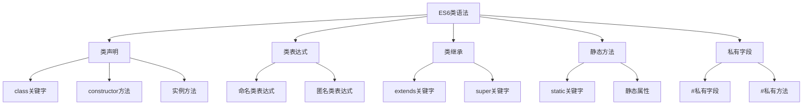

# ES6类语法

## ES6类概述

### 类语法特性


### 类与构造函数对比
| 特性 | 构造函数 | ES6类 | 说明 |
|------|----------|-------|------|
| 声明方式 | function | class | 语法更简洁 |
| 提升 | 支持 | 不支持 | 类不会提升 |
| 严格模式 | 可选 | 自动 | 类自动严格模式 |
| 原型方法 | 手动添加 | 自动添加 | 类方法自动在原型上 |
| 继承 | 手动实现 | extends | 语法更清晰 |

## 类声明

### 基本类声明
```javascript
// 1. 基本类声明
class Person {
    constructor(name, age) {
        this.name = name;
        this.age = age;
    }
    
    sayHello() {
        return `Hello, I'm ${this.name}`;
    }
    
    getAge() {
        return this.age;
    }
}

const person = new Person('John', 30);
console.log(person.sayHello()); // "Hello, I'm John"
console.log(person.getAge()); // 30

// 2. 类不会提升
// const p = new Person('test'); // ReferenceError: Cannot access 'Person' before initialization

class Person {
    constructor(name) {
        this.name = name;
    }
}

// 3. 类自动严格模式
class StrictClass {
    constructor() {
        // 自动严格模式
        // undeclaredVar = 'test'; // ReferenceError
    }
}
```

### 类表达式
```javascript
// 1. 命名类表达式
const Person = class PersonClass {
    constructor(name) {
        this.name = name;
    }
    
    sayHello() {
        return `Hello, I'm ${this.name}`;
    }
};

const person = new Person('John');
console.log(person.sayHello()); // "Hello, I'm John"

// 2. 匿名类表达式
const Animal = class {
    constructor(name) {
        this.name = name;
    }
    
    makeSound() {
        return `${this.name} makes a sound`;
    }
};

const animal = new Animal('Dog');
console.log(animal.makeSound()); // "Dog makes a sound"

// 3. 类表达式作为参数
function createClass() {
    return class {
        constructor(value) {
            this.value = value;
        }
        
        getValue() {
            return this.value;
        }
    };
}

const MyClass = createClass();
const instance = new MyClass('test');
console.log(instance.getValue()); // "test"
```

## 类继承

### 基本继承
```javascript
// 1. 基本类继承
class Animal {
    constructor(name) {
        this.name = name;
    }
    
    eat() {
        return `${this.name} is eating`;
    }
    
    sleep() {
        return `${this.name} is sleeping`;
    }
}

class Dog extends Animal {
    constructor(name, breed) {
        super(name); // 调用父类构造函数
        this.breed = breed;
    }
    
    bark() {
        return `${this.name} is barking`;
    }
    
    // 重写父类方法
    eat() {
        return `${this.name} is eating dog food`;
    }
}

const dog = new Dog('Buddy', 'Golden Retriever');
console.log(dog.eat()); // "Buddy is eating dog food"
console.log(dog.bark()); // "Buddy is barking"
console.log(dog.sleep()); // "Buddy is sleeping"
```

### 多层继承
```javascript
// 1. 多层继承
class Animal {
    constructor(name) {
        this.name = name;
    }
    
    move() {
        return `${this.name} is moving`;
    }
}

class Mammal extends Animal {
    constructor(name) {
        super(name);
    }
    
    giveBirth() {
        return `${this.name} gives birth to live young`;
    }
}

class Dog extends Mammal {
    constructor(name, breed) {
        super(name);
        this.breed = breed;
    }
    
    bark() {
        return `${this.name} is barking`;
    }
}

const dog = new Dog('Buddy', 'Golden Retriever');
console.log(dog.move()); // "Buddy is moving"
console.log(dog.giveBirth()); // "Buddy gives birth to live young"
console.log(dog.bark()); // "Buddy is barking"

// 2. 继承链检查
console.log(dog instanceof Dog); // true
console.log(dog instanceof Mammal); // true
console.log(dog instanceof Animal); // true
console.log(dog instanceof Object); // true
```

### super关键字
```javascript
// 1. super调用父类构造函数
class Parent {
    constructor(name) {
        this.name = name;
    }
}

class Child extends Parent {
    constructor(name, age) {
        super(name); // 必须在使用this之前调用
        this.age = age;
    }
}

// 2. super调用父类方法
class Animal {
    constructor(name) {
        this.name = name;
    }
    
    move() {
        return `${this.name} is moving`;
    }
}

class Bird extends Animal {
    constructor(name) {
        super(name);
    }
    
    move() {
        return super.move() + ' by flying'; // 调用父类方法
    }
}

const bird = new Bird('Eagle');
console.log(bird.move()); // "Eagle is moving by flying"

// 3. super在静态方法中
class Parent {
    static getSpecies() {
        return 'Parent species';
    }
}

class Child extends Parent {
    static getSpecies() {
        return super.getSpecies() + ' - Child species';
    }
}

console.log(Child.getSpecies()); // "Parent species - Child species"
```

## 静态方法

### 静态方法定义
```javascript
// 1. 静态方法
class Person {
    constructor(name, age) {
        this.name = name;
        this.age = age;
    }
    
    // 实例方法
    sayHello() {
        return `Hello, I'm ${this.name}`;
    }
    
    // 静态方法
    static createAdult(name) {
        return new Person(name, 18);
    }
    
    static createChild(name) {
        return new Person(name, 5);
    }
    
    static getSpecies() {
        return 'Homo sapiens';
    }
}

// 使用静态方法
const adult = Person.createAdult('John');
const child = Person.createChild('Alice');
console.log(adult.age); // 18
console.log(child.age); // 5
console.log(Person.getSpecies()); // "Homo sapiens"

// 2. 静态方法继承
class Employee extends Person {
    constructor(name, age, department) {
        super(name, age);
        this.department = department;
    }
    
    static createManager(name) {
        return new Employee(name, 30, 'Management');
    }
}

const manager = Employee.createManager('Bob');
console.log(manager.department); // "Management"
console.log(Employee.getSpecies()); // "Homo sapiens" (继承静态方法)
```

### 静态属性
```javascript
// 1. 静态属性
class Config {
    static apiUrl = 'https://api.example.com';
    static version = '1.0.0';
    static timeout = 5000;
    
    static getConfig() {
        return {
            apiUrl: this.apiUrl,
            version: this.version,
            timeout: this.timeout
        };
    }
}

console.log(Config.apiUrl); // "https://api.example.com"
console.log(Config.getConfig()); // { apiUrl: "...", version: "...", timeout: 5000 }

// 2. 静态属性继承
class DevConfig extends Config {
    static apiUrl = 'https://dev-api.example.com';
    static debug = true;
}

console.log(DevConfig.apiUrl); // "https://dev-api.example.com"
console.log(DevConfig.version); // "1.0.0" (继承)
console.log(DevConfig.debug); // true
```

## 私有字段

### 私有字段语法
```javascript
// 1. 私有字段
class Person {
    #name; // 私有字段
    #age;  // 私有字段
    
    constructor(name, age) {
        this.#name = name;
        this.#age = age;
    }
    
    getName() {
        return this.#name;
    }
    
    getAge() {
        return this.#age;
    }
    
    setName(name) {
        this.#name = name;
    }
    
    setAge(age) {
        if (age >= 0 && age <= 150) {
            this.#age = age;
        }
    }
}

const person = new Person('John', 30);
console.log(person.getName()); // "John"
console.log(person.getAge()); // 30

// 无法直接访问私有字段
// console.log(person.#name); // SyntaxError: Private field '#name' must be declared in an enclosing class
// console.log(person.#age);  // SyntaxError: Private field '#age' must be declared in an enclosing class

// 2. 私有方法
class Calculator {
    #result = 0;
    
    add(value) {
        this.#result = this.#addInternal(this.#result, value);
        return this;
    }
    
    #addInternal(a, b) { // 私有方法
        return a + b;
    }
    
    getResult() {
        return this.#result;
    }
}

const calc = new Calculator();
calc.add(5).add(3);
console.log(calc.getResult()); // 8
```

### 私有字段继承
```javascript
// 1. 私有字段继承
class Parent {
    #privateField = 'parent private';
    
    getPrivateField() {
        return this.#privateField;
    }
    
    setPrivateField(value) {
        this.#privateField = value;
    }
}

class Child extends Parent {
    #childPrivateField = 'child private';
    
    getChildPrivateField() {
        return this.#childPrivateField;
    }
    
    getAllPrivateFields() {
        return {
            parent: this.getPrivateField(),
            child: this.#childPrivateField
        };
    }
}

const child = new Child();
console.log(child.getPrivateField()); // "parent private"
console.log(child.getChildPrivateField()); // "child private"
console.log(child.getAllPrivateFields()); // { parent: "...", child: "..." }
```

## 类的高级特性

### getter和setter
```javascript
// 1. getter和setter
class Person {
    constructor(firstName, lastName) {
        this.firstName = firstName;
        this.lastName = lastName;
    }
    
    get fullName() {
        return `${this.firstName} ${this.lastName}`;
    }
    
    set fullName(name) {
        const parts = name.split(' ');
        this.firstName = parts[0];
        this.lastName = parts[1];
    }
    
    get age() {
        return this._age;
    }
    
    set age(value) {
        if (value >= 0 && value <= 150) {
            this._age = value;
        } else {
            throw new Error('Age must be between 0 and 150');
        }
    }
}

const person = new Person('John', 'Doe');
console.log(person.fullName); // "John Doe"

person.fullName = 'Jane Smith';
console.log(person.firstName); // "Jane"
console.log(person.lastName); // "Smith"

person.age = 30;
console.log(person.age); // 30
```

### 计算属性名
```javascript
// 1. 计算属性名
class DynamicClass {
    constructor() {
        this.data = {};
    }
    
    [Symbol.iterator]() {
        let index = 0;
        const keys = Object.keys(this.data);
        
        return {
            next() {
                if (index < keys.length) {
                    return { value: keys[index++], done: false };
                } else {
                    return { done: true };
                }
            }
        };
    }
    
    setData(key, value) {
        this.data[key] = value;
    }
    
    getData(key) {
        return this.data[key];
    }
}

const dynamic = new DynamicClass();
dynamic.setData('name', 'John');
dynamic.setData('age', 30);

for (let key of dynamic) {
    console.log(`${key}: ${dynamic.getData(key)}`);
}
```

### 类表达式和工厂函数
```javascript
// 1. 类工厂函数
function createClass(className) {
    return class {
        constructor() {
            this.className = className;
        }
        
        getName() {
            return this.className;
        }
    };
}

const MyClass = createClass('MyClass');
const instance = new MyClass();
console.log(instance.getName()); // "MyClass"

// 2. 动态类创建
function createPersonClass(type) {
    return class extends Person {
        constructor(name, age) {
            super(name, age);
            this.type = type;
        }
        
        getType() {
            return this.type;
        }
    };
}

const Adult = createPersonClass('adult');
const Child = createPersonClass('child');

const adult = new Adult('John', 30);
const child = new Child('Alice', 10);

console.log(adult.getType()); // "adult"
console.log(child.getType()); // "child"
```

## 类的最佳实践

### 设计模式
```javascript
// 1. 单例模式
class Singleton {
    static instance = null;
    
    constructor() {
        if (Singleton.instance) {
            return Singleton.instance;
        }
        
        this.name = 'Singleton';
        Singleton.instance = this;
    }
    
    static getInstance() {
        if (!Singleton.instance) {
            Singleton.instance = new Singleton();
        }
        return Singleton.instance;
    }
}

const s1 = new Singleton();
const s2 = Singleton.getInstance();
console.log(s1 === s2); // true

// 2. 工厂模式
class AnimalFactory {
    static createAnimal(type, name) {
        switch (type) {
            case 'dog':
                return new Dog(name);
            case 'cat':
                return new Cat(name);
            case 'bird':
                return new Bird(name);
            default:
                throw new Error('Unknown animal type');
        }
    }
}

class Dog {
    constructor(name) {
        this.name = name;
        this.type = 'dog';
    }
}

class Cat {
    constructor(name) {
        this.name = name;
        this.type = 'cat';
    }
}

class Bird {
    constructor(name) {
        this.name = name;
        this.type = 'bird';
    }
}

const dog = AnimalFactory.createAnimal('dog', 'Buddy');
const cat = AnimalFactory.createAnimal('cat', 'Whiskers');
```

### 错误处理
```javascript
// 1. 参数验证
class Person {
    constructor(name, age) {
        if (typeof name !== 'string' || name.trim() === '') {
            throw new TypeError('Name must be a non-empty string');
        }
        
        if (typeof age !== 'number' || age < 0 || age > 150) {
            throw new RangeError('Age must be a number between 0 and 150');
        }
        
        this.name = name.trim();
        this.age = age;
    }
    
    setAge(age) {
        if (typeof age !== 'number' || age < 0 || age > 150) {
            throw new RangeError('Age must be a number between 0 and 150');
        }
        this.age = age;
    }
}

// 2. 方法错误处理
class Calculator {
    #result = 0;
    
    add(value) {
        if (typeof value !== 'number') {
            throw new TypeError('Value must be a number');
        }
        this.#result += value;
        return this;
    }
    
    divide(value) {
        if (typeof value !== 'number') {
            throw new TypeError('Value must be a number');
        }
        if (value === 0) {
            throw new Error('Division by zero is not allowed');
        }
        this.#result /= value;
        return this;
    }
    
    getResult() {
        return this.#result;
    }
}
```

## 相关链接
- [[02-理解掌握层/02-原型与继承/01-原型链机制]] - 原型链机制
- [[02-理解掌握层/02-原型与继承/02-构造函数与原型]] - 构造函数与原型
- [[02-理解掌握层/02-原型与继承/03-继承模式对比]] - 继承模式对比
- [[02-理解掌握层/02-原型与继承/05-继承最佳实践]] - 继承最佳实践
