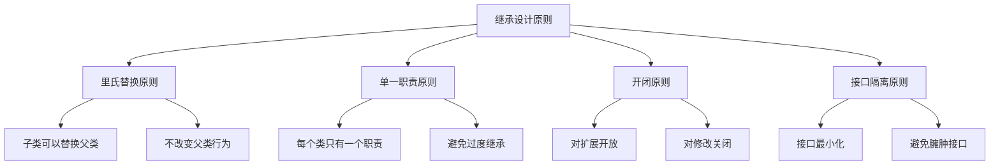

# 继承最佳实践

## 继承设计原则

### 设计原则


### 继承质量指标
| 指标 | 描述 | 最佳实践 |
|------|------|----------|
| 继承深度 | 继承层次数 | < 5层 |
| 方法重写率 | 重写方法比例 | < 30% |
| 耦合度 | 类间依赖程度 | 低耦合 |
| 内聚度 | 类内相关程度 | 高内聚 |

## ES6类继承最佳实践

### 现代继承模式
```javascript
// 1. 使用ES6类继承
class Animal {
    constructor(name) {
        this.name = name;
    }
    
    eat() {
        return `${this.name} is eating`;
    }
    
    sleep() {
        return `${this.name} is sleeping`;
    }
}

class Dog extends Animal {
    constructor(name, breed) {
        super(name);
        this.breed = breed;
    }
    
    bark() {
        return `${this.name} is barking`;
    }
    
    // 重写父类方法
    eat() {
        return `${this.name} is eating dog food`;
    }
}

// 2. 使用组合替代继承
class Flyable {
    fly() {
        return `${this.name} is flying`;
    }
}

class Swimmable {
    swim() {
        return `${this.name} is swimming`;
    }
}

class Duck extends Animal {
    constructor(name) {
        super(name);
        this.flyable = new Flyable();
        this.swimmable = new Swimmable();
    }
    
    fly() {
        return this.flyable.fly.call(this);
    }
    
    swim() {
        return this.swimmable.swim.call(this);
    }
}
```

### 接口设计
```javascript
// 1. 抽象基类
class Shape {
    constructor() {
        if (this.constructor === Shape) {
            throw new Error('Shape is an abstract class');
        }
    }
    
    getArea() {
        throw new Error('getArea must be implemented');
    }
    
    getPerimeter() {
        throw new Error('getPerimeter must be implemented');
    }
}

class Rectangle extends Shape {
    constructor(width, height) {
        super();
        this.width = width;
        this.height = height;
    }
    
    getArea() {
        return this.width * this.height;
    }
    
    getPerimeter() {
        return 2 * (this.width + this.height);
    }
}

// 2. 接口模拟
class Drawable {
    draw() {
        throw new Error('draw method must be implemented');
    }
}

class Movable {
    move(x, y) {
        throw new Error('move method must be implemented');
    }
}

class Circle extends Shape {
    constructor(radius) {
        super();
        this.radius = radius;
    }
    
    getArea() {
        return Math.PI * this.radius * this.radius;
    }
    
    getPerimeter() {
        return 2 * Math.PI * this.radius;
    }
}

// 3. 混入模式
function mixin(target, ...sources) {
    sources.forEach(source => {
        Object.getOwnPropertyNames(source.prototype).forEach(name => {
            if (name !== 'constructor') {
                target.prototype[name] = source.prototype[name];
            }
        });
    });
}

class DrawableCircle extends Circle {
    draw() {
        return `Drawing circle with radius ${this.radius}`;
    }
}

mixin(DrawableCircle, Drawable);
```

## 继承模式选择

### 继承vs组合
```javascript
// 1. 继承 - 适用于"是一个"关系
class Vehicle {
    constructor(make, model) {
        this.make = make;
        this.model = model;
    }
    
    start() {
        return `${this.make} ${this.model} is starting`;
    }
}

class Car extends Vehicle {
    constructor(make, model, doors) {
        super(make, model);
        this.doors = doors;
    }
    
    drive() {
        return `${this.make} ${this.model} is driving`;
    }
}

// 2. 组合 - 适用于"有一个"关系
class Engine {
    start() {
        return 'Engine is starting';
    }
    
    stop() {
        return 'Engine is stopping';
    }
}

class Wheel {
    constructor(position) {
        this.position = position;
    }
    
    rotate() {
        return `Wheel at ${this.position} is rotating`;
    }
}

class CarComposition {
    constructor(make, model) {
        this.make = make;
        this.model = model;
        this.engine = new Engine();
        this.wheels = [
            new Wheel('front-left'),
            new Wheel('front-right'),
            new Wheel('rear-left'),
            new Wheel('rear-right')
        ];
    }
    
    start() {
        return this.engine.start();
    }
    
    drive() {
        return this.wheels.map(wheel => wheel.rotate()).join(', ');
    }
}
```

### 继承层次设计
```javascript
// 1. 合理的继承层次
class Animal {
    constructor(name) {
        this.name = name;
    }
    
    eat() {
        return `${this.name} is eating`;
    }
}

class Mammal extends Animal {
    constructor(name) {
        super(name);
    }
    
    giveBirth() {
        return `${this.name} gives birth to live young`;
    }
}

class Dog extends Mammal {
    constructor(name, breed) {
        super(name);
        this.breed = breed;
    }
    
    bark() {
        return `${this.name} is barking`;
    }
}

// 2. 避免过深的继承层次
class A {
    methodA() {
        return 'A';
    }
}

class B extends A {
    methodB() {
        return 'B';
    }
}

class C extends B {
    methodC() {
        return 'C';
    }
}

// 避免继续继承，使用组合
class D {
    constructor() {
        this.c = new C();
    }
    
    methodD() {
        return 'D';
    }
    
    methodC() {
        return this.c.methodC();
    }
}
```

## 错误处理最佳实践

### 参数验证
```javascript
// 1. 构造函数参数验证
class Person {
    constructor(name, age) {
        this.validateName(name);
        this.validateAge(age);
        
        this.name = name;
        this.age = age;
    }
    
    validateName(name) {
        if (typeof name !== 'string' || name.trim() === '') {
            throw new TypeError('Name must be a non-empty string');
        }
    }
    
    validateAge(age) {
        if (typeof age !== 'number' || age < 0 || age > 150) {
            throw new RangeError('Age must be a number between 0 and 150');
        }
    }
}

// 2. 方法参数验证
class BankAccount {
    constructor(initialBalance) {
        this.balance = initialBalance;
    }
    
    withdraw(amount) {
        this.validateAmount(amount);
        
        if (amount > this.balance) {
            throw new Error('Insufficient funds');
        }
        
        this.balance -= amount;
        return this.balance;
    }
    
    validateAmount(amount) {
        if (typeof amount !== 'number' || amount <= 0) {
            throw new TypeError('Amount must be a positive number');
        }
    }
}
```

### 异常处理
```javascript
// 1. 自定义异常类
class ValidationError extends Error {
    constructor(message, field) {
        super(message);
        this.name = 'ValidationError';
        this.field = field;
    }
}

class BusinessError extends Error {
    constructor(message, code) {
        super(message);
        this.name = 'BusinessError';
        this.code = code;
    }
}

// 2. 异常处理策略
class UserService {
    createUser(userData) {
        try {
            this.validateUserData(userData);
            return this.saveUser(userData);
        } catch (error) {
            if (error instanceof ValidationError) {
                console.error(`Validation error in field ${error.field}: ${error.message}`);
                throw error;
            } else if (error instanceof BusinessError) {
                console.error(`Business error ${error.code}: ${error.message}`);
                throw error;
            } else {
                console.error('Unexpected error:', error);
                throw new Error('An unexpected error occurred');
            }
        }
    }
    
    validateUserData(userData) {
        if (!userData.name) {
            throw new ValidationError('Name is required', 'name');
        }
        
        if (!userData.email) {
            throw new ValidationError('Email is required', 'email');
        }
        
        if (this.userExists(userData.email)) {
            throw new BusinessError('User already exists', 'USER_EXISTS');
        }
    }
}
```

## 性能优化

### 内存优化
```javascript
// 1. 避免在原型上存储大量数据
class BadExample {
    constructor() {
        // 错误：在原型上存储大量数据
        BadExample.prototype.largeData = new Array(1000000).fill('data');
    }
}

class GoodExample {
    constructor() {
        // 正确：在实例上存储数据
        this.largeData = new Array(1000000).fill('data');
    }
}

// 2. 使用对象池模式
class ObjectPool {
    constructor(createFn, resetFn) {
        this.createFn = createFn;
        this.resetFn = resetFn;
        this.pool = [];
    }
    
    acquire() {
        if (this.pool.length > 0) {
            return this.pool.pop();
        }
        return this.createFn();
    }
    
    release(obj) {
        this.resetFn(obj);
        this.pool.push(obj);
    }
}

// 使用对象池
const pool = new ObjectPool(
    () => new Person('', 0),
    (person) => {
        person.name = '';
        person.age = 0;
    }
);

const person1 = pool.acquire();
const person2 = pool.acquire();
pool.release(person1);
```

### 方法优化
```javascript
// 1. 缓存计算结果
class Calculator {
    constructor() {
        this.cache = new Map();
    }
    
    fibonacci(n) {
        if (this.cache.has(n)) {
            return this.cache.get(n);
        }
        
        let result;
        if (n <= 1) {
            result = n;
        } else {
            result = this.fibonacci(n - 1) + this.fibonacci(n - 2);
        }
        
        this.cache.set(n, result);
        return result;
    }
}

// 2. 延迟初始化
class LazyInitialized {
    constructor() {
        this._expensiveResource = null;
    }
    
    get expensiveResource() {
        if (!this._expensiveResource) {
            this._expensiveResource = this.createExpensiveResource();
        }
        return this._expensiveResource;
    }
    
    createExpensiveResource() {
        // 模拟昂贵的资源创建
        return new Array(1000000).fill(0).map((_, i) => i);
    }
}
```

## 测试策略

### 单元测试
```javascript
// 1. 测试继承关系
class TestAnimal {
    testInheritance() {
        const dog = new Dog('Buddy', 'Golden Retriever');
        
        // 测试实例关系
        assert(dog instanceof Dog);
        assert(dog instanceof Animal);
        assert(dog instanceof Object);
        
        // 测试方法继承
        assert(typeof dog.eat === 'function');
        assert(typeof dog.sleep === 'function');
        assert(typeof dog.bark === 'function');
    }
    
    testMethodOverride() {
        const dog = new Dog('Buddy', 'Golden Retriever');
        const animal = new Animal('Generic');
        
        // 测试方法重写
        assert(dog.eat() !== animal.eat());
        assert(dog.eat().includes('dog food'));
    }
}

// 2. 测试异常处理
class TestErrorHandling {
    testValidation() {
        // 测试参数验证
        assert.throws(() => new Person('', 30), ValidationError);
        assert.throws(() => new Person('John', -1), RangeError);
        assert.throws(() => new Person('John', 'invalid'), RangeError);
    }
    
    testBusinessLogic() {
        const service = new UserService();
        
        // 测试业务逻辑异常
        assert.throws(() => service.createUser({ name: 'John' }), ValidationError);
        assert.throws(() => service.createUser({ name: 'John', email: 'existing@test.com' }), BusinessError);
    }
}
```

### 集成测试
```javascript
// 1. 测试完整继承链
class TestInheritanceChain {
    testCompleteChain() {
        const dog = new Dog('Buddy', 'Golden Retriever');
        
        // 测试完整的方法调用链
        assert(dog.eat() === 'Buddy is eating dog food');
        assert(dog.sleep() === 'Buddy is sleeping');
        assert(dog.bark() === 'Buddy is barking');
        
        // 测试属性访问
        assert(dog.name === 'Buddy');
        assert(dog.breed === 'Golden Retriever');
    }
    
    testPolymorphism() {
        const animals = [
            new Animal('Generic'),
            new Dog('Buddy', 'Golden Retriever'),
            new Cat('Whiskers', 'Persian')
        ];
        
        // 测试多态性
        const results = animals.map(animal => animal.eat());
        assert(results.length === 3);
        assert(results[0] === 'Generic is eating');
        assert(results[1] === 'Buddy is eating dog food');
        assert(results[2] === 'Whiskers is eating cat food');
    }
}
```

## 相关链接
- [[02-理解掌握层/02-原型与继承/01-原型链机制]] - 原型链机制
- [[02-理解掌握层/02-原型与继承/02-构造函数与原型]] - 构造函数与原型
- [[02-理解掌握层/02-原型与继承/03-继承模式对比]] - 继承模式对比
- [[02-理解掌握层/02-原型与继承/04-ES6类语法]] - ES6类语法
