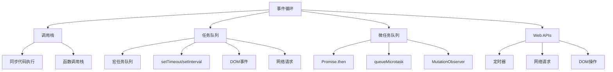

# 事件循环机制

## 事件循环概述

### 事件循环结构


### 执行顺序
| 优先级 | 任务类型 | 示例 |
|--------|----------|------|
| 1 | 同步代码 | 普通函数调用 |
| 2 | 微任务 | Promise.then, queueMicrotask |
| 3 | 宏任务 | setTimeout, setInterval, DOM事件 |

## 调用栈

### 基本概念
```javascript
// 1. 调用栈示例
function first() {
    console.log('First function');
    second();
}

function second() {
    console.log('Second function');
    third();
}

function third() {
    console.log('Third function');
}

first();
// 输出顺序: First function, Second function, Third function

// 2. 调用栈深度
function recursiveFunction(n) {
    if (n <= 0) {
        return;
    }
    console.log(`Level: ${n}`);
    recursiveFunction(n - 1);
}

recursiveFunction(5);
// 输出: Level: 5, Level: 4, Level: 3, Level: 2, Level: 1

// 3. 栈溢出
function stackOverflow() {
    stackOverflow(); // 无限递归
}

// stackOverflow(); // RangeError: Maximum call stack size exceeded
```

### 调用栈分析
```javascript
// 1. 函数调用过程
function outer() {
    console.log('Outer function');
    
    function inner() {
        console.log('Inner function');
        return 'inner result';
    }
    
    const result = inner();
    console.log('Result:', result);
    return 'outer result';
}

const outerResult = outer();
console.log('Outer result:', outerResult);

// 2. 异步函数调用
function asyncFunction() {
    console.log('Async function start');
    
    setTimeout(() => {
        console.log('Timeout callback');
    }, 0);
    
    console.log('Async function end');
}

asyncFunction();
console.log('Main thread continues');

// 输出顺序:
// Async function start
// Async function end
// Main thread continues
// Timeout callback
```

## 任务队列

### 宏任务队列
```javascript
// 1. setTimeout宏任务
console.log('Start');

setTimeout(() => {
    console.log('Timeout 1');
}, 0);

setTimeout(() => {
    console.log('Timeout 2');
}, 0);

console.log('End');

// 输出顺序: Start, End, Timeout 1, Timeout 2

// 2. setInterval宏任务
let count = 0;
const intervalId = setInterval(() => {
    count++;
    console.log(`Interval ${count}`);
    
    if (count >= 3) {
        clearInterval(intervalId);
    }
}, 100);

// 3. DOM事件宏任务
document.addEventListener('click', () => {
    console.log('DOM click event');
});

// 4. 网络请求宏任务
fetch('/api/data')
    .then(response => response.json())
    .then(data => {
        console.log('Network request completed');
    });
```

### 微任务队列
```javascript
// 1. Promise微任务
console.log('Start');

Promise.resolve().then(() => {
    console.log('Promise 1');
});

Promise.resolve().then(() => {
    console.log('Promise 2');
});

console.log('End');

// 输出顺序: Start, End, Promise 1, Promise 2

// 2. queueMicrotask微任务
console.log('Start');

queueMicrotask(() => {
    console.log('Microtask 1');
});

queueMicrotask(() => {
    console.log('Microtask 2');
});

console.log('End');

// 输出顺序: Start, End, Microtask 1, Microtask 2

// 3. MutationObserver微任务
const observer = new MutationObserver(() => {
    console.log('DOM mutation observed');
});

observer.observe(document.body, {
    childList: true,
    subtree: true
});
```

## 事件循环执行过程

### 基本执行流程
```javascript
// 1. 完整的事件循环示例
console.log('1. Start');

setTimeout(() => {
    console.log('2. Timeout');
}, 0);

Promise.resolve().then(() => {
    console.log('3. Promise');
});

queueMicrotask(() => {
    console.log('4. Microtask');
});

console.log('5. End');

// 输出顺序:
// 1. Start
// 5. End
// 3. Promise
// 4. Microtask
// 2. Timeout

// 2. 复杂的事件循环示例
console.log('A');

setTimeout(() => {
    console.log('B');
    
    Promise.resolve().then(() => {
        console.log('C');
    });
    
    queueMicrotask(() => {
        console.log('D');
    });
}, 0);

Promise.resolve().then(() => {
    console.log('E');
    
    setTimeout(() => {
        console.log('F');
    }, 0);
});

console.log('G');

// 输出顺序: A, G, E, B, C, D, F
```

### 事件循环阶段
```javascript
// 1. 事件循环的各个阶段
function eventLoopDemo() {
    console.log('=== 事件循环演示 ===');
    
    // 阶段1: 同步代码执行
    console.log('1. 同步代码');
    
    // 阶段2: 微任务执行
    Promise.resolve().then(() => {
        console.log('2. 微任务 - Promise');
    });
    
    queueMicrotask(() => {
        console.log('3. 微任务 - queueMicrotask');
    });
    
    // 阶段3: 宏任务执行
    setTimeout(() => {
        console.log('4. 宏任务 - setTimeout');
        
        // 宏任务中的微任务
        Promise.resolve().then(() => {
            console.log('5. 宏任务中的微任务');
        });
    }, 0);
    
    // 阶段4: 下一个事件循环
    setTimeout(() => {
        console.log('6. 下一个事件循环');
    }, 0);
}

eventLoopDemo();
```

## 异步操作类型

### 定时器
```javascript
// 1. setTimeout
console.log('Before setTimeout');

setTimeout(() => {
    console.log('Inside setTimeout');
}, 1000);

console.log('After setTimeout');

// 2. setInterval
let counter = 0;
const intervalId = setInterval(() => {
    counter++;
    console.log(`Counter: ${counter}`);
    
    if (counter >= 5) {
        clearInterval(intervalId);
        console.log('Interval cleared');
    }
}, 500);

// 3. 定时器精度问题
console.log('Start time:', Date.now());

setTimeout(() => {
    console.log('Actual delay:', Date.now() - startTime);
}, 100);

const startTime = Date.now();

// 4. 定时器嵌套
setTimeout(() => {
    console.log('First timeout');
    
    setTimeout(() => {
        console.log('Second timeout');
        
        setTimeout(() => {
            console.log('Third timeout');
        }, 100);
    }, 100);
}, 100);
```

### Promise
```javascript
// 1. Promise基本用法
console.log('Start');

const promise = new Promise((resolve, reject) => {
    console.log('Promise executor');
    resolve('Promise resolved');
});

promise.then(value => {
    console.log('Promise then:', value);
});

console.log('End');

// 输出顺序: Start, Promise executor, End, Promise then: Promise resolved

// 2. Promise链式调用
Promise.resolve()
    .then(() => {
        console.log('First then');
        return 'First result';
    })
    .then(result => {
        console.log('Second then:', result);
        return 'Second result';
    })
    .then(result => {
        console.log('Third then:', result);
    });

// 3. Promise错误处理
Promise.reject('Error occurred')
    .then(value => {
        console.log('Success:', value);
    })
    .catch(error => {
        console.log('Error:', error);
    });
```

### async/await
```javascript
// 1. async/await基本用法
async function asyncFunction() {
    console.log('Async function start');
    
    const result = await Promise.resolve('Async result');
    console.log('Async result:', result);
    
    console.log('Async function end');
}

console.log('Before async');
asyncFunction();
console.log('After async');

// 输出顺序: Before async, Async function start, After async, Async result: Async result, Async function end

// 2. async/await错误处理
async function errorHandling() {
    try {
        const result = await Promise.reject('Error occurred');
        console.log('Success:', result);
    } catch (error) {
        console.log('Caught error:', error);
    }
}

errorHandling();

// 3. 并行执行
async function parallelExecution() {
    console.log('Start parallel execution');
    
    const [result1, result2, result3] = await Promise.all([
        Promise.resolve('Result 1'),
        Promise.resolve('Result 2'),
        Promise.resolve('Result 3')
    ]);
    
    console.log('Results:', result1, result2, result3);
}

parallelExecution();
```

## 事件循环优化

### 性能优化
```javascript
// 1. 避免阻塞事件循环
function blockingFunction() {
    const start = Date.now();
    
    // 阻塞操作
    while (Date.now() - start < 1000) {
        // 模拟CPU密集型任务
    }
    
    console.log('Blocking function completed');
}

// 2. 使用setTimeout分解任务
function nonBlockingFunction() {
    let count = 0;
    
    function processChunk() {
        const start = Date.now();
        
        // 处理一小块任务
        while (Date.now() - start < 10 && count < 1000) {
            count++;
        }
        
        if (count < 1000) {
            // 让出控制权，允许其他任务执行
            setTimeout(processChunk, 0);
        } else {
            console.log('Non-blocking function completed');
        }
    }
    
    processChunk();
}

// 3. 使用Web Workers
// main.js
const worker = new Worker('worker.js');

worker.postMessage({ data: 'Hello from main thread' });

worker.onmessage = function(event) {
    console.log('Message from worker:', event.data);
};

// worker.js
self.onmessage = function(event) {
    console.log('Message from main thread:', event.data);
    
    // 执行CPU密集型任务
    const result = performHeavyComputation(event.data);
    
    self.postMessage({ result: result });
};
```

### 内存管理
```javascript
// 1. 清理定时器
let timeoutId;
let intervalId;

function startTimers() {
    timeoutId = setTimeout(() => {
        console.log('Timeout executed');
    }, 1000);
    
    intervalId = setInterval(() => {
        console.log('Interval executed');
    }, 500);
}

function stopTimers() {
    if (timeoutId) {
        clearTimeout(timeoutId);
        timeoutId = null;
    }
    
    if (intervalId) {
        clearInterval(intervalId);
        intervalId = null;
    }
}

// 2. 清理事件监听器
function addEventListener() {
    const handler = () => {
        console.log('Event handled');
    };
    
    document.addEventListener('click', handler);
    
    // 清理监听器
    return () => {
        document.removeEventListener('click', handler);
    };
}

const cleanup = addEventListener();

// 3. 清理Promise
function createPromise() {
    let resolve, reject;
    
    const promise = new Promise((res, rej) => {
        resolve = res;
        reject = rej;
    });
    
    // 返回清理函数
    return {
        promise,
        resolve,
        reject,
        cleanup: () => {
            resolve = null;
            reject = null;
        }
    };
}
```

## 事件循环调试

### 调试工具
```javascript
// 1. 使用console.trace调试调用栈
function functionA() {
    functionB();
}

function functionB() {
    functionC();
}

function functionC() {
    console.trace('Call stack trace');
}

functionA();

// 2. 使用Performance API
function measurePerformance() {
    const start = performance.now();
    
    // 执行一些操作
    setTimeout(() => {
        const end = performance.now();
        console.log(`Operation took ${end - start} milliseconds`);
    }, 100);
}

measurePerformance();

// 3. 监控事件循环延迟
function monitorEventLoop() {
    let lastTime = performance.now();
    
    function checkDelay() {
        const currentTime = performance.now();
        const delay = currentTime - lastTime;
        
        if (delay > 16) { // 超过一帧的时间
            console.warn(`Event loop delay: ${delay}ms`);
        }
        
        lastTime = currentTime;
        setTimeout(checkDelay, 0);
    }
    
    checkDelay();
}

monitorEventLoop();
```

## 相关链接
- [[02-理解掌握层/03-异步编程/02-回调函数模式]] - 回调函数模式
- [[02-理解掌握层/03-异步编程/03-Promise详解]] - Promise详解
- [[02-理解掌握层/03-异步编程/04-async-await语法]] - async-await语法
- [[02-理解掌握层/03-异步编程/05-异步编程模式]] - 异步编程模式
