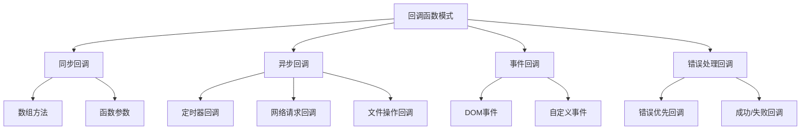

# 回调函数模式

## 回调函数概述

### 回调函数概念


### 回调函数类型
| 类型 | 执行时机 | 示例 | 特点 |
|------|----------|------|------|
| 同步回调 | 立即执行 | Array.map, Array.filter | 阻塞执行 |
| 异步回调 | 延迟执行 | setTimeout, setInterval | 非阻塞执行 |
| 事件回调 | 事件触发时 | addEventListener | 响应式执行 |
| 错误回调 | 错误发生时 | try-catch, error事件 | 异常处理 |

## 同步回调

### 数组方法回调
```javascript
// 1. Array.map() - 同步回调
const numbers = [1, 2, 3, 4, 5];

const doubled = numbers.map(function(num) {
    return num * 2;
});

console.log(doubled); // [2, 4, 6, 8, 10]

// 2. Array.filter() - 同步回调
const evenNumbers = numbers.filter(function(num) {
    return num % 2 === 0;
});

console.log(evenNumbers); // [2, 4]

// 3. Array.reduce() - 同步回调
const sum = numbers.reduce(function(accumulator, current) {
    return accumulator + current;
}, 0);

console.log(sum); // 15

// 4. Array.forEach() - 同步回调
numbers.forEach(function(num, index) {
    console.log(`Index ${index}: ${num}`);
});

// 5. 箭头函数回调
const squared = numbers.map(num => num * num);
console.log(squared); // [1, 4, 9, 16, 25]
```

### 自定义同步回调
```javascript
// 1. 自定义同步回调函数
function processData(data, callback) {
    console.log('Processing data...');
    const result = data.map(item => item * 2);
    callback(result);
}

function handleResult(result) {
    console.log('Result:', result);
}

processData([1, 2, 3], handleResult);
// 输出: Processing data..., Result: [2, 4, 6]

// 2. 内联回调
processData([1, 2, 3], function(result) {
    console.log('Inline callback result:', result);
});

// 3. 箭头函数回调
processData([1, 2, 3], result => {
    console.log('Arrow function result:', result);
});

// 4. 回调函数作为返回值
function createValidator(rule) {
    return function(value) {
        return rule(value);
    };
}

const isEven = createValidator(num => num % 2 === 0);
const isPositive = createValidator(num => num > 0);

console.log(isEven(4)); // true
console.log(isPositive(-1)); // false
```

## 异步回调

### 定时器回调
```javascript
// 1. setTimeout异步回调
console.log('Start');

setTimeout(function() {
    console.log('Timeout callback executed');
}, 1000);

console.log('End');

// 输出顺序: Start, End, Timeout callback executed

// 2. setInterval异步回调
let count = 0;
const intervalId = setInterval(function() {
    count++;
    console.log(`Count: ${count}`);
    
    if (count >= 5) {
        clearInterval(intervalId);
        console.log('Interval stopped');
    }
}, 500);

// 3. 嵌套异步回调
setTimeout(function() {
    console.log('First timeout');
    
    setTimeout(function() {
        console.log('Second timeout');
        
        setTimeout(function() {
            console.log('Third timeout');
        }, 100);
    }, 100);
}, 100);

// 4. 异步回调中的错误处理
setTimeout(function() {
    try {
        throw new Error('Async error');
    } catch (error) {
        console.error('Caught error:', error.message);
    }
}, 100);
```

### 网络请求回调
```javascript
// 1. XMLHttpRequest回调
function fetchData(url, callback) {
    const xhr = new XMLHttpRequest();
    
    xhr.onreadystatechange = function() {
        if (xhr.readyState === 4) {
            if (xhr.status === 200) {
                callback(null, xhr.responseText);
            } else {
                callback(new Error(`HTTP ${xhr.status}`), null);
            }
        }
    };
    
    xhr.open('GET', url);
    xhr.send();
}

fetchData('/api/data', function(error, data) {
    if (error) {
        console.error('Error:', error.message);
    } else {
        console.log('Data:', data);
    }
});

// 2. 模拟异步操作
function simulateAsyncOperation(data, callback) {
    setTimeout(function() {
        if (Math.random() > 0.5) {
            callback(null, `Processed: ${data}`);
        } else {
            callback(new Error('Random error occurred'), null);
        }
    }, 1000);
}

simulateAsyncOperation('test data', function(error, result) {
    if (error) {
        console.error('Operation failed:', error.message);
    } else {
        console.log('Operation successful:', result);
    }
});
```

## 事件回调

### DOM事件回调
```javascript
// 1. 基本事件回调
const button = document.getElementById('myButton');

button.addEventListener('click', function(event) {
    console.log('Button clicked:', event.target);
});

// 2. 多个事件回调
button.addEventListener('mouseover', function(event) {
    console.log('Mouse over button');
});

button.addEventListener('mouseout', function(event) {
    console.log('Mouse out of button');
});

// 3. 事件回调中的this
const obj = {
    name: 'MyObject',
    handleClick: function(event) {
        console.log('Clicked by:', this.name);
    }
};

button.addEventListener('click', obj.handleClick.bind(obj));

// 4. 移除事件回调
function handleClick(event) {
    console.log('Button clicked');
    button.removeEventListener('click', handleClick);
}

button.addEventListener('click', handleClick);
```

### 自定义事件回调
```javascript
// 1. 自定义事件系统
class EventEmitter {
    constructor() {
        this.events = {};
    }
    
    on(event, callback) {
        if (!this.events[event]) {
            this.events[event] = [];
        }
        this.events[event].push(callback);
    }
    
    emit(event, data) {
        if (this.events[event]) {
            this.events[event].forEach(callback => {
                callback(data);
            });
        }
    }
    
    off(event, callback) {
        if (this.events[event]) {
            this.events[event] = this.events[event].filter(cb => cb !== callback);
        }
    }
}

// 2. 使用自定义事件
const emitter = new EventEmitter();

emitter.on('data', function(data) {
    console.log('Received data:', data);
});

emitter.on('error', function(error) {
    console.error('Error occurred:', error);
});

emitter.emit('data', { message: 'Hello World' });
emitter.emit('error', new Error('Something went wrong'));
```

## 错误处理回调

### 错误优先回调
```javascript
// 1. Node.js风格错误优先回调
function readFile(filename, callback) {
    // 模拟文件读取
    setTimeout(function() {
        if (filename === 'error.txt') {
            callback(new Error('File not found'), null);
        } else {
            callback(null, `Content of ${filename}`);
        }
    }, 100);
}

readFile('data.txt', function(error, data) {
    if (error) {
        console.error('Error reading file:', error.message);
    } else {
        console.log('File content:', data);
    }
});

// 2. 链式错误处理
function step1(callback) {
    setTimeout(function() {
        callback(null, 'Step 1 completed');
    }, 100);
}

function step2(data, callback) {
    setTimeout(function() {
        if (data.includes('error')) {
            callback(new Error('Step 2 failed'), null);
        } else {
            callback(null, `${data} -> Step 2 completed`);
        }
    }, 100);
}

function step3(data, callback) {
    setTimeout(function() {
        callback(null, `${data} -> Step 3 completed`);
    }, 100);
}

// 3. 回调链
step1(function(error, result) {
    if (error) {
        console.error('Step 1 error:', error.message);
        return;
    }
    
    step2(result, function(error, result) {
        if (error) {
            console.error('Step 2 error:', error.message);
            return;
        }
        
        step3(result, function(error, result) {
            if (error) {
                console.error('Step 3 error:', error.message);
                return;
            }
            
            console.log('Final result:', result);
        });
    });
});
```

### 成功/失败回调
```javascript
// 1. 成功/失败分离的回调
function asyncOperation(data, onSuccess, onError) {
    setTimeout(function() {
        if (Math.random() > 0.5) {
            onSuccess(`Success: ${data}`);
        } else {
            onError(new Error('Operation failed'));
        }
    }, 1000);
}

asyncOperation('test data', 
    function(result) {
        console.log('Success:', result);
    },
    function(error) {
        console.error('Error:', error.message);
    }
);

// 2. 对象形式回调
function asyncOperationWithObject(data, callbacks) {
    setTimeout(function() {
        if (Math.random() > 0.5) {
            callbacks.onSuccess(`Success: ${data}`);
        } else {
            callbacks.onError(new Error('Operation failed'));
        }
    }, 1000);
}

asyncOperationWithObject('test data', {
    onSuccess: function(result) {
        console.log('Success:', result);
    },
    onError: function(error) {
        console.error('Error:', error.message);
    }
});
```

## 回调函数最佳实践

### 避免回调地狱
```javascript
// 1. 回调地狱示例
function callbackHell() {
    step1(function(error, result1) {
        if (error) {
            console.error('Step 1 error:', error);
            return;
        }
        
        step2(result1, function(error, result2) {
            if (error) {
                console.error('Step 2 error:', error);
                return;
            }
            
            step3(result2, function(error, result3) {
                if (error) {
                    console.error('Step 3 error:', error);
                    return;
                }
                
                step4(result3, function(error, result4) {
                    if (error) {
                        console.error('Step 4 error:', error);
                        return;
                    }
                    
                    console.log('Final result:', result4);
                });
            });
        });
    });
}

// 2. 使用命名函数避免回调地狱
function handleStep1(error, result) {
    if (error) {
        console.error('Step 1 error:', error);
        return;
    }
    
    step2(result, handleStep2);
}

function handleStep2(error, result) {
    if (error) {
        console.error('Step 2 error:', error);
        return;
    }
    
    step3(result, handleStep3);
}

function handleStep3(error, result) {
    if (error) {
        console.error('Step 3 error:', error);
        return;
    }
    
    step4(result, handleStep4);
}

function handleStep4(error, result) {
    if (error) {
        console.error('Step 4 error:', error);
        return;
    }
    
    console.log('Final result:', result);
}

step1(handleStep1);
```

### 回调函数优化
```javascript
// 1. 回调函数缓存
const callbackCache = new Map();

function getCachedCallback(key, callback) {
    if (callbackCache.has(key)) {
        return callbackCache.get(key);
    }
    
    const cachedCallback = function(...args) {
        callback(...args);
        callbackCache.delete(key);
    };
    
    callbackCache.set(key, cachedCallback);
    return cachedCallback;
}

// 2. 回调函数防抖
function debounce(callback, delay) {
    let timeoutId;
    
    return function(...args) {
        clearTimeout(timeoutId);
        timeoutId = setTimeout(() => {
            callback.apply(this, args);
        }, delay);
    };
}

const debouncedCallback = debounce(function(data) {
    console.log('Debounced callback:', data);
}, 300);

// 3. 回调函数节流
function throttle(callback, delay) {
    let lastCall = 0;
    
    return function(...args) {
        const now = Date.now();
        
        if (now - lastCall >= delay) {
            lastCall = now;
            callback.apply(this, args);
        }
    };
}

const throttledCallback = throttle(function(data) {
    console.log('Throttled callback:', data);
}, 100);
```

## 相关链接
- [[02-理解掌握层/03-异步编程/01-事件循环机制]] - 事件循环机制
- [[02-理解掌握层/03-异步编程/03-Promise详解]] - Promise详解
- [[02-理解掌握层/03-异步编程/04-async-await语法]] - async-await语法
- [[02-理解掌握层/03-异步编程/05-异步编程模式]] - 异步编程模式
