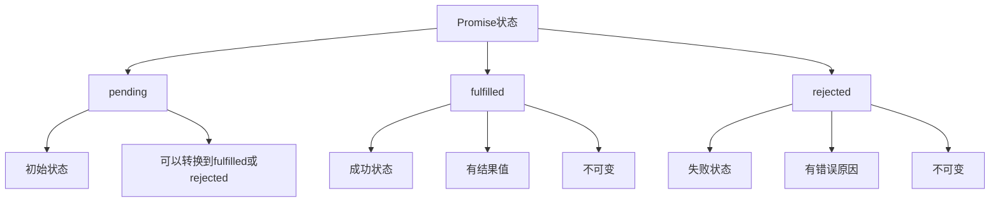

# Promise详解

## Promise概述

### Promise状态


### Promise状态转换
| 状态 | 描述 | 转换条件 | 结果 |
|------|------|----------|------|
| pending | 初始状态 | - | 无结果 |
| fulfilled | 成功状态 | resolve()调用 | 有结果值 |
| rejected | 失败状态 | reject()调用 | 有错误原因 |

## Promise基本用法

### 创建Promise
```javascript
// 1. 基本Promise创建
const promise = new Promise((resolve, reject) => {
    // 异步操作
    setTimeout(() => {
        const success = Math.random() > 0.5;
        
        if (success) {
            resolve('操作成功');
        } else {
            reject(new Error('操作失败'));
        }
    }, 1000);
});

// 2. 立即resolve的Promise
const resolvedPromise = Promise.resolve('立即成功');

// 3. 立即reject的Promise
const rejectedPromise = Promise.reject(new Error('立即失败'));

// 4. 使用Promise
promise
    .then(result => {
        console.log('成功:', result);
    })
    .catch(error => {
        console.error('失败:', error.message);
    });
```

### Promise执行器
```javascript
// 1. Promise执行器函数
function createPromise(shouldResolve) {
    return new Promise((resolve, reject) => {
        console.log('Promise执行器开始执行');
        
        setTimeout(() => {
            if (shouldResolve) {
                resolve('Promise resolved');
            } else {
                reject(new Error('Promise rejected'));
            }
        }, 1000);
    });
}

// 2. 执行器中的同步代码
const syncPromise = new Promise((resolve, reject) => {
    console.log('同步代码执行');
    resolve('同步resolve');
});

console.log('Promise创建完成');

// 3. 执行器中的错误处理
const errorPromise = new Promise((resolve, reject) => {
    try {
        throw new Error('执行器中的错误');
    } catch (error) {
        reject(error);
    }
});
```

## Promise方法

### then方法
```javascript
// 1. 基本then用法
const promise = Promise.resolve('Hello');

promise
    .then(value => {
        console.log('第一个then:', value);
        return value + ' World';
    })
    .then(value => {
        console.log('第二个then:', value);
        return value.toUpperCase();
    })
    .then(value => {
        console.log('第三个then:', value);
    });

// 2. then中的错误处理
const errorPromise = Promise.reject(new Error('Something went wrong'));

errorPromise
    .then(value => {
        console.log('成功:', value);
    })
    .then(null, error => {
        console.error('错误:', error.message);
    });

// 3. then返回Promise
const promise1 = Promise.resolve('First');
const promise2 = Promise.resolve('Second');

promise1
    .then(value => {
        console.log('第一个Promise:', value);
        return promise2;
    })
    .then(value => {
        console.log('第二个Promise:', value);
    });
```

### catch方法
```javascript
// 1. 基本catch用法
const promise = Promise.reject(new Error('操作失败'));

promise
    .then(value => {
        console.log('成功:', value);
    })
    .catch(error => {
        console.error('捕获错误:', error.message);
    });

// 2. catch链式调用
const promise = Promise.resolve('Hello');

promise
    .then(value => {
        console.log('第一步:', value);
        throw new Error('第二步出错');
    })
    .then(value => {
        console.log('第二步:', value);
    })
    .catch(error => {
        console.error('捕获错误:', error.message);
        return '错误恢复';
    })
    .then(value => {
        console.log('错误恢复后:', value);
    });

// 3. 多个catch
const promise = Promise.reject(new Error('初始错误'));

promise
    .catch(error => {
        console.error('第一个catch:', error.message);
        throw new Error('第二个错误');
    })
    .catch(error => {
        console.error('第二个catch:', error.message);
    });
```

### finally方法
```javascript
// 1. 基本finally用法
const promise = Promise.resolve('成功');

promise
    .then(value => {
        console.log('成功:', value);
    })
    .catch(error => {
        console.error('错误:', error.message);
    })
    .finally(() => {
        console.log('无论成功失败都会执行');
    });

// 2. finally中的返回值
const promise = Promise.resolve('Hello');

promise
    .then(value => {
        console.log('成功:', value);
        return 'Modified';
    })
    .finally(() => {
        console.log('Finally执行');
        return 'Finally返回值'; // 这个返回值会被忽略
    })
    .then(value => {
        console.log('最终值:', value); // "Modified"
    });

// 3. finally中的错误
const promise = Promise.resolve('Hello');

promise
    .then(value => {
        console.log('成功:', value);
    })
    .finally(() => {
        console.log('Finally执行');
        throw new Error('Finally中的错误');
    })
    .catch(error => {
        console.error('捕获错误:', error.message);
    });
```

## Promise静态方法

### Promise.all
```javascript
// 1. 基本Promise.all用法
const promise1 = Promise.resolve('第一个');
const promise2 = Promise.resolve('第二个');
const promise3 = Promise.resolve('第三个');

Promise.all([promise1, promise2, promise3])
    .then(values => {
        console.log('所有Promise都成功:', values);
        // 输出: ['第一个', '第二个', '第三个']
    });

// 2. Promise.all中的错误处理
const promise1 = Promise.resolve('成功');
const promise2 = Promise.reject(new Error('失败'));
const promise3 = Promise.resolve('成功');

Promise.all([promise1, promise2, promise3])
    .then(values => {
        console.log('所有Promise都成功:', values);
    })
    .catch(error => {
        console.error('有Promise失败:', error.message);
    });

// 3. Promise.all与异步操作
function delay(ms, value) {
    return new Promise(resolve => {
        setTimeout(() => resolve(value), ms);
    });
}

Promise.all([
    delay(100, '第一个'),
    delay(200, '第二个'),
    delay(300, '第三个')
])
.then(values => {
    console.log('所有延迟操作完成:', values);
});
```

### Promise.race
```javascript
// 1. 基本Promise.race用法
const promise1 = new Promise(resolve => {
    setTimeout(() => resolve('第一个完成'), 100);
});

const promise2 = new Promise(resolve => {
    setTimeout(() => resolve('第二个完成'), 200);
});

Promise.race([promise1, promise2])
    .then(value => {
        console.log('最先完成的Promise:', value);
        // 输出: '第一个完成'
    });

// 2. Promise.race中的错误处理
const promise1 = new Promise(resolve => {
    setTimeout(() => resolve('成功'), 100);
});

const promise2 = new Promise((resolve, reject) => {
    setTimeout(() => reject(new Error('失败')), 50);
});

Promise.race([promise1, promise2])
    .then(value => {
        console.log('成功:', value);
    })
    .catch(error => {
        console.error('失败:', error.message);
    });

// 3. 超时控制
function timeout(ms) {
    return new Promise((resolve, reject) => {
        setTimeout(() => reject(new Error('超时')), ms);
    });
}

function fetchData() {
    return new Promise(resolve => {
        setTimeout(() => resolve('数据'), 200);
    });
}

Promise.race([fetchData(), timeout(100)])
    .then(data => {
        console.log('数据获取成功:', data);
    })
    .catch(error => {
        console.error('操作失败:', error.message);
    });
```

### Promise.allSettled
```javascript
// 1. 基本Promise.allSettled用法
const promise1 = Promise.resolve('成功');
const promise2 = Promise.reject(new Error('失败'));
const promise3 = Promise.resolve('成功');

Promise.allSettled([promise1, promise2, promise3])
    .then(results => {
        results.forEach((result, index) => {
            if (result.status === 'fulfilled') {
                console.log(`Promise ${index + 1} 成功:`, result.value);
            } else {
                console.log(`Promise ${index + 1} 失败:`, result.reason.message);
            }
        });
    });

// 2. 处理allSettled结果
function processResults(results) {
    const successful = results
        .filter(result => result.status === 'fulfilled')
        .map(result => result.value);
    
    const failed = results
        .filter(result => result.status === 'rejected')
        .map(result => result.reason);
    
    console.log('成功的Promise:', successful);
    console.log('失败的Promise:', failed);
}

Promise.allSettled([
    Promise.resolve('成功1'),
    Promise.reject(new Error('失败1')),
    Promise.resolve('成功2')
])
.then(processResults);
```

### Promise.any
```javascript
// 1. 基本Promise.any用法
const promise1 = Promise.reject(new Error('失败1'));
const promise2 = Promise.resolve('成功2');
const promise3 = Promise.reject(new Error('失败3'));

Promise.any([promise1, promise2, promise3])
    .then(value => {
        console.log('第一个成功的Promise:', value);
        // 输出: '成功2'
    });

// 2. Promise.any中的错误处理
const promise1 = Promise.reject(new Error('失败1'));
const promise2 = Promise.reject(new Error('失败2'));
const promise3 = Promise.reject(new Error('失败3'));

Promise.any([promise1, promise2, promise3])
    .then(value => {
        console.log('成功:', value);
    })
    .catch(error => {
        console.error('所有Promise都失败:', error.message);
        console.error('错误列表:', error.errors);
    });

// 3. 使用Promise.any实现容错
function fetchWithFallback(urls) {
    const promises = urls.map(url => 
        fetch(url).then(response => {
            if (!response.ok) {
                throw new Error(`HTTP ${response.status}`);
            }
            return response.json();
        })
    );
    
    return Promise.any(promises);
}

fetchWithFallback([
    '/api/primary',
    '/api/backup1',
    '/api/backup2'
])
.then(data => {
    console.log('数据获取成功:', data);
})
.catch(error => {
    console.error('所有API都失败:', error.message);
});
```

## Promise高级用法

### Promise链式调用
```javascript
// 1. 复杂Promise链
function step1() {
    return new Promise(resolve => {
        setTimeout(() => resolve('步骤1完成'), 100);
    });
}

function step2(data) {
    return new Promise(resolve => {
        setTimeout(() => resolve(`${data} -> 步骤2完成`), 100);
    });
}

function step3(data) {
    return new Promise(resolve => {
        setTimeout(() => resolve(`${data} -> 步骤3完成`), 100);
    });
}

step1()
    .then(step2)
    .then(step3)
    .then(result => {
        console.log('最终结果:', result);
    })
    .catch(error => {
        console.error('链式调用出错:', error.message);
    });

// 2. 条件Promise链
function conditionalPromise(condition) {
    return new Promise(resolve => {
        setTimeout(() => resolve(condition), 100);
    });
}

conditionalPromise(true)
    .then(condition => {
        if (condition) {
            return Promise.resolve('条件为真');
        } else {
            return Promise.resolve('条件为假');
        }
    })
    .then(result => {
        console.log('条件结果:', result);
    });
```

### Promise错误处理
```javascript
// 1. 全局错误处理
window.addEventListener('unhandledrejection', event => {
    console.error('未处理的Promise拒绝:', event.reason);
    event.preventDefault();
});

// 2. 错误恢复
function recoverableOperation() {
    return new Promise((resolve, reject) => {
        setTimeout(() => {
            if (Math.random() > 0.5) {
                reject(new Error('操作失败'));
            } else {
                resolve('操作成功');
            }
        }, 100);
    });
}

recoverableOperation()
    .catch(error => {
        console.error('第一次尝试失败:', error.message);
        return recoverableOperation(); // 重试
    })
    .catch(error => {
        console.error('第二次尝试失败:', error.message);
        return '使用默认值'; // 使用默认值
    })
    .then(result => {
        console.log('最终结果:', result);
    });

// 3. 错误分类处理
function handleDifferentErrors(promise) {
    return promise
        .then(result => result)
        .catch(error => {
            if (error instanceof TypeError) {
                console.error('类型错误:', error.message);
                return '类型错误默认值';
            } else if (error instanceof ReferenceError) {
                console.error('引用错误:', error.message);
                return '引用错误默认值';
            } else {
                console.error('未知错误:', error.message);
                throw error;
            }
        });
}
```

## Promise最佳实践

### 性能优化
```javascript
// 1. Promise缓存
const promiseCache = new Map();

function cachedPromise(key, promiseFactory) {
    if (promiseCache.has(key)) {
        return promiseCache.get(key);
    }
    
    const promise = promiseFactory();
    promiseCache.set(key, promise);
    
    // 缓存过期后清理
    promise.finally(() => {
        setTimeout(() => {
            promiseCache.delete(key);
        }, 60000); // 1分钟后清理
    });
    
    return promise;
}

// 2. Promise并发控制
class PromisePool {
    constructor(concurrency = 5) {
        this.concurrency = concurrency;
        this.running = 0;
        this.queue = [];
    }
    
    add(promiseFactory) {
        return new Promise((resolve, reject) => {
            this.queue.push({
                promiseFactory,
                resolve,
                reject
            });
            
            this.process();
        });
    }
    
    process() {
        if (this.running >= this.concurrency || this.queue.length === 0) {
            return;
        }
        
        this.running++;
        const { promiseFactory, resolve, reject } = this.queue.shift();
        
        promiseFactory()
            .then(resolve)
            .catch(reject)
            .finally(() => {
                this.running--;
                this.process();
            });
    }
}

// 使用Promise池
const pool = new PromisePool(3);

for (let i = 0; i < 10; i++) {
    pool.add(() => 
        new Promise(resolve => 
            setTimeout(() => resolve(`任务${i}完成`), 1000)
        )
    );
}
```

### 代码组织
```javascript
// 1. Promise工具函数
class PromiseUtils {
    static delay(ms, value) {
        return new Promise(resolve => {
            setTimeout(() => resolve(value), ms);
        });
    }
    
    static timeout(ms, promise) {
        return Promise.race([
            promise,
            new Promise((resolve, reject) => {
                setTimeout(() => reject(new Error('超时')), ms);
            })
        ]);
    }
    
    static retry(promiseFactory, maxRetries = 3) {
        return promiseFactory().catch(error => {
            if (maxRetries > 0) {
                return this.retry(promiseFactory, maxRetries - 1);
            }
            throw error;
        });
    }
    
    static sequence(promises) {
        return promises.reduce((chain, promise) => {
            return chain.then(() => promise);
        }, Promise.resolve());
    }
}

// 2. 使用工具函数
PromiseUtils.retry(() => 
    fetch('/api/data').then(response => response.json())
)
.then(data => {
    console.log('数据获取成功:', data);
})
.catch(error => {
    console.error('重试后仍然失败:', error.message);
});
```

## 相关链接
- [[02-理解掌握层/03-异步编程/01-事件循环机制]] - 事件循环机制
- [[02-理解掌握层/03-异步编程/02-回调函数模式]] - 回调函数模式
- [[02-理解掌握层/03-异步编程/04-async-await语法]] - async-await语法
- [[02-理解掌握层/03-异步编程/05-异步编程模式]] - 异步编程模式
