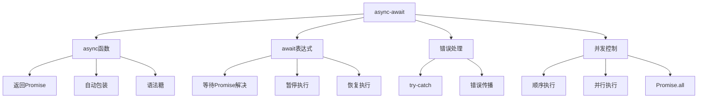

# async-await语法

## async-await概述

### async-await特性


### async-await优势
| 特性 | 描述 | 优势 |
|------|------|------|
| 语法简洁 | 类似同步代码 | 易读易写 |
| 错误处理 | 使用try-catch | 统一错误处理 |
| 调试友好 | 支持断点调试 | 开发体验好 |
| 类型安全 | TypeScript支持 | 类型检查 |

## async函数

### 基本async函数
```javascript
// 1. 基本async函数声明
async function fetchData() {
    return 'Hello World';
}

// 2. async函数表达式
const fetchData = async function() {
    return 'Hello World';
};

// 3. async箭头函数
const fetchData = async () => {
    return 'Hello World';
};

// 4. async方法
class ApiService {
    async getData() {
        return 'Data from API';
    }
}

// 5. async函数返回Promise
async function asyncFunction() {
    return 'Hello';
}

console.log(asyncFunction()); // Promise { 'Hello' }

asyncFunction().then(value => {
    console.log(value); // 'Hello'
});
```

### async函数特性
```javascript
// 1. async函数自动返回Promise
async function returnValue() {
    return 42;
}

async function returnPromise() {
    return Promise.resolve(42);
}

async function returnAsync() {
    return await Promise.resolve(42);
}

// 所有函数都返回相同的Promise
console.log(returnValue()); // Promise { 42 }
console.log(returnPromise()); // Promise { 42 }
console.log(returnAsync()); // Promise { 42 }

// 2. async函数中的同步代码
async function mixedFunction() {
    console.log('同步代码1');
    
    const result = await Promise.resolve('异步结果');
    
    console.log('同步代码2');
    console.log('异步结果:', result);
    
    return '完成';
}

mixedFunction();
// 输出: 同步代码1, 同步代码2, 异步结果: 异步结果

// 3. async函数中的错误
async function errorFunction() {
    throw new Error('async函数中的错误');
}

errorFunction()
    .catch(error => {
        console.error('捕获错误:', error.message);
    });
```

## await表达式

### 基本await用法
```javascript
// 1. 基本await用法
async function basicAwait() {
    const result = await Promise.resolve('Hello World');
    console.log(result); // 'Hello World'
    return result;
}

// 2. await等待Promise解决
async function waitForPromise() {
    const promise = new Promise(resolve => {
        setTimeout(() => resolve('延迟结果'), 1000);
    });
    
    console.log('开始等待...');
    const result = await promise;
    console.log('等待完成:', result);
    
    return result;
}

// 3. await等待多个Promise
async function waitForMultiple() {
    const promise1 = Promise.resolve('第一个');
    const promise2 = Promise.resolve('第二个');
    const promise3 = Promise.resolve('第三个');
    
    const result1 = await promise1;
    const result2 = await promise2;
    const result3 = await promise3;
    
    console.log(result1, result2, result3);
    return [result1, result2, result3];
}

// 4. await在循环中使用
async function awaitInLoop() {
    const promises = [
        Promise.resolve('任务1'),
        Promise.resolve('任务2'),
        Promise.resolve('任务3')
    ];
    
    const results = [];
    
    for (const promise of promises) {
        const result = await promise;
        results.push(result);
        console.log('完成:', result);
    }
    
    return results;
}
```

### await错误处理
```javascript
// 1. await中的错误处理
async function awaitWithError() {
    try {
        const result = await Promise.reject(new Error('操作失败'));
        console.log('成功:', result);
    } catch (error) {
        console.error('捕获错误:', error.message);
    }
}

// 2. await错误传播
async function errorPropagation() {
    const result = await Promise.reject(new Error('错误传播'));
    return result; // 这行不会执行
}

errorPropagation()
    .catch(error => {
        console.error('外部捕获:', error.message);
    });

// 3. 多个await的错误处理
async function multipleAwaitError() {
    try {
        const result1 = await Promise.resolve('成功1');
        const result2 = await Promise.reject(new Error('失败2'));
        const result3 = await Promise.resolve('成功3'); // 不会执行
        
        return [result1, result2, result3];
    } catch (error) {
        console.error('捕获错误:', error.message);
        return '错误恢复';
    }
}
```

## 错误处理

### try-catch错误处理
```javascript
// 1. 基本try-catch
async function basicErrorHandling() {
    try {
        const result = await fetchData();
        console.log('成功:', result);
        return result;
    } catch (error) {
        console.error('错误:', error.message);
        throw error; // 重新抛出错误
    }
}

// 2. 嵌套try-catch
async function nestedErrorHandling() {
    try {
        const user = await fetchUser();
        
        try {
            const profile = await fetchProfile(user.id);
            return { user, profile };
        } catch (profileError) {
            console.error('获取用户资料失败:', profileError.message);
            return { user, profile: null };
        }
    } catch (userError) {
        console.error('获取用户失败:', userError.message);
        throw userError;
    }
}

// 3. 错误分类处理
async function categorizedErrorHandling() {
    try {
        const result = await riskyOperation();
        return result;
    } catch (error) {
        if (error instanceof TypeError) {
            console.error('类型错误:', error.message);
            return '类型错误默认值';
        } else if (error instanceof ReferenceError) {
            console.error('引用错误:', error.message);
            return '引用错误默认值';
        } else {
            console.error('未知错误:', error.message);
            throw error;
        }
    }
}
```

### 错误恢复
```javascript
// 1. 错误恢复机制
async function errorRecovery() {
    let attempts = 0;
    const maxAttempts = 3;
    
    while (attempts < maxAttempts) {
        try {
            const result = await unreliableOperation();
            return result;
        } catch (error) {
            attempts++;
            console.error(`尝试 ${attempts} 失败:`, error.message);
            
            if (attempts >= maxAttempts) {
                throw new Error('所有尝试都失败了');
            }
            
            // 等待后重试
            await new Promise(resolve => setTimeout(resolve, 1000 * attempts));
        }
    }
}

// 2. 降级处理
async function fallbackHandling() {
    try {
        return await primaryOperation();
    } catch (error) {
        console.error('主要操作失败:', error.message);
        
        try {
            return await fallbackOperation();
        } catch (fallbackError) {
            console.error('降级操作也失败:', fallbackError.message);
            return '使用默认值';
        }
    }
}

// 3. 部分成功处理
async function partialSuccessHandling() {
    const results = [];
    const errors = [];
    
    const operations = [
        () => Promise.resolve('成功1'),
        () => Promise.reject(new Error('失败2')),
        () => Promise.resolve('成功3')
    ];
    
    for (const operation of operations) {
        try {
            const result = await operation();
            results.push(result);
        } catch (error) {
            errors.push(error);
        }
    }
    
    return { results, errors };
}
```

## 并发控制

### 顺序执行
```javascript
// 1. 顺序执行await
async function sequentialExecution() {
    console.log('开始顺序执行');
    
    const result1 = await delay(1000, '任务1');
    console.log('任务1完成:', result1);
    
    const result2 = await delay(1000, '任务2');
    console.log('任务2完成:', result2);
    
    const result3 = await delay(1000, '任务3');
    console.log('任务3完成:', result3);
    
    return [result1, result2, result3];
}

// 2. 顺序执行优化
async function optimizedSequential() {
    const tasks = [
        () => delay(1000, '任务1'),
        () => delay(1000, '任务2'),
        () => delay(1000, '任务3')
    ];
    
    const results = [];
    
    for (const task of tasks) {
        const result = await task();
        results.push(result);
        console.log('任务完成:', result);
    }
    
    return results;
}

// 3. 条件顺序执行
async function conditionalSequential(condition) {
    const result1 = await firstTask();
    
    if (condition) {
        const result2 = await secondTask();
        return [result1, result2];
    } else {
        const result3 = await thirdTask();
        return [result1, result3];
    }
}
```

### 并行执行
```javascript
// 1. 使用Promise.all并行执行
async function parallelExecution() {
    console.log('开始并行执行');
    
    const [result1, result2, result3] = await Promise.all([
        delay(1000, '任务1'),
        delay(1000, '任务2'),
        delay(1000, '任务3')
    ]);
    
    console.log('所有任务完成:', result1, result2, result3);
    return [result1, result2, result3];
}

// 2. 并行执行错误处理
async function parallelWithErrorHandling() {
    try {
        const [result1, result2, result3] = await Promise.all([
            delay(1000, '任务1'),
            delay(1000, '任务2'),
            Promise.reject(new Error('任务3失败'))
        ]);
        
        return [result1, result2, result3];
    } catch (error) {
        console.error('并行执行失败:', error.message);
        throw error;
    }
}

// 3. 部分并行执行
async function partialParallel() {
    // 先执行第一个任务
    const result1 = await delay(1000, '任务1');
    
    // 然后并行执行剩余任务
    const [result2, result3] = await Promise.all([
        delay(1000, '任务2'),
        delay(1000, '任务3')
    ]);
    
    return [result1, result2, result3];
}
```

### 并发限制
```javascript
// 1. 并发限制实现
class ConcurrencyLimiter {
    constructor(limit) {
        this.limit = limit;
        this.running = 0;
        this.queue = [];
    }
    
    async execute(task) {
        return new Promise((resolve, reject) => {
            this.queue.push({ task, resolve, reject });
            this.process();
        });
    }
    
    async process() {
        if (this.running >= this.limit || this.queue.length === 0) {
            return;
        }
        
        this.running++;
        const { task, resolve, reject } = this.queue.shift();
        
        try {
            const result = await task();
            resolve(result);
        } catch (error) {
            reject(error);
        } finally {
            this.running--;
            this.process();
        }
    }
}

// 2. 使用并发限制
const limiter = new ConcurrencyLimiter(3);

async function limitedConcurrency() {
    const tasks = Array.from({ length: 10 }, (_, i) => 
        () => delay(1000, `任务${i + 1}`)
    );
    
    const results = await Promise.all(
        tasks.map(task => limiter.execute(task))
    );
    
    return results;
}
```

## 实际应用

### API调用
```javascript
// 1. 基本API调用
async function fetchUserData(userId) {
    try {
        const response = await fetch(`/api/users/${userId}`);
        
        if (!response.ok) {
            throw new Error(`HTTP ${response.status}: ${response.statusText}`);
        }
        
        const userData = await response.json();
        return userData;
    } catch (error) {
        console.error('获取用户数据失败:', error.message);
        throw error;
    }
}

// 2. 多个API调用
async function fetchUserProfile(userId) {
    try {
        const [user, posts, comments] = await Promise.all([
            fetch(`/api/users/${userId}`).then(r => r.json()),
            fetch(`/api/users/${userId}/posts`).then(r => r.json()),
            fetch(`/api/users/${userId}/comments`).then(r => r.json())
        ]);
        
        return { user, posts, comments };
    } catch (error) {
        console.error('获取用户资料失败:', error.message);
        throw error;
    }
}

// 3. API调用重试
async function fetchWithRetry(url, maxRetries = 3) {
    let lastError;
    
    for (let i = 0; i < maxRetries; i++) {
        try {
            const response = await fetch(url);
            
            if (!response.ok) {
                throw new Error(`HTTP ${response.status}`);
            }
            
            return await response.json();
        } catch (error) {
            lastError = error;
            console.error(`尝试 ${i + 1} 失败:`, error.message);
            
            if (i < maxRetries - 1) {
                await delay(1000 * Math.pow(2, i)); // 指数退避
            }
        }
    }
    
    throw lastError;
}
```

### 文件操作
```javascript
// 1. 文件读取
async function readFile(filePath) {
    try {
        const response = await fetch(filePath);
        
        if (!response.ok) {
            throw new Error(`无法读取文件: ${filePath}`);
        }
        
        const content = await response.text();
        return content;
    } catch (error) {
        console.error('文件读取失败:', error.message);
        throw error;
    }
}

// 2. 批量文件处理
async function processFiles(filePaths) {
    const results = [];
    const errors = [];
    
    for (const filePath of filePaths) {
        try {
            const content = await readFile(filePath);
            const processed = await processContent(content);
            results.push({ filePath, processed });
        } catch (error) {
            errors.push({ filePath, error: error.message });
        }
    }
    
    return { results, errors };
}

// 3. 文件上传
async function uploadFile(file) {
    const formData = new FormData();
    formData.append('file', file);
    
    try {
        const response = await fetch('/api/upload', {
            method: 'POST',
            body: formData
        });
        
        if (!response.ok) {
            throw new Error(`上传失败: ${response.statusText}`);
        }
        
        const result = await response.json();
        return result;
    } catch (error) {
        console.error('文件上传失败:', error.message);
        throw error;
    }
}
```

## 相关链接
- [[02-理解掌握层/03-异步编程/01-事件循环机制]] - 事件循环机制
- [[02-理解掌握层/03-异步编程/02-回调函数模式]] - 回调函数模式
- [[02-理解掌握层/03-异步编程/03-Promise详解]] - Promise详解
- [[02-理解掌握层/03-异步编程/05-异步编程模式]] - 异步编程模式
