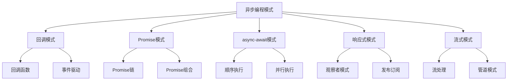

# 异步编程模式

## 异步编程模式概述

### 异步模式分类


### 异步模式对比
| 模式 | 优点 | 缺点 | 适用场景 |
|------|------|------|----------|
| 回调模式 | 简单直接 | 回调地狱 | 简单异步操作 |
| Promise模式 | 链式调用 | 语法复杂 | 复杂异步流程 |
| async-await | 语法简洁 | 需要ES2017 | 现代异步开发 |
| 响应式模式 | 事件驱动 | 学习曲线陡 | 实时数据处理 |
| 流式模式 | 内存效率 | 复杂度高 | 大数据处理 |

## 回调模式

### 基本回调模式
```javascript
// 1. 基本回调函数
function fetchData(callback) {
    setTimeout(() => {
        const data = { id: 1, name: 'John' };
        callback(null, data);
    }, 1000);
}

function handleData(error, data) {
    if (error) {
        console.error('错误:', error);
    } else {
        console.log('数据:', data);
    }
}

fetchData(handleData);

// 2. 错误优先回调
function processFile(filename, callback) {
    // 模拟文件处理
    setTimeout(() => {
        if (filename === 'error.txt') {
            callback(new Error('文件不存在'), null);
        } else {
            callback(null, `处理文件: ${filename}`);
        }
    }, 500);
}

processFile('data.txt', (error, result) => {
    if (error) {
        console.error('处理失败:', error.message);
    } else {
        console.log('处理成功:', result);
    }
});

// 3. 回调函数组合
function step1(callback) {
    setTimeout(() => callback(null, '步骤1完成'), 100);
}

function step2(data, callback) {
    setTimeout(() => callback(null, `${data} -> 步骤2完成`), 100);
}

function step3(data, callback) {
    setTimeout(() => callback(null, `${data} -> 步骤3完成`), 100);
}

// 回调链
step1((error, result1) => {
    if (error) return console.error('步骤1失败:', error);
    
    step2(result1, (error, result2) => {
        if (error) return console.error('步骤2失败:', error);
        
        step3(result2, (error, result3) => {
            if (error) return console.error('步骤3失败:', error);
            
            console.log('最终结果:', result3);
        });
    });
});
```

### 事件驱动模式
```javascript
// 1. 事件发射器
class EventEmitter {
    constructor() {
        this.events = {};
    }
    
    on(event, callback) {
        if (!this.events[event]) {
            this.events[event] = [];
        }
        this.events[event].push(callback);
    }
    
    emit(event, data) {
        if (this.events[event]) {
            this.events[event].forEach(callback => {
                callback(data);
            });
        }
    }
    
    off(event, callback) {
        if (this.events[event]) {
            this.events[event] = this.events[event].filter(cb => cb !== callback);
        }
    }
}

// 2. 使用事件驱动
const emitter = new EventEmitter();

emitter.on('data', (data) => {
    console.log('接收到数据:', data);
});

emitter.on('error', (error) => {
    console.error('发生错误:', error);
});

// 模拟异步操作
setTimeout(() => {
    emitter.emit('data', { message: 'Hello World' });
}, 1000);

setTimeout(() => {
    emitter.emit('error', new Error('操作失败'));
}, 2000);

// 3. 事件驱动的工作流
class Workflow {
    constructor() {
        this.emitter = new EventEmitter();
        this.setupListeners();
    }
    
    setupListeners() {
        this.emitter.on('start', this.onStart.bind(this));
        this.emitter.on('process', this.onProcess.bind(this));
        this.emitter.on('complete', this.onComplete.bind(this));
        this.emitter.on('error', this.onError.bind(this));
    }
    
    onStart(data) {
        console.log('工作流开始:', data);
        this.emitter.emit('process', data);
    }
    
    onProcess(data) {
        console.log('处理数据:', data);
        // 模拟处理
        setTimeout(() => {
            this.emitter.emit('complete', { ...data, processed: true });
        }, 1000);
    }
    
    onComplete(data) {
        console.log('工作流完成:', data);
    }
    
    onError(error) {
        console.error('工作流错误:', error);
    }
    
    start(data) {
        this.emitter.emit('start', data);
    }
}

const workflow = new Workflow();
workflow.start({ id: 1, name: 'test' });
```

## Promise模式

### Promise链模式
```javascript
// 1. 基本Promise链
function fetchUser(id) {
    return new Promise((resolve, reject) => {
        setTimeout(() => {
            if (id > 0) {
                resolve({ id, name: `User${id}` });
            } else {
                reject(new Error('无效的用户ID'));
            }
        }, 100);
    });
}

function fetchPosts(userId) {
    return new Promise((resolve) => {
        setTimeout(() => {
            resolve([{ id: 1, title: 'Post 1' }, { id: 2, title: 'Post 2' }]);
        }, 100);
    });
}

function fetchComments(postId) {
    return new Promise((resolve) => {
        setTimeout(() => {
            resolve([{ id: 1, text: 'Comment 1' }, { id: 2, text: 'Comment 2' }]);
        }, 100);
    });
}

// Promise链
fetchUser(1)
    .then(user => {
        console.log('用户:', user);
        return fetchPosts(user.id);
    })
    .then(posts => {
        console.log('文章:', posts);
        return fetchComments(posts[0].id);
    })
    .then(comments => {
        console.log('评论:', comments);
    })
    .catch(error => {
        console.error('错误:', error.message);
    });

// 2. Promise组合模式
function combinePromises() {
    const userPromise = fetchUser(1);
    const postsPromise = fetchPosts(1);
    const commentsPromise = fetchComments(1);
    
    return Promise.all([userPromise, postsPromise, commentsPromise])
        .then(([user, posts, comments]) => {
            return { user, posts, comments };
        });
}

combinePromises()
    .then(data => {
        console.log('组合数据:', data);
    })
    .catch(error => {
        console.error('组合失败:', error.message);
    });

// 3. Promise竞态模式
function racePromises() {
    const fastPromise = new Promise(resolve => 
        setTimeout(() => resolve('快速响应'), 100)
    );
    
    const slowPromise = new Promise(resolve => 
        setTimeout(() => resolve('慢速响应'), 1000)
    );
    
    return Promise.race([fastPromise, slowPromise]);
}

racePromises()
    .then(result => {
        console.log('竞态结果:', result);
    });
```

### Promise工具模式
```javascript
// 1. Promise工具类
class PromiseUtils {
    static delay(ms, value) {
        return new Promise(resolve => {
            setTimeout(() => resolve(value), ms);
        });
    }
    
    static timeout(ms, promise) {
        return Promise.race([
            promise,
            new Promise((resolve, reject) => {
                setTimeout(() => reject(new Error('超时')), ms);
            })
        ]);
    }
    
    static retry(promiseFactory, maxRetries = 3) {
        return promiseFactory().catch(error => {
            if (maxRetries > 0) {
                return this.retry(promiseFactory, maxRetries - 1);
            }
            throw error;
        });
    }
    
    static sequence(promises) {
        return promises.reduce((chain, promise) => {
            return chain.then(() => promise);
        }, Promise.resolve());
    }
    
    static allSettled(promises) {
        return Promise.all(
            promises.map(promise => 
                promise
                    .then(value => ({ status: 'fulfilled', value }))
                    .catch(error => ({ status: 'rejected', reason: error }))
            )
        );
    }
}

// 2. 使用Promise工具
PromiseUtils.retry(() => 
    fetch('/api/data').then(response => response.json())
)
.then(data => {
    console.log('重试成功:', data);
})
.catch(error => {
    console.error('重试失败:', error.message);
});

// 3. Promise管道模式
class PromisePipeline {
    constructor() {
        this.steps = [];
    }
    
    add(step) {
        this.steps.push(step);
        return this;
    }
    
    execute(initialData) {
        return this.steps.reduce((promise, step) => {
            return promise.then(step);
        }, Promise.resolve(initialData));
    }
}

const pipeline = new PromisePipeline()
    .add(data => Promise.resolve({ ...data, step1: 'completed' }))
    .add(data => Promise.resolve({ ...data, step2: 'completed' }))
    .add(data => Promise.resolve({ ...data, step3: 'completed' }));

pipeline.execute({ id: 1 })
    .then(result => {
        console.log('管道结果:', result);
    });
```

## async-await模式

### 顺序执行模式
```javascript
// 1. 基本顺序执行
async function sequentialExecution() {
    console.log('开始顺序执行');
    
    const user = await fetchUser(1);
    console.log('用户获取完成:', user);
    
    const posts = await fetchPosts(user.id);
    console.log('文章获取完成:', posts);
    
    const comments = await fetchComments(posts[0].id);
    console.log('评论获取完成:', comments);
    
    return { user, posts, comments };
}

sequentialExecution()
    .then(result => {
        console.log('顺序执行完成:', result);
    })
    .catch(error => {
        console.error('顺序执行失败:', error.message);
    });

// 2. 条件顺序执行
async function conditionalSequential(condition) {
    const user = await fetchUser(1);
    
    if (condition) {
        const posts = await fetchPosts(user.id);
        return { user, posts };
    } else {
        const comments = await fetchComments(1);
        return { user, comments };
    }
}

// 3. 循环顺序执行
async function loopSequential() {
    const userIds = [1, 2, 3];
    const results = [];
    
    for (const id of userIds) {
        const user = await fetchUser(id);
        const posts = await fetchPosts(user.id);
        results.push({ user, posts });
    }
    
    return results;
}
```

### 并行执行模式
```javascript
// 1. 基本并行执行
async function parallelExecution() {
    console.log('开始并行执行');
    
    const [user, posts, comments] = await Promise.all([
        fetchUser(1),
        fetchPosts(1),
        fetchComments(1)
    ]);
    
    console.log('并行执行完成');
    return { user, posts, comments };
}

// 2. 部分并行执行
async function partialParallel() {
    // 先获取用户
    const user = await fetchUser(1);
    
    // 然后并行获取相关数据
    const [posts, comments] = await Promise.all([
        fetchPosts(user.id),
        fetchComments(user.id)
    ]);
    
    return { user, posts, comments };
}

// 3. 动态并行执行
async function dynamicParallel() {
    const userIds = [1, 2, 3];
    
    // 并行获取所有用户
    const users = await Promise.all(
        userIds.map(id => fetchUser(id))
    );
    
    // 并行获取所有用户的文章
    const allPosts = await Promise.all(
        users.map(user => fetchPosts(user.id))
    );
    
    return { users, allPosts };
}

// 4. 错误处理并行执行
async function parallelWithErrorHandling() {
    try {
        const [user, posts, comments] = await Promise.all([
            fetchUser(1),
            fetchPosts(1),
            fetchComments(1)
        ]);
        
        return { user, posts, comments };
    } catch (error) {
        console.error('并行执行失败:', error.message);
        
        // 降级处理
        const user = await fetchUser(1);
        return { user, posts: [], comments: [] };
    }
}
```

## 响应式模式

### 观察者模式
```javascript
// 1. 基本观察者模式
class Observable {
    constructor() {
        this.observers = [];
    }
    
    subscribe(observer) {
        this.observers.push(observer);
        return () => {
            this.observers = this.observers.filter(obs => obs !== observer);
        };
    }
    
    notify(data) {
        this.observers.forEach(observer => {
            try {
                observer(data);
            } catch (error) {
                console.error('观察者错误:', error);
            }
        });
    }
}

// 2. 异步观察者
class AsyncObservable {
    constructor() {
        this.observers = [];
    }
    
    subscribe(observer) {
        this.observers.push(observer);
        return () => {
            this.observers = this.observers.filter(obs => obs !== observer);
        };
    }
    
    async notify(data) {
        const promises = this.observers.map(observer => {
            try {
                return Promise.resolve(observer(data));
            } catch (error) {
                console.error('观察者错误:', error);
                return Promise.resolve();
            }
        });
        
        await Promise.all(promises);
    }
}

// 3. 使用异步观察者
const dataStream = new AsyncObservable();

dataStream.subscribe(async (data) => {
    console.log('观察者1:', data);
    await new Promise(resolve => setTimeout(resolve, 100));
});

dataStream.subscribe(async (data) => {
    console.log('观察者2:', data);
    await new Promise(resolve => setTimeout(resolve, 200));
});

// 模拟数据流
setInterval(async () => {
    await dataStream.notify({ timestamp: Date.now(), value: Math.random() });
}, 1000);
```

### 发布订阅模式
```javascript
// 1. 发布订阅系统
class PubSub {
    constructor() {
        this.subscribers = {};
    }
    
    subscribe(topic, callback) {
        if (!this.subscribers[topic]) {
            this.subscribers[topic] = [];
        }
        this.subscribers[topic].push(callback);
        
        return () => {
            this.subscribers[topic] = this.subscribers[topic].filter(
                cb => cb !== callback
            );
        };
    }
    
    publish(topic, data) {
        if (this.subscribers[topic]) {
            this.subscribers[topic].forEach(callback => {
                try {
                    callback(data);
                } catch (error) {
                    console.error('订阅者错误:', error);
                }
            });
        }
    }
    
    async publishAsync(topic, data) {
        if (this.subscribers[topic]) {
            const promises = this.subscribers[topic].map(callback => {
                try {
                    return Promise.resolve(callback(data));
                } catch (error) {
                    console.error('订阅者错误:', error);
                    return Promise.resolve();
                }
            });
            
            await Promise.all(promises);
        }
    }
}

// 2. 使用发布订阅
const pubsub = new PubSub();

// 订阅者
pubsub.subscribe('user.created', (user) => {
    console.log('用户创建:', user);
});

pubsub.subscribe('user.created', async (user) => {
    console.log('发送欢迎邮件:', user.email);
    await new Promise(resolve => setTimeout(resolve, 100));
});

pubsub.subscribe('user.deleted', (user) => {
    console.log('用户删除:', user);
});

// 发布者
function createUser(userData) {
    const user = { id: Date.now(), ...userData };
    pubsub.publish('user.created', user);
    return user;
}

function deleteUser(userId) {
    const user = { id: userId };
    pubsub.publish('user.deleted', user);
}

// 使用
createUser({ name: 'John', email: 'john@example.com' });
deleteUser(123);
```

## 流式模式

### 流处理模式
```javascript
// 1. 基本流处理
class Stream {
    constructor() {
        this.data = [];
        this.listeners = [];
    }
    
    write(chunk) {
        this.data.push(chunk);
        this.listeners.forEach(listener => {
            try {
                listener(chunk);
            } catch (error) {
                console.error('流监听器错误:', error);
            }
        });
    }
    
    onData(callback) {
        this.listeners.push(callback);
        return () => {
            this.listeners = this.listeners.filter(cb => cb !== callback);
        };
    }
    
    async forEach(callback) {
        for (const chunk of this.data) {
            await callback(chunk);
        }
    }
}

// 2. 异步流处理
class AsyncStream {
    constructor() {
        this.data = [];
        this.listeners = [];
    }
    
    write(chunk) {
        this.data.push(chunk);
        this.notifyListeners(chunk);
    }
    
    async notifyListeners(chunk) {
        const promises = this.listeners.map(listener => {
            try {
                return Promise.resolve(listener(chunk));
            } catch (error) {
                console.error('流监听器错误:', error);
                return Promise.resolve();
            }
        });
        
        await Promise.all(promises);
    }
    
    onData(callback) {
        this.listeners.push(callback);
        return () => {
            this.listeners = this.listeners.filter(cb => cb !== callback);
        };
    }
    
    async process(processor) {
        for (const chunk of this.data) {
            await processor(chunk);
        }
    }
}

// 3. 使用异步流
const stream = new AsyncStream();

stream.onData(async (chunk) => {
    console.log('处理数据块:', chunk);
    await new Promise(resolve => setTimeout(resolve, 100));
});

stream.onData(async (chunk) => {
    console.log('保存数据块:', chunk);
    await new Promise(resolve => setTimeout(resolve, 50));
});

// 模拟数据流
setInterval(() => {
    stream.write({ id: Date.now(), value: Math.random() });
}, 500);
```

### 管道模式
```javascript
// 1. 管道处理器
class Pipeline {
    constructor() {
        this.processors = [];
    }
    
    add(processor) {
        this.processors.push(processor);
        return this;
    }
    
    async process(data) {
        let result = data;
        
        for (const processor of this.processors) {
            result = await processor(result);
        }
        
        return result;
    }
}

// 2. 使用管道
const pipeline = new Pipeline()
    .add(async (data) => {
        console.log('步骤1: 验证数据');
        if (!data.name) {
            throw new Error('缺少名称');
        }
        return data;
    })
    .add(async (data) => {
        console.log('步骤2: 处理数据');
        return { ...data, processed: true };
    })
    .add(async (data) => {
        console.log('步骤3: 保存数据');
        await new Promise(resolve => setTimeout(resolve, 100));
        return { ...data, saved: true };
    });

// 使用管道
pipeline.process({ name: 'John', age: 30 })
    .then(result => {
        console.log('管道处理完成:', result);
    })
    .catch(error => {
        console.error('管道处理失败:', error.message);
    });
```

## 相关链接
- [[02-理解掌握层/03-异步编程/01-事件循环机制]] - 事件循环机制
- [[02-理解掌握层/03-异步编程/02-回调函数模式]] - 回调函数模式
- [[02-理解掌握层/03-异步编程/03-Promise详解]] - Promise详解
- [[02-理解掌握层/03-异步编程/04-async-await语法]] - async-await语法
