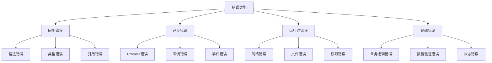

# 错误处理策略

## 错误处理概述

### 错误类型分类


### 错误处理策略
| 策略 | 描述 | 适用场景 | 实现方式 |
|------|------|----------|----------|
| 预防 | 避免错误发生 | 输入验证 | 类型检查、参数验证 |
| 捕获 | 捕获并处理错误 | 异常处理 | try-catch、错误回调 |
| 恢复 | 从错误中恢复 | 容错设计 | 重试、降级、默认值 |
| 报告 | 记录和报告错误 | 监控调试 | 日志、错误追踪 |

## 同步错误处理

### try-catch错误处理
```javascript
// 1. 基本try-catch
function riskyOperation() {
    try {
        // 可能出错的代码
        const result = JSON.parse('invalid json');
        return result;
    } catch (error) {
        console.error('操作失败:', error.message);
        return null;
    }
}

// 2. 嵌套try-catch
function nestedErrorHandling() {
    try {
        const data = JSON.parse('{"valid": "json"}');
        
        try {
            const result = data.nonexistent.property;
            return result;
        } catch (innerError) {
            console.error('内部操作失败:', innerError.message);
            return '默认值';
        }
    } catch (outerError) {
        console.error('外部操作失败:', outerError.message);
        throw outerError;
    }
}

// 3. 错误分类处理
function categorizedErrorHandling() {
    try {
        const result = riskyOperation();
        return result;
    } catch (error) {
        if (error instanceof TypeError) {
            console.error('类型错误:', error.message);
            return '类型错误默认值';
        } else if (error instanceof ReferenceError) {
            console.error('引用错误:', error.message);
            return '引用错误默认值';
        } else if (error instanceof SyntaxError) {
            console.error('语法错误:', error.message);
            return '语法错误默认值';
        } else {
            console.error('未知错误:', error.message);
            throw error;
        }
    }
}

// 4. 错误传播
function errorPropagation() {
    try {
        return riskyOperation();
    } catch (error) {
        console.error('捕获错误:', error.message);
        throw new Error(`处理失败: ${error.message}`);
    }
}
```

### 错误预防
```javascript
// 1. 参数验证
function validateParameters(name, age, email) {
    if (typeof name !== 'string' || name.trim() === '') {
        throw new TypeError('姓名必须是非空字符串');
    }
    
    if (typeof age !== 'number' || age < 0 || age > 150) {
        throw new RangeError('年龄必须是0-150之间的数字');
    }
    
    if (typeof email !== 'string' || !email.includes('@')) {
        throw new TypeError('邮箱格式不正确');
    }
}

function createUser(name, age, email) {
    try {
        validateParameters(name, age, email);
        return { name, age, email };
    } catch (error) {
        console.error('参数验证失败:', error.message);
        throw error;
    }
}

// 2. 类型检查
function safeOperation(data) {
    if (!data || typeof data !== 'object') {
        throw new TypeError('数据必须是对象');
    }
    
    if (!data.hasOwnProperty('id')) {
        throw new Error('数据缺少id属性');
    }
    
    return data.id;
}

// 3. 边界检查
function safeArrayAccess(array, index) {
    if (!Array.isArray(array)) {
        throw new TypeError('第一个参数必须是数组');
    }
    
    if (typeof index !== 'number' || index < 0 || index >= array.length) {
        throw new RangeError('索引超出数组范围');
    }
    
    return array[index];
}

// 4. 空值检查
function safePropertyAccess(obj, property) {
    if (obj == null) {
        throw new TypeError('对象不能为null或undefined');
    }
    
    if (!obj.hasOwnProperty(property)) {
        throw new Error(`对象缺少属性: ${property}`);
    }
    
    return obj[property];
}
```

## 异步错误处理

### Promise错误处理
```javascript
// 1. 基本Promise错误处理
function promiseErrorHandling() {
    return new Promise((resolve, reject) => {
        setTimeout(() => {
            if (Math.random() > 0.5) {
                resolve('操作成功');
            } else {
                reject(new Error('操作失败'));
            }
        }, 1000);
    });
}

promiseErrorHandling()
    .then(result => {
        console.log('成功:', result);
    })
    .catch(error => {
        console.error('失败:', error.message);
    });

// 2. Promise链错误处理
function promiseChainErrorHandling() {
    return Promise.resolve('开始')
        .then(result => {
            console.log('步骤1:', result);
            return '步骤1完成';
        })
        .then(result => {
            console.log('步骤2:', result);
            throw new Error('步骤2失败');
        })
        .then(result => {
            console.log('步骤3:', result);
            return '步骤3完成';
        })
        .catch(error => {
            console.error('链式错误:', error.message);
            return '错误恢复';
        })
        .then(result => {
            console.log('最终结果:', result);
        });
}

// 3. Promise.all错误处理
function promiseAllErrorHandling() {
    const promises = [
        Promise.resolve('成功1'),
        Promise.reject(new Error('失败2')),
        Promise.resolve('成功3')
    ];
    
    return Promise.all(promises)
        .then(results => {
            console.log('所有Promise成功:', results);
        })
        .catch(error => {
            console.error('有Promise失败:', error.message);
        });
}

// 4. Promise.allSettled错误处理
function promiseAllSettledErrorHandling() {
    const promises = [
        Promise.resolve('成功1'),
        Promise.reject(new Error('失败2')),
        Promise.resolve('成功3')
    ];
    
    return Promise.allSettled(promises)
        .then(results => {
            const successful = results
                .filter(result => result.status === 'fulfilled')
                .map(result => result.value);
            
            const failed = results
                .filter(result => result.status === 'rejected')
                .map(result => result.reason);
            
            console.log('成功的Promise:', successful);
            console.log('失败的Promise:', failed);
        });
}
```

### async-await错误处理
```javascript
// 1. 基本async-await错误处理
async function asyncErrorHandling() {
    try {
        const result = await promiseErrorHandling();
        console.log('异步操作成功:', result);
        return result;
    } catch (error) {
        console.error('异步操作失败:', error.message);
        throw error;
    }
}

// 2. 多个await错误处理
async function multipleAwaitErrorHandling() {
    try {
        const result1 = await Promise.resolve('成功1');
        const result2 = await Promise.reject(new Error('失败2'));
        const result3 = await Promise.resolve('成功3'); // 不会执行
        
        return [result1, result2, result3];
    } catch (error) {
        console.error('多个await错误:', error.message);
        return '错误恢复';
    }
}

// 3. 并行await错误处理
async function parallelAwaitErrorHandling() {
    try {
        const [result1, result2, result3] = await Promise.all([
            Promise.resolve('成功1'),
            Promise.reject(new Error('失败2')),
            Promise.resolve('成功3')
        ]);
        
        return [result1, result2, result3];
    } catch (error) {
        console.error('并行await错误:', error.message);
        
        // 降级处理
        const result1 = await Promise.resolve('成功1');
        return [result1, null, null];
    }
}

// 4. 错误恢复
async function errorRecovery() {
    let attempts = 0;
    const maxAttempts = 3;
    
    while (attempts < maxAttempts) {
        try {
            const result = await promiseErrorHandling();
            return result;
        } catch (error) {
            attempts++;
            console.error(`尝试 ${attempts} 失败:`, error.message);
            
            if (attempts >= maxAttempts) {
                throw new Error('所有尝试都失败了');
            }
            
            // 等待后重试
            await new Promise(resolve => setTimeout(resolve, 1000 * attempts));
        }
    }
}
```

## 错误恢复策略

### 重试机制
```javascript
// 1. 基本重试机制
async function retryOperation(operation, maxRetries = 3) {
    let lastError;
    
    for (let i = 0; i < maxRetries; i++) {
        try {
            return await operation();
        } catch (error) {
            lastError = error;
            console.error(`尝试 ${i + 1} 失败:`, error.message);
            
            if (i < maxRetries - 1) {
                await new Promise(resolve => setTimeout(resolve, 1000 * (i + 1)));
            }
        }
    }
    
    throw lastError;
}

// 2. 指数退避重试
async function exponentialBackoffRetry(operation, maxRetries = 3) {
    let lastError;
    
    for (let i = 0; i < maxRetries; i++) {
        try {
            return await operation();
        } catch (error) {
            lastError = error;
            console.error(`尝试 ${i + 1} 失败:`, error.message);
            
            if (i < maxRetries - 1) {
                const delay = Math.pow(2, i) * 1000; // 指数退避
                await new Promise(resolve => setTimeout(resolve, delay));
            }
        }
    }
    
    throw lastError;
}

// 3. 条件重试
async function conditionalRetry(operation, shouldRetry, maxRetries = 3) {
    let lastError;
    
    for (let i = 0; i < maxRetries; i++) {
        try {
            return await operation();
        } catch (error) {
            lastError = error;
            
            if (!shouldRetry(error) || i >= maxRetries - 1) {
                throw error;
            }
            
            console.error(`尝试 ${i + 1} 失败:`, error.message);
            await new Promise(resolve => setTimeout(resolve, 1000));
        }
    }
    
    throw lastError;
}

// 4. 使用重试机制
async function fetchWithRetry(url) {
    return await retryOperation(async () => {
        const response = await fetch(url);
        if (!response.ok) {
            throw new Error(`HTTP ${response.status}`);
        }
        return response.json();
    });
}
```

### 降级处理
```javascript
// 1. 基本降级处理
async function fallbackHandling() {
    try {
        return await primaryOperation();
    } catch (error) {
        console.error('主要操作失败:', error.message);
        
        try {
            return await fallbackOperation();
        } catch (fallbackError) {
            console.error('降级操作也失败:', fallbackError.message);
            return '使用默认值';
        }
    }
}

// 2. 多级降级
async function multiLevelFallback() {
    try {
        return await primaryOperation();
    } catch (error) {
        console.error('主要操作失败:', error.message);
        
        try {
            return await secondaryOperation();
        } catch (error) {
            console.error('次要操作失败:', error.message);
            
            try {
                return await tertiaryOperation();
            } catch (error) {
                console.error('第三级操作失败:', error.message);
                return '使用最终默认值';
            }
        }
    }
}

// 3. 条件降级
async function conditionalFallback(condition) {
    try {
        return await primaryOperation();
    } catch (error) {
        console.error('主要操作失败:', error.message);
        
        if (condition) {
            return await fallbackOperation();
        } else {
            throw error;
        }
    }
}

// 4. 部分降级
async function partialFallback() {
    const results = {};
    
    try {
        results.primary = await primaryOperation();
    } catch (error) {
        console.error('主要操作失败:', error.message);
        results.primary = '主要操作默认值';
    }
    
    try {
        results.secondary = await secondaryOperation();
    } catch (error) {
        console.error('次要操作失败:', error.message);
        results.secondary = '次要操作默认值';
    }
    
    return results;
}
```

## 错误监控和报告

### 错误日志
```javascript
// 1. 基本错误日志
class ErrorLogger {
    constructor() {
        this.logs = [];
    }
    
    log(error, context = {}) {
        const logEntry = {
            timestamp: new Date().toISOString(),
            message: error.message,
            stack: error.stack,
            type: error.constructor.name,
            context
        };
        
        this.logs.push(logEntry);
        console.error('错误日志:', logEntry);
    }
    
    getLogs() {
        return this.logs;
    }
    
    clearLogs() {
        this.logs = [];
    }
}

// 2. 错误追踪
class ErrorTracker {
    constructor() {
        this.errors = new Map();
    }
    
    track(error, context = {}) {
        const errorKey = this.getErrorKey(error);
        
        if (!this.errors.has(errorKey)) {
            this.errors.set(errorKey, {
                error,
                count: 0,
                firstOccurrence: new Date(),
                lastOccurrence: new Date(),
                context
            });
        }
        
        const errorInfo = this.errors.get(errorKey);
        errorInfo.count++;
        errorInfo.lastOccurrence = new Date();
        
        return errorInfo;
    }
    
    getErrorKey(error) {
        return `${error.constructor.name}:${error.message}`;
    }
    
    getErrorStats() {
        const stats = [];
        for (const [key, info] of this.errors) {
            stats.push({
                key,
                count: info.count,
                firstOccurrence: info.firstOccurrence,
                lastOccurrence: info.lastOccurrence
            });
        }
        return stats;
    }
}

// 3. 使用错误监控
const logger = new ErrorLogger();
const tracker = new ErrorTracker();

function monitoredOperation() {
    try {
        // 可能出错的操作
        throw new Error('操作失败');
    } catch (error) {
        logger.log(error, { operation: 'monitoredOperation' });
        tracker.track(error, { operation: 'monitoredOperation' });
        throw error;
    }
}
```

### 错误报告
```javascript
// 1. 错误报告服务
class ErrorReporter {
    constructor(apiEndpoint) {
        this.apiEndpoint = apiEndpoint;
        this.queue = [];
        this.isReporting = false;
    }
    
    async report(error, context = {}) {
        const report = {
            timestamp: new Date().toISOString(),
            message: error.message,
            stack: error.stack,
            type: error.constructor.name,
            context,
            userAgent: navigator.userAgent,
            url: window.location.href
        };
        
        this.queue.push(report);
        await this.processQueue();
    }
    
    async processQueue() {
        if (this.isReporting || this.queue.length === 0) {
            return;
        }
        
        this.isReporting = true;
        
        while (this.queue.length > 0) {
            const report = this.queue.shift();
            
            try {
                await this.sendReport(report);
            } catch (error) {
                console.error('错误报告发送失败:', error);
                // 重新加入队列
                this.queue.unshift(report);
                break;
            }
        }
        
        this.isReporting = false;
    }
    
    async sendReport(report) {
        const response = await fetch(this.apiEndpoint, {
            method: 'POST',
            headers: {
                'Content-Type': 'application/json'
            },
            body: JSON.stringify(report)
        });
        
        if (!response.ok) {
            throw new Error(`报告发送失败: ${response.status}`);
        }
    }
}

// 2. 全局错误处理
class GlobalErrorHandler {
    constructor(errorReporter) {
        this.errorReporter = errorReporter;
        this.setupGlobalHandlers();
    }
    
    setupGlobalHandlers() {
        // 捕获未处理的Promise拒绝
        window.addEventListener('unhandledrejection', (event) => {
            console.error('未处理的Promise拒绝:', event.reason);
            this.errorReporter.report(event.reason, {
                type: 'unhandledrejection',
                promise: event.promise
            });
        });
        
        // 捕获全局错误
        window.addEventListener('error', (event) => {
            console.error('全局错误:', event.error);
            this.errorReporter.report(event.error, {
                type: 'globalError',
                filename: event.filename,
                lineno: event.lineno,
                colno: event.colno
            });
        });
    }
}

// 3. 使用错误报告
const errorReporter = new ErrorReporter('/api/errors');
const globalHandler = new GlobalErrorHandler(errorReporter);

// 手动报告错误
try {
    throw new Error('手动错误');
} catch (error) {
    errorReporter.report(error, { source: 'manual' });
}
```

## 相关链接
- [[02-理解掌握层/03-异步编程/01-事件循环机制]] - 事件循环机制
- [[02-理解掌握层/03-异步编程/02-回调函数模式]] - 回调函数模式
- [[02-理解掌握层/03-异步编程/03-Promise详解]] - Promise详解
- [[02-理解掌握层/03-异步编程/04-async-await语法]] - async-await语法
- [[02-理解掌握层/03-异步编程/05-异步编程模式]] - 异步编程模式
