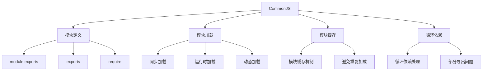

# CommonJS规范

## CommonJS概述

### CommonJS特性


### CommonJS vs ES6模块
| 特性 | CommonJS | ES6模块 |
|------|----------|---------|
| 加载时机 | 运行时加载 | 编译时加载 |
| 加载方式 | 同步加载 | 异步加载 |
| 导出方式 | module.exports/exports | export |
| 导入方式 | require() | import |
| 顶层this | 指向模块对象 | undefined |
| 循环依赖 | 支持但有问题 | 支持且更安全 |

## 模块定义

### 基本导出
```javascript
// 1. 使用module.exports导出
// math.js
function add(a, b) {
    return a + b;
}

function subtract(a, b) {
    return a - b;
}

module.exports = {
    add,
    subtract
};

// 2. 直接导出函数
// utils.js
module.exports = function(message) {
    console.log(message);
};

// 3. 导出类
// User.js
class User {
    constructor(name, email) {
        this.name = name;
        this.email = email;
    }
    
    getName() {
        return this.name;
    }
    
    getEmail() {
        return this.email;
    }
}

module.exports = User;

// 4. 导出常量
// constants.js
module.exports = {
    PI: 3.14159,
    E: 2.71828,
    MAX_SIZE: 1000
};
```

### exports对象
```javascript
// 1. 使用exports导出
// math.js
exports.add = function(a, b) {
    return a + b;
};

exports.subtract = function(a, b) {
    return a - b;
};

// 2. 混合使用exports和module.exports
// mixed.js
exports.multiply = function(a, b) {
    return a * b;
};

exports.divide = function(a, b) {
    return a / b;
};

// 注意：如果同时使用exports和module.exports，module.exports会覆盖exports
module.exports = {
    power: function(a, b) {
        return Math.pow(a, b);
    }
};

// 3. exports的陷阱
// trap.js
exports = {
    name: 'John',
    age: 30
};

// 这样不会导出任何内容，因为exports只是module.exports的引用
// 正确的方式：
module.exports = {
    name: 'John',
    age: 30
};
```

### 模块内部变量
```javascript
// 1. 模块内部变量
// module-internal.js
var privateVar = '这是私有变量';

function privateFunction() {
    return '这是私有函数';
}

// 导出公共接口
module.exports = {
    publicMethod: function() {
        return privateFunction() + ' - 通过公共方法访问';
    },
    
    getPrivateVar: function() {
        return privateVar;
    }
};

// 2. 模块作用域
// scope.js
var moduleVar = '模块级变量';

function moduleFunction() {
    var localVar = '局部变量';
    return moduleVar + ' - ' + localVar;
}

// 模块级变量不会污染全局作用域
console.log(typeof moduleVar); // 'undefined' (在全局作用域中)

module.exports = {
    moduleFunction
};
```

## 模块加载

### require函数
```javascript
// 1. 基本require用法
// main.js
const math = require('./math');
const utils = require('./utils');
const User = require('./User');

console.log(math.add(2, 3)); // 5
console.log(math.subtract(5, 2)); // 3

utils('Hello World'); // Hello World

const user = new User('John', 'john@example.com');
console.log(user.getName()); // John

// 2. 加载内置模块
const fs = require('fs');
const path = require('path');
const http = require('http');

// 3. 加载第三方模块
const express = require('express');
const lodash = require('lodash');

// 4. 加载JSON文件
const config = require('./config.json');
console.log(config.database.host);

// 5. 加载目录
// 如果require一个目录，会查找该目录下的index.js
const myModule = require('./myModule'); // 加载 ./myModule/index.js
```

### 模块解析
```javascript
// 1. 相对路径解析
const localModule = require('./local'); // 当前目录
const parentModule = require('../parent'); // 父目录
const siblingModule = require('../sibling/module'); // 兄弟目录

// 2. 绝对路径解析
const absoluteModule = require('/absolute/path/to/module');

// 3. 模块名解析
const builtinModule = require('fs'); // 内置模块
const thirdPartyModule = require('express'); // 第三方模块

// 4. 模块解析顺序
// 1. 内置模块
// 2. 当前目录的node_modules
// 3. 父目录的node_modules
// 4. 一直向上查找直到根目录

// 5. 文件扩展名解析
const jsModule = require('./module'); // 查找 ./module.js
const jsonModule = require('./data'); // 查找 ./data.json
const nodeModule = require('./native'); // 查找 ./native.node
```

### 动态加载
```javascript
// 1. 条件加载
// main.js
if (process.env.NODE_ENV === 'development') {
    const devTools = require('./dev-tools');
    devTools.enable();
}

// 2. 循环中的动态加载
// dynamic.js
const modules = ['module1', 'module2', 'module3'];
const loadedModules = [];

modules.forEach(moduleName => {
    const module = require(`./${moduleName}`);
    loadedModules.push(module);
});

// 3. 函数中的动态加载
function loadModule(moduleName) {
    try {
        return require(moduleName);
    } catch (error) {
        console.error(`无法加载模块 ${moduleName}:`, error.message);
        return null;
    }
}

const myModule = loadModule('./my-module');

// 4. 异步动态加载（使用Promise）
function loadModuleAsync(moduleName) {
    return new Promise((resolve, reject) => {
        try {
            const module = require(moduleName);
            resolve(module);
        } catch (error) {
            reject(error);
        }
    });
}

loadModuleAsync('./async-module')
    .then(module => {
        console.log('模块加载成功:', module);
    })
    .catch(error => {
        console.error('模块加载失败:', error.message);
    });
```

## 模块缓存

### 缓存机制
```javascript
// 1. 模块缓存示例
// module1.js
console.log('module1.js 被加载');
module.exports = {
    name: 'module1',
    loadTime: Date.now()
};

// module2.js
console.log('module2.js 被加载');
module.exports = {
    name: 'module2',
    loadTime: Date.now()
};

// main.js
console.log('开始加载模块');

const module1 = require('./module1');
console.log('第一次加载 module1:', module1.loadTime);

const module1Again = require('./module1');
console.log('第二次加载 module1:', module1Again.loadTime);

console.log('module1 === module1Again:', module1 === module1Again); // true

// 2. 缓存清除（不推荐）
// 清除模块缓存
delete require.cache[require.resolve('./module1')];

const module1Fresh = require('./module1');
console.log('清除缓存后重新加载:', module1Fresh.loadTime);

// 3. 查看缓存
console.log('模块缓存:', Object.keys(require.cache));

// 4. 缓存键
const cacheKey = require.resolve('./module1');
console.log('缓存键:', cacheKey);
console.log('缓存内容:', require.cache[cacheKey]);
```

### 缓存问题
```javascript
// 1. 缓存导致的状态共享问题
// counter.js
let count = 0;

module.exports = {
    increment: function() {
        return ++count;
    },
    
    getCount: function() {
        return count;
    },
    
    reset: function() {
        count = 0;
    }
};

// main.js
const counter1 = require('./counter');
const counter2 = require('./counter');

console.log(counter1.increment()); // 1
console.log(counter2.increment()); // 2 (共享状态)
console.log(counter1.getCount()); // 2

// 2. 避免状态共享
// safe-counter.js
module.exports = function() {
    let count = 0;
    
    return {
        increment: function() {
            return ++count;
        },
        
        getCount: function() {
            return count;
        },
        
        reset: function() {
            count = 0;
        }
    };
};

// main.js
const createCounter = require('./safe-counter');
const counter1 = createCounter();
const counter2 = createCounter();

console.log(counter1.increment()); // 1
console.log(counter2.increment()); // 1 (独立状态)
console.log(counter1.getCount()); // 1
```

## 循环依赖

### 循环依赖问题
```javascript
// 1. 循环依赖示例
// a.js
console.log('a.js 开始加载');
const b = require('./b');
console.log('a.js 中 b 的值:', b);

module.exports = {
    name: 'a',
    getB: function() {
        return b;
    }
};

// b.js
console.log('b.js 开始加载');
const a = require('./a');
console.log('b.js 中 a 的值:', a);

module.exports = {
    name: 'b',
    getA: function() {
        return a;
    }
};

// main.js
const a = require('./a');
const b = require('./b');

console.log('a:', a);
console.log('b:', b);

// 2. 循环依赖的输出
// a.js 开始加载
// b.js 开始加载
// b.js 中 a 的值: {} (空对象，因为a.js还没加载完成)
// a.js 中 b 的值: { name: 'b', getA: [Function] }
// a: { name: 'a', getB: [Function] }
// b: { name: 'b', getA: [Function] }
```

### 循环依赖解决方案
```javascript
// 1. 延迟加载解决循环依赖
// a.js
console.log('a.js 开始加载');

module.exports = {
    name: 'a',
    getB: function() {
        // 延迟加载
        const b = require('./b');
        return b;
    }
};

// b.js
console.log('b.js 开始加载');

module.exports = {
    name: 'b',
    getA: function() {
        // 延迟加载
        const a = require('./a');
        return a;
    }
};

// 2. 使用事件解决循环依赖
// event-emitter.js
const EventEmitter = require('events');

class ModuleEventEmitter extends EventEmitter {
    constructor() {
        super();
        this.modules = {};
    }
    
    register(name, module) {
        this.modules[name] = module;
        this.emit('moduleRegistered', name, module);
    }
    
    getModule(name) {
        return this.modules[name];
    }
}

module.exports = new ModuleEventEmitter();

// a.js
const emitter = require('./event-emitter');

emitter.on('moduleRegistered', (name, module) => {
    if (name === 'b') {
        console.log('a.js 收到 b 模块注册事件');
    }
});

module.exports = {
    name: 'a',
    init: function() {
        console.log('a.js 初始化');
    }
};

// b.js
const emitter = require('./event-emitter');

emitter.on('moduleRegistered', (name, module) => {
    if (name === 'a') {
        console.log('b.js 收到 a 模块注册事件');
    }
});

module.exports = {
    name: 'b',
    init: function() {
        console.log('b.js 初始化');
    }
};

// main.js
const emitter = require('./event-emitter');
const a = require('./a');
const b = require('./b');

emitter.register('a', a);
emitter.register('b', b);

a.init();
b.init();
```

## CommonJS最佳实践

### 模块设计
```javascript
// 1. 单一职责原则
// user-service.js - 只处理用户相关逻辑
const User = require('./User');

class UserService {
    constructor() {
        this.users = [];
    }
    
    createUser(name, email) {
        const user = new User(name, email);
        this.users.push(user);
        return user;
    }
    
    findUser(email) {
        return this.users.find(user => user.email === email);
    }
    
    getAllUsers() {
        return [...this.users];
    }
}

module.exports = UserService;

// 2. 依赖注入
// database.js
class Database {
    constructor(config) {
        this.config = config;
        this.connected = false;
    }
    
    connect() {
        console.log(`连接到数据库: ${this.config.host}:${this.config.port}`);
        this.connected = true;
    }
    
    query(sql) {
        if (!this.connected) {
            throw new Error('数据库未连接');
        }
        console.log(`执行查询: ${sql}`);
        return [];
    }
}

module.exports = Database;

// user-repository.js
class UserRepository {
    constructor(database) {
        this.db = database;
    }
    
    save(user) {
        const sql = `INSERT INTO users (name, email) VALUES ('${user.name}', '${user.email}')`;
        return this.db.query(sql);
    }
    
    findByEmail(email) {
        const sql = `SELECT * FROM users WHERE email = '${email}'`;
        return this.db.query(sql);
    }
}

module.exports = UserRepository;

// 3. 工厂模式
// module-factory.js
class ModuleFactory {
    static createUserService(database) {
        const UserRepository = require('./user-repository');
        const UserService = require('./user-service');
        
        const userRepository = new UserRepository(database);
        return new UserService(userRepository);
    }
    
    static createDatabase(config) {
        const Database = require('./database');
        return new Database(config);
    }
}

module.exports = ModuleFactory;
```

### 错误处理
```javascript
// 1. 模块加载错误处理
function safeRequire(moduleName, defaultValue = null) {
    try {
        return require(moduleName);
    } catch (error) {
        console.error(`无法加载模块 ${moduleName}:`, error.message);
        return defaultValue;
    }
}

const optionalModule = safeRequire('./optional-module', {});
const requiredModule = safeRequire('./required-module');

if (!requiredModule) {
    throw new Error('必需模块加载失败');
}

// 2. 模块初始化错误处理
// config.js
let config = null;

try {
    config = require('./config.json');
} catch (error) {
    console.warn('配置文件加载失败，使用默认配置');
    config = {
        port: 3000,
        database: {
            host: 'localhost',
            port: 5432
        }
    };
}

module.exports = config;

// 3. 模块导出错误处理
// error-handler.js
class ErrorHandler {
    static handleModuleError(error, moduleName) {
        console.error(`模块 ${moduleName} 发生错误:`, error.message);
        
        // 记录错误日志
        this.logError(error, moduleName);
        
        // 发送错误报告
        this.reportError(error, moduleName);
    }
    
    static logError(error, moduleName) {
        const logEntry = {
            timestamp: new Date().toISOString(),
            module: moduleName,
            message: error.message,
            stack: error.stack
        };
        
        console.log('错误日志:', JSON.stringify(logEntry, null, 2));
    }
    
    static reportError(error, moduleName) {
        // 发送到错误监控服务
        console.log(`向监控服务报告错误: ${moduleName}`);
    }
}

module.exports = ErrorHandler;
```

## 相关链接
- [[02-理解掌握层/04-模块化/02-AMD-CMD规范]] - AMD-CMD规范
- [[02-理解掌握层/04-模块化/03-ES6模块系统]] - ES6模块系统
- [[02-理解掌握层/04-模块化/04-模块加载机制]] - 模块加载机制
- [[02-理解掌握层/04-模块化/05-模块化最佳实践]] - 模块化最佳实践
