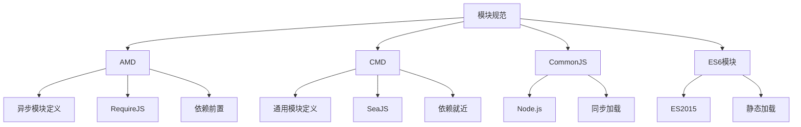

# AMD-CMD规范

## AMD-CMD概述

### 模块规范对比


### 规范特性对比
| 特性 | AMD | CMD | CommonJS | ES6模块 |
|------|-----|-----|----------|---------|
| 加载方式 | 异步 | 异步 | 同步 | 异步 |
| 依赖声明 | 前置 | 就近 | 同步 | 静态 |
| 执行时机 | 依赖加载完即执行 | 使用时执行 | 加载时执行 | 编译时确定 |
| 代表实现 | RequireJS | SeaJS | Node.js | 原生支持 |

## AMD规范

### 基本语法
```javascript
// 1. 定义模块
// math.js
define(['dependency1', 'dependency2'], function(dep1, dep2) {
    // 模块代码
    function add(a, b) {
        return a + b;
    }
    
    function subtract(a, b) {
        return a - b;
    }
    
    // 返回模块接口
    return {
        add: add,
        subtract: subtract
    };
});

// 2. 无依赖模块
// utils.js
define(function() {
    function formatDate(date) {
        return date.toLocaleDateString();
    }
    
    return {
        formatDate: formatDate
    };
});

// 3. 有依赖模块
// user-service.js
define(['./user', './api'], function(User, api) {
    class UserService {
        constructor() {
            this.users = [];
        }
        
        createUser(name, email) {
            const user = new User(name, email);
            this.users.push(user);
            return user;
        }
        
        async fetchUsers() {
            const data = await api.get('/users');
            return data.map(userData => new User(userData.name, userData.email));
        }
    }
    
    return UserService;
});

// 4. 使用模块
// main.js
require(['./math', './utils', './user-service'], function(math, utils, UserService) {
    // 使用模块
    console.log(math.add(2, 3)); // 5
    
    const formattedDate = utils.formatDate(new Date());
    console.log(formattedDate);
    
    const userService = new UserService();
    const user = userService.createUser('John', 'john@example.com');
    console.log(user);
});
```

### RequireJS配置
```javascript
// 1. 基本配置
// main.js
require.config({
    baseUrl: './js',
    paths: {
        'jquery': 'lib/jquery.min',
        'lodash': 'lib/lodash.min',
        'utils': 'modules/utils',
        'api': 'modules/api'
    },
    shim: {
        'jquery': {
            exports: '$'
        },
        'lodash': {
            exports: '_'
        }
    }
});

// 2. 模块映射
require.config({
    map: {
        'app': {
            'jquery': 'lib/jquery-2.0'
        },
        'app/admin': {
            'jquery': 'lib/jquery-1.9'
        }
    }
});

// 3. 包配置
require.config({
    packages: [
        {
            name: 'my-package',
            location: 'packages/my-package',
            main: 'index'
        }
    ]
});

// 4. 插件配置
require.config({
    paths: {
        'text': 'lib/require-text',
        'css': 'lib/require-css'
    }
});

// 使用插件
require(['text!./templates/user.html', 'css!./styles/user.css'], function(template, css) {
    console.log('模板内容:', template);
    console.log('样式已加载');
});
```

### AMD插件
```javascript
// 1. 文本插件
// 加载文本文件
require(['text!./templates/user.html'], function(template) {
    document.getElementById('content').innerHTML = template;
});

// 2. CSS插件
// 加载CSS文件
require(['css!./styles/main.css'], function() {
    console.log('样式文件已加载');
});

// 3. JSON插件
// 加载JSON文件
require(['json!./config.json'], function(config) {
    console.log('配置:', config);
});

// 4. 自定义插件
// image.js - 图片加载插件
define(function() {
    return {
        load: function(name, req, onload, config) {
            const img = new Image();
            img.onload = function() {
                onload(img);
            };
            img.onerror = function() {
                onload.error(new Error('图片加载失败: ' + name));
            };
            img.src = req.toUrl(name);
        }
    };
});

// 使用自定义插件
require(['image!./images/logo.png'], function(logo) {
    document.body.appendChild(logo);
});
```

## CMD规范

### 基本语法
```javascript
// 1. 定义模块
// math.js
define(function(require, exports, module) {
    // 依赖就近
    var utils = require('./utils');
    
    function add(a, b) {
        return a + b;
    }
    
    function subtract(a, b) {
        return a - b;
    }
    
    // 导出接口
    exports.add = add;
    exports.subtract = subtract;
    
    // 或者使用module.exports
    // module.exports = {
    //     add: add,
    //     subtract: subtract
    // };
});

// 2. 异步依赖
// user-service.js
define(function(require, exports, module) {
    // 同步依赖
    var User = require('./user');
    
    // 异步依赖
    require.async('./api', function(api) {
        console.log('API模块异步加载完成');
    });
    
    class UserService {
        constructor() {
            this.users = [];
        }
        
        createUser(name, email) {
            const user = new User(name, email);
            this.users.push(user);
            return user;
        }
        
        // 动态加载依赖
        async fetchUsers() {
            var api = require('./api');
            const data = await api.get('/users');
            return data.map(userData => new User(userData.name, userData.email));
        }
    }
    
    module.exports = UserService;
});

// 3. 使用模块
// main.js
define(function(require, exports, module) {
    // 动态加载模块
    var math = require('./math');
    var utils = require('./utils');
    
    // 使用模块
    console.log(math.add(2, 3)); // 5
    
    const formattedDate = utils.formatDate(new Date());
    console.log(formattedDate);
    
    // 异步加载模块
    require.async('./user-service', function(UserService) {
        const userService = new UserService();
        const user = userService.createUser('John', 'john@example.com');
        console.log(user);
    });
});
```

### SeaJS配置
```javascript
// 1. 基本配置
// seajs.config.js
seajs.config({
    base: './js',
    alias: {
        'jquery': 'lib/jquery.min.js',
        'lodash': 'lib/lodash.min.js',
        'utils': 'modules/utils.js',
        'api': 'modules/api.js'
    },
    preload: ['jquery'],
    charset: 'utf-8',
    timeout: 20000,
    debug: true
});

// 2. 路径配置
seajs.config({
    paths: {
        'app': './app',
        'lib': './lib',
        'modules': './modules'
    }
});

// 3. 变量配置
seajs.config({
    vars: {
        'locale': 'zh-cn',
        'version': '1.0.0'
    }
});

// 使用变量
define(function(require, exports, module) {
    var config = require('./config-{locale}.js');
    var version = require('./version-{version}.js');
});

// 4. 映射配置
seajs.config({
    map: [
        ['.js', '-debug.js']
    ]
});
```

### CMD插件
```javascript
// 1. 文本插件
// 加载文本文件
define(function(require, exports, module) {
    var template = require('text!./templates/user.html');
    document.getElementById('content').innerHTML = template;
});

// 2. CSS插件
// 加载CSS文件
define(function(require, exports, module) {
    require('css!./styles/main.css');
    console.log('样式文件已加载');
});

// 3. JSON插件
// 加载JSON文件
define(function(require, exports, module) {
    var config = require('json!./config.json');
    console.log('配置:', config);
});

// 4. 自定义插件
// image.js - 图片加载插件
define(function(require, exports, module) {
    return {
        load: function(resourceId, req, callback) {
            var img = new Image();
            img.onload = function() {
                callback(img);
            };
            img.onerror = function() {
                callback.error(new Error('图片加载失败: ' + resourceId));
            };
            img.src = req.toUrl(resourceId);
        }
    };
});

// 使用自定义插件
define(function(require, exports, module) {
    var logo = require('image!./images/logo.png');
    document.body.appendChild(logo);
});
```

## AMD vs CMD

### 执行时机对比
```javascript
// AMD - 依赖前置，提前执行
// math.js (AMD)
define(['./utils'], function(utils) {
    console.log('math.js 执行'); // 立即执行
    
    function add(a, b) {
        return a + b;
    }
    
    return {
        add: add
    };
});

// CMD - 依赖就近，延迟执行
// math.js (CMD)
define(function(require, exports, module) {
    console.log('math.js 定义'); // 只是定义，不执行
    
    function add(a, b) {
        var utils = require('./utils'); // 使用时才加载
        return utils.format(a + b);
    }
    
    exports.add = add;
});

// 使用对比
// main.js (AMD)
require(['./math'], function(math) {
    console.log('main.js 执行');
    console.log(math.add(2, 3));
});

// main.js (CMD)
define(function(require, exports, module) {
    console.log('main.js 定义');
    
    var math = require('./math'); // 此时math.js才执行
    console.log(math.add(2, 3));
});
```

### 依赖处理对比
```javascript
// AMD - 依赖前置
// user-service.js (AMD)
define(['./user', './api', './utils'], function(User, api, utils) {
    // 所有依赖都已加载并执行
    console.log('User:', User);
    console.log('API:', api);
    console.log('Utils:', utils);
    
    class UserService {
        constructor() {
            this.users = [];
        }
        
        createUser(name, email) {
            const user = new User(name, email);
            this.users.push(user);
            return user;
        }
    }
    
    return UserService;
});

// CMD - 依赖就近
// user-service.js (CMD)
define(function(require, exports, module) {
    // 模块定义时不加载任何依赖
    
    class UserService {
        constructor() {
            this.users = [];
        }
        
        createUser(name, email) {
            var User = require('./user'); // 使用时才加载
            const user = new User(name, email);
            this.users.push(user);
            return user;
        }
        
        async fetchUsers() {
            var api = require('./api'); // 使用时才加载
            var utils = require('./utils'); // 使用时才加载
            
            const data = await api.get('/users');
            return data.map(userData => {
                const user = new (require('./user'))(userData.name, userData.email);
                return utils.formatUser(user);
            });
        }
    }
    
    module.exports = UserService;
});
```

## 实际应用

### 大型项目结构
```javascript
// 1. 项目目录结构
/*
project/
├── js/
│   ├── lib/
│   │   ├── jquery.min.js
│   │   ├── lodash.min.js
│   │   └── require.js
│   ├── modules/
│   │   ├── user/
│   │   │   ├── user.js
│   │   │   ├── user-service.js
│   │   │   └── user-controller.js
│   │   ├── product/
│   │   │   ├── product.js
│   │   │   ├── product-service.js
│   │   │   └── product-controller.js
│   │   └── common/
│   │       ├── utils.js
│   │       ├── api.js
│   │       └── config.js
│   └── main.js
*/

// 2. 主入口文件
// main.js (AMD)
require.config({
    baseUrl: './js',
    paths: {
        'jquery': 'lib/jquery.min',
        'lodash': 'lib/lodash.min',
        'utils': 'modules/common/utils',
        'api': 'modules/common/api',
        'config': 'modules/common/config'
    },
    shim: {
        'jquery': {
            exports: '$'
        }
    }
});

require(['jquery', 'lodash', 'config'], function($, _, config) {
    // 应用初始化
    console.log('应用启动');
    
    // 根据配置加载不同模块
    if (config.features.user) {
        require(['modules/user/user-controller'], function(UserController) {
            new UserController();
        });
    }
    
    if (config.features.product) {
        require(['modules/product/product-controller'], function(ProductController) {
            new ProductController();
        });
    }
});

// 3. 模块定义
// modules/user/user.js (AMD)
define(['./user-service'], function(UserService) {
    class User {
        constructor(name, email) {
            this.name = name;
            this.email = email;
            this.service = new UserService();
        }
        
        save() {
            return this.service.save(this);
        }
        
        static findById(id) {
            const service = new UserService();
            return service.findById(id);
        }
    }
    
    return User;
});

// modules/user/user-service.js (AMD)
define(['../common/api', '../common/utils'], function(api, utils) {
    class UserService {
        constructor() {
            this.api = api;
            this.utils = utils;
        }
        
        async save(user) {
            const data = this.utils.serialize(user);
            return await this.api.post('/users', data);
        }
        
        async findById(id) {
            const data = await this.api.get(`/users/${id}`);
            return this.utils.deserialize(data, User);
        }
    }
    
    return UserService;
});
```

### 模块化最佳实践
```javascript
// 1. 模块命名规范
// 使用命名空间避免冲突
define('app.user.User', ['./app.user.UserService'], function(UserService) {
    class User {
        constructor(name, email) {
            this.name = name;
            this.email = email;
            this.service = new UserService();
        }
    }
    
    return User;
});

// 2. 模块版本管理
// 使用版本号管理模块
define('app.user.User@1.0.0', ['./app.user.UserService@1.0.0'], function(UserService) {
    // 模块实现
});

// 3. 模块依赖管理
// 使用依赖注入
define(['./container'], function(container) {
    class UserController {
        constructor() {
            this.userService = container.get('userService');
            this.userView = container.get('userView');
        }
        
        init() {
            this.userView.render();
            this.bindEvents();
        }
        
        bindEvents() {
            this.userView.on('user:create', (userData) => {
                this.userService.create(userData);
            });
        }
    }
    
    return UserController;
});

// 4. 模块测试
// 使用模拟依赖进行测试
define(['./user-service'], function(UserService) {
    class User {
        constructor(name, email, userService) {
            this.name = name;
            this.email = email;
            this.userService = userService || new UserService();
        }
        
        save() {
            return this.userService.save(this);
        }
    }
    
    return User;
});
```

## 相关链接
- [[02-理解掌握层/04-模块化/01-CommonJS规范]] - CommonJS规范
- [[02-理解掌握层/04-模块化/03-ES6模块系统]] - ES6模块系统
- [[02-理解掌握层/04-模块化/04-模块加载机制]] - 模块加载机制
- [[02-理解掌握层/04-模块化/05-模块化最佳实践]] - 模块化最佳实践
