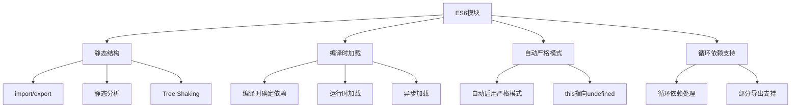

# ES6模块系统

## ES6模块概述

### ES6模块特性


### ES6模块优势
| 特性 | 描述 | 优势 |
|------|------|------|
| 静态结构 | 编译时确定依赖关系 | 更好的工具支持 |
| 自动严格模式 | 模块自动启用严格模式 | 更安全的代码 |
| 循环依赖 | 支持循环依赖 | 更灵活的设计 |
| Tree Shaking | 死代码消除 | 更小的打包体积 |

## 导出语法

### 基本导出
```javascript
// 1. 命名导出
// math.js
export function add(a, b) {
    return a + b;
}

export function subtract(a, b) {
    return a - b;
}

export const PI = 3.14159;

export class Calculator {
    constructor() {
        this.result = 0;
    }
    
    calculate(operation, a, b) {
        switch (operation) {
            case 'add':
                return add(a, b);
            case 'subtract':
                return subtract(a, b);
            default:
                throw new Error('未知操作');
        }
    }
}

// 2. 默认导出
// user.js
class User {
    constructor(name, email) {
        this.name = name;
        this.email = email;
    }
    
    getName() {
        return this.name;
    }
    
    getEmail() {
        return this.email;
    }
}

export default User;

// 3. 混合导出
// utils.js
export function formatDate(date) {
    return date.toLocaleDateString();
}

export function formatCurrency(amount) {
    return new Intl.NumberFormat('zh-CN', {
        style: 'currency',
        currency: 'CNY'
    }).format(amount);
}

export default function formatUser(user) {
    return `${user.name} (${user.email})`;
}

// 4. 重新导出
// index.js
export { add, subtract } from './math.js';
export { default as User } from './user.js';
export * from './utils.js';

// 5. 聚合导出
// all-exports.js
export * from './math.js';
export * from './utils.js';
export { default as User } from './user.js';
```

### 导出方式对比
```javascript
// 1. 命名导出 vs 默认导出
// 命名导出 - 可以有多个
export const name = 'John';
export const age = 30;
export function greet() {
    return 'Hello';
}

// 默认导出 - 只能有一个
export default class Person {
    constructor(name) {
        this.name = name;
    }
}

// 2. 导出变量
let count = 0;
export function increment() {
    return ++count;
}

export function getCount() {
    return count;
}

// 3. 导出对象
const config = {
    apiUrl: 'https://api.example.com',
    timeout: 5000
};

export { config };

// 4. 导出函数表达式
export const multiply = (a, b) => a * b;

// 5. 导出类表达式
export const Animal = class {
    constructor(name) {
        this.name = name;
    }
};
```

## 导入语法

### 基本导入
```javascript
// 1. 命名导入
import { add, subtract, PI } from './math.js';

console.log(add(2, 3)); // 5
console.log(subtract(5, 2)); // 3
console.log(PI); // 3.14159

// 2. 默认导入
import User from './user.js';

const user = new User('John', 'john@example.com');
console.log(user.getName()); // John

// 3. 混合导入
import User, { formatDate, formatCurrency } from './utils.js';

const user = new User('John', 'john@example.com');
console.log(formatDate(new Date()));
console.log(formatCurrency(100));

// 4. 命名空间导入
import * as Math from './math.js';

console.log(Math.add(2, 3)); // 5
console.log(Math.subtract(5, 2)); // 3
console.log(Math.PI); // 3.14159

// 5. 重命名导入
import { add as plus, subtract as minus } from './math.js';

console.log(plus(2, 3)); // 5
console.log(minus(5, 2)); // 3

// 6. 默认导入重命名
import { default as UserClass } from './user.js';

const user = new UserClass('John', 'john@example.com');
```

### 动态导入
```javascript
// 1. 基本动态导入
async function loadModule() {
    const math = await import('./math.js');
    console.log(math.add(2, 3)); // 5
}

// 2. 条件导入
async function conditionalImport(condition) {
    if (condition) {
        const { add } = await import('./math.js');
        return add(2, 3);
    } else {
        const { subtract } = await import('./math.js');
        return subtract(5, 2);
    }
}

// 3. 循环中的动态导入
async function loadMultipleModules() {
    const modules = ['./math.js', './utils.js', './user.js'];
    const results = [];
    
    for (const modulePath of modules) {
        const module = await import(modulePath);
        results.push(module);
    }
    
    return results;
}

// 4. 错误处理
async function safeImport(modulePath) {
    try {
        const module = await import(modulePath);
        return module;
    } catch (error) {
        console.error(`模块加载失败: ${modulePath}`, error);
        return null;
    }
}

// 5. 并行动态导入
async function parallelImport() {
    const [math, utils, user] = await Promise.all([
        import('./math.js'),
        import('./utils.js'),
        import('./user.js')
    ]);
    
    return { math, utils, user };
}
```

## 模块加载

### 加载机制
```javascript
// 1. 静态加载
// 编译时确定依赖关系
import { add } from './math.js';
import User from './user.js';

// 2. 动态加载
// 运行时加载模块
async function loadModule() {
    const module = await import('./dynamic-module.js');
    return module;
}

// 3. 条件加载
function loadModuleConditionally(condition) {
    if (condition) {
        return import('./module-a.js');
    } else {
        return import('./module-b.js');
    }
}

// 4. 懒加载
class LazyLoader {
    constructor() {
        this.cache = new Map();
    }
    
    async load(modulePath) {
        if (this.cache.has(modulePath)) {
            return this.cache.get(modulePath);
        }
        
        const module = await import(modulePath);
        this.cache.set(modulePath, module);
        return module;
    }
}

// 5. 预加载
// 使用link标签预加载模块
const link = document.createElement('link');
link.rel = 'modulepreload';
link.href = './heavy-module.js';
document.head.appendChild(link);
```

### 模块解析
```javascript
// 1. 相对路径
import { add } from './math.js';
import { subtract } from '../utils/math.js';

// 2. 绝对路径
import { config } from '/src/config.js';

// 3. 模块名
import React from 'react';
import lodash from 'lodash';

// 4. 文件扩展名
import { add } from './math.js'; // 明确指定扩展名
import { subtract } from './math'; // 浏览器会自动添加.js

// 5. 目录导入
import { index } from './utils/'; // 导入 ./utils/index.js

// 6. 包导入
import { Component } from 'my-package';
import { Component } from 'my-package/index.js';
```

## 循环依赖

### 循环依赖处理
```javascript
// 1. 基本循环依赖
// a.js
import { b } from './b.js';

export const a = 'a';

export function getA() {
    return a;
}

export function getB() {
    return b;
}

// b.js
import { a } from './a.js';

export const b = 'b';

export function getB() {
    return b;
}

export function getA() {
    return a;
}

// main.js
import { getA, getB } from './a.js';

console.log(getA()); // 'a'
console.log(getB()); // 'b'

// 2. 函数提升解决循环依赖
// a.js
export function getA() {
    return 'a';
}

export function getB() {
    // 动态导入避免循环依赖
    return import('./b.js').then(module => module.getB());
}

// b.js
export function getB() {
    return 'b';
}

export function getA() {
    // 动态导入避免循环依赖
    return import('./a.js').then(module => module.getA());
}

// 3. 类循环依赖
// user.js
import { UserService } from './user-service.js';

export class User {
    constructor(name, email) {
        this.name = name;
        this.email = email;
    }
    
    save() {
        // 延迟导入避免循环依赖
        return import('./user-service.js').then(module => {
            const service = new module.UserService();
            return service.save(this);
        });
    }
}

// user-service.js
import { User } from './user.js';

export class UserService {
    constructor() {
        this.users = [];
    }
    
    save(user) {
        this.users.push(user);
        return Promise.resolve(user);
    }
    
    createUser(name, email) {
        const user = new User(name, email);
        return this.save(user);
    }
}
```

### 循环依赖最佳实践
```javascript
// 1. 使用事件系统解耦
// event-bus.js
class EventBus {
    constructor() {
        this.events = new Map();
    }
    
    on(event, callback) {
        if (!this.events.has(event)) {
            this.events.set(event, []);
        }
        this.events.get(event).push(callback);
    }
    
    emit(event, data) {
        if (this.events.has(event)) {
            this.events.get(event).forEach(callback => callback(data));
        }
    }
}

export const eventBus = new EventBus();

// user.js
import { eventBus } from './event-bus.js';

export class User {
    constructor(name, email) {
        this.name = name;
        this.email = email;
    }
    
    save() {
        eventBus.emit('user:save', this);
        return Promise.resolve(this);
    }
}

// user-service.js
import { eventBus } from './event-bus.js';

export class UserService {
    constructor() {
        this.users = [];
        this.setupListeners();
    }
    
    setupListeners() {
        eventBus.on('user:save', (user) => {
            this.users.push(user);
        });
    }
}

// 2. 使用依赖注入
// container.js
class Container {
    constructor() {
        this.services = new Map();
    }
    
    register(name, service) {
        this.services.set(name, service);
    }
    
    get(name) {
        return this.services.get(name);
    }
}

export const container = new Container();

// user.js
import { container } from './container.js';

export class User {
    constructor(name, email) {
        this.name = name;
        this.email = email;
    }
    
    save() {
        const userService = container.get('userService');
        return userService.save(this);
    }
}

// user-service.js
import { container } from './container.js';
import { User } from './user.js';

export class UserService {
    constructor() {
        this.users = [];
    }
    
    save(user) {
        this.users.push(user);
        return Promise.resolve(user);
    }
}

// 注册服务
container.register('userService', new UserService());
```

## 模块最佳实践

### 模块设计
```javascript
// 1. 单一职责原则
// user-model.js - 只负责用户数据模型
export class User {
    constructor(name, email) {
        this.name = name;
        this.email = email;
        this.createdAt = new Date();
    }
    
    validate() {
        if (!this.name || !this.email) {
            throw new Error('用户名和邮箱不能为空');
        }
        return true;
    }
}

// user-service.js - 只负责用户业务逻辑
import { User } from './user-model.js';

export class UserService {
    constructor(apiClient) {
        this.apiClient = apiClient;
    }
    
    async createUser(name, email) {
        const user = new User(name, email);
        user.validate();
        return await this.apiClient.post('/users', user);
    }
    
    async getUser(id) {
        const data = await this.apiClient.get(`/users/${id}`);
        return new User(data.name, data.email);
    }
}

// 2. 依赖注入
// api-client.js
export class ApiClient {
    constructor(baseUrl) {
        this.baseUrl = baseUrl;
    }
    
    async get(endpoint) {
        const response = await fetch(`${this.baseUrl}${endpoint}`);
        return response.json();
    }
    
    async post(endpoint, data) {
        const response = await fetch(`${this.baseUrl}${endpoint}`, {
            method: 'POST',
            headers: { 'Content-Type': 'application/json' },
            body: JSON.stringify(data)
        });
        return response.json();
    }
}

// 3. 工厂模式
// user-factory.js
import { User } from './user-model.js';
import { UserService } from './user-service.js';
import { ApiClient } from './api-client.js';

export class UserFactory {
    static createUserService(baseUrl) {
        const apiClient = new ApiClient(baseUrl);
        return new UserService(apiClient);
    }
    
    static createUser(name, email) {
        return new User(name, email);
    }
}
```

### 错误处理
```javascript
// 1. 模块加载错误处理
async function loadModuleSafely(modulePath) {
    try {
        const module = await import(modulePath);
        return module;
    } catch (error) {
        console.error(`模块加载失败: ${modulePath}`, error);
        return null;
    }
}

// 2. 模块初始化错误处理
// config.js
let config = null;

try {
    config = await import('./config.json');
} catch (error) {
    console.warn('配置文件加载失败，使用默认配置');
    config = {
        apiUrl: 'https://api.example.com',
        timeout: 5000
    };
}

export { config };

// 3. 模块导出错误处理
// error-handler.js
export class ModuleErrorHandler {
    static handleError(error, moduleName) {
        console.error(`模块 ${moduleName} 发生错误:`, error.message);
        
        // 记录错误日志
        this.logError(error, moduleName);
        
        // 发送错误报告
        this.reportError(error, moduleName);
    }
    
    static logError(error, moduleName) {
        const logEntry = {
            timestamp: new Date().toISOString(),
            module: moduleName,
            message: error.message,
            stack: error.stack
        };
        
        console.log('错误日志:', JSON.stringify(logEntry, null, 2));
    }
    
    static reportError(error, moduleName) {
        // 发送到错误监控服务
        console.log(`向监控服务报告错误: ${moduleName}`);
    }
}
```

## 相关链接
- [[02-理解掌握层/04-模块化/01-CommonJS规范]] - CommonJS规范
- [[02-理解掌握层/04-模块化/02-AMD-CMD规范]] - AMD-CMD规范
- [[02-理解掌握层/04-模块化/04-模块加载机制]] - 模块加载机制
- [[02-理解掌握层/04-模块化/05-模块化最佳实践]] - 模块化最佳实践
