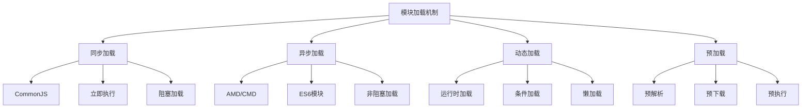

# 模块加载机制

## 模块加载概述

### 加载机制分类


### 加载机制对比
| 加载方式 | 时机 | 特点 | 适用场景 |
|----------|------|------|----------|
| 同步加载 | 运行时 | 阻塞执行 | Node.js环境 |
| 异步加载 | 运行时 | 非阻塞 | 浏览器环境 |
| 动态加载 | 运行时 | 按需加载 | 条件加载 |
| 预加载 | 编译时 | 提前准备 | 性能优化 |

## 同步加载机制

### CommonJS加载
```javascript
// 1. 基本同步加载
// math.js
console.log('math.js 开始加载');
const utils = require('./utils');
console.log('math.js 加载完成');

function add(a, b) {
    return a + b;
}

module.exports = { add };

// utils.js
console.log('utils.js 开始加载');
function format(value) {
    return `Formatted: ${value}`;
}
console.log('utils.js 加载完成');

module.exports = { format };

// main.js
console.log('main.js 开始执行');
const math = require('./math');
console.log('main.js 执行完成');

// 输出顺序:
// main.js 开始执行
// math.js 开始加载
// utils.js 开始加载
// utils.js 加载完成
// math.js 加载完成
// main.js 执行完成

// 2. 模块缓存机制
// counter.js
let count = 0;
console.log('counter.js 加载');

module.exports = {
    increment: () => ++count,
    getCount: () => count
};

// main.js
const counter1 = require('./counter');
const counter2 = require('./counter');

console.log(counter1 === counter2); // true (同一个模块实例)
console.log(counter1.increment()); // 1
console.log(counter2.getCount()); // 1 (共享状态)

// 3. 循环依赖处理
// a.js
console.log('a.js 开始加载');
const b = require('./b');
console.log('a.js 中 b:', b);

module.exports = {
    name: 'a',
    getB: () => b
};

// b.js
console.log('b.js 开始加载');
const a = require('./a');
console.log('b.js 中 a:', a);

module.exports = {
    name: 'b',
    getA: () => a
};

// main.js
const a = require('./a');
console.log('最终 a:', a);
console.log('最终 b:', a.getB());

// 输出:
// a.js 开始加载
// b.js 开始加载
// b.js 中 a: {} (空对象，因为a.js还没加载完成)
// a.js 中 b: { name: 'b', getA: [Function] }
// 最终 a: { name: 'a', getB: [Function] }
// 最终 b: { name: 'b', getA: [Function] }
```

### 同步加载特点
```javascript
// 1. 阻塞特性
function loadModules() {
    console.log('开始加载模块');
    
    // 同步加载会阻塞后续代码执行
    const heavyModule = require('./heavy-module');
    console.log('heavy-module 加载完成');
    
    const lightModule = require('./light-module');
    console.log('light-module 加载完成');
    
    console.log('所有模块加载完成');
}

// 2. 加载顺序
function demonstrateLoadingOrder() {
    console.log('1. 主模块开始');
    
    const moduleA = require('./module-a');
    console.log('2. module-a 加载完成');
    
    const moduleB = require('./module-b');
    console.log('3. module-b 加载完成');
    
    console.log('4. 主模块结束');
}

// 3. 错误传播
function handleLoadingErrors() {
    try {
        const problematicModule = require('./problematic-module');
        console.log('模块加载成功');
    } catch (error) {
        console.error('模块加载失败:', error.message);
        // 错误会立即传播，不会继续执行
    }
    
    console.log('错误处理完成');
}
```

## 异步加载机制

### AMD加载
```javascript
// 1. 基本异步加载
// math.js
define(['./utils'], function(utils) {
    console.log('math.js 开始执行');
    
    function add(a, b) {
        return a + b;
    }
    
    console.log('math.js 执行完成');
    return { add };
});

// utils.js
define(function() {
    console.log('utils.js 开始执行');
    
    function format(value) {
        return `Formatted: ${value}`;
    }
    
    console.log('utils.js 执行完成');
    return { format };
});

// main.js
require(['./math'], function(math) {
    console.log('main.js 回调执行');
    console.log(math.add(2, 3));
});

// 输出顺序可能不同，因为异步加载
// utils.js 开始执行
// utils.js 执行完成
// math.js 开始执行
// math.js 执行完成
// main.js 回调执行
// 5

// 2. 依赖前置加载
// user-service.js
define(['./user', './api', './utils'], function(User, api, utils) {
    console.log('user-service.js 开始执行');
    
    class UserService {
        constructor() {
            this.users = [];
        }
        
        createUser(name, email) {
            const user = new User(name, email);
            this.users.push(user);
            return user;
        }
    }
    
    console.log('user-service.js 执行完成');
    return UserService;
});

// 3. 异步加载错误处理
require(['./math'], function(math) {
    console.log('模块加载成功:', math);
}, function(error) {
    console.error('模块加载失败:', error);
});
```

### CMD加载
```javascript
// 1. 基本CMD加载
// math.js
define(function(require, exports, module) {
    console.log('math.js 定义');
    
    function add(a, b) {
        var utils = require('./utils'); // 使用时才加载
        return utils.format(a + b);
    }
    
    exports.add = add;
    console.log('math.js 定义完成');
});

// utils.js
define(function(require, exports, module) {
    console.log('utils.js 定义');
    
    function format(value) {
        return `Formatted: ${value}`;
    }
    
    exports.format = format;
    console.log('utils.js 定义完成');
});

// main.js
define(function(require, exports, module) {
    console.log('main.js 定义');
    
    var math = require('./math'); // 此时math.js才执行
    console.log(math.add(2, 3));
    
    console.log('main.js 定义完成');
});

// 输出顺序:
// main.js 定义
// math.js 定义
// math.js 定义完成
// utils.js 定义
// utils.js 定义完成
// Formatted: 5
// main.js 定义完成

// 2. 依赖就近加载
// user-service.js
define(function(require, exports, module) {
    console.log('user-service.js 定义');
    
    class UserService {
        constructor() {
            this.users = [];
        }
        
        createUser(name, email) {
            var User = require('./user'); // 使用时才加载
            const user = new User(name, email);
            this.users.push(user);
            return user;
        }
        
        async fetchUsers() {
            var api = require('./api'); // 使用时才加载
            var utils = require('./utils'); // 使用时才加载
            
            const data = await api.get('/users');
            return data.map(userData => {
                const user = new (require('./user'))(userData.name, userData.email);
                return utils.formatUser(user);
            });
        }
    }
    
    module.exports = UserService;
    console.log('user-service.js 定义完成');
});
```

## 动态加载机制

### 动态导入
```javascript
// 1. 基本动态导入
async function loadModule() {
    console.log('开始动态加载');
    
    const math = await import('./math.js');
    console.log('math.js 加载完成');
    
    const result = math.add(2, 3);
    console.log('计算结果:', result);
    
    return result;
}

// 2. 条件动态加载
async function conditionalLoad(condition) {
    if (condition) {
        const moduleA = await import('./module-a.js');
        return moduleA.process();
    } else {
        const moduleB = await import('./module-b.js');
        return moduleB.process();
    }
}

// 3. 循环中的动态加载
async function loadMultipleModules() {
    const modules = ['./module1.js', './module2.js', './module3.js'];
    const results = [];
    
    for (const modulePath of modules) {
        console.log(`加载模块: ${modulePath}`);
        const module = await import(modulePath);
        results.push(module);
        console.log(`${modulePath} 加载完成`);
    }
    
    return results;
}

// 4. 并行动态加载
async function parallelLoad() {
    console.log('开始并行动态加载');
    
    const [math, utils, user] = await Promise.all([
        import('./math.js'),
        import('./utils.js'),
        import('./user.js')
    ]);
    
    console.log('所有模块加载完成');
    return { math, utils, user };
}

// 5. 动态加载错误处理
async function safeDynamicLoad(modulePath) {
    try {
        console.log(`尝试加载模块: ${modulePath}`);
        const module = await import(modulePath);
        console.log(`${modulePath} 加载成功`);
        return module;
    } catch (error) {
        console.error(`模块加载失败: ${modulePath}`, error);
        return null;
    }
}
```

### 懒加载机制
```javascript
// 1. 基本懒加载
class LazyLoader {
    constructor() {
        this.cache = new Map();
    }
    
    async load(modulePath) {
        if (this.cache.has(modulePath)) {
            console.log(`从缓存加载: ${modulePath}`);
            return this.cache.get(modulePath);
        }
        
        console.log(`动态加载: ${modulePath}`);
        const module = await import(modulePath);
        this.cache.set(modulePath, module);
        console.log(`${modulePath} 加载并缓存完成`);
        return module;
    }
    
    preload(modulePath) {
        // 预加载但不使用
        import(modulePath).then(module => {
            this.cache.set(modulePath, module);
            console.log(`${modulePath} 预加载完成`);
        });
    }
}

// 2. 使用懒加载
const loader = new LazyLoader();

async function useLazyLoading() {
    // 预加载
    loader.preload('./heavy-module.js');
    
    // 使用时才真正加载
    const heavyModule = await loader.load('./heavy-module.js');
    return heavyModule.process();
}

// 3. 组件懒加载
class ComponentLoader {
    constructor() {
        this.components = new Map();
    }
    
    async loadComponent(componentName) {
        if (this.components.has(componentName)) {
            return this.components.get(componentName);
        }
        
        const component = await import(`./components/${componentName}.js`);
        this.components.set(componentName, component);
        return component;
    }
    
    async renderComponent(componentName, container) {
        const component = await this.loadComponent(componentName);
        const instance = new component.default();
        container.appendChild(instance.render());
    }
}
```

## 预加载机制

### 模块预加载
```javascript
// 1. 基本预加载
function preloadModules() {
    // 使用link标签预加载
    const modules = ['./math.js', './utils.js', './user.js'];
    
    modules.forEach(modulePath => {
        const link = document.createElement('link');
        link.rel = 'modulepreload';
        link.href = modulePath;
        document.head.appendChild(link);
    });
    
    console.log('模块预加载完成');
}

// 2. 条件预加载
function conditionalPreload(condition) {
    if (condition) {
        const link = document.createElement('link');
        link.rel = 'modulepreload';
        link.href = './admin-module.js';
        document.head.appendChild(link);
    } else {
        const link = document.createElement('link');
        link.rel = 'modulepreload';
        link.href = './user-module.js';
        document.head.appendChild(link);
    }
}

// 3. 预加载策略
class PreloadStrategy {
    constructor() {
        this.preloadedModules = new Set();
    }
    
    preloadCritical() {
        // 预加载关键模块
        const criticalModules = [
            './core.js',
            './utils.js',
            './config.js'
        ];
        
        criticalModules.forEach(modulePath => {
            this.preloadModule(modulePath);
        });
    }
    
    preloadOnHover(element, modulePath) {
        // 悬停时预加载
        element.addEventListener('mouseenter', () => {
            this.preloadModule(modulePath);
        });
    }
    
    preloadModule(modulePath) {
        if (this.preloadedModules.has(modulePath)) {
            return;
        }
        
        const link = document.createElement('link');
        link.rel = 'modulepreload';
        link.href = modulePath;
        document.head.appendChild(link);
        
        this.preloadedModules.add(modulePath);
        console.log(`预加载模块: ${modulePath}`);
    }
}

// 4. 智能预加载
class SmartPreloader {
    constructor() {
        this.usageStats = new Map();
        this.preloadedModules = new Set();
    }
    
    trackUsage(modulePath) {
        const count = this.usageStats.get(modulePath) || 0;
        this.usageStats.set(modulePath, count + 1);
    }
    
    preloadPopular() {
        // 预加载使用频率高的模块
        const sortedModules = Array.from(this.usageStats.entries())
            .sort((a, b) => b[1] - a[1])
            .slice(0, 5); // 预加载前5个最常用的模块
        
        sortedModules.forEach(([modulePath, count]) => {
            if (!this.preloadedModules.has(modulePath)) {
                this.preloadModule(modulePath);
                console.log(`预加载热门模块: ${modulePath} (使用次数: ${count})`);
            }
        });
    }
    
    preloadModule(modulePath) {
        const link = document.createElement('link');
        link.rel = 'modulepreload';
        link.href = modulePath;
        document.head.appendChild(link);
        
        this.preloadedModules.add(modulePath);
    }
}
```

### 加载优化
```javascript
// 1. 加载优先级
class LoadingPriority {
    constructor() {
        this.priorities = new Map();
        this.loadingQueue = [];
    }
    
    setPriority(modulePath, priority) {
        this.priorities.set(modulePath, priority);
    }
    
    async loadWithPriority(modulePath) {
        const priority = this.priorities.get(modulePath) || 0;
        
        return new Promise((resolve, reject) => {
            this.loadingQueue.push({
                modulePath,
                priority,
                resolve,
                reject
            });
            
            this.loadingQueue.sort((a, b) => b.priority - a.priority);
            this.processQueue();
        });
    }
    
    async processQueue() {
        if (this.loadingQueue.length === 0) return;
        
        const { modulePath, resolve, reject } = this.loadingQueue.shift();
        
        try {
            const module = await import(modulePath);
            resolve(module);
        } catch (error) {
            reject(error);
        }
        
        // 继续处理队列
        this.processQueue();
    }
}

// 2. 加载缓存
class LoadingCache {
    constructor(maxSize = 100) {
        this.cache = new Map();
        this.maxSize = maxSize;
        this.accessOrder = [];
    }
    
    async get(modulePath) {
        if (this.cache.has(modulePath)) {
            // 更新访问顺序
            const index = this.accessOrder.indexOf(modulePath);
            this.accessOrder.splice(index, 1);
            this.accessOrder.push(modulePath);
            
            console.log(`从缓存加载: ${modulePath}`);
            return this.cache.get(modulePath);
        }
        
        console.log(`动态加载: ${modulePath}`);
        const module = await import(modulePath);
        this.set(modulePath, module);
        return module;
    }
    
    set(modulePath, module) {
        if (this.cache.size >= this.maxSize) {
            // 移除最久未使用的模块
            const oldest = this.accessOrder.shift();
            this.cache.delete(oldest);
            console.log(`移除缓存模块: ${oldest}`);
        }
        
        this.cache.set(modulePath, module);
        this.accessOrder.push(modulePath);
        console.log(`缓存模块: ${modulePath}`);
    }
}

// 3. 加载监控
class LoadingMonitor {
    constructor() {
        this.loadingTimes = new Map();
        this.loadingErrors = new Map();
    }
    
    async monitorLoad(modulePath) {
        const startTime = performance.now();
        
        try {
            const module = await import(modulePath);
            const endTime = performance.now();
            const loadTime = endTime - startTime;
            
            this.loadingTimes.set(modulePath, loadTime);
            console.log(`模块加载完成: ${modulePath} (耗时: ${loadTime.toFixed(2)}ms)`);
            
            return module;
        } catch (error) {
            const errorCount = this.loadingErrors.get(modulePath) || 0;
            this.loadingErrors.set(modulePath, errorCount + 1);
            
            console.error(`模块加载失败: ${modulePath}`, error);
            throw error;
        }
    }
    
    getStats() {
        return {
            loadingTimes: Object.fromEntries(this.loadingTimes),
            loadingErrors: Object.fromEntries(this.loadingErrors)
        };
    }
}
```

## 相关链接
- [[02-理解掌握层/04-模块化/01-CommonJS规范]] - CommonJS规范
- [[02-理解掌握层/04-模块化/02-AMD-CMD规范]] - AMD-CMD规范
- [[02-理解掌握层/04-模块化/03-ES6模块系统]] - ES6模块系统
- [[02-理解掌握层/04-模块化/05-模块化最佳实践]] - 模块化最佳实践
