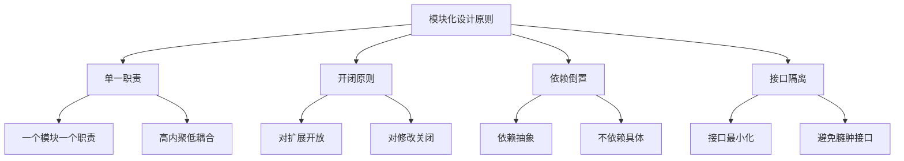

# 模块化最佳实践

## 模块化设计原则

### 设计原则


### 模块化质量指标
| 指标 | 描述 | 最佳实践 |
|------|------|----------|
| 耦合度 | 模块间依赖程度 | 低耦合 |
| 内聚度 | 模块内相关程度 | 高内聚 |
| 模块大小 | 单个模块代码量 | 适中大小 |
| 依赖深度 | 依赖链长度 | < 5层 |

## 模块设计模式

### 单一职责模式
```javascript
// 1. 用户数据模型 - 只负责数据定义
// user-model.js
export class User {
    constructor(name, email, age) {
        this.name = name;
        this.email = email;
        this.age = age;
        this.createdAt = new Date();
    }
    
    validate() {
        if (!this.name || !this.email) {
            throw new Error('用户名和邮箱不能为空');
        }
        if (this.age < 0 || this.age > 150) {
            throw new Error('年龄必须在0-150之间');
        }
        return true;
    }
    
    toJSON() {
        return {
            name: this.name,
            email: this.email,
            age: this.age,
            createdAt: this.createdAt
        };
    }
}

// 2. 用户服务 - 只负责业务逻辑
// user-service.js
import { User } from './user-model.js';
import { ApiClient } from './api-client.js';

export class UserService {
    constructor(apiClient) {
        this.apiClient = apiClient;
    }
    
    async createUser(name, email, age) {
        const user = new User(name, email, age);
        user.validate();
        
        const userData = user.toJSON();
        const response = await this.apiClient.post('/users', userData);
        
        return new User(response.name, response.email, response.age);
    }
    
    async getUser(id) {
        const response = await this.apiClient.get(`/users/${id}`);
        return new User(response.name, response.email, response.age);
    }
    
    async updateUser(id, userData) {
        const response = await this.apiClient.put(`/users/${id}`, userData);
        return new User(response.name, response.email, response.age);
    }
    
    async deleteUser(id) {
        await this.apiClient.delete(`/users/${id}`);
        return true;
    }
}

// 3. 用户视图 - 只负责UI展示
// user-view.js
export class UserView {
    constructor(container) {
        this.container = container;
    }
    
    render(user) {
        const userElement = document.createElement('div');
        userElement.className = 'user';
        userElement.innerHTML = `
            <h3>${user.name}</h3>
            <p>邮箱: ${user.email}</p>
            <p>年龄: ${user.age}</p>
            <p>创建时间: ${user.createdAt.toLocaleDateString()}</p>
        `;
        
        this.container.appendChild(userElement);
    }
    
    renderList(users) {
        this.container.innerHTML = '';
        users.forEach(user => this.render(user));
    }
    
    showError(message) {
        const errorElement = document.createElement('div');
        errorElement.className = 'error';
        errorElement.textContent = message;
        this.container.appendChild(errorElement);
    }
}
```

### 依赖注入模式
```javascript
// 1. 依赖注入容器
// container.js
class Container {
    constructor() {
        this.services = new Map();
        this.singletons = new Map();
    }
    
    register(name, factory, singleton = false) {
        this.services.set(name, { factory, singleton });
    }
    
    get(name) {
        const service = this.services.get(name);
        if (!service) {
            throw new Error(`服务 ${name} 未注册`);
        }
        
        if (service.singleton) {
            if (!this.singletons.has(name)) {
                this.singletons.set(name, service.factory());
            }
            return this.singletons.get(name);
        }
        
        return service.factory();
    }
}

export const container = new Container();

// 2. 服务注册
// service-registration.js
import { container } from './container.js';
import { ApiClient } from './api-client.js';
import { UserService } from './user-service.js';
import { UserView } from './user-view.js';

// 注册服务
container.register('apiClient', () => new ApiClient('https://api.example.com'), true);
container.register('userService', () => new UserService(container.get('apiClient')), true);
container.register('userView', () => new UserView(document.getElementById('user-container')));

// 3. 使用依赖注入
// user-controller.js
import { container } from './container.js';

export class UserController {
    constructor() {
        this.userService = container.get('userService');
        this.userView = container.get('userView');
        this.setupEventListeners();
    }
    
    setupEventListeners() {
        document.getElementById('create-user-btn').addEventListener('click', () => {
            this.createUser();
        });
        
        document.getElementById('load-users-btn').addEventListener('click', () => {
            this.loadUsers();
        });
    }
    
    async createUser() {
        try {
            const name = document.getElementById('user-name').value;
            const email = document.getElementById('user-email').value;
            const age = parseInt(document.getElementById('user-age').value);
            
            const user = await this.userService.createUser(name, email, age);
            this.userView.render(user);
        } catch (error) {
            this.userView.showError(error.message);
        }
    }
    
    async loadUsers() {
        try {
            const users = await this.userService.getAllUsers();
            this.userView.renderList(users);
        } catch (error) {
            this.userView.showError(error.message);
        }
    }
}
```

### 工厂模式
```javascript
// 1. 抽象工厂
// user-factory.js
import { User } from './user-model.js';
import { UserService } from './user-service.js';
import { UserView } from './user-view.js';
import { ApiClient } from './api-client.js';

export class UserFactory {
    static createUser(name, email, age) {
        return new User(name, email, age);
    }
    
    static createUserService(baseUrl) {
        const apiClient = new ApiClient(baseUrl);
        return new UserService(apiClient);
    }
    
    static createUserView(container) {
        return new UserView(container);
    }
    
    static createUserController(container) {
        const userService = this.createUserService('https://api.example.com');
        const userView = this.createUserView(container);
        
        return new UserController(userService, userView);
    }
}

// 2. 具体工厂
// admin-user-factory.js
import { UserFactory } from './user-factory.js';
import { AdminUser } from './admin-user.js';
import { AdminUserService } from './admin-user-service.js';

export class AdminUserFactory extends UserFactory {
    static createUser(name, email, age, permissions) {
        return new AdminUser(name, email, age, permissions);
    }
    
    static createUserService(baseUrl) {
        const apiClient = new ApiClient(baseUrl);
        return new AdminUserService(apiClient);
    }
}

// 3. 使用工厂
// main.js
import { UserFactory } from './user-factory.js';
import { AdminUserFactory } from './admin-user-factory.js';

// 创建普通用户
const user = UserFactory.createUser('John', 'john@example.com', 30);
const userService = UserFactory.createUserService('https://api.example.com');

// 创建管理员用户
const adminUser = AdminUserFactory.createUser('Admin', 'admin@example.com', 35, ['read', 'write', 'delete']);
const adminService = AdminUserFactory.createUserService('https://admin-api.example.com');
```

## 模块组织

### 目录结构
```javascript
// 1. 按功能组织
/*
src/
├── modules/
│   ├── user/
│   │   ├── user-model.js
│   │   ├── user-service.js
│   │   ├── user-view.js
│   │   ├── user-controller.js
│   │   └── index.js
│   ├── product/
│   │   ├── product-model.js
│   │   ├── product-service.js
│   │   ├── product-view.js
│   │   ├── product-controller.js
│   │   └── index.js
│   └── common/
│       ├── api-client.js
│       ├── utils.js
│       ├── constants.js
│       └── index.js
├── components/
│   ├── header/
│   ├── sidebar/
│   └── footer/
└── main.js
*/

// 2. 模块入口文件
// modules/user/index.js
export { User } from './user-model.js';
export { UserService } from './user-service.js';
export { UserView } from './user-view.js';
export { UserController } from './user-controller.js';

// 3. 使用模块
// main.js
import { UserController } from './modules/user/index.js';
import { ProductController } from './modules/product/index.js';

const userController = new UserController();
const productController = new ProductController();
```

### 模块命名
```javascript
// 1. 命名空间
// 使用命名空间避免冲突
export const UserModule = {
    User: class User { /* ... */ },
    UserService: class UserService { /* ... */ },
    UserView: class UserView { /* ... */ }
};

// 2. 版本管理
// 使用版本号管理模块
export const UserModuleV1 = {
    User: class User { /* ... */ }
};

export const UserModuleV2 = {
    User: class User { /* ... */ }
};

// 3. 环境区分
// 根据环境加载不同模块
const isDevelopment = process.env.NODE_ENV === 'development';

if (isDevelopment) {
    const { DevUserService } = await import('./user-service-dev.js');
    export const UserService = DevUserService;
} else {
    const { ProdUserService } = await import('./user-service-prod.js');
    export const UserService = ProdUserService;
}
```

## 性能优化

### 懒加载优化
```javascript
// 1. 路由懒加载
// router.js
class Router {
    constructor() {
        this.routes = new Map();
        this.loadedModules = new Map();
    }
    
    addRoute(path, modulePath) {
        this.routes.set(path, modulePath);
    }
    
    async navigate(path) {
        const modulePath = this.routes.get(path);
        if (!modulePath) {
            throw new Error(`路由 ${path} 不存在`);
        }
        
        let module = this.loadedModules.get(modulePath);
        if (!module) {
            module = await import(modulePath);
            this.loadedModules.set(modulePath, module);
        }
        
        return module;
    }
}

// 2. 组件懒加载
// component-loader.js
class ComponentLoader {
    constructor() {
        this.components = new Map();
        this.loadingPromises = new Map();
    }
    
    async loadComponent(componentName) {
        if (this.components.has(componentName)) {
            return this.components.get(componentName);
        }
        
        if (this.loadingPromises.has(componentName)) {
            return this.loadingPromises.get(componentName);
        }
        
        const loadingPromise = this.loadComponentAsync(componentName);
        this.loadingPromises.set(componentName, loadingPromise);
        
        try {
            const component = await loadingPromise;
            this.components.set(componentName, component);
            this.loadingPromises.delete(componentName);
            return component;
        } catch (error) {
            this.loadingPromises.delete(componentName);
            throw error;
        }
    }
    
    async loadComponentAsync(componentName) {
        const module = await import(`./components/${componentName}.js`);
        return module.default;
    }
}

// 3. 条件加载
// conditional-loader.js
class ConditionalLoader {
    constructor() {
        this.conditions = new Map();
    }
    
    addCondition(modulePath, condition) {
        this.conditions.set(modulePath, condition);
    }
    
    async loadIf(modulePath) {
        const condition = this.conditions.get(modulePath);
        if (condition && condition()) {
            return await import(modulePath);
        }
        return null;
    }
}

// 使用条件加载
const loader = new ConditionalLoader();
loader.addCondition('./admin-module.js', () => user.isAdmin);
loader.addCondition('./premium-module.js', () => user.isPremium);

const adminModule = await loader.loadIf('./admin-module.js');
const premiumModule = await loader.loadIf('./premium-module.js');
```

### 缓存优化
```javascript
// 1. 模块缓存
// module-cache.js
class ModuleCache {
    constructor(maxSize = 100) {
        this.cache = new Map();
        this.maxSize = maxSize;
        this.accessOrder = [];
    }
    
    async get(modulePath) {
        if (this.cache.has(modulePath)) {
            this.updateAccessOrder(modulePath);
            return this.cache.get(modulePath);
        }
        
        const module = await import(modulePath);
        this.set(modulePath, module);
        return module;
    }
    
    set(modulePath, module) {
        if (this.cache.size >= this.maxSize) {
            this.evictOldest();
        }
        
        this.cache.set(modulePath, module);
        this.accessOrder.push(modulePath);
    }
    
    updateAccessOrder(modulePath) {
        const index = this.accessOrder.indexOf(modulePath);
        this.accessOrder.splice(index, 1);
        this.accessOrder.push(modulePath);
    }
    
    evictOldest() {
        const oldest = this.accessOrder.shift();
        this.cache.delete(oldest);
    }
}

// 2. 预加载缓存
// preload-cache.js
class PreloadCache {
    constructor() {
        this.preloadedModules = new Map();
        this.preloadPromises = new Map();
    }
    
    preload(modulePath) {
        if (this.preloadedModules.has(modulePath)) {
            return Promise.resolve(this.preloadedModules.get(modulePath));
        }
        
        if (this.preloadPromises.has(modulePath)) {
            return this.preloadPromises.get(modulePath);
        }
        
        const preloadPromise = this.preloadModule(modulePath);
        this.preloadPromises.set(modulePath, preloadPromise);
        
        return preloadPromise;
    }
    
    async preloadModule(modulePath) {
        const module = await import(modulePath);
        this.preloadedModules.set(modulePath, module);
        this.preloadPromises.delete(modulePath);
        return module;
    }
    
    get(modulePath) {
        return this.preloadedModules.get(modulePath);
    }
}
```

## 错误处理

### 模块错误处理
```javascript
// 1. 模块加载错误处理
// error-handler.js
class ModuleErrorHandler {
    constructor() {
        this.errorCounts = new Map();
        this.maxRetries = 3;
    }
    
    async loadWithRetry(modulePath) {
        let retries = 0;
        
        while (retries < this.maxRetries) {
            try {
                const module = await import(modulePath);
                this.resetErrorCount(modulePath);
                return module;
            } catch (error) {
                retries++;
                this.incrementErrorCount(modulePath);
                
                if (retries >= this.maxRetries) {
                    this.handleFinalError(modulePath, error);
                    throw error;
                }
                
                await this.delay(1000 * retries); // 指数退避
            }
        }
    }
    
    incrementErrorCount(modulePath) {
        const count = this.errorCounts.get(modulePath) || 0;
        this.errorCounts.set(modulePath, count + 1);
    }
    
    resetErrorCount(modulePath) {
        this.errorCounts.delete(modulePath);
    }
    
    handleFinalError(modulePath, error) {
        console.error(`模块 ${modulePath} 加载最终失败:`, error);
        // 发送错误报告
        this.reportError(modulePath, error);
    }
    
    reportError(modulePath, error) {
        // 发送到错误监控服务
        console.log(`向监控服务报告错误: ${modulePath}`);
    }
    
    delay(ms) {
        return new Promise(resolve => setTimeout(resolve, ms));
    }
}

// 2. 模块初始化错误处理
// module-initializer.js
class ModuleInitializer {
    constructor() {
        this.initializedModules = new Set();
        this.failedModules = new Set();
    }
    
    async initialize(modulePath) {
        if (this.initializedModules.has(modulePath)) {
            return true;
        }
        
        if (this.failedModules.has(modulePath)) {
            throw new Error(`模块 ${modulePath} 初始化失败`);
        }
        
        try {
            const module = await import(modulePath);
            
            if (module.initialize && typeof module.initialize === 'function') {
                await module.initialize();
            }
            
            this.initializedModules.add(modulePath);
            return true;
        } catch (error) {
            this.failedModules.add(modulePath);
            console.error(`模块 ${modulePath} 初始化失败:`, error);
            throw error;
        }
    }
    
    async initializeAll(modulePaths) {
        const results = await Promise.allSettled(
            modulePaths.map(path => this.initialize(path))
        );
        
        const successful = results
            .filter(result => result.status === 'fulfilled')
            .length;
        
        const failed = results
            .filter(result => result.status === 'rejected')
            .length;
        
        console.log(`模块初始化完成: 成功 ${successful}, 失败 ${failed}`);
        return results;
    }
}
```

### 错误恢复
```javascript
// 1. 错误恢复策略
// error-recovery.js
class ErrorRecovery {
    constructor() {
        this.recoveryStrategies = new Map();
    }
    
    addRecoveryStrategy(modulePath, strategy) {
        this.recoveryStrategies.set(modulePath, strategy);
    }
    
    async recover(modulePath, error) {
        const strategy = this.recoveryStrategies.get(modulePath);
        if (!strategy) {
            throw error;
        }
        
        try {
            return await strategy(error);
        } catch (recoveryError) {
            console.error(`模块 ${modulePath} 恢复失败:`, recoveryError);
            throw recoveryError;
        }
    }
    
    // 默认恢复策略
    static createDefaultStrategy() {
        return async (error) => {
            console.log('使用默认恢复策略');
            // 返回默认模块
            return {
                default: class DefaultModule {
                    static getInstance() {
                        return new DefaultModule();
                    }
                }
            };
        };
    }
    
    // 重试恢复策略
    static createRetryStrategy(maxRetries = 3) {
        return async (error) => {
            for (let i = 0; i < maxRetries; i++) {
                try {
                    // 重新加载模块
                    return await import(modulePath);
                } catch (retryError) {
                    if (i === maxRetries - 1) {
                        throw retryError;
                    }
                    await new Promise(resolve => setTimeout(resolve, 1000 * (i + 1)));
                }
            }
        };
    }
}

// 2. 使用错误恢复
const recovery = new ErrorRecovery();

// 添加恢复策略
recovery.addRecoveryStrategy('./critical-module.js', ErrorRecovery.createRetryStrategy(5));
recovery.addRecoveryStrategy('./optional-module.js', ErrorRecovery.createDefaultStrategy());

// 加载模块并处理错误
try {
    const module = await import('./critical-module.js');
    return module;
} catch (error) {
    const recoveredModule = await recovery.recover('./critical-module.js', error);
    return recoveredModule;
}
```

## 相关链接
- [[02-理解掌握层/04-模块化/01-CommonJS规范]] - CommonJS规范
- [[02-理解掌握层/04-模块化/02-AMD-CMD规范]] - AMD-CMD规范
- [[02-理解掌握层/04-模块化/03-ES6模块系统]] - ES6模块系统
- [[02-理解掌握层/04-模块化/04-模块加载机制]] - 模块加载机制
