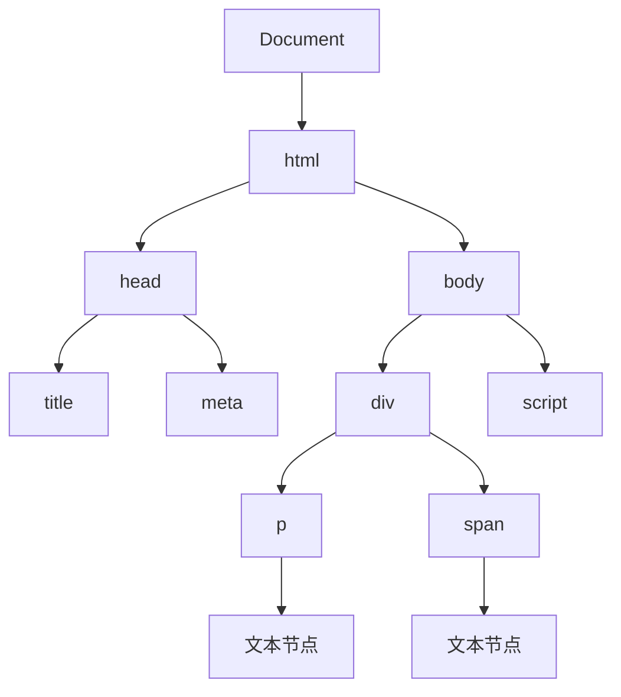
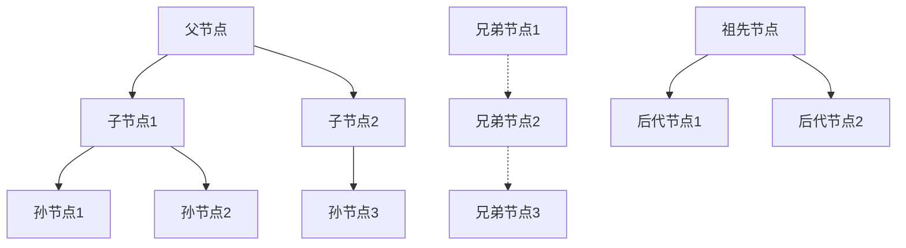

# DOM树结构

## DOM基础概念

### DOM树结构图


### DOM节点类型
| 节点类型 | 数值 | 描述 | 示例 |
|----------|------|------|------|
| ELEMENT_NODE | 1 | 元素节点 | `<div>`, `<p>`, `<span>` |
| ATTRIBUTE_NODE | 2 | 属性节点 | `class="container"` |
| TEXT_NODE | 3 | 文本节点 | "Hello World" |
| CDATA_SECTION_NODE | 4 | CDATA节点 | `<![CDATA[...]]>` |
| ENTITY_REFERENCE_NODE | 5 | 实体引用节点 | `&amp;` |
| ENTITY_NODE | 6 | 实体节点 | `<!ENTITY...>` |
| PROCESSING_INSTRUCTION_NODE | 7 | 处理指令节点 | `<?xml version="1.0"?>` |
| COMMENT_NODE | 8 | 注释节点 | `<!-- 注释 -->` |
| DOCUMENT_NODE | 9 | 文档节点 | `document` |
| DOCUMENT_TYPE_NODE | 10 | 文档类型节点 | `<!DOCTYPE html>` |
| DOCUMENT_FRAGMENT_NODE | 11 | 文档片段节点 | `DocumentFragment` |
| NOTATION_NODE | 12 | 记号节点 | `<!NOTATION...>` |

## DOM节点关系

### 节点关系图


### 节点关系属性
```javascript
// 1. 父子关系
function demonstrateParentChild() {
    var parent = document.getElementById('parent');
    var child = document.getElementById('child');
    
    // 父节点属性
    console.log('Parent node:', child.parentNode);
    console.log('Parent element:', child.parentElement);
    
    // 子节点属性
    console.log('First child:', parent.firstChild);
    console.log('Last child:', parent.lastChild);
    console.log('Child nodes:', parent.childNodes);
    console.log('Children:', parent.children);
    
    // 子节点数量
    console.log('Child count:', parent.childElementCount);
}

// 2. 兄弟关系
function demonstrateSiblings() {
    var element = document.getElementById('middle');
    
    // 兄弟节点
    console.log('Previous sibling:', element.previousSibling);
    console.log('Next sibling:', element.nextSibling);
    console.log('Previous element:', element.previousElementSibling);
    console.log('Next element:', element.nextElementSibling);
}

// 3. 节点遍历
function traverseNodes(node, level = 0) {
    var indent = '  '.repeat(level);
    console.log(indent + node.nodeName + ' (' + node.nodeType + ')');
    
    if (node.nodeType === Node.ELEMENT_NODE) {
        console.log(indent + '  Attributes:', node.attributes.length);
        for (var i = 0; i < node.attributes.length; i++) {
            var attr = node.attributes[i];
            console.log(indent + '    ' + attr.name + '=' + attr.value);
        }
    }
    
    if (node.nodeType === Node.TEXT_NODE) {
        console.log(indent + '  Text: "' + node.textContent.trim() + '"');
    }
    
    // 递归遍历子节点
    for (var i = 0; i < node.childNodes.length; i++) {
        traverseNodes(node.childNodes[i], level + 1);
    }
}

// 使用示例
var root = document.documentElement;
traverseNodes(root);
```

## DOM节点操作

### 创建节点
```javascript
// 1. 创建元素节点
function createElementNode() {
    // 创建div元素
    var div = document.createElement('div');
    div.className = 'container';
    div.id = 'myDiv';
    
    // 创建文本节点
    var text = document.createTextNode('Hello World');
    div.appendChild(text);
    
    // 创建属性节点
    div.setAttribute('data-value', '123');
    
    return div;
}

// 2. 创建文档片段
function createDocumentFragment() {
    var fragment = document.createDocumentFragment();
    
    for (var i = 0; i < 1000; i++) {
        var li = document.createElement('li');
        li.textContent = 'Item ' + i;
        fragment.appendChild(li);
    }
    
    return fragment;
}

// 3. 克隆节点
function cloneNode() {
    var original = document.getElementById('original');
    
    // 浅克隆（只克隆节点本身）
    var shallowClone = original.cloneNode(false);
    
    // 深克隆（克隆节点及其所有子节点）
    var deepClone = original.cloneNode(true);
    
    return { shallowClone, deepClone };
}
```

### 插入节点
```javascript
// 1. 基本插入方法
function insertNodes() {
    var container = document.getElementById('container');
    var newElement = document.createElement('div');
    newElement.textContent = 'New Element';
    
    // appendChild - 添加到末尾
    container.appendChild(newElement);
    
    // insertBefore - 插入到指定位置
    var referenceNode = container.firstChild;
    var anotherElement = document.createElement('div');
    anotherElement.textContent = 'Another Element';
    container.insertBefore(anotherElement, referenceNode);
    
    // insertAdjacentElement - 相对位置插入
    var target = document.getElementById('target');
    var adjacentElement = document.createElement('div');
    adjacentElement.textContent = 'Adjacent Element';
    
    // 插入到目标元素之前
    target.insertAdjacentElement('beforebegin', adjacentElement);
    
    // 插入到目标元素内部开始
    target.insertAdjacentElement('afterbegin', adjacentElement);
    
    // 插入到目标元素内部结束
    target.insertAdjacentElement('beforeend', adjacentElement);
    
    // 插入到目标元素之后
    target.insertAdjacentElement('afterend', adjacentElement);
}

// 2. 批量插入
function batchInsert() {
    var container = document.getElementById('container');
    var fragment = document.createDocumentFragment();
    
    // 创建多个元素
    for (var i = 0; i < 100; i++) {
        var div = document.createElement('div');
        div.textContent = 'Item ' + i;
        fragment.appendChild(div);
    }
    
    // 一次性插入所有元素
    container.appendChild(fragment);
}

// 3. 动态插入
function dynamicInsert() {
    var container = document.getElementById('container');
    var items = ['Apple', 'Banana', 'Orange', 'Grape'];
    
    items.forEach(function(item, index) {
        var li = document.createElement('li');
        li.textContent = item;
        li.className = 'item';
        li.dataset.index = index;
        
        // 添加点击事件
        li.addEventListener('click', function() {
            console.log('Clicked:', item, 'Index:', index);
        });
        
        container.appendChild(li);
    });
}
```

### 删除节点
```javascript
// 1. 基本删除方法
function removeNodes() {
    var container = document.getElementById('container');
    var elementToRemove = document.getElementById('toRemove');
    
    // removeChild - 删除子节点
    if (elementToRemove && container.contains(elementToRemove)) {
        container.removeChild(elementToRemove);
    }
    
    // remove - 删除自身（现代方法）
    var selfRemoving = document.getElementById('selfRemoving');
    if (selfRemoving) {
        selfRemoving.remove();
    }
}

// 2. 批量删除
function batchRemove() {
    var container = document.getElementById('container');
    var itemsToRemove = container.querySelectorAll('.to-remove');
    
    // 方法1：使用forEach
    itemsToRemove.forEach(function(item) {
        item.remove();
    });
    
    // 方法2：使用while循环
    while (container.firstChild) {
        container.removeChild(container.firstChild);
    }
    
    // 方法3：使用innerHTML清空
    container.innerHTML = '';
}

// 3. 条件删除
function conditionalRemove() {
    var container = document.getElementById('container');
    var items = container.querySelectorAll('.item');
    
    items.forEach(function(item) {
        var value = parseInt(item.dataset.value);
        
        // 删除值大于50的项目
        if (value > 50) {
            item.remove();
        }
    });
}
```

## DOM属性操作

### 标准属性
```javascript
// 1. 基本属性操作
function basicAttributes() {
    var element = document.getElementById('myElement');
    
    // 设置属性
    element.id = 'newId';
    element.className = 'new-class';
    element.title = 'New Title';
    
    // 获取属性
    console.log('ID:', element.id);
    console.log('Class:', element.className);
    console.log('Title:', element.title);
    
    // 检查属性
    console.log('Has ID:', element.hasAttribute('id'));
    console.log('Has Class:', element.hasAttribute('class'));
}

// 2. 自定义属性
function customAttributes() {
    var element = document.getElementById('myElement');
    
    // 使用setAttribute/getAttribute
    element.setAttribute('data-custom', 'custom-value');
    element.setAttribute('aria-label', 'Custom label');
    
    console.log('Custom attribute:', element.getAttribute('data-custom'));
    console.log('Aria label:', element.getAttribute('aria-label'));
    
    // 使用dataset（推荐方式）
    element.dataset.userId = '12345';
    element.dataset.role = 'admin';
    
    console.log('User ID:', element.dataset.userId);
    console.log('Role:', element.dataset.role);
}

// 3. 属性遍历
function iterateAttributes() {
    var element = document.getElementById('myElement');
    
    // 遍历所有属性
    for (var i = 0; i < element.attributes.length; i++) {
        var attr = element.attributes[i];
        console.log(attr.name + '=' + attr.value);
    }
    
    // 使用for...of遍历
    for (var attr of element.attributes) {
        console.log(attr.name + '=' + attr.value);
    }
}
```

### 样式属性
```javascript
// 1. 内联样式
function inlineStyles() {
    var element = document.getElementById('myElement');
    
    // 设置样式
    element.style.color = 'red';
    element.style.backgroundColor = 'yellow';
    element.style.fontSize = '16px';
    element.style.marginTop = '10px';
    
    // 获取样式
    console.log('Color:', element.style.color);
    console.log('Background:', element.style.backgroundColor);
    
    // 移除样式
    element.style.color = '';
    element.style.removeProperty('background-color');
}

// 2. 计算样式
function computedStyles() {
    var element = document.getElementById('myElement');
    
    // 获取计算样式
    var computedStyle = window.getComputedStyle(element);
    
    console.log('Computed color:', computedStyle.color);
    console.log('Computed font-size:', computedStyle.fontSize);
    console.log('Computed margin:', computedStyle.margin);
    
    // 获取特定属性
    var color = computedStyle.getPropertyValue('color');
    var fontSize = computedStyle.getPropertyValue('font-size');
    
    console.log('Color:', color);
    console.log('Font size:', fontSize);
}

// 3. 类名操作
function classNameOperations() {
    var element = document.getElementById('myElement');
    
    // 添加类名
    element.classList.add('active');
    element.classList.add('highlight', 'selected');
    
    // 移除类名
    element.classList.remove('inactive');
    element.classList.remove('old-class', 'deprecated');
    
    // 切换类名
    element.classList.toggle('visible');
    element.classList.toggle('hidden', true); // 强制添加
    element.classList.toggle('shown', false); // 强制移除
    
    // 检查类名
    console.log('Has active:', element.classList.contains('active'));
    console.log('Has inactive:', element.classList.contains('inactive'));
    
    // 替换类名
    element.classList.replace('old-class', 'new-class');
    
    // 获取所有类名
    console.log('All classes:', element.classList.toString());
    console.log('Class list:', Array.from(element.classList));
}
```

## DOM内容操作

### 文本内容
```javascript
// 1. 文本内容操作
function textContentOperations() {
    var element = document.getElementById('myElement');
    
    // innerHTML - 包含HTML标签
    element.innerHTML = '<strong>Bold text</strong> and <em>italic text</em>';
    console.log('Inner HTML:', element.innerHTML);
    
    // textContent - 纯文本
    element.textContent = 'Plain text content';
    console.log('Text content:', element.textContent);
    
    // innerText - 可见文本（IE兼容）
    element.innerText = 'Visible text content';
    console.log('Inner text:', element.innerText);
}

// 2. 文本节点操作
function textNodeOperations() {
    var element = document.getElementById('myElement');
    
    // 创建文本节点
    var textNode = document.createTextNode('New text content');
    
    // 插入文本节点
    element.appendChild(textNode);
    
    // 修改文本内容
    textNode.textContent = 'Modified text content';
    
    // 分割文本节点
    var newTextNode = textNode.splitText(5); // 从第5个字符开始分割
    console.log('Original:', textNode.textContent);
    console.log('New:', newTextNode.textContent);
}

// 3. 内容替换
function contentReplacement() {
    var element = document.getElementById('myElement');
    
    // 替换所有内容
    element.innerHTML = '<p>New content</p>';
    
    // 追加内容
    element.innerHTML += '<span>Additional content</span>';
    
    // 插入到开头
    element.innerHTML = '<div>First content</div>' + element.innerHTML;
    
    // 使用insertAdjacentHTML
    element.insertAdjacentHTML('beforeend', '<p>Appended content</p>');
    element.insertAdjacentHTML('afterbegin', '<p>Prepended content</p>');
}
```

## DOM性能优化

### 批量操作
```javascript
// 1. 使用DocumentFragment
function useDocumentFragment() {
    var container = document.getElementById('container');
    var fragment = document.createDocumentFragment();
    
    // 在内存中构建DOM
    for (var i = 0; i < 1000; i++) {
        var div = document.createElement('div');
        div.textContent = 'Item ' + i;
        fragment.appendChild(div);
    }
    
    // 一次性插入到DOM
    container.appendChild(fragment);
}

// 2. 使用innerHTML批量操作
function useInnerHTML() {
    var container = document.getElementById('container');
    var html = '';
    
    // 构建HTML字符串
    for (var i = 0; i < 1000; i++) {
        html += '<div>Item ' + i + '</div>';
    }
    
    // 一次性设置
    container.innerHTML = html;
}

// 3. 隐藏元素进行操作
function hideDuringOperation() {
    var container = document.getElementById('container');
    
    // 隐藏元素
    container.style.display = 'none';
    
    // 执行大量DOM操作
    for (var i = 0; i < 1000; i++) {
        var div = document.createElement('div');
        div.textContent = 'Item ' + i;
        container.appendChild(div);
    }
    
    // 显示元素
    container.style.display = 'block';
}
```

### 缓存DOM引用
```javascript
// 1. 缓存常用元素
function cacheDOMReferences() {
    // 缓存DOM引用
    var elements = {
        container: document.getElementById('container'),
        button: document.getElementById('button'),
        input: document.getElementById('input'),
        output: document.getElementById('output')
    };
    
    // 使用缓存的引用
    function updateContent() {
        elements.output.textContent = elements.input.value;
    }
    
    elements.button.addEventListener('click', updateContent);
    elements.input.addEventListener('input', updateContent);
    
    return elements;
}

// 2. 避免重复查询
function avoidRepeatedQueries() {
    var container = document.getElementById('container');
    
    // 错误：重复查询
    function badExample() {
        for (var i = 0; i < 100; i++) {
            var element = document.getElementById('item-' + i); // 每次都查询
            element.style.color = 'red';
        }
    }
    
    // 正确：缓存查询结果
    function goodExample() {
        var elements = [];
        for (var i = 0; i < 100; i++) {
            elements.push(document.getElementById('item-' + i));
        }
        
        elements.forEach(function(element) {
            element.style.color = 'red';
        });
    }
}
```

## 相关链接
- [[03-应用实践层/01-DOM操作/02-元素选择与操作]] - 元素选择方法
- [[03-应用实践层/01-DOM操作/03-事件处理机制]] - 事件处理详解
- [[03-应用实践层/01-DOM操作/04-事件委托模式]] - 事件委托优化
- [[03-应用实践层/01-DOM操作/05-性能优化技巧]] - DOM性能优化
- [[03-应用实践层/01-DOM操作/06-现代DOM API]] - 现代DOM API
- [[03-应用实践层/01-DOM操作/07-代码示例库-DOM操作]] - 代码示例
