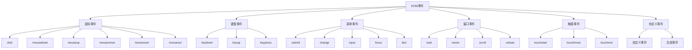

# 事件处理机制

## 事件基础概念

### 事件类型分类


### 事件对象属性
```javascript
// 1. 基本事件对象
function handleEvent(event) {
    console.log('Event type:', event.type);
    console.log('Target:', event.target);
    console.log('Current target:', event.currentTarget);
    console.log('Time stamp:', event.timeStamp);
    console.log('Bubbles:', event.bubbles);
    console.log('Cancelable:', event.cancelable);
    console.log('Default prevented:', event.defaultPrevented);
}

// 2. 鼠标事件对象
function handleMouseEvent(event) {
    console.log('Mouse event details:');
    console.log('Button:', event.button);
    console.log('Buttons:', event.buttons);
    console.log('Client X:', event.clientX);
    console.log('Client Y:', event.clientY);
    console.log('Screen X:', event.screenX);
    console.log('Screen Y:', event.screenY);
    console.log('Page X:', event.pageX);
    console.log('Page Y:', event.pageY);
    console.log('Ctrl key:', event.ctrlKey);
    console.log('Shift key:', event.shiftKey);
    console.log('Alt key:', event.altKey);
    console.log('Meta key:', event.metaKey);
}

// 3. 键盘事件对象
function handleKeyboardEvent(event) {
    console.log('Keyboard event details:');
    console.log('Key:', event.key);
    console.log('Code:', event.code);
    console.log('Key code:', event.keyCode);
    console.log('Which:', event.which);
    console.log('Repeat:', event.repeat);
    console.log('Ctrl key:', event.ctrlKey);
    console.log('Shift key:', event.shiftKey);
    console.log('Alt key:', event.altKey);
    console.log('Meta key:', event.metaKey);
}
```

## 事件监听器

### 基本事件监听
```javascript
// 1. addEventListener方法
function basicEventListener() {
    var button = document.getElementById('myButton');
    
    // 添加事件监听器
    button.addEventListener('click', function(event) {
        console.log('Button clicked!');
        console.log('Event:', event);
    });
    
    // 添加多个监听器
    button.addEventListener('click', function(event) {
        console.log('Second click handler');
    });
    
    // 使用命名函数
    function handleClick(event) {
        console.log('Named function handler');
    }
    
    button.addEventListener('click', handleClick);
    
    // 移除事件监听器
    button.removeEventListener('click', handleClick);
}

// 2. 事件监听器选项
function eventListenerOptions() {
    var element = document.getElementById('myElement');
    
    // 基本选项
    element.addEventListener('click', function(event) {
        console.log('Click event');
    }, false); // useCapture
    
    // 现代选项对象
    element.addEventListener('click', function(event) {
        console.log('Click with options');
    }, {
        capture: false,        // 是否在捕获阶段触发
        once: true,           // 是否只触发一次
        passive: true,        // 是否被动监听
        signal: abortController.signal // 取消信号
    });
    
    // 创建AbortController
    var abortController = new AbortController();
    
    // 取消事件监听器
    setTimeout(function() {
        abortController.abort();
    }, 5000);
}

// 3. 事件监听器管理
function eventListenerManagement() {
    var element = document.getElementById('myElement');
    var listeners = [];
    
    // 添加监听器并记录
    function addManagedListener(event, handler, options) {
        element.addEventListener(event, handler, options);
        listeners.push({ event, handler, options });
    }
    
    // 移除所有监听器
    function removeAllListeners() {
        listeners.forEach(function(listener) {
            element.removeEventListener(
                listener.event, 
                listener.handler, 
                listener.options
            );
        });
        listeners = [];
    }
    
    // 使用示例
    addManagedListener('click', function() {
        console.log('Click 1');
    });
    
    addManagedListener('click', function() {
        console.log('Click 2');
    });
    
    // 5秒后移除所有监听器
    setTimeout(removeAllListeners, 5000);
}
```

### 事件处理函数
```javascript
// 1. 事件处理函数类型
function eventHandlerTypes() {
    var element = document.getElementById('myElement');
    
    // 内联事件处理（不推荐）
    element.onclick = function(event) {
        console.log('Inline handler');
    };
    
    // 命名函数处理
    function namedHandler(event) {
        console.log('Named handler');
    }
    
    element.addEventListener('click', namedHandler);
    
    // 箭头函数处理
    var arrowHandler = (event) => {
        console.log('Arrow handler');
    };
    
    element.addEventListener('click', arrowHandler);
    
    // 类方法处理
    class EventHandler {
        constructor(element) {
            this.element = element;
            this.boundHandler = this.handleEvent.bind(this);
            this.element.addEventListener('click', this.boundHandler);
        }
        
        handleEvent(event) {
            console.log('Class method handler');
        }
        
        destroy() {
            this.element.removeEventListener('click', this.boundHandler);
        }
    }
}

// 2. 事件处理函数优化
function optimizedEventHandlers() {
    var elements = document.querySelectorAll('.item');
    
    // 使用事件委托
    var container = document.getElementById('container');
    container.addEventListener('click', function(event) {
        if (event.target.classList.contains('item')) {
            handleItemClick(event.target);
        }
    });
    
    function handleItemClick(element) {
        console.log('Item clicked:', element.textContent);
    }
    
    // 使用防抖
    function debounce(func, wait) {
        var timeout;
        return function executedFunction(...args) {
            var later = function() {
                clearTimeout(timeout);
                func(...args);
            };
            clearTimeout(timeout);
            timeout = setTimeout(later, wait);
        };
    }
    
    var debouncedHandler = debounce(function(event) {
        console.log('Debounced handler');
    }, 300);
    
    window.addEventListener('resize', debouncedHandler);
    
    // 使用节流
    function throttle(func, limit) {
        var inThrottle;
        return function() {
            var args = arguments;
            var context = this;
            if (!inThrottle) {
                func.apply(context, args);
                inThrottle = true;
                setTimeout(function() {
                    inThrottle = false;
                }, limit);
            }
        };
    }
    
    var throttledHandler = throttle(function(event) {
        console.log('Throttled handler');
    }, 100);
    
    window.addEventListener('scroll', throttledHandler);
}
```

## 事件流机制

### 事件捕获和冒泡
```javascript
// 1. 事件流阶段
function eventFlowPhases() {
    var outer = document.getElementById('outer');
    var inner = document.getElementById('inner');
    
    // 捕获阶段监听器
    outer.addEventListener('click', function(event) {
        console.log('Outer - Capture phase');
    }, true);
    
    inner.addEventListener('click', function(event) {
        console.log('Inner - Capture phase');
    }, true);
    
    // 冒泡阶段监听器
    inner.addEventListener('click', function(event) {
        console.log('Inner - Bubble phase');
    }, false);
    
    outer.addEventListener('click', function(event) {
        console.log('Outer - Bubble phase');
    }, false);
    
    // 事件流顺序：
    // 1. Outer - Capture phase
    // 2. Inner - Capture phase
    // 3. Inner - Bubble phase
    // 4. Outer - Bubble phase
}

// 2. 事件流控制
function eventFlowControl() {
    var element = document.getElementById('myElement');
    
    element.addEventListener('click', function(event) {
        console.log('Event phase:', event.eventPhase);
        
        // 阻止事件冒泡
        event.stopPropagation();
        
        // 阻止默认行为
        event.preventDefault();
        
        // 立即停止传播
        event.stopImmediatePropagation();
    });
    
    // 检查事件是否可以取消
    function checkCancelable(event) {
        if (event.cancelable) {
            event.preventDefault();
        } else {
            console.log('Event cannot be cancelled');
        }
    }
}

// 3. 事件流调试
function eventFlowDebug() {
    var elements = document.querySelectorAll('.debug-element');
    
    elements.forEach(function(element) {
        // 捕获阶段
        element.addEventListener('click', function(event) {
            console.log('Capture:', element.tagName, element.id);
        }, true);
        
        // 冒泡阶段
        element.addEventListener('click', function(event) {
            console.log('Bubble:', element.tagName, element.id);
        }, false);
    });
    
    // 添加事件流可视化
    function visualizeEventFlow(event) {
        var path = event.composedPath();
        console.log('Event path:', path.map(function(element) {
            return element.tagName + (element.id ? '#' + element.id : '');
        }));
    }
    
    document.addEventListener('click', visualizeEventFlow);
}
```

### 事件目标
```javascript
// 1. 事件目标属性
function eventTargetProperties() {
    var element = document.getElementById('myElement');
    
    element.addEventListener('click', function(event) {
        console.log('Event target properties:');
        console.log('target:', event.target);
        console.log('currentTarget:', event.currentTarget);
        console.log('relatedTarget:', event.relatedTarget);
        
        // 检查目标类型
        if (event.target.nodeType === Node.ELEMENT_NODE) {
            console.log('Target is an element');
        }
        
        // 获取目标信息
        console.log('Target tag:', event.target.tagName);
        console.log('Target id:', event.target.id);
        console.log('Target class:', event.target.className);
    });
}

// 2. 事件目标查找
function eventTargetFinding() {
    var container = document.getElementById('container');
    
    container.addEventListener('click', function(event) {
        var target = event.target;
        
        // 查找最近的特定元素
        var button = target.closest('button');
        if (button) {
            console.log('Clicked button:', button);
        }
        
        var card = target.closest('.card');
        if (card) {
            console.log('Clicked card:', card);
        }
        
        // 检查目标是否匹配选择器
        if (target.matches('.clickable')) {
            console.log('Target is clickable');
        }
        
        // 查找父元素
        var parent = target.parentElement;
        while (parent && parent !== container) {
            if (parent.classList.contains('item')) {
                console.log('Found item parent:', parent);
                break;
            }
            parent = parent.parentElement;
        }
    });
}

// 3. 事件目标操作
function eventTargetOperations() {
    var element = document.getElementById('myElement');
    
    element.addEventListener('click', function(event) {
        var target = event.target;
        
        // 操作目标元素
        target.style.backgroundColor = 'yellow';
        target.classList.add('clicked');
        
        // 获取目标数据
        var data = target.dataset;
        console.log('Target data:', data);
        
        // 触发目标上的其他事件
        var customEvent = new CustomEvent('customClick', {
            detail: { originalEvent: event }
        });
        target.dispatchEvent(customEvent);
        
        // 阻止默认行为
        if (target.tagName === 'A') {
            event.preventDefault();
        }
    });
}
```

## 自定义事件

### 创建和触发自定义事件
```javascript
// 1. 基本自定义事件
function basicCustomEvent() {
    var element = document.getElementById('myElement');
    
    // 创建自定义事件
    var customEvent = new CustomEvent('myCustomEvent', {
        detail: {
            message: 'Hello from custom event',
            timestamp: Date.now()
        },
        bubbles: true,
        cancelable: true
    });
    
    // 监听自定义事件
    element.addEventListener('myCustomEvent', function(event) {
        console.log('Custom event received:', event.detail);
    });
    
    // 触发自定义事件
    element.dispatchEvent(customEvent);
}

// 2. 高级自定义事件
function advancedCustomEvent() {
    var element = document.getElementById('myElement');
    
    // 创建带详细信息的自定义事件
    var advancedEvent = new CustomEvent('advancedEvent', {
        detail: {
            type: 'userAction',
            data: { userId: 123, action: 'click' },
            metadata: { source: 'button', version: '1.0' }
        },
        bubbles: true,
        cancelable: true
    });
    
    // 监听高级自定义事件
    element.addEventListener('advancedEvent', function(event) {
        console.log('Advanced event:', event.detail);
        
        // 处理事件数据
        var detail = event.detail;
        if (detail.type === 'userAction') {
            handleUserAction(detail.data);
        }
    });
    
    function handleUserAction(data) {
        console.log('User action:', data);
    }
    
    // 触发高级自定义事件
    element.dispatchEvent(advancedEvent);
}

// 3. 事件总线模式
function eventBusPattern() {
    // 创建事件总线
    var eventBus = {
        listeners: {},
        
        on: function(event, callback) {
            if (!this.listeners[event]) {
                this.listeners[event] = [];
            }
            this.listeners[event].push(callback);
        },
        
        off: function(event, callback) {
            if (this.listeners[event]) {
                var index = this.listeners[event].indexOf(callback);
                if (index > -1) {
                    this.listeners[event].splice(index, 1);
                }
            }
        },
        
        emit: function(event, data) {
            if (this.listeners[event]) {
                this.listeners[event].forEach(function(callback) {
                    callback(data);
                });
            }
        }
    };
    
    // 使用事件总线
    eventBus.on('userLogin', function(user) {
        console.log('User logged in:', user);
    });
    
    eventBus.on('userLogout', function(user) {
        console.log('User logged out:', user);
    });
    
    // 触发事件
    eventBus.emit('userLogin', { id: 1, name: 'John' });
    eventBus.emit('userLogout', { id: 1, name: 'John' });
}
```

### 事件合成
```javascript
// 1. 合成事件
function syntheticEvents() {
    var element = document.getElementById('myElement');
    
    // 创建合成事件
    var syntheticEvent = new MouseEvent('click', {
        bubbles: true,
        cancelable: true,
        clientX: 100,
        clientY: 200,
        button: 0
    });
    
    // 监听合成事件
    element.addEventListener('click', function(event) {
        console.log('Synthetic click event:', event);
        console.log('Client position:', event.clientX, event.clientY);
    });
    
    // 触发合成事件
    element.dispatchEvent(syntheticEvent);
}

// 2. 事件序列
function eventSequence() {
    var element = document.getElementById('myElement');
    
    // 创建事件序列
    var events = [
        new MouseEvent('mousedown', { bubbles: true }),
        new MouseEvent('mouseup', { bubbles: true }),
        new MouseEvent('click', { bubbles: true })
    ];
    
    // 按顺序触发事件
    events.forEach(function(event, index) {
        setTimeout(function() {
            element.dispatchEvent(event);
        }, index * 100);
    });
}

// 3. 事件模拟
function eventSimulation() {
    var element = document.getElementById('myElement');
    
    // 模拟键盘事件
    function simulateKeyPress(key, code) {
        var keydownEvent = new KeyboardEvent('keydown', {
            key: key,
            code: code,
            bubbles: true
        });
        
        var keyupEvent = new KeyboardEvent('keyup', {
            key: key,
            code: code,
            bubbles: true
        });
        
        element.dispatchEvent(keydownEvent);
        element.dispatchEvent(keyupEvent);
    }
    
    // 模拟表单事件
    function simulateFormEvent() {
        var input = document.getElementById('input');
        
        var inputEvent = new Event('input', { bubbles: true });
        var changeEvent = new Event('change', { bubbles: true });
        
        input.value = 'New value';
        input.dispatchEvent(inputEvent);
        input.dispatchEvent(changeEvent);
    }
    
    // 使用模拟事件
    simulateKeyPress('Enter', 'Enter');
    simulateFormEvent();
}
```

## 事件性能优化

### 事件委托
```javascript
// 1. 基本事件委托
function basicEventDelegation() {
    var container = document.getElementById('container');
    
    // 使用事件委托处理动态内容
    container.addEventListener('click', function(event) {
        var target = event.target;
        
        // 处理按钮点击
        if (target.matches('button')) {
            handleButtonClick(target);
        }
        
        // 处理链接点击
        if (target.matches('a')) {
            handleLinkClick(target);
        }
        
        // 处理特定类名的元素
        if (target.classList.contains('item')) {
            handleItemClick(target);
        }
    });
    
    function handleButtonClick(button) {
        console.log('Button clicked:', button.textContent);
    }
    
    function handleLinkClick(link) {
        console.log('Link clicked:', link.href);
    }
    
    function handleItemClick(item) {
        console.log('Item clicked:', item.dataset.id);
    }
}

// 2. 高级事件委托
function advancedEventDelegation() {
    var container = document.getElementById('container');
    
    // 创建事件委托管理器
    var eventDelegation = {
        handlers: new Map(),
        
        on: function(selector, event, handler) {
            var key = selector + ':' + event;
            
            if (!this.handlers.has(key)) {
                var delegatedHandler = function(e) {
                    if (e.target.matches(selector)) {
                        handler.call(e.target, e);
                    }
                };
                
                container.addEventListener(event, delegatedHandler);
                this.handlers.set(key, delegatedHandler);
            }
        },
        
        off: function(selector, event) {
            var key = selector + ':' + event;
            var handler = this.handlers.get(key);
            
            if (handler) {
                container.removeEventListener(event, handler);
                this.handlers.delete(key);
            }
        }
    };
    
    // 使用事件委托管理器
    eventDelegation.on('button', 'click', function(event) {
        console.log('Delegated button click');
    });
    
    eventDelegation.on('.item', 'click', function(event) {
        console.log('Delegated item click');
    });
}

// 3. 事件委托性能优化
function eventDelegationOptimization() {
    var container = document.getElementById('container');
    
    // 使用事件委托减少监听器数量
    container.addEventListener('click', function(event) {
        var target = event.target;
        
        // 使用switch优化性能
        switch (target.tagName) {
            case 'BUTTON':
                handleButton(target);
                break;
            case 'A':
                handleLink(target);
                break;
            default:
                if (target.classList.contains('item')) {
                    handleItem(target);
                }
                break;
        }
    });
    
    function handleButton(button) {
        // 按钮处理逻辑
    }
    
    function handleLink(link) {
        // 链接处理逻辑
    }
    
    function handleItem(item) {
        // 项目处理逻辑
    }
}
```

### 事件节流和防抖
```javascript
// 1. 防抖函数
function debounce(func, wait, immediate) {
    var timeout;
    return function executedFunction() {
        var context = this;
        var args = arguments;
        
        var later = function() {
            timeout = null;
            if (!immediate) func.apply(context, args);
        };
        
        var callNow = immediate && !timeout;
        clearTimeout(timeout);
        timeout = setTimeout(later, wait);
        
        if (callNow) func.apply(context, args);
    };
}

// 2. 节流函数
function throttle(func, limit) {
    var inThrottle;
    return function() {
        var args = arguments;
        var context = this;
        if (!inThrottle) {
            func.apply(context, args);
            inThrottle = true;
            setTimeout(function() {
                inThrottle = false;
            }, limit);
        }
    };
}

// 3. 使用防抖和节流
function useDebounceAndThrottle() {
    // 防抖搜索
    var searchInput = document.getElementById('search');
    var debouncedSearch = debounce(function(event) {
        console.log('Searching for:', event.target.value);
    }, 300);
    
    searchInput.addEventListener('input', debouncedSearch);
    
    // 节流滚动
    var throttledScroll = throttle(function(event) {
        console.log('Scrolling');
    }, 100);
    
    window.addEventListener('scroll', throttledScroll);
    
    // 防抖窗口调整
    var debouncedResize = debounce(function(event) {
        console.log('Window resized');
    }, 250);
    
    window.addEventListener('resize', debouncedResize);
}
```

## 相关链接
- [[03-应用实践层/01-DOM操作/01-DOM树结构]] - DOM树基础
- [[03-应用实践层/01-DOM操作/02-元素选择与操作]] - 元素选择方法
- [[03-应用实践层/01-DOM操作/04-事件委托模式]] - 事件委托优化
- [[03-应用实践层/01-DOM操作/05-性能优化技巧]] - DOM性能优化
- [[03-应用实践层/01-DOM操作/06-现代DOM API]] - 现代DOM API
- [[03-应用实践层/01-DOM操作/07-代码示例库-DOM操作]] - 代码示例
