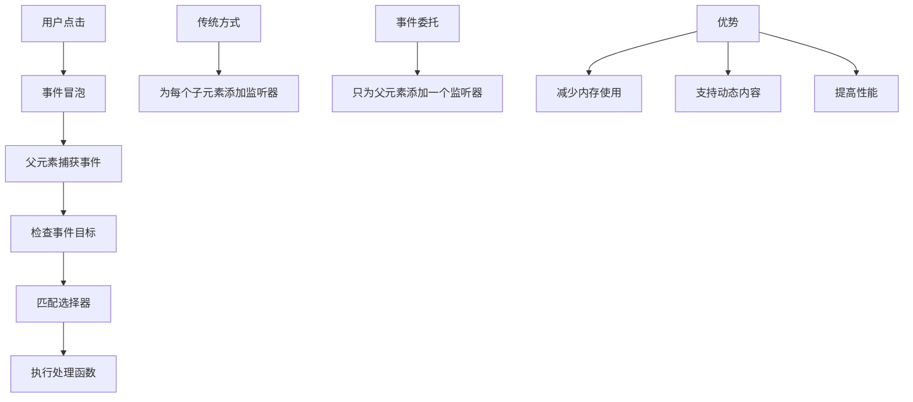

# 事件委托模式

## 事件委托基础

### 事件委托原理


### 基本事件委托
```javascript
// 1. 简单事件委托
function basicEventDelegation() {
    var container = document.getElementById('container');
    
    // 传统方式：为每个按钮添加监听器
    function traditionalApproach() {
        var buttons = document.querySelectorAll('button');
        buttons.forEach(function(button) {
            button.addEventListener('click', function() {
                console.log('Button clicked:', button.textContent);
            });
        });
    }
    
    // 事件委托方式：只为一个容器添加监听器
    function delegationApproach() {
        container.addEventListener('click', function(event) {
            if (event.target.tagName === 'BUTTON') {
                console.log('Button clicked:', event.target.textContent);
            }
        });
    }
    
    delegationApproach();
}

// 2. 多元素事件委托
function multiElementDelegation() {
    var container = document.getElementById('container');
    
    container.addEventListener('click', function(event) {
        var target = event.target;
        
        // 处理按钮点击
        if (target.matches('button')) {
            handleButtonClick(target);
        }
        
        // 处理链接点击
        if (target.matches('a')) {
            handleLinkClick(target);
        }
        
        // 处理特定类名的元素
        if (target.classList.contains('item')) {
            handleItemClick(target);
        }
        
        // 处理特定属性的元素
        if (target.hasAttribute('data-action')) {
            handleActionClick(target);
        }
    });
    
    function handleButtonClick(button) {
        console.log('Button clicked:', button.textContent);
        button.style.backgroundColor = 'lightblue';
    }
    
    function handleLinkClick(link) {
        console.log('Link clicked:', link.href);
        // 可以在这里添加链接处理逻辑
    }
    
    function handleItemClick(item) {
        console.log('Item clicked:', item.dataset.id);
        item.classList.toggle('selected');
    }
    
    function handleActionClick(element) {
        var action = element.dataset.action;
        console.log('Action triggered:', action);
        
        switch (action) {
            case 'delete':
                deleteItem(element);
                break;
            case 'edit':
                editItem(element);
                break;
            case 'view':
                viewItem(element);
                break;
        }
    }
}
```

### 动态内容支持
```javascript
// 1. 动态添加元素
function dynamicContentSupport() {
    var container = document.getElementById('container');
    var addButton = document.getElementById('addButton');
    
    // 事件委托处理动态内容
    container.addEventListener('click', function(event) {
        var target = event.target;
        
        if (target.classList.contains('dynamic-item')) {
            handleDynamicItemClick(target);
        }
        
        if (target.classList.contains('delete-btn')) {
            deleteDynamicItem(target);
        }
    });
    
    // 添加动态元素
    addButton.addEventListener('click', function() {
        var newItem = createDynamicItem();
        container.appendChild(newItem);
    });
    
    function createDynamicItem() {
        var item = document.createElement('div');
        item.className = 'dynamic-item';
        item.innerHTML = `
            <span>Dynamic Item ${Date.now()}</span>
            <button class="delete-btn">Delete</button>
        `;
        return item;
    }
    
    function handleDynamicItemClick(item) {
        console.log('Dynamic item clicked:', item.textContent);
        item.style.backgroundColor = 'yellow';
    }
    
    function deleteDynamicItem(button) {
        var item = button.closest('.dynamic-item');
        if (item) {
            item.remove();
        }
    }
}

// 2. 列表项事件委托
function listItemDelegation() {
    var list = document.getElementById('list');
    
    // 处理列表项点击
    list.addEventListener('click', function(event) {
        var target = event.target;
        var listItem = target.closest('li');
        
        if (listItem) {
            handleListItemClick(listItem, target);
        }
    });
    
    function handleListItemClick(listItem, clickedElement) {
        if (clickedElement.classList.contains('delete-btn')) {
            // 删除列表项
            listItem.remove();
        } else if (clickedElement.classList.contains('edit-btn')) {
            // 编辑列表项
            editListItem(listItem);
        } else {
            // 选择列表项
            selectListItem(listItem);
        }
    }
    
    function selectListItem(item) {
        // 移除其他选中状态
        list.querySelectorAll('li.selected').forEach(function(li) {
            li.classList.remove('selected');
        });
        
        // 选中当前项
        item.classList.add('selected');
        console.log('Selected item:', item.textContent);
    }
    
    function editListItem(item) {
        var text = item.querySelector('.item-text');
        var currentText = text.textContent;
        
        // 创建输入框
        var input = document.createElement('input');
        input.type = 'text';
        input.value = currentText;
        
        // 替换文本
        text.replaceWith(input);
        input.focus();
        
        // 保存编辑
        function saveEdit() {
            var newText = input.value;
            text.textContent = newText;
            input.replaceWith(text);
        }
        
        // 取消编辑
        function cancelEdit() {
            input.replaceWith(text);
        }
        
        input.addEventListener('blur', saveEdit);
        input.addEventListener('keydown', function(event) {
            if (event.key === 'Enter') {
                saveEdit();
            } else if (event.key === 'Escape') {
                cancelEdit();
            }
        });
    }
}
```

## 高级事件委托

### 事件委托管理器
```javascript
// 1. 基本事件委托管理器
function createEventDelegationManager() {
    var container = document.getElementById('container');
    
    var eventDelegation = {
        handlers: new Map(),
        
        on: function(selector, event, handler) {
            var key = selector + ':' + event;
            
            if (!this.handlers.has(key)) {
                var delegatedHandler = function(e) {
                    if (e.target.matches(selector)) {
                        handler.call(e.target, e);
                    }
                };
                
                container.addEventListener(event, delegatedHandler);
                this.handlers.set(key, delegatedHandler);
            }
        },
        
        off: function(selector, event) {
            var key = selector + ':' + event;
            var handler = this.handlers.get(key);
            
            if (handler) {
                container.removeEventListener(event, handler);
                this.handlers.delete(key);
            }
        },
        
        destroy: function() {
            this.handlers.forEach(function(handler, key) {
                var parts = key.split(':');
                var event = parts[1];
                container.removeEventListener(event, handler);
            });
            this.handlers.clear();
        }
    };
    
    return eventDelegation;
}

// 2. 高级事件委托管理器
function createAdvancedEventDelegationManager() {
    var container = document.getElementById('container');
    
    var advancedDelegation = {
        handlers: new Map(),
        options: new Map(),
        
        on: function(selector, event, handler, options = {}) {
            var key = selector + ':' + event;
            
            if (!this.handlers.has(key)) {
                var delegatedHandler = function(e) {
                    var target = e.target;
                    
                    // 检查目标是否匹配选择器
                    if (target.matches(selector)) {
                        // 执行处理函数
                        handler.call(target, e);
                    } else {
                        // 检查父元素是否匹配
                        var closest = target.closest(selector);
                        if (closest) {
                            handler.call(closest, e);
                        }
                    }
                };
                
                container.addEventListener(event, delegatedHandler, options);
                this.handlers.set(key, delegatedHandler);
                this.options.set(key, options);
            }
        },
        
        off: function(selector, event) {
            var key = selector + ':' + event;
            var handler = this.handlers.get(key);
            var options = this.options.get(key);
            
            if (handler) {
                container.removeEventListener(event, handler, options);
                this.handlers.delete(key);
                this.options.delete(key);
            }
        },
        
        once: function(selector, event, handler) {
            var onceHandler = function(e) {
                handler.call(this, e);
                this.off(selector, event);
            };
            
            this.on(selector, event, onceHandler);
        },
        
        getHandlers: function() {
            return Array.from(this.handlers.keys());
        },
        
        destroy: function() {
            this.handlers.forEach(function(handler, key) {
                var parts = key.split(':');
                var event = parts[1];
                var options = this.options.get(key);
                container.removeEventListener(event, handler, options);
            }.bind(this));
            
            this.handlers.clear();
            this.options.clear();
        }
    };
    
    return advancedDelegation;
}

// 3. 使用事件委托管理器
function useEventDelegationManager() {
    var delegation = createAdvancedEventDelegationManager();
    
    // 添加事件监听器
    delegation.on('button', 'click', function(event) {
        console.log('Button clicked:', this.textContent);
    });
    
    delegation.on('.item', 'click', function(event) {
        console.log('Item clicked:', this.dataset.id);
    });
    
    delegation.on('a', 'click', function(event) {
        console.log('Link clicked:', this.href);
    });
    
    // 一次性事件
    delegation.once('.welcome-message', 'click', function(event) {
        console.log('Welcome message clicked');
    });
    
    // 获取所有处理器
    console.log('Active handlers:', delegation.getHandlers());
    
    // 移除特定处理器
    delegation.off('button', 'click');
    
    // 销毁所有处理器
    // delegation.destroy();
}
```

### 性能优化
```javascript
// 1. 选择器优化
function selectorOptimization() {
    var container = document.getElementById('container');
    
    // 优化选择器性能
    container.addEventListener('click', function(event) {
        var target = event.target;
        
        // 使用tagName检查（最快）
        if (target.tagName === 'BUTTON') {
            handleButton(target);
        }
        
        // 使用classList检查（较快）
        if (target.classList.contains('item')) {
            handleItem(target);
        }
        
        // 使用matches检查（较慢，但灵活）
        if (target.matches('.complex-selector')) {
            handleComplex(target);
        }
    });
    
    function handleButton(button) {
        console.log('Button handled');
    }
    
    function handleItem(item) {
        console.log('Item handled');
    }
    
    function handleComplex(element) {
        console.log('Complex element handled');
    }
}

// 2. 事件委托缓存
function eventDelegationCache() {
    var container = document.getElementById('container');
    var cache = new Map();
    
    container.addEventListener('click', function(event) {
        var target = event.target;
        var selector = getSelector(target);
        
        // 检查缓存
        if (cache.has(selector)) {
            var handler = cache.get(selector);
            handler.call(target, event);
        } else {
            // 查找匹配的处理器
            var handler = findHandler(target);
            if (handler) {
                cache.set(selector, handler);
                handler.call(target, event);
            }
        }
    });
    
    function getSelector(element) {
        if (element.tagName === 'BUTTON') return 'button';
        if (element.classList.contains('item')) return '.item';
        if (element.hasAttribute('data-action')) return '[data-action]';
        return element.tagName.toLowerCase();
    }
    
    function findHandler(element) {
        // 查找匹配的处理器逻辑
        if (element.tagName === 'BUTTON') {
            return function(event) {
                console.log('Cached button handler');
            };
        }
        return null;
    }
}

// 3. 批量事件处理
function batchEventHandling() {
    var container = document.getElementById('container');
    var eventQueue = [];
    var processing = false;
    
    container.addEventListener('click', function(event) {
        eventQueue.push(event);
        
        if (!processing) {
            processEventQueue();
        }
    });
    
    function processEventQueue() {
        processing = true;
        
        while (eventQueue.length > 0) {
            var event = eventQueue.shift();
            handleEvent(event);
        }
        
        processing = false;
    }
    
    function handleEvent(event) {
        var target = event.target;
        
        if (target.tagName === 'BUTTON') {
            console.log('Batch processed button click');
        }
    }
}
```

## 实际应用场景

### 表格操作
```javascript
// 1. 表格事件委托
function tableEventDelegation() {
    var table = document.getElementById('dataTable');
    
    table.addEventListener('click', function(event) {
        var target = event.target;
        var row = target.closest('tr');
        
        if (!row) return;
        
        // 处理排序
        if (target.classList.contains('sort-header')) {
            handleSort(target, row);
        }
        
        // 处理行选择
        if (target.classList.contains('row-selector')) {
            handleRowSelection(row, target);
        }
        
        // 处理行操作
        if (target.classList.contains('row-action')) {
            handleRowAction(row, target);
        }
        
        // 处理单元格编辑
        if (target.classList.contains('editable-cell')) {
            handleCellEdit(target);
        }
    });
    
    function handleSort(header, row) {
        var column = header.dataset.column;
        var direction = header.dataset.direction === 'asc' ? 'desc' : 'asc';
        
        // 更新排序方向
        header.dataset.direction = direction;
        
        // 执行排序
        sortTable(column, direction);
    }
    
    function handleRowSelection(row, selector) {
        var isSelected = selector.checked;
        
        if (isSelected) {
            row.classList.add('selected');
        } else {
            row.classList.remove('selected');
        }
        
        updateSelectionCount();
    }
    
    function handleRowAction(row, action) {
        var actionType = action.dataset.action;
        var rowId = row.dataset.id;
        
        switch (actionType) {
            case 'edit':
                editRow(row);
                break;
            case 'delete':
                deleteRow(row);
                break;
            case 'view':
                viewRow(row);
                break;
        }
    }
    
    function handleCellEdit(cell) {
        var currentValue = cell.textContent;
        var input = document.createElement('input');
        input.type = 'text';
        input.value = currentValue;
        
        cell.innerHTML = '';
        cell.appendChild(input);
        input.focus();
        
        function saveEdit() {
            var newValue = input.value;
            cell.textContent = newValue;
        }
        
        function cancelEdit() {
            cell.textContent = currentValue;
        }
        
        input.addEventListener('blur', saveEdit);
        input.addEventListener('keydown', function(event) {
            if (event.key === 'Enter') {
                saveEdit();
            } else if (event.key === 'Escape') {
                cancelEdit();
            }
        });
    }
}
```

### 表单处理
```javascript
// 1. 表单事件委托
function formEventDelegation() {
    var form = document.getElementById('dynamicForm');
    
    form.addEventListener('change', function(event) {
        var target = event.target;
        
        // 处理输入字段变化
        if (target.matches('input, select, textarea')) {
            handleFieldChange(target);
        }
    });
    
    form.addEventListener('click', function(event) {
        var target = event.target;
        
        // 处理按钮点击
        if (target.matches('button[type="submit"]')) {
            handleFormSubmit(event);
        }
        
        if (target.matches('button[type="button"]')) {
            handleFormButton(target);
        }
        
        // 处理字段操作
        if (target.classList.contains('add-field')) {
            addFormField(target);
        }
        
        if (target.classList.contains('remove-field')) {
            removeFormField(target);
        }
    });
    
    function handleFieldChange(field) {
        var fieldName = field.name;
        var fieldValue = field.value;
        
        // 验证字段
        validateField(field);
        
        // 更新相关字段
        updateRelatedFields(fieldName, fieldValue);
        
        // 实时保存
        autoSave(fieldName, fieldValue);
    }
    
    function handleFormSubmit(event) {
        event.preventDefault();
        
        var formData = new FormData(form);
        var data = Object.fromEntries(formData);
        
        // 验证表单
        if (validateForm(data)) {
            submitForm(data);
        }
    }
    
    function handleFormButton(button) {
        var action = button.dataset.action;
        
        switch (action) {
            case 'reset':
                resetForm();
                break;
            case 'save':
                saveForm();
                break;
            case 'preview':
                previewForm();
                break;
        }
    }
    
    function addFormField(button) {
        var fieldType = button.dataset.fieldType;
        var container = button.closest('.field-group');
        
        var newField = createFormField(fieldType);
        container.appendChild(newField);
    }
    
    function removeFormField(button) {
        var field = button.closest('.form-field');
        field.remove();
    }
}
```

### 导航菜单
```javascript
// 1. 导航菜单事件委托
function navigationEventDelegation() {
    var navigation = document.getElementById('navigation');
    
    navigation.addEventListener('click', function(event) {
        var target = event.target;
        var menuItem = target.closest('.menu-item');
        
        if (!menuItem) return;
        
        // 处理菜单项点击
        if (target.matches('.menu-link')) {
            handleMenuClick(menuItem, target);
        }
        
        // 处理子菜单切换
        if (target.matches('.submenu-toggle')) {
            toggleSubmenu(menuItem);
        }
        
        // 处理菜单操作
        if (target.matches('.menu-action')) {
            handleMenuAction(menuItem, target);
        }
    });
    
    // 处理鼠标悬停
    navigation.addEventListener('mouseover', function(event) {
        var target = event.target;
        var menuItem = target.closest('.menu-item');
        
        if (menuItem && menuItem.classList.contains('has-submenu')) {
            showSubmenu(menuItem);
        }
    });
    
    navigation.addEventListener('mouseout', function(event) {
        var target = event.target;
        var menuItem = target.closest('.menu-item');
        
        if (menuItem && menuItem.classList.contains('has-submenu')) {
            hideSubmenu(menuItem);
        }
    });
    
    function handleMenuClick(menuItem, link) {
        var href = link.href;
        var isActive = menuItem.classList.contains('active');
        
        if (!isActive) {
            // 移除其他活动状态
            navigation.querySelectorAll('.menu-item.active').forEach(function(item) {
                item.classList.remove('active');
            });
            
            // 设置当前活动状态
            menuItem.classList.add('active');
            
            // 导航到新页面
            if (href && href !== '#') {
                window.location.href = href;
            }
        }
    }
    
    function toggleSubmenu(menuItem) {
        var submenu = menuItem.querySelector('.submenu');
        
        if (submenu) {
            submenu.classList.toggle('show');
        }
    }
    
    function showSubmenu(menuItem) {
        var submenu = menuItem.querySelector('.submenu');
        
        if (submenu) {
            submenu.classList.add('show');
        }
    }
    
    function hideSubmenu(menuItem) {
        var submenu = menuItem.querySelector('.submenu');
        
        if (submenu) {
            submenu.classList.remove('show');
        }
    }
    
    function handleMenuAction(menuItem, action) {
        var actionType = action.dataset.action;
        
        switch (actionType) {
            case 'bookmark':
                bookmarkMenuItem(menuItem);
                break;
            case 'share':
                shareMenuItem(menuItem);
                break;
            case 'settings':
                showMenuItemSettings(menuItem);
                break;
        }
    }
}
```

## 相关链接
- [[03-应用实践层/01-DOM操作/01-DOM树结构]] - DOM树基础
- [[03-应用实践层/01-DOM操作/02-元素选择与操作]] - 元素选择方法
- [[03-应用实践层/01-DOM操作/03-事件处理机制]] - 事件处理详解
- [[03-应用实践层/01-DOM操作/05-性能优化技巧]] - DOM性能优化
- [[03-应用实践层/01-DOM操作/06-现代DOM API]] - 现代DOM API
- [[03-应用实践层/01-DOM操作/07-代码示例库-DOM操作]] - 代码示例
