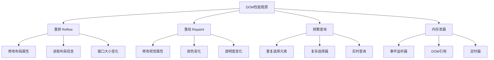

# DOM性能优化技巧

## DOM操作性能基础

### 性能瓶颈分析


### 性能测量工具
```javascript
// 1. 性能测量函数
function measurePerformance(name, fn) {
    console.time(name);
    fn();
    console.timeEnd(name);
}

// 2. 重排重绘检测
function detectReflowRepaint() {
    var element = document.getElementById('testElement');
    
    // 检测重排
    function detectReflow() {
        var start = performance.now();
        
        // 触发重排的操作
        element.style.width = '200px';
        element.style.height = '200px';
        element.style.margin = '10px';
        
        var end = performance.now();
        console.log('Reflow time:', end - start, 'ms');
    }
    
    // 检测重绘
    function detectRepaint() {
        var start = performance.now();
        
        // 触发重绘的操作
        element.style.color = 'red';
        element.style.backgroundColor = 'blue';
        element.style.opacity = '0.5';
        
        var end = performance.now();
        console.log('Repaint time:', end - start, 'ms');
    }
    
    detectReflow();
    detectRepaint();
}

// 3. 内存使用监控
function monitorMemoryUsage() {
    if (performance.memory) {
        var memory = performance.memory;
        console.log('Memory usage:');
        console.log('Used:', (memory.usedJSHeapSize / 1024 / 1024).toFixed(2), 'MB');
        console.log('Total:', (memory.totalJSHeapSize / 1024 / 1024).toFixed(2), 'MB');
        console.log('Limit:', (memory.jsHeapSizeLimit / 1024 / 1024).toFixed(2), 'MB');
    }
}
```

## 减少重排和重绘

### 批量DOM操作
```javascript
// 1. 使用DocumentFragment
function useDocumentFragment() {
    var container = document.getElementById('container');
    var fragment = document.createDocumentFragment();
    
    // 在内存中构建DOM
    for (var i = 0; i < 1000; i++) {
        var div = document.createElement('div');
        div.textContent = 'Item ' + i;
        div.className = 'item';
        fragment.appendChild(div);
    }
    
    // 一次性插入到DOM
    container.appendChild(fragment);
}

// 2. 使用innerHTML批量操作
function useInnerHTML() {
    var container = document.getElementById('container');
    var html = '';
    
    // 构建HTML字符串
    for (var i = 0; i < 1000; i++) {
        html += '<div class="item">Item ' + i + '</div>';
    }
    
    // 一次性设置
    container.innerHTML = html;
}

// 3. 隐藏元素进行操作
function hideDuringOperation() {
    var container = document.getElementById('container');
    
    // 隐藏元素
    container.style.display = 'none';
    
    // 执行大量DOM操作
    for (var i = 0; i < 1000; i++) {
        var div = document.createElement('div');
        div.textContent = 'Item ' + i;
        container.appendChild(div);
    }
    
    // 显示元素
    container.style.display = 'block';
}

// 4. 使用CSS类批量修改
function useCSSClasses() {
    var elements = document.querySelectorAll('.item');
    
    // 错误：逐个修改样式
    function badApproach() {
        elements.forEach(function(element) {
            element.style.color = 'red';
            element.style.backgroundColor = 'yellow';
            element.style.fontSize = '16px';
        });
    }
    
    // 正确：使用CSS类
    function goodApproach() {
        // 定义CSS类
        var style = document.createElement('style');
        style.textContent = `
            .highlighted {
                color: red;
                background-color: yellow;
                font-size: 16px;
            }
        `;
        document.head.appendChild(style);
        
        // 批量应用类
        elements.forEach(function(element) {
            element.classList.add('highlighted');
        });
    }
    
    goodApproach();
}
```

### 避免强制同步布局
```javascript
// 1. 避免强制同步布局
function avoidForcedLayout() {
    var elements = document.querySelectorAll('.item');
    
    // 错误：强制同步布局
    function badApproach() {
        elements.forEach(function(element) {
            element.style.width = '200px';
            var width = element.offsetWidth; // 强制布局
            element.style.height = width + 'px';
        });
    }
    
    // 正确：批量读取和写入
    function goodApproach() {
        // 先读取所有需要的值
        var measurements = [];
        elements.forEach(function(element) {
            measurements.push({
                element: element,
                width: element.offsetWidth
            });
        });
        
        // 再批量写入
        measurements.forEach(function(measurement) {
            measurement.element.style.width = '200px';
            measurement.element.style.height = measurement.width + 'px';
        });
    }
    
    goodApproach();
}

// 2. 使用requestAnimationFrame
function useRequestAnimationFrame() {
    var elements = document.querySelectorAll('.animated-item');
    
    function animateElements() {
        elements.forEach(function(element, index) {
            requestAnimationFrame(function() {
                element.style.transform = 'translateX(' + (index * 10) + 'px)';
            });
        });
    }
    
    animateElements();
}

// 3. 使用CSS Transform
function useCSSTransform() {
    var element = document.getElementById('animatedElement');
    
    // 错误：使用left/top属性
    function badApproach() {
        element.style.left = '100px';
        element.style.top = '100px';
    }
    
    // 正确：使用transform
    function goodApproach() {
        element.style.transform = 'translate(100px, 100px)';
    }
    
    goodApproach();
}
```

## 优化元素选择

### 缓存DOM引用
```javascript
// 1. 缓存常用元素
function cacheDOMReferences() {
    // 缓存DOM引用
    var elements = {
        container: document.getElementById('container'),
        button: document.getElementById('button'),
        input: document.getElementById('input'),
        output: document.getElementById('output')
    };
    
    // 使用缓存的引用
    function updateContent() {
        elements.output.textContent = elements.input.value;
    }
    
    elements.button.addEventListener('click', updateContent);
    elements.input.addEventListener('input', updateContent);
    
    return elements;
}

// 2. 避免重复查询
function avoidRepeatedQueries() {
    var container = document.getElementById('container');
    
    // 错误：重复查询
    function badExample() {
        for (var i = 0; i < 100; i++) {
            var element = document.getElementById('item-' + i); // 每次都查询
            element.style.color = 'red';
        }
    }
    
    // 正确：缓存查询结果
    function goodExample() {
        var elements = [];
        for (var i = 0; i < 100; i++) {
            elements.push(document.getElementById('item-' + i));
        }
        
        elements.forEach(function(element) {
            element.style.color = 'red';
        });
    }
    
    goodExample();
}

// 3. 使用更高效的选择器
function useEfficientSelectors() {
    // 性能从高到低的选择器
    var selectors = [
        '#id',                    // ID选择器（最快）
        '.class',                 // 类选择器
        'tag',                    // 标签选择器
        '[attribute]',            // 属性选择器
        'tag.class',              // 组合选择器
        'tag .class',             // 后代选择器
        'tag > .class',           // 子选择器
        'tag + .class',           // 相邻兄弟选择器
        'tag ~ .class',           // 通用兄弟选择器
        'tag:first-child',        // 伪类选择器
        'tag:nth-child(2n)',      // 复杂伪类选择器
        'tag[attribute="value"]'  // 复杂属性选择器
    ];
    
    // 测试选择器性能
    selectors.forEach(function(selector) {
        var start = performance.now();
        document.querySelectorAll(selector);
        var end = performance.now();
        console.log(selector + ':', (end - start).toFixed(4) + 'ms');
    });
}
```

### 选择器优化策略
```javascript
// 1. 选择器优化
function optimizeSelectors() {
    // 错误：复杂选择器
    function badSelectors() {
        var elements = document.querySelectorAll('div.container > ul.list li.item:first-child a.link');
    }
    
    // 正确：简化选择器
    function goodSelectors() {
        var container = document.querySelector('.container');
        var elements = container.querySelectorAll('a.link');
    }
    
    // 使用ID选择器
    function useIdSelector() {
        var element = document.getElementById('uniqueId'); // 最快
    }
    
    // 使用类选择器
    function useClassSelector() {
        var elements = document.getElementsByClassName('commonClass'); // 较快
    }
    
    // 使用标签选择器
    function useTagSelector() {
        var elements = document.getElementsByTagName('div'); // 中等
    }
}

// 2. 选择器缓存
function selectorCaching() {
    var cache = new Map();
    
    function cachedQuery(selector) {
        if (cache.has(selector)) {
            return cache.get(selector);
        }
        
        var elements = document.querySelectorAll(selector);
        cache.set(selector, elements);
        return elements;
    }
    
    // 使用缓存的选择器
    var buttons = cachedQuery('button');
    var inputs = cachedQuery('input');
    var links = cachedQuery('a');
    
    // 清理缓存
    function clearCache() {
        cache.clear();
    }
}
```

## 内存管理优化

### 事件监听器管理
```javascript
// 1. 事件监听器清理
function eventListenerCleanup() {
    var element = document.getElementById('myElement');
    var listeners = [];
    
    function addManagedListener(event, handler) {
        element.addEventListener(event, handler);
        listeners.push({ event, handler });
    }
    
    function removeAllListeners() {
        listeners.forEach(function(listener) {
            element.removeEventListener(listener.event, listener.handler);
        });
        listeners = [];
    }
    
    // 添加监听器
    addManagedListener('click', function() {
        console.log('Click handled');
    });
    
    addManagedListener('mouseover', function() {
        console.log('Mouse over');
    });
    
    // 清理监听器
    setTimeout(removeAllListeners, 5000);
}

// 2. 使用AbortController
function useAbortController() {
    var element = document.getElementById('myElement');
    var controller = new AbortController();
    
    element.addEventListener('click', function() {
        console.log('Click handled');
    }, { signal: controller.signal });
    
    element.addEventListener('mouseover', function() {
        console.log('Mouse over');
    }, { signal: controller.signal });
    
    // 取消所有监听器
    setTimeout(function() {
        controller.abort();
    }, 5000);
}

// 3. 事件委托减少监听器
function useEventDelegation() {
    var container = document.getElementById('container');
    
    // 使用事件委托
    container.addEventListener('click', function(event) {
        var target = event.target;
        
        if (target.matches('button')) {
            handleButtonClick(target);
        }
        
        if (target.matches('.item')) {
            handleItemClick(target);
        }
    });
    
    function handleButtonClick(button) {
        console.log('Button clicked');
    }
    
    function handleItemClick(item) {
        console.log('Item clicked');
    }
}
```

### DOM引用管理
```javascript
// 1. 避免循环引用
function avoidCircularReferences() {
    var element = document.getElementById('myElement');
    var data = { name: 'test' };
    
    // 创建循环引用
    element.data = data;
    data.element = element;
    
    // 清理循环引用
    function cleanup() {
        element.data = null;
        data.element = null;
    }
    
    // 使用WeakMap避免循环引用
    var weakMap = new WeakMap();
    weakMap.set(element, data);
    
    // 元素被垃圾回收时，WeakMap中的条目也会被自动清理
}

// 2. 及时释放DOM引用
function releaseDOMReferences() {
    var elements = document.querySelectorAll('.temporary');
    var references = Array.from(elements);
    
    // 使用完毕后释放引用
    function cleanup() {
        references.forEach(function(element) {
            element.remove();
        });
        references = null;
    }
    
    // 5秒后清理
    setTimeout(cleanup, 5000);
}

// 3. 使用对象池
function useObjectPool() {
    var pool = [];
    var maxSize = 100;
    
    function createElement() {
        var element = document.createElement('div');
        element.className = 'pooled-element';
        return element;
    }
    
    function getElement() {
        if (pool.length > 0) {
            return pool.pop();
        }
        return createElement();
    }
    
    function returnElement(element) {
        if (pool.length < maxSize) {
            // 清理元素
            element.innerHTML = '';
            element.className = 'pooled-element';
            pool.push(element);
        }
    }
    
    // 使用对象池
    var element1 = getElement();
    var element2 = getElement();
    
    // 使用完毕后归还
    returnElement(element1);
    returnElement(element2);
}
```

## 渲染优化

### 虚拟滚动
```javascript
// 1. 基本虚拟滚动
function basicVirtualScroll() {
    var container = document.getElementById('container');
    var itemHeight = 50;
    var visibleItems = 10;
    var totalItems = 1000;
    
    var scrollTop = 0;
    var startIndex = 0;
    var endIndex = visibleItems;
    
    function renderVisibleItems() {
        // 清空容器
        container.innerHTML = '';
        
        // 创建可见项目
        for (var i = startIndex; i < endIndex; i++) {
            var item = document.createElement('div');
            item.className = 'virtual-item';
            item.style.height = itemHeight + 'px';
            item.textContent = 'Item ' + i;
            container.appendChild(item);
        }
    }
    
    function handleScroll() {
        scrollTop = container.scrollTop;
        startIndex = Math.floor(scrollTop / itemHeight);
        endIndex = Math.min(startIndex + visibleItems, totalItems);
        
        renderVisibleItems();
    }
    
    container.addEventListener('scroll', handleScroll);
    renderVisibleItems();
}

// 2. 高级虚拟滚动
function advancedVirtualScroll() {
    var container = document.getElementById('container');
    var itemHeight = 50;
    var visibleItems = 10;
    var totalItems = 1000;
    var buffer = 5; // 缓冲区
    
    var scrollTop = 0;
    var startIndex = 0;
    var endIndex = visibleItems;
    var items = [];
    
    function createItem(index) {
        var item = document.createElement('div');
        item.className = 'virtual-item';
        item.style.height = itemHeight + 'px';
        item.style.position = 'absolute';
        item.style.top = (index * itemHeight) + 'px';
        item.textContent = 'Item ' + index;
        return item;
    }
    
    function updateVisibleItems() {
        var newStartIndex = Math.max(0, startIndex - buffer);
        var newEndIndex = Math.min(totalItems, endIndex + buffer);
        
        // 移除不可见的项目
        items.forEach(function(item, index) {
            if (index < newStartIndex || index >= newEndIndex) {
                item.remove();
            }
        });
        
        // 添加新的可见项目
        for (var i = newStartIndex; i < newEndIndex; i++) {
            if (!items[i]) {
                items[i] = createItem(i);
                container.appendChild(items[i]);
            }
        }
        
        startIndex = newStartIndex;
        endIndex = newEndIndex;
    }
    
    function handleScroll() {
        scrollTop = container.scrollTop;
        var newStartIndex = Math.floor(scrollTop / itemHeight);
        var newEndIndex = Math.min(newStartIndex + visibleItems, totalItems);
        
        if (newStartIndex !== startIndex || newEndIndex !== endIndex) {
            startIndex = newStartIndex;
            endIndex = newEndIndex;
            updateVisibleItems();
        }
    }
    
    container.addEventListener('scroll', handleScroll);
    updateVisibleItems();
}
```

### 懒加载
```javascript
// 1. 图片懒加载
function imageLazyLoading() {
    var images = document.querySelectorAll('img[data-src]');
    var imageObserver = new IntersectionObserver(function(entries) {
        entries.forEach(function(entry) {
            if (entry.isIntersecting) {
                var img = entry.target;
                img.src = img.dataset.src;
                img.removeAttribute('data-src');
                imageObserver.unobserve(img);
            }
        });
    });
    
    images.forEach(function(img) {
        imageObserver.observe(img);
    });
}

// 2. 内容懒加载
function contentLazyLoading() {
    var sections = document.querySelectorAll('.lazy-section');
    var sectionObserver = new IntersectionObserver(function(entries) {
        entries.forEach(function(entry) {
            if (entry.isIntersecting) {
                var section = entry.target;
                loadSectionContent(section);
                sectionObserver.unobserve(section);
            }
        });
    });
    
    sections.forEach(function(section) {
        sectionObserver.observe(section);
    });
    
    function loadSectionContent(section) {
        var url = section.dataset.url;
        
        fetch(url)
            .then(function(response) {
                return response.text();
            })
            .then(function(html) {
                section.innerHTML = html;
            });
    }
}

// 3. 组件懒加载
function componentLazyLoading() {
    var components = document.querySelectorAll('[data-component]');
    var componentObserver = new IntersectionObserver(function(entries) {
        entries.forEach(function(entry) {
            if (entry.isIntersecting) {
                var element = entry.target;
                var componentName = element.dataset.component;
                loadComponent(element, componentName);
                componentObserver.unobserve(element);
            }
        });
    });
    
    components.forEach(function(component) {
        componentObserver.observe(component);
    });
    
    function loadComponent(element, componentName) {
        // 动态加载组件
        import('./components/' + componentName + '.js')
            .then(function(module) {
                module.default(element);
            });
    }
}
```

## 相关链接
- [[03-应用实践层/01-DOM操作/01-DOM树结构]] - DOM树基础
- [[03-应用实践层/01-DOM操作/02-元素选择与操作]] - 元素选择方法
- [[03-应用实践层/01-DOM操作/03-事件处理机制]] - 事件处理详解
- [[03-应用实践层/01-DOM操作/04-事件委托模式]] - 事件委托优化
- [[03-应用实践层/01-DOM操作/06-现代DOM API]] - 现代DOM API
- [[03-应用实践层/01-DOM操作/07-代码示例库-DOM操作]] - 代码示例
