# 现代DOM API

## 现代DOM API概览

### API分类

```mermaid
graph TD
    A[现代DOM API] --> B[选择器API]
    A --> C[节点操作API]
    A --> D[事件API]
    A --> E[样式API]
    A --> F[动画API]
    A --> G[观察者API]
    
    B --> B1[querySelector]
    B --> B2[querySelectorAll]
    B --> B3[matches]
    B --> B4[closest]
    
    C --> C1[insertAdjacentHTML]
    C --> C2[insertAdjacentElement]
    C --> C3[replaceWith]
    C --> C4[remove]
    
    D --> D1[CustomEvent]
    D --> D2[EventTarget]
    D --> D3[AbortController]
    
    E --> E1[CSS.supports]
    E --> E2[getComputedStyle]
    E --> E3[ResizeObserver]
    
    F --> F1[Web Animations API]
    F --> F2[requestAnimationFrame]
    
    G --> G1[MutationObserver]
    G --> G2[IntersectionObserver]
    G --> G3[ResizeObserver]
```


### 浏览器支持情况
| API | Chrome | Firefox | Safari | Edge | 移动端支持 |
|-----|--------|---------|--------|------|-----------|
| querySelector | 1+ | 3.5+ | 3.2+ | 9+ | iOS 3.2+ |
| CustomEvent | 15+ | 11+ | 6+ | 12+ | iOS 6+ |
| AbortController | 66+ | 57+ | 11.1+ | 16+ | iOS 11.3+ |
| IntersectionObserver | 51+ | 55+ | 12.1+ | 15+ | iOS 12.2+ |
| ResizeObserver | 64+ | 69+ | 13.1+ | 79+ | iOS 13.4+ |
| Web Animations API | 36+ | 48+ | 13.1+ | 79+ | iOS 13.4+ |

## 选择器API

### 现代选择器方法
```javascript
// 1. querySelector和querySelectorAll
function modernSelectors() {
    // 选择单个元素
    var element = document.querySelector('#myId');
    var firstDiv = document.querySelector('div');
    var firstButton = document.querySelector('button.primary');
    
    // 选择多个元素
    var elements = document.querySelectorAll('.item');
    var buttons = document.querySelectorAll('button[type="submit"]');
    var links = document.querySelectorAll('a[href^="https"]');
    
    console.log('Selected elements:', {
        single: element,
        firstDiv: firstDiv,
        firstButton: firstButton,
        elements: elements.length,
        buttons: buttons.length,
        links: links.length
    });
}

// 2. matches方法
function matchesMethod() {
    var element = document.getElementById('myElement');
    
    // 检查元素是否匹配选择器
    var isButton = element.matches('button');
    var isPrimary = element.matches('.primary');
    var isVisible = element.matches(':visible');
    
    console.log('Matches results:', {
        isButton: isButton,
        isPrimary: isPrimary,
        isVisible: isVisible
    });
    
    // 在事件委托中使用
    document.addEventListener('click', function(event) {
        if (event.target.matches('button.primary')) {
            console.log('Primary button clicked');
        }
    });
}

// 3. closest方法
function closestMethod() {
    var element = document.getElementById('child');
    
    // 查找最近的匹配元素
    var parent = element.closest('.parent');
    var container = element.closest('#container');
    var form = element.closest('form');
    
    console.log('Closest elements:', {
        parent: parent,
        container: container,
        form: form
    });
    
    // 在事件处理中使用
    document.addEventListener('click', function(event) {
        var button = event.target.closest('button');
        if (button) {
            console.log('Button clicked:', button.textContent);
        }
    });
}
```

### 选择器性能优化
```javascript
// 1. 选择器缓存
function selectorCaching() {
    var cache = new Map();
    
    function cachedQuery(selector) {
        if (cache.has(selector)) {
            return cache.get(selector);
        }
        
        var elements = document.querySelectorAll(selector);
        cache.set(selector, elements);
        return elements;
    }
    
    // 使用缓存的选择器
    var buttons = cachedQuery('button');
    var inputs = cachedQuery('input');
    var links = cachedQuery('a');
    
    // 清理缓存
    function clearCache() {
        cache.clear();
    }
}

// 2. 选择器优化
function selectorOptimization() {
    // 错误：复杂选择器
    function badSelector() {
        var elements = document.querySelectorAll('div.container > ul.list li.item:first-child a.link');
    }
    
    // 正确：简化选择器
    function goodSelector() {
        var container = document.querySelector('.container');
        var elements = container.querySelectorAll('a.link');
    }
    
    // 使用ID选择器（最快）
    function useIdSelector() {
        var element = document.getElementById('uniqueId');
    }
    
    // 使用类选择器
    function useClassSelector() {
        var elements = document.getElementsByClassName('commonClass');
    }
}
```

## 节点操作API

### 现代节点操作方法
```javascript
// 1. insertAdjacentHTML
function insertAdjacentHTML() {
    var element = document.getElementById('myElement');
    
    // 在元素之前插入
    element.insertAdjacentHTML('beforebegin', '<div>Before</div>');
    
    // 在元素内部开始插入
    element.insertAdjacentHTML('afterbegin', '<div>After begin</div>');
    
    // 在元素内部结束插入
    element.insertAdjacentHTML('beforeend', '<div>Before end</div>');
    
    // 在元素之后插入
    element.insertAdjacentHTML('afterend', '<div>After</div>');
}

// 2. insertAdjacentElement
function insertAdjacentElement() {
    var element = document.getElementById('myElement');
    var newElement = document.createElement('div');
    newElement.textContent = 'New Element';
    
    // 在元素之前插入
    element.insertAdjacentElement('beforebegin', newElement);
    
    // 在元素内部开始插入
    element.insertAdjacentElement('afterbegin', newElement);
    
    // 在元素内部结束插入
    element.insertAdjacentElement('beforeend', newElement);
    
    // 在元素之后插入
    element.insertAdjacentElement('afterend', newElement);
}

// 3. replaceWith和remove
function replaceWithAndRemove() {
    var element = document.getElementById('myElement');
    
    // 替换元素
    var newElement = document.createElement('div');
    newElement.textContent = 'Replaced Element';
    element.replaceWith(newElement);
    
    // 移除元素
    newElement.remove();
}

// 4. 现代节点操作
function modernNodeOperations() {
    var container = document.getElementById('container');
    
    // 批量插入
    var fragment = document.createDocumentFragment();
    for (var i = 0; i < 100; i++) {
        var div = document.createElement('div');
        div.textContent = 'Item ' + i;
        fragment.appendChild(div);
    }
    container.appendChild(fragment);
    
    // 批量替换
    var newContent = '<div>New Content</div>';
    container.innerHTML = newContent;
    
    // 批量删除
    var items = container.querySelectorAll('.item');
    items.forEach(function(item) {
        item.remove();
    });
}
```

## 事件API

### CustomEvent
```javascript
// 1. 基本CustomEvent
function basicCustomEvent() {
    var element = document.getElementById('myElement');
    
    // 创建自定义事件
    var customEvent = new CustomEvent('myCustomEvent', {
        detail: {
            message: 'Hello from custom event',
            timestamp: Date.now()
        },
        bubbles: true,
        cancelable: true
    });
    
    // 监听自定义事件
    element.addEventListener('myCustomEvent', function(event) {
        console.log('Custom event received:', event.detail);
    });
    
    // 触发自定义事件
    element.dispatchEvent(customEvent);
}

// 2. 高级CustomEvent
function advancedCustomEvent() {
    var element = document.getElementById('myElement');
    
    // 创建带详细信息的自定义事件
    var advancedEvent = new CustomEvent('advancedEvent', {
        detail: {
            type: 'userAction',
            data: { userId: 123, action: 'click' },
            metadata: { source: 'button', version: '1.0' }
        },
        bubbles: true,
        cancelable: true
    });
    
    // 监听高级自定义事件
    element.addEventListener('advancedEvent', function(event) {
        console.log('Advanced event:', event.detail);
        
        // 处理事件数据
        var detail = event.detail;
        if (detail.type === 'userAction') {
            handleUserAction(detail.data);
        }
    });
    
    function handleUserAction(data) {
        console.log('User action:', data);
    }
    
    // 触发高级自定义事件
    element.dispatchEvent(advancedEvent);
}

// 3. 事件总线模式
function eventBusPattern() {
    // 创建事件总线
    var eventBus = {
        listeners: {},
        
        on: function(event, callback) {
            if (!this.listeners[event]) {
                this.listeners[event] = [];
            }
            this.listeners[event].push(callback);
        },
        
        off: function(event, callback) {
            if (this.listeners[event]) {
                var index = this.listeners[event].indexOf(callback);
                if (index > -1) {
                    this.listeners[event].splice(index, 1);
                }
            }
        },
        
        emit: function(event, data) {
            if (this.listeners[event]) {
                this.listeners[event].forEach(function(callback) {
                    callback(data);
                });
            }
        }
    };
    
    // 使用事件总线
    eventBus.on('userLogin', function(user) {
        console.log('User logged in:', user);
    });
    
    eventBus.on('userLogout', function(user) {
        console.log('User logged out:', user);
    });
    
    // 触发事件
    eventBus.emit('userLogin', { id: 1, name: 'John' });
    eventBus.emit('userLogout', { id: 1, name: 'John' });
}
```

### AbortController
```javascript
// 1. 基本AbortController
function basicAbortController() {
    var element = document.getElementById('myElement');
    var controller = new AbortController();
    
    // 使用AbortController添加事件监听器
    element.addEventListener('click', function() {
        console.log('Click handled');
    }, { signal: controller.signal });
    
    element.addEventListener('mouseover', function() {
        console.log('Mouse over');
    }, { signal: controller.signal });
    
    // 取消所有监听器
    setTimeout(function() {
        controller.abort();
    }, 5000);
}

// 2. 高级AbortController
function advancedAbortController() {
    var element = document.getElementById('myElement');
    var controllers = new Map();
    
    function addManagedListener(event, handler, options = {}) {
        var controller = new AbortController();
        var signal = controller.signal;
        
        element.addEventListener(event, handler, { ...options, signal });
        controllers.set(event, controller);
        
        return controller;
    }
    
    function removeListener(event) {
        var controller = controllers.get(event);
        if (controller) {
            controller.abort();
            controllers.delete(event);
        }
    }
    
    function removeAllListeners() {
        controllers.forEach(function(controller) {
            controller.abort();
        });
        controllers.clear();
    }
    
    // 添加监听器
    addManagedListener('click', function() {
        console.log('Click handled');
    });
    
    addManagedListener('mouseover', function() {
        console.log('Mouse over');
    });
    
    // 移除特定监听器
    setTimeout(function() {
        removeListener('click');
    }, 3000);
    
    // 移除所有监听器
    setTimeout(function() {
        removeAllListeners();
    }, 5000);
}
```

## 观察者API

### MutationObserver
```javascript
// 1. 基本MutationObserver
function basicMutationObserver() {
    var element = document.getElementById('myElement');
    
    // 创建观察者
    var observer = new MutationObserver(function(mutations) {
        mutations.forEach(function(mutation) {
            console.log('Mutation type:', mutation.type);
            console.log('Target:', mutation.target);
            
            if (mutation.type === 'childList') {
                console.log('Added nodes:', mutation.addedNodes);
                console.log('Removed nodes:', mutation.removedNodes);
            }
            
            if (mutation.type === 'attributes') {
                console.log('Attribute:', mutation.attributeName);
                console.log('Old value:', mutation.oldValue);
            }
        });
    });
    
    // 开始观察
    observer.observe(element, {
        childList: true,
        attributes: true,
        attributeOldValue: true,
        subtree: true
    });
    
    // 停止观察
    setTimeout(function() {
        observer.disconnect();
    }, 10000);
}

// 2. 高级MutationObserver
function advancedMutationObserver() {
    var container = document.getElementById('container');
    
    // 创建观察者
    var observer = new MutationObserver(function(mutations) {
        mutations.forEach(function(mutation) {
            if (mutation.type === 'childList') {
                // 处理添加的节点
                mutation.addedNodes.forEach(function(node) {
                    if (node.nodeType === Node.ELEMENT_NODE) {
                        console.log('Element added:', node.tagName);
                        
                        // 为新元素添加事件监听器
                        if (node.matches('button')) {
                            node.addEventListener('click', function() {
                                console.log('New button clicked');
                            });
                        }
                    }
                });
                
                // 处理移除的节点
                mutation.removedNodes.forEach(function(node) {
                    if (node.nodeType === Node.ELEMENT_NODE) {
                        console.log('Element removed:', node.tagName);
                    }
                });
            }
        });
    });
    
    // 开始观察
    observer.observe(container, {
        childList: true,
        subtree: true
    });
    
    // 动态添加元素
    setTimeout(function() {
        var button = document.createElement('button');
        button.textContent = 'New Button';
        container.appendChild(button);
    }, 2000);
}
```

### IntersectionObserver
```javascript
// 1. 基本IntersectionObserver
function basicIntersectionObserver() {
    var elements = document.querySelectorAll('.observe-me');
    
    // 创建观察者
    var observer = new IntersectionObserver(function(entries) {
        entries.forEach(function(entry) {
            if (entry.isIntersecting) {
                console.log('Element is visible:', entry.target);
                entry.target.classList.add('visible');
            } else {
                console.log('Element is hidden:', entry.target);
                entry.target.classList.remove('visible');
            }
        });
    });
    
    // 开始观察
    elements.forEach(function(element) {
        observer.observe(element);
    });
}

// 2. 高级IntersectionObserver
function advancedIntersectionObserver() {
    var elements = document.querySelectorAll('.lazy-load');
    
    // 创建观察者
    var observer = new IntersectionObserver(function(entries) {
        entries.forEach(function(entry) {
            if (entry.isIntersecting) {
                var element = entry.target;
                var src = element.dataset.src;
                
                if (src) {
                    element.src = src;
                    element.removeAttribute('data-src');
                }
                
                observer.unobserve(element);
            }
        });
    }, {
        root: null,
        rootMargin: '50px',
        threshold: 0.1
    });
    
    // 开始观察
    elements.forEach(function(element) {
        observer.observe(element);
    });
}

// 3. 性能监控IntersectionObserver
function performanceIntersectionObserver() {
    var elements = document.querySelectorAll('.performance-track');
    
    // 创建观察者
    var observer = new IntersectionObserver(function(entries) {
        entries.forEach(function(entry) {
            if (entry.isIntersecting) {
                var element = entry.target;
                var startTime = performance.now();
                
                // 执行性能敏感操作
                performExpensiveOperation(element);
                
                var endTime = performance.now();
                console.log('Operation took:', endTime - startTime, 'ms');
                
                observer.unobserve(element);
            }
        });
    });
    
    function performExpensiveOperation(element) {
        // 模拟性能敏感操作
        var data = new Array(10000).fill(0).map(function(_, i) {
            return Math.random() * i;
        });
        
        element.textContent = 'Processed: ' + data.length + ' items';
    }
    
    // 开始观察
    elements.forEach(function(element) {
        observer.observe(element);
    });
}
```

### ResizeObserver
```javascript
// 1. 基本ResizeObserver
function basicResizeObserver() {
    var elements = document.querySelectorAll('.resize-me');
    
    // 创建观察者
    var observer = new ResizeObserver(function(entries) {
        entries.forEach(function(entry) {
            var element = entry.target;
            var width = entry.contentRect.width;
            var height = entry.contentRect.height;
            
            console.log('Element resized:', {
                element: element,
                width: width,
                height: height
            });
            
            // 根据大小调整样式
            if (width < 300) {
                element.classList.add('small');
            } else {
                element.classList.remove('small');
            }
        });
    });
    
    // 开始观察
    elements.forEach(function(element) {
        observer.observe(element);
    });
}

// 2. 高级ResizeObserver
function advancedResizeObserver() {
    var container = document.getElementById('container');
    
    // 创建观察者
    var observer = new ResizeObserver(function(entries) {
        entries.forEach(function(entry) {
            var element = entry.target;
            var width = entry.contentRect.width;
            var height = entry.contentRect.height;
            
            // 响应式布局调整
            if (width < 768) {
                element.classList.add('mobile');
                element.classList.remove('tablet', 'desktop');
            } else if (width < 1024) {
                element.classList.add('tablet');
                element.classList.remove('mobile', 'desktop');
            } else {
                element.classList.add('desktop');
                element.classList.remove('mobile', 'tablet');
            }
            
            // 更新子元素
            var children = element.querySelectorAll('.responsive-child');
            children.forEach(function(child) {
                child.style.width = (width / children.length) + 'px';
            });
        });
    });
    
    // 开始观察
    observer.observe(container);
}
```

## Web Animations API

### 基本动画
```javascript
// 1. 基本Web Animations API
function basicWebAnimations() {
    var element = document.getElementById('myElement');
    
    // 创建动画
    var animation = element.animate([
        { transform: 'translateX(0px)', opacity: 1 },
        { transform: 'translateX(100px)', opacity: 0.5 },
        { transform: 'translateX(200px)', opacity: 1 }
    ], {
        duration: 1000,
        easing: 'ease-in-out',
        iterations: Infinity,
        direction: 'alternate'
    });
    
    // 控制动画
    animation.play();
    
    // 暂停动画
    setTimeout(function() {
        animation.pause();
    }, 5000);
    
    // 取消动画
    setTimeout(function() {
        animation.cancel();
    }, 10000);
}

// 2. 高级Web Animations API
function advancedWebAnimations() {
    var element = document.getElementById('myElement');
    
    // 创建复杂动画
    var animation = element.animate([
        { 
            transform: 'translateX(0px) scale(1)',
            backgroundColor: 'red',
            borderRadius: '0px'
        },
        { 
            transform: 'translateX(100px) scale(1.2)',
            backgroundColor: 'blue',
            borderRadius: '50px'
        },
        { 
            transform: 'translateX(200px) scale(1)',
            backgroundColor: 'green',
            borderRadius: '0px'
        }
    ], {
        duration: 2000,
        easing: 'cubic-bezier(0.25, 0.46, 0.45, 0.94)',
        iterations: 3,
        fill: 'forwards'
    });
    
    // 动画事件监听
    animation.addEventListener('finish', function() {
        console.log('Animation finished');
    });
    
    animation.addEventListener('cancel', function() {
        console.log('Animation cancelled');
    });
    
    // 获取动画状态
    console.log('Animation state:', animation.playState);
    console.log('Animation current time:', animation.currentTime);
}

// 3. 动画序列
function animationSequence() {
    var elements = document.querySelectorAll('.animate-me');
    
    // 创建动画序列
    var animations = [];
    
    elements.forEach(function(element, index) {
        var animation = element.animate([
            { transform: 'translateY(0px)', opacity: 0 },
            { transform: 'translateY(-20px)', opacity: 1 }
        ], {
            duration: 500,
            delay: index * 100,
            fill: 'forwards'
        });
        
        animations.push(animation);
    });
    
    // 等待所有动画完成
    Promise.all(animations.map(function(anim) {
        return anim.finished;
    })).then(function() {
        console.log('All animations completed');
    });
}
```

## 相关链接
- [[03-应用实践层/01-DOM操作/01-DOM树结构]] - DOM树基础
- [[03-应用实践层/01-DOM操作/02-元素选择与操作]] - 元素选择方法
- [[03-应用实践层/01-DOM操作/03-事件处理机制]] - 事件处理详解
- [[03-应用实践层/01-DOM操作/04-事件委托模式]] - 事件委托优化
- [[03-应用实践层/01-DOM操作/05-性能优化技巧]] - DOM性能优化
- [[03-应用实践层/01-DOM操作/07-代码示例库-DOM操作]] - 代码示例
