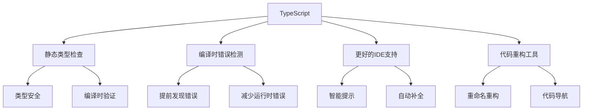

# TypeScript基础

## TypeScript概述

### 什么是TypeScript


### TypeScript vs JavaScript
| 特性 | JavaScript | TypeScript |
|------|------------|------------|
| 类型系统 | 动态类型 | 静态类型 |
| 编译 | 直接运行 | 需要编译 |
| 错误检测 | 运行时 | 编译时 |
| IDE支持 | 基础 | 强大 |
| 学习曲线 | 简单 | 中等 |

## 基础类型系统

### 基本类型
```typescript
// 1. 基本类型声明
let name: string = 'John';
let age: number = 30;
let isActive: boolean = true;
let data: any = '可以是任何类型';

// 2. 数组类型
let numbers: number[] = [1, 2, 3, 4, 5];
let names: Array<string> = ['John', 'Jane', 'Bob'];

// 3. 元组类型
let person: [string, number] = ['John', 30];
let coordinates: [number, number, number] = [10, 20, 30];

// 4. 枚举类型
enum Color {
    Red = 'red',
    Green = 'green',
    Blue = 'blue'
}

enum Status {
    Pending,
    Approved,
    Rejected
}

let favoriteColor: Color = Color.Red;
let currentStatus: Status = Status.Pending;

// 5. 联合类型
let id: string | number = '123';
id = 456; // 也可以赋值数字

// 6. 字面量类型
let direction: 'up' | 'down' | 'left' | 'right' = 'up';
let theme: 'light' | 'dark' = 'light';

// 7. 可选类型
interface User {
    name: string;
    age?: number; // 可选属性
    email?: string;
}

// 8. 只读类型
interface Config {
    readonly apiUrl: string;
    readonly timeout: number;
}

let config: Config = {
    apiUrl: 'https://api.example.com',
    timeout: 5000
};
// config.apiUrl = 'new-url'; // 错误：只读属性
```

### 函数类型
```typescript
// 1. 函数参数和返回值类型
function add(a: number, b: number): number {
    return a + b;
}

// 2. 可选参数
function greet(name: string, greeting?: string): string {
    return `${greeting || 'Hello'}, ${name}!`;
}

// 3. 默认参数
function createUser(name: string, age: number = 18): User {
    return { name, age };
}

// 4. 剩余参数
function sum(...numbers: number[]): number {
    return numbers.reduce((total, num) => total + num, 0);
}

// 5. 函数重载
function process(value: string): string;
function process(value: number): number;
function process(value: string | number): string | number {
    if (typeof value === 'string') {
        return value.toUpperCase();
    } else {
        return value * 2;
    }
}

// 6. 箭头函数类型
const multiply = (a: number, b: number): number => a * b;

// 7. 函数类型别名
type MathOperation = (a: number, b: number) => number;
const divide: MathOperation = (a, b) => a / b;
```

### 接口和类型别名
```typescript
// 1. 接口定义
interface User {
    id: number;
    name: string;
    email: string;
    age?: number;
    isActive: boolean;
}

// 2. 接口继承
interface AdminUser extends User {
    permissions: string[];
    lastLogin: Date;
}

// 3. 接口合并
interface Window {
    title: string;
}

interface Window {
    version: string;
}

// 合并后：{ title: string; version: string; }

// 4. 类型别名
type ID = string | number;
type UserStatus = 'active' | 'inactive' | 'pending';

// 5. 复杂类型别名
type EventHandler<T> = (event: T) => void;
type ApiResponse<T> = {
    data: T;
    status: number;
    message: string;
};

// 6. 条件类型
type NonNullable<T> = T extends null | undefined ? never : T;
type ReturnType<T> = T extends (...args: any[]) => infer R ? R : never;

// 7. 映射类型
type Partial<T> = {
    [P in keyof T]?: T[P];
};

type Required<T> = {
    [P in keyof T]-?: T[P];
};

type Readonly<T> = {
    readonly [P in keyof T]: T[P];
};
```

## 高级类型

### 泛型
```typescript
// 1. 泛型函数
function identity<T>(arg: T): T {
    return arg;
}

let output1 = identity<string>('hello');
let output2 = identity<number>(42);
let output3 = identity('hello'); // 类型推断

// 2. 泛型接口
interface GenericResponse<T> {
    data: T;
    success: boolean;
    message: string;
}

// 3. 泛型类
class GenericRepository<T> {
    private items: T[] = [];
    
    add(item: T): void {
        this.items.push(item);
    }
    
    getById(id: number): T | undefined {
        return this.items[id];
    }
    
    getAll(): T[] {
        return [...this.items];
    }
}

// 4. 泛型约束
interface Lengthwise {
    length: number;
}

function logLength<T extends Lengthwise>(arg: T): T {
    console.log(arg.length);
    return arg;
}

// 5. 多个泛型参数
function merge<T, U>(obj1: T, obj2: U): T & U {
    return { ...obj1, ...obj2 };
}

// 6. 泛型工具类型
type Partial<T> = {
    [P in keyof T]?: T[P];
};

type Pick<T, K extends keyof T> = {
    [P in K]: T[P];
};

type Omit<T, K extends keyof T> = Pick<T, Exclude<keyof T, K>>;
```

### 高级类型操作
```typescript
// 1. 索引类型
interface User {
    id: number;
    name: string;
    email: string;
    age: number;
}

type UserKeys = keyof User; // 'id' | 'name' | 'email' | 'age'
type UserValues = User[keyof User]; // number | string

// 2. 条件类型
type IsString<T> = T extends string ? true : false;
type StringCheck = IsString<string>; // true
type NumberCheck = IsString<number>; // false

// 3. 分布式条件类型
type ToArray<T> = T extends any ? T[] : never;
type StringArray = ToArray<string | number>; // string[] | number[]

// 4. 模板字面量类型
type EventName<T extends string> = `on${Capitalize<T>}`;
type ClickEvent = EventName<'click'>; // 'onClick'
type ChangeEvent = EventName<'change'>; // 'onChange'

// 5. 递归类型
type JSONValue = 
    | string
    | number
    | boolean
    | null
    | JSONValue[]
    | { [key: string]: JSONValue };

// 6. 品牌类型
type Brand<T, B> = T & { __brand: B };
type UserId = Brand<number, 'UserId'>;
type ProductId = Brand<number, 'ProductId'>;

function getUser(id: UserId): User {
    // 实现
}

// 7. 工具类型组合
type DeepPartial<T> = {
    [P in keyof T]?: T[P] extends object ? DeepPartial<T[P]> : T[P];
};

type DeepReadonly<T> = {
    readonly [P in keyof T]: T[P] extends object ? DeepReadonly<T[P]> : T[P];
};
```

## 类和装饰器

### 类定义
```typescript
// 1. 基本类定义
class Animal {
    protected name: string;
    private age: number;
    
    constructor(name: string, age: number) {
        this.name = name;
        this.age = age;
    }
    
    public speak(): void {
        console.log(`${this.name} makes a sound`);
    }
    
    protected getAge(): number {
        return this.age;
    }
}

// 2. 继承
class Dog extends Animal {
    private breed: string;
    
    constructor(name: string, age: number, breed: string) {
        super(name, age);
        this.breed = breed;
    }
    
    public speak(): void {
        console.log(`${this.name} barks`);
    }
    
    public getBreed(): string {
        return this.breed;
    }
}

// 3. 抽象类
abstract class Shape {
    protected color: string;
    
    constructor(color: string) {
        this.color = color;
    }
    
    abstract getArea(): number;
    abstract getPerimeter(): number;
    
    public getColor(): string {
        return this.color;
    }
}

class Circle extends Shape {
    private radius: number;
    
    constructor(color: string, radius: number) {
        super(color);
        this.radius = radius;
    }
    
    getArea(): number {
        return Math.PI * this.radius * this.radius;
    }
    
    getPerimeter(): number {
        return 2 * Math.PI * this.radius;
    }
}

// 4. 接口实现
interface Flyable {
    fly(): void;
}

interface Swimmable {
    swim(): void;
}

class Duck extends Animal implements Flyable, Swimmable {
    fly(): void {
        console.log(`${this.name} is flying`);
    }
    
    swim(): void {
        console.log(`${this.name} is swimming`);
    }
}

// 5. 静态成员
class MathUtils {
    static readonly PI = 3.14159;
    
    static calculateArea(radius: number): number {
        return this.PI * radius * radius;
    }
    
    static calculateCircumference(radius: number): number {
        return 2 * this.PI * radius;
    }
}
```

### 装饰器
```typescript
// 1. 类装饰器
function sealed(constructor: Function) {
    Object.seal(constructor);
    Object.seal(constructor.prototype);
}

@sealed
class Greeter {
    greeting: string;
    
    constructor(message: string) {
        this.greeting = message;
    }
    
    greet() {
        return "Hello, " + this.greeting;
    }
}

// 2. 方法装饰器
function log(target: any, propertyName: string, descriptor: PropertyDescriptor) {
    const method = descriptor.value;
    
    descriptor.value = function (...args: any[]) {
        console.log(`调用方法: ${propertyName}`);
        console.log(`参数:`, args);
        const result = method.apply(this, args);
        console.log(`返回值:`, result);
        return result;
    };
}

class Calculator {
    @log
    add(a: number, b: number): number {
        return a + b;
    }
}

// 3. 属性装饰器
function format(target: any, propertyKey: string) {
    let value = target[propertyKey];
    
    const getter = function () {
        return value;
    };
    
    const setter = function (newVal: string) {
        value = newVal.toUpperCase();
    };
    
    Object.defineProperty(target, propertyKey, {
        get: getter,
        set: setter,
        enumerable: true,
        configurable: true
    });
}

class User {
    @format
    name: string;
    
    constructor(name: string) {
        this.name = name;
    }
}

// 4. 参数装饰器
function validate(target: any, propertyKey: string, parameterIndex: number) {
    const existingRequiredParameters: number[] = Reflect.getOwnMetadata('required', target, propertyKey) || [];
    existingRequiredParameters.push(parameterIndex);
    Reflect.defineMetadata('required', existingRequiredParameters, target, propertyKey);
}

class UserService {
    createUser(@validate name: string, @validate email: string, age: number) {
        // 实现
    }
}
```

## 模块和命名空间

### 模块系统
```typescript
// 1. 导出
// math.ts
export const PI = 3.14159;

export function add(a: number, b: number): number {
    return a + b;
}

export class Calculator {
    multiply(a: number, b: number): number {
        return a * b;
    }
}

// 默认导出
export default class MathUtils {
    static calculateArea(radius: number): number {
        return PI * radius * radius;
    }
}

// 2. 导入
// app.ts
import MathUtils, { PI, add, Calculator } from './math';

// 3. 命名空间
namespace Geometry {
    export interface Point {
        x: number;
        y: number;
    }
    
    export class Circle {
        constructor(public center: Point, public radius: number) {}
        
        getArea(): number {
            return Math.PI * this.radius * this.radius;
        }
    }
}

// 使用命名空间
const point: Geometry.Point = { x: 0, y: 0 };
const circle = new Geometry.Circle(point, 5);
```

## 实际应用示例

### 项目结构
```typescript
// 1. 类型定义
// types/index.ts
export interface User {
    id: number;
    name: string;
    email: string;
    age: number;
    isActive: boolean;
}

export interface ApiResponse<T> {
    data: T;
    success: boolean;
    message: string;
}

export type UserStatus = 'active' | 'inactive' | 'pending';

// 2. 服务层
// services/UserService.ts
import { User, ApiResponse } from '../types';

export class UserService {
    private baseUrl: string;
    
    constructor(baseUrl: string) {
        this.baseUrl = baseUrl;
    }
    
    async getUsers(): Promise<ApiResponse<User[]>> {
        const response = await fetch(`${this.baseUrl}/users`);
        return response.json();
    }
    
    async createUser(userData: Omit<User, 'id'>): Promise<ApiResponse<User>> {
        const response = await fetch(`${this.baseUrl}/users`, {
            method: 'POST',
            headers: {
                'Content-Type': 'application/json'
            },
            body: JSON.stringify(userData)
        });
        return response.json();
    }
    
    async updateUser(id: number, updates: Partial<User>): Promise<ApiResponse<User>> {
        const response = await fetch(`${this.baseUrl}/users/${id}`, {
            method: 'PUT',
            headers: {
                'Content-Type': 'application/json'
            },
            body: JSON.stringify(updates)
        });
        return response.json();
    }
}

// 3. 组件类
// components/UserList.ts
import { User, UserService } from '../services/UserService';

export class UserList {
    private container: HTMLElement;
    private userService: UserService;
    private users: User[] = [];
    
    constructor(container: HTMLElement, userService: UserService) {
        this.container = container;
        this.userService = userService;
    }
    
    async loadUsers(): Promise<void> {
        try {
            const response = await this.userService.getUsers();
            if (response.success) {
                this.users = response.data;
                this.render();
            } else {
                this.showError(response.message);
            }
        } catch (error) {
            this.showError('加载用户失败');
        }
    }
    
    private render(): void {
        this.container.innerHTML = this.users.map(user => `
            <div class="user-card" data-user-id="${user.id}">
                <h3>${user.name}</h3>
                <p>邮箱: ${user.email}</p>
                <p>年龄: ${user.age}</p>
                <p>状态: ${user.isActive ? '活跃' : '非活跃'}</p>
            </div>
        `).join('');
    }
    
    private showError(message: string): void {
        this.container.innerHTML = `<div class="error">${message}</div>`;
    }
}

// 4. 主应用
// app.ts
import { UserService } from './services/UserService';
import { UserList } from './components/UserList';

class App {
    private userService: UserService;
    private userList: UserList;
    
    constructor() {
        this.userService = new UserService('https://api.example.com');
        const container = document.getElementById('user-list') as HTMLElement;
        this.userList = new UserList(container, this.userService);
        this.init();
    }
    
    private async init(): Promise<void> {
        await this.userList.loadUsers();
    }
}

// 启动应用
new App();
```

## 相关链接
- [[03-应用实践层/02-现代开发/01-ES6+新特性]] - ES6+新特性
- [[02-理解掌握层/04-模块化/03-ES6模块系统]] - ES6模块系统
- [[04-高级精通层/02-函数式编程/01-纯函数概念]] - 函数式编程
- [[04-高级精通层/04-安全与测试/03-单元测试(Jest)]] - 单元测试
