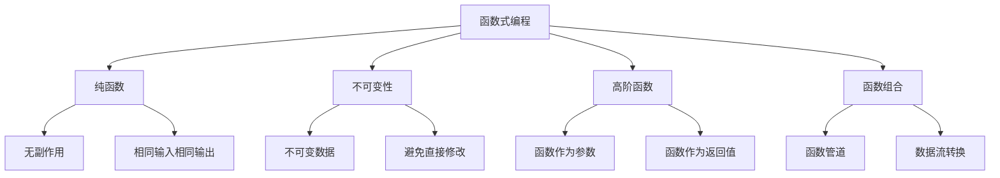

# 函数式编程概念

## 函数式编程基础

### 核心概念


### 函数式编程原则
| 原则 | 描述 | 示例 |
|------|------|------|
| 纯函数 | 无副作用，相同输入产生相同输出 | `const add = (a, b) => a + b` |
| 不可变性 | 不修改原始数据，创建新数据 | `const newArr = [...oldArr, item]` |
| 高阶函数 | 接受函数作为参数或返回函数 | `array.map(fn)` |
| 函数组合 | 将简单函数组合成复杂函数 | `compose(f, g, h)` |

## 纯函数

### 纯函数定义
```javascript
// 1. 纯函数示例
// 纯函数 - 无副作用，相同输入相同输出
function add(a, b) {
    return a + b;
}

function multiply(a, b) {
    return a * b;
}

function square(x) {
    return x * x;
}

// 2. 非纯函数示例
let counter = 0;

// 非纯函数 - 有副作用
function increment() {
    counter++; // 修改外部状态
    return counter;
}

// 非纯函数 - 依赖外部状态
function getCurrentTime() {
    return new Date(); // 每次调用结果不同
}

// 3. 纯函数的好处
// 可预测性
console.log(add(2, 3)); // 总是 5
console.log(add(2, 3)); // 总是 5

// 可测试性
function testAdd() {
    console.assert(add(2, 3) === 5, 'add(2, 3) should be 5');
    console.assert(add(0, 0) === 0, 'add(0, 0) should be 0');
    console.assert(add(-1, 1) === 0, 'add(-1, 1) should be 0');
}

// 4. 纯函数转换
// 将非纯函数转换为纯函数
function createIncrementer(initialValue = 0) {
    return function increment(value) {
        return value + 1;
    };
}

const increment = createIncrementer();
console.log(increment(5)); // 6
console.log(increment(5)); // 6 (相同输入相同输出)
```

### 副作用处理
```javascript
// 1. 识别副作用
// 有副作用的函数
function updateUser(user, newName) {
    user.name = newName; // 修改原始对象
    return user;
}

// 无副作用的函数
function updateUserPure(user, newName) {
    return {
        ...user,
        name: newName
    };
}

// 2. 副作用隔离
// 将副作用与纯逻辑分离
function processUserData(userData) {
    // 纯函数 - 数据处理
    const processedData = userData.map(user => ({
        ...user,
        displayName: `${user.firstName} ${user.lastName}`,
        isActive: user.status === 'active'
    }));
    
    return processedData;
}

function saveToDatabase(data) {
    // 副作用 - 数据库操作
    console.log('Saving to database:', data);
    // 实际数据库操作
}

// 3. 副作用管理
class SideEffectManager {
    constructor() {
        this.effects = [];
    }
    
    addEffect(effect) {
        this.effects.push(effect);
    }
    
    executeEffects() {
        this.effects.forEach(effect => effect());
        this.effects = [];
    }
}

// 使用示例
const effectManager = new SideEffectManager();

function createUserWithEffects(userData) {
    const user = processUserData([userData])[0];
    
    // 添加副作用
    effectManager.addEffect(() => saveToDatabase(user));
    effectManager.addEffect(() => sendWelcomeEmail(user.email));
    
    return user;
}
```

## 不可变性

### 不可变数据操作
```javascript
// 1. 数组不可变操作
const numbers = [1, 2, 3, 4, 5];

// 添加元素
const newNumbers = [...numbers, 6];
console.log(numbers); // [1, 2, 3, 4, 5] (原数组不变)
console.log(newNumbers); // [1, 2, 3, 4, 5, 6]

// 删除元素
const filteredNumbers = numbers.filter(n => n !== 3);
console.log(filteredNumbers); // [1, 2, 4, 5]

// 更新元素
const updatedNumbers = numbers.map(n => n === 3 ? 30 : n);
console.log(updatedNumbers); // [1, 2, 30, 4, 5]

// 2. 对象不可变操作
const user = {
    id: 1,
    name: 'John',
    age: 30,
    address: {
        city: 'New York',
        country: 'USA'
    }
};

// 更新属性
const updatedUser = {
    ...user,
    age: 31
};

// 深度更新
const userWithNewAddress = {
    ...user,
    address: {
        ...user.address,
        city: 'Los Angeles'
    }
};

// 3. 不可变工具函数
function updateIn(obj, path, value) {
    if (path.length === 0) return value;
    
    const [key, ...rest] = path;
    
    if (path.length === 1) {
        return {
            ...obj,
            [key]: value
        };
    }
    
    return {
        ...obj,
        [key]: updateIn(obj[key] || {}, rest, value)
    };
}

// 使用示例
const userWithUpdatedCity = updateIn(user, ['address', 'city'], 'Chicago');
console.log(userWithUpdatedCity.address.city); // 'Chicago'
console.log(user.address.city); // 'New York' (原对象不变)
```

### 不可变数据结构
```javascript
// 1. 不可变列表
class ImmutableList {
    constructor(items = []) {
        this.items = [...items];
    }
    
    add(item) {
        return new ImmutableList([...this.items, item]);
    }
    
    remove(index) {
        const newItems = this.items.filter((_, i) => i !== index);
        return new ImmutableList(newItems);
    }
    
    update(index, item) {
        const newItems = this.items.map((existingItem, i) => 
            i === index ? item : existingItem
        );
        return new ImmutableList(newItems);
    }
    
    get(index) {
        return this.items[index];
    }
    
    size() {
        return this.items.length;
    }
    
    toArray() {
        return [...this.items];
    }
}

// 使用示例
const list1 = new ImmutableList([1, 2, 3]);
const list2 = list1.add(4);
const list3 = list2.remove(1);

console.log(list1.toArray()); // [1, 2, 3]
console.log(list2.toArray()); // [1, 2, 3, 4]
console.log(list3.toArray()); // [1, 3, 4]

// 2. 不可变对象
class ImmutableObject {
    constructor(data = {}) {
        this.data = { ...data };
    }
    
    set(key, value) {
        return new ImmutableObject({
            ...this.data,
            [key]: value
        });
    }
    
    get(key) {
        return this.data[key];
    }
    
    has(key) {
        return key in this.data;
    }
    
    delete(key) {
        const newData = { ...this.data };
        delete newData[key];
        return new ImmutableObject(newData);
    }
    
    toObject() {
        return { ...this.data };
    }
}

// 使用示例
const obj1 = new ImmutableObject({ name: 'John', age: 30 });
const obj2 = obj1.set('age', 31);
const obj3 = obj2.set('city', 'New York');

console.log(obj1.toObject()); // { name: 'John', age: 30 }
console.log(obj2.toObject()); // { name: 'John', age: 31 }
console.log(obj3.toObject()); // { name: 'John', age: 31, city: 'New York' }
```

## 高阶函数

### 函数作为参数
```javascript
// 1. 数组高阶函数
const numbers = [1, 2, 3, 4, 5];

// map - 转换
const doubled = numbers.map(n => n * 2);
console.log(doubled); // [2, 4, 6, 8, 10]

// filter - 过滤
const evens = numbers.filter(n => n % 2 === 0);
console.log(evens); // [2, 4]

// reduce - 归约
const sum = numbers.reduce((acc, n) => acc + n, 0);
console.log(sum); // 15

// 2. 自定义高阶函数
function forEach(array, callback) {
    for (let i = 0; i < array.length; i++) {
        callback(array[i], i, array);
    }
}

function find(array, predicate) {
    for (let i = 0; i < array.length; i++) {
        if (predicate(array[i], i, array)) {
            return array[i];
        }
    }
    return undefined;
}

function some(array, predicate) {
    for (let i = 0; i < array.length; i++) {
        if (predicate(array[i], i, array)) {
            return true;
        }
    }
    return false;
}

// 使用示例
forEach(numbers, (n, index) => {
    console.log(`Index ${index}: ${n}`);
});

const found = find(numbers, n => n > 3);
console.log(found); // 4

const hasEven = some(numbers, n => n % 2 === 0);
console.log(hasEven); // true

// 3. 函数工厂
function createValidator(rules) {
    return function validate(data) {
        const errors = [];
        
        for (const [field, rule] of Object.entries(rules)) {
            const value = data[field];
            if (!rule(value)) {
                errors.push(`${field} is invalid`);
            }
        }
        
        return {
            isValid: errors.length === 0,
            errors
        };
    };
}

// 使用示例
const userValidator = createValidator({
    name: value => value && value.length > 0,
    email: value => value && value.includes('@'),
    age: value => value && value >= 18
});

const validation = userValidator({
    name: 'John',
    email: 'john@example.com',
    age: 25
});

console.log(validation); // { isValid: true, errors: [] }
```

### 函数作为返回值
```javascript
// 1. 闭包和函数工厂
function createMultiplier(factor) {
    return function multiply(number) {
        return number * factor;
    };
}

const double = createMultiplier(2);
const triple = createMultiplier(3);

console.log(double(5)); // 10
console.log(triple(5)); // 15

// 2. 柯里化
function curry(fn) {
    return function curried(...args) {
        if (args.length >= fn.length) {
            return fn.apply(this, args);
        } else {
            return function(...nextArgs) {
                return curried.apply(this, args.concat(nextArgs));
            };
        }
    };
}

// 使用示例
function add(a, b, c) {
    return a + b + c;
}

const curriedAdd = curry(add);
console.log(curriedAdd(1)(2)(3)); // 6
console.log(curriedAdd(1, 2)(3)); // 6
console.log(curriedAdd(1)(2, 3)); // 6

// 3. 部分应用
function partial(fn, ...presetArgs) {
    return function(...laterArgs) {
        return fn(...presetArgs, ...laterArgs);
    };
}

// 使用示例
function greet(greeting, name, punctuation) {
    return `${greeting} ${name}${punctuation}`;
}

const sayHello = partial(greet, 'Hello');
const sayHelloToJohn = partial(sayHello, 'John');

console.log(sayHelloToJohn('!')); // "Hello John!"
console.log(sayHello('Jane', '?')); // "Hello Jane?"

// 4. 记忆化
function memoize(fn) {
    const cache = new Map();
    
    return function memoized(...args) {
        const key = JSON.stringify(args);
        
        if (cache.has(key)) {
            return cache.get(key);
        }
        
        const result = fn.apply(this, args);
        cache.set(key, result);
        return result;
    };
}

// 使用示例
const expensiveCalculation = memoize(function(n) {
    console.log(`Calculating for ${n}`);
    return n * n * n;
});

console.log(expensiveCalculation(5)); // Calculating for 5, 125
console.log(expensiveCalculation(5)); // 125 (从缓存获取)
```

## 函数组合

### 基础组合
```javascript
// 1. 函数组合
function compose(...fns) {
    return function composed(value) {
        return fns.reduceRight((result, fn) => fn(result), value);
    };
}

function pipe(...fns) {
    return function piped(value) {
        return fns.reduce((result, fn) => fn(result), value);
    };
}

// 使用示例
const add1 = x => x + 1;
const multiply2 = x => x * 2;
const square = x => x * x;

const composed = compose(square, multiply2, add1);
const piped = pipe(add1, multiply2, square);

console.log(composed(3)); // ((3 + 1) * 2)² = 64
console.log(piped(3)); // ((3 + 1) * 2)² = 64

// 2. 数组处理组合
const numbers = [1, 2, 3, 4, 5, 6, 7, 8, 9, 10];

const processNumbers = pipe(
    arr => arr.filter(n => n % 2 === 0), // 过滤偶数
    arr => arr.map(n => n * n), // 平方
    arr => arr.reduce((sum, n) => sum + n, 0) // 求和
);

const result = processNumbers(numbers);
console.log(result); // 2² + 4² + 6² + 8² + 10² = 220

// 3. 对象处理组合
const users = [
    { name: 'John', age: 30, active: true },
    { name: 'Jane', age: 25, active: false },
    { name: 'Bob', age: 35, active: true }
];

const processUsers = pipe(
    users => users.filter(user => user.active),
    users => users.map(user => ({ ...user, age: user.age + 1 })),
    users => users.sort((a, b) => a.age - b.age)
);

const processedUsers = processUsers(users);
console.log(processedUsers);
// [{ name: 'John', age: 31, active: true }, { name: 'Bob', age: 36, active: true }]
```

### 高级组合
```javascript
// 1. 条件组合
function when(condition, fn) {
    return function conditional(value) {
        return condition(value) ? fn(value) : value;
    };
}

function unless(condition, fn) {
    return function conditional(value) {
        return !condition(value) ? fn(value) : value;
    };
}

// 使用示例
const isEven = n => n % 2 === 0;
const double = n => n * 2;
const add1 = n => n + 1;

const processNumber = pipe(
    when(isEven, double),
    unless(isEven, add1)
);

console.log(processNumber(4)); // 8 (4 * 2)
console.log(processNumber(5)); // 6 (5 + 1)

// 2. 错误处理组合
function tryCatch(fn, errorHandler) {
    return function safe(value) {
        try {
            return fn(value);
        } catch (error) {
            return errorHandler(error, value);
        }
    };
}

function maybe(fn) {
    return function maybe(value) {
        return value != null ? fn(value) : null;
    };
}

// 使用示例
const safeParseInt = tryCatch(
    parseInt,
    (error, value) => {
        console.error(`Failed to parse ${value}:`, error);
        return 0;
    }
);

const safeSquare = maybe(x => x * x);

console.log(safeParseInt('123')); // 123
console.log(safeParseInt('abc')); // 0 (错误处理)
console.log(safeSquare(5)); // 25
console.log(safeSquare(null)); // null

// 3. 异步组合
function composeAsync(...fns) {
    return function composedAsync(value) {
        return fns.reduceRight(
            (promise, fn) => promise.then(fn),
            Promise.resolve(value)
        );
    };
}

// 使用示例
const fetchUser = async (id) => {
    const response = await fetch(`/api/users/${id}`);
    return response.json();
};

const validateUser = (user) => {
    if (!user.name || !user.email) {
        throw new Error('Invalid user data');
    }
    return user;
};

const formatUser = (user) => ({
    ...user,
    displayName: `${user.firstName} ${user.lastName}`
});

const processUser = composeAsync(formatUser, validateUser, fetchUser);

// 使用
processUser(123)
    .then(user => console.log('Processed user:', user))
    .catch(error => console.error('Error:', error));
```

## 实际应用示例

### 函数式工具库
```javascript
// 1. 函数式工具函数
const functionalUtils = {
    // 数组操作
    map: (fn, array) => array.map(fn),
    filter: (predicate, array) => array.filter(predicate),
    reduce: (fn, initial, array) => array.reduce(fn, initial),
    
    // 对象操作
    pick: (keys, obj) => {
        const result = {};
        keys.forEach(key => {
            if (key in obj) {
                result[key] = obj[key];
            }
        });
        return result;
    },
    
    omit: (keys, obj) => {
        const result = { ...obj };
        keys.forEach(key => delete result[key]);
        return result;
    },
    
    // 函数操作
    compose: (...fns) => (value) => fns.reduceRight((result, fn) => fn(result), value),
    pipe: (...fns) => (value) => fns.reduce((result, fn) => fn(result), value),
    
    // 条件操作
    when: (condition, fn) => (value) => condition(value) ? fn(value) : value,
    unless: (condition, fn) => (value) => !condition(value) ? fn(value) : value,
    
    // 类型检查
    isString: (value) => typeof value === 'string',
    isNumber: (value) => typeof value === 'number',
    isArray: (value) => Array.isArray(value),
    isObject: (value) => value !== null && typeof value === 'object' && !Array.isArray(value)
};

// 2. 数据处理管道
const data = [
    { id: 1, name: 'John', age: 30, department: 'IT', salary: 50000 },
    { id: 2, name: 'Jane', age: 25, department: 'HR', salary: 45000 },
    { id: 3, name: 'Bob', age: 35, department: 'IT', salary: 60000 },
    { id: 4, name: 'Alice', age: 28, department: 'Finance', salary: 55000 }
];

const processEmployeeData = functionalUtils.pipe(
    // 过滤IT部门
    arr => functionalUtils.filter(emp => emp.department === 'IT', arr),
    
    // 计算年薪
    arr => functionalUtils.map(emp => ({ ...emp, annualSalary: emp.salary * 12 }), arr),
    
    // 按年龄排序
    arr => arr.sort((a, b) => a.age - b.age),
    
    // 只保留必要字段
    arr => functionalUtils.map(emp => functionalUtils.pick(['name', 'age', 'annualSalary'], emp), arr)
);

const processedData = processEmployeeData(data);
console.log(processedData);
// [
//   { name: 'John', age: 30, annualSalary: 600000 },
//   { name: 'Bob', age: 35, annualSalary: 720000 }
// ]

// 3. 状态管理
class FunctionalStateManager {
    constructor(initialState = {}) {
        this.state = { ...initialState };
        this.listeners = [];
    }
    
    getState() {
        return { ...this.state };
    }
    
    setState(updater) {
        const newState = typeof updater === 'function' 
            ? updater(this.state) 
            : updater;
        
        this.state = { ...this.state, ...newState };
        this.notifyListeners();
    }
    
    subscribe(listener) {
        this.listeners.push(listener);
        return () => {
            const index = this.listeners.indexOf(listener);
            if (index > -1) {
                this.listeners.splice(index, 1);
            }
        };
    }
    
    notifyListeners() {
        this.listeners.forEach(listener => listener(this.state));
    }
}

// 使用示例
const stateManager = new FunctionalStateManager({
    users: [],
    loading: false,
    error: null
});

// 纯函数更新器
const addUser = (user) => (state) => ({
    ...state,
    users: [...state.users, user]
});

const setLoading = (loading) => (state) => ({
    ...state,
    loading
});

const setError = (error) => (state) => ({
    ...state,
    error
});

// 使用
stateManager.setState(setLoading(true));
stateManager.setState(addUser({ id: 1, name: 'John' }));
stateManager.setState(setLoading(false));
```

## 相关链接
- [[04-高级精通层/02-函数式编程/01-纯函数概念]] - 纯函数概念
- [[04-高级精通层/02-函数式编程/02-高阶函数]] - 高阶函数
- [[04-高级精通层/02-函数式编程/03-函数组合]] - 函数组合
- [[04-高级精通层/02-函数式编程/04-不可变数据]] - 不可变数据
