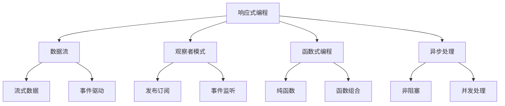

# 响应式编程

## 响应式编程基础

### 核心概念


### 响应式编程原则
| 原则 | 描述 | 示例 |
|------|------|------|
| 数据流 | 数据以流的形式传递 | `Observable.fromEvent(button, 'click')` |
| 异步处理 | 非阻塞的异步操作 | `stream.map().filter().subscribe()` |
| 函数式 | 使用纯函数和函数组合 | `stream.pipe(map(fn), filter(pred))` |
| 声明式 | 描述做什么而不是怎么做 | `stream.filter(x => x > 0)` |

## 观察者模式

### 基础观察者模式
```javascript
// 1. 观察者接口
class Observer {
    update(data) {
        throw new Error('update method must be implemented');
    }
}

// 2. 被观察者接口
class Subject {
    constructor() {
        this.observers = [];
    }
    
    addObserver(observer) {
        this.observers.push(observer);
    }
    
    removeObserver(observer) {
        const index = this.observers.indexOf(observer);
        if (index > -1) {
            this.observers.splice(index, 1);
        }
    }
    
    notify(data) {
        this.observers.forEach(observer => observer.update(data));
    }
}

// 3. 具体实现
class DataStore extends Subject {
    constructor() {
        super();
        this.data = {};
    }
    
    setData(key, value) {
        this.data[key] = value;
        this.notify({ key, value, data: this.data });
    }
    
    getData(key) {
        return this.data[key];
    }
}

class Logger extends Observer {
    update(data) {
        console.log('Data changed:', data);
    }
}

class UIUpdater extends Observer {
    constructor(element) {
        super();
        this.element = element;
    }
    
    update(data) {
        this.element.textContent = JSON.stringify(data.data, null, 2);
    }
}

// 4. 使用示例
const store = new DataStore();
const logger = new Logger();
const uiUpdater = new UIUpdater(document.getElementById('data-display'));

store.addObserver(logger);
store.addObserver(uiUpdater);

store.setData('user', { name: 'John', age: 30 });
store.setData('theme', 'dark');
```

### 事件发射器
```javascript
// 1. 事件发射器实现
class EventEmitter {
    constructor() {
        this.events = new Map();
    }
    
    on(event, listener) {
        if (!this.events.has(event)) {
            this.events.set(event, []);
        }
        this.events.get(event).push(listener);
    }
    
    off(event, listener) {
        if (!this.events.has(event)) return;
        
        const listeners = this.events.get(event);
        const index = listeners.indexOf(listener);
        if (index > -1) {
            listeners.splice(index, 1);
        }
    }
    
    emit(event, ...args) {
        if (!this.events.has(event)) return;
        
        const listeners = this.events.get(event);
        listeners.forEach(listener => {
            try {
                listener(...args);
            } catch (error) {
                console.error(`Error in event listener for ${event}:`, error);
            }
        });
    }
    
    once(event, listener) {
        const onceWrapper = (...args) => {
            listener(...args);
            this.off(event, onceWrapper);
        };
        this.on(event, onceWrapper);
    }
    
    removeAllListeners(event) {
        if (event) {
            this.events.delete(event);
        } else {
            this.events.clear();
        }
    }
}

// 2. 使用示例
const emitter = new EventEmitter();

// 监听事件
emitter.on('user:login', (user) => {
    console.log('User logged in:', user.name);
});

emitter.on('user:logout', (user) => {
    console.log('User logged out:', user.name);
});

// 一次性监听
emitter.once('app:ready', () => {
    console.log('App is ready!');
});

// 触发事件
emitter.emit('user:login', { name: 'John', id: 1 });
emitter.emit('app:ready');
emitter.emit('user:logout', { name: 'John', id: 1 });
```

## 数据流处理

### 基础数据流
```javascript
// 1. 简单数据流实现
class DataStream {
    constructor() {
        this.subscribers = [];
        this.value = null;
    }
    
    subscribe(callback) {
        this.subscribers.push(callback);
        
        // 如果已有值，立即通知
        if (this.value !== null) {
            callback(this.value);
        }
        
        // 返回取消订阅函数
        return () => {
            const index = this.subscribers.indexOf(callback);
            if (index > -1) {
                this.subscribers.splice(index, 1);
            }
        };
    }
    
    next(value) {
        this.value = value;
        this.subscribers.forEach(callback => callback(value));
    }
    
    map(transform) {
        const newStream = new DataStream();
        
        this.subscribe(value => {
            try {
                const transformedValue = transform(value);
                newStream.next(transformedValue);
            } catch (error) {
                console.error('Error in map transform:', error);
            }
        });
        
        return newStream;
    }
    
    filter(predicate) {
        const newStream = new DataStream();
        
        this.subscribe(value => {
            if (predicate(value)) {
                newStream.next(value);
            }
        });
        
        return newStream;
    }
    
    reduce(reducer, initialValue) {
        const newStream = new DataStream();
        let accumulator = initialValue;
        
        this.subscribe(value => {
            accumulator = reducer(accumulator, value);
            newStream.next(accumulator);
        });
        
        return newStream;
    }
}

// 2. 使用示例
const numberStream = new DataStream();

// 创建处理链
const processedStream = numberStream
    .filter(x => x > 0)
    .map(x => x * 2)
    .reduce((sum, x) => sum + x, 0);

// 订阅处理结果
processedStream.subscribe(result => {
    console.log('Processed result:', result);
});

// 发送数据
numberStream.next(1); // 2
numberStream.next(2); // 6 (2 + 4)
numberStream.next(3); // 12 (2 + 4 + 6)
numberStream.next(-1); // 被过滤掉
numberStream.next(4); // 20 (2 + 4 + 6 + 8)
```

### 高级数据流
```javascript
// 1. 合并流
class StreamMerger {
    static merge(...streams) {
        const mergedStream = new DataStream();
        
        streams.forEach(stream => {
            stream.subscribe(value => {
                mergedStream.next(value);
            });
        });
        
        return mergedStream;
    }
    
    static combineLatest(...streams) {
        const combinedStream = new DataStream();
        const values = new Array(streams.length);
        const hasValue = new Array(streams.length).fill(false);
        
        streams.forEach((stream, index) => {
            stream.subscribe(value => {
                values[index] = value;
                hasValue[index] = true;
                
                if (hasValue.every(Boolean)) {
                    combinedStream.next([...values]);
                }
            });
        });
        
        return combinedStream;
    }
    
    static zip(...streams) {
        const zippedStream = new DataStream();
        const buffers = streams.map(() => []);
        
        streams.forEach((stream, index) => {
            stream.subscribe(value => {
                buffers[index].push(value);
                
                // 检查所有缓冲区都有值
                if (buffers.every(buffer => buffer.length > 0)) {
                    const zipped = buffers.map(buffer => buffer.shift());
                    zippedStream.next(zipped);
                }
            });
        });
        
        return zippedStream;
    }
}

// 2. 使用示例
const stream1 = new DataStream();
const stream2 = new DataStream();
const stream3 = new DataStream();

// 合并流
const merged = StreamMerger.merge(stream1, stream2, stream3);
merged.subscribe(value => {
    console.log('Merged value:', value);
});

// 组合最新值
const combined = StreamMerger.combineLatest(stream1, stream2, stream3);
combined.subscribe(values => {
    console.log('Combined values:', values);
});

// 压缩流
const zipped = StreamMerger.zip(stream1, stream2, stream3);
zipped.subscribe(values => {
    console.log('Zipped values:', values);
});

// 发送数据
stream1.next('A1');
stream2.next('B1');
stream3.next('C1'); // 触发组合和压缩
stream1.next('A2');
stream2.next('B2'); // 触发压缩
```

## 异步流处理

### Promise流
```javascript
// 1. Promise流实现
class PromiseStream {
    constructor() {
        this.subscribers = [];
        this.pending = false;
    }
    
    subscribe(callback) {
        this.subscribers.push(callback);
        
        return () => {
            const index = this.subscribers.indexOf(callback);
            if (index > -1) {
                this.subscribers.splice(index, 1);
            }
        };
    }
    
    next(promise) {
        if (this.pending) {
            console.warn('Previous promise still pending');
            return;
        }
        
        this.pending = true;
        
        promise
            .then(value => {
                this.pending = false;
                this.subscribers.forEach(callback => callback(value));
            })
            .catch(error => {
                this.pending = false;
                this.subscribers.forEach(callback => callback(null, error));
            });
    }
    
    map(transform) {
        const newStream = new PromiseStream();
        
        this.subscribe((value, error) => {
            if (error) {
                newStream.next(Promise.reject(error));
            } else {
                try {
                    const transformedValue = transform(value);
                    newStream.next(Promise.resolve(transformedValue));
                } catch (err) {
                    newStream.next(Promise.reject(err));
                }
            }
        });
        
        return newStream;
    }
    
    catch(errorHandler) {
        const newStream = new PromiseStream();
        
        this.subscribe((value, error) => {
            if (error) {
                try {
                    const handledValue = errorHandler(error);
                    newStream.next(Promise.resolve(handledValue));
                } catch (err) {
                    newStream.next(Promise.reject(err));
                }
            } else {
                newStream.next(Promise.resolve(value));
            }
        });
        
        return newStream;
    }
}

// 2. 使用示例
const apiStream = new PromiseStream();

// 创建处理链
const processedApiStream = apiStream
    .map(data => data.results)
    .map(results => results.map(item => item.name))
    .catch(error => {
        console.error('API Error:', error);
        return ['Default Item'];
    });

// 订阅结果
processedApiStream.subscribe((names, error) => {
    if (error) {
        console.error('Processing error:', error);
    } else {
        console.log('Names:', names);
    }
});

// 发送API请求
apiStream.next(fetch('/api/users').then(response => response.json()));
```

### 事件流
```javascript
// 1. 事件流实现
class EventStream {
    constructor(element, eventType) {
        this.element = element;
        this.eventType = eventType;
        this.subscribers = [];
        this.isActive = false;
    }
    
    subscribe(callback) {
        this.subscribers.push(callback);
        
        if (!this.isActive) {
            this.start();
        }
        
        return () => {
            const index = this.subscribers.indexOf(callback);
            if (index > -1) {
                this.subscribers.splice(index, 1);
            }
            
            if (this.subscribers.length === 0) {
                this.stop();
            }
        };
    }
    
    start() {
        if (this.isActive) return;
        
        this.isActive = true;
        this.element.addEventListener(this.eventType, this.handleEvent.bind(this));
    }
    
    stop() {
        if (!this.isActive) return;
        
        this.isActive = false;
        this.element.removeEventListener(this.eventType, this.handleEvent.bind(this));
    }
    
    handleEvent(event) {
        this.subscribers.forEach(callback => {
            try {
                callback(event);
            } catch (error) {
                console.error('Error in event handler:', error);
            }
        });
    }
    
    map(transform) {
        const newStream = new DataStream();
        
        this.subscribe(event => {
            try {
                const transformedValue = transform(event);
                newStream.next(transformedValue);
            } catch (error) {
                console.error('Error in map transform:', error);
            }
        });
        
        return newStream;
    }
    
    filter(predicate) {
        const newStream = new DataStream();
        
        this.subscribe(event => {
            if (predicate(event)) {
                newStream.next(event);
            }
        });
        
        return newStream;
    }
    
    debounce(delay) {
        const newStream = new DataStream();
        let timeoutId;
        
        this.subscribe(event => {
            clearTimeout(timeoutId);
            timeoutId = setTimeout(() => {
                newStream.next(event);
            }, delay);
        });
        
        return newStream;
    }
    
    throttle(delay) {
        const newStream = new DataStream();
        let lastEmit = 0;
        
        this.subscribe(event => {
            const now = Date.now();
            if (now - lastEmit >= delay) {
                lastEmit = now;
                newStream.next(event);
            }
        });
        
        return newStream;
    }
}

// 2. 使用示例
const button = document.getElementById('myButton');
const input = document.getElementById('myInput');

// 按钮点击流
const clickStream = new EventStream(button, 'click');
clickStream.subscribe(event => {
    console.log('Button clicked!');
});

// 输入流
const inputStream = new EventStream(input, 'input');

// 创建处理链
const processedInputStream = inputStream
    .map(event => event.target.value)
    .filter(value => value.length > 2)
    .debounce(300)
    .map(value => value.toUpperCase());

processedInputStream.subscribe(value => {
    console.log('Processed input:', value);
});

// 节流流
const scrollStream = new EventStream(window, 'scroll');
const throttledScroll = scrollStream.throttle(100);

throttledScroll.subscribe(event => {
    console.log('Scroll position:', window.scrollY);
});
```

## 实际应用示例

### 响应式表单
```javascript
// 1. 响应式表单实现
class ReactiveForm {
    constructor(formElement) {
        this.form = formElement;
        this.fields = new Map();
        this.validators = new Map();
        this.subscribers = [];
    }
    
    addField(name, element) {
        const fieldStream = new EventStream(element, 'input');
        this.fields.set(name, fieldStream);
        
        // 创建字段值流
        const valueStream = fieldStream.map(event => event.target.value);
        
        // 创建验证流
        const validationStream = valueStream.map(value => {
            const validator = this.validators.get(name);
            if (validator) {
                return validator(value);
            }
            return { isValid: true, error: null };
        });
        
        // 创建字段状态流
        const fieldStateStream = StreamMerger.combineLatest(valueStream, validationStream);
        
        return {
            value: valueStream,
            validation: validationStream,
            state: fieldStateStream
        };
    }
    
    addValidator(fieldName, validator) {
        this.validators.set(fieldName, validator);
    }
    
    subscribe(callback) {
        this.subscribers.push(callback);
    }
    
    getFormState() {
        const fieldStates = {};
        
        for (const [name, field] of this.fields) {
            fieldStates[name] = {
                value: field.value,
                validation: field.validation
            };
        }
        
        return fieldStates;
    }
}

// 2. 使用示例
const form = new ReactiveForm(document.getElementById('myForm'));

// 添加字段
const nameField = form.addField('name', document.getElementById('name'));
const emailField = form.addField('email', document.getElementById('email'));
const passwordField = form.addField('password', document.getElementById('password'));

// 添加验证器
form.addValidator('name', (value) => {
    if (!value || value.length < 2) {
        return { isValid: false, error: 'Name must be at least 2 characters' };
    }
    return { isValid: true, error: null };
});

form.addValidator('email', (value) => {
    const emailRegex = /^[^\s@]+@[^\s@]+\.[^\s@]+$/;
    if (!value || !emailRegex.test(value)) {
        return { isValid: false, error: 'Invalid email format' };
    }
    return { isValid: true, error: null };
});

form.addValidator('password', (value) => {
    if (!value || value.length < 8) {
        return { isValid: false, error: 'Password must be at least 8 characters' };
    }
    return { isValid: true, error: null };
});

// 监听表单状态变化
const formStateStream = StreamMerger.combineLatest(
    nameField.state,
    emailField.state,
    passwordField.state
);

formStateStream.subscribe(([nameState, emailState, passwordState]) => {
    const isFormValid = nameState[1].isValid && 
                       emailState[1].isValid && 
                       passwordState[1].isValid;
    
    const submitButton = document.getElementById('submit');
    submitButton.disabled = !isFormValid;
    
    // 更新错误显示
    updateErrorDisplay('name', nameState[1].error);
    updateErrorDisplay('email', emailState[1].error);
    updateErrorDisplay('password', passwordState[1].error);
});

function updateErrorDisplay(fieldName, error) {
    const errorElement = document.getElementById(`${fieldName}-error`);
    if (errorElement) {
        errorElement.textContent = error || '';
    }
}
```

### 响应式状态管理
```javascript
// 1. 响应式状态管理器
class ReactiveStateManager {
    constructor(initialState = {}) {
        this.state = { ...initialState };
        this.stateStreams = new Map();
        this.subscribers = [];
    }
    
    createStateStream(key) {
        if (this.stateStreams.has(key)) {
            return this.stateStreams.get(key);
        }
        
        const stream = new DataStream();
        stream.next(this.state[key]);
        this.stateStreams.set(key, stream);
        
        return stream;
    }
    
    setState(updates) {
        const oldState = { ...this.state };
        
        Object.keys(updates).forEach(key => {
            this.state[key] = updates[key];
            
            if (this.stateStreams.has(key)) {
                this.stateStreams.get(key).next(updates[key]);
            }
        });
        
        this.notifySubscribers(this.state, oldState);
    }
    
    getState(key) {
        return key ? this.state[key] : { ...this.state };
    }
    
    subscribe(callback) {
        this.subscribers.push(callback);
        
        return () => {
            const index = this.subscribers.indexOf(callback);
            if (index > -1) {
                this.subscribers.splice(index, 1);
            }
        };
    }
    
    notifySubscribers(newState, oldState) {
        this.subscribers.forEach(callback => {
            try {
                callback(newState, oldState);
            } catch (error) {
                console.error('Error in state subscriber:', error);
            }
        });
    }
    
    // 创建计算属性流
    createComputedStream(keys, computeFn) {
        const streams = keys.map(key => this.createStateStream(key));
        return StreamMerger.combineLatest(...streams).map(computeFn);
    }
}

// 2. 使用示例
const stateManager = new ReactiveStateManager({
    user: null,
    theme: 'light',
    language: 'en',
    notifications: []
});

// 创建状态流
const userStream = stateManager.createStateStream('user');
const themeStream = stateManager.createStateStream('theme');
const languageStream = stateManager.createStateStream('language');

// 创建计算属性流
const userDisplayStream = stateManager.createComputedStream(
    ['user', 'language'],
    ([user, language]) => {
        if (!user) return 'Guest';
        
        const translations = {
            en: `Welcome, ${user.name}`,
            zh: `欢迎, ${user.name}`,
            es: `Bienvenido, ${user.name}`
        };
        
        return translations[language] || translations.en;
    }
);

// 订阅状态变化
userStream.subscribe(user => {
    console.log('User changed:', user);
    updateUserDisplay(user);
});

themeStream.subscribe(theme => {
    console.log('Theme changed:', theme);
    document.body.className = theme;
});

userDisplayStream.subscribe(displayText => {
    console.log('User display:', displayText);
    document.getElementById('user-display').textContent = displayText;
});

// 更新状态
stateManager.setState({
    user: { id: 1, name: 'John Doe', email: 'john@example.com' },
    theme: 'dark',
    language: 'zh'
});

// 辅助函数
function updateUserDisplay(user) {
    const userElement = document.getElementById('user-info');
    if (user) {
        userElement.innerHTML = `
            <h3>${user.name}</h3>
            <p>${user.email}</p>
        `;
    } else {
        userElement.innerHTML = '<p>Not logged in</p>';
    }
}
```

## 相关链接
- [[03-应用实践层/02-现代开发/03-函数式编程概念]] - 函数式编程概念
- [[02-理解掌握层/03-异步编程/01-事件循环机制]] - 事件循环机制
- [[04-高级精通层/01-设计模式/01-观察者模式]] - 观察者模式
- [[04-高级精通层/02-函数式编程/02-高阶函数]] - 高阶函数
