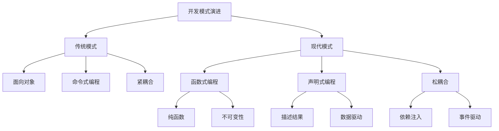

# 现代开发模式

## 设计模式演进

### 传统模式 vs 现代模式


### 模式对比
| 特性 | 传统模式 | 现代模式 |
|------|----------|----------|
| 编程范式 | 面向对象 | 函数式 + 面向对象 |
| 数据流 | 命令式 | 声明式 |
| 状态管理 | 可变状态 | 不可变状态 |
| 组件通信 | 直接调用 | 事件驱动 |
| 测试 | 集成测试 | 单元测试 + 集成测试 |

## 组件化开发

### 组件设计原则
```javascript
// 1. 单一职责原则
// 传统方式 - 混合职责
class UserManager {
    constructor() {
        this.users = [];
    }
    
    addUser(user) {
        this.users.push(user);
        this.saveToDatabase(user);
        this.sendWelcomeEmail(user);
        this.updateUI(user);
    }
    
    saveToDatabase(user) {
        // 数据库操作
    }
    
    sendWelcomeEmail(user) {
        // 邮件发送
    }
    
    updateUI(user) {
        // UI更新
    }
}

// 现代方式 - 职责分离
class UserService {
    constructor(apiClient) {
        this.apiClient = apiClient;
    }
    
    async createUser(userData) {
        return await this.apiClient.post('/users', userData);
    }
}

class EmailService {
    constructor(emailClient) {
        this.emailClient = emailClient;
    }
    
    async sendWelcomeEmail(user) {
        return await this.emailClient.send({
            to: user.email,
            subject: 'Welcome!',
            body: `Welcome ${user.name}!`
        });
    }
}

class UserComponent {
    constructor(userService, emailService) {
        this.userService = userService;
        this.emailService = emailService;
    }
    
    async handleUserCreation(userData) {
        try {
            const user = await this.userService.createUser(userData);
            await this.emailService.sendWelcomeEmail(user);
            this.renderUser(user);
        } catch (error) {
            this.showError(error.message);
        }
    }
    
    renderUser(user) {
        // UI渲染逻辑
    }
    
    showError(message) {
        // 错误显示逻辑
    }
}

// 2. 开闭原则
// 传统方式 - 修改现有代码
class PaymentProcessor {
    processPayment(amount, type) {
        if (type === 'credit') {
            return this.processCreditCard(amount);
        } else if (type === 'paypal') {
            return this.processPayPal(amount);
        }
        // 添加新支付方式需要修改这里
    }
}

// 现代方式 - 对扩展开放，对修改关闭
class PaymentProcessor {
    constructor() {
        this.strategies = new Map();
    }
    
    registerStrategy(type, strategy) {
        this.strategies.set(type, strategy);
    }
    
    processPayment(amount, type) {
        const strategy = this.strategies.get(type);
        if (!strategy) {
            throw new Error(`Unsupported payment type: ${type}`);
        }
        return strategy.process(amount);
    }
}

// 支付策略接口
class PaymentStrategy {
    process(amount) {
        throw new Error('process method must be implemented');
    }
}

class CreditCardStrategy extends PaymentStrategy {
    process(amount) {
        // 信用卡处理逻辑
        return { success: true, transactionId: 'cc_123' };
    }
}

class PayPalStrategy extends PaymentStrategy {
    process(amount) {
        // PayPal处理逻辑
        return { success: true, transactionId: 'pp_456' };
    }
}

// 使用
const processor = new PaymentProcessor();
processor.registerStrategy('credit', new CreditCardStrategy());
processor.registerStrategy('paypal', new PayPalStrategy());
```

### 组件通信模式
```javascript
// 1. 事件驱动通信
class EventBus {
    constructor() {
        this.events = new Map();
    }
    
    on(event, callback) {
        if (!this.events.has(event)) {
            this.events.set(event, []);
        }
        this.events.get(event).push(callback);
    }
    
    off(event, callback) {
        if (!this.events.has(event)) return;
        
        const callbacks = this.events.get(event);
        const index = callbacks.indexOf(callback);
        if (index > -1) {
            callbacks.splice(index, 1);
        }
    }
    
    emit(event, data) {
        if (!this.events.has(event)) return;
        
        this.events.get(event).forEach(callback => {
            try {
                callback(data);
            } catch (error) {
                console.error(`Error in event handler for ${event}:`, error);
            }
        });
    }
}

// 组件间通信
class UserListComponent {
    constructor(eventBus) {
        this.eventBus = eventBus;
        this.users = [];
        this.setupEventListeners();
    }
    
    setupEventListeners() {
        this.eventBus.on('user:created', this.handleUserCreated.bind(this));
        this.eventBus.on('user:updated', this.handleUserUpdated.bind(this));
        this.eventBus.on('user:deleted', this.handleUserDeleted.bind(this));
    }
    
    handleUserCreated(user) {
        this.users.push(user);
        this.render();
    }
    
    handleUserUpdated(updatedUser) {
        const index = this.users.findIndex(u => u.id === updatedUser.id);
        if (index > -1) {
            this.users[index] = updatedUser;
            this.render();
        }
    }
    
    handleUserDeleted(userId) {
        this.users = this.users.filter(u => u.id !== userId);
        this.render();
    }
    
    render() {
        // 渲染用户列表
    }
}

class UserFormComponent {
    constructor(eventBus, userService) {
        this.eventBus = eventBus;
        this.userService = userService;
        this.setupEventListeners();
    }
    
    setupEventListeners() {
        document.getElementById('user-form').addEventListener('submit', this.handleSubmit.bind(this));
    }
    
    async handleSubmit(event) {
        event.preventDefault();
        
        const formData = new FormData(event.target);
        const userData = Object.fromEntries(formData);
        
        try {
            const user = await this.userService.createUser(userData);
            this.eventBus.emit('user:created', user);
            event.target.reset();
        } catch (error) {
            this.showError(error.message);
        }
    }
    
    showError(message) {
        // 显示错误信息
    }
}

// 2. 状态管理通信
class StateManager {
    constructor(initialState = {}) {
        this.state = { ...initialState };
        this.subscribers = new Map();
    }
    
    getState() {
        return { ...this.state };
    }
    
    setState(updates) {
        const oldState = { ...this.state };
        this.state = { ...this.state, ...updates };
        
        // 通知订阅者
        Object.keys(updates).forEach(key => {
            if (this.subscribers.has(key)) {
                this.subscribers.get(key).forEach(callback => {
                    callback(this.state[key], oldState[key]);
                });
            }
        });
    }
    
    subscribe(key, callback) {
        if (!this.subscribers.has(key)) {
            this.subscribers.set(key, []);
        }
        this.subscribers.get(key).push(callback);
        
        // 返回取消订阅函数
        return () => {
            const callbacks = this.subscribers.get(key);
            const index = callbacks.indexOf(callback);
            if (index > -1) {
                callbacks.splice(index, 1);
            }
        };
    }
}

// 使用状态管理
const stateManager = new StateManager({
    users: [],
    loading: false,
    error: null
});

class UserListComponent {
    constructor(stateManager) {
        this.stateManager = stateManager;
        this.setupSubscriptions();
    }
    
    setupSubscriptions() {
        this.stateManager.subscribe('users', (users) => {
            this.renderUsers(users);
        });
        
        this.stateManager.subscribe('loading', (loading) => {
            this.toggleLoading(loading);
        });
        
        this.stateManager.subscribe('error', (error) => {
            this.showError(error);
        });
    }
    
    renderUsers(users) {
        // 渲染用户列表
    }
    
    toggleLoading(loading) {
        // 显示/隐藏加载状态
    }
    
    showError(error) {
        // 显示错误信息
    }
}
```

## 函数式编程模式

### 函数组合模式
```javascript
// 1. 管道模式
class Pipeline {
    constructor() {
        this.steps = [];
    }
    
    add(step) {
        this.steps.push(step);
        return this;
    }
    
    execute(input) {
        return this.steps.reduce((result, step) => {
            try {
                return step(result);
            } catch (error) {
                console.error('Pipeline step error:', error);
                throw error;
            }
        }, input);
    }
    
    async executeAsync(input) {
        let result = input;
        
        for (const step of this.steps) {
            try {
                result = await step(result);
            } catch (error) {
                console.error('Async pipeline step error:', error);
                throw error;
            }
        }
        
        return result;
    }
}

// 使用管道模式
const dataProcessingPipeline = new Pipeline()
    .add(data => data.filter(item => item.active))
    .add(data => data.map(item => ({ ...item, processed: true })))
    .add(data => data.sort((a, b) => a.name.localeCompare(b.name)))
    .add(data => data.slice(0, 10));

const processedData = dataProcessingPipeline.execute(rawData);

// 2. 中间件模式
class MiddlewareManager {
    constructor() {
        this.middlewares = [];
    }
    
    use(middleware) {
        this.middlewares.push(middleware);
        return this;
    }
    
    async execute(context, next) {
        let index = 0;
        
        const dispatch = async (i) => {
            if (i <= index) {
                throw new Error('next() called multiple times');
            }
            
            index = i;
            const middleware = this.middlewares[i];
            
            if (!middleware) {
                return next ? await next() : undefined;
            }
            
            return await middleware(context, () => dispatch(i + 1));
        };
        
        return await dispatch(0);
    }
}

// 使用中间件模式
const requestHandler = new MiddlewareManager();

// 添加中间件
requestHandler
    .use(async (context, next) => {
        console.log('Request started:', context.url);
        const start = Date.now();
        
        await next();
        
        const duration = Date.now() - start;
        console.log(`Request completed in ${duration}ms`);
    })
    .use(async (context, next) => {
        // 身份验证
        if (!context.headers.authorization) {
            throw new Error('Unauthorized');
        }
        await next();
    })
    .use(async (context, next) => {
        // 请求处理
        context.response = { data: 'Hello World' };
        await next();
    });

// 执行请求
requestHandler.execute(
    { url: '/api/users', headers: { authorization: 'Bearer token' } },
    async () => {
        console.log('Final handler executed');
    }
);
```

### 不可变数据模式
```javascript
// 1. 不可变更新模式
class ImmutableUpdater {
    static updateObject(obj, updates) {
        return { ...obj, ...updates };
    }
    
    static updateArray(arr, index, updates) {
        return arr.map((item, i) => 
            i === index ? { ...item, ...updates } : item
        );
    }
    
    static addToArray(arr, item) {
        return [...arr, item];
    }
    
    static removeFromArray(arr, predicate) {
        return arr.filter(predicate);
    }
    
    static updateNestedObject(obj, path, value) {
        if (path.length === 0) return value;
        
        const [key, ...rest] = path;
        
        if (path.length === 1) {
            return { ...obj, [key]: value };
        }
        
        return {
            ...obj,
            [key]: this.updateNestedObject(obj[key] || {}, rest, value)
        };
    }
}

// 使用不可变更新
const initialState = {
    users: [
        { id: 1, name: 'John', age: 30 },
        { id: 2, name: 'Jane', age: 25 }
    ],
    filters: {
        age: { min: 18, max: 65 },
        name: ''
    }
};

// 更新用户
const updatedState = ImmutableUpdater.updateArray(
    initialState.users,
    0,
    { age: 31 }
);

// 添加新用户
const stateWithNewUser = ImmutableUpdater.addToArray(
    initialState.users,
    { id: 3, name: 'Bob', age: 35 }
);

// 更新嵌套对象
const stateWithUpdatedFilters = ImmutableUpdater.updateNestedObject(
    initialState,
    ['filters', 'age', 'min'],
    21
);

// 2. 状态机模式
class StateMachine {
    constructor(initialState, transitions) {
        this.state = initialState;
        this.transitions = transitions;
        this.listeners = [];
    }
    
    transition(event) {
        const currentState = this.state;
        const transition = this.transitions[currentState]?.[event];
        
        if (!transition) {
            throw new Error(`Invalid transition: ${currentState} -> ${event}`);
        }
        
        const newState = typeof transition === 'string' ? transition : transition.to;
        const action = typeof transition === 'object' ? transition.action : null;
        
        this.state = newState;
        
        // 执行转换动作
        if (action) {
            action(currentState, newState, event);
        }
        
        // 通知监听器
        this.notifyListeners(currentState, newState, event);
    }
    
    addListener(callback) {
        this.listeners.push(callback);
        return () => {
            const index = this.listeners.indexOf(callback);
            if (index > -1) {
                this.listeners.splice(index, 1);
            }
        };
    }
    
    notifyListeners(fromState, toState, event) {
        this.listeners.forEach(callback => {
            try {
                callback(fromState, toState, event);
            } catch (error) {
                console.error('State machine listener error:', error);
            }
        });
    }
    
    getState() {
        return this.state;
    }
}

// 使用状态机
const userStateMachine = new StateMachine('idle', {
    idle: {
        'load': 'loading',
        'error': 'error'
    },
    loading: {
        'success': 'loaded',
        'error': 'error'
    },
    loaded: {
        'refresh': 'loading',
        'error': 'error'
    },
    error: {
        'retry': 'loading',
        'reset': 'idle'
    }
});

// 监听状态变化
userStateMachine.addListener((fromState, toState, event) => {
    console.log(`State changed: ${fromState} -> ${toState} (event: ${event})`);
});

// 执行状态转换
userStateMachine.transition('load');
userStateMachine.transition('success');
userStateMachine.transition('refresh');
```

## 异步编程模式

### Promise模式
```javascript
// 1. Promise链模式
class PromiseChain {
    constructor() {
        this.chain = [];
    }
    
    then(handler) {
        this.chain.push({ type: 'then', handler });
        return this;
    }
    
    catch(handler) {
        this.chain.push({ type: 'catch', handler });
        return this;
    }
    
    finally(handler) {
        this.chain.push({ type: 'finally', handler });
        return this;
    }
    
    async execute(initialValue) {
        let result = initialValue;
        let error = null;
        
        for (const step of this.chain) {
            try {
                if (error && step.type !== 'catch') {
                    continue;
                }
                
                if (!error && step.type === 'catch') {
                    continue;
                }
                
                if (step.type === 'then' && !error) {
                    result = await step.handler(result);
                } else if (step.type === 'catch' && error) {
                    result = await step.handler(error);
                    error = null;
                } else if (step.type === 'finally') {
                    await step.handler();
                }
            } catch (err) {
                error = err;
            }
        }
        
        if (error) {
            throw error;
        }
        
        return result;
    }
}

// 使用Promise链
const dataProcessingChain = new PromiseChain()
    .then(data => fetch(`/api/process/${data.id}`))
    .then(response => response.json())
    .then(data => data.results)
    .catch(error => {
        console.error('Processing error:', error);
        return { results: [] };
    })
    .finally(() => {
        console.log('Processing completed');
    });

// 2. 并发控制模式
class ConcurrencyController {
    constructor(maxConcurrency = 5) {
        this.maxConcurrency = maxConcurrency;
        this.running = 0;
        this.queue = [];
    }
    
    async execute(task) {
        return new Promise((resolve, reject) => {
            this.queue.push({ task, resolve, reject });
            this.process();
        });
    }
    
    async process() {
        if (this.running >= this.maxConcurrency || this.queue.length === 0) {
            return;
        }
        
        this.running++;
        const { task, resolve, reject } = this.queue.shift();
        
        try {
            const result = await task();
            resolve(result);
        } catch (error) {
            reject(error);
        } finally {
            this.running--;
            this.process();
        }
    }
    
    async executeAll(tasks) {
        const promises = tasks.map(task => this.execute(task));
        return Promise.all(promises);
    }
}

// 使用并发控制
const controller = new ConcurrencyController(3);

const tasks = Array.from({ length: 10 }, (_, i) => 
    () => fetch(`/api/data/${i}`).then(r => r.json())
);

const results = await controller.executeAll(tasks);
```

### 响应式模式
```javascript
// 1. 响应式数据流
class ReactiveStream {
    constructor() {
        this.subscribers = [];
        this.value = null;
        this.error = null;
        this.completed = false;
    }
    
    subscribe(callback) {
        if (this.completed) {
            if (this.error) {
                callback(null, this.error);
            } else {
                callback(this.value);
            }
            return () => {};
        }
        
        this.subscribers.push(callback);
        
        if (this.value !== null) {
            callback(this.value);
        }
        
        return () => {
            const index = this.subscribers.indexOf(callback);
            if (index > -1) {
                this.subscribers.splice(index, 1);
            }
        };
    }
    
    next(value) {
        if (this.completed) return;
        
        this.value = value;
        this.subscribers.forEach(callback => callback(value));
    }
    
    error(err) {
        if (this.completed) return;
        
        this.error = err;
        this.completed = true;
        this.subscribers.forEach(callback => callback(null, err));
    }
    
    complete() {
        if (this.completed) return;
        
        this.completed = true;
        this.subscribers.forEach(callback => callback(this.value));
    }
    
    map(transform) {
        const newStream = new ReactiveStream();
        
        this.subscribe((value, error) => {
            if (error) {
                newStream.error(error);
            } else {
                try {
                    const transformedValue = transform(value);
                    newStream.next(transformedValue);
                } catch (err) {
                    newStream.error(err);
                }
            }
        });
        
        return newStream;
    }
    
    filter(predicate) {
        const newStream = new ReactiveStream();
        
        this.subscribe((value, error) => {
            if (error) {
                newStream.error(error);
            } else if (predicate(value)) {
                newStream.next(value);
            }
        });
        
        return newStream;
    }
}

// 使用响应式流
const dataStream = new ReactiveStream();

const processedStream = dataStream
    .filter(data => data.status === 'active')
    .map(data => ({ ...data, processed: true }));

processedStream.subscribe((data, error) => {
    if (error) {
        console.error('Stream error:', error);
    } else {
        console.log('Processed data:', data);
    }
});

// 发送数据
dataStream.next({ id: 1, status: 'active', name: 'John' });
dataStream.next({ id: 2, status: 'inactive', name: 'Jane' });
dataStream.next({ id: 3, status: 'active', name: 'Bob' });
```

## 实际应用示例

### 现代应用架构
```javascript
// 1. 应用架构
class ModernApp {
    constructor() {
        this.services = new Map();
        this.components = new Map();
        this.eventBus = new EventBus();
        this.stateManager = new StateManager();
        this.router = new Router();
    }
    
    registerService(name, service) {
        this.services.set(name, service);
        return this;
    }
    
    registerComponent(name, component) {
        this.components.set(name, component);
        return this;
    }
    
    getService(name) {
        return this.services.get(name);
    }
    
    getComponent(name) {
        return this.components.get(name);
    }
    
    async start() {
        // 初始化服务
        for (const [name, service] of this.services) {
            if (service.initialize) {
                await service.initialize();
            }
        }
        
        // 初始化组件
        for (const [name, component] of this.components) {
            if (component.initialize) {
                await component.initialize();
            }
        }
        
        // 启动路由
        this.router.start();
        
        console.log('Application started');
    }
}

// 2. 服务定义
class ApiService {
    constructor(baseUrl) {
        this.baseUrl = baseUrl;
        this.cache = new Map();
    }
    
    async get(endpoint) {
        const url = `${this.baseUrl}${endpoint}`;
        
        if (this.cache.has(url)) {
            return this.cache.get(url);
        }
        
        const response = await fetch(url);
        const data = await response.json();
        
        this.cache.set(url, data);
        return data;
    }
    
    async post(endpoint, data) {
        const response = await fetch(`${this.baseUrl}${endpoint}`, {
            method: 'POST',
            headers: { 'Content-Type': 'application/json' },
            body: JSON.stringify(data)
        });
        
        return response.json();
    }
}

class UserService {
    constructor(apiService) {
        this.apiService = apiService;
    }
    
    async getUsers() {
        return this.apiService.get('/users');
    }
    
    async createUser(userData) {
        return this.apiService.post('/users', userData);
    }
}

// 3. 组件定义
class UserListComponent {
    constructor(userService, stateManager, eventBus) {
        this.userService = userService;
        this.stateManager = stateManager;
        this.eventBus = eventBus;
        this.container = document.getElementById('user-list');
    }
    
    async initialize() {
        this.setupEventListeners();
        await this.loadUsers();
    }
    
    setupEventListeners() {
        this.eventBus.on('user:created', this.handleUserCreated.bind(this));
        this.eventBus.on('user:updated', this.handleUserUpdated.bind(this));
    }
    
    async loadUsers() {
        try {
            this.stateManager.setState({ loading: true });
            const users = await this.userService.getUsers();
            this.stateManager.setState({ users, loading: false });
            this.render();
        } catch (error) {
            this.stateManager.setState({ error: error.message, loading: false });
        }
    }
    
    handleUserCreated(user) {
        const users = this.stateManager.getState('users');
        this.stateManager.setState({ users: [...users, user] });
        this.render();
    }
    
    handleUserUpdated(updatedUser) {
        const users = this.stateManager.getState('users');
        const updatedUsers = users.map(u => 
            u.id === updatedUser.id ? updatedUser : u
        );
        this.stateManager.setState({ users: updatedUsers });
        this.render();
    }
    
    render() {
        const { users, loading, error } = this.stateManager.getState();
        
        if (loading) {
            this.container.innerHTML = '<div>Loading...</div>';
            return;
        }
        
        if (error) {
            this.container.innerHTML = `<div class="error">${error}</div>`;
            return;
        }
        
        this.container.innerHTML = users.map(user => `
            <div class="user-card" data-user-id="${user.id}">
                <h3>${user.name}</h3>
                <p>${user.email}</p>
                <button onclick="editUser(${user.id})">Edit</button>
            </div>
        `).join('');
    }
}

// 4. 应用启动
const app = new ModernApp();

// 注册服务
app.registerService('api', new ApiService('https://api.example.com'))
   .registerService('user', new UserService(app.getService('api')));

// 注册组件
app.registerComponent('userList', new UserListComponent(
    app.getService('user'),
    app.stateManager,
    app.eventBus
));

// 启动应用
app.start();
```

## 相关链接
- [[03-应用实践层/02-现代开发/01-ES6+新特性]] - ES6+新特性
- [[03-应用实践层/02-现代开发/02-TypeScript基础]] - TypeScript基础
- [[03-应用实践层/02-现代开发/03-函数式编程概念]] - 函数式编程概念
- [[03-应用实践层/02-现代开发/04-响应式编程]] - 响应式编程
