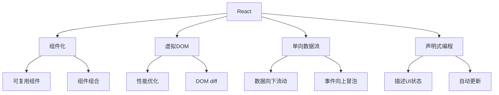

# React核心概念

## React基础

### React概述


### React核心特性
| 特性 | 描述 | 优势 |
|------|------|------|
| 组件化 | 将UI拆分为独立组件 | 可复用、可维护 |
| 虚拟DOM | 内存中的DOM表示 | 高效更新 |
| 单向数据流 | 数据从父组件流向子组件 | 可预测 |
| 声明式 | 描述UI应该是什么样子 | 简洁、易理解 |

## 组件基础

### 函数组件
```jsx
// 1. 基本函数组件
function Welcome(props) {
    return <h1>Hello, {props.name}!</h1>;
}

// 2. 箭头函数组件
const Welcome = (props) => {
    return <h1>Hello, {props.name}!</h1>;
};

// 3. 解构props
const Welcome = ({ name, age }) => {
    return (
        <div>
            <h1>Hello, {name}!</h1>
            <p>You are {age} years old.</p>
        </div>
    );
};

// 4. 默认props
const Welcome = ({ name = 'Guest', age = 0 }) => {
    return (
        <div>
            <h1>Hello, {name}!</h1>
            <p>You are {age} years old.</p>
        </div>
    );
};

// 5. 使用组件
function App() {
    return (
        <div>
            <Welcome name="John" age={30} />
            <Welcome name="Jane" age={25} />
            <Welcome /> {/* 使用默认值 */}
        </div>
    );
}
```

### 类组件
```jsx
// 1. 基本类组件
class Welcome extends React.Component {
    render() {
        return <h1>Hello, {this.props.name}!</h1>;
    }
}

// 2. 带状态的类组件
class Counter extends React.Component {
    constructor(props) {
        super(props);
        this.state = {
            count: 0
        };
    }
    
    increment = () => {
        this.setState({ count: this.state.count + 1 });
    }
    
    decrement = () => {
        this.setState({ count: this.state.count - 1 });
    }
    
    render() {
        return (
            <div>
                <h2>Count: {this.state.count}</h2>
                <button onClick={this.increment}>+</button>
                <button onClick={this.decrement}>-</button>
            </div>
        );
    }
}

// 3. 生命周期方法
class UserProfile extends React.Component {
    constructor(props) {
        super(props);
        this.state = {
            user: null,
            loading: true
        };
    }
    
    componentDidMount() {
        this.fetchUser();
    }
    
    componentDidUpdate(prevProps) {
        if (prevProps.userId !== this.props.userId) {
            this.fetchUser();
        }
    }
    
    componentWillUnmount() {
        // 清理工作
        this.cancelRequest();
    }
    
    fetchUser = async () => {
        try {
            this.setState({ loading: true });
            const response = await fetch(`/api/users/${this.props.userId}`);
            const user = await response.json();
            this.setState({ user, loading: false });
        } catch (error) {
            this.setState({ loading: false });
            console.error('Error fetching user:', error);
        }
    }
    
    render() {
        const { user, loading } = this.state;
        
        if (loading) {
            return <div>Loading...</div>;
        }
        
        if (!user) {
            return <div>User not found</div>;
        }
        
        return (
            <div>
                <h2>{user.name}</h2>
                <p>{user.email}</p>
                <p>Age: {user.age}</p>
            </div>
        );
    }
}
```

## Hooks

### 基础Hooks
```jsx
// 1. useState Hook
import React, { useState } from 'react';

function Counter() {
    const [count, setCount] = useState(0);
    const [name, setName] = useState('');
    
    return (
        <div>
            <h2>Count: {count}</h2>
            <button onClick={() => setCount(count + 1)}>+</button>
            <button onClick={() => setCount(count - 1)}>-</button>
            
            <input 
                value={name}
                onChange={(e) => setName(e.target.value)}
                placeholder="Enter your name"
            />
            <p>Hello, {name}!</p>
        </div>
    );
}

// 2. useEffect Hook
import React, { useState, useEffect } from 'react';

function UserList() {
    const [users, setUsers] = useState([]);
    const [loading, setLoading] = useState(true);
    const [error, setError] = useState(null);
    
    useEffect(() => {
        fetchUsers();
    }, []); // 空依赖数组，只在组件挂载时执行
    
    const fetchUsers = async () => {
        try {
            setLoading(true);
            const response = await fetch('/api/users');
            const data = await response.json();
            setUsers(data);
        } catch (err) {
            setError(err.message);
        } finally {
            setLoading(false);
        }
    };
    
    if (loading) return <div>Loading...</div>;
    if (error) return <div>Error: {error}</div>;
    
    return (
        <ul>
            {users.map(user => (
                <li key={user.id}>{user.name}</li>
            ))}
        </ul>
    );
}

// 3. useContext Hook
import React, { createContext, useContext, useState } from 'react';

const ThemeContext = createContext();

function ThemeProvider({ children }) {
    const [theme, setTheme] = useState('light');
    
    const toggleTheme = () => {
        setTheme(theme === 'light' ? 'dark' : 'light');
    };
    
    return (
        <ThemeContext.Provider value={{ theme, toggleTheme }}>
            {children}
        </ThemeContext.Provider>
    );
}

function ThemedButton() {
    const { theme, toggleTheme } = useContext(ThemeContext);
    
    return (
        <button 
            onClick={toggleTheme}
            style={{
                backgroundColor: theme === 'light' ? '#fff' : '#333',
                color: theme === 'light' ? '#333' : '#fff'
            }}
        >
            Toggle Theme
        </button>
    );
}

function App() {
    return (
        <ThemeProvider>
            <ThemedButton />
        </ThemeProvider>
    );
}
```

### 高级Hooks
```jsx
// 1. useReducer Hook
import React, { useReducer } from 'react';

const initialState = { count: 0 };

function reducer(state, action) {
    switch (action.type) {
        case 'increment':
            return { count: state.count + 1 };
        case 'decrement':
            return { count: state.count - 1 };
        case 'reset':
            return { count: 0 };
        default:
            throw new Error();
    }
}

function Counter() {
    const [state, dispatch] = useReducer(reducer, initialState);
    
    return (
        <div>
            <h2>Count: {state.count}</h2>
            <button onClick={() => dispatch({ type: 'increment' })}>+</button>
            <button onClick={() => dispatch({ type: 'decrement' })}>-</button>
            <button onClick={() => dispatch({ type: 'reset' })}>Reset</button>
        </div>
    );
}

// 2. useMemo Hook
import React, { useState, useMemo } from 'react';

function ExpensiveComponent({ items, filter }) {
    const filteredItems = useMemo(() => {
        console.log('Filtering items...');
        return items.filter(item => item.category === filter);
    }, [items, filter]);
    
    return (
        <ul>
            {filteredItems.map(item => (
                <li key={item.id}>{item.name}</li>
            ))}
        </ul>
    );
}

// 3. useCallback Hook
import React, { useState, useCallback } from 'react';

function ParentComponent() {
    const [count, setCount] = useState(0);
    const [name, setName] = useState('');
    
    const handleClick = useCallback(() => {
        console.log('Button clicked');
    }, []);
    
    return (
        <div>
            <input 
                value={name}
                onChange={(e) => setName(e.target.value)}
            />
            <ChildComponent onClick={handleClick} />
        </div>
    );
}

function ChildComponent({ onClick }) {
    console.log('ChildComponent rendered');
    return <button onClick={onClick}>Click me</button>;
}

// 4. 自定义Hook
import { useState, useEffect } from 'react';

function useApi(url) {
    const [data, setData] = useState(null);
    const [loading, setLoading] = useState(true);
    const [error, setError] = useState(null);
    
    useEffect(() => {
        const fetchData = async () => {
            try {
                setLoading(true);
                const response = await fetch(url);
                const result = await response.json();
                setData(result);
            } catch (err) {
                setError(err.message);
            } finally {
                setLoading(false);
            }
        };
        
        fetchData();
    }, [url]);
    
    return { data, loading, error };
}

function UserProfile({ userId }) {
    const { data: user, loading, error } = useApi(`/api/users/${userId}`);
    
    if (loading) return <div>Loading...</div>;
    if (error) return <div>Error: {error}</div>;
    if (!user) return <div>User not found</div>;
    
    return (
        <div>
            <h2>{user.name}</h2>
            <p>{user.email}</p>
        </div>
    );
}
```

## 状态管理

### 本地状态管理
```jsx
// 1. 组件内部状态
function TodoApp() {
    const [todos, setTodos] = useState([]);
    const [inputValue, setInputValue] = useState('');
    
    const addTodo = () => {
        if (inputValue.trim()) {
            setTodos([...todos, {
                id: Date.now(),
                text: inputValue,
                completed: false
            }]);
            setInputValue('');
        }
    };
    
    const toggleTodo = (id) => {
        setTodos(todos.map(todo =>
            todo.id === id ? { ...todo, completed: !todo.completed } : todo
        ));
    };
    
    const deleteTodo = (id) => {
        setTodos(todos.filter(todo => todo.id !== id));
    };
    
    return (
        <div>
            <input
                value={inputValue}
                onChange={(e) => setInputValue(e.target.value)}
                placeholder="Add a todo"
            />
            <button onClick={addTodo}>Add</button>
            
            <ul>
                {todos.map(todo => (
                    <li key={todo.id}>
                        <input
                            type="checkbox"
                            checked={todo.completed}
                            onChange={() => toggleTodo(todo.id)}
                        />
                        <span style={{
                            textDecoration: todo.completed ? 'line-through' : 'none'
                        }}>
                            {todo.text}
                        </span>
                        <button onClick={() => deleteTodo(todo.id)}>Delete</button>
                    </li>
                ))}
            </ul>
        </div>
    );
}

// 2. 状态提升
function TodoItem({ todo, onToggle, onDelete }) {
    return (
        <li>
            <input
                type="checkbox"
                checked={todo.completed}
                onChange={() => onToggle(todo.id)}
            />
            <span style={{
                textDecoration: todo.completed ? 'line-through' : 'none'
            }}>
                {todo.text}
            </span>
            <button onClick={() => onDelete(todo.id)}>Delete</button>
        </li>
    );
}

function TodoList({ todos, onToggle, onDelete }) {
    return (
        <ul>
            {todos.map(todo => (
                <TodoItem
                    key={todo.id}
                    todo={todo}
                    onToggle={onToggle}
                    onDelete={onDelete}
                />
            ))}
        </ul>
    );
}

function TodoApp() {
    const [todos, setTodos] = useState([]);
    const [inputValue, setInputValue] = useState('');
    
    const addTodo = () => {
        if (inputValue.trim()) {
            setTodos([...todos, {
                id: Date.now(),
                text: inputValue,
                completed: false
            }]);
            setInputValue('');
        }
    };
    
    const toggleTodo = (id) => {
        setTodos(todos.map(todo =>
            todo.id === id ? { ...todo, completed: !todo.completed } : todo
        ));
    };
    
    const deleteTodo = (id) => {
        setTodos(todos.filter(todo => todo.id !== id));
    };
    
    return (
        <div>
            <input
                value={inputValue}
                onChange={(e) => setInputValue(e.target.value)}
                placeholder="Add a todo"
            />
            <button onClick={addTodo}>Add</button>
            
            <TodoList
                todos={todos}
                onToggle={toggleTodo}
                onDelete={deleteTodo}
            />
        </div>
    );
}
```

### 全局状态管理
```jsx
// 1. Context API
import React, { createContext, useContext, useReducer } from 'react';

const AppContext = createContext();

const initialState = {
    user: null,
    theme: 'light',
    todos: []
};

function appReducer(state, action) {
    switch (action.type) {
        case 'SET_USER':
            return { ...state, user: action.payload };
        case 'SET_THEME':
            return { ...state, theme: action.payload };
        case 'ADD_TODO':
            return { ...state, todos: [...state.todos, action.payload] };
        case 'TOGGLE_TODO':
            return {
                ...state,
                todos: state.todos.map(todo =>
                    todo.id === action.payload
                        ? { ...todo, completed: !todo.completed }
                        : todo
                )
            };
        default:
            return state;
    }
}

function AppProvider({ children }) {
    const [state, dispatch] = useReducer(appReducer, initialState);
    
    return (
        <AppContext.Provider value={{ state, dispatch }}>
            {children}
        </AppContext.Provider>
    );
}

function useApp() {
    const context = useContext(AppContext);
    if (!context) {
        throw new Error('useApp must be used within AppProvider');
    }
    return context;
}

// 使用Context
function UserProfile() {
    const { state, dispatch } = useApp();
    
    const handleLogin = () => {
        dispatch({
            type: 'SET_USER',
            payload: { id: 1, name: 'John', email: 'john@example.com' }
        });
    };
    
    return (
        <div>
            {state.user ? (
                <div>
                    <h2>Welcome, {state.user.name}!</h2>
                    <p>{state.user.email}</p>
                </div>
            ) : (
                <button onClick={handleLogin}>Login</button>
            )}
        </div>
    );
}

function ThemeToggle() {
    const { state, dispatch } = useApp();
    
    const toggleTheme = () => {
        dispatch({
            type: 'SET_THEME',
            payload: state.theme === 'light' ? 'dark' : 'light'
        });
    };
    
    return (
        <button onClick={toggleTheme}>
            Switch to {state.theme === 'light' ? 'dark' : 'light'} theme
        </button>
    );
}

function App() {
    return (
        <AppProvider>
            <UserProfile />
            <ThemeToggle />
        </AppProvider>
    );
}
```

## 事件处理

### 事件处理基础
```jsx
// 1. 基本事件处理
function Button() {
    const handleClick = () => {
        console.log('Button clicked!');
    };
    
    return <button onClick={handleClick}>Click me</button>;
}

// 2. 带参数的事件处理
function TodoItem({ todo, onToggle, onDelete }) {
    const handleToggle = () => {
        onToggle(todo.id);
    };
    
    const handleDelete = () => {
        onDelete(todo.id);
    };
    
    return (
        <li>
            <input
                type="checkbox"
                checked={todo.completed}
                onChange={handleToggle}
            />
            <span>{todo.text}</span>
            <button onClick={handleDelete}>Delete</button>
        </li>
    );
}

// 3. 表单事件处理
function ContactForm() {
    const [formData, setFormData] = useState({
        name: '',
        email: '',
        message: ''
    });
    
    const handleChange = (e) => {
        const { name, value } = e.target;
        setFormData(prev => ({
            ...prev,
            [name]: value
        }));
    };
    
    const handleSubmit = (e) => {
        e.preventDefault();
        console.log('Form submitted:', formData);
        // 处理表单提交
    };
    
    return (
        <form onSubmit={handleSubmit}>
            <input
                type="text"
                name="name"
                value={formData.name}
                onChange={handleChange}
                placeholder="Your name"
            />
            <input
                type="email"
                name="email"
                value={formData.email}
                onChange={handleChange}
                placeholder="Your email"
            />
            <textarea
                name="message"
                value={formData.message}
                onChange={handleChange}
                placeholder="Your message"
            />
            <button type="submit">Send</button>
        </form>
    );
}

// 4. 事件对象处理
function InputWithValidation() {
    const [value, setValue] = useState('');
    const [error, setError] = useState('');
    
    const handleChange = (e) => {
        const newValue = e.target.value;
        setValue(newValue);
        
        if (newValue.length < 3) {
            setError('Value must be at least 3 characters');
        } else {
            setError('');
        }
    };
    
    const handleKeyPress = (e) => {
        if (e.key === 'Enter') {
            console.log('Enter pressed, value:', value);
        }
    };
    
    return (
        <div>
            <input
                value={value}
                onChange={handleChange}
                onKeyPress={handleKeyPress}
                placeholder="Type something"
            />
            {error && <p style={{ color: 'red' }}>{error}</p>}
        </div>
    );
}
```

### 高级事件处理
```jsx
// 1. 事件委托
function TodoList({ todos, onToggle, onDelete }) {
    const handleListClick = (e) => {
        const target = e.target;
        
        if (target.type === 'checkbox') {
            const todoId = parseInt(target.dataset.todoId);
            onToggle(todoId);
        } else if (target.classList.contains('delete-btn')) {
            const todoId = parseInt(target.dataset.todoId);
            onDelete(todoId);
        }
    };
    
    return (
        <ul onClick={handleListClick}>
            {todos.map(todo => (
                <li key={todo.id}>
                    <input
                        type="checkbox"
                        data-todo-id={todo.id}
                        checked={todo.completed}
                    />
                    <span>{todo.text}</span>
                    <button 
                        className="delete-btn"
                        data-todo-id={todo.id}
                    >
                        Delete
                    </button>
                </li>
            ))}
        </ul>
    );
}

// 2. 自定义事件
function useCustomEvent(eventName, handler) {
    useEffect(() => {
        const handleEvent = (event) => {
            handler(event.detail);
        };
        
        window.addEventListener(eventName, handleEvent);
        
        return () => {
            window.removeEventListener(eventName, handleEvent);
        };
    }, [eventName, handler]);
}

function EventEmitter() {
    const emitEvent = (data) => {
        const event = new CustomEvent('customEvent', {
            detail: data
        });
        window.dispatchEvent(event);
    };
    
    return (
        <button onClick={() => emitEvent({ message: 'Hello from custom event!' })}>
            Emit Event
        </button>
    );
}

function EventListener() {
    const [message, setMessage] = useState('');
    
    useCustomEvent('customEvent', (data) => {
        setMessage(data.message);
    });
    
    return <div>Received: {message}</div>;
}

// 3. 防抖和节流
function useDebounce(value, delay) {
    const [debouncedValue, setDebouncedValue] = useState(value);
    
    useEffect(() => {
        const handler = setTimeout(() => {
            setDebouncedValue(value);
        }, delay);
        
        return () => {
            clearTimeout(handler);
        };
    }, [value, delay]);
    
    return debouncedValue;
}

function SearchInput() {
    const [query, setQuery] = useState('');
    const debouncedQuery = useDebounce(query, 500);
    const [results, setResults] = useState([]);
    
    useEffect(() => {
        if (debouncedQuery) {
            // 执行搜索
            searchAPI(debouncedQuery).then(setResults);
        }
    }, [debouncedQuery]);
    
    return (
        <div>
            <input
                value={query}
                onChange={(e) => setQuery(e.target.value)}
                placeholder="Search..."
            />
            <ul>
                {results.map(result => (
                    <li key={result.id}>{result.title}</li>
                ))}
            </ul>
        </div>
    );
}
```

## 相关链接
- [[03-应用实践层/03-框架生态/02-Vue.js基础]] - Vue.js基础
- [[03-应用实践层/03-框架生态/03-Angular框架]] - Angular框架
- [[03-应用实践层/03-框架生态/05-状态管理方案]] - 状态管理方案
- [[02-理解掌握层/03-异步编程/04-async-await语法]] - async/await语法
