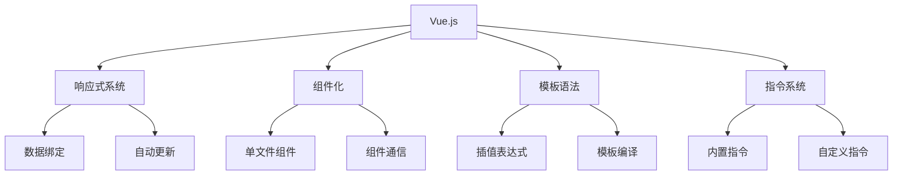

# Vue.js基础

## Vue.js概述

### Vue核心特性


### Vue vs React vs Angular
| 特性 | Vue | React | Angular |
|------|-----|-------|---------|
| 学习曲线 | 平缓 | 中等 | 陡峭 |
| 模板语法 | HTML模板 | JSX | HTML模板 |
| 状态管理 | Vuex/Pinia | Redux/Zustand | NgRx |
| 类型支持 | TypeScript | TypeScript | TypeScript |
| 包大小 | 小 | 中等 | 大 |

## 基础语法

### 模板语法
```vue
<template>
  <!-- 1. 插值表达式 -->
  <div>
    <h1>{{ title }}</h1>
    <p>Count: {{ count }}</p>
    <p>Message: {{ message }}</p>
  </div>

  <!-- 2. 属性绑定 -->
  <div>
    
    <button :disabled="isDisabled">Click me</button>
    <div :class="{ active: isActive, disabled: isDisabled }">
      Dynamic class
    </div>
  </div>

  <!-- 3. 事件绑定 -->
  <div>
    <button @click="increment">+</button>
    <button @click="decrement">-</button>
    <input @input="handleInput" v-model="inputValue" />
  </div>

  <!-- 4. 条件渲染 -->
  <div>
    <p v-if="isVisible">This is visible</p>
    <p v-else-if="isLoading">Loading...</p>
    <p v-else>This is hidden</p>
    
    <div v-show="isVisible">This can be toggled</div>
  </div>

  <!-- 5. 列表渲染 -->
  <div>
    <ul>
      <li v-for="item in items" :key="item.id">
        {{ item.name }} - {{ item.price }}
      </li>
    </ul>
    
    <ul>
      <li v-for="(item, index) in items" :key="item.id">
        {{ index }}: {{ item.name }}
      </li>
    </ul>
  </div>

  <!-- 6. 表单绑定 -->
  <div>
    <input v-model="form.name" placeholder="Name" />
    <input v-model="form.email" type="email" placeholder="Email" />
    <textarea v-model="form.message" placeholder="Message"></textarea>
    
    <select v-model="form.country">
      <option value="">Select country</option>
      <option value="us">United States</option>
      <option value="uk">United Kingdom</option>
    </select>
    
    <div>
      <input type="checkbox" v-model="form.newsletter" />
      <label>Subscribe to newsletter</label>
    </div>
  </div>
</template>

<script>
export default {
  data() {
    return {
      title: 'Vue.js App',
      count: 0,
      message: 'Hello Vue!',
      imageSrc: '/logo.png',
      imageAlt: 'Vue logo',
      isDisabled: false,
      isActive: true,
      isVisible: true,
      isLoading: false,
      inputValue: '',
      items: [
        { id: 1, name: 'Apple', price: 1.99 },
        { id: 2, name: 'Banana', price: 0.99 },
        { id: 3, name: 'Orange', price: 2.99 }
      ],
      form: {
        name: '',
        email: '',
        message: '',
        country: '',
        newsletter: false
      }
    }
  },
  methods: {
    increment() {
      this.count++
    },
    decrement() {
      this.count--
    },
    handleInput(event) {
      console.log('Input value:', event.target.value)
    }
  }
}
</script>
```

### 计算属性和侦听器
```vue
<template>
  <div>
    <h2>购物车</h2>
    <ul>
      <li v-for="item in cartItems" :key="item.id">
        {{ item.name }} - ${{ item.price }} x {{ item.quantity }}
        <button @click="removeItem(item.id)">Remove</button>
      </li>
    </ul>
    
    <div>
      <p>总数量: {{ totalQuantity }}</p>
      <p>总价格: ${{ totalPrice }}</p>
      <p>折扣: ${{ discount }}</p>
      <p>最终价格: ${{ finalPrice }}</p>
    </div>
    
    <div>
      <input v-model="searchQuery" placeholder="搜索商品" />
      <ul>
        <li v-for="item in filteredItems" :key="item.id">
          {{ item.name }} - ${{ item.price }}
        </li>
      </ul>
    </div>
  </div>
</template>

<script>
export default {
  data() {
    return {
      cartItems: [
        { id: 1, name: 'Apple', price: 1.99, quantity: 2 },
        { id: 2, name: 'Banana', price: 0.99, quantity: 3 },
        { id: 3, name: 'Orange', price: 2.99, quantity: 1 }
      ],
      searchQuery: '',
      allItems: [
        { id: 1, name: 'Apple', price: 1.99 },
        { id: 2, name: 'Banana', price: 0.99 },
        { id: 3, name: 'Orange', price: 2.99 },
        { id: 4, name: 'Grape', price: 3.99 },
        { id: 5, name: 'Strawberry', price: 4.99 }
      ]
    }
  },
  computed: {
    // 计算总数量
    totalQuantity() {
      return this.cartItems.reduce((total, item) => total + item.quantity, 0)
    },
    
    // 计算总价格
    totalPrice() {
      return this.cartItems.reduce((total, item) => {
        return total + (item.price * item.quantity)
      }, 0)
    },
    
    // 计算折扣
    discount() {
      if (this.totalPrice > 50) {
        return this.totalPrice * 0.1 // 10% 折扣
      }
      return 0
    },
    
    // 计算最终价格
    finalPrice() {
      return this.totalPrice - this.discount
    },
    
    // 过滤商品
    filteredItems() {
      if (!this.searchQuery) {
        return this.allItems
      }
      
      return this.allItems.filter(item =>
        item.name.toLowerCase().includes(this.searchQuery.toLowerCase())
      )
    }
  },
  watch: {
    // 监听搜索查询变化
    searchQuery(newQuery, oldQuery) {
      console.log(`Search query changed from "${oldQuery}" to "${newQuery}"`)
    },
    
    // 监听购物车变化
    cartItems: {
      handler(newItems, oldItems) {
        console.log('Cart items changed:', newItems)
        // 可以在这里保存到本地存储
        localStorage.setItem('cart', JSON.stringify(newItems))
      },
      deep: true // 深度监听
    },
    
    // 监听总价格变化
    totalPrice(newPrice, oldPrice) {
      if (newPrice > 100) {
        console.log('Congratulations! You qualify for free shipping!')
      }
    }
  },
  methods: {
    removeItem(itemId) {
      this.cartItems = this.cartItems.filter(item => item.id !== itemId)
    }
  }
}
</script>
```

## 组件系统

### 组件定义
```vue
<!-- 1. 单文件组件 -->
<!-- UserCard.vue -->
<template>
  <div class="user-card" :class="{ active: isActive }">
    
    <div class="user-info">
      <h3>{{ user.name }}</h3>
      <p>{{ user.email }}</p>
      <p>Age: {{ user.age }}</p>
    </div>
    <div class="actions">
      <button @click="editUser">Edit</button>
      <button @click="deleteUser">Delete</button>
    </div>
  </div>
</template>

<script>
export default {
  name: 'UserCard',
  props: {
    user: {
      type: Object,
      required: true,
      validator(value) {
        return value && typeof value.name === 'string'
      }
    },
    isActive: {
      type: Boolean,
      default: false
    }
  },
  emits: ['edit', 'delete'],
  methods: {
    editUser() {
      this.$emit('edit', this.user)
    },
    deleteUser() {
      this.$emit('delete', this.user.id)
    }
  }
}
</script>

<style scoped>
.user-card {
  border: 1px solid #ddd;
  border-radius: 8px;
  padding: 16px;
  margin: 8px;
  display: flex;
  align-items: center;
}

.user-card.active {
  border-color: #007bff;
  background-color: #f8f9fa;
}

.avatar {
  width: 50px;
  height: 50px;
  border-radius: 50%;
  margin-right: 16px;
}

.user-info {
  flex: 1;
}

.actions {
  display: flex;
  gap: 8px;
}

.actions button {
  padding: 4px 8px;
  border: 1px solid #ddd;
  border-radius: 4px;
  background: white;
  cursor: pointer;
}

.actions button:hover {
  background-color: #f8f9fa;
}
</style>

<!-- 2. 使用组件 -->
<!-- App.vue -->
<template>
  <div>
    <h1>用户列表</h1>
    <div class="user-list">
      <UserCard
        v-for="user in users"
        :key="user.id"
        :user="user"
        :is-active="selectedUser?.id === user.id"
        @edit="handleEdit"
        @delete="handleDelete"
      />
    </div>
    
    <div v-if="editingUser">
      <h2>编辑用户</h2>
      <UserForm
        :user="editingUser"
        @save="handleSave"
        @cancel="handleCancel"
      />
    </div>
  </div>
</template>

<script>
import UserCard from './components/UserCard.vue'
import UserForm from './components/UserForm.vue'

export default {
  name: 'App',
  components: {
    UserCard,
    UserForm
  },
  data() {
    return {
      users: [
        {
          id: 1,
          name: 'John Doe',
          email: 'john@example.com',
          age: 30,
          avatar: '/avatars/john.jpg'
        },
        {
          id: 2,
          name: 'Jane Smith',
          email: 'jane@example.com',
          age: 25,
          avatar: '/avatars/jane.jpg'
        }
      ],
      selectedUser: null,
      editingUser: null
    }
  },
  methods: {
    handleEdit(user) {
      this.editingUser = { ...user }
      this.selectedUser = user
    },
    handleDelete(userId) {
      this.users = this.users.filter(user => user.id !== userId)
      if (this.selectedUser?.id === userId) {
        this.selectedUser = null
      }
    },
    handleSave(updatedUser) {
      const index = this.users.findIndex(user => user.id === updatedUser.id)
      if (index !== -1) {
        this.users.splice(index, 1, updatedUser)
      }
      this.editingUser = null
    },
    handleCancel() {
      this.editingUser = null
    }
  }
}
</script>
```

### 组件通信
```vue
<!-- 1. 父子组件通信 -->
<!-- Parent.vue -->
<template>
  <div>
    <h2>父组件</h2>
    <p>子组件消息: {{ childMessage }}</p>
    <ChildComponent
      :parent-data="parentData"
      @child-event="handleChildEvent"
      ref="childRef"
    />
    <button @click="callChildMethod">调用子组件方法</button>
  </div>
</template>

<script>
import ChildComponent from './ChildComponent.vue'

export default {
  components: {
    ChildComponent
  },
  data() {
    return {
      parentData: '来自父组件的数据',
      childMessage: ''
    }
  },
  methods: {
    handleChildEvent(message) {
      this.childMessage = message
    },
    callChildMethod() {
      this.$refs.childRef.childMethod()
    }
  }
}
</script>

<!-- Child.vue -->
<template>
  <div>
    <h3>子组件</h3>
    <p>父组件数据: {{ parentData }}</p>
    <button @click="sendMessageToParent">发送消息给父组件</button>
  </div>
</template>

<script>
export default {
  props: {
    parentData: {
      type: String,
      required: true
    }
  },
  emits: ['child-event'],
  methods: {
    sendMessageToParent() {
      this.$emit('child-event', '来自子组件的消息')
    },
    childMethod() {
      console.log('子组件方法被调用')
    }
  }
}
</script>

<!-- 2. 兄弟组件通信 -->
<!-- EventBus.js -->
import { createApp } from 'vue'

const EventBus = createApp({})

export default EventBus

<!-- ComponentA.vue -->
<template>
  <div>
    <h3>组件A</h3>
    <button @click="sendMessage">发送消息给组件B</button>
  </div>
</template>

<script>
import EventBus from './EventBus.js'

export default {
  methods: {
    sendMessage() {
      EventBus.config.globalProperties.$emit('message-from-a', 'Hello from A!')
    }
  }
}
</script>

<!-- ComponentB.vue -->
<template>
  <div>
    <h3>组件B</h3>
    <p>收到消息: {{ message }}</p>
  </div>
</template>

<script>
import EventBus from './EventBus.js'

export default {
  data() {
    return {
      message: ''
    }
  },
  mounted() {
    EventBus.config.globalProperties.$on('message-from-a', (data) => {
      this.message = data
    })
  },
  beforeUnmount() {
    EventBus.config.globalProperties.$off('message-from-a')
  }
}
</script>

<!-- 3. 跨级组件通信 -->
<!-- Provide/Inject -->
<!-- Ancestor.vue -->
<template>
  <div>
    <h2>祖先组件</h2>
    <ParentComponent />
  </div>
</template>

<script>
import ParentComponent from './ParentComponent.vue'

export default {
  components: {
    ParentComponent
  },
  provide() {
    return {
      theme: 'dark',
      updateTheme: this.updateTheme
    }
  },
  data() {
    return {
      theme: 'dark'
    }
  },
  methods: {
    updateTheme(newTheme) {
      this.theme = newTheme
    }
  }
}
</script>

<!-- Descendant.vue -->
<template>
  <div :class="theme">
    <h3>后代组件</h3>
    <button @click="changeTheme">切换主题</button>
  </div>
</template>

<script>
export default {
  inject: ['theme', 'updateTheme'],
  methods: {
    changeTheme() {
      const newTheme = this.theme === 'dark' ? 'light' : 'dark'
      this.updateTheme(newTheme)
    }
  }
}
</script>
```

## 生命周期

### 生命周期钩子
```vue
<template>
  <div>
    <h2>生命周期示例</h2>
    <p>组件状态: {{ status }}</p>
    <button @click="toggleStatus">切换状态</button>
    <button @click="updateData">更新数据</button>
  </div>
</template>

<script>
export default {
  data() {
    return {
      status: 'created',
      data: null,
      timer: null
    }
  },
  
  // 创建阶段
  beforeCreate() {
    console.log('beforeCreate: 实例创建之前')
    // 此时 data 和 methods 都不可用
  },
  
  created() {
    console.log('created: 实例创建完成')
    // 此时 data 和 methods 可用，但 DOM 还未挂载
    this.fetchData()
  },
  
  // 挂载阶段
  beforeMount() {
    console.log('beforeMount: DOM 挂载之前')
    // 模板已编译，但还未挂载到 DOM
  },
  
  mounted() {
    console.log('mounted: DOM 挂载完成')
    // 组件已挂载到 DOM，可以访问 DOM 元素
    this.timer = setInterval(() => {
      console.log('定时器执行')
    }, 1000)
  },
  
  // 更新阶段
  beforeUpdate() {
    console.log('beforeUpdate: 数据更新之前')
    // 数据已更新，但 DOM 还未重新渲染
  },
  
  updated() {
    console.log('updated: 数据更新完成')
    // DOM 已重新渲染
  },
  
  // 销毁阶段
  beforeUnmount() {
    console.log('beforeUnmount: 组件销毁之前')
    // 清理定时器、事件监听器等
    if (this.timer) {
      clearInterval(this.timer)
    }
  },
  
  unmounted() {
    console.log('unmounted: 组件销毁完成')
    // 组件已完全销毁
  },
  
  // 错误处理
  errorCaptured(err, instance, info) {
    console.error('错误捕获:', err, info)
    // 可以在这里处理错误
    return false
  },
  
  methods: {
    toggleStatus() {
      this.status = this.status === 'active' ? 'inactive' : 'active'
    },
    
    updateData() {
      this.data = { timestamp: Date.now() }
    },
    
    fetchData() {
      // 模拟 API 调用
      setTimeout(() => {
        this.data = { message: 'Data loaded' }
      }, 1000)
    }
  }
}
</script>
```

### 组合式API生命周期
```vue
<template>
  <div>
    <h2>组合式API生命周期</h2>
    <p>计数: {{ count }}</p>
    <button @click="increment">增加</button>
  </div>
</template>

<script>
import { ref, onMounted, onUnmounted, onUpdated, watch } from 'vue'

export default {
  setup() {
    const count = ref(0)
    let timer = null
    
    // 挂载时
    onMounted(() => {
      console.log('组件已挂载')
      timer = setInterval(() => {
        count.value++
      }, 1000)
    })
    
    // 更新时
    onUpdated(() => {
      console.log('组件已更新')
    })
    
    // 卸载时
    onUnmounted(() => {
      console.log('组件即将卸载')
      if (timer) {
        clearInterval(timer)
      }
    })
    
    // 监听数据变化
    watch(count, (newValue, oldValue) => {
      console.log(`计数从 ${oldValue} 变为 ${newValue}`)
    })
    
    const increment = () => {
      count.value++
    }
    
    return {
      count,
      increment
    }
  }
}
</script>
```

## 路由系统

### Vue Router基础
```javascript
// router/index.js
import { createRouter, createWebHistory } from 'vue-router'
import Home from '../views/Home.vue'
import About from '../views/About.vue'
import User from '../views/User.vue'

const routes = [
  {
    path: '/',
    name: 'Home',
    component: Home
  },
  {
    path: '/about',
    name: 'About',
    component: About
  },
  {
    path: '/user/:id',
    name: 'User',
    component: User,
    props: true
  },
  {
    path: '/admin',
    name: 'Admin',
    component: () => import('../views/Admin.vue'),
    meta: { requiresAuth: true }
  }
]

const router = createRouter({
  history: createWebHistory(),
  routes
})

// 路由守卫
router.beforeEach((to, from, next) => {
  if (to.meta.requiresAuth) {
    // 检查用户是否已登录
    const isAuthenticated = localStorage.getItem('token')
    if (isAuthenticated) {
      next()
    } else {
      next('/login')
    }
  } else {
    next()
  }
})

export default router
```

### 路由组件
```vue
<!-- App.vue -->
<template>
  <div id="app">
    <nav>
      <router-link to="/">首页</router-link>
      <router-link to="/about">关于</router-link>
      <router-link to="/user/123">用户</router-link>
    </nav>
    
    <router-view />
  </div>
</template>

<!-- User.vue -->
<template>
  <div>
    <h2>用户详情</h2>
    <p>用户ID: {{ $route.params.id }}</p>
    <p>用户信息: {{ userInfo }}</p>
  </div>
</template>

<script>
export default {
  props: ['id'],
  data() {
    return {
      userInfo: null
    }
  },
  async created() {
    // 使用 props 中的 id
    const userId = this.id || this.$route.params.id
    this.userInfo = await this.fetchUser(userId)
  },
  methods: {
    async fetchUser(id) {
      // 模拟 API 调用
      return { id, name: `User ${id}`, email: `user${id}@example.com` }
    }
  }
}
</script>
```

## 相关链接
- [[03-应用实践层/03-框架生态/01-React核心概念]] - React核心概念
- [[03-应用实践层/03-框架生态/03-Angular框架]] - Angular框架
- [[03-应用实践层/03-框架生态/05-状态管理方案]] - 状态管理方案
- [[02-理解掌握层/03-异步编程/04-async-await语法]] - async/await语法
