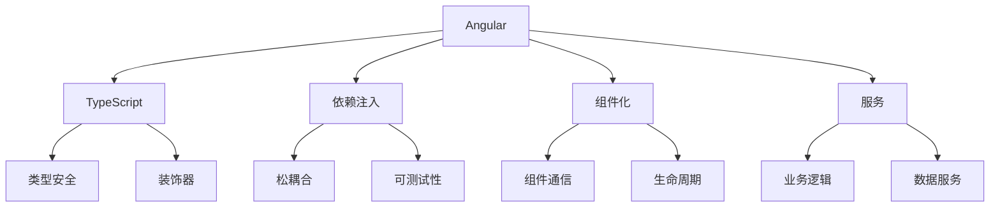

# Angular框架

## Angular概述

### Angular核心特性


### Angular架构
| 层次 | 组件 | 职责 |
|------|------|------|
| 表现层 | 组件 | UI展示和用户交互 |
| 业务层 | 服务 | 业务逻辑和数据处理 |
| 数据层 | HTTP客户端 | API调用和数据获取 |
| 路由层 | 路由器 | 页面导航和路由管理 |

## 组件系统

### 组件基础
```typescript
// 1. 基本组件
import { Component } from '@angular/core';

@Component({
  selector: 'app-hello',
  template: `
    <h1>Hello, {{ name }}!</h1>
    <p>Count: {{ count }}</p>
    <button (click)="increment()">Increment</button>
  `,
  styles: [`
    h1 {
      color: blue;
    }
    button {
      padding: 10px;
      margin: 5px;
    }
  `]
})
export class HelloComponent {
  name = 'Angular';
  count = 0;

  increment() {
    this.count++;
  }
}

// 2. 组件通信
// 父组件
@Component({
  selector: 'app-parent',
  template: `
    <h2>父组件</h2>
    <p>子组件消息: {{ childMessage }}</p>
    <app-child 
      [parentData]="parentData"
      (childEvent)="handleChildEvent($event)">
    </app-child>
  `
})
export class ParentComponent {
  parentData = '来自父组件的数据';
  childMessage = '';

  handleChildEvent(message: string) {
    this.childMessage = message;
  }
}

// 子组件
@Component({
  selector: 'app-child',
  template: `
    <div>
      <h3>子组件</h3>
      <p>父组件数据: {{ parentData }}</p>
      <button (click)="sendMessage()">发送消息</button>
    </div>
  `
})
export class ChildComponent {
  @Input() parentData: string = '';
  @Output() childEvent = new EventEmitter<string>();

  sendMessage() {
    this.childEvent.emit('来自子组件的消息');
  }
}

// 3. 生命周期钩子
@Component({
  selector: 'app-lifecycle',
  template: `
    <div>
      <h2>生命周期示例</h2>
      <p>状态: {{ status }}</p>
      <button (click)="toggleStatus()">切换状态</button>
    </div>
  `
})
export class LifecycleComponent implements OnInit, OnDestroy {
  status = 'created';
  private timer: any;

  ngOnInit() {
    console.log('组件初始化');
    this.status = 'initialized';
    
    this.timer = setInterval(() => {
      console.log('定时器执行');
    }, 1000);
  }

  ngOnDestroy() {
    console.log('组件销毁');
    if (this.timer) {
      clearInterval(this.timer);
    }
  }

  toggleStatus() {
    this.status = this.status === 'active' ? 'inactive' : 'active';
  }
}
```

### 服务注入
```typescript
// 1. 服务定义
import { Injectable } from '@angular/core';
import { HttpClient } from '@angular/common/http';
import { Observable } from 'rxjs';

@Injectable({
  providedIn: 'root'
})
export class UserService {
  private apiUrl = 'https://api.example.com/users';

  constructor(private http: HttpClient) { }

  getUsers(): Observable<User[]> {
    return this.http.get<User[]>(this.apiUrl);
  }

  getUser(id: number): Observable<User> {
    return this.http.get<User>(`${this.apiUrl}/${id}`);
  }

  createUser(user: User): Observable<User> {
    return this.http.post<User>(this.apiUrl, user);
  }

  updateUser(id: number, user: User): Observable<User> {
    return this.http.put<User>(`${this.apiUrl}/${id}`, user);
  }

  deleteUser(id: number): Observable<void> {
    return this.http.delete<void>(`${this.apiUrl}/${id}`);
  }
}

// 2. 组件中使用服务
@Component({
  selector: 'app-user-list',
  template: `
    <div>
      <h2>用户列表</h2>
      <div *ngIf="loading">加载中...</div>
      <div *ngIf="error" class="error">{{ error }}</div>
      <ul *ngIf="users.length > 0">
        <li *ngFor="let user of users">
          {{ user.name }} - {{ user.email }}
          <button (click)="deleteUser(user.id)">删除</button>
        </li>
      </ul>
    </div>
  `
})
export class UserListComponent implements OnInit {
  users: User[] = [];
  loading = false;
  error = '';

  constructor(private userService: UserService) { }

  ngOnInit() {
    this.loadUsers();
  }

  loadUsers() {
    this.loading = true;
    this.error = '';

    this.userService.getUsers().subscribe({
      next: (users) => {
        this.users = users;
        this.loading = false;
      },
      error: (err) => {
        this.error = '加载用户失败';
        this.loading = false;
        console.error('Error loading users:', err);
      }
    });
  }

  deleteUser(id: number) {
    this.userService.deleteUser(id).subscribe({
      next: () => {
        this.users = this.users.filter(user => user.id !== id);
      },
      error: (err) => {
        console.error('Error deleting user:', err);
      }
    });
  }
}
```

## 数据绑定

### 模板语法
```typescript
// 1. 插值绑定
@Component({
  selector: 'app-interpolation',
  template: `
    <div>
      <h1>{{ title }}</h1>
      <p>当前时间: {{ currentTime | date:'medium' }}</p>
      <p>价格: {{ price | currency:'USD' }}</p>
      <p>用户: {{ user?.name || '未知用户' }}</p>
    </div>
  `
})
export class InterpolationComponent {
  title = 'Angular应用';
  currentTime = new Date();
  price = 99.99;
  user: User | null = null;
}

// 2. 属性绑定
@Component({
  selector: 'app-property-binding',
  template: `
    <div>
      
      <button [disabled]="isDisabled" [style.background-color]="buttonColor">
        点击我
      </button>
      <div [ngClass]="{'active': isActive, 'disabled': isDisabled}">
        动态样式
      </div>
    </div>
  `
})
export class PropertyBindingComponent {
  imageSrc = '/assets/logo.png';
  imageAlt = 'Logo';
  isActive = true;
  isDisabled = false;
  buttonColor = 'blue';
}

// 3. 事件绑定
@Component({
  selector: 'app-event-binding',
  template: `
    <div>
      <input (input)="onInput($event)" (keyup.enter)="onEnter()" 
             [(ngModel)]="inputValue" placeholder="输入内容">
      <button (click)="onClick()">点击</button>
      <button (click)="onClickWithParam('参数')">带参数点击</button>
      <p>输入值: {{ inputValue }}</p>
    </div>
  `
})
export class EventBindingComponent {
  inputValue = '';

  onInput(event: Event) {
    const target = event.target as HTMLInputElement;
    console.log('输入值:', target.value);
  }

  onEnter() {
    console.log('按下了回车键');
  }

  onClick() {
    console.log('按钮被点击');
  }

  onClickWithParam(param: string) {
    console.log('带参数点击:', param);
  }
}

// 4. 双向绑定
@Component({
  selector: 'app-two-way-binding',
  template: `
    <div>
      <h2>双向绑定示例</h2>
      <input [(ngModel)]="name" placeholder="姓名">
      <input [(ngModel)]="email" type="email" placeholder="邮箱">
      <textarea [(ngModel)]="message" placeholder="消息"></textarea>
      
      <div>
        <h3>表单数据:</h3>
        <p>姓名: {{ name }}</p>
        <p>邮箱: {{ email }}</p>
        <p>消息: {{ message }}</p>
      </div>
      
      <button (click)="submitForm()">提交</button>
    </div>
  `
})
export class TwoWayBindingComponent {
  name = '';
  email = '';
  message = '';

  submitForm() {
    const formData = {
      name: this.name,
      email: this.email,
      message: this.message
    };
    console.log('表单数据:', formData);
  }
}
```

### 指令系统
```typescript
// 1. 结构指令
@Component({
  selector: 'app-structural-directives',
  template: `
    <div>
      <h2>结构指令示例</h2>
      
      <!-- ngIf -->
      <div *ngIf="isVisible">这是可见的内容</div>
      <div *ngIf="!isVisible">这是隐藏的内容</div>
      
      <!-- ngFor -->
      <ul>
        <li *ngFor="let item of items; let i = index; let first = first; let last = last"
            [class.first]="first" [class.last]="last">
          {{ i + 1 }}. {{ item.name }} - {{ item.price }}
        </li>
      </ul>
      
      <!-- ngSwitch -->
      <div [ngSwitch]="status">
        <div *ngSwitchCase="'loading'">加载中...</div>
        <div *ngSwitchCase="'success'">成功</div>
        <div *ngSwitchCase="'error'">错误</div>
        <div *ngSwitchDefault>未知状态</div>
      </div>
    </div>
  `
})
export class StructuralDirectivesComponent {
  isVisible = true;
  items = [
    { name: '苹果', price: 1.99 },
    { name: '香蕉', price: 0.99 },
    { name: '橙子', price: 2.99 }
  ];
  status = 'loading';
}

// 2. 属性指令
@Component({
  selector: 'app-attribute-directives',
  template: `
    <div>
      <h2>属性指令示例</h2>
      
      <!-- ngClass -->
      <div [ngClass]="{'active': isActive, 'disabled': isDisabled}">
        动态类名
      </div>
      
      <!-- ngStyle -->
      <div [ngStyle]="{'color': textColor, 'font-size': fontSize + 'px'}">
        动态样式
      </div>
      
      <!-- 自定义指令 -->
      <div appHighlight [highlightColor]="'yellow'">
        高亮显示
      </div>
    </div>
  `
})
export class AttributeDirectivesComponent {
  isActive = true;
  isDisabled = false;
  textColor = 'blue';
  fontSize = 16;
}

// 3. 自定义指令
import { Directive, ElementRef, Input, OnInit } from '@angular/core';

@Directive({
  selector: '[appHighlight]'
})
export class HighlightDirective implements OnInit {
  @Input() highlightColor: string = 'yellow';

  constructor(private el: ElementRef) { }

  ngOnInit() {
    this.el.nativeElement.style.backgroundColor = this.highlightColor;
  }
}
```

## 路由系统

### 路由配置
```typescript
// app-routing.module.ts
import { NgModule } from '@angular/core';
import { RouterModule, Routes } from '@angular/router';
import { HomeComponent } from './home/home.component';
import { AboutComponent } from './about/about.component';
import { UserComponent } from './user/user.component';
import { AdminComponent } from './admin/admin.component';
import { AuthGuard } from './guards/auth.guard';

const routes: Routes = [
  { path: '', redirectTo: '/home', pathMatch: 'full' },
  { path: 'home', component: HomeComponent },
  { path: 'about', component: AboutComponent },
  { 
    path: 'user/:id', 
    component: UserComponent,
    data: { title: '用户详情' }
  },
  {
    path: 'admin',
    component: AdminComponent,
    canActivate: [AuthGuard],
    children: [
      { path: '', redirectTo: 'dashboard', pathMatch: 'full' },
      { path: 'dashboard', component: DashboardComponent },
      { path: 'users', component: UserManagementComponent }
    ]
  },
  { path: '**', component: NotFoundComponent }
];

@NgModule({
  imports: [RouterModule.forRoot(routes)],
  exports: [RouterModule]
})
export class AppRoutingModule { }

// 路由守卫
import { Injectable } from '@angular/core';
import { CanActivate, Router } from '@angular/router';

@Injectable({
  providedIn: 'root'
})
export class AuthGuard implements CanActivate {
  constructor(private router: Router) { }

  canActivate(): boolean {
    const token = localStorage.getItem('token');
    if (token) {
      return true;
    } else {
      this.router.navigate(['/login']);
      return false;
    }
  }
}
```

### 路由组件
```typescript
// app.component.ts
import { Component } from '@angular/core';

@Component({
  selector: 'app-root',
  template: `
    <nav>
      <a routerLink="/home" routerLinkActive="active">首页</a>
      <a routerLink="/about" routerLinkActive="active">关于</a>
      <a routerLink="/user/123" routerLinkActive="active">用户</a>
    </nav>
    
    <router-outlet></router-outlet>
  `,
  styles: [`
    nav a {
      margin-right: 10px;
      text-decoration: none;
    }
    nav a.active {
      font-weight: bold;
    }
  `]
})
export class AppComponent { }

// user.component.ts
import { Component, OnInit } from '@angular/core';
import { ActivatedRoute, Router } from '@angular/router';
import { UserService } from './user.service';

@Component({
  selector: 'app-user',
  template: `
    <div>
      <h2>用户详情</h2>
      <div *ngIf="loading">加载中...</div>
      <div *ngIf="user">
        <p>ID: {{ user.id }}</p>
        <p>姓名: {{ user.name }}</p>
        <p>邮箱: {{ user.email }}</p>
        <button (click)="goBack()">返回</button>
      </div>
    </div>
  `
})
export class UserComponent implements OnInit {
  user: User | null = null;
  loading = false;

  constructor(
    private route: ActivatedRoute,
    private router: Router,
    private userService: UserService
  ) { }

  ngOnInit() {
    const id = this.route.snapshot.paramMap.get('id');
    if (id) {
      this.loadUser(+id);
    }
  }

  loadUser(id: number) {
    this.loading = true;
    this.userService.getUser(id).subscribe({
      next: (user) => {
        this.user = user;
        this.loading = false;
      },
      error: (err) => {
        console.error('Error loading user:', err);
        this.loading = false;
      }
    });
  }

  goBack() {
    this.router.navigate(['/home']);
  }
}
```

## 表单处理

### 响应式表单
```typescript
// 1. 响应式表单
import { Component, OnInit } from '@angular/core';
import { FormBuilder, FormGroup, Validators, FormArray } from '@angular/forms';

@Component({
  selector: 'app-reactive-form',
  template: `
    <form [formGroup]="userForm" (ngSubmit)="onSubmit()">
      <div>
        <label>姓名:</label>
        <input formControlName="name" placeholder="请输入姓名">
        <div *ngIf="userForm.get('name')?.invalid && userForm.get('name')?.touched">
          姓名是必填项
        </div>
      </div>
      
      <div>
        <label>邮箱:</label>
        <input formControlName="email" type="email" placeholder="请输入邮箱">
        <div *ngIf="userForm.get('email')?.invalid && userForm.get('email')?.touched">
          请输入有效的邮箱地址
        </div>
      </div>
      
      <div formArrayName="hobbies">
        <label>爱好:</label>
        <div *ngFor="let hobby of hobbies.controls; let i = index">
          <input [formControlName]="i" placeholder="爱好">
          <button type="button" (click)="removeHobby(i)">删除</button>
        </div>
        <button type="button" (click)="addHobby()">添加爱好</button>
      </div>
      
      <button type="submit" [disabled]="userForm.invalid">提交</button>
    </form>
    
    <div>
      <h3>表单值:</h3>
      <pre>{{ userForm.value | json }}</pre>
    </div>
  `
})
export class ReactiveFormComponent implements OnInit {
  userForm: FormGroup;

  constructor(private fb: FormBuilder) {
    this.userForm = this.fb.group({
      name: ['', Validators.required],
      email: ['', [Validators.required, Validators.email]],
      hobbies: this.fb.array([])
    });
  }

  ngOnInit() {
    // 添加初始爱好
    this.addHobby();
  }

  get hobbies() {
    return this.userForm.get('hobbies') as FormArray;
  }

  addHobby() {
    this.hobbies.push(this.fb.control(''));
  }

  removeHobby(index: number) {
    this.hobbies.removeAt(index);
  }

  onSubmit() {
    if (this.userForm.valid) {
      console.log('表单数据:', this.userForm.value);
    } else {
      console.log('表单无效');
    }
  }
}

// 2. 模板驱动表单
@Component({
  selector: 'app-template-form',
  template: `
    <form #userForm="ngForm" (ngSubmit)="onSubmit(userForm)">
      <div>
        <label>姓名:</label>
        <input name="name" ngModel required #name="ngModel" placeholder="请输入姓名">
        <div *ngIf="name.invalid && name.touched">
          姓名是必填项
        </div>
      </div>
      
      <div>
        <label>邮箱:</label>
        <input name="email" ngModel required email #email="ngModel" 
               type="email" placeholder="请输入邮箱">
        <div *ngIf="email.invalid && email.touched">
          请输入有效的邮箱地址
        </div>
      </div>
      
      <button type="submit" [disabled]="userForm.invalid">提交</button>
    </form>
    
    <div>
      <h3>表单状态:</h3>
      <p>有效: {{ userForm.valid }}</p>
      <p>已触摸: {{ userForm.touched }}</p>
      <p>已提交: {{ userForm.submitted }}</p>
    </div>
  `
})
export class TemplateFormComponent {
  onSubmit(form: NgForm) {
    if (form.valid) {
      console.log('表单数据:', form.value);
    } else {
      console.log('表单无效');
    }
  }
}
```

## 相关链接
- [[03-应用实践层/03-框架生态/01-React核心概念]] - React核心概念
- [[03-应用实践层/03-框架生态/02-Vue.js基础]] - Vue.js基础
- [[03-应用实践层/03-框架生态/05-状态管理方案]] - 状态管理方案
- [[02-理解掌握层/04-模块化/03-ES6模块系统]] - ES6模块系统
