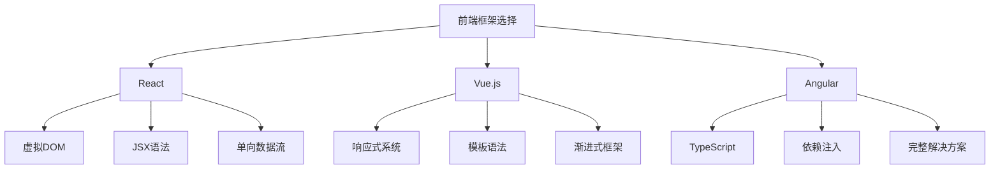
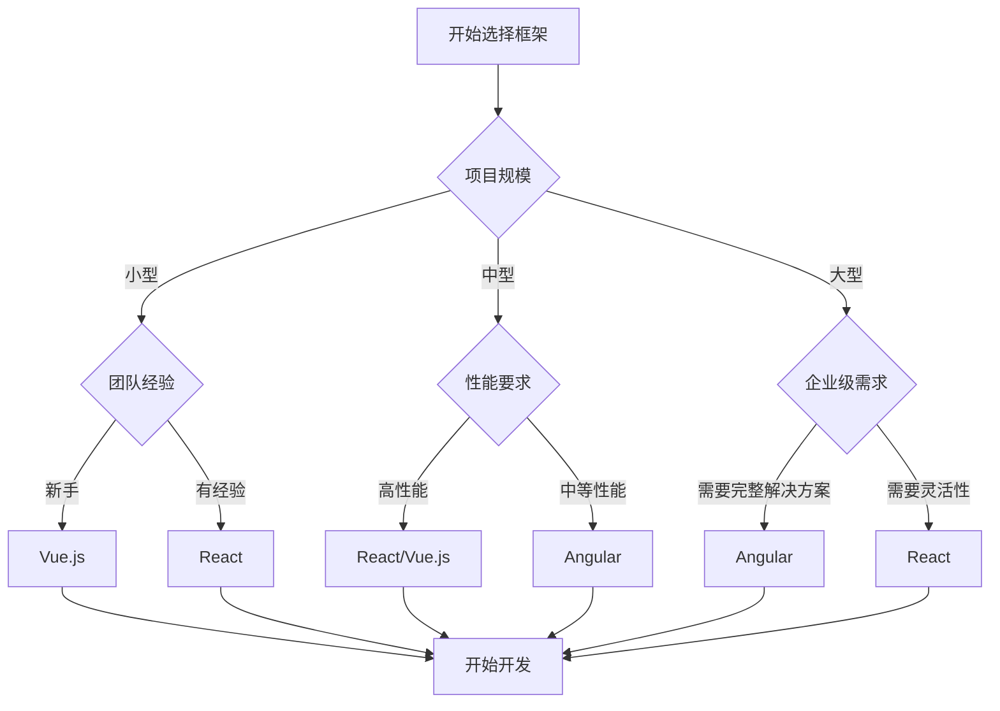

# 框架选择指南

## 框架对比分析

### 技术特性对比


### 详细对比表
| 特性 | React | Vue.js | Angular |
|------|-------|--------|---------|
| **学习曲线** | 中等 | 平缓 | 陡峭 |
| **包大小** | 小 | 小 | 大 |
| **性能** | 高 | 高 | 中等 |
| **生态系统** | 丰富 | 丰富 | 完整 |
| **类型支持** | TypeScript | TypeScript | TypeScript |
| **模板语法** | JSX | HTML模板 | HTML模板 |
| **状态管理** | Redux/Zustand | Vuex/Pinia | NgRx |
| **路由** | React Router | Vue Router | Angular Router |
| **构建工具** | Create React App | Vue CLI | Angular CLI |

## 选择标准

### 项目规模考虑
```javascript
// 1. 小型项目 (< 10个页面)
// 推荐: Vue.js
// 原因: 学习曲线平缓，快速开发

// Vue.js 示例 - 简单易上手
const app = Vue.createApp({
  data() {
    return {
      message: 'Hello Vue!'
    }
  }
})

app.mount('#app')

// 2. 中型项目 (10-50个页面)
// 推荐: React 或 Vue.js
// 原因: 灵活性高，生态丰富

// React 示例 - 组件化开发
function App() {
  const [count, setCount] = useState(0)
  
  return (
    <div>
      <h1>Count: {count}</h1>
      <button onClick={() => setCount(count + 1)}>
        Increment
      </button>
    </div>
  )
}

// 3. 大型企业级项目 (> 50个页面)
// 推荐: Angular
// 原因: 完整的解决方案，强类型支持

// Angular 示例 - 企业级架构
@Component({
  selector: 'app-root',
  template: `
    <h1>{{ title }}</h1>
    <app-user-list></app-user-list>
  `
})
export class AppComponent {
  title = 'Enterprise App'
}
```

### 团队技能考虑
```javascript
// 1. 新手团队
// 推荐: Vue.js
// 原因: 文档友好，学习成本低

// Vue.js - 直观的模板语法
<template>
  <div>
    <h1>{{ title }}</h1>
    <button @click="increment">Count: {{ count }}</button>
  </div>
</template>

<script>
export default {
  data() {
    return {
      title: 'Vue App',
      count: 0
    }
  },
  methods: {
    increment() {
      this.count++
    }
  }
}
</script>

// 2. 有经验的团队
// 推荐: React
// 原因: 灵活性高，生态丰富

// React - 函数式编程
function Counter() {
  const [count, setCount] = useState(0)
  
  const increment = useCallback(() => {
    setCount(prev => prev + 1)
  }, [])
  
  return (
    <div>
      <h1>Count: {count}</h1>
      <button onClick={increment}>Increment</button>
    </div>
  )
}

// 3. 企业级团队
// 推荐: Angular
// 原因: 完整的工具链，强类型支持

// Angular - 依赖注入和服务
@Injectable({
  providedIn: 'root'
})
export class UserService {
  constructor(private http: HttpClient) {}
  
  getUsers(): Observable<User[]> {
    return this.http.get<User[]>('/api/users')
  }
}

@Component({
  selector: 'app-user-list',
  template: `
    <div *ngFor="let user of users$ | async">
      {{ user.name }}
    </div>
  `
})
export class UserListComponent {
  users$ = this.userService.getUsers()
  
  constructor(private userService: UserService) {}
}
```

### 性能要求考虑
```javascript
// 1. 高性能要求
// 推荐: React 或 Vue.js
// 原因: 虚拟DOM优化，包体积小

// React - 性能优化
function OptimizedList({ items }) {
  const memoizedItems = useMemo(() => 
    items.map(item => ({
      ...item,
      processed: processItem(item)
    })), [items]
  )
  
  return (
    <div>
      {memoizedItems.map(item => (
        <MemoizedItem key={item.id} item={item} />
      ))}
    </div>
  )
}

const MemoizedItem = React.memo(({ item }) => (
  <div>{item.name}</div>
))

// Vue.js - 性能优化
export default {
  data() {
    return {
      items: []
    }
  },
  computed: {
    processedItems() {
      return this.items.map(item => ({
        ...item,
        processed: this.processItem(item)
      }))
    }
  },
  methods: {
    processItem(item) {
      // 处理逻辑
      return item
    }
  }
}

// 2. 中等性能要求
// 推荐: Angular
// 原因: 内置优化，但包体积较大

// Angular - 变更检测优化
@Component({
  selector: 'app-optimized',
  changeDetection: ChangeDetectionStrategy.OnPush
})
export class OptimizedComponent {
  @Input() data: any[]
  
  constructor(private cdr: ChangeDetectorRef) {}
  
  updateData() {
    // 手动触发变更检测
    this.cdr.markForCheck()
  }
}
```

## 具体场景选择

### 电商网站
```javascript
// 推荐: React + Next.js
// 原因: SEO友好，性能优秀，生态丰富

// Next.js 电商示例
import { useState, useEffect } from 'react'
import { useRouter } from 'next/router'

export default function ProductPage() {
  const router = useRouter()
  const { id } = router.query
  const [product, setProduct] = useState(null)
  
  useEffect(() => {
    if (id) {
      fetchProduct(id).then(setProduct)
    }
  }, [id])
  
  return (
    <div>
      <h1>{product?.name}</h1>
      <p>价格: ${product?.price}</p>
      <button onClick={() => addToCart(product)}>
        加入购物车
      </button>
    </div>
  )
}

// 状态管理 - Redux Toolkit
import { createSlice } from '@reduxjs/toolkit'

const cartSlice = createSlice({
  name: 'cart',
  initialState: {
    items: []
  },
  reducers: {
    addItem: (state, action) => {
      state.items.push(action.payload)
    },
    removeItem: (state, action) => {
      state.items = state.items.filter(item => item.id !== action.payload)
    }
  }
})
```

### 管理后台
```javascript
// 推荐: Vue.js + Element Plus
// 原因: 组件丰富，开发效率高

// Vue.js 管理后台示例
<template>
  <el-container>
    <el-aside width="200px">
      <el-menu>
        <el-menu-item index="users">用户管理</el-menu-item>
        <el-menu-item index="products">商品管理</el-menu-item>
      </el-menu>
    </el-aside>
    
    <el-main>
      <el-table :data="tableData">
        <el-table-column prop="name" label="姓名"></el-table-column>
        <el-table-column prop="email" label="邮箱"></el-table-column>
        <el-table-column label="操作">
          <template #default="scope">
            <el-button @click="edit(scope.row)">编辑</el-button>
            <el-button @click="delete(scope.row)">删除</el-button>
          </template>
        </el-table-column>
      </el-table>
    </el-main>
  </el-container>
</template>

<script>
import { ref, onMounted } from 'vue'
import { ElMessage } from 'element-plus'

export default {
  setup() {
    const tableData = ref([])
    
    const loadData = async () => {
      try {
        const response = await fetch('/api/users')
        tableData.value = await response.json()
      } catch (error) {
        ElMessage.error('加载数据失败')
      }
    }
    
    onMounted(loadData)
    
    return {
      tableData,
      loadData
    }
  }
}
</script>
```

### 企业级应用
```javascript
// 推荐: Angular
// 原因: 完整的解决方案，强类型支持，企业级特性

// Angular 企业级应用示例
@Injectable({
  providedIn: 'root'
})
export class AuthService {
  private currentUser$ = new BehaviorSubject<User | null>(null)
  
  constructor(private http: HttpClient) {}
  
  login(credentials: LoginCredentials): Observable<User> {
    return this.http.post<User>('/api/auth/login', credentials)
      .pipe(
        tap(user => this.currentUser$.next(user)),
        catchError(this.handleError)
      )
  }
  
  private handleError(error: HttpErrorResponse): Observable<never> {
    // 错误处理逻辑
    return throwError(() => error)
  }
}

@Component({
  selector: 'app-dashboard',
  template: `
    <div class="dashboard">
      <app-sidebar></app-sidebar>
      <app-header></app-header>
      <main class="content">
        <router-outlet></router-outlet>
      </main>
    </div>
  `
})
export class DashboardComponent implements OnInit {
  constructor(
    private authService: AuthService,
    private router: Router
  ) {}
  
  ngOnInit() {
    this.authService.currentUser$.subscribe(user => {
      if (!user) {
        this.router.navigate(['/login'])
      }
    })
  }
}
```

## 迁移考虑

### 从jQuery迁移
```javascript
// 1. 渐进式迁移到Vue.js
// 原因: 学习曲线平缓，可以逐步替换

// 原有jQuery代码
$(document).ready(function() {
  $('#button').click(function() {
    $('#content').html('Hello World')
  })
})

// Vue.js替代方案
const app = Vue.createApp({
  data() {
    return {
      content: ''
    }
  },
  methods: {
    updateContent() {
      this.content = 'Hello World'
    }
  }
})

// 2. 直接迁移到React
// 原因: 现代化程度高，长期维护性好

// React替代方案
function App() {
  const [content, setContent] = useState('')
  
  const updateContent = () => {
    setContent('Hello World')
  }
  
  return (
    <div>
      <button onClick={updateContent}>Click me</button>
      <div>{content}</div>
    </div>
  )
}
```

### 框架间迁移
```javascript
// 1. Vue.js 到 React
// 组件结构对比

// Vue.js组件
<template>
  <div>
    <h1>{{ title }}</h1>
    <button @click="increment">Count: {{ count }}</button>
  </div>
</template>

<script>
export default {
  data() {
    return {
      title: 'Vue Component',
      count: 0
    }
  },
  methods: {
    increment() {
      this.count++
    }
  }
}
</script>

// React组件
function Component() {
  const [title, setTitle] = useState('React Component')
  const [count, setCount] = useState(0)
  
  const increment = () => {
    setCount(count + 1)
  }
  
  return (
    <div>
      <h1>{title}</h1>
      <button onClick={increment}>Count: {count}</button>
    </div>
  )
}

// 2. React 到 Angular
// 状态管理对比

// React + Redux
const counterSlice = createSlice({
  name: 'counter',
  initialState: { value: 0 },
  reducers: {
    increment: state => {
      state.value += 1
    }
  }
})

// Angular + NgRx
@Injectable()
export class CounterActions {
  static increment = createAction('[Counter] Increment')
}

export const counterReducer = createReducer(
  initialState,
  on(CounterActions.increment, state => ({
    ...state,
    value: state.value + 1
  }))
)
```

## 决策流程

### 选择决策树


### 评估 checklist
```javascript
// 框架选择评估清单
const frameworkEvaluation = {
  // 技术因素
  technical: {
    learningCurve: '学习曲线是否适合团队',
    performance: '性能是否满足需求',
    ecosystem: '生态系统是否丰富',
    typeSafety: '类型安全支持程度',
    tooling: '开发工具链完善程度'
  },
  
  // 项目因素
  project: {
    size: '项目规模大小',
    complexity: '业务复杂度',
    timeline: '开发时间要求',
    maintenance: '长期维护需求',
    scalability: '可扩展性要求'
  },
  
  // 团队因素
  team: {
    experience: '团队技术经验',
    size: '团队规模',
    skills: '技能匹配度',
    training: '培训成本',
    recruitment: '人才招聘难度'
  },
  
  // 业务因素
  business: {
    budget: '预算限制',
    deadline: '上线时间',
    requirements: '功能需求',
    integration: '系统集成需求',
    compliance: '合规要求'
  }
}

// 评分系统
const scoreFramework = (framework, criteria) => {
  const scores = {
    react: {
      learningCurve: 7,
      performance: 9,
      ecosystem: 10,
      typeSafety: 8,
      tooling: 9
    },
    vue: {
      learningCurve: 9,
      performance: 9,
      ecosystem: 8,
      typeSafety: 8,
      tooling: 8
    },
    angular: {
      learningCurve: 5,
      performance: 7,
      ecosystem: 9,
      typeSafety: 10,
      tooling: 10
    }
  }
  
  return scores[framework]
}
```

## 相关链接
- [[03-应用实践层/03-框架生态/01-React核心概念]] - React核心概念
- [[03-应用实践层/03-框架生态/02-Vue.js基础]] - Vue.js基础
- [[03-应用实践层/03-框架生态/03-Angular框架]] - Angular框架
- [[03-应用实践层/03-框架生态/05-状态管理方案]] - 状态管理方案
