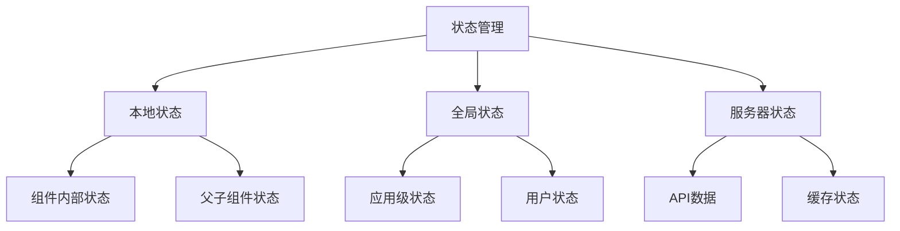

# 状态管理方案

## 状态管理概述

### 状态管理概念


### 状态管理原则
| 原则 | 描述 | 示例 |
|------|------|------|
| 单一数据源 | 每个状态只有一个数据源 | 用户信息只在一个地方存储 |
| 状态只读 | 状态只能通过action修改 | 不能直接修改store中的状态 |
| 纯函数修改 | 使用纯函数修改状态 | reducer函数 |
| 可预测性 | 状态变化可预测和追踪 | 时间旅行调试 |

## React状态管理

### Redux Toolkit
```javascript
// 1. 基础Redux配置
// store/index.js
import { configureStore } from '@reduxjs/toolkit'
import counterSlice from './slices/counterSlice'
import userSlice from './slices/userSlice'

export const store = configureStore({
  reducer: {
    counter: counterSlice,
    user: userSlice
  }
})

export type RootState = ReturnType<typeof store.getState>
export type AppDispatch = typeof store.dispatch

// 2. Slice定义
// slices/counterSlice.js
import { createSlice } from '@reduxjs/toolkit'

const initialState = {
  value: 0,
  loading: false,
  error: null
}

const counterSlice = createSlice({
  name: 'counter',
  initialState,
  reducers: {
    increment: (state) => {
      state.value += 1
    },
    decrement: (state) => {
      state.value -= 1
    },
    incrementByAmount: (state, action) => {
      state.value += action.payload
    },
    setLoading: (state, action) => {
      state.loading = action.payload
    },
    setError: (state, action) => {
      state.error = action.payload
    }
  }
})

export const { 
  increment, 
  decrement, 
  incrementByAmount, 
  setLoading, 
  setError 
} = counterSlice.actions

export default counterSlice.reducer

// 3. 异步Action
// slices/userSlice.js
import { createSlice, createAsyncThunk } from '@reduxjs/toolkit'
import { fetchUser, updateUser } from '../api/userApi'

export const fetchUserAsync = createAsyncThunk(
  'user/fetchUser',
  async (userId, { rejectWithValue }) => {
    try {
      const user = await fetchUser(userId)
      return user
    } catch (error) {
      return rejectWithValue(error.message)
    }
  }
)

export const updateUserAsync = createAsyncThunk(
  'user/updateUser',
  async ({ userId, userData }, { rejectWithValue }) => {
    try {
      const updatedUser = await updateUser(userId, userData)
      return updatedUser
    } catch (error) {
      return rejectWithValue(error.message)
    }
  }
)

const userSlice = createSlice({
  name: 'user',
  initialState: {
    currentUser: null,
    loading: false,
    error: null
  },
  reducers: {
    clearUser: (state) => {
      state.currentUser = null
      state.error = null
    }
  },
  extraReducers: (builder) => {
    builder
      .addCase(fetchUserAsync.pending, (state) => {
        state.loading = true
        state.error = null
      })
      .addCase(fetchUserAsync.fulfilled, (state, action) => {
        state.loading = false
        state.currentUser = action.payload
      })
      .addCase(fetchUserAsync.rejected, (state, action) => {
        state.loading = false
        state.error = action.payload
      })
      .addCase(updateUserAsync.fulfilled, (state, action) => {
        state.currentUser = action.payload
      })
  }
})

export const { clearUser } = userSlice.actions
export default userSlice.reducer

// 4. 组件中使用
// components/Counter.jsx
import React from 'react'
import { useSelector, useDispatch } from 'react-redux'
import { increment, decrement, incrementByAmount } from '../slices/counterSlice'

function Counter() {
  const count = useSelector((state) => state.counter.value)
  const loading = useSelector((state) => state.counter.loading)
  const dispatch = useDispatch()

  return (
    <div>
      <h2>Count: {count}</h2>
      <button onClick={() => dispatch(increment())}>+</button>
      <button onClick={() => dispatch(decrement())}>-</button>
      <button onClick={() => dispatch(incrementByAmount(5))}>+5</button>
      {loading && <p>Loading...</p>}
    </div>
  )
}

// 5. 自定义Hooks
// hooks/useAppSelector.js
import { useSelector, useDispatch } from 'react-redux'
import { useCallback } from 'react'

export const useAppSelector = useSelector
export const useAppDispatch = () => useDispatch()

export const useCounter = () => {
  const count = useAppSelector((state) => state.counter.value)
  const loading = useAppSelector((state) => state.counter.loading)
  const dispatch = useAppDispatch()

  const increment = useCallback(() => {
    dispatch(increment())
  }, [dispatch])

  const decrement = useCallback(() => {
    dispatch(decrement())
  }, [dispatch])

  return {
    count,
    loading,
    increment,
    decrement
  }
}
```

### Zustand
```javascript
// 1. 基础Store
// stores/useCounterStore.js
import { create } from 'zustand'
import { devtools } from 'zustand/middleware'

const useCounterStore = create(
  devtools(
    (set, get) => ({
      count: 0,
      loading: false,
      error: null,
      
      increment: () => set((state) => ({ count: state.count + 1 })),
      decrement: () => set((state) => ({ count: state.count - 1 })),
      incrementByAmount: (amount) => 
        set((state) => ({ count: state.count + amount })),
      
      setLoading: (loading) => set({ loading }),
      setError: (error) => set({ error }),
      
      reset: () => set({ count: 0, loading: false, error: null })
    }),
    { name: 'counter-store' }
  )
)

export default useCounterStore

// 2. 异步操作
// stores/useUserStore.js
import { create } from 'zustand'
import { fetchUser, updateUser } from '../api/userApi'

const useUserStore = create((set, get) => ({
  currentUser: null,
  loading: false,
  error: null,
  
  fetchUser: async (userId) => {
    set({ loading: true, error: null })
    try {
      const user = await fetchUser(userId)
      set({ currentUser: user, loading: false })
      return user
    } catch (error) {
      set({ error: error.message, loading: false })
      throw error
    }
  },
  
  updateUser: async (userId, userData) => {
    set({ loading: true, error: null })
    try {
      const updatedUser = await updateUser(userId, userData)
      set({ currentUser: updatedUser, loading: false })
      return updatedUser
    } catch (error) {
      set({ error: error.message, loading: false })
      throw error
    }
  },
  
  clearUser: () => set({ currentUser: null, error: null })
}))

export default useUserStore

// 3. 组件中使用
// components/Counter.jsx
import React from 'react'
import useCounterStore from '../stores/useCounterStore'

function Counter() {
  const { count, loading, increment, decrement, incrementByAmount } = useCounterStore()

  return (
    <div>
      <h2>Count: {count}</h2>
      <button onClick={increment}>+</button>
      <button onClick={decrement}>-</button>
      <button onClick={() => incrementByAmount(5)}>+5</button>
      {loading && <p>Loading...</p>}
    </div>
  )
}

// 4. 选择器优化
// components/UserProfile.jsx
import React from 'react'
import useUserStore from '../stores/useUserStore'

function UserProfile() {
  // 只订阅需要的状态
  const currentUser = useUserStore((state) => state.currentUser)
  const loading = useUserStore((state) => state.loading)
  const fetchUser = useUserStore((state) => state.fetchUser)

  return (
    <div>
      {loading ? (
        <p>Loading...</p>
      ) : currentUser ? (
        <div>
          <h2>{currentUser.name}</h2>
          <p>{currentUser.email}</p>
        </div>
      ) : (
        <button onClick={() => fetchUser(1)}>Load User</button>
      )}
    </div>
  )
}
```

## Vue状态管理

### Vuex
```javascript
// 1. Store配置
// store/index.js
import { createStore } from 'vuex'
import counter from './modules/counter'
import user from './modules/user'

export default createStore({
  modules: {
    counter,
    user
  },
  strict: process.env.NODE_ENV !== 'production'
})

// 2. 模块定义
// store/modules/counter.js
const state = {
  count: 0,
  loading: false,
  error: null
}

const mutations = {
  INCREMENT(state) {
    state.count++
  },
  DECREMENT(state) {
    state.count--
  },
  INCREMENT_BY_AMOUNT(state, amount) {
    state.count += amount
  },
  SET_LOADING(state, loading) {
    state.loading = loading
  },
  SET_ERROR(state, error) {
    state.error = error
  }
}

const actions = {
  increment({ commit }) {
    commit('INCREMENT')
  },
  decrement({ commit }) {
    commit('DECREMENT')
  },
  incrementByAmount({ commit }, amount) {
    commit('INCREMENT_BY_AMOUNT', amount)
  },
  async incrementAsync({ commit }) {
    commit('SET_LOADING', true)
    try {
      await new Promise(resolve => setTimeout(resolve, 1000))
      commit('INCREMENT')
    } catch (error) {
      commit('SET_ERROR', error.message)
    } finally {
      commit('SET_LOADING', false)
    }
  }
}

const getters = {
  doubleCount: state => state.count * 2,
  isEven: state => state.count % 2 === 0
}

export default {
  namespaced: true,
  state,
  mutations,
  actions,
  getters
}

// 3. 组件中使用
// components/Counter.vue
<template>
  <div>
    <h2>Count: {{ count }}</h2>
    <p>Double: {{ doubleCount }}</p>
    <p>Is Even: {{ isEven }}</p>
    <button @click="increment">+</button>
    <button @click="decrement">-</button>
    <button @click="incrementByAmount(5)">+5</button>
    <button @click="incrementAsync" :disabled="loading">
      Async Increment
    </button>
    <div v-if="loading">Loading...</div>
    <div v-if="error" class="error">{{ error }}</div>
  </div>
</template>

<script>
import { mapState, mapGetters, mapActions } from 'vuex'

export default {
  computed: {
    ...mapState('counter', ['count', 'loading', 'error']),
    ...mapGetters('counter', ['doubleCount', 'isEven'])
  },
  methods: {
    ...mapActions('counter', [
      'increment',
      'decrement',
      'incrementByAmount',
      'incrementAsync'
    ])
  }
}
</script>

// 4. 组合式API使用
// components/CounterComposition.vue
<template>
  <div>
    <h2>Count: {{ count }}</h2>
    <button @click="increment">+</button>
    <button @click="decrement">-</button>
  </div>
</template>

<script>
import { computed } from 'vue'
import { useStore } from 'vuex'

export default {
  setup() {
    const store = useStore()
    
    const count = computed(() => store.state.counter.count)
    
    const increment = () => store.dispatch('counter/increment')
    const decrement = () => store.dispatch('counter/decrement')
    
    return {
      count,
      increment,
      decrement
    }
  }
}
</script>
```

### Pinia
```javascript
// 1. Store定义
// stores/counter.js
import { defineStore } from 'pinia'

export const useCounterStore = defineStore('counter', {
  state: () => ({
    count: 0,
    loading: false,
    error: null
  }),
  
  getters: {
    doubleCount: (state) => state.count * 2,
    isEven: (state) => state.count % 2 === 0
  },
  
  actions: {
    increment() {
      this.count++
    },
    
    decrement() {
      this.count--
    },
    
    incrementByAmount(amount) {
      this.count += amount
    },
    
    async incrementAsync() {
      this.loading = true
      try {
        await new Promise(resolve => setTimeout(resolve, 1000))
        this.increment()
      } catch (error) {
        this.error = error.message
      } finally {
        this.loading = false
      }
    },
    
    reset() {
      this.count = 0
      this.loading = false
      this.error = null
    }
  }
})

// 2. 异步Store
// stores/user.js
import { defineStore } from 'pinia'
import { fetchUser, updateUser } from '../api/userApi'

export const useUserStore = defineStore('user', {
  state: () => ({
    currentUser: null,
    loading: false,
    error: null
  }),
  
  getters: {
    isLoggedIn: (state) => !!state.currentUser,
    userName: (state) => state.currentUser?.name || 'Guest'
  },
  
  actions: {
    async fetchUser(userId) {
      this.loading = true
      this.error = null
      
      try {
        const user = await fetchUser(userId)
        this.currentUser = user
        return user
      } catch (error) {
        this.error = error.message
        throw error
      } finally {
        this.loading = false
      }
    },
    
    async updateUser(userId, userData) {
      this.loading = true
      this.error = null
      
      try {
        const updatedUser = await updateUser(userId, userData)
        this.currentUser = updatedUser
        return updatedUser
      } catch (error) {
        this.error = error.message
        throw error
      } finally {
        this.loading = false
      }
    },
    
    clearUser() {
      this.currentUser = null
      this.error = null
    }
  }
})

// 3. 组件中使用
// components/Counter.vue
<template>
  <div>
    <h2>Count: {{ counterStore.count }}</h2>
    <p>Double: {{ counterStore.doubleCount }}</p>
    <button @click="counterStore.increment">+</button>
    <button @click="counterStore.decrement">-</button>
    <button @click="counterStore.incrementAsync" :disabled="counterStore.loading">
      Async Increment
    </button>
  </div>
</template>

<script>
import { useCounterStore } from '../stores/counter'

export default {
  setup() {
    const counterStore = useCounterStore()
    
    return {
      counterStore
    }
  }
}
</script>

// 4. 组合式函数
// composables/useCounter.js
import { computed } from 'vue'
import { useCounterStore } from '../stores/counter'

export function useCounter() {
  const counterStore = useCounterStore()
  
  const count = computed(() => counterStore.count)
  const doubleCount = computed(() => counterStore.doubleCount)
  const isEven = computed(() => counterStore.isEven)
  const loading = computed(() => counterStore.loading)
  
  const increment = () => counterStore.increment()
  const decrement = () => counterStore.decrement()
  const incrementByAmount = (amount) => counterStore.incrementByAmount(amount)
  const incrementAsync = () => counterStore.incrementAsync()
  
  return {
    count,
    doubleCount,
    isEven,
    loading,
    increment,
    decrement,
    incrementByAmount,
    incrementAsync
  }
}
```

## Angular状态管理

### NgRx
```typescript
// 1. Actions定义
// store/counter.actions.ts
import { createAction, props } from '@ngrx/store'

export const increment = createAction('[Counter] Increment')
export const decrement = createAction('[Counter] Decrement')
export const incrementByAmount = createAction(
  '[Counter] Increment By Amount',
  props<{ amount: number }>()
)
export const reset = createAction('[Counter] Reset')

// 异步Actions
export const incrementAsync = createAction('[Counter] Increment Async')
export const incrementAsyncSuccess = createAction('[Counter] Increment Async Success')
export const incrementAsyncFailure = createAction(
  '[Counter] Increment Async Failure',
  props<{ error: string }>()
)

// 2. Reducer定义
// store/counter.reducer.ts
import { createReducer, on } from '@ngrx/store'
import { increment, decrement, incrementByAmount, reset, incrementAsyncSuccess, incrementAsyncFailure } from './counter.actions'

export interface CounterState {
  count: number
  loading: boolean
  error: string | null
}

export const initialState: CounterState = {
  count: 0,
  loading: false,
  error: null
}

export const counterReducer = createReducer(
  initialState,
  on(increment, (state) => ({
    ...state,
    count: state.count + 1
  })),
  on(decrement, (state) => ({
    ...state,
    count: state.count - 1
  })),
  on(incrementByAmount, (state, { amount }) => ({
    ...state,
    count: state.count + amount
  })),
  on(reset, (state) => ({
    ...state,
    count: 0,
    error: null
  })),
  on(incrementAsyncSuccess, (state) => ({
    ...state,
    loading: false,
    count: state.count + 1
  })),
  on(incrementAsyncFailure, (state, { error }) => ({
    ...state,
    loading: false,
    error
  }))
)

// 3. Effects定义
// store/counter.effects.ts
import { Injectable } from '@angular/core'
import { Actions, createEffect, ofType } from '@ngrx/effects'
import { of } from 'rxjs'
import { map, catchError, switchMap, delay } from 'rxjs/operators'
import { incrementAsync, incrementAsyncSuccess, incrementAsyncFailure } from './counter.actions'

@Injectable()
export class CounterEffects {
  incrementAsync$ = createEffect(() =>
    this.actions$.pipe(
      ofType(incrementAsync),
      delay(1000), // 模拟异步操作
      map(() => incrementAsyncSuccess()),
      catchError(error => of(incrementAsyncFailure({ error: error.message })))
    )
  )

  constructor(private actions$: Actions) {}
}

// 4. Selectors定义
// store/counter.selectors.ts
import { createFeatureSelector, createSelector } from '@ngrx/store'
import { CounterState } from './counter.reducer'

export const selectCounterState = createFeatureSelector<CounterState>('counter')

export const selectCount = createSelector(
  selectCounterState,
  (state) => state.count
)

export const selectLoading = createSelector(
  selectCounterState,
  (state) => state.loading
)

export const selectError = createSelector(
  selectCounterState,
  (state) => state.error
)

export const selectDoubleCount = createSelector(
  selectCount,
  (count) => count * 2
)

// 5. 组件中使用
// components/counter.component.ts
import { Component } from '@angular/core'
import { Store } from '@ngrx/store'
import { Observable } from 'rxjs'
import { increment, decrement, incrementByAmount, incrementAsync } from '../store/counter.actions'
import { selectCount, selectLoading, selectDoubleCount } from '../store/counter.selectors'

@Component({
  selector: 'app-counter',
  template: `
    <div>
      <h2>Count: {{ count$ | async }}</h2>
      <p>Double: {{ doubleCount$ | async }}</p>
      <button (click)="increment()">+</button>
      <button (click)="decrement()">-</button>
      <button (click)="incrementByAmount(5)">+5</button>
      <button (click)="incrementAsync()" [disabled]="loading$ | async">
        Async Increment
      </button>
      <div *ngIf="loading$ | async">Loading...</div>
    </div>
  `
})
export class CounterComponent {
  count$: Observable<number>
  loading$: Observable<boolean>
  doubleCount$: Observable<number>

  constructor(private store: Store) {
    this.count$ = this.store.select(selectCount)
    this.loading$ = this.store.select(selectLoading)
    this.doubleCount$ = this.store.select(selectDoubleCount)
  }

  increment() {
    this.store.dispatch(increment())
  }

  decrement() {
    this.store.dispatch(decrement())
  }

  incrementByAmount(amount: number) {
    this.store.dispatch(incrementByAmount({ amount }))
  }

  incrementAsync() {
    this.store.dispatch(incrementAsync())
  }
}
```

## 状态管理最佳实践

### 状态设计原则
```javascript
// 1. 状态规范化
// 避免嵌套状态，使用扁平化结构
const badState = {
  users: {
    1: {
      id: 1,
      name: 'John',
      posts: {
        1: { id: 1, title: 'Post 1' },
        2: { id: 2, title: 'Post 2' }
      }
    }
  }
}

const goodState = {
  users: {
    1: { id: 1, name: 'John' }
  },
  posts: {
    1: { id: 1, title: 'Post 1', userId: 1 },
    2: { id: 2, title: 'Post 2', userId: 1 }
  },
  userPosts: {
    1: [1, 2] // 用户1的帖子ID数组
  }
}

// 2. 状态不可变性
// 错误做法
const badReducer = (state, action) => {
  state.count += 1 // 直接修改状态
  return state
}

// 正确做法
const goodReducer = (state, action) => {
  return {
    ...state,
    count: state.count + 1
  }
}

// 3. 状态选择器
// 避免在组件中直接访问状态
const BadComponent = () => {
  const state = useSelector(state => state)
  return <div>{state.user.name}</div>
}

// 使用选择器
const selectUserName = (state) => state.user.name

const GoodComponent = () => {
  const userName = useSelector(selectUserName)
  return <div>{userName}</div>
}
```

### 性能优化
```javascript
// 1. 选择器优化
// 避免不必要的重新渲染
const selectUser = (state) => state.user
const selectUserName = (state) => state.user.name

// 使用memoized选择器
import { createSelector } from '@reduxjs/toolkit'

const selectUser = (state) => state.user
const selectUserName = createSelector(
  [selectUser],
  (user) => user.name
)

// 2. 组件优化
// 使用React.memo避免不必要的重新渲染
const UserComponent = React.memo(({ user }) => {
  return <div>{user.name}</div>
})

// 使用useCallback和useMemo
const UserList = ({ users }) => {
  const sortedUsers = useMemo(() => 
    users.sort((a, b) => a.name.localeCompare(b.name)),
    [users]
  )
  
  const handleUserClick = useCallback((userId) => {
    // 处理用户点击
  }, [])
  
  return (
    <div>
      {sortedUsers.map(user => (
        <UserComponent 
          key={user.id} 
          user={user} 
          onClick={handleUserClick}
        />
      ))}
    </div>
  )
}

// 3. 状态分片
// 将大状态拆分为小状态
const useAppStore = create((set) => ({
  // 用户相关状态
  user: {
    currentUser: null,
    loading: false,
    error: null
  },
  
  // 计数器相关状态
  counter: {
    count: 0,
    loading: false
  },
  
  // 用户操作
  setUser: (user) => set((state) => ({
    user: { ...state.user, currentUser: user }
  })),
  
  // 计数器操作
  increment: () => set((state) => ({
    counter: { ...state.counter, count: state.counter.count + 1 }
  }))
}))
```

## 相关链接
- [[03-应用实践层/03-框架生态/01-React核心概念]] - React核心概念
- [[03-应用实践层/03-框架生态/02-Vue.js基础]] - Vue.js基础
- [[03-应用实践层/03-框架生态/03-Angular框架]] - Angular框架
- [[02-理解掌握层/03-异步编程/03-Promise详解]] - Promise详解
