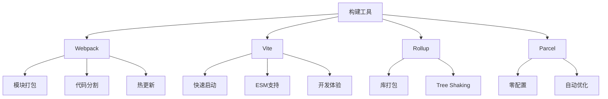

# 构建工具(Webpack-Vite)

## 构建工具概述

### 构建工具对比


### 工具特性对比
| 特性 | Webpack | Vite | Rollup | Parcel |
|------|---------|------|--------|--------|
| 启动速度 | 慢 | 快 | 中等 | 快 |
| 热更新 | 支持 | 支持 | 不支持 | 支持 |
| 配置复杂度 | 高 | 低 | 中等 | 低 |
| 生态支持 | 丰富 | 新兴 | 专业 | 中等 |
| 适用场景 | 大型应用 | 现代应用 | 库开发 | 快速原型 |

## Webpack

### 基础配置
```javascript
// webpack.config.js
const path = require('path');
const HtmlWebpackPlugin = require('html-webpack-plugin');
const MiniCssExtractPlugin = require('mini-css-extract-plugin');
const { CleanWebpackPlugin } = require('clean-webpack-plugin');

module.exports = {
  // 入口文件
  entry: {
    main: './src/index.js',
    vendor: './src/vendor.js'
  },
  
  // 输出配置
  output: {
    path: path.resolve(__dirname, 'dist'),
    filename: '[name].[contenthash].js',
    chunkFilename: '[name].[contenthash].chunk.js',
    publicPath: '/'
  },
  
  // 模块解析
  resolve: {
    extensions: ['.js', '.jsx', '.ts', '.tsx'],
    alias: {
      '@': path.resolve(__dirname, 'src'),
      'components': path.resolve(__dirname, 'src/components')
    }
  },
  
  // 模块处理规则
  module: {
    rules: [
      // JavaScript/TypeScript
      {
        test: /\.(js|jsx|ts|tsx)$/,
        exclude: /node_modules/,
        use: {
          loader: 'babel-loader',
          options: {
            presets: [
              '@babel/preset-env',
              '@babel/preset-react',
              '@babel/preset-typescript'
            ],
            plugins: [
              '@babel/plugin-proposal-class-properties',
              '@babel/plugin-syntax-dynamic-import'
            ]
          }
        }
      },
      
      // CSS处理
      {
        test: /\.css$/,
        use: [
          MiniCssExtractPlugin.loader,
          'css-loader',
          'postcss-loader'
        ]
      },
      
      // SCSS处理
      {
        test: /\.scss$/,
        use: [
          MiniCssExtractPlugin.loader,
          'css-loader',
          'postcss-loader',
          'sass-loader'
        ]
      },
      
      // 图片处理
      {
        test: /\.(png|jpg|jpeg|gif|svg)$/,
        type: 'asset/resource',
        generator: {
          filename: 'images/[name].[contenthash][ext]'
        }
      },
      
      // 字体处理
      {
        test: /\.(woff|woff2|eot|ttf|otf)$/,
        type: 'asset/resource',
        generator: {
          filename: 'fonts/[name].[contenthash][ext]'
        }
      }
    ]
  },
  
  // 插件配置
  plugins: [
    new CleanWebpackPlugin(),
    new HtmlWebpackPlugin({
      template: './public/index.html',
      filename: 'index.html',
      chunks: ['main', 'vendor']
    }),
    new MiniCssExtractPlugin({
      filename: '[name].[contenthash].css',
      chunkFilename: '[name].[contenthash].chunk.css'
    })
  ],
  
  // 优化配置
  optimization: {
    splitChunks: {
      chunks: 'all',
      cacheGroups: {
        vendor: {
          test: /[\\/]node_modules[\\/]/,
          name: 'vendors',
          chunks: 'all'
        },
        common: {
          name: 'common',
          minChunks: 2,
          chunks: 'all',
          enforce: true
        }
      }
    },
    runtimeChunk: 'single'
  },
  
  // 开发服务器
  devServer: {
    contentBase: path.join(__dirname, 'dist'),
    port: 3000,
    hot: true,
    open: true,
    historyApiFallback: true
  }
};
```

### 高级配置
```javascript
// webpack.prod.js
const { merge } = require('webpack-merge');
const common = require('./webpack.common.js');
const TerserPlugin = require('terser-webpack-plugin');
const CssMinimizerPlugin = require('css-minimizer-webpack-plugin');
const CompressionPlugin = require('compression-webpack-plugin');

module.exports = merge(common, {
  mode: 'production',
  
  // 生产环境优化
  optimization: {
    minimize: true,
    minimizer: [
      new TerserPlugin({
        terserOptions: {
          compress: {
            drop_console: true,
            drop_debugger: true
          }
        }
      }),
      new CssMinimizerPlugin()
    ]
  },
  
  // 性能优化
  performance: {
    hints: 'warning',
    maxEntrypointSize: 512000,
    maxAssetSize: 512000
  },
  
  // 插件
  plugins: [
    new CompressionPlugin({
      algorithm: 'gzip',
      test: /\.(js|css|html|svg)$/,
      threshold: 8192,
      minRatio: 0.8
    })
  ]
});

// webpack.dev.js
const { merge } = require('webpack-merge');
const common = require('./webpack.common.js');
const ReactRefreshWebpackPlugin = require('@pmmmwh/react-refresh-webpack-plugin');

module.exports = merge(common, {
  mode: 'development',
  
  // 开发工具
  devtool: 'eval-source-map',
  
  // 开发服务器
  devServer: {
    hot: true,
    overlay: true,
    stats: 'minimal'
  },
  
  // 插件
  plugins: [
    new ReactRefreshWebpackPlugin()
  ]
});

// webpack.common.js
const path = require('path');
const HtmlWebpackPlugin = require('html-webpack-plugin');
const MiniCssExtractPlugin = require('mini-css-extract-plugin');

module.exports = {
  entry: './src/index.js',
  
  output: {
    path: path.resolve(__dirname, 'dist'),
    filename: '[name].[contenthash].js',
    clean: true
  },
  
  module: {
    rules: [
      {
        test: /\.(js|jsx)$/,
        exclude: /node_modules/,
        use: {
          loader: 'babel-loader'
        }
      },
      {
        test: /\.css$/,
        use: [MiniCssExtractPlugin.loader, 'css-loader']
      }
    ]
  },
  
  plugins: [
    new HtmlWebpackPlugin({
      template: './public/index.html'
    }),
    new MiniCssExtractPlugin({
      filename: '[name].[contenthash].css'
    })
  ]
};
```

### 自定义Loader
```javascript
// loaders/markdown-loader.js
const marked = require('marked');

module.exports = function(source) {
  // 设置marked选项
  marked.setOptions({
    highlight: function(code, lang) {
      const hljs = require('highlight.js');
      const language = hljs.getLanguage(lang) ? lang : 'plaintext';
      return hljs.highlight(code, { language }).value;
    }
  });
  
  // 将markdown转换为HTML
  const html = marked(source);
  
  // 返回ES模块
  return `export default ${JSON.stringify(html)};`;
};

// 使用自定义loader
module.exports = {
  module: {
    rules: [
      {
        test: /\.md$/,
        use: [
          'html-loader',
          './loaders/markdown-loader.js'
        ]
      }
    ]
  }
};
```

### 自定义Plugin
```javascript
// plugins/analyze-bundle-plugin.js
class AnalyzeBundlePlugin {
  constructor(options = {}) {
    this.options = options;
  }
  
  apply(compiler) {
    compiler.hooks.emit.tapAsync('AnalyzeBundlePlugin', (compilation, callback) => {
      let analysis = {
        assets: {},
        chunks: {},
        modules: {}
      };
      
      // 分析资源
      for (const [filename, asset] of compilation.assets) {
        analysis.assets[filename] = {
          size: asset.size(),
          source: asset.source().substring(0, 100) + '...'
        };
      }
      
      // 分析chunks
      for (const chunk of compilation.chunks) {
        analysis.chunks[chunk.name || chunk.id] = {
          size: chunk.size(),
          modules: chunk.modules ? chunk.modules.length : 0
        };
      }
      
      // 生成分析报告
      const report = JSON.stringify(analysis, null, 2);
      
      // 添加到输出
      compilation.assets['bundle-analysis.json'] = {
        source: () => report,
        size: () => report.length
      };
      
      callback();
    });
  }
}

module.exports = AnalyzeBundlePlugin;

// 使用自定义插件
const AnalyzeBundlePlugin = require('./plugins/analyze-bundle-plugin');

module.exports = {
  plugins: [
    new AnalyzeBundlePlugin({
      output: 'bundle-analysis.json'
    })
  ]
};
```

## Vite

### 基础配置
```javascript
// vite.config.js
import { defineConfig } from 'vite';
import react from '@vitejs/plugin-react';
import { resolve } from 'path';

export default defineConfig({
  // 插件
  plugins: [
    react({
      // React插件选项
      include: '**/*.{jsx,tsx}',
      babel: {
        plugins: [
          ['@babel/plugin-proposal-decorators', { legacy: true }]
        ]
      }
    })
  ],
  
  // 路径别名
  resolve: {
    alias: {
      '@': resolve(__dirname, 'src'),
      'components': resolve(__dirname, 'src/components'),
      'utils': resolve(__dirname, 'src/utils')
    }
  },
  
  // 开发服务器
  server: {
    port: 3000,
    open: true,
    cors: true,
    proxy: {
      '/api': {
        target: 'http://localhost:8080',
        changeOrigin: true,
        rewrite: (path) => path.replace(/^\/api/, '')
      }
    }
  },
  
  // 构建配置
  build: {
    outDir: 'dist',
    assetsDir: 'assets',
    sourcemap: true,
    rollupOptions: {
      output: {
        manualChunks: {
          vendor: ['react', 'react-dom'],
          utils: ['lodash', 'moment']
        }
      }
    }
  },
  
  // CSS配置
  css: {
    preprocessorOptions: {
      scss: {
        additionalData: `@import "@/styles/variables.scss";`
      }
    }
  },
  
  // 环境变量
  define: {
    __APP_VERSION__: JSON.stringify(process.env.npm_package_version)
  }
});
```

### 高级配置
```javascript
// vite.config.prod.js
import { defineConfig } from 'vite';
import react from '@vitejs/plugin-react';
import { visualizer } from 'rollup-plugin-visualizer';

export default defineConfig({
  plugins: [
    react(),
    visualizer({
      filename: 'dist/stats.html',
      open: true,
      gzipSize: true
    })
  ],
  
  build: {
    minify: 'terser',
    terserOptions: {
      compress: {
        drop_console: true,
        drop_debugger: true
      }
    },
    rollupOptions: {
      output: {
        manualChunks: (id) => {
          if (id.includes('node_modules')) {
            if (id.includes('react')) {
              return 'react-vendor';
            }
            if (id.includes('lodash')) {
              return 'lodash-vendor';
            }
            return 'vendor';
          }
        }
      }
    }
  }
});

// vite.config.dev.js
import { defineConfig } from 'vite';
import react from '@vitejs/plugin-react';

export default defineConfig({
  plugins: [react()],
  
  server: {
    port: 3000,
    host: true,
    hmr: {
      overlay: true
    }
  },
  
  build: {
    sourcemap: true
  }
});
```

### 自定义插件
```javascript
// plugins/vite-plugin-analyze.js
import { createFilter } from '@rollup/pluginutils';

export function analyzePlugin(options = {}) {
  const filter = createFilter(options.include, options.exclude);
  
  return {
    name: 'vite-plugin-analyze',
    generateBundle(options, bundle) {
      const analysis = {
        totalSize: 0,
        files: [],
        chunks: {}
      };
      
      for (const [fileName, chunk] of Object.entries(bundle)) {
        if (filter(fileName)) {
          const size = chunk.type === 'chunk' ? chunk.code.length : chunk.source.length;
          analysis.totalSize += size;
          analysis.files.push({
            name: fileName,
            size: size,
            type: chunk.type
          });
          
          if (chunk.type === 'chunk') {
            analysis.chunks[fileName] = {
              modules: Object.keys(chunk.modules).length,
              imports: chunk.imports.length,
              exports: chunk.exports.length
            };
          }
        }
      }
      
      // 生成分析报告
      this.emitFile({
        type: 'asset',
        fileName: 'bundle-analysis.json',
        source: JSON.stringify(analysis, null, 2)
      });
    }
  };
}

// 使用自定义插件
import { analyzePlugin } from './plugins/vite-plugin-analyze';

export default defineConfig({
  plugins: [
    react(),
    analyzePlugin({
      include: ['**/*.js', '**/*.css']
    })
  ]
});
```

### 环境配置
```javascript
// vite.config.js
import { defineConfig, loadEnv } from 'vite';
import react from '@vitejs/plugin-react';

export default defineConfig(({ command, mode }) => {
  // 加载环境变量
  const env = loadEnv(mode, process.cwd(), '');
  
  return {
    plugins: [react()],
    
    // 环境变量配置
    define: {
      __APP_ENV__: JSON.stringify(env.APP_ENV),
      __API_BASE_URL__: JSON.stringify(env.VITE_API_BASE_URL)
    },
    
    // 开发服务器
    server: {
      port: env.VITE_PORT || 3000,
      proxy: {
        '/api': {
          target: env.VITE_API_TARGET,
          changeOrigin: true
        }
      }
    },
    
    // 构建配置
    build: {
      outDir: env.VITE_OUTPUT_DIR || 'dist',
      sourcemap: mode === 'development'
    }
  };
});

// .env.development
VITE_PORT=3000
VITE_API_BASE_URL=http://localhost:8080
VITE_API_TARGET=http://localhost:8080

// .env.production
VITE_API_BASE_URL=https://api.example.com
VITE_OUTPUT_DIR=build
```

## 性能优化

### Webpack优化
```javascript
// webpack.optimize.js
const path = require('path');
const webpack = require('webpack');

module.exports = {
  // 缓存配置
  cache: {
    type: 'filesystem',
    buildDependencies: {
      config: [__filename]
    }
  },
  
  // 模块解析优化
  resolve: {
    modules: [path.resolve(__dirname, 'src'), 'node_modules'],
    extensions: ['.js', '.jsx', '.ts', '.tsx'],
    alias: {
      'react-dom': '@hot-loader/react-dom'
    }
  },
  
  // 优化配置
  optimization: {
    // 代码分割
    splitChunks: {
      chunks: 'all',
      minSize: 20000,
      maxSize: 244000,
      cacheGroups: {
        default: {
          minChunks: 2,
          priority: -20,
          reuseExistingChunk: true
        },
        vendor: {
          test: /[\\/]node_modules[\\/]/,
          name: 'vendors',
          priority: -10,
          chunks: 'all'
        },
        common: {
          name: 'common',
          minChunks: 2,
          priority: -5,
          reuseExistingChunk: true
        }
      }
    },
    
    // 运行时chunk
    runtimeChunk: {
      name: 'runtime'
    },
    
    // 模块ID优化
    moduleIds: 'deterministic',
    chunkIds: 'deterministic'
  },
  
  // 插件
  plugins: [
    // 环境变量
    new webpack.DefinePlugin({
      'process.env.NODE_ENV': JSON.stringify(process.env.NODE_ENV)
    }),
    
    // 模块热替换
    new webpack.HotModuleReplacementPlugin(),
    
    // 进度条
    new webpack.ProgressPlugin()
  ]
};
```

### Vite优化
```javascript
// vite.optimize.js
import { defineConfig } from 'vite';
import { resolve } from 'path';

export default defineConfig({
  // 构建优化
  build: {
    target: 'es2015',
    minify: 'terser',
    terserOptions: {
      compress: {
        drop_console: true,
        drop_debugger: true
      }
    },
    
    // 代码分割
    rollupOptions: {
      output: {
        manualChunks: {
          // React相关
          'react-vendor': ['react', 'react-dom'],
          
          // 工具库
          'utils-vendor': ['lodash', 'moment', 'axios'],
          
          // UI库
          'ui-vendor': ['antd', '@ant-design/icons']
        }
      }
    },
    
    // 资源内联
    assetsInlineLimit: 4096,
    
    // 压缩配置
    cssCodeSplit: true,
    sourcemap: false
  },
  
  // 依赖预构建
  optimizeDeps: {
    include: [
      'react',
      'react-dom',
      'lodash',
      'moment'
    ],
    exclude: ['@vueuse/core']
  },
  
  // 开发服务器优化
  server: {
    fs: {
      strict: false
    }
  }
});
```

## 相关链接
- [[03-应用实践层/04-工程化/02-代码规范(ESLint-Prettier)]] - 代码规范
- [[03-应用实践层/04-工程化/03-包管理(npm-yarn-pnpm)]] - 包管理
- [[03-应用实践层/04-工程化/04-版本控制(Git)]] - 版本控制
- [[03-应用实践层/04-工程化/05-部署与CI-CD]] - 部署与CI/CD
