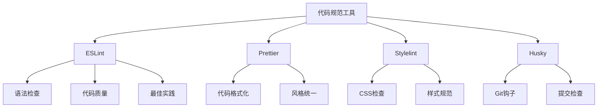

# 代码规范(ESLint-Prettier)

## 代码规范概述

### 代码规范工具


### 工具对比
| 工具 | 功能 | 配置复杂度 | 生态支持 |
|------|------|------------|----------|
| ESLint | 代码质量检查 | 中等 | 丰富 |
| Prettier | 代码格式化 | 低 | 广泛 |
| Stylelint | CSS代码检查 | 中等 | 良好 |
| Husky | Git钩子管理 | 低 | 简单 |

## ESLint

### 基础配置
```javascript
// .eslintrc.js
module.exports = {
  // 环境配置
  env: {
    browser: true,
    es2021: true,
    node: true,
    jest: true
  },
  
  // 扩展配置
  extends: [
    'eslint:recommended',
    '@typescript-eslint/recommended',
    'plugin:react/recommended',
    'plugin:react-hooks/recommended',
    'plugin:jsx-a11y/recommended'
  ],
  
  // 解析器配置
  parser: '@typescript-eslint/parser',
  parserOptions: {
    ecmaFeatures: {
      jsx: true
    },
    ecmaVersion: 12,
    sourceType: 'module'
  },
  
  // 插件
  plugins: [
    'react',
    'react-hooks',
    '@typescript-eslint',
    'jsx-a11y',
    'import'
  ],
  
  // 规则配置
  rules: {
    // 基础规则
    'no-console': 'warn',
    'no-debugger': 'error',
    'no-unused-vars': 'error',
    'prefer-const': 'error',
    'no-var': 'error',
    
    // TypeScript规则
    '@typescript-eslint/no-unused-vars': 'error',
    '@typescript-eslint/explicit-function-return-type': 'off',
    '@typescript-eslint/explicit-module-boundary-types': 'off',
    '@typescript-eslint/no-explicit-any': 'warn',
    
    // React规则
    'react/react-in-jsx-scope': 'off',
    'react/prop-types': 'off',
    'react-hooks/rules-of-hooks': 'error',
    'react-hooks/exhaustive-deps': 'warn',
    
    // 导入规则
    'import/order': [
      'error',
      {
        groups: [
          'builtin',
          'external',
          'internal',
          'parent',
          'sibling',
          'index'
        ],
        'newlines-between': 'always'
      }
    ]
  },
  
  // 设置
  settings: {
    react: {
      version: 'detect'
    }
  }
};
```

### 高级配置
```javascript
// .eslintrc.prod.js
module.exports = {
  extends: ['./.eslintrc.js'],
  
  rules: {
    // 生产环境严格规则
    'no-console': 'error',
    'no-debugger': 'error',
    'no-alert': 'error',
    'no-confirm': 'error',
    'no-prompt': 'error',
    
    // 性能相关规则
    'no-loop-func': 'error',
    'no-implied-eval': 'error',
    'no-new-func': 'error',
    
    // 安全相关规则
    'no-eval': 'error',
    'no-implied-eval': 'error',
    'no-new-func': 'error'
  }
};

// .eslintrc.dev.js
module.exports = {
  extends: ['./.eslintrc.js'],
  
  rules: {
    // 开发环境宽松规则
    'no-console': 'off',
    'no-debugger': 'warn',
    '@typescript-eslint/no-explicit-any': 'off',
    'no-unused-vars': 'warn'
  }
};

// .eslintrc.test.js
module.exports = {
  extends: ['./.eslintrc.js'],
  
  env: {
    jest: true
  },
  
  rules: {
    // 测试环境特殊规则
    '@typescript-eslint/no-explicit-any': 'off',
    'no-console': 'off'
  }
};
```

### 自定义规则
```javascript
// rules/custom-rules.js
module.exports = {
  rules: {
    'no-hardcoded-colors': {
      create(context) {
        return {
          Literal(node) {
            if (typeof node.value === 'string') {
              // 检查硬编码的颜色值
              const colorRegex = /^#[0-9A-Fa-f]{6}$|^#[0-9A-Fa-f]{3}$/;
              if (colorRegex.test(node.value)) {
                context.report({
                  node,
                  message: 'Avoid hardcoded colors. Use CSS variables or theme colors instead.'
                });
              }
            }
          }
        };
      }
    },
    
    'prefer-custom-hooks': {
      create(context) {
        return {
          CallExpression(node) {
            if (node.callee.name === 'useState' || node.callee.name === 'useEffect') {
              // 检查是否应该提取为自定义hook
              const parent = node.parent;
              if (parent && parent.type === 'VariableDeclarator') {
                context.report({
                  node,
                  message: 'Consider extracting this logic into a custom hook.'
                });
              }
            }
          }
        };
      }
    }
  }
};

// 使用自定义规则
module.exports = {
  plugins: ['./rules/custom-rules'],
  rules: {
    'custom-rules/no-hardcoded-colors': 'error',
    'custom-rules/prefer-custom-hooks': 'warn'
  }
};
```

### 配置文件管理
```javascript
// eslint.config.js (新格式)
import js from '@eslint/js';
import typescript from '@typescript-eslint/eslint-plugin';
import typescriptParser from '@typescript-eslint/parser';
import react from 'eslint-plugin-react';
import reactHooks from 'eslint-plugin-react-hooks';

export default [
  js.configs.recommended,
  {
    files: ['**/*.{js,jsx,ts,tsx}'],
    languageOptions: {
      parser: typescriptParser,
      parserOptions: {
        ecmaVersion: 'latest',
        sourceType: 'module',
        ecmaFeatures: {
          jsx: true
        }
      }
    },
    plugins: {
      '@typescript-eslint': typescript,
      react,
      'react-hooks': reactHooks
    },
    rules: {
      ...typescript.configs.recommended.rules,
      ...react.configs.recommended.rules,
      ...reactHooks.configs.recommended.rules,
      'no-console': 'warn',
      'no-debugger': 'error'
    },
    settings: {
      react: {
        version: 'detect'
      }
    }
  }
];
```

## Prettier

### 基础配置
```javascript
// .prettierrc.js
module.exports = {
  // 基础配置
  printWidth: 80,
  tabWidth: 2,
  useTabs: false,
  semi: true,
  singleQuote: true,
  quoteProps: 'as-needed',
  jsxSingleQuote: true,
  trailingComma: 'es5',
  bracketSpacing: true,
  bracketSameLine: false,
  arrowParens: 'avoid',
  endOfLine: 'lf',
  
  // 覆盖配置
  overrides: [
    {
      files: '*.json',
      options: {
        printWidth: 200
      }
    },
    {
      files: '*.md',
      options: {
        printWidth: 100,
        proseWrap: 'always'
      }
    }
  ]
};

// .prettierignore
node_modules/
dist/
build/
coverage/
*.min.js
*.min.css
package-lock.json
yarn.lock
```

### 高级配置
```javascript
// .prettierrc.prod.js
module.exports = {
  ...require('./.prettierrc.js'),
  
  // 生产环境配置
  printWidth: 100,
  semi: false,
  singleQuote: true,
  trailingComma: 'all',
  arrowParens: 'always'
};

// .prettierrc.dev.js
module.exports = {
  ...require('./.prettierrc.js'),
  
  // 开发环境配置
  printWidth: 120,
  semi: true,
  singleQuote: false
};
```

### 与ESLint集成
```javascript
// .eslintrc.js
module.exports = {
  extends: [
    'eslint:recommended',
    'plugin:prettier/recommended' // 集成Prettier
  ],
  
  rules: {
    // 关闭与Prettier冲突的规则
    'prettier/prettier': 'error',
    'indent': 'off',
    'quotes': 'off',
    'semi': 'off',
    'comma-dangle': 'off'
  }
};

// package.json
{
  "scripts": {
    "lint": "eslint . --ext .js,.jsx,.ts,.tsx",
    "lint:fix": "eslint . --ext .js,.jsx,.ts,.tsx --fix",
    "format": "prettier --write .",
    "format:check": "prettier --check .",
    "lint:format": "npm run lint:fix && npm run format"
  }
}
```

## Stylelint

### 基础配置
```javascript
// .stylelintrc.js
module.exports = {
  extends: [
    'stylelint-config-standard',
    'stylelint-config-prettier'
  ],
  
  plugins: [
    'stylelint-order',
    'stylelint-scss'
  ],
  
  rules: {
    // 基础规则
    'color-no-invalid-hex': true,
    'font-family-no-duplicate-names': true,
    'font-family-no-missing-generic-family-keyword': true,
    'function-calc-no-unspaced-operator': true,
    'string-no-newline': true,
    'unit-no-unknown': true,
    
    // 属性规则
    'property-no-unknown': true,
    'keyframe-declaration-no-important': true,
    'declaration-block-no-duplicate-properties': true,
    'declaration-block-no-redundant-longhand-properties': true,
    
    // 选择器规则
    'selector-pseudo-class-no-unknown': true,
    'selector-pseudo-element-no-unknown': true,
    'selector-type-no-unknown': true,
    
    // 值规则
    'function-linear-gradient-no-nonstandard-direction': true,
    
    // 媒体查询规则
    'media-feature-name-no-unknown': true,
    
    // 自定义规则
    'order/properties-alphabetical-order': true,
    'scss/at-rule-no-unknown': true
  }
};
```

### 高级配置
```javascript
// .stylelintrc.prod.js
module.exports = {
  extends: ['./.stylelintrc.js'],
  
  rules: {
    // 生产环境严格规则
    'color-no-hex': true,
    'color-named': 'never',
    'font-weight-notation': 'numeric',
    'function-url-no-scheme-relative': true,
    'keyframes-name-pattern': '^[a-z][a-zA-Z0-9]*$',
    'selector-class-pattern': '^[a-z][a-zA-Z0-9]*$'
  }
};

// .stylelintrc.dev.js
module.exports = {
  extends: ['./.stylelintrc.js'],
  
  rules: {
    // 开发环境宽松规则
    'color-no-hex': null,
    'color-named': null
  }
};
```

## Husky

### 基础配置
```javascript
// package.json
{
  "scripts": {
    "prepare": "husky install",
    "lint": "eslint . --ext .js,.jsx,.ts,.tsx",
    "lint:fix": "eslint . --ext .js,.jsx,.ts,.tsx --fix",
    "format": "prettier --write .",
    "test": "jest",
    "test:coverage": "jest --coverage"
  },
  "husky": {
    "hooks": {
      "pre-commit": "lint-staged",
      "pre-push": "npm run test"
    }
  },
  "lint-staged": {
    "*.{js,jsx,ts,tsx}": [
      "eslint --fix",
      "prettier --write"
    ],
    "*.{css,scss,less}": [
      "stylelint --fix",
      "prettier --write"
    ],
    "*.{json,md}": [
      "prettier --write"
    ]
  }
}

// .husky/pre-commit
#!/usr/bin/env sh
. "$(dirname -- "$0")/_/husky.sh"

npx lint-staged

// .husky/pre-push
#!/usr/bin/env sh
. "$(dirname -- "$0")/_/husky.sh"

npm run test

// .husky/commit-msg
#!/usr/bin/env sh
. "$(dirname -- "$0")/_/husky.sh"

npx commitlint --edit $1
```

### 高级配置
```javascript
// .huskyrc.js
module.exports = {
  hooks: {
    'pre-commit': 'lint-staged',
    'commit-msg': 'commitlint -E HUSKY_GIT_PARAMS',
    'pre-push': 'npm run test:coverage'
  }
};

// lint-staged.config.js
module.exports = {
  '*.{js,jsx,ts,tsx}': [
    'eslint --fix',
    'prettier --write',
    'git add'
  ],
  '*.{css,scss,less}': [
    'stylelint --fix',
    'prettier --write',
    'git add'
  ],
  '*.{json,md,yml,yaml}': [
    'prettier --write',
    'git add'
  ]
};
```

## 集成配置

### 完整配置示例
```javascript
// .eslintrc.js
module.exports = {
  env: {
    browser: true,
    es2021: true,
    node: true
  },
  extends: [
    'eslint:recommended',
    '@typescript-eslint/recommended',
    'plugin:react/recommended',
    'plugin:react-hooks/recommended',
    'plugin:jsx-a11y/recommended',
    'plugin:prettier/recommended'
  ],
  parser: '@typescript-eslint/parser',
  parserOptions: {
    ecmaFeatures: {
      jsx: true
    },
    ecmaVersion: 12,
    sourceType: 'module'
  },
  plugins: [
    'react',
    'react-hooks',
    '@typescript-eslint',
    'jsx-a11y',
    'import'
  ],
  rules: {
    'prettier/prettier': 'error',
    'no-console': 'warn',
    'no-debugger': 'error',
    'react/react-in-jsx-scope': 'off',
    'react/prop-types': 'off',
    '@typescript-eslint/no-unused-vars': 'error',
    'import/order': [
      'error',
      {
        groups: [
          'builtin',
          'external',
          'internal',
          'parent',
          'sibling',
          'index'
        ],
        'newlines-between': 'always'
      }
    ]
  },
  settings: {
    react: {
      version: 'detect'
    }
  }
};

// .prettierrc.js
module.exports = {
  printWidth: 80,
  tabWidth: 2,
  useTabs: false,
  semi: true,
  singleQuote: true,
  trailingComma: 'es5',
  bracketSpacing: true,
  arrowParens: 'avoid',
  endOfLine: 'lf'
};

// .stylelintrc.js
module.exports = {
  extends: [
    'stylelint-config-standard',
    'stylelint-config-prettier'
  ],
  plugins: ['stylelint-order'],
  rules: {
    'order/properties-alphabetical-order': true
  }
};

// package.json
{
  "scripts": {
    "lint": "eslint . --ext .js,.jsx,.ts,.tsx",
    "lint:fix": "eslint . --ext .js,.jsx,.ts,.tsx --fix",
    "format": "prettier --write .",
    "format:check": "prettier --check .",
    "stylelint": "stylelint '**/*.{css,scss,less}'",
    "stylelint:fix": "stylelint '**/*.{css,scss,less}' --fix",
    "lint:all": "npm run lint && npm run stylelint",
    "format:all": "npm run format && npm run stylelint:fix"
  }
}
```

## 相关链接
- [[03-应用实践层/04-工程化/01-构建工具(Webpack-Vite)]] - 构建工具
- [[03-应用实践层/04-工程化/03-包管理(npm-yarn-pnpm)]] - 包管理
- [[03-应用实践层/04-工程化/04-版本控制(Git)]] - 版本控制
- [[03-应用实践层/04-工程化/05-部署与CI-CD]] - 部署与CI/CD
