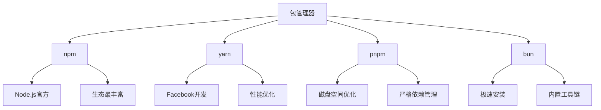

# 包管理(npm-yarn-pnpm)

## 包管理器概述

### 包管理器对比


### 特性对比
| 特性 | npm | yarn | pnpm | bun |
|------|-----|------|------|-----|
| 安装速度 | 中等 | 快 | 快 | 极快 |
| 磁盘占用 | 高 | 中等 | 低 | 低 |
| 依赖管理 | 宽松 | 严格 | 最严格 | 严格 |
| 生态支持 | 最丰富 | 丰富 | 良好 | 新兴 |
| 兼容性 | 最好 | 好 | 好 | 一般 |

## npm

### 基础使用
```bash
# 1. 初始化项目
npm init
npm init -y  # 使用默认配置

# 2. 安装依赖
npm install package-name
npm install package-name --save-dev  # 开发依赖
npm install package-name --save-optional  # 可选依赖
npm install package-name --save-peer  # 对等依赖

# 3. 全局安装
npm install -g package-name

# 4. 安装特定版本
npm install package-name@1.2.3
npm install package-name@^1.2.3  # 兼容版本
npm install package-name@~1.2.3  # 补丁版本
npm install package-name@latest  # 最新版本

# 5. 卸载依赖
npm uninstall package-name
npm uninstall -g package-name

# 6. 更新依赖
npm update
npm update package-name
npm outdated  # 查看过期依赖
```

### 配置文件
```json
// package.json
{
  "name": "my-project",
  "version": "1.0.0",
  "description": "项目描述",
  "main": "index.js",
  "scripts": {
    "start": "node index.js",
    "dev": "nodemon index.js",
    "test": "jest",
    "build": "webpack --mode production",
    "lint": "eslint .",
    "format": "prettier --write ."
  },
  "keywords": ["keyword1", "keyword2"],
  "author": "作者名",
  "license": "MIT",
  "dependencies": {
    "react": "^18.0.0",
    "react-dom": "^18.0.0"
  },
  "devDependencies": {
    "webpack": "^5.0.0",
    "eslint": "^8.0.0"
  },
  "peerDependencies": {
    "react": ">=16.8.0"
  },
  "optionalDependencies": {
    "fsevents": "^2.0.0"
  },
  "engines": {
    "node": ">=14.0.0",
    "npm": ">=6.0.0"
  },
  "browserslist": [
    "> 1%",
    "last 2 versions",
    "not dead"
  ]
}
```

### 高级配置
```bash
# 1. 配置npm源
npm config set registry https://registry.npmmirror.com
npm config get registry
npm config list

# 2. 发布包
npm login
npm publish
npm publish --access public  # 发布公开包
npm unpublish package-name@version  # 撤销发布

# 3. 包版本管理
npm version patch    # 1.0.0 -> 1.0.1
npm version minor    # 1.0.0 -> 1.1.0
npm version major    # 1.0.0 -> 2.0.0
npm version prerelease  # 1.0.0 -> 1.0.1-0

# 4. 工作区管理
npm init -w packages/package-a
npm install -w packages/package-a
npm run build --workspaces
```

### npm脚本
```json
// package.json scripts
{
  "scripts": {
    "preinstall": "echo '安装前执行'",
    "postinstall": "echo '安装后执行'",
    "prestart": "echo '启动前执行'",
    "start": "node server.js",
    "poststart": "echo '启动后执行'",
    "pretest": "echo '测试前执行'",
    "test": "jest",
    "posttest": "echo '测试后执行'",
    "build": "webpack --mode production",
    "build:dev": "webpack --mode development",
    "build:analyze": "webpack-bundle-analyzer dist/stats.json",
    "lint": "eslint . --ext .js,.jsx,.ts,.tsx",
    "lint:fix": "eslint . --ext .js,.jsx,.ts,.tsx --fix",
    "format": "prettier --write .",
    "format:check": "prettier --check .",
    "clean": "rimraf dist",
    "dev": "concurrently \"npm run dev:server\" \"npm run dev:client\"",
    "dev:server": "nodemon server.js",
    "dev:client": "webpack serve --mode development"
  }
}
```

## yarn

### 基础使用
```bash
# 1. 安装yarn
npm install -g yarn

# 2. 初始化项目
yarn init
yarn init -y

# 3. 安装依赖
yarn add package-name
yarn add package-name --dev
yarn add package-name --peer
yarn add package-name --optional

# 4. 全局安装
yarn global add package-name

# 5. 安装特定版本
yarn add package-name@1.2.3
yarn add package-name@^1.2.3

# 6. 卸载依赖
yarn remove package-name
yarn global remove package-name

# 7. 更新依赖
yarn upgrade
yarn upgrade package-name
yarn outdated
```

### 配置文件
```json
// package.json (yarn兼容)
{
  "name": "my-project",
  "version": "1.0.0",
  "private": true,
  "workspaces": [
    "packages/*",
    "apps/*"
  ],
  "scripts": {
    "start": "react-scripts start",
    "build": "react-scripts build",
    "test": "react-scripts test",
    "eject": "react-scripts eject"
  },
  "dependencies": {
    "react": "^18.2.0",
    "react-dom": "^18.2.0"
  },
  "devDependencies": {
    "react-scripts": "5.0.1"
  },
  "browserslist": {
    "production": [
      ">0.2%",
      "not dead",
      "not op_mini all"
    ],
    "development": [
      "last 1 chrome version",
      "last 1 firefox version",
      "last 1 safari version"
    ]
  }
}
```

### 高级功能
```bash
# 1. 工作区管理
yarn workspaces info
yarn workspace package-a add lodash
yarn workspaces run build

# 2. 缓存管理
yarn cache list
yarn cache clean
yarn cache dir

# 3. 依赖分析
yarn why package-name
yarn list --depth=0
yarn list --pattern "react*"

# 4. 版本管理
yarn version
yarn version --patch
yarn version --minor
yarn version --major

# 5. 发布包
yarn publish
yarn publish --access public
```

### yarn.lock文件
```yaml
# yarn.lock 示例
# THIS IS AN AUTOGENERATED FILE. DO NOT EDIT THIS FILE DIRECTLY.
# yarn lockfile v1

"@babel/code-frame@^7.0.0":
  version "7.12.11"
  resolved "https://registry.yarnpkg.com/@babel/code-frame/-/code-frame-7.12.11.tgz#f4ad435aa263db935b8d10e2b1683a3774c8f7cb"
  integrity sha512-Zt1yodBx1UcyiePMSkWnU4hPqhwq7hGi2nFL1LeA3EUl+q2LQx16MISgJ0+z7dnmgvP9QtIleuETGOiOH1RcIw==
  dependencies:
    "@babel/highlight" "^7.10.4"

"@babel/highlight@^7.10.4":
  version "7.14.5"
  resolved "https://registry.yarnpkg.com/@babel/highlight/-/highlight-7.14.5.tgz#6861a52f03966405001b6a534b08ac1e5201f64a"
  integrity sha512-qf9u2WFWVV0MppaL877j2dBtQHgbmN0OHAHhafy0SseK2Mx4O36tcei8ymo2dXofC4QfuwFB7uws4mfZ8VoqwWg==
  dependencies:
    "@babel/helper-validator-identifier" "^7.14.5"
    chalk "^2.0.0"
    js-tokens "^4.0.0"
```

## pnpm

### 基础使用
```bash
# 1. 安装pnpm
npm install -g pnpm

# 2. 初始化项目
pnpm init
pnpm init -y

# 3. 安装依赖
pnpm add package-name
pnpm add -D package-name  # 开发依赖
pnpm add -O package-name  # 可选依赖
pnpm add -P package-name  # 对等依赖

# 4. 全局安装
pnpm add -g package-name

# 5. 安装特定版本
pnpm add package-name@1.2.3
pnpm add package-name@latest

# 6. 卸载依赖
pnpm remove package-name
pnpm remove -g package-name

# 7. 更新依赖
pnpm update
pnpm update package-name
pnpm outdated
```

### 配置文件
```yaml
# .npmrc
# pnpm配置
shamefully-hoist=true
strict-peer-dependencies=false
auto-install-peers=true
save-exact=true
save-prefix=""
```

```json
// package.json
{
  "name": "my-project",
  "version": "1.0.0",
  "private": true,
  "packageManager": "pnpm@7.0.0",
  "engines": {
    "node": ">=16.0.0",
    "pnpm": ">=7.0.0"
  },
  "pnpm": {
    "overrides": {
      "react": "^18.0.0",
      "react-dom": "^18.0.0"
    },
    "peerDependencyRules": {
      "allowedVersions": {
        "react": "18"
      }
    }
  }
}
```

### 高级功能
```bash
# 1. 工作区管理
pnpm -r add lodash  # 所有工作区添加依赖
pnpm -r --filter package-a add lodash  # 特定工作区添加依赖
pnpm -r run build  # 所有工作区运行脚本

# 2. 依赖分析
pnpm why package-name
pnpm list
pnpm list --depth=0
pnpm list --filter package-a

# 3. 缓存管理
pnpm store path
pnpm store prune

# 4. 版本管理
pnpm version patch
pnpm version minor
pnpm version major

# 5. 发布包
pnpm publish
pnpm publish --access public
```

### pnpm-workspace.yaml
```yaml
# pnpm-workspace.yaml
packages:
  - 'packages/*'
  - 'apps/*'
  - 'tools/*'
  - '!**/test/**'
  - '!**/__tests__/**'
```

## 最佳实践

### 依赖管理策略
```json
// package.json 最佳实践
{
  "name": "my-project",
  "version": "1.0.0",
  "private": true,
  "packageManager": "pnpm@7.0.0",
  "engines": {
    "node": ">=16.0.0",
    "npm": ">=8.0.0"
  },
  "scripts": {
    "preinstall": "npx only-allow pnpm",
    "postinstall": "husky install",
    "dev": "vite",
    "build": "tsc && vite build",
    "preview": "vite preview",
    "test": "vitest",
    "test:ui": "vitest --ui",
    "test:coverage": "vitest --coverage",
    "lint": "eslint . --ext ts,tsx --report-unused-disable-directives --max-warnings 0",
    "lint:fix": "eslint . --ext ts,tsx --fix",
    "format": "prettier --write .",
    "format:check": "prettier --check .",
    "type-check": "tsc --noEmit",
    "clean": "rimraf dist node_modules/.cache",
    "prepare": "husky install"
  },
  "dependencies": {
    "react": "^18.2.0",
    "react-dom": "^18.2.0",
    "react-router-dom": "^6.8.0"
  },
  "devDependencies": {
    "@types/react": "^18.0.28",
    "@types/react-dom": "^18.0.11",
    "@typescript-eslint/eslint-plugin": "^5.57.0",
    "@typescript-eslint/parser": "^5.57.0",
    "@vitejs/plugin-react": "^3.1.0",
    "eslint": "^8.38.0",
    "eslint-plugin-react-hooks": "^4.6.0",
    "eslint-plugin-react-refresh": "^0.3.4",
    "husky": "^8.0.3",
    "lint-staged": "^13.2.0",
    "prettier": "^2.8.7",
    "rimraf": "^4.4.1",
    "typescript": "^5.0.2",
    "vite": "^4.2.0",
    "vitest": "^0.29.0"
  },
  "peerDependencies": {
    "react": ">=16.8.0",
    "react-dom": ">=16.8.0"
  },
  "browserslist": {
    "production": [
      ">0.2%",
      "not dead",
      "not op_mini all"
    ],
    "development": [
      "last 1 chrome version",
      "last 1 firefox version",
      "last 1 safari version"
    ]
  }
}
```

### 工作区配置
```yaml
# pnpm-workspace.yaml
packages:
  - 'packages/*'
  - 'apps/*'
  - 'tools/*'
  - '!**/test/**'
  - '!**/__tests__/**'
  - '!**/coverage/**'
  - '!**/dist/**'
  - '!**/build/**'
```

```json
// 根目录 package.json
{
  "name": "monorepo",
  "private": true,
  "packageManager": "pnpm@7.0.0",
  "scripts": {
    "build": "pnpm -r run build",
    "test": "pnpm -r run test",
    "lint": "pnpm -r run lint",
    "format": "pnpm -r run format",
    "clean": "pnpm -r run clean",
    "dev": "pnpm -r --parallel run dev"
  },
  "devDependencies": {
    "typescript": "^5.0.0",
    "eslint": "^8.0.0",
    "prettier": "^2.8.0"
  }
}
```

### 依赖锁定策略
```bash
# 1. 锁定依赖版本
npm config set save-exact true
yarn config set save-exact true
pnpm config set save-exact true

# 2. 定期更新依赖
npm audit
npm audit fix
yarn audit
yarn audit fix
pnpm audit
pnpm audit --fix

# 3. 依赖分析
npm ls --depth=0
yarn list --depth=0
pnpm list --depth=0

# 4. 清理缓存
npm cache clean --force
yarn cache clean
pnpm store prune
```

## 相关链接
- [[03-应用实践层/04-工程化/01-构建工具(Webpack-Vite)]] - 构建工具
- [[03-应用实践层/04-工程化/02-代码规范(ESLint-Prettier)]] - 代码规范
- [[03-应用实践层/04-工程化/04-版本控制(Git)]] - 版本控制
- [[03-应用实践层/04-工程化/05-部署与CI-CD]] - 部署与CI/CD
