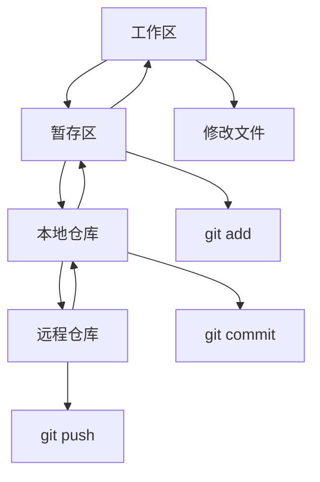

# 版本控制(Git)

## Git基础

### Git工作流程


### Git核心概念
| 概念 | 描述 | 命令 |
|------|------|------|
| 工作区 | 当前工作目录 | - |
| 暂存区 | 准备提交的文件 | `git add` |
| 本地仓库 | 本地版本历史 | `git commit` |
| 远程仓库 | 远程版本历史 | `git push/pull` |

## 基础操作

### 仓库管理
```bash
# 1. 初始化仓库
git init
git init --bare  # 裸仓库
git clone <url>  # 克隆仓库
git clone --depth 1 <url>  # 浅克隆

# 2. 配置用户信息
git config --global user.name "Your Name"
git config --global user.email "your.email@example.com"
git config --global init.defaultBranch main
git config --global core.editor "code --wait"
git config --global core.autocrlf true  # Windows
git config --global core.autocrlf input  # Mac/Linux

# 3. 查看配置
git config --list
git config --global --list
git config user.name
git config user.email

# 4. 仓库状态
git status
git status --short  # 简短格式
git status --porcelain  # 机器可读格式
```

### 文件操作
```bash
# 1. 添加文件
git add file.txt
git add .  # 添加所有文件
git add *.js  # 添加所有js文件
git add -A  # 添加所有文件（包括删除）
git add -u  # 只添加已跟踪的文件

# 2. 提交更改
git commit -m "提交信息"
git commit -am "提交信息"  # 添加并提交已跟踪文件
git commit --amend  # 修改最后一次提交
git commit --amend -m "新的提交信息"

# 3. 查看历史
git log
git log --oneline  # 单行显示
git log --graph  # 图形化显示
git log --all --graph --oneline  # 所有分支图形化
git log -p  # 显示差异
git log --stat  # 显示统计信息
git log --since="2023-01-01"  # 时间过滤
git log --author="John"  # 作者过滤
git log --grep="bug"  # 提交信息过滤

# 4. 查看文件差异
git diff  # 工作区与暂存区差异
git diff --staged  # 暂存区与最后一次提交差异
git diff HEAD  # 工作区与最后一次提交差异
git diff branch1..branch2  # 两个分支差异
git diff commit1..commit2  # 两个提交差异
```

### 分支管理
```bash
# 1. 创建分支
git branch feature-branch
git checkout -b feature-branch  # 创建并切换
git switch -c feature-branch  # 新语法

# 2. 切换分支
git checkout feature-branch
git switch feature-branch  # 新语法

# 3. 查看分支
git branch  # 本地分支
git branch -r  # 远程分支
git branch -a  # 所有分支
git branch -v  # 显示最后提交

# 4. 删除分支
git branch -d feature-branch  # 删除已合并分支
git branch -D feature-branch  # 强制删除
git push origin --delete feature-branch  # 删除远程分支

# 5. 合并分支
git merge feature-branch
git merge --no-ff feature-branch  # 禁用快进合并
git merge --squash feature-branch  # 压缩合并

# 6. 变基操作
git rebase main
git rebase -i HEAD~3  # 交互式变基
git rebase --continue  # 继续变基
git rebase --abort  # 中止变基
```

## 高级操作

### 撤销操作
```bash
# 1. 撤销工作区更改
git checkout -- file.txt  # 撤销单个文件
git checkout -- .  # 撤销所有文件
git restore file.txt  # 新语法
git restore .  # 新语法

# 2. 撤销暂存区更改
git reset HEAD file.txt  # 取消暂存
git reset HEAD .  # 取消所有暂存
git restore --staged file.txt  # 新语法

# 3. 撤销提交
git reset --soft HEAD~1  # 撤销提交，保留更改
git reset --mixed HEAD~1  # 撤销提交和暂存
git reset --hard HEAD~1  # 撤销提交、暂存和工作区
git revert HEAD  # 创建新提交撤销更改

# 4. 修改提交历史
git commit --amend  # 修改最后一次提交
git rebase -i HEAD~3  # 交互式修改提交历史
```

### 远程操作
```bash
# 1. 添加远程仓库
git remote add origin <url>
git remote add upstream <url>  # 上游仓库
git remote -v  # 查看远程仓库

# 2. 推送更改
git push origin main
git push -u origin main  # 设置上游分支
git push --all  # 推送所有分支
git push --tags  # 推送标签

# 3. 拉取更改
git pull origin main
git pull --rebase origin main  # 变基拉取
git fetch origin  # 只获取不合并
git fetch --all  # 获取所有远程

# 4. 同步远程分支
git fetch origin
git branch -r  # 查看远程分支
git checkout -b local-branch origin/remote-branch  # 创建本地分支跟踪远程分支
git branch --set-upstream-to=origin/main main  # 设置上游分支
```

### 标签管理
```bash
# 1. 创建标签
git tag v1.0.0  # 轻量标签
git tag -a v1.0.0 -m "版本1.0.0"  # 注释标签
git tag -a v1.0.0 commit-hash  # 为特定提交创建标签

# 2. 查看标签
git tag  # 列出所有标签
git tag -l "v1.*"  # 过滤标签
git show v1.0.0  # 显示标签信息

# 3. 推送标签
git push origin v1.0.0  # 推送单个标签
git push origin --tags  # 推送所有标签

# 4. 删除标签
git tag -d v1.0.0  # 删除本地标签
git push origin --delete v1.0.0  # 删除远程标签
```

## 工作流策略

### Git Flow
```bash
# 1. 初始化Git Flow
git flow init
git flow config

# 2. 功能开发
git flow feature start feature-name
git flow feature finish feature-name
git flow feature publish feature-name
git flow feature pull origin feature-name

# 3. 发布管理
git flow release start 1.0.0
git flow release finish 1.0.0
git flow release publish 1.0.0

# 4. 热修复
git flow hotfix start 1.0.1
git flow hotfix finish 1.0.1
```

### GitHub Flow
```bash
# 1. 创建功能分支
git checkout -b feature/new-feature
git push -u origin feature/new-feature

# 2. 开发功能
git add .
git commit -m "实现新功能"
git push

# 3. 创建Pull Request
# 在GitHub上创建PR

# 4. 合并后清理
git checkout main
git pull origin main
git branch -d feature/new-feature
git push origin --delete feature/new-feature
```

### GitLab Flow
```bash
# 1. 环境分支策略
git checkout -b feature/new-feature
git push -u origin feature/new-feature

# 2. 合并到主分支
git checkout main
git merge feature/new-feature
git push origin main

# 3. 部署到环境
git checkout staging
git merge main
git push origin staging

git checkout production
git merge main
git push origin production
```

## 高级技巧

### 子模块管理
```bash
# 1. 添加子模块
git submodule add <url> path/to/submodule
git submodule add https://github.com/user/repo.git libs/repo

# 2. 克隆包含子模块的项目
git clone --recursive <url>
# 或者
git clone <url>
git submodule init
git submodule update

# 3. 更新子模块
git submodule update --remote
git submodule foreach git pull origin main

# 4. 删除子模块
git submodule deinit path/to/submodule
git rm path/to/submodule
rm -rf .git/modules/path/to/submodule
```

### 钩子脚本
```bash
# 1. 客户端钩子
# .git/hooks/pre-commit
#!/bin/sh
npm run lint
if [ $? -ne 0 ]; then
  echo "Lint检查失败"
  exit 1
fi

# .git/hooks/commit-msg
#!/bin/sh
commit_regex='^(feat|fix|docs|style|refactor|test|chore)(\(.+\))?: .{1,50}'
if ! grep -qE "$commit_regex" "$1"; then
  echo "提交信息格式不正确"
  exit 1
fi

# 2. 服务器端钩子
# .git/hooks/pre-receive
#!/bin/sh
while read oldrev newrev refname; do
  if [ "$refname" = "refs/heads/main" ]; then
    # 检查主分支保护
    echo "主分支受保护"
    exit 1
  fi
done
```

### 高级配置
```bash
# 1. 别名配置
git config --global alias.st status
git config --global alias.co checkout
git config --global alias.br branch
git config --global alias.ci commit
git config --global alias.unstage 'reset HEAD --'
git config --global alias.last 'log -1 HEAD'
git config --global alias.visual '!gitk'

# 2. 高级别名
git config --global alias.lg "log --color --graph --pretty=format:'%Cred%h%Creset -%C(yellow)%d%Creset %s %Cgreen(%cr) %C(bold blue)<%an>%Creset' --abbrev-commit"
git config --global alias.amend "commit --amend --no-edit"
git config --global alias.wip "commit -am 'WIP'"
git config --global alias.unwip "reset HEAD~1"

# 3. 高级配置
git config --global core.autocrlf true
git config --global core.safecrlf true
git config --global core.ignorecase false
git config --global core.precomposeunicode true
git config --global core.quotepath false
git config --global core.editor "code --wait"
git config --global init.defaultBranch main
git config --global pull.rebase false
git config --global push.default simple
git config --global merge.tool vscode
git config --global diff.tool vscode
```

## 最佳实践

### 提交规范
```bash
# 1. 提交信息格式
# <type>(<scope>): <subject>
# 
# <body>
# 
# <footer>

# 2. 类型说明
# feat: 新功能
# fix: 修复bug
# docs: 文档更新
# style: 代码格式调整
# refactor: 代码重构
# test: 测试相关
# chore: 构建过程或辅助工具的变动

# 3. 示例
git commit -m "feat(auth): 添加用户登录功能

- 实现用户名密码登录
- 添加JWT令牌验证
- 支持记住登录状态

Closes #123"
```

### 分支命名规范
```bash
# 1. 分支类型
# feature/功能名称
# bugfix/问题描述
# hotfix/紧急修复
# release/版本号
# chore/任务描述

# 2. 示例
git checkout -b feature/user-authentication
git checkout -b bugfix/login-validation-error
git checkout -b hotfix/security-vulnerability
git checkout -b release/v1.2.0
git checkout -b chore/update-dependencies
```

### 工作流最佳实践
```bash
# 1. 日常开发流程
git checkout main
git pull origin main
git checkout -b feature/new-feature
# 开发功能
git add .
git commit -m "feat: 实现新功能"
git push -u origin feature/new-feature
# 创建Pull Request
# 代码审查
# 合并到主分支
git checkout main
git pull origin main
git branch -d feature/new-feature

# 2. 紧急修复流程
git checkout main
git pull origin main
git checkout -b hotfix/critical-bug
# 修复问题
git add .
git commit -m "fix: 修复严重bug"
git push -u origin hotfix/critical-bug
# 创建Pull Request
# 快速审查
# 合并到主分支
git checkout main
git pull origin main
git tag v1.0.1
git push origin v1.0.1
```

## 相关链接
- [[03-应用实践层/04-工程化/01-构建工具(Webpack-Vite)]] - 构建工具
- [[03-应用实践层/04-工程化/02-代码规范(ESLint-Prettier)]] - 代码规范
- [[03-应用实践层/04-工程化/03-包管理(npm-yarn-pnpm)]] - 包管理
- [[03-应用实践层/04-工程化/05-部署与CI-CD]] - 部署与CI/CD
