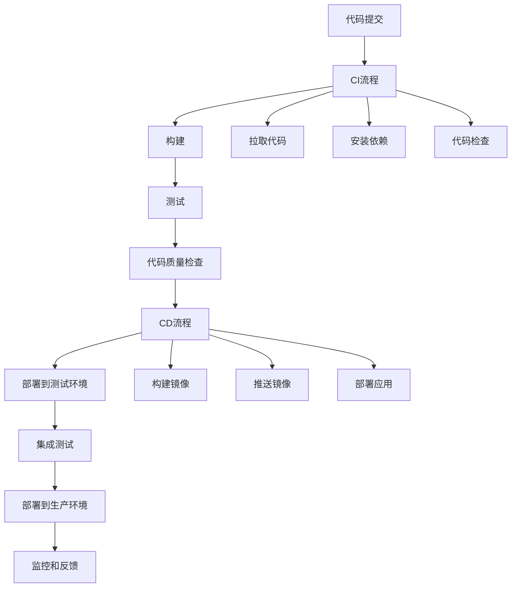

# 部署与CI-CD

## CI/CD概述

### CI/CD流程


### CI/CD工具对比
| 工具 | 类型 | 特点 | 适用场景 |
|------|------|------|----------|
| GitHub Actions | 云服务 | 与GitHub深度集成 | GitHub项目 |
| GitLab CI | 自托管/云 | 完整的DevOps平台 | 企业级项目 |
| Jenkins | 自托管 | 高度可定制 | 传统企业 |
| CircleCI | 云服务 | 快速构建 | 中小型项目 |
| Travis CI | 云服务 | 简单易用 | 开源项目 |

## GitHub Actions

### 基础配置
```yaml
# .github/workflows/ci.yml
name: CI/CD Pipeline

on:
  push:
    branches: [ main, develop ]
  pull_request:
    branches: [ main ]

jobs:
  test:
    runs-on: ubuntu-latest
    
    strategy:
      matrix:
        node-version: [16.x, 18.x, 20.x]
    
    steps:
    - name: Checkout code
      uses: actions/checkout@v3
      
    - name: Setup Node.js
      uses: actions/setup-node@v3
      with:
        node-version: ${{ matrix.node-version }}
        cache: 'npm'
        
    - name: Install dependencies
      run: npm ci
      
    - name: Run linter
      run: npm run lint
      
    - name: Run tests
      run: npm run test:coverage
      
    - name: Upload coverage
      uses: codecov/codecov-action@v3
      with:
        file: ./coverage/lcov.info

  build:
    needs: test
    runs-on: ubuntu-latest
    
    steps:
    - name: Checkout code
      uses: actions/checkout@v3
      
    - name: Setup Node.js
      uses: actions/setup-node@v3
      with:
        node-version: '18.x'
        cache: 'npm'
        
    - name: Install dependencies
      run: npm ci
      
    - name: Build application
      run: npm run build
      
    - name: Upload build artifacts
      uses: actions/upload-artifact@v3
      with:
        name: build-files
        path: dist/
```

### 高级配置
```yaml
# .github/workflows/deploy.yml
name: Deploy to Production

on:
  push:
    branches: [ main ]
    tags: [ 'v*' ]

env:
  NODE_VERSION: '18.x'
  REGISTRY: ghcr.io
  IMAGE_NAME: ${{ github.repository }}

jobs:
  build-and-push:
    runs-on: ubuntu-latest
    permissions:
      contents: read
      packages: write
    
    steps:
    - name: Checkout code
      uses: actions/checkout@v3
      
    - name: Setup Node.js
      uses: actions/setup-node@v3
      with:
        node-version: ${{ env.NODE_VERSION }}
        cache: 'npm'
        
    - name: Install dependencies
      run: npm ci
      
    - name: Run tests
      run: npm run test
      
    - name: Build application
      run: npm run build
      
    - name: Log in to Container Registry
      uses: docker/login-action@v2
      with:
        registry: ${{ env.REGISTRY }}
        username: ${{ github.actor }}
        password: ${{ secrets.GITHUB_TOKEN }}
        
    - name: Extract metadata
      id: meta
      uses: docker/metadata-action@v4
      with:
        images: ${{ env.REGISTRY }}/${{ env.IMAGE_NAME }}
        tags: |
          type=ref,event=branch
          type=ref,event=pr
          type=semver,pattern={{version}}
          type=semver,pattern={{major}}.{{minor}}
          type=raw,value=latest,enable={{is_default_branch}}
          
    - name: Build and push Docker image
      uses: docker/build-push-action@v4
      with:
        context: .
        push: true
        tags: ${{ steps.meta.outputs.tags }}
        labels: ${{ steps.meta.outputs.labels }}

  deploy:
    needs: build-and-push
    runs-on: ubuntu-latest
    if: github.ref == 'refs/heads/main'
    
    steps:
    - name: Deploy to production
      run: |
        echo "Deploying to production..."
        # 部署脚本
```

### 环境配置
```yaml
# .github/workflows/environments.yml
name: Environment Deployment

on:
  push:
    branches: [ main, develop ]

jobs:
  deploy-staging:
    runs-on: ubuntu-latest
    environment: staging
    
    steps:
    - name: Deploy to staging
      run: |
        echo "Deploying to staging environment..."
        # 部署到测试环境
        
  deploy-production:
    runs-on: ubuntu-latest
    environment: production
    needs: deploy-staging
    if: github.ref == 'refs/heads/main'
    
    steps:
    - name: Deploy to production
      run: |
        echo "Deploying to production environment..."
        # 部署到生产环境
```

## GitLab CI

### 基础配置
```yaml
# .gitlab-ci.yml
stages:
  - test
  - build
  - deploy

variables:
  NODE_VERSION: "18"
  DOCKER_DRIVER: overlay2
  DOCKER_TLS_CERTDIR: "/certs"

# 缓存配置
cache:
  paths:
    - node_modules/
    - .npm/

# 测试阶段
test:
  stage: test
  image: node:18-alpine
  
  before_script:
    - npm ci --cache .npm --prefer-offline
    
  script:
    - npm run lint
    - npm run test:coverage
    
  coverage: '/Lines\s*:\s*(\d+\.\d+)%/'
  
  artifacts:
    reports:
      coverage_report:
        coverage_format: cobertura
        path: coverage/cobertura-coverage.xml
    paths:
      - coverage/
    expire_in: 1 week

# 构建阶段
build:
  stage: build
  image: node:18-alpine
  
  before_script:
    - npm ci --cache .npm --prefer-offline
    
  script:
    - npm run build
    
  artifacts:
    paths:
      - dist/
    expire_in: 1 week
    
  only:
    - main
    - develop

# 部署到测试环境
deploy-staging:
  stage: deploy
  image: alpine:latest
  
  before_script:
    - apk add --no-cache curl
    
  script:
    - echo "Deploying to staging..."
    - curl -X POST "$STAGING_WEBHOOK_URL"
    
  environment:
    name: staging
    url: https://staging.example.com
    
  only:
    - develop

# 部署到生产环境
deploy-production:
  stage: deploy
  image: alpine:latest
  
  before_script:
    - apk add --no-cache curl
    
  script:
    - echo "Deploying to production..."
    - curl -X POST "$PRODUCTION_WEBHOOK_URL"
    
  environment:
    name: production
    url: https://example.com
    
  only:
    - main
  when: manual
```

### 高级配置
```yaml
# .gitlab-ci.yml
stages:
  - test
  - build
  - security
  - deploy

variables:
  NODE_VERSION: "18"
  DOCKER_IMAGE: $CI_REGISTRY_IMAGE:$CI_COMMIT_SHA

# 模板定义
.test_template: &test_template
  image: node:18-alpine
  before_script:
    - npm ci --cache .npm --prefer-offline
  cache:
    key: ${CI_COMMIT_REF_SLUG}
    paths:
      - node_modules/
      - .npm/

# 单元测试
unit-test:
  <<: *test_template
  stage: test
  script:
    - npm run test:unit
  coverage: '/Lines\s*:\s*(\d+\.\d+)%/'
  artifacts:
    reports:
      junit: test-results.xml
      coverage_report:
        coverage_format: cobertura
        path: coverage/cobertura-coverage.xml

# 集成测试
integration-test:
  <<: *test_template
  stage: test
  services:
    - postgres:13
    - redis:6
  variables:
    POSTGRES_DB: test_db
    POSTGRES_USER: test_user
    POSTGRES_PASSWORD: test_password
    REDIS_URL: redis://redis:6379
  script:
    - npm run test:integration

# 构建Docker镜像
build-docker:
  stage: build
  image: docker:20.10.16
  services:
    - docker:20.10.16-dind
  before_script:
    - docker login -u $CI_REGISTRY_USER -p $CI_REGISTRY_PASSWORD $CI_REGISTRY
  script:
    - docker build -t $DOCKER_IMAGE .
    - docker push $DOCKER_IMAGE
  only:
    - main
    - develop

# 安全扫描
security-scan:
  stage: security
  image: node:18-alpine
  before_script:
    - npm ci --cache .npm --prefer-offline
  script:
    - npm audit --audit-level moderate
    - npm run security-scan
  allow_failure: true
  only:
    - main
    - develop

# 部署到Kubernetes
deploy-k8s:
  stage: deploy
  image: bitnami/kubectl:latest
  before_script:
    - echo "$KUBECONFIG" | base64 -d > kubeconfig
    - export KUBECONFIG=kubeconfig
  script:
    - kubectl set image deployment/app app=$DOCKER_IMAGE
    - kubectl rollout status deployment/app
  environment:
    name: production
    url: https://example.com
  only:
    - main
  when: manual
```

## Jenkins

### 基础配置
```groovy
// Jenkinsfile
pipeline {
    agent any
    
    environment {
        NODE_VERSION = '18'
        DOCKER_IMAGE = 'myapp:latest'
        REGISTRY = 'myregistry.com'
    }
    
    stages {
        stage('Checkout') {
            steps {
                checkout scm
            }
        }
        
        stage('Install Dependencies') {
            steps {
                sh 'npm ci'
            }
        }
        
        stage('Lint') {
            steps {
                sh 'npm run lint'
            }
        }
        
        stage('Test') {
            steps {
                sh 'npm run test:coverage'
            }
            post {
                always {
                    publishHTML([
                        allowMissing: false,
                        alwaysLinkToLastBuild: true,
                        keepAll: true,
                        reportDir: 'coverage',
                        reportFiles: 'index.html',
                        reportName: 'Coverage Report'
                    ])
                }
            }
        }
        
        stage('Build') {
            steps {
                sh 'npm run build'
            }
        }
        
        stage('Build Docker Image') {
            steps {
                script {
                    def image = docker.build("${REGISTRY}/${DOCKER_IMAGE}")
                    docker.withRegistry("https://${REGISTRY}", 'registry-credentials') {
                        image.push()
                    }
                }
            }
        }
        
        stage('Deploy') {
            when {
                branch 'main'
            }
            steps {
                sh 'kubectl set image deployment/app app=${REGISTRY}/${DOCKER_IMAGE}'
                sh 'kubectl rollout status deployment/app'
            }
        }
    }
    
    post {
        always {
            cleanWs()
        }
        success {
            slackSend(
                channel: '#deployments',
                color: 'good',
                message: "✅ Deployment successful: ${env.JOB_NAME} - ${env.BUILD_NUMBER}"
            )
        }
        failure {
            slackSend(
                channel: '#deployments',
                color: 'danger',
                message: "❌ Deployment failed: ${env.JOB_NAME} - ${env.BUILD_NUMBER}"
            )
        }
    }
}
```

### 高级配置
```groovy
// Jenkinsfile.advanced
pipeline {
    agent none
    
    options {
        buildDiscarder(logRotator(numToKeepStr: '10'))
        timeout(time: 30, unit: 'MINUTES')
        timestamps()
        ansiColor('xterm')
    }
    
    environment {
        NODE_VERSION = '18'
        DOCKER_IMAGE = 'myapp:latest'
        REGISTRY = 'myregistry.com'
        KUBECONFIG = credentials('kubeconfig')
    }
    
    stages {
        stage('Parallel Tests') {
            parallel {
                stage('Unit Tests') {
                    agent {
                        docker {
                            image 'node:18-alpine'
                            args '-u root'
                        }
                    }
                    steps {
                        sh 'npm ci'
                        sh 'npm run test:unit'
                    }
                    post {
                        always {
                            publishTestResults testResultsPattern: 'test-results.xml'
                        }
                    }
                }
                
                stage('Integration Tests') {
                    agent {
                        docker {
                            image 'node:18-alpine'
                            args '-u root'
                        }
                    }
                    steps {
                        sh 'npm ci'
                        sh 'npm run test:integration'
                    }
                }
                
                stage('Security Scan') {
                    agent {
                        docker {
                            image 'node:18-alpine'
                            args '-u root'
                        }
                    }
                    steps {
                        sh 'npm ci'
                        sh 'npm audit --audit-level moderate'
                    }
                }
            }
        }
        
        stage('Build and Push') {
            agent any
            steps {
                script {
                    def image = docker.build("${REGISTRY}/${DOCKER_IMAGE}")
                    docker.withRegistry("https://${REGISTRY}", 'registry-credentials') {
                        image.push()
                        image.push("${env.BUILD_NUMBER}")
                    }
                }
            }
        }
        
        stage('Deploy to Staging') {
            agent any
            when {
                branch 'develop'
            }
            steps {
                script {
                    sh """
                        kubectl config use-context staging
                        kubectl set image deployment/app app=${REGISTRY}/${DOCKER_IMAGE}
                        kubectl rollout status deployment/app
                    """
                }
            }
        }
        
        stage('Deploy to Production') {
            agent any
            when {
                branch 'main'
            }
            steps {
                script {
                    sh """
                        kubectl config use-context production
                        kubectl set image deployment/app app=${REGISTRY}/${DOCKER_IMAGE}
                        kubectl rollout status deployment/app
                    """
                }
            }
        }
    }
    
    post {
        always {
            cleanWs()
        }
        success {
            slackSend(
                channel: '#deployments',
                color: 'good',
                message: "✅ Deployment successful: ${env.JOB_NAME} - ${env.BUILD_NUMBER}"
            )
        }
        failure {
            slackSend(
                channel: '#deployments',
                color: 'danger',
                message: "❌ Deployment failed: ${env.JOB_NAME} - ${env.BUILD_NUMBER}"
            )
        }
    }
}
```

## 部署策略

### 蓝绿部署
```yaml
# blue-green-deployment.yml
apiVersion: apps/v1
kind: Deployment
metadata:
  name: app-blue
spec:
  replicas: 3
  selector:
    matchLabels:
      app: myapp
      version: blue
  template:
    metadata:
      labels:
        app: myapp
        version: blue
    spec:
      containers:
      - name: app
        image: myapp:blue
        ports:
        - containerPort: 3000
---
apiVersion: apps/v1
kind: Deployment
metadata:
  name: app-green
spec:
  replicas: 3
  selector:
    matchLabels:
      app: myapp
      version: green
  template:
    metadata:
      labels:
        app: myapp
        version: green
    spec:
      containers:
      - name: app
        image: myapp:green
        ports:
        - containerPort: 3000
---
apiVersion: v1
kind: Service
metadata:
  name: app-service
spec:
  selector:
    app: myapp
    version: blue  # 默认指向蓝色版本
  ports:
  - port: 80
    targetPort: 3000
```

### 滚动部署
```yaml
# rolling-deployment.yml
apiVersion: apps/v1
kind: Deployment
metadata:
  name: app
spec:
  replicas: 5
  strategy:
    type: RollingUpdate
    rollingUpdate:
      maxUnavailable: 1
      maxSurge: 1
  selector:
    matchLabels:
      app: myapp
  template:
    metadata:
      labels:
        app: myapp
    spec:
      containers:
      - name: app
        image: myapp:latest
        ports:
        - containerPort: 3000
        readinessProbe:
          httpGet:
            path: /health
            port: 3000
          initialDelaySeconds: 5
          periodSeconds: 10
        livenessProbe:
          httpGet:
            path: /health
            port: 3000
          initialDelaySeconds: 15
          periodSeconds: 20
```

### 金丝雀部署
```yaml
# canary-deployment.yml
apiVersion: apps/v1
kind: Deployment
metadata:
  name: app-canary
spec:
  replicas: 1
  selector:
    matchLabels:
      app: myapp
      version: canary
  template:
    metadata:
      labels:
        app: myapp
        version: canary
    spec:
      containers:
      - name: app
        image: myapp:canary
        ports:
        - containerPort: 3000
---
apiVersion: v1
kind: Service
metadata:
  name: app-service
spec:
  selector:
    app: myapp
  ports:
  - port: 80
    targetPort: 3000
---
apiVersion: networking.istio.io/v1alpha3
kind: VirtualService
metadata:
  name: app-vs
spec:
  hosts:
  - app
  http:
  - match:
    - headers:
        canary:
          exact: "true"
    route:
    - destination:
        host: app
        subset: canary
  - route:
    - destination:
        host: app
        subset: stable
      weight: 90
    - destination:
        host: app
        subset: canary
      weight: 10
```

## 监控和日志

### 监控配置
```yaml
# monitoring.yml
apiVersion: v1
kind: ConfigMap
metadata:
  name: prometheus-config
data:
  prometheus.yml: |
    global:
      scrape_interval: 15s
    scrape_configs:
    - job_name: 'kubernetes-pods'
      kubernetes_sd_configs:
      - role: pod
      relabel_configs:
      - source_labels: [__meta_kubernetes_pod_annotation_prometheus_io_scrape]
        action: keep
        regex: true
      - source_labels: [__meta_kubernetes_pod_annotation_prometheus_io_path]
        action: replace
        target_label: __metrics_path__
        regex: (.+)
---
apiVersion: apps/v1
kind: Deployment
metadata:
  name: prometheus
spec:
  replicas: 1
  selector:
    matchLabels:
      app: prometheus
  template:
    metadata:
      labels:
        app: prometheus
    spec:
      containers:
      - name: prometheus
        image: prom/prometheus:latest
        ports:
        - containerPort: 9090
        volumeMounts:
        - name: config
          mountPath: /etc/prometheus
      volumes:
      - name: config
        configMap:
          name: prometheus-config
```

### 日志配置
```yaml
# logging.yml
apiVersion: v1
kind: ConfigMap
metadata:
  name: fluent-bit-config
data:
  fluent-bit.conf: |
    [SERVICE]
        Flush         1
        Log_Level     info
        Daemon        off
        Parsers_File  parsers.conf
        HTTP_Server   On
        HTTP_Listen   0.0.0.0
        HTTP_Port     2020

    [INPUT]
        Name              tail
        Path              /var/log/containers/*.log
        Parser            docker
        Tag               kube.*
        Refresh_Interval  5
        Mem_Buf_Limit     50MB
        Skip_Long_Lines   On

    [OUTPUT]
        Name  es
        Match *
        Host  elasticsearch
        Port  9200
        Index myapp-logs
        Type  _doc
---
apiVersion: apps/v1
kind: DaemonSet
metadata:
  name: fluent-bit
spec:
  selector:
    matchLabels:
      app: fluent-bit
  template:
    metadata:
      labels:
        app: fluent-bit
    spec:
      containers:
      - name: fluent-bit
        image: fluent/fluent-bit:latest
        volumeMounts:
        - name: config
          mountPath: /fluent-bit/etc
        - name: varlog
          mountPath: /var/log
        - name: varlibdockercontainers
          mountPath: /var/lib/docker/containers
          readOnly: true
      volumes:
      - name: config
        configMap:
          name: fluent-bit-config
      - name: varlog
        hostPath:
          path: /var/log
      - name: varlibdockercontainers
        hostPath:
          path: /var/lib/docker/containers
```

## 相关链接
- [[03-应用实践层/04-工程化/01-构建工具(Webpack-Vite)]] - 构建工具
- [[03-应用实践层/04-工程化/02-代码规范(ESLint-Prettier)]] - 代码规范
- [[03-应用实践层/04-工程化/03-包管理(npm-yarn-pnpm)]] - 包管理
- [[03-应用实践层/04-工程化/04-版本控制(Git)]] - 版本控制
