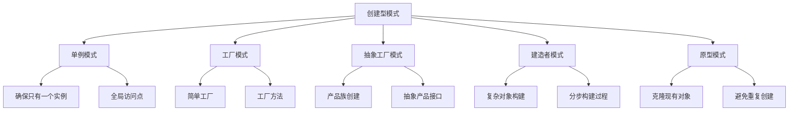

# 创建型模式

## 设计模式概述

### 创建型模式分类


### 模式选择指南
| 场景 | 推荐模式 | 原因 |
|------|----------|------|
| 需要唯一实例 | 单例模式 | 确保全局唯一性 |
| 创建逻辑复杂 | 工厂模式 | 封装创建过程 |
| 产品族创建 | 抽象工厂 | 支持产品族 |
| 复杂对象构建 | 建造者模式 | 分步构建 |
| 对象创建成本高 | 原型模式 | 克隆现有对象 |

## 单例模式

### 基本单例模式
```javascript
// 1. 基本单例实现
class BasicSingleton {
    constructor() {
        if (BasicSingleton.instance) {
            return BasicSingleton.instance;
        }
        
        this.data = 'singleton data';
        BasicSingleton.instance = this;
    }
    
    getData() {
        return this.data;
    }
    
    setData(data) {
        this.data = data;
    }
}

// 使用示例
const instance1 = new BasicSingleton();
const instance2 = new BasicSingleton();
console.log(instance1 === instance2); // true

// 2. 改进的单例模式
class ImprovedSingleton {
    constructor() {
        if (ImprovedSingleton.instance) {
            return ImprovedSingleton.instance;
        }
        
        this.initialized = false;
        this.data = null;
        ImprovedSingleton.instance = this;
    }
    
    async initialize(config) {
        if (this.initialized) {
            return;
        }
        
        // 模拟异步初始化
        await new Promise(resolve => setTimeout(resolve, 100));
        this.data = config;
        this.initialized = true;
    }
    
    getData() {
        if (!this.initialized) {
            throw new Error('Singleton not initialized');
        }
        return this.data;
    }
}

// 3. 模块化单例
const ModuleSingleton = (function() {
    let instance = null;
    
    class Singleton {
        constructor() {
            this.data = 'module singleton';
        }
        
        getData() {
            return this.data;
        }
    }
    
    return {
        getInstance: function() {
            if (!instance) {
                instance = new Singleton();
            }
            return instance;
        }
    };
})();

// 使用示例
const singleton1 = ModuleSingleton.getInstance();
const singleton2 = ModuleSingleton.getInstance();
console.log(singleton1 === singleton2); // true
```

### 高级单例模式
```javascript
// 1. 惰性单例
class LazySingleton {
    static getInstance() {
        if (!LazySingleton.instance) {
            LazySingleton.instance = new LazySingleton();
        }
        return LazySingleton.instance;
    }
    
    constructor() {
        this.data = 'lazy singleton';
    }
    
    getData() {
        return this.data;
    }
}

// 2. 线程安全的单例（模拟）
class ThreadSafeSingleton {
    static getInstance() {
        if (!ThreadSafeSingleton.instance) {
            // 模拟线程安全检查
            if (!ThreadSafeSingleton.instance) {
                ThreadSafeSingleton.instance = new ThreadSafeSingleton();
            }
        }
        return ThreadSafeSingleton.instance;
    }
    
    constructor() {
        this.data = 'thread safe singleton';
    }
}

// 3. 配置单例
class ConfigSingleton {
    static getInstance() {
        if (!ConfigSingleton.instance) {
            ConfigSingleton.instance = new ConfigSingleton();
        }
        return ConfigSingleton.instance;
    }
    
    constructor() {
        this.config = {
            apiUrl: 'https://api.example.com',
            timeout: 5000,
            retries: 3
        };
    }
    
    getConfig() {
        return { ...this.config };
    }
    
    updateConfig(newConfig) {
        this.config = { ...this.config, ...newConfig };
    }
}

// 4. 缓存单例
class CacheSingleton {
    static getInstance() {
        if (!CacheSingleton.instance) {
            CacheSingleton.instance = new CacheSingleton();
        }
        return CacheSingleton.instance;
    }
    
    constructor() {
        this.cache = new Map();
        this.maxSize = 100;
    }
    
    set(key, value) {
        if (this.cache.size >= this.maxSize) {
            const firstKey = this.cache.keys().next().value;
            this.cache.delete(firstKey);
        }
        this.cache.set(key, value);
    }
    
    get(key) {
        return this.cache.get(key);
    }
    
    has(key) {
        return this.cache.has(key);
    }
    
    clear() {
        this.cache.clear();
    }
}
```

## 工厂模式

### 简单工厂模式
```javascript
// 1. 基本简单工厂
class SimpleFactory {
    static createProduct(type) {
        switch (type) {
            case 'A':
                return new ProductA();
            case 'B':
                return new ProductB();
            case 'C':
                return new ProductC();
            default:
                throw new Error('Unknown product type');
        }
    }
}

class ProductA {
    constructor() {
        this.name = 'Product A';
    }
    
    operation() {
        return 'Operation A';
    }
}

class ProductB {
    constructor() {
        this.name = 'Product B';
    }
    
    operation() {
        return 'Operation B';
    }
}

class ProductC {
    constructor() {
        this.name = 'Product C';
    }
    
    operation() {
        return 'Operation C';
    }
}

// 使用示例
const productA = SimpleFactory.createProduct('A');
console.log(productA.operation()); // Operation A

// 2. 配置驱动的工厂
class ConfigurableFactory {
    constructor(config) {
        this.config = config;
    }
    
    createProduct(type) {
        const productConfig = this.config[type];
        if (!productConfig) {
            throw new Error(`Unknown product type: ${type}`);
        }
        
        return new productConfig.class(productConfig.options);
    }
}

// 3. 注册式工厂
class RegistryFactory {
    constructor() {
        this.products = new Map();
    }
    
    register(type, productClass) {
        this.products.set(type, productClass);
    }
    
    createProduct(type, ...args) {
        const ProductClass = this.products.get(type);
        if (!ProductClass) {
            throw new Error(`Unknown product type: ${type}`);
        }
        
        return new ProductClass(...args);
    }
}

// 使用示例
const factory = new RegistryFactory();
factory.register('button', class Button {
    constructor(text) {
        this.text = text;
    }
});
factory.register('input', class Input {
    constructor(placeholder) {
        this.placeholder = placeholder;
    }
});

const button = factory.createProduct('button', 'Click me');
const input = factory.createProduct('input', 'Enter text');
```

### 工厂方法模式
```javascript
// 1. 基本工厂方法
class Creator {
    createProduct() {
        throw new Error('This method must be implemented');
    }
    
    someOperation() {
        const product = this.createProduct();
        return `Creator: ${product.operation()}`;
    }
}

class ConcreteCreatorA extends Creator {
    createProduct() {
        return new ConcreteProductA();
    }
}

class ConcreteCreatorB extends Creator {
    createProduct() {
        return new ConcreteProductB();
    }
}

class Product {
    operation() {
        throw new Error('This method must be implemented');
    }
}

class ConcreteProductA extends Product {
    operation() {
        return 'ConcreteProductA operation';
    }
}

class ConcreteProductB extends Product {
    operation() {
        return 'ConcreteProductB operation';
    }
}

// 使用示例
const creatorA = new ConcreteCreatorA();
console.log(creatorA.someOperation()); // Creator: ConcreteProductA operation

// 2. 抽象工厂方法
class AbstractCreator {
    createProductA() {
        throw new Error('This method must be implemented');
    }
    
    createProductB() {
        throw new Error('This method must be implemented');
    }
    
    createProductFamily() {
        const productA = this.createProductA();
        const productB = this.createProductB();
        return { productA, productB };
    }
}

class ConcreteCreator1 extends AbstractCreator {
    createProductA() {
        return new ProductA1();
    }
    
    createProductB() {
        return new ProductB1();
    }
}

class ConcreteCreator2 extends AbstractCreator {
    createProductA() {
        return new ProductA2();
    }
    
    createProductB() {
        return new ProductB2();
    }
}

// 3. 参数化工厂方法
class ParameterizedCreator {
    createProduct(type) {
        switch (type) {
            case 'type1':
                return this.createType1Product();
            case 'type2':
                return this.createType2Product();
            default:
                throw new Error('Unknown product type');
        }
    }
    
    createType1Product() {
        return new Type1Product();
    }
    
    createType2Product() {
        return new Type2Product();
    }
}
```

## 抽象工厂模式

### 基本抽象工厂
```javascript
// 1. 基本抽象工厂
class AbstractFactory {
    createButton() {
        throw new Error('This method must be implemented');
    }
    
    createInput() {
        throw new Error('This method must be implemented');
    }
    
    createLabel() {
        throw new Error('This method must be implemented');
    }
}

class WindowsFactory extends AbstractFactory {
    createButton() {
        return new WindowsButton();
    }
    
    createInput() {
        return new WindowsInput();
    }
    
    createLabel() {
        return new WindowsLabel();
    }
}

class MacFactory extends AbstractFactory {
    createButton() {
        return new MacButton();
    }
    
    createInput() {
        return new MacInput();
    }
    
    createLabel() {
        return new MacLabel();
    }
}

// 产品类
class Button {
    render() {
        throw new Error('This method must be implemented');
    }
}

class WindowsButton extends Button {
    render() {
        return 'Windows Button';
    }
}

class MacButton extends Button {
    render() {
        return 'Mac Button';
    }
}

class Input {
    render() {
        throw new Error('This method must be implemented');
    }
}

class WindowsInput extends Input {
    render() {
        return 'Windows Input';
    }
}

class MacInput extends Input {
    render() {
        return 'Mac Input';
    }
}

class Label {
    render() {
        throw new Error('This method must be implemented');
    }
}

class WindowsLabel extends Label {
    render() {
        return 'Windows Label';
    }
}

class MacLabel extends Label {
    render() {
        return 'Mac Label';
    }
}

// 使用示例
function createUI(factory) {
    const button = factory.createButton();
    const input = factory.createInput();
    const label = factory.createLabel();
    
    return {
        button: button.render(),
        input: input.render(),
        label: label.render()
    };
}

const windowsUI = createUI(new WindowsFactory());
const macUI = createUI(new MacFactory());
```

### 高级抽象工厂
```javascript
// 1. 配置驱动的抽象工厂
class ConfigurableAbstractFactory {
    constructor(config) {
        this.config = config;
    }
    
    createProduct(type) {
        const productConfig = this.config[type];
        if (!productConfig) {
            throw new Error(`Unknown product type: ${type}`);
        }
        
        return new productConfig.class(productConfig.options);
    }
    
    createProductFamily(types) {
        const products = {};
        types.forEach(type => {
            products[type] = this.createProduct(type);
        });
        return products;
    }
}

// 2. 注册式抽象工厂
class RegistryAbstractFactory {
    constructor() {
        this.factories = new Map();
    }
    
    registerFactory(name, factory) {
        this.factories.set(name, factory);
    }
    
    getFactory(name) {
        const factory = this.factories.get(name);
        if (!factory) {
            throw new Error(`Unknown factory: ${name}`);
        }
        return factory;
    }
    
    createProduct(factoryName, productType) {
        const factory = this.getFactory(factoryName);
        return factory.createProduct(productType);
    }
}

// 3. 组合抽象工厂
class CompositeAbstractFactory {
    constructor(factories) {
        this.factories = factories;
    }
    
    createProduct(type) {
        for (const factory of this.factories) {
            try {
                return factory.createProduct(type);
            } catch (error) {
                // 继续尝试下一个工厂
                continue;
            }
        }
        throw new Error(`No factory can create product: ${type}`);
    }
    
    addFactory(factory) {
        this.factories.push(factory);
    }
    
    removeFactory(factory) {
        const index = this.factories.indexOf(factory);
        if (index > -1) {
            this.factories.splice(index, 1);
        }
    }
}
```

## 建造者模式

### 基本建造者模式
```javascript
// 1. 基本建造者模式
class Product {
    constructor() {
        this.parts = [];
    }
    
    addPart(part) {
        this.parts.push(part);
    }
    
    listParts() {
        return this.parts.join(', ');
    }
}

class Builder {
    buildPartA() {
        throw new Error('This method must be implemented');
    }
    
    buildPartB() {
        throw new Error('This method must be implemented');
    }
    
    buildPartC() {
        throw new Error('This method must be implemented');
    }
    
    getResult() {
        throw new Error('This method must be implemented');
    }
}

class ConcreteBuilder extends Builder {
    constructor() {
        super();
        this.product = new Product();
    }
    
    buildPartA() {
        this.product.addPart('Part A');
        return this;
    }
    
    buildPartB() {
        this.product.addPart('Part B');
        return this;
    }
    
    buildPartC() {
        this.product.addPart('Part C');
        return this;
    }
    
    getResult() {
        return this.product;
    }
}

class Director {
    constructor(builder) {
        this.builder = builder;
    }
    
    buildMinimalProduct() {
        return this.builder.buildPartA().getResult();
    }
    
    buildFullProduct() {
        return this.builder
            .buildPartA()
            .buildPartB()
            .buildPartC()
            .getResult();
    }
}

// 使用示例
const builder = new ConcreteBuilder();
const director = new Director(builder);

const minimalProduct = director.buildMinimalProduct();
const fullProduct = director.buildFullProduct();
```

### 高级建造者模式
```javascript
// 1. 流式建造者
class FluentBuilder {
    constructor() {
        this.product = new Product();
    }
    
    withPartA() {
        this.product.addPart('Part A');
        return this;
    }
    
    withPartB() {
        this.product.addPart('Part B');
        return this;
    }
    
    withPartC() {
        this.product.addPart('Part C');
        return this;
    }
    
    withCustomPart(part) {
        this.product.addPart(part);
        return this;
    }
    
    build() {
        return this.product;
    }
}

// 使用示例
const product = new FluentBuilder()
    .withPartA()
    .withPartB()
    .withCustomPart('Custom Part')
    .build();

// 2. 配置建造者
class ConfigBuilder {
    constructor() {
        this.config = {};
    }
    
    setApiUrl(url) {
        this.config.apiUrl = url;
        return this;
    }
    
    setTimeout(timeout) {
        this.config.timeout = timeout;
        return this;
    }
    
    setRetries(retries) {
        this.config.retries = retries;
        return this;
    }
    
    setHeaders(headers) {
        this.config.headers = headers;
        return this;
    }
    
    build() {
        return new ApiClient(this.config);
    }
}

class ApiClient {
    constructor(config) {
        this.config = config;
    }
    
    getConfig() {
        return this.config;
    }
}

// 使用示例
const apiClient = new ConfigBuilder()
    .setApiUrl('https://api.example.com')
    .setTimeout(5000)
    .setRetries(3)
    .setHeaders({ 'Content-Type': 'application/json' })
    .build();

// 3. 链式建造者
class ChainBuilder {
    constructor() {
        this.product = new Product();
    }
    
    add(part) {
        this.product.addPart(part);
        return this;
    }
    
    remove(part) {
        const index = this.product.parts.indexOf(part);
        if (index > -1) {
            this.product.parts.splice(index, 1);
        }
        return this;
    }
    
    clear() {
        this.product.parts = [];
        return this;
    }
    
    build() {
        return this.product;
    }
}

// 使用示例
const chainProduct = new ChainBuilder()
    .add('Part A')
    .add('Part B')
    .add('Part C')
    .remove('Part B')
    .build();
```

## 原型模式

### 基本原型模式
```javascript
// 1. 基本原型模式
class Prototype {
    clone() {
        throw new Error('This method must be implemented');
    }
}

class ConcretePrototype extends Prototype {
    constructor(data) {
        super();
        this.data = data;
    }
    
    clone() {
        return new ConcretePrototype(this.data);
    }
    
    getData() {
        return this.data;
    }
    
    setData(data) {
        this.data = data;
    }
}

// 使用示例
const original = new ConcretePrototype('original data');
const clone = original.clone();
console.log(clone.getData()); // original data

// 2. 深拷贝原型
class DeepPrototype {
    constructor(data) {
        this.data = data;
        this.nested = {
            value: 'nested value',
            array: [1, 2, 3]
        };
    }
    
    clone() {
        const cloned = new DeepPrototype();
        cloned.data = this.data;
        cloned.nested = JSON.parse(JSON.stringify(this.nested));
        return cloned;
    }
    
    getData() {
        return this.data;
    }
    
    getNested() {
        return this.nested;
    }
}

// 3. 原型注册表
class PrototypeRegistry {
    constructor() {
        this.prototypes = new Map();
    }
    
    register(name, prototype) {
        this.prototypes.set(name, prototype);
    }
    
    create(name) {
        const prototype = this.prototypes.get(name);
        if (!prototype) {
            throw new Error(`Unknown prototype: ${name}`);
        }
        return prototype.clone();
    }
    
    unregister(name) {
        this.prototypes.delete(name);
    }
}

// 使用示例
const registry = new PrototypeRegistry();
registry.register('button', new ConcretePrototype('button data'));
registry.register('input', new ConcretePrototype('input data'));

const button = registry.create('button');
const input = registry.create('input');
```

### 高级原型模式
```javascript
// 1. 混合原型
class MixedPrototype {
    constructor(data) {
        this.data = data;
        this.methods = {};
    }
    
    addMethod(name, method) {
        this.methods[name] = method;
    }
    
    clone() {
        const cloned = new MixedPrototype(this.data);
        cloned.methods = { ...this.methods };
        return cloned;
    }
    
    execute(name, ...args) {
        const method = this.methods[name];
        if (method) {
            return method.apply(this, args);
        }
        throw new Error(`Unknown method: ${name}`);
    }
}

// 2. 原型链
class PrototypeChain {
    constructor(data) {
        this.data = data;
        this.next = null;
    }
    
    setNext(next) {
        this.next = next;
        return next;
    }
    
    clone() {
        const cloned = new PrototypeChain(this.data);
        if (this.next) {
            cloned.next = this.next.clone();
        }
        return cloned;
    }
    
    getData() {
        return this.data;
    }
    
    getNext() {
        return this.next;
    }
}

// 3. 原型工厂
class PrototypeFactory {
    constructor() {
        this.prototypes = new Map();
    }
    
    register(name, prototype) {
        this.prototypes.set(name, prototype);
    }
    
    create(name, modifications = {}) {
        const prototype = this.prototypes.get(name);
        if (!prototype) {
            throw new Error(`Unknown prototype: ${name}`);
        }
        
        const cloned = prototype.clone();
        
        // 应用修改
        Object.keys(modifications).forEach(key => {
            if (cloned[key] !== undefined) {
                cloned[key] = modifications[key];
            }
        });
        
        return cloned;
    }
}

// 使用示例
const factory = new PrototypeFactory();
factory.register('user', new ConcretePrototype({ name: 'John', age: 30 }));

const user1 = factory.create('user');
const user2 = factory.create('user', { name: 'Jane', age: 25 });
```

## 相关链接
- [[04-高级精通层/01-设计模式/02-结构型模式]] - 结构型设计模式
- [[04-高级精通层/01-设计模式/03-行为型模式]] - 行为型设计模式
- [[04-高级精通层/01-设计模式/04-JavaScript特有模式]] - JavaScript特有模式
- [[04-高级精通层/01-设计模式/05-模式选择指南]] - 模式选择指南
- [[04-高级精通层/01-设计模式/06-代码示例库-设计模式]] - 代码示例
