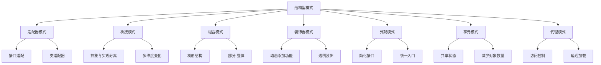

# 结构型模式

## 结构型模式概述

### 结构型模式分类


### 模式选择指南
| 场景 | 推荐模式 | 原因 |
|------|----------|------|
| 接口不兼容 | 适配器模式 | 转换接口 |
| 多维度变化 | 桥接模式 | 分离抽象与实现 |
| 树形结构 | 组合模式 | 统一处理 |
| 动态添加功能 | 装饰器模式 | 灵活扩展 |
| 简化复杂系统 | 外观模式 | 统一接口 |
| 大量相似对象 | 享元模式 | 共享状态 |
| 访问控制 | 代理模式 | 控制访问 |

## 适配器模式

### 基本适配器模式
```javascript
// 1. 类适配器
class Target {
    request() {
        return 'Target: The default target\'s behavior.';
    }
}

class Adaptee {
    specificRequest() {
        return '.eetpadA eht fo roivaheb laicepS';
    }
}

class Adapter extends Adaptee {
    request() {
        const result = this.specificRequest().split('').reverse().join('');
        return `Adapter: (TRANSLATED) ${result}`;
    }
}

// 使用示例
function clientCode(target) {
    console.log(target.request());
}

const target = new Target();
clientCode(target); // Target: The default target's behavior.

const adaptee = new Adaptee();
console.log(adaptee.specificRequest()); // .eetpadA eht fo roivaheb laicepS

const adapter = new Adapter();
clientCode(adapter); // Adapter: (TRANSLATED) Special behavior of the Adaptee.

// 2. 对象适配器
class ObjectAdapter {
    constructor(adaptee) {
        this.adaptee = adaptee;
    }
    
    request() {
        const result = this.adaptee.specificRequest().split('').reverse().join('');
        return `Adapter: (TRANSLATED) ${result}`;
    }
}

// 使用示例
const objectAdapter = new ObjectAdapter(new Adaptee());
clientCode(objectAdapter); // Adapter: (TRANSLATED) Special behavior of the Adaptee.

// 3. 接口适配器
class OldAPI {
    oldMethod() {
        return 'Old API method';
    }
}

class NewAPI {
    newMethod() {
        return 'New API method';
    }
}

class APIAdapter {
    constructor(oldAPI) {
        this.oldAPI = oldAPI;
    }
    
    newMethod() {
        return this.oldAPI.oldMethod();
    }
}

// 使用示例
const oldAPI = new OldAPI();
const adapter = new APIAdapter(oldAPI);
console.log(adapter.newMethod()); // Old API method
```

### 高级适配器模式
```javascript
// 1. 多接口适配器
class MultiInterfaceAdapter {
    constructor(adaptee) {
        this.adaptee = adaptee;
    }
    
    method1() {
        return this.adaptee.oldMethod1();
    }
    
    method2() {
        return this.adaptee.oldMethod2();
    }
    
    method3() {
        return this.adaptee.oldMethod3();
    }
}

// 2. 配置适配器
class ConfigurableAdapter {
    constructor(adaptee, config) {
        this.adaptee = adaptee;
        this.config = config;
    }
    
    request() {
        const result = this.adaptee.specificRequest();
        
        if (this.config.reverse) {
            return result.split('').reverse().join('');
        }
        
        if (this.config.uppercase) {
            return result.toUpperCase();
        }
        
        return result;
    }
}

// 3. 链式适配器
class ChainableAdapter {
    constructor(adaptee) {
        this.adaptee = adaptee;
        this.transformations = [];
    }
    
    addTransformation(transformation) {
        this.transformations.push(transformation);
        return this;
    }
    
    request() {
        let result = this.adaptee.specificRequest();
        
        this.transformations.forEach(transformation => {
            result = transformation(result);
        });
        
        return result;
    }
}

// 使用示例
const chainableAdapter = new ChainableAdapter(new Adaptee())
    .addTransformation(str => str.split('').reverse().join(''))
    .addTransformation(str => str.toUpperCase());

console.log(chainableAdapter.request());
```

## 桥接模式

### 基本桥接模式
```javascript
// 1. 基本桥接模式
class Abstraction {
    constructor(implementation) {
        this.implementation = implementation;
    }
    
    operation() {
        const result = this.implementation.operationImplementation();
        return `Abstraction: Base operation with:\n${result}`;
    }
}

class ExtendedAbstraction extends Abstraction {
    operation() {
        const result = this.implementation.operationImplementation();
        return `ExtendedAbstraction: Extended operation with:\n${result}`;
    }
}

class Implementation {
    operationImplementation() {
        throw new Error('This method must be implemented');
    }
}

class ConcreteImplementationA extends Implementation {
    operationImplementation() {
        return 'ConcreteImplementationA: Here\'s the result on the platform A.';
    }
}

class ConcreteImplementationB extends Implementation {
    operationImplementation() {
        return 'ConcreteImplementationB: Here\'s the result on the platform B.';
    }
}

// 使用示例
function clientCode(abstraction) {
    console.log(abstraction.operation());
}

const implementationA = new ConcreteImplementationA();
const abstraction = new Abstraction(implementationA);
clientCode(abstraction);

const implementationB = new ConcreteImplementationB();
const extendedAbstraction = new ExtendedAbstraction(implementationB);
clientCode(extendedAbstraction);

// 2. 形状和颜色桥接
class Shape {
    constructor(color) {
        this.color = color;
    }
    
    draw() {
        throw new Error('This method must be implemented');
    }
}

class Circle extends Shape {
    constructor(color, radius) {
        super(color);
        this.radius = radius;
    }
    
    draw() {
        return `Drawing a ${this.color.getColor()} circle with radius ${this.radius}`;
    }
}

class Rectangle extends Shape {
    constructor(color, width, height) {
        super(color);
        this.width = width;
        this.height = height;
    }
    
    draw() {
        return `Drawing a ${this.color.getColor()} rectangle ${this.width}x${this.height}`;
    }
}

class Color {
    getColor() {
        throw new Error('This method must be implemented');
    }
}

class RedColor extends Color {
    getColor() {
        return 'red';
    }
}

class BlueColor extends Color {
    getColor() {
        return 'blue';
    }
}

// 使用示例
const redColor = new RedColor();
const blueColor = new BlueColor();

const redCircle = new Circle(redColor, 5);
const blueRectangle = new Rectangle(blueColor, 10, 20);

console.log(redCircle.draw()); // Drawing a red circle with radius 5
console.log(blueRectangle.draw()); // Drawing a blue rectangle 10x20
```

### 高级桥接模式
```javascript
// 1. 多维度桥接
class MultiDimensionalBridge {
    constructor(implementation, configuration) {
        this.implementation = implementation;
        this.configuration = configuration;
    }
    
    operation() {
        const result = this.implementation.operationImplementation();
        const config = this.configuration.getConfiguration();
        return `${result} with configuration: ${config}`;
    }
}

class Configuration {
    getConfiguration() {
        throw new Error('This method must be implemented');
    }
}

class HighPerformanceConfig extends Configuration {
    getConfiguration() {
        return 'High Performance';
    }
}

class LowMemoryConfig extends Configuration {
    getConfiguration() {
        return 'Low Memory';
    }
}

// 2. 动态桥接
class DynamicBridge {
    constructor() {
        this.implementation = null;
    }
    
    setImplementation(implementation) {
        this.implementation = implementation;
    }
    
    operation() {
        if (!this.implementation) {
            throw new Error('No implementation set');
        }
        return this.implementation.operationImplementation();
    }
}

// 3. 桥接工厂
class BridgeFactory {
    static createAbstraction(implementationType, configurationType) {
        const implementation = this.createImplementation(implementationType);
        const configuration = this.createConfiguration(configurationType);
        return new MultiDimensionalBridge(implementation, configuration);
    }
    
    static createImplementation(type) {
        switch (type) {
            case 'A':
                return new ConcreteImplementationA();
            case 'B':
                return new ConcreteImplementationB();
            default:
                throw new Error('Unknown implementation type');
        }
    }
    
    static createConfiguration(type) {
        switch (type) {
            case 'high':
                return new HighPerformanceConfig();
            case 'low':
                return new LowMemoryConfig();
            default:
                throw new Error('Unknown configuration type');
        }
    }
}
```

## 组合模式

### 基本组合模式
```javascript
// 1. 基本组合模式
class Component {
    constructor(name) {
        this.name = name;
    }
    
    operation() {
        throw new Error('This method must be implemented');
    }
    
    add(component) {
        throw new Error('This method must be implemented');
    }
    
    remove(component) {
        throw new Error('This method must be implemented');
    }
    
    getChild(index) {
        throw new Error('This method must be implemented');
    }
}

class Leaf extends Component {
    constructor(name) {
        super(name);
    }
    
    operation() {
        return `Leaf: ${this.name}`;
    }
}

class Composite extends Component {
    constructor(name) {
        super(name);
        this.children = [];
    }
    
    add(component) {
        this.children.push(component);
    }
    
    remove(component) {
        const index = this.children.indexOf(component);
        if (index > -1) {
            this.children.splice(index, 1);
        }
    }
    
    getChild(index) {
        return this.children[index];
    }
    
    operation() {
        const results = [];
        for (const child of this.children) {
            results.push(child.operation());
        }
        return `Branch: ${this.name} (${results.join(', ')})`;
    }
}

// 使用示例
function clientCode(component) {
    console.log(component.operation());
}

const tree = new Composite('tree');
const branch1 = new Composite('branch1');
const branch2 = new Composite('branch2');

const leaf1 = new Leaf('leaf1');
const leaf2 = new Leaf('leaf2');
const leaf3 = new Leaf('leaf3');

branch1.add(leaf1);
branch1.add(leaf2);
branch2.add(leaf3);

tree.add(branch1);
tree.add(branch2);

clientCode(tree);

// 2. 文件系统组合
class FileSystemComponent {
    constructor(name) {
        this.name = name;
    }
    
    getName() {
        return this.name;
    }
    
    getSize() {
        throw new Error('This method must be implemented');
    }
    
    display(indent = 0) {
        throw new Error('This method must be implemented');
    }
}

class File extends FileSystemComponent {
    constructor(name, size) {
        super(name);
        this.size = size;
    }
    
    getSize() {
        return this.size;
    }
    
    display(indent = 0) {
        const spaces = '  '.repeat(indent);
        return `${spaces}File: ${this.name} (${this.size} bytes)`;
    }
}

class Directory extends FileSystemComponent {
    constructor(name) {
        super(name);
        this.children = [];
    }
    
    add(component) {
        this.children.push(component);
    }
    
    remove(component) {
        const index = this.children.indexOf(component);
        if (index > -1) {
            this.children.splice(index, 1);
        }
    }
    
    getSize() {
        let totalSize = 0;
        for (const child of this.children) {
            totalSize += child.getSize();
        }
        return totalSize;
    }
    
    display(indent = 0) {
        const spaces = '  '.repeat(indent);
        let result = `${spaces}Directory: ${this.name} (${this.getSize()} bytes)\n`;
        
        for (const child of this.children) {
            result += child.display(indent + 1) + '\n';
        }
        
        return result.trim();
    }
}

// 使用示例
const root = new Directory('root');
const documents = new Directory('documents');
const pictures = new Directory('pictures');

const file1 = new File('document1.txt', 1024);
const file2 = new File('document2.txt', 2048);
const image1 = new File('image1.jpg', 5120);

documents.add(file1);
documents.add(file2);
pictures.add(image1);

root.add(documents);
root.add(pictures);

console.log(root.display());
```

### 高级组合模式
```javascript
// 1. 安全组合模式
class SafeComponent {
    constructor(name) {
        this.name = name;
    }
    
    getName() {
        return this.name;
    }
    
    operation() {
        throw new Error('This method must be implemented');
    }
}

class SafeLeaf extends SafeComponent {
    constructor(name) {
        super(name);
    }
    
    operation() {
        return `Leaf: ${this.name}`;
    }
}

class SafeComposite extends SafeComponent {
    constructor(name) {
        super(name);
        this.children = [];
    }
    
    add(component) {
        this.children.push(component);
    }
    
    remove(component) {
        const index = this.children.indexOf(component);
        if (index > -1) {
            this.children.splice(index, 1);
        }
    }
    
    operation() {
        const results = [];
        for (const child of this.children) {
            results.push(child.operation());
        }
        return `Composite: ${this.name} [${results.join(', ')}]`;
    }
}

// 2. 透明组合模式
class TransparentComponent {
    constructor(name) {
        this.name = name;
        this.children = [];
    }
    
    getName() {
        return this.name;
    }
    
    add(component) {
        this.children.push(component);
    }
    
    remove(component) {
        const index = this.children.indexOf(component);
        if (index > -1) {
            this.children.splice(index, 1);
        }
    }
    
    operation() {
        const results = [];
        for (const child of this.children) {
            results.push(child.operation());
        }
        return results.length > 0 ? `Composite: ${this.name} [${results.join(', ')}]` : `Leaf: ${this.name}`;
    }
}

// 3. 组合迭代器
class CompositeIterator {
    constructor(component) {
        this.stack = [component];
    }
    
    hasNext() {
        return this.stack.length > 0;
    }
    
    next() {
        if (!this.hasNext()) {
            return null;
        }
        
        const component = this.stack.pop();
        
        if (component.children) {
            for (let i = component.children.length - 1; i >= 0; i--) {
                this.stack.push(component.children[i]);
            }
        }
        
        return component;
    }
}

// 使用示例
const composite = new SafeComposite('root');
const leaf1 = new SafeLeaf('leaf1');
const leaf2 = new SafeLeaf('leaf2');
const subComposite = new SafeComposite('sub');

subComposite.add(leaf1);
subComposite.add(leaf2);
composite.add(subComposite);

const iterator = new CompositeIterator(composite);
while (iterator.hasNext()) {
    const component = iterator.next();
    console.log(component.getName());
}
```

## 装饰器模式

### 基本装饰器模式
```javascript
// 1. 基本装饰器模式
class Component {
    operation() {
        throw new Error('This method must be implemented');
    }
}

class ConcreteComponent extends Component {
    operation() {
        return 'ConcreteComponent';
    }
}

class Decorator extends Component {
    constructor(component) {
        super();
        this.component = component;
    }
    
    operation() {
        return this.component.operation();
    }
}

class ConcreteDecoratorA extends Decorator {
    operation() {
        return `ConcreteDecoratorA(${super.operation()})`;
    }
}

class ConcreteDecoratorB extends Decorator {
    operation() {
        return `ConcreteDecoratorB(${super.operation()})`;
    }
}

// 使用示例
function clientCode(component) {
    console.log(`RESULT: ${component.operation()}`);
}

const simple = new ConcreteComponent();
clientCode(simple); // RESULT: ConcreteComponent

const decorator1 = new ConcreteDecoratorA(simple);
const decorator2 = new ConcreteDecoratorB(decorator1);
clientCode(decorator2); // RESULT: ConcreteDecoratorB(ConcreteDecoratorA(ConcreteComponent))

// 2. 咖啡装饰器
class Coffee {
    getCost() {
        return 10;
    }
    
    getDescription() {
        return 'Simple coffee';
    }
}

class CoffeeDecorator {
    constructor(coffee) {
        this.coffee = coffee;
    }
    
    getCost() {
        return this.coffee.getCost();
    }
    
    getDescription() {
        return this.coffee.getDescription();
    }
}

class MilkDecorator extends CoffeeDecorator {
    getCost() {
        return this.coffee.getCost() + 2;
    }
    
    getDescription() {
        return this.coffee.getDescription() + ', milk';
    }
}

class SugarDecorator extends CoffeeDecorator {
    getCost() {
        return this.coffee.getCost() + 1;
    }
    
    getDescription() {
        return this.coffee.getDescription() + ', sugar';
    }
}

// 使用示例
let coffee = new Coffee();
console.log(`${coffee.getDescription()}: $${coffee.getCost()}`);

coffee = new MilkDecorator(coffee);
console.log(`${coffee.getDescription()}: $${coffee.getCost()}`);

coffee = new SugarDecorator(coffee);
console.log(`${coffee.getDescription()}: $${coffee.getCost()}`);
```

### 高级装饰器模式
```javascript
// 1. 函数装饰器
function withLogging(fn) {
    return function(...args) {
        console.log(`Calling ${fn.name} with arguments:`, args);
        const result = fn.apply(this, args);
        console.log(`${fn.name} returned:`, result);
        return result;
    };
}

function withTiming(fn) {
    return function(...args) {
        const start = performance.now();
        const result = fn.apply(this, args);
        const end = performance.now();
        console.log(`${fn.name} took ${end - start} milliseconds`);
        return result;
    };
}

function withCaching(fn) {
    const cache = new Map();
    return function(...args) {
        const key = JSON.stringify(args);
        if (cache.has(key)) {
            console.log(`Cache hit for ${fn.name}`);
            return cache.get(key);
        }
        const result = fn.apply(this, args);
        cache.set(key, result);
        return result;
    };
}

// 使用示例
function expensiveCalculation(n) {
    let result = 0;
    for (let i = 0; i < n; i++) {
        result += Math.sqrt(i);
    }
    return result;
}

const decoratedFunction = withLogging(withTiming(withCaching(expensiveCalculation)));
decoratedFunction(1000);

// 2. 类装饰器
function withValidation(target) {
    return class extends target {
        constructor(...args) {
            super(...args);
            this.validate();
        }
        
        validate() {
            if (!this.name || this.name.length < 2) {
                throw new Error('Name must be at least 2 characters long');
            }
        }
    };
}

function withLogging(target) {
    const originalMethods = Object.getOwnPropertyNames(target.prototype);
    
    originalMethods.forEach(methodName => {
        if (methodName !== 'constructor' && typeof target.prototype[methodName] === 'function') {
            const originalMethod = target.prototype[methodName];
            target.prototype[methodName] = function(...args) {
                console.log(`Calling ${methodName} with args:`, args);
                const result = originalMethod.apply(this, args);
                console.log(`${methodName} returned:`, result);
                return result;
            };
        }
    });
    
    return target;
}

@withValidation
@withLogging
class User {
    constructor(name, email) {
        this.name = name;
        this.email = email;
    }
    
    getName() {
        return this.name;
    }
    
    getEmail() {
        return this.email;
    }
}

// 3. 属性装饰器
function readonly(target, propertyKey, descriptor) {
    descriptor.writable = false;
    return descriptor;
}

function validate(target, propertyKey, descriptor) {
    const originalSet = descriptor.set;
    
    descriptor.set = function(value) {
        if (typeof value !== 'string' || value.length < 2) {
            throw new Error(`${propertyKey} must be a string with at least 2 characters`);
        }
        originalSet.call(this, value);
    };
    
    return descriptor;
}

class Person {
    constructor(name) {
        this._name = name;
    }
    
    @readonly
    get id() {
        return Math.random().toString(36).substr(2, 9);
    }
    
    @validate
    get name() {
        return this._name;
    }
    
    set name(value) {
        this._name = value;
    }
}
```

## 外观模式

### 基本外观模式
```javascript
// 1. 基本外观模式
class Subsystem1 {
    operation1() {
        return 'Subsystem1: Ready!';
    }
    
    operationN() {
        return 'Subsystem1: Go!';
    }
}

class Subsystem2 {
    operation1() {
        return 'Subsystem2: Get ready!';
    }
    
    operationZ() {
        return 'Subsystem2: Fire!';
    }
}

class Facade {
    constructor(subsystem1, subsystem2) {
        this.subsystem1 = subsystem1 || new Subsystem1();
        this.subsystem2 = subsystem2 || new Subsystem2();
    }
    
    operation() {
        let result = 'Facade initializes subsystems:\n';
        result += this.subsystem1.operation1();
        result += '\n';
        result += this.subsystem2.operation1();
        result += '\n';
        result += 'Facade orders subsystems to perform the action:\n';
        result += this.subsystem1.operationN();
        result += '\n';
        result += this.subsystem2.operationZ();
        return result;
    }
}

// 使用示例
function clientCode(facade) {
    console.log(facade.operation());
}

const facade = new Facade();
clientCode(facade);

// 2. 多媒体外观
class AudioPlayer {
    play(audio) {
        return `Playing audio: ${audio}`;
    }
    
    stop() {
        return 'Audio stopped';
    }
}

class VideoPlayer {
    play(video) {
        return `Playing video: ${video}`;
    }
    
    stop() {
        return 'Video stopped';
    }
}

class Display {
    show(content) {
        return `Displaying: ${content}`;
    }
    
    hide() {
        return 'Display hidden';
    }
}

class MultimediaFacade {
    constructor() {
        this.audioPlayer = new AudioPlayer();
        this.videoPlayer = new VideoPlayer();
        this.display = new Display();
    }
    
    playMovie(movie) {
        const results = [];
        results.push(this.display.show(movie));
        results.push(this.videoPlayer.play(movie));
        results.push(this.audioPlayer.play(movie));
        return results.join('\n');
    }
    
    stopMovie() {
        const results = [];
        results.push(this.videoPlayer.stop());
        results.push(this.audioPlayer.stop());
        results.push(this.display.hide());
        return results.join('\n');
    }
}

// 使用示例
const multimedia = new MultimediaFacade();
console.log(multimedia.playMovie('The Matrix'));
console.log(multimedia.stopMovie());
```

### 高级外观模式
```javascript
// 1. 配置外观
class ConfigurableFacade {
    constructor(config) {
        this.config = config;
        this.subsystems = this.initializeSubsystems();
    }
    
    initializeSubsystems() {
        const subsystems = {};
        
        if (this.config.audio) {
            subsystems.audio = new AudioPlayer();
        }
        
        if (this.config.video) {
            subsystems.video = new VideoPlayer();
        }
        
        if (this.config.display) {
            subsystems.display = new Display();
        }
        
        return subsystems;
    }
    
    operation() {
        const results = [];
        
        if (this.subsystems.audio) {
            results.push(this.subsystems.audio.play('default audio'));
        }
        
        if (this.subsystems.video) {
            results.push(this.subsystems.video.play('default video'));
        }
        
        if (this.subsystems.display) {
            results.push(this.subsystems.display.show('default content'));
        }
        
        return results.join('\n');
    }
}

// 2. 动态外观
class DynamicFacade {
    constructor() {
        this.subsystems = new Map();
    }
    
    addSubsystem(name, subsystem) {
        this.subsystems.set(name, subsystem);
    }
    
    removeSubsystem(name) {
        this.subsystems.delete(name);
    }
    
    operation() {
        const results = [];
        
        for (const [name, subsystem] of this.subsystems) {
            if (typeof subsystem.operation === 'function') {
                results.push(`${name}: ${subsystem.operation()}`);
            }
        }
        
        return results.join('\n');
    }
}

// 3. 外观链
class FacadeChain {
    constructor() {
        this.facades = [];
    }
    
    addFacade(facade) {
        this.facades.push(facade);
    }
    
    operation() {
        const results = [];
        
        for (const facade of this.facades) {
            results.push(facade.operation());
        }
        
        return results.join('\n---\n');
    }
}
```

## 享元模式

### 基本享元模式
```javascript
// 1. 基本享元模式
class Flyweight {
    constructor(sharedState) {
        this.sharedState = sharedState;
    }
    
    operation(uniqueState) {
        const s = JSON.stringify(this.sharedState);
        const u = JSON.stringify(uniqueState);
        return `Flyweight: Displaying shared (${s}) and unique (${u}) state.`;
    }
}

class FlyweightFactory {
    constructor() {
        this.flyweights = new Map();
    }
    
    getFlyweight(sharedState) {
        const key = JSON.stringify(sharedState);
        
        if (!this.flyweights.has(key)) {
            console.log('FlyweightFactory: Can\'t find a flyweight, creating new one.');
            this.flyweights.set(key, new Flyweight(sharedState));
        } else {
            console.log('FlyweightFactory: Reusing existing flyweight.');
        }
        
        return this.flyweights.get(key);
    }
    
    listFlyweights() {
        const count = this.flyweights.size;
        console.log(`FlyweightFactory: I have ${count} flyweights:`);
        for (const key of this.flyweights.keys()) {
            console.log(key);
        }
    }
}

// 使用示例
function addCarToPoliceDatabase(factory, plates, owner, brand, model, color) {
    console.log('\nClient: Adding a car to database.');
    const flyweight = factory.getFlyweight([brand, model, color]);
    flyweight.operation([plates, owner]);
}

const factory = new FlyweightFactory();

addCarToPoliceDatabase(factory, 'CL234IR', 'James Doe', 'BMW', 'M5', 'red');
addCarToPoliceDatabase(factory, 'CL678IR', 'James Doe', 'BMW', 'X1', 'red');

factory.listFlyweights();

// 2. 文本编辑器享元
class Character {
    constructor(char, font, size, color) {
        this.char = char;
        this.font = font;
        this.size = size;
        this.color = color;
    }
    
    render() {
        return `<span style="font-family: ${this.font}; font-size: ${this.size}px; color: ${this.color}">${this.char}</span>`;
    }
}

class CharacterFactory {
    constructor() {
        this.characters = new Map();
    }
    
    getCharacter(char, font, size, color) {
        const key = `${char}-${font}-${size}-${color}`;
        
        if (!this.characters.has(key)) {
            this.characters.set(key, new Character(char, font, size, color));
        }
        
        return this.characters.get(key);
    }
    
    getCharacterCount() {
        return this.characters.size;
    }
}

// 使用示例
const charFactory = new CharacterFactory();
const text = 'Hello World';

let html = '';
for (const char of text) {
    const character = charFactory.getCharacter(char, 'Arial', 12, 'black');
    html += character.render();
}

console.log(html);
console.log(`Total characters: ${text.length}, Unique character objects: ${charFactory.getCharacterCount()}`);
```

### 高级享元模式
```javascript
// 1. 配置享元
class ConfigurableFlyweight {
    constructor(sharedState) {
        this.sharedState = sharedState;
    }
    
    operation(uniqueState, config = {}) {
        const result = {
            shared: this.sharedState,
            unique: uniqueState,
            config: config
        };
        return result;
    }
}

class ConfigurableFlyweightFactory {
    constructor() {
        this.flyweights = new Map();
    }
    
    getFlyweight(sharedState) {
        const key = JSON.stringify(sharedState);
        
        if (!this.flyweights.has(key)) {
            this.flyweights.set(key, new ConfigurableFlyweight(sharedState));
        }
        
        return this.flyweights.get(key);
    }
    
    getFlyweightCount() {
        return this.flyweights.size;
    }
}

// 2. 享元池
class FlyweightPool {
    constructor(maxSize = 100) {
        this.maxSize = maxSize;
        this.flyweights = new Map();
        this.accessOrder = [];
    }
    
    getFlyweight(key) {
        if (this.flyweights.has(key)) {
            // 更新访问顺序
            const index = this.accessOrder.indexOf(key);
            if (index > -1) {
                this.accessOrder.splice(index, 1);
            }
            this.accessOrder.push(key);
            return this.flyweights.get(key);
        }
        
        return null;
    }
    
    addFlyweight(key, flyweight) {
        if (this.flyweights.size >= this.maxSize) {
            // 移除最久未使用的享元
            const oldestKey = this.accessOrder.shift();
            this.flyweights.delete(oldestKey);
        }
        
        this.flyweights.set(key, flyweight);
        this.accessOrder.push(key);
    }
    
    getSize() {
        return this.flyweights.size;
    }
}

// 3. 享元组合
class CompositeFlyweight {
    constructor() {
        this.flyweights = new Map();
    }
    
    addFlyweight(key, flyweight) {
        this.flyweights.set(key, flyweight);
    }
    
    operation(uniqueState) {
        const results = [];
        
        for (const [key, flyweight] of this.flyweights) {
            results.push(flyweight.operation(uniqueState));
        }
        
        return results.join('\n');
    }
}
```

## 代理模式

### 基本代理模式
```javascript
// 1. 基本代理模式
class Subject {
    request() {
        throw new Error('This method must be implemented');
    }
}

class RealSubject extends Subject {
    request() {
        return 'RealSubject: Handling request.';
    }
}

class Proxy extends Subject {
    constructor(realSubject) {
        super();
        this.realSubject = realSubject;
    }
    
    request() {
        if (this.checkAccess()) {
            const result = this.realSubject.request();
            this.logAccess();
            return result;
        }
        return 'Proxy: Access denied.';
    }
    
    checkAccess() {
        console.log('Proxy: Checking access prior to firing a real request.');
        return true;
    }
    
    logAccess() {
        console.log('Proxy: Logging the time of request.');
    }
}

// 使用示例
function clientCode(subject) {
    console.log(subject.request());
}

const realSubject = new RealSubject();
clientCode(realSubject);

const proxy = new Proxy(realSubject);
clientCode(proxy);

// 2. 虚拟代理
class VirtualProxy {
    constructor() {
        this.realSubject = null;
    }
    
    request() {
        if (!this.realSubject) {
            console.log('VirtualProxy: Creating real subject...');
            this.realSubject = new RealSubject();
        }
        return this.realSubject.request();
    }
}

// 3. 保护代理
class ProtectionProxy {
    constructor(realSubject, user) {
        this.realSubject = realSubject;
        this.user = user;
    }
    
    request() {
        if (this.checkPermission()) {
            return this.realSubject.request();
        }
        return 'ProtectionProxy: Access denied.';
    }
    
    checkPermission() {
        return this.user.role === 'admin';
    }
}

// 使用示例
const admin = { role: 'admin' };
const user = { role: 'user' };

const adminProxy = new ProtectionProxy(realSubject, admin);
const userProxy = new ProtectionProxy(realSubject, user);

console.log(adminProxy.request()); // RealSubject: Handling request.
console.log(userProxy.request()); // ProtectionProxy: Access denied.
```

### 高级代理模式
```javascript
// 1. 缓存代理
class CacheProxy {
    constructor(realSubject) {
        this.realSubject = realSubject;
        this.cache = new Map();
    }
    
    request(key) {
        if (this.cache.has(key)) {
            console.log('CacheProxy: Returning cached result.');
            return this.cache.get(key);
        }
        
        const result = this.realSubject.request(key);
        this.cache.set(key, result);
        return result;
    }
    
    clearCache() {
        this.cache.clear();
    }
}

// 2. 日志代理
class LoggingProxy {
    constructor(realSubject) {
        this.realSubject = realSubject;
    }
    
    request(...args) {
        console.log(`LoggingProxy: Calling method with args: ${JSON.stringify(args)}`);
        const start = performance.now();
        
        const result = this.realSubject.request(...args);
        
        const end = performance.now();
        console.log(`LoggingProxy: Method completed in ${end - start}ms`);
        
        return result;
    }
}

// 3. 代理链
class ProxyChain {
    constructor(realSubject) {
        this.realSubject = realSubject;
        this.proxies = [];
    }
    
    addProxy(proxy) {
        this.proxies.push(proxy);
    }
    
    request(...args) {
        let current = this.realSubject;
        
        for (let i = this.proxies.length - 1; i >= 0; i--) {
            const proxy = this.proxies[i];
            proxy.realSubject = current;
            current = proxy;
        }
        
        return current.request(...args);
    }
}

// 使用示例
const realSubject = new RealSubject();
const cacheProxy = new CacheProxy(realSubject);
const loggingProxy = new LoggingProxy(cacheProxy);

const proxyChain = new ProxyChain(realSubject);
proxyChain.addProxy(cacheProxy);
proxyChain.addProxy(loggingProxy);

console.log(proxyChain.request('test'));
```

## 相关链接
- [[04-高级精通层/01-设计模式/01-创建型模式]] - 创建型设计模式
- [[04-高级精通层/01-设计模式/03-行为型模式]] - 行为型设计模式
- [[04-高级精通层/01-设计模式/04-JavaScript特有模式]] - JavaScript特有模式
- [[04-高级精通层/01-设计模式/05-模式选择指南]] - 模式选择指南
- [[04-高级精通层/01-设计模式/06-代码示例库-设计模式]] - 代码示例
