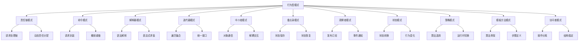

# 行为型模式

## 行为型模式概述

### 行为型模式分类


### 模式选择指南
| 场景 | 推荐模式 | 原因 |
|------|----------|------|
| 请求处理链 | 责任链模式 | 动态分配责任 |
| 需要撤销重做 | 命令模式 | 封装操作 |
| 语法解释 | 解释器模式 | 解释语言 |
| 遍历集合 | 迭代器模式 | 统一遍历接口 |
| 对象通信复杂 | 中介者模式 | 解耦对象 |
| 状态保存恢复 | 备忘录模式 | 保存对象状态 |
| 事件通知 | 观察者模式 | 发布订阅 |
| 状态驱动行为 | 状态模式 | 状态转换 |
| 算法选择 | 策略模式 | 运行时切换 |
| 算法骨架固定 | 模板方法模式 | 定义步骤 |
| 操作与结构分离 | 访问者模式 | 稳定结构 |

## 责任链模式

### 基本责任链模式
```javascript
// 1. 基本责任链模式
class Handler {
    setNext(handler) {
        this.next = handler;
        return handler;
    }
    
    handle(request) {
        if (this.next) {
            return this.next.handle(request);
        }
        return null;
    }
}

class AbstractHandler extends Handler {
    handle(request) {
        if (this.canHandle(request)) {
            return this.handleRequest(request);
        }
        return super.handle(request);
    }
    
    canHandle(request) {
        throw new Error('This method must be implemented');
    }
    
    handleRequest(request) {
        throw new Error('This method must be implemented');
    }
}

class MonkeyHandler extends AbstractHandler {
    canHandle(request) {
        return request === 'Banana';
    }
    
    handleRequest(request) {
        return `Monkey: I'll eat the ${request}.`;
    }
}

class SquirrelHandler extends AbstractHandler {
    canHandle(request) {
        return request === 'Nut';
    }
    
    handleRequest(request) {
        return `Squirrel: I'll eat the ${request}.`;
    }
}

class DogHandler extends AbstractHandler {
    canHandle(request) {
        return request === 'MeatBall';
    }
    
    handleRequest(request) {
        return `Dog: I'll eat the ${request}.`;
    }
}

// 使用示例
function clientCode(handler) {
    const foods = ['Nut', 'Banana', 'Cup of coffee'];
    
    for (const food of foods) {
        console.log(`Client: Who wants a ${food}?`);
        const result = handler.handle(food);
        if (result) {
            console.log(`  ${result}`);
        } else {
            console.log(`  ${food} was left untouched.`);
        }
    }
}

const monkey = new MonkeyHandler();
const squirrel = new SquirrelHandler();
const dog = new DogHandler();

monkey.setNext(squirrel).setNext(dog);

clientCode(monkey);

// 2. 审批流程责任链
class ApprovalHandler {
    setNext(handler) {
        this.next = handler;
        return handler;
    }
    
    handle(request) {
        if (this.canApprove(request)) {
            return this.approve(request);
        }
        
        if (this.next) {
            return this.next.handle(request);
        }
        
        return this.reject(request);
    }
    
    canApprove(request) {
        throw new Error('This method must be implemented');
    }
    
    approve(request) {
        return `${this.constructor.name}: Approved ${request.amount}`;
    }
    
    reject(request) {
        return `${this.constructor.name}: Rejected ${request.amount}`;
    }
}

class ManagerHandler extends ApprovalHandler {
    canApprove(request) {
        return request.amount <= 1000;
    }
}

class DirectorHandler extends ApprovalHandler {
    canApprove(request) {
        return request.amount <= 5000;
    }
}

class CEOHandler extends ApprovalHandler {
    canApprove(request) {
        return request.amount <= 10000;
    }
}

// 使用示例
const manager = new ManagerHandler();
const director = new DirectorHandler();
const ceo = new CEOHandler();

manager.setNext(director).setNext(ceo);

const requests = [
    { amount: 500, description: 'Office supplies' },
    { amount: 2500, description: 'Equipment' },
    { amount: 7500, description: 'Software license' },
    { amount: 15000, description: 'New office' }
];

requests.forEach(request => {
    console.log(manager.handle(request));
});
```

### 高级责任链模式
```javascript
// 1. 条件责任链
class ConditionalHandler {
    constructor(condition, handler) {
        this.condition = condition;
        this.handler = handler;
        this.next = null;
    }
    
    setNext(handler) {
        this.next = handler;
        return handler;
    }
    
    handle(request) {
        if (this.condition(request)) {
            return this.handler(request);
        }
        
        if (this.next) {
            return this.next.handle(request);
        }
        
        return null;
    }
}

// 2. 责任链构建器
class ChainBuilder {
    constructor() {
        this.handlers = [];
    }
    
    add(condition, handler) {
        this.handlers.push(new ConditionalHandler(condition, handler));
        return this;
    }
    
    build() {
        if (this.handlers.length === 0) {
            return null;
        }
        
        for (let i = 0; i < this.handlers.length - 1; i++) {
            this.handlers[i].setNext(this.handlers[i + 1]);
        }
        
        return this.handlers[0];
    }
}

// 使用示例
const chain = new ChainBuilder()
    .add(req => req.type === 'urgent', req => `Urgent: ${req.message}`)
    .add(req => req.type === 'normal', req => `Normal: ${req.message}`)
    .add(req => req.type === 'low', req => `Low: ${req.message}`)
    .build();

const requests = [
    { type: 'urgent', message: 'System down' },
    { type: 'normal', message: 'Feature request' },
    { type: 'low', message: 'Documentation update' }
];

requests.forEach(request => {
    console.log(chain.handle(request));
});
```

## 命令模式

### 基本命令模式
```javascript
// 1. 基本命令模式
class Command {
    execute() {
        throw new Error('This method must be implemented');
    }
    
    undo() {
        throw new Error('This method must be implemented');
    }
}

class SimpleCommand extends Command {
    constructor(payload) {
        super();
        this.payload = payload;
    }
    
    execute() {
        console.log(`SimpleCommand: See, I can do simple things like printing (${this.payload})`);
    }
    
    undo() {
        console.log(`SimpleCommand: Undoing (${this.payload})`);
    }
}

class ComplexCommand extends Command {
    constructor(receiver, a, b) {
        super();
        this.receiver = receiver;
        this.a = a;
        this.b = b;
    }
    
    execute() {
        console.log('ComplexCommand: Complex stuff should be done by a receiver object.');
        this.receiver.doSomething(this.a);
        this.receiver.doSomethingElse(this.b);
    }
    
    undo() {
        console.log('ComplexCommand: Undoing complex command.');
        this.receiver.undoSomething(this.a);
        this.receiver.undoSomethingElse(this.b);
    }
}

class Receiver {
    doSomething(a) {
        console.log(`Receiver: Working on (${a}.)`);
    }
    
    doSomethingElse(b) {
        console.log(`Receiver: Also working on (${b}.)`);
    }
    
    undoSomething(a) {
        console.log(`Receiver: Undoing (${a}.)`);
    }
    
    undoSomethingElse(b) {
        console.log(`Receiver: Undoing (${b}.)`);
    }
}

class Invoker {
    constructor() {
        this.history = [];
    }
    
    setOnStart(command) {
        this.onStart = command;
    }
    
    setOnFinish(command) {
        this.onFinish = command;
    }
    
    doSomethingImportant() {
        console.log('Invoker: Does anybody want something done before I begin?');
        if (this.onStart) {
            this.onStart.execute();
            this.history.push(this.onStart);
        }
        
        console.log('Invoker: ...doing something really important...');
        
        console.log('Invoker: Does anybody want something done after I finish?');
        if (this.onFinish) {
            this.onFinish.execute();
            this.history.push(this.onFinish);
        }
    }
    
    undoLast() {
        if (this.history.length > 0) {
            const lastCommand = this.history.pop();
            lastCommand.undo();
        }
    }
}

// 使用示例
const invoker = new Invoker();
const receiver = new Receiver();

invoker.setOnStart(new SimpleCommand('Say Hi!'));
invoker.setOnFinish(new ComplexCommand(receiver, 'Send email', 'Save report'));

invoker.doSomethingImportant();
invoker.undoLast();

// 2. 宏命令
class MacroCommand extends Command {
    constructor(commands) {
        super();
        this.commands = commands;
    }
    
    execute() {
        console.log('MacroCommand: Executing macro...');
        this.commands.forEach(command => command.execute());
    }
    
    undo() {
        console.log('MacroCommand: Undoing macro...');
        this.commands.reverse().forEach(command => command.undo());
        this.commands.reverse();
    }
}

// 使用示例
const macro = new MacroCommand([
    new SimpleCommand('First command'),
    new SimpleCommand('Second command'),
    new SimpleCommand('Third command')
]);

macro.execute();
macro.undo();
```

### 高级命令模式
```javascript
// 1. 命令队列
class CommandQueue {
    constructor() {
        this.queue = [];
        this.isProcessing = false;
    }
    
    add(command) {
        this.queue.push(command);
        if (!this.isProcessing) {
            this.process();
        }
    }
    
    async process() {
        this.isProcessing = true;
        
        while (this.queue.length > 0) {
            const command = this.queue.shift();
            try {
                await command.execute();
            } catch (error) {
                console.error('Command execution failed:', error);
            }
        }
        
        this.isProcessing = false;
    }
    
    clear() {
        this.queue = [];
    }
    
    getSize() {
        return this.queue.length;
    }
}

// 2. 可撤销命令
class UndoableCommand extends Command {
    constructor(receiver, action, value) {
        super();
        this.receiver = receiver;
        this.action = action;
        this.value = value;
        this.previousValue = null;
    }
    
    execute() {
        this.previousValue = this.receiver.getValue();
        this.receiver[this.action](this.value);
    }
    
    undo() {
        if (this.previousValue !== null) {
            this.receiver.setValue(this.previousValue);
        }
    }
}

class TextEditor {
    constructor() {
        this.text = '';
    }
    
    getValue() {
        return this.text;
    }
    
    setValue(value) {
        this.text = value;
    }
    
    append(text) {
        this.text += text;
    }
    
    delete(count) {
        this.text = this.text.slice(0, -count);
    }
}

// 使用示例
const editor = new TextEditor();
const queue = new CommandQueue();

queue.add(new UndoableCommand(editor, 'append', 'Hello '));
queue.add(new UndoableCommand(editor, 'append', 'World!'));
queue.add(new UndoableCommand(editor, 'delete', 6));

// 3. 命令模式与观察者模式结合
class CommandWithObserver extends Command {
    constructor(command, observers = []) {
        super();
        this.command = command;
        this.observers = observers;
    }
    
    execute() {
        this.notifyObservers('beforeExecute');
        const result = this.command.execute();
        this.notifyObservers('afterExecute', result);
        return result;
    }
    
    undo() {
        this.notifyObservers('beforeUndo');
        const result = this.command.undo();
        this.notifyObservers('afterUndo', result);
        return result;
    }
    
    addObserver(observer) {
        this.observers.push(observer);
    }
    
    removeObserver(observer) {
        const index = this.observers.indexOf(observer);
        if (index > -1) {
            this.observers.splice(index, 1);
        }
    }
    
    notifyObservers(event, data = null) {
        this.observers.forEach(observer => {
            if (typeof observer[event] === 'function') {
                observer[event](data);
            }
        });
    }
}
```

## 观察者模式

### 基本观察者模式
```javascript
// 1. 基本观察者模式
class Subject {
    constructor() {
        this.observers = [];
    }
    
    attach(observer) {
        this.observers.push(observer);
    }
    
    detach(observer) {
        const index = this.observers.indexOf(observer);
        if (index > -1) {
            this.observers.splice(index, 1);
        }
    }
    
    notify() {
        this.observers.forEach(observer => observer.update(this));
    }
}

class ConcreteSubject extends Subject {
    constructor() {
        super();
        this.state = null;
    }
    
    getState() {
        return this.state;
    }
    
    setState(state) {
        this.state = state;
        this.notify();
    }
}

class Observer {
    update(subject) {
        throw new Error('This method must be implemented');
    }
}

class ConcreteObserverA extends Observer {
    update(subject) {
        if (subject.getState() < 3) {
            console.log('ConcreteObserverA: Reacted to the event.');
        }
    }
}

class ConcreteObserverB extends Observer {
    update(subject) {
        if (subject.getState() === 0 || subject.getState() >= 2) {
            console.log('ConcreteObserverB: Reacted to the event.');
        }
    }
}

// 使用示例
const subject = new ConcreteSubject();
const observerA = new ConcreteObserverA();
const observerB = new ConcreteObserverB();

subject.attach(observerA);
subject.attach(observerB);

subject.setState(1);
subject.setState(2);

// 2. 发布订阅模式
class EventBus {
    constructor() {
        this.events = new Map();
    }
    
    subscribe(event, callback) {
        if (!this.events.has(event)) {
            this.events.set(event, []);
        }
        this.events.get(event).push(callback);
    }
    
    unsubscribe(event, callback) {
        if (this.events.has(event)) {
            const callbacks = this.events.get(event);
            const index = callbacks.indexOf(callback);
            if (index > -1) {
                callbacks.splice(index, 1);
            }
        }
    }
    
    publish(event, data) {
        if (this.events.has(event)) {
            this.events.get(event).forEach(callback => {
                callback(data);
            });
        }
    }
    
    once(event, callback) {
        const onceCallback = (data) => {
            callback(data);
            this.unsubscribe(event, onceCallback);
        };
        this.subscribe(event, onceCallback);
    }
}

// 使用示例
const eventBus = new EventBus();

eventBus.subscribe('user:login', (user) => {
    console.log(`User ${user.name} logged in`);
});

eventBus.subscribe('user:logout', (user) => {
    console.log(`User ${user.name} logged out`);
});

eventBus.publish('user:login', { name: 'John', id: 1 });
eventBus.publish('user:logout', { name: 'John', id: 1 });
```

### 高级观察者模式
```javascript
// 1. 观察者管理器
class ObserverManager {
    constructor() {
        this.observers = new Map();
    }
    
    addObserver(event, observer) {
        if (!this.observers.has(event)) {
            this.observers.set(event, []);
        }
        this.observers.get(event).push(observer);
    }
    
    removeObserver(event, observer) {
        if (this.observers.has(event)) {
            const eventObservers = this.observers.get(event);
            const index = eventObservers.indexOf(observer);
            if (index > -1) {
                eventObservers.splice(index, 1);
            }
        }
    }
    
    notify(event, data) {
        if (this.observers.has(event)) {
            this.observers.get(event).forEach(observer => {
                try {
                    observer.update(data);
                } catch (error) {
                    console.error('Observer error:', error);
                }
            });
        }
    }
    
    getObserverCount(event) {
        return this.observers.has(event) ? this.observers.get(event).length : 0;
    }
    
    clearObservers(event) {
        if (event) {
            this.observers.delete(event);
        } else {
            this.observers.clear();
        }
    }
}

// 2. 异步观察者
class AsyncObserver {
    constructor() {
        this.observers = [];
    }
    
    addObserver(observer) {
        this.observers.push(observer);
    }
    
    removeObserver(observer) {
        const index = this.observers.indexOf(observer);
        if (index > -1) {
            this.observers.splice(index, 1);
        }
    }
    
    async notify(data) {
        const promises = this.observers.map(observer => {
            return Promise.resolve(observer.update(data));
        });
        
        try {
            await Promise.all(promises);
        } catch (error) {
            console.error('Async observer error:', error);
        }
    }
}

// 3. 观察者模式与状态模式结合
class StatefulSubject {
    constructor() {
        this.observers = [];
        this.state = null;
    }
    
    setState(newState) {
        const oldState = this.state;
        this.state = newState;
        this.notify({ oldState, newState });
    }
    
    getState() {
        return this.state;
    }
    
    addObserver(observer) {
        this.observers.push(observer);
    }
    
    removeObserver(observer) {
        const index = this.observers.indexOf(observer);
        if (index > -1) {
            this.observers.splice(index, 1);
        }
    }
    
    notify(data) {
        this.observers.forEach(observer => {
            observer.update(data);
        });
    }
}

class StateObserver {
    constructor(name) {
        this.name = name;
    }
    
    update(data) {
        console.log(`${this.name}: State changed from ${data.oldState} to ${data.newState}`);
    }
}
```

## 状态模式

### 基本状态模式
```javascript
// 1. 基本状态模式
class State {
    handle(context) {
        throw new Error('This method must be implemented');
    }
}

class ConcreteStateA extends State {
    handle(context) {
        console.log('ConcreteStateA handles request.');
        context.setState(new ConcreteStateB());
    }
}

class ConcreteStateB extends State {
    handle(context) {
        console.log('ConcreteStateB handles request.');
        context.setState(new ConcreteStateA());
    }
}

class Context {
    constructor(state) {
        this.state = state;
    }
    
    setState(state) {
        this.state = state;
    }
    
    request() {
        this.state.handle(this);
    }
}

// 使用示例
const context = new Context(new ConcreteStateA());
context.request();
context.request();

// 2. 媒体播放器状态
class MediaPlayer {
    constructor() {
        this.state = new StoppedState();
    }
    
    setState(state) {
        this.state = state;
    }
    
    play() {
        this.state.play(this);
    }
    
    pause() {
        this.state.pause(this);
    }
    
    stop() {
        this.state.stop(this);
    }
}

class MediaState {
    play(player) {
        throw new Error('This method must be implemented');
    }
    
    pause(player) {
        throw new Error('This method must be implemented');
    }
    
    stop(player) {
        throw new Error('This method must be implemented');
    }
}

class StoppedState extends MediaState {
    play(player) {
        console.log('Starting playback...');
        player.setState(new PlayingState());
    }
    
    pause(player) {
        console.log('Cannot pause when stopped');
    }
    
    stop(player) {
        console.log('Already stopped');
    }
}

class PlayingState extends MediaState {
    play(player) {
        console.log('Already playing');
    }
    
    pause(player) {
        console.log('Pausing playback...');
        player.setState(new PausedState());
    }
    
    stop(player) {
        console.log('Stopping playback...');
        player.setState(new StoppedState());
    }
}

class PausedState extends MediaState {
    play(player) {
        console.log('Resuming playback...');
        player.setState(new PlayingState());
    }
    
    pause(player) {
        console.log('Already paused');
    }
    
    stop(player) {
        console.log('Stopping playback...');
        player.setState(new StoppedState());
    }
}

// 使用示例
const player = new MediaPlayer();
player.play();
player.pause();
player.play();
player.stop();
```

### 高级状态模式
```javascript
// 1. 状态机
class StateMachine {
    constructor(initialState) {
        this.state = initialState;
        this.transitions = new Map();
    }
    
    addTransition(fromState, event, toState) {
        if (!this.transitions.has(fromState)) {
            this.transitions.set(fromState, new Map());
        }
        this.transitions.get(fromState).set(event, toState);
    }
    
    transition(event) {
        if (this.transitions.has(this.state)) {
            const stateTransitions = this.transitions.get(this.state);
            if (stateTransitions.has(event)) {
                const oldState = this.state;
                this.state = stateTransitions.get(event);
                console.log(`State transition: ${oldState} -> ${this.state} (event: ${event})`);
                return true;
            }
        }
        console.log(`Invalid transition: ${this.state} -> ${event}`);
        return false;
    }
    
    getState() {
        return this.state;
    }
}

// 使用示例
const stateMachine = new StateMachine('idle');
stateMachine.addTransition('idle', 'start', 'running');
stateMachine.addTransition('running', 'pause', 'paused');
stateMachine.addTransition('paused', 'resume', 'running');
stateMachine.addTransition('running', 'stop', 'idle');
stateMachine.addTransition('paused', 'stop', 'idle');

stateMachine.transition('start');
stateMachine.transition('pause');
stateMachine.transition('resume');
stateMachine.transition('stop');

// 2. 状态模式与策略模式结合
class StatefulStrategy {
    constructor() {
        this.state = new InitialState();
    }
    
    setState(state) {
        this.state = state;
    }
    
    execute() {
        return this.state.execute(this);
    }
}

class StrategyState {
    execute(context) {
        throw new Error('This method must be implemented');
    }
}

class InitialState extends StrategyState {
    execute(context) {
        console.log('Initial state: Setting up...');
        context.setState(new ProcessingState());
        return 'initial';
    }
}

class ProcessingState extends StrategyState {
    execute(context) {
        console.log('Processing state: Working...');
        context.setState(new CompletedState());
        return 'processing';
    }
}

class CompletedState extends StrategyState {
    execute(context) {
        console.log('Completed state: Done!');
        return 'completed';
    }
}

// 使用示例
const statefulStrategy = new StatefulStrategy();
statefulStrategy.execute();
statefulStrategy.execute();
statefulStrategy.execute();
```

## 策略模式

### 基本策略模式
```javascript
// 1. 基本策略模式
class Strategy {
    execute(a, b) {
        throw new Error('This method must be implemented');
    }
}

class ConcreteStrategyA extends Strategy {
    execute(a, b) {
        return a + b;
    }
}

class ConcreteStrategyB extends Strategy {
    execute(a, b) {
        return a - b;
    }
}

class ConcreteStrategyC extends Strategy {
    execute(a, b) {
        return a * b;
    }
}

class Context {
    constructor(strategy) {
        this.strategy = strategy;
    }
    
    setStrategy(strategy) {
        this.strategy = strategy;
    }
    
    executeStrategy(a, b) {
        return this.strategy.execute(a, b);
    }
}

// 使用示例
const context = new Context(new ConcreteStrategyA());
console.log(context.executeStrategy(5, 3)); // 8

context.setStrategy(new ConcreteStrategyB());
console.log(context.executeStrategy(5, 3)); // 2

context.setStrategy(new ConcreteStrategyC());
console.log(context.executeStrategy(5, 3)); // 15

// 2. 排序策略
class SortStrategy {
    sort(array) {
        throw new Error('This method must be implemented');
    }
}

class BubbleSortStrategy extends SortStrategy {
    sort(array) {
        const arr = [...array];
        const n = arr.length;
        
        for (let i = 0; i < n - 1; i++) {
            for (let j = 0; j < n - i - 1; j++) {
                if (arr[j] > arr[j + 1]) {
                    [arr[j], arr[j + 1]] = [arr[j + 1], arr[j]];
                }
            }
        }
        
        return arr;
    }
}

class QuickSortStrategy extends SortStrategy {
    sort(array) {
        if (array.length <= 1) {
            return array;
        }
        
        const pivot = array[Math.floor(array.length / 2)];
        const left = array.filter(x => x < pivot);
        const middle = array.filter(x => x === pivot);
        const right = array.filter(x => x > pivot);
        
        return [...this.sort(left), ...middle, ...this.sort(right)];
    }
}

class MergeSortStrategy extends SortStrategy {
    sort(array) {
        if (array.length <= 1) {
            return array;
        }
        
        const middle = Math.floor(array.length / 2);
        const left = array.slice(0, middle);
        const right = array.slice(middle);
        
        return this.merge(this.sort(left), this.sort(right));
    }
    
    merge(left, right) {
        let result = [];
        let leftIndex = 0;
        let rightIndex = 0;
        
        while (leftIndex < left.length && rightIndex < right.length) {
            if (left[leftIndex] < right[rightIndex]) {
                result.push(left[leftIndex]);
                leftIndex++;
            } else {
                result.push(right[rightIndex]);
                rightIndex++;
            }
        }
        
        return result.concat(left.slice(leftIndex)).concat(right.slice(rightIndex));
    }
}

class Sorter {
    constructor(strategy) {
        this.strategy = strategy;
    }
    
    setStrategy(strategy) {
        this.strategy = strategy;
    }
    
    sort(array) {
        return this.strategy.sort(array);
    }
}

// 使用示例
const numbers = [64, 34, 25, 12, 22, 11, 90];
const sorter = new Sorter(new BubbleSortStrategy());

console.log('Bubble Sort:', sorter.sort(numbers));

sorter.setStrategy(new QuickSortStrategy());
console.log('Quick Sort:', sorter.sort(numbers));

sorter.setStrategy(new MergeSortStrategy());
console.log('Merge Sort:', sorter.sort(numbers));
```

### 高级策略模式
```javascript
// 1. 策略工厂
class StrategyFactory {
    static createStrategy(type) {
        switch (type) {
            case 'bubble':
                return new BubbleSortStrategy();
            case 'quick':
                return new QuickSortStrategy();
            case 'merge':
                return new MergeSortStrategy();
            default:
                throw new Error('Unknown strategy type');
        }
    }
}

// 2. 配置策略
class ConfigurableStrategy {
    constructor(config) {
        this.config = config;
    }
    
    execute(data) {
        const result = this.process(data);
        return this.format(result);
    }
    
    process(data) {
        throw new Error('This method must be implemented');
    }
    
    format(result) {
        if (this.config.uppercase) {
            return result.toUpperCase();
        }
        if (this.config.lowercase) {
            return result.toLowerCase();
        }
        return result;
    }
}

class TextProcessor extends ConfigurableStrategy {
    process(data) {
        return data.replace(/\s+/g, ' ').trim();
    }
}

class NumberProcessor extends ConfigurableStrategy {
    process(data) {
        return data.toString().replace(/\B(?=(\d{3})+(?!\d))/g, ',');
    }
}

// 3. 策略链
class StrategyChain {
    constructor() {
        this.strategies = [];
    }
    
    addStrategy(strategy) {
        this.strategies.push(strategy);
        return this;
    }
    
    execute(data) {
        let result = data;
        
        for (const strategy of this.strategies) {
            result = strategy.execute(result);
        }
        
        return result;
    }
}

// 使用示例
const chain = new StrategyChain()
    .addStrategy(new TextProcessor({ uppercase: true }))
    .addStrategy(new NumberProcessor({}));

const result = chain.execute('hello world 1234567');
console.log(result);
```

## 相关链接
- [[04-高级精通层/01-设计模式/01-创建型模式]] - 创建型设计模式
- [[04-高级精通层/01-设计模式/02-结构型模式]] - 结构型设计模式
- [[04-高级精通层/01-设计模式/04-JavaScript特有模式]] - JavaScript特有模式
- [[04-高级精通层/01-设计模式/05-模式选择指南]] - 模式选择指南
- [[04-高级精通层/01-设计模式/06-代码示例库-设计模式]] - 代码示例
