# JavaScript特有模式

## JavaScript模式概述

### JavaScript特有模式分类

```mermaid
graph TD
    A[JavaScript特有模式] --> B[模块模式]
    A --> C[命名空间模式]
    A --> D[混入模式]
    A --> E[函数式模式]
    A --> F[异步模式]
    A --> G[事件模式]
    A --> H[原型模式]
    A --> I[闭包模式]
    A --> J[回调模式]
    A --> K[Promise模式]
    A --> L[生成器模式]
    
    B --> B1[IIFE模块]
    B --> B2[CommonJS模块]
    B --> B3[ES6模块]
    
    C --> C1[对象命名空间]
    C --> C2[函数命名空间]
    
    D --> D1[对象混入]
    D --> D2[原型混入]
    
    E --> E1[高阶函数]
    E --> E2[函数组合]
    
    F --> F1[回调模式]
    F --> F2[Promise模式]
    F --> F3[async/await]
    
    G --> G1[发布订阅]
    G --> G2[事件委托]
    
    H --> H1[原型继承]
    H --> H2[原型扩展]
    
    I --> I1[私有变量]
    I --> I2[函数工厂]
    
    J --> J1[回调函数]
    J --> J2[回调地狱]
    
    K --> K1[Promise链]
    K --> K2[Promise组合]
    
    L --> L1[生成器函数]
    L --> L2[迭代器协议]
```


### JavaScript模式特点
| 模式类型 | 特点 | 适用场景 |
|----------|------|----------|
| 模块模式 | 封装、私有性 | 代码组织 |
| 命名空间 | 避免全局污染 | 大型应用 |
| 混入模式 | 代码复用 | 多重继承 |
| 函数式模式 | 纯函数、不可变 | 数据处理 |
| 异步模式 | 非阻塞、并发 | I/O操作 |
| 事件模式 | 解耦、响应式 | 用户交互 |
| 原型模式 | 继承、共享 | 对象创建 |
| 闭包模式 | 状态保持 | 私有数据 |

## 模块模式

### IIFE模块模式
```javascript
// 1. 基本IIFE模块
const MyModule = (function() {
    // 私有变量
    let privateVar = 'private';
    
    // 私有函数
    function privateFunction() {
        return 'private function';
    }
    
    // 公共接口
    return {
        publicMethod: function() {
            return privateFunction();
        },
        
        getPrivateVar: function() {
            return privateVar;
        },
        
        setPrivateVar: function(value) {
            privateVar = value;
        }
    };
})();

// 使用示例
console.log(MyModule.publicMethod()); // private function
console.log(MyModule.getPrivateVar()); // private

// 2. 增强模块模式
const EnhancedModule = (function(module) {
    // 添加新功能
    module.newMethod = function() {
        return 'new method';
    };
    
    // 扩展现有功能
    const originalMethod = module.publicMethod;
    module.publicMethod = function() {
        return originalMethod() + ' enhanced';
    };
    
    return module;
})(MyModule || {});

// 3. 松耦合模块
const LooseCouplingModule = (function(module, $) {
    // 依赖注入
    module.dom = $;
    module.ajax = function(url) {
        return $.ajax(url);
    };
    
    return module;
})(MyModule, jQuery);

// 4. 模块扩展
const ModuleExtension = (function() {
    const modules = {};
    
    function define(name, deps, impl) {
        for (let i = 0; i < deps.length; i++) {
            deps[i] = modules[deps[i]];
        }
        modules[name] = impl.apply(impl, deps);
    }
    
    function get(name) {
        return modules[name];
    }
    
    return {
        define: define,
        get: get
    };
})();

// 使用示例
ModuleExtension.define('bar', [], function() {
    function hello(who) {
        return 'Let me introduce: ' + who;
    }
    
    return {
        hello: hello
    };
});

ModuleExtension.define('foo', ['bar'], function(bar) {
    const hungry = 'hippo';
    
    function awesome() {
        console.log(bar.hello(hungry).toUpperCase());
    }
    
    return {
        awesome: awesome
    };
});

const bar = ModuleExtension.get('bar');
const foo = ModuleExtension.get('foo');
```

### 现代模块模式
```javascript
// 1. ES6模块模式
// math.js
export const PI = 3.14159;

export function add(a, b) {
    return a + b;
}

export function subtract(a, b) {
    return a - b;
}

export default class Calculator {
    multiply(a, b) {
        return a * b;
    }
    
    divide(a, b) {
        if (b === 0) {
            throw new Error('Division by zero');
        }
        return a / b;
    }
}

// main.js
import Calculator, { PI, add, subtract } from './math.js';

const calc = new Calculator();
console.log(calc.multiply(2, 3)); // 6
console.log(add(5, 3)); // 8
console.log(PI); // 3.14159

// 2. 动态模块加载
async function loadModule(moduleName) {
    try {
        const module = await import(`./modules/${moduleName}.js`);
        return module;
    } catch (error) {
        console.error(`Failed to load module: ${moduleName}`, error);
        return null;
    }
}

// 使用示例
const mathModule = await loadModule('math');
if (mathModule) {
    console.log(mathModule.add(1, 2));
}

// 3. 模块注册表
class ModuleRegistry {
    constructor() {
        this.modules = new Map();
    }
    
    register(name, module) {
        this.modules.set(name, module);
    }
    
    get(name) {
        return this.modules.get(name);
    }
    
    has(name) {
        return this.modules.has(name);
    }
    
    unregister(name) {
        this.modules.delete(name);
    }
    
    list() {
        return Array.from(this.modules.keys());
    }
}

// 使用示例
const registry = new ModuleRegistry();
registry.register('math', { add: (a, b) => a + b });
registry.register('utils', { format: (str) => str.toUpperCase() });

console.log(registry.get('math').add(1, 2)); // 3
```

## 命名空间模式

### 对象命名空间
```javascript
// 1. 基本命名空间
const MyApp = {
    namespace: function(name) {
        const parts = name.split('.');
        let current = this;
        
        for (let i = 0; i < parts.length; i++) {
            if (!current[parts[i]]) {
                current[parts[i]] = {};
            }
            current = current[parts[i]];
        }
        
        return current;
    }
};

// 创建命名空间
MyApp.namespace('Utils.String');
MyApp.namespace('Utils.Array');
MyApp.namespace('Components.Button');

// 添加功能
MyApp.Utils.String.trim = function(str) {
    return str.replace(/^\s+|\s+$/g, '');
};

MyApp.Utils.Array.unique = function(arr) {
    return [...new Set(arr)];
};

MyApp.Components.Button = function(text) {
    this.text = text;
    this.render = function() {
        return `<button>${this.text}</button>`;
    };
};

// 使用示例
console.log(MyApp.Utils.String.trim('  hello  ')); // hello
console.log(MyApp.Utils.Array.unique([1, 2, 2, 3])); // [1, 2, 3]

// 2. 命名空间管理器
class NamespaceManager {
    constructor() {
        this.namespaces = new Map();
    }
    
    create(namespace) {
        const parts = namespace.split('.');
        let current = this.namespaces;
        
        for (const part of parts) {
            if (!current.has(part)) {
                current.set(part, new Map());
            }
            current = current.get(part);
        }
        
        return current;
    }
    
    get(namespace) {
        const parts = namespace.split('.');
        let current = this.namespaces;
        
        for (const part of parts) {
            if (!current.has(part)) {
                return undefined;
            }
            current = current.get(part);
        }
        
        return current;
    }
    
    exists(namespace) {
        return this.get(namespace) !== undefined;
    }
    
    remove(namespace) {
        const parts = namespace.split('.');
        const lastPart = parts.pop();
        const parent = this.get(parts.join('.'));
        
        if (parent) {
            parent.delete(lastPart);
        }
    }
}

// 使用示例
const nsManager = new NamespaceManager();
nsManager.create('App.Utils.String');
nsManager.create('App.Utils.Array');

const stringUtils = nsManager.get('App.Utils.String');
stringUtils.set('trim', function(str) {
    return str.replace(/^\s+|\s+$/g, '');
});

// 3. 命名空间冲突检测
class ConflictDetector {
    constructor() {
        this.global = window;
    }
    
    checkConflict(namespace) {
        const parts = namespace.split('.');
        let current = this.global;
        
        for (const part of parts) {
            if (current[part] && typeof current[part] === 'object') {
                current = current[part];
            } else {
                return false;
            }
        }
        
        return true;
    }
    
    safeNamespace(namespace) {
        if (this.checkConflict(namespace)) {
            console.warn(`Namespace conflict detected: ${namespace}`);
            return false;
        }
        return true;
    }
}

// 使用示例
const detector = new ConflictDetector();
if (detector.safeNamespace('MyApp.Utils')) {
    // 安全创建命名空间
    MyApp.Utils = {};
}
```

## 混入模式

### 对象混入
```javascript
// 1. 基本对象混入
function mixin(target, ...sources) {
    sources.forEach(source => {
        Object.keys(source).forEach(key => {
            if (typeof source[key] === 'function') {
                target[key] = source[key];
            }
        });
    });
    return target;
}

// 混入对象
const canEat = {
    eat: function() {
        console.log('Eating...');
    }
};

const canWalk = {
    walk: function() {
        console.log('Walking...');
    }
};

const canSwim = {
    swim: function() {
        console.log('Swimming...');
    }
};

// 创建对象
const duck = {};
mixin(duck, canEat, canWalk, canSwim);

duck.eat(); // Eating...
duck.walk(); // Walking...
duck.swim(); // Swimming...

// 2. 深度混入
function deepMixin(target, source) {
    Object.keys(source).forEach(key => {
        if (source[key] && typeof source[key] === 'object' && !Array.isArray(source[key])) {
            if (!target[key]) {
                target[key] = {};
            }
            deepMixin(target[key], source[key]);
        } else {
            target[key] = source[key];
        }
    });
    return target;
}

// 使用示例
const config1 = {
    database: {
        host: 'localhost',
        port: 5432
    },
    cache: {
        enabled: true
    }
};

const config2 = {
    database: {
        password: 'secret'
    },
    cache: {
        ttl: 3600
    }
};

const mergedConfig = deepMixin({}, config1);
deepMixin(mergedConfig, config2);

console.log(mergedConfig);
// {
//     database: { host: 'localhost', port: 5432, password: 'secret' },
//     cache: { enabled: true, ttl: 3600 }
// }

// 3. 条件混入
function conditionalMixin(target, source, condition) {
    if (condition()) {
        Object.keys(source).forEach(key => {
            target[key] = source[key];
        });
    }
    return target;
}

// 使用示例
const debugMixin = {
    debug: function() {
        console.log('Debug info:', this);
    }
};

const productionMixin = {
    log: function() {
        // 生产环境日志
    }
};

const app = {};
conditionalMixin(app, debugMixin, () => process.env.NODE_ENV === 'development');
conditionalMixin(app, productionMixin, () => process.env.NODE_ENV === 'production');
```

### 原型混入
```javascript
// 1. 原型混入
function prototypeMixin(target, source) {
    Object.getOwnPropertyNames(source).forEach(name => {
        if (name !== 'constructor') {
            Object.defineProperty(target.prototype, name, Object.getOwnPropertyDescriptor(source, name));
        }
    });
    return target;
}

// 混入类
class CanEat {
    eat() {
        console.log('Eating...');
    }
}

class CanWalk {
    walk() {
        console.log('Walking...');
    }
}

class CanSwim {
    swim() {
        console.log('Swimming...');
    }
}

// 目标类
class Animal {
    constructor(name) {
        this.name = name;
    }
}

// 应用混入
prototypeMixin(Animal, CanEat);
prototypeMixin(Animal, CanWalk);
prototypeMixin(Animal, CanSwim);

// 使用示例
const duck = new Animal('Duck');
duck.eat(); // Eating...
duck.walk(); // Walking...
duck.swim(); // Swimming...

// 2. 多重继承混入
class MixinBuilder {
    constructor(superclass) {
        this.superclass = superclass;
    }
    
    with(...mixins) {
        return mixins.reduce((c, mixin) => mixin(c), this.superclass);
    }
}

// 混入函数
const CanEatMixin = (Base) => class extends Base {
    eat() {
        console.log('Eating...');
    }
};

const CanWalkMixin = (Base) => class extends Base {
    walk() {
        console.log('Walking...');
    }
};

const CanSwimMixin = (Base) => class extends Base {
    swim() {
        console.log('Swimming...');
    }
};

// 基础类
class Animal {
    constructor(name) {
        this.name = name;
    }
}

// 创建混入类
const Duck = new MixinBuilder(Animal)
    .with(CanEatMixin, CanWalkMixin, CanSwimMixin);

// 使用示例
const duck = new Duck('Donald');
duck.eat(); // Eating...
duck.walk(); // Walking...
duck.swim(); // Swimming...

// 3. 混入组合
class MixinComposer {
    constructor() {
        this.mixins = [];
    }
    
    add(mixin) {
        this.mixins.push(mixin);
        return this;
    }
    
    compose(baseClass) {
        return this.mixins.reduce((current, mixin) => mixin(current), baseClass);
    }
}

// 使用示例
const composer = new MixinComposer()
    .add(CanEatMixin)
    .add(CanWalkMixin)
    .add(CanSwimMixin);

const EnhancedAnimal = composer.compose(Animal);
const enhancedDuck = new EnhancedAnimal('Enhanced Duck');
enhancedDuck.eat();
enhancedDuck.walk();
enhancedDuck.swim();
```

## 函数式模式

### 高阶函数模式
```javascript
// 1. 函数工厂
function createValidator(rule) {
    return function(value) {
        return rule(value);
    };
}

// 验证规则
const isRequired = createValidator(value => value !== null && value !== undefined && value !== '');
const isEmail = createValidator(value => /^[^\s@]+@[^\s@]+\.[^\s@]+$/.test(value));
const isMinLength = (min) => createValidator(value => value.length >= min);

// 使用示例
console.log(isRequired('hello')); // true
console.log(isEmail('test@example.com')); // true
console.log(isMinLength(5)('hello')); // true

// 2. 函数组合
function compose(...functions) {
    return function(value) {
        return functions.reduceRight((acc, fn) => fn(acc), value);
    };
}

function pipe(...functions) {
    return function(value) {
        return functions.reduce((acc, fn) => fn(acc), value);
    };
}

// 工具函数
const add = (x) => (y) => x + y;
const multiply = (x) => (y) => x * y;
const subtract = (x) => (y) => y - x;

// 组合函数
const calculate = pipe(
    add(5),
    multiply(2),
    subtract(3)
);

console.log(calculate(10)); // ((10 + 5) * 2) - 3 = 27

// 3. 柯里化
function curry(fn) {
    return function curried(...args) {
        if (args.length >= fn.length) {
            return fn.apply(this, args);
        } else {
            return function(...args2) {
                return curried.apply(this, args.concat(args2));
            };
        }
    };
}

// 使用示例
const addThree = curry((a, b, c) => a + b + c);
console.log(addThree(1)(2)(3)); // 6
console.log(addThree(1, 2)(3)); // 6
console.log(addThree(1)(2, 3)); // 6

// 4. 部分应用
function partial(fn, ...presetArgs) {
    return function(...laterArgs) {
        return fn(...presetArgs, ...laterArgs);
    };
}

// 使用示例
const add = (a, b, c) => a + b + c;
const add5 = partial(add, 5);
const add5And10 = partial(add, 5, 10);

console.log(add5(10, 15)); // 30
console.log(add5And10(15)); // 30
```

### 函数式工具
```javascript
// 1. 函数式数组操作
const functionalArray = {
    map: function(fn) {
        return function(array) {
            return array.map(fn);
        };
    },
    
    filter: function(predicate) {
        return function(array) {
            return array.filter(predicate);
        };
    },
    
    reduce: function(reducer, initial) {
        return function(array) {
            return array.reduce(reducer, initial);
        };
    },
    
    sort: function(compareFn) {
        return function(array) {
            return [...array].sort(compareFn);
        };
    }
};

// 使用示例
const numbers = [1, 2, 3, 4, 5];
const double = (x) => x * 2;
const isEven = (x) => x % 2 === 0;
const sum = (acc, x) => acc + x;

const result = pipe(
    functionalArray.map(double),
    functionalArray.filter(isEven),
    functionalArray.reduce(sum, 0)
)(numbers);

console.log(result); // 12

// 2. 函数式对象操作
const functionalObject = {
    map: function(fn) {
        return function(obj) {
            const result = {};
            Object.keys(obj).forEach(key => {
                result[key] = fn(obj[key], key);
            });
            return result;
        };
    },
    
    filter: function(predicate) {
        return function(obj) {
            const result = {};
            Object.keys(obj).forEach(key => {
                if (predicate(obj[key], key)) {
                    result[key] = obj[key];
                }
            });
            return result;
        };
    },
    
    reduce: function(reducer, initial) {
        return function(obj) {
            return Object.keys(obj).reduce((acc, key) => {
                return reducer(acc, obj[key], key);
            }, initial);
        };
    }
};

// 使用示例
const data = { a: 1, b: 2, c: 3, d: 4 };
const double = (value) => value * 2;
const isEven = (value) => value % 2 === 0;
const sum = (acc, value) => acc + value;

const result = pipe(
    functionalObject.map(double),
    functionalObject.filter(isEven),
    functionalObject.reduce(sum, 0)
)(data);

console.log(result); // 12

// 3. 函数式错误处理
const Either = {
    Left: function(value) {
        return {
            map: function() { return this; },
            chain: function() { return this; },
            fold: function(f, g) { return f(value); },
            isLeft: true,
            isRight: false
        };
    },
    
    Right: function(value) {
        return {
            map: function(fn) { return Either.Right(fn(value)); },
            chain: function(fn) { return fn(value); },
            fold: function(f, g) { return g(value); },
            isLeft: false,
            isRight: true
        };
    }
};

// 使用示例
function divide(a, b) {
    if (b === 0) {
        return Either.Left('Division by zero');
    }
    return Either.Right(a / b);
}

const result = divide(10, 2)
    .map(x => x * 2)
    .fold(
        error => `Error: ${error}`,
        value => `Result: ${value}`
    );

console.log(result); // Result: 10
```

## 异步模式

### Promise模式
```javascript
// 1. Promise链
function fetchUser(id) {
    return fetch(`/api/users/${id}`)
        .then(response => response.json())
        .then(user => {
            console.log('User fetched:', user);
            return user;
        });
}

function fetchUserPosts(userId) {
    return fetch(`/api/users/${userId}/posts`)
        .then(response => response.json())
        .then(posts => {
            console.log('Posts fetched:', posts);
            return posts;
        });
}

function fetchUserWithPosts(id) {
    return fetchUser(id)
        .then(user => {
            return fetchUserPosts(user.id)
                .then(posts => {
                    return { ...user, posts };
                });
        });
}

// 使用示例
fetchUserWithPosts(1)
    .then(userWithPosts => {
        console.log('User with posts:', userWithPosts);
    })
    .catch(error => {
        console.error('Error:', error);
    });

// 2. Promise组合
function promiseAll(promises) {
    return Promise.all(promises);
}

function promiseRace(promises) {
    return Promise.race(promises);
}

function promiseAllSettled(promises) {
    return Promise.allSettled(promises);
}

// 使用示例
const promises = [
    fetch('/api/data1'),
    fetch('/api/data2'),
    fetch('/api/data3')
];

promiseAll(promises)
    .then(responses => {
        console.log('All promises resolved:', responses);
    })
    .catch(error => {
        console.error('One or more promises rejected:', error);
    });

// 3. Promise工具
class PromiseUtils {
    static delay(ms) {
        return new Promise(resolve => setTimeout(resolve, ms));
    }
    
    static timeout(promise, ms) {
        return Promise.race([
            promise,
            new Promise((_, reject) => 
                setTimeout(() => reject(new Error('Timeout')), ms)
            )
        ]);
    }
    
    static retry(fn, maxAttempts = 3, delay = 1000) {
        return new Promise((resolve, reject) => {
            let attempts = 0;
            
            function attempt() {
                attempts++;
                fn()
                    .then(resolve)
                    .catch(error => {
                        if (attempts >= maxAttempts) {
                            reject(error);
                        } else {
                            setTimeout(attempt, delay);
                        }
                    });
            }
            
            attempt();
        });
    }
}

// 使用示例
PromiseUtils.delay(1000)
    .then(() => console.log('Delayed execution'));

PromiseUtils.timeout(fetch('/api/slow'), 5000)
    .then(response => console.log('Response received'))
    .catch(error => console.error('Timeout or error:', error));

PromiseUtils.retry(() => fetch('/api/unreliable'), 3, 1000)
    .then(response => console.log('Success after retries'))
    .catch(error => console.error('Failed after retries:', error));
```

### async/await模式
```javascript
// 1. 基本async/await
async function fetchUserData(id) {
    try {
        const user = await fetchUser(id);
        const posts = await fetchUserPosts(user.id);
        const comments = await fetchUserComments(user.id);
        
        return {
            ...user,
            posts,
            comments
        };
    } catch (error) {
        console.error('Error fetching user data:', error);
        throw error;
    }
}

// 2. 并发async/await
async function fetchUserDataConcurrent(id) {
    try {
        const [user, posts, comments] = await Promise.all([
            fetchUser(id),
            fetchUserPosts(id),
            fetchUserComments(id)
        ]);
        
        return {
            ...user,
            posts,
            comments
        };
    } catch (error) {
        console.error('Error fetching user data:', error);
        throw error;
    }
}

// 3. async/await工具
class AsyncUtils {
    static async map(array, asyncFn) {
        const results = [];
        for (const item of array) {
            const result = await asyncFn(item);
            results.push(result);
        }
        return results;
    }
    
    static async filter(array, asyncPredicate) {
        const results = [];
        for (const item of array) {
            if (await asyncPredicate(item)) {
                results.push(item);
            }
        }
        return results;
    }
    
    static async reduce(array, asyncReducer, initial) {
        let accumulator = initial;
        for (const item of array) {
            accumulator = await asyncReducer(accumulator, item);
        }
        return accumulator;
    }
    
    static async forEach(array, asyncFn) {
        for (const item of array) {
            await asyncFn(item);
        }
    }
}

// 使用示例
const numbers = [1, 2, 3, 4, 5];

const doubled = await AsyncUtils.map(numbers, async (n) => {
    await PromiseUtils.delay(100);
    return n * 2;
});

const evenNumbers = await AsyncUtils.filter(numbers, async (n) => {
    await PromiseUtils.delay(50);
    return n % 2 === 0;
});

const sum = await AsyncUtils.reduce(numbers, async (acc, n) => {
    await PromiseUtils.delay(50);
    return acc + n;
}, 0);

console.log('Doubled:', doubled);
console.log('Even numbers:', evenNumbers);
console.log('Sum:', sum);
```

## 生成器模式

### 基本生成器模式
```javascript
// 1. 基本生成器
function* numberGenerator() {
    let i = 0;
    while (i < 5) {
        yield i++;
    }
}

// 使用示例
const gen = numberGenerator();
console.log(gen.next().value); // 0
console.log(gen.next().value); // 1
console.log(gen.next().value); // 2

// 2. 生成器与迭代器
function* fibonacci() {
    let a = 0, b = 1;
    while (true) {
        yield a;
        [a, b] = [b, a + b];
    }
}

// 使用示例
const fib = fibonacci();
for (let i = 0; i < 10; i++) {
    console.log(fib.next().value);
}

// 3. 生成器与异步
async function* asyncGenerator() {
    for (let i = 0; i < 5; i++) {
        await PromiseUtils.delay(1000);
        yield i;
    }
}

// 使用示例
(async () => {
    for await (const value of asyncGenerator()) {
        console.log('Async value:', value);
    }
})();

// 4. 生成器工具
class GeneratorUtils {
    static* map(iterable, fn) {
        for (const item of iterable) {
            yield fn(item);
        }
    }
    
    static* filter(iterable, predicate) {
        for (const item of iterable) {
            if (predicate(item)) {
                yield item;
            }
        }
    }
    
    static* take(iterable, count) {
        let taken = 0;
        for (const item of iterable) {
            if (taken >= count) break;
            yield item;
            taken++;
        }
    }
    
    static* range(start, end, step = 1) {
        for (let i = start; i < end; i += step) {
            yield i;
        }
    }
}

// 使用示例
const numbers = GeneratorUtils.range(1, 10);
const doubled = GeneratorUtils.map(numbers, x => x * 2);
const even = GeneratorUtils.filter(doubled, x => x % 4 === 0);
const firstThree = GeneratorUtils.take(even, 3);

for (const value of firstThree) {
    console.log(value); // 4, 8, 12
}
```

## 相关链接
- [[04-高级精通层/01-设计模式/01-创建型模式]] - 创建型设计模式
- [[04-高级精通层/01-设计模式/02-结构型模式]] - 结构型设计模式
- [[04-高级精通层/01-设计模式/03-行为型模式]] - 行为型设计模式
- [[04-高级精通层/01-设计模式/05-模式选择指南]] - 模式选择指南
- [[04-高级精通层/01-设计模式/06-代码示例库-设计模式]] - 代码示例
