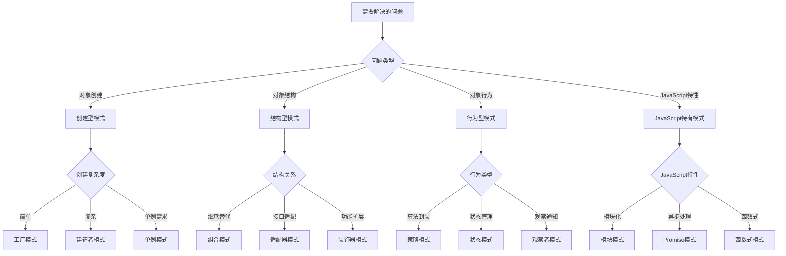

# 模式选择指南

## 模式选择原则

### 选择决策树


### 选择标准
| 标准 | 权重 | 说明 |
|------|------|------|
| 问题匹配度 | 40% | 模式是否直接解决当前问题 |
| 代码复杂度 | 20% | 实现和维护的复杂度 |
| 性能影响 | 15% | 对应用性能的影响 |
| 团队熟悉度 | 15% | 团队对模式的熟悉程度 |
| 扩展性 | 10% | 未来扩展的便利性 |

## 创建型模式选择

### 对象创建场景
```javascript
// 1. 简单对象创建 - 工厂模式
class SimpleFactory {
    static createUser(type) {
        switch (type) {
            case 'admin':
                return new AdminUser();
            case 'user':
                return new RegularUser();
            default:
                throw new Error('Unknown user type');
        }
    }
}

// 2. 复杂对象创建 - 建造者模式
class UserBuilder {
    constructor() {
        this.user = {};
    }
    
    setName(name) {
        this.user.name = name;
        return this;
    }
    
    setEmail(email) {
        this.user.email = email;
        return this;
    }
    
    setRole(role) {
        this.user.role = role;
        return this;
    }
    
    build() {
        return new User(this.user);
    }
}

// 3. 单例需求 - 单例模式
class DatabaseConnection {
    constructor() {
        if (DatabaseConnection.instance) {
            return DatabaseConnection.instance;
        }
        
        this.connection = this.createConnection();
        DatabaseConnection.instance = this;
    }
    
    createConnection() {
        // 创建数据库连接
        return { connected: true };
    }
}

// 选择指南
const createUser = (type, needsBuilder = false, needsSingleton = false) => {
    if (needsSingleton) {
        return new DatabaseConnection();
    }
    
    if (needsBuilder) {
        return new UserBuilder()
            .setName('John')
            .setEmail('john@example.com')
            .setRole('user')
            .build();
    }
    
    return SimpleFactory.createUser(type);
};
```

### 创建型模式对比
| 模式 | 适用场景 | 优点 | 缺点 | 复杂度 |
|------|----------|------|------|--------|
| 工厂模式 | 简单对象创建 | 解耦、易扩展 | 类型判断复杂 | 低 |
| 抽象工厂 | 产品族创建 | 产品一致性 | 扩展困难 | 中 |
| 建造者模式 | 复杂对象创建 | 灵活、可读性好 | 代码量大 | 中 |
| 原型模式 | 克隆对象 | 性能好 | 深拷贝复杂 | 中 |
| 单例模式 | 全局唯一实例 | 资源节约 | 测试困难 | 低 |

## 结构型模式选择

### 对象结构场景
```javascript
// 1. 接口适配 - 适配器模式
class OldAPI {
    getData() {
        return { old: 'data' };
    }
}

class NewAPI {
    fetchData() {
        return { new: 'data' };
    }
}

class APIAdapter {
    constructor(oldAPI) {
        this.oldAPI = oldAPI;
    }
    
    fetchData() {
        const oldData = this.oldAPI.getData();
        return { new: oldData.old };
    }
}

// 2. 功能扩展 - 装饰器模式
class Coffee {
    cost() {
        return 10;
    }
}

class MilkDecorator {
    constructor(coffee) {
        this.coffee = coffee;
    }
    
    cost() {
        return this.coffee.cost() + 2;
    }
}

class SugarDecorator {
    constructor(coffee) {
        this.coffee = coffee;
    }
    
    cost() {
        return this.coffee.cost() + 1;
    }
}

// 3. 组合结构 - 组合模式
class Component {
    constructor(name) {
        this.name = name;
        this.children = [];
    }
    
    add(child) {
        this.children.push(child);
    }
    
    remove(child) {
        const index = this.children.indexOf(child);
        if (index > -1) {
            this.children.splice(index, 1);
        }
    }
    
    operation() {
        console.log(`Component: ${this.name}`);
        this.children.forEach(child => child.operation());
    }
}

// 选择指南
const createStructure = (type, needsAdapter = false, needsDecoration = false, needsComposition = false) => {
    if (needsComposition) {
        const root = new Component('Root');
        const leaf1 = new Component('Leaf1');
        const leaf2 = new Component('Leaf2');
        root.add(leaf1);
        root.add(leaf2);
        return root;
    }
    
    if (needsDecoration) {
        const coffee = new Coffee();
        return new SugarDecorator(new MilkDecorator(coffee));
    }
    
    if (needsAdapter) {
        const oldAPI = new OldAPI();
        return new APIAdapter(oldAPI);
    }
    
    return new NewAPI();
};
```

### 结构型模式对比
| 模式 | 适用场景 | 优点 | 缺点 | 复杂度 |
|------|----------|------|------|--------|
| 适配器模式 | 接口不兼容 | 复用现有代码 | 增加复杂度 | 低 |
| 桥接模式 | 抽象与实现分离 | 灵活性高 | 理解困难 | 中 |
| 组合模式 | 树形结构 | 统一处理 | 限制类型 | 中 |
| 装饰器模式 | 功能扩展 | 动态扩展 | 对象增多 | 中 |
| 外观模式 | 简化接口 | 易使用 | 不够灵活 | 低 |
| 享元模式 | 大量相似对象 | 内存节约 | 代码复杂 | 高 |
| 代理模式 | 访问控制 | 透明代理 | 性能开销 | 中 |

## 行为型模式选择

### 对象行为场景
```javascript
// 1. 算法封装 - 策略模式
class PaymentStrategy {
    pay(amount) {
        throw new Error('Must implement pay method');
    }
}

class CreditCardPayment extends PaymentStrategy {
    pay(amount) {
        return `Paid $${amount} with credit card`;
    }
}

class PayPalPayment extends PaymentStrategy {
    pay(amount) {
        return `Paid $${amount} with PayPal`;
    }
}

class PaymentContext {
    constructor(strategy) {
        this.strategy = strategy;
    }
    
    setStrategy(strategy) {
        this.strategy = strategy;
    }
    
    executePayment(amount) {
        return this.strategy.pay(amount);
    }
}

// 2. 状态管理 - 状态模式
class State {
    handle(context) {
        throw new Error('Must implement handle method');
    }
}

class ConcreteStateA extends State {
    handle(context) {
        console.log('State A handling');
        context.setState(new ConcreteStateB());
    }
}

class ConcreteStateB extends State {
    handle(context) {
        console.log('State B handling');
        context.setState(new ConcreteStateA());
    }
}

class Context {
    constructor() {
        this.state = new ConcreteStateA();
    }
    
    setState(state) {
        this.state = state;
    }
    
    request() {
        this.state.handle(this);
    }
}

// 3. 观察通知 - 观察者模式
class Subject {
    constructor() {
        this.observers = [];
    }
    
    addObserver(observer) {
        this.observers.push(observer);
    }
    
    removeObserver(observer) {
        const index = this.observers.indexOf(observer);
        if (index > -1) {
            this.observers.splice(index, 1);
        }
    }
    
    notify(data) {
        this.observers.forEach(observer => observer.update(data));
    }
}

class Observer {
    update(data) {
        console.log('Observer updated with:', data);
    }
}

// 选择指南
const createBehavior = (type, needsStrategy = false, needsState = false, needsObserver = false) => {
    if (needsObserver) {
        const subject = new Subject();
        const observer = new Observer();
        subject.addObserver(observer);
        return { subject, observer };
    }
    
    if (needsState) {
        return new Context();
    }
    
    if (needsStrategy) {
        return new PaymentContext(new CreditCardPayment());
    }
    
    return new PaymentContext(new PayPalPayment());
};
```

### 行为型模式对比
| 模式 | 适用场景 | 优点 | 缺点 | 复杂度 |
|------|----------|------|------|--------|
| 策略模式 | 算法选择 | 易扩展 | 客户端需了解策略 | 低 |
| 状态模式 | 状态转换 | 状态封装 | 状态类增多 | 中 |
| 观察者模式 | 一对多通知 | 松耦合 | 内存泄漏风险 | 中 |
| 命令模式 | 请求封装 | 易撤销 | 命令类增多 | 中 |
| 责任链模式 | 请求处理链 | 解耦发送者 | 性能影响 | 中 |
| 模板方法模式 | 算法骨架 | 代码复用 | 继承限制 | 低 |
| 访问者模式 | 操作分离 | 易扩展操作 | 增加新类型困难 | 高 |

## JavaScript特有模式选择

### JavaScript特性场景
```javascript
// 1. 模块化需求 - 模块模式
const ModulePattern = (function() {
    let privateVar = 'private';
    
    function privateFunction() {
        return 'private function';
    }
    
    return {
        publicMethod: function() {
            return privateFunction();
        }
    };
})();

// 2. 异步处理 - Promise模式
class PromisePattern {
    static async fetchData(url) {
        try {
            const response = await fetch(url);
            const data = await response.json();
            return data;
        } catch (error) {
            throw new Error(`Failed to fetch data: ${error.message}`);
        }
    }
    
    static async fetchMultiple(urls) {
        const promises = urls.map(url => this.fetchData(url));
        return Promise.all(promises);
    }
}

// 3. 函数式编程 - 函数式模式
const FunctionalPattern = {
    map: (array, fn) => array.map(fn),
    filter: (array, predicate) => array.filter(predicate),
    reduce: (array, reducer, initial) => array.reduce(reducer, initial),
    compose: (...fns) => (value) => fns.reduceRight((acc, fn) => fn(acc), value),
    curry: (fn) => {
        return function curried(...args) {
            if (args.length >= fn.length) {
                return fn.apply(this, args);
            } else {
                return function(...args2) {
                    return curried.apply(this, args.concat(args2));
                };
            }
        };
    }
};

// 4. 事件处理 - 事件模式
class EventPattern {
    constructor() {
        this.events = {};
    }
    
    on(event, callback) {
        if (!this.events[event]) {
            this.events[event] = [];
        }
        this.events[event].push(callback);
    }
    
    emit(event, data) {
        if (this.events[event]) {
            this.events[event].forEach(callback => callback(data));
        }
    }
    
    off(event, callback) {
        if (this.events[event]) {
            this.events[event] = this.events[event].filter(cb => cb !== callback);
        }
    }
}

// 选择指南
const createJavaScriptPattern = (type, needsModule = false, needsAsync = false, needsFunctional = false, needsEvent = false) => {
    if (needsEvent) {
        return new EventPattern();
    }
    
    if (needsFunctional) {
        return FunctionalPattern;
    }
    
    if (needsAsync) {
        return PromisePattern;
    }
    
    if (needsModule) {
        return ModulePattern;
    }
    
    return ModulePattern;
};
```

### JavaScript特有模式对比
| 模式 | 适用场景 | 优点 | 缺点 | 复杂度 |
|------|----------|------|------|--------|
| 模块模式 | 代码组织 | 封装性好 | 全局污染 | 低 |
| 命名空间模式 | 避免冲突 | 结构清晰 | 嵌套深 | 低 |
| 混入模式 | 代码复用 | 灵活性高 | 原型污染 | 中 |
| 函数式模式 | 数据处理 | 纯函数 | 学习曲线 | 中 |
| 异步模式 | 非阻塞操作 | 性能好 | 回调地狱 | 中 |
| 事件模式 | 解耦通信 | 松耦合 | 内存泄漏 | 中 |
| 原型模式 | 对象创建 | 性能好 | 理解困难 | 中 |
| 闭包模式 | 状态保持 | 私有性 | 内存占用 | 低 |

## 模式选择决策矩阵

### 综合评估表
| 模式 | 学习成本 | 维护成本 | 性能影响 | 扩展性 | 适用性 | 总分 |
|------|----------|----------|----------|--------|--------|------|
| 工厂模式 | 低 | 低 | 低 | 中 | 高 | 85 |
| 单例模式 | 低 | 中 | 低 | 低 | 中 | 70 |
| 观察者模式 | 中 | 中 | 中 | 高 | 高 | 80 |
| 策略模式 | 低 | 低 | 低 | 高 | 高 | 90 |
| 装饰器模式 | 中 | 中 | 中 | 高 | 中 | 75 |
| 适配器模式 | 低 | 低 | 低 | 中 | 高 | 85 |
| 模块模式 | 低 | 低 | 低 | 中 | 高 | 85 |
| 函数式模式 | 高 | 低 | 中 | 高 | 中 | 70 |

### 选择建议
```javascript
// 1. 新手项目 - 推荐简单模式
const beginnerPatterns = [
    '工厂模式',
    '单例模式', 
    '观察者模式',
    '模块模式'
];

// 2. 中型项目 - 推荐中等复杂度模式
const intermediatePatterns = [
    '策略模式',
    '装饰器模式',
    '适配器模式',
    'Promise模式'
];

// 3. 大型项目 - 推荐高级模式
const advancedPatterns = [
    '抽象工厂模式',
    '建造者模式',
    '访问者模式',
    '函数式模式'
];

// 4. 性能敏感项目 - 推荐高性能模式
const performancePatterns = [
    '原型模式',
    '享元模式',
    '模块模式',
    '函数式模式'
];

// 5. 团队协作项目 - 推荐易理解模式
const teamPatterns = [
    '工厂模式',
    '策略模式',
    '观察者模式',
    '模块模式'
];
```

## 模式组合策略

### 常见模式组合
```javascript
// 1. 工厂 + 策略组合
class PaymentFactory {
    static createPayment(type) {
        switch (type) {
            case 'credit':
                return new PaymentContext(new CreditCardPayment());
            case 'paypal':
                return new PaymentContext(new PayPalPayment());
            default:
                throw new Error('Unknown payment type');
        }
    }
}

// 2. 观察者 + 单例组合
class EventManager {
    constructor() {
        if (EventManager.instance) {
            return EventManager.instance;
        }
        
        this.observers = [];
        EventManager.instance = this;
    }
    
    addObserver(observer) {
        this.observers.push(observer);
    }
    
    notify(data) {
        this.observers.forEach(observer => observer.update(data));
    }
}

// 3. 模块 + 工厂组合
const UserModule = (function() {
    class UserFactory {
        static createUser(type) {
            switch (type) {
                case 'admin':
                    return new AdminUser();
                case 'user':
                    return new RegularUser();
                default:
                    throw new Error('Unknown user type');
            }
        }
    }
    
    return {
        UserFactory: UserFactory
    };
})();

// 4. 装饰器 + 工厂组合
class CoffeeFactory {
    static createCoffee(type, addons = []) {
        let coffee = new Coffee();
        
        addons.forEach(addon => {
            switch (addon) {
                case 'milk':
                    coffee = new MilkDecorator(coffee);
                    break;
                case 'sugar':
                    coffee = new SugarDecorator(coffee);
                    break;
            }
        });
        
        return coffee;
    }
}
```

### 组合原则
| 组合类型 | 原则 | 示例 |
|----------|------|------|
| 功能组合 | 模式功能互补 | 工厂 + 策略 |
| 结构组合 | 模式结构相似 | 装饰器 + 适配器 |
| 行为组合 | 模式行为相关 | 观察者 + 命令 |
| 层次组合 | 模式层次不同 | 模块 + 工厂 |

## 相关链接
- [[04-高级精通层/01-设计模式/01-创建型模式]] - 创建型设计模式
- [[04-高级精通层/01-设计模式/02-结构型模式]] - 结构型设计模式
- [[04-高级精通层/01-设计模式/03-行为型模式]] - 行为型设计模式
- [[04-高级精通层/01-设计模式/04-JavaScript特有模式]] - JavaScript特有模式
- [[04-高级精通层/01-设计模式/06-代码示例库-设计模式]] - 代码示例
