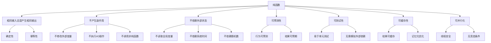

# 纯函数概念

## 纯函数定义

### 纯函数特征


### 纯函数 vs 非纯函数
| 特征 | 纯函数 | 非纯函数 |
|------|--------|----------|
| 输入输出 | 相同输入→相同输出 | 相同输入→可能不同输出 |
| 副作用 | 无副作用 | 有副作用 |
| 外部依赖 | 无外部依赖 | 依赖外部状态 |
| 可预测性 | 完全可预测 | 不可预测 |
| 可测试性 | 易于测试 | 难以测试 |
| 可缓存性 | 可缓存 | 不可缓存 |
| 可并行化 | 可并行 | 不可并行 |

## 纯函数示例

### 基本纯函数
```javascript
// 1. 纯函数示例
function add(a, b) {
    return a + b;
}

function multiply(a, b) {
    return a * b;
}

function square(x) {
    return x * x;
}

function isEven(n) {
    return n % 2 === 0;
}

function factorial(n) {
    if (n <= 1) return 1;
    return n * factorial(n - 1);
}

// 使用示例
console.log(add(2, 3)); // 5 (总是相同结果)
console.log(multiply(4, 5)); // 20 (总是相同结果)
console.log(square(6)); // 36 (总是相同结果)
console.log(isEven(8)); // true (总是相同结果)
console.log(factorial(5)); // 120 (总是相同结果)

// 2. 数组操作纯函数
function map(array, fn) {
    const result = [];
    for (let i = 0; i < array.length; i++) {
        result.push(fn(array[i]));
    }
    return result;
}

function filter(array, predicate) {
    const result = [];
    for (let i = 0; i < array.length; i++) {
        if (predicate(array[i])) {
            result.push(array[i]);
        }
    }
    return result;
}

function reduce(array, reducer, initial) {
    let accumulator = initial;
    for (let i = 0; i < array.length; i++) {
        accumulator = reducer(accumulator, array[i]);
    }
    return accumulator;
}

// 使用示例
const numbers = [1, 2, 3, 4, 5];
const doubled = map(numbers, x => x * 2);
const evens = filter(numbers, x => x % 2 === 0);
const sum = reduce(numbers, (acc, x) => acc + x, 0);

console.log(doubled); // [2, 4, 6, 8, 10]
console.log(evens); // [2, 4]
console.log(sum); // 15

// 3. 字符串操作纯函数
function capitalize(str) {
    if (str.length === 0) return str;
    return str.charAt(0).toUpperCase() + str.slice(1).toLowerCase();
}

function reverse(str) {
    return str.split('').reverse().join('');
}

function trim(str) {
    return str.replace(/^\s+|\s+$/g, '');
}

function replace(str, search, replacement) {
    return str.split(search).join(replacement);
}

// 使用示例
console.log(capitalize('hello')); // Hello
console.log(reverse('world')); // dlrow
console.log(trim('  hello  ')); // hello
console.log(replace('hello world', 'world', 'universe')); // hello universe
```

### 非纯函数示例
```javascript
// 1. 非纯函数示例
let counter = 0;

function increment() {
    counter++; // 修改外部状态
    return counter;
}

function getCurrentTime() {
    return new Date(); // 依赖系统时间
}

function randomNumber() {
    return Math.random(); // 依赖随机数生成器
}

function log(message) {
    console.log(message); // 执行I/O操作
}

// 使用示例
console.log(increment()); // 1
console.log(increment()); // 2 (相同调用，不同结果)

console.log(getCurrentTime()); // 2024-01-01T10:00:00.000Z
setTimeout(() => {
    console.log(getCurrentTime()); // 2024-01-01T10:00:01.000Z (不同时间)
}, 1000);

console.log(randomNumber()); // 0.123456789
console.log(randomNumber()); // 0.987654321 (不同随机数)

// 2. 修改外部对象的非纯函数
const user = { name: 'John', age: 30 };

function updateUserAge(user, newAge) {
    user.age = newAge; // 修改外部对象
    return user;
}

function addToArray(array, item) {
    array.push(item); // 修改外部数组
    return array;
}

// 使用示例
console.log(updateUserAge(user, 31)); // { name: 'John', age: 31 }
console.log(user); // { name: 'John', age: 31 } (原对象被修改)

const numbers = [1, 2, 3];
console.log(addToArray(numbers, 4)); // [1, 2, 3, 4]
console.log(numbers); // [1, 2, 3, 4] (原数组被修改)
```

## 纯函数优势

### 可预测性
```javascript
// 1. 可预测的结果
function calculateTax(income, rate) {
    return income * rate;
}

// 总是产生相同结果
console.log(calculateTax(1000, 0.1)); // 100
console.log(calculateTax(1000, 0.1)); // 100
console.log(calculateTax(1000, 0.1)); // 100

// 2. 易于理解
function formatCurrency(amount, currency = 'USD') {
    return new Intl.NumberFormat('en-US', {
        style: 'currency',
        currency: currency
    }).format(amount);
}

console.log(formatCurrency(100)); // $100.00
console.log(formatCurrency(100, 'EUR')); // €100.00

// 3. 无隐藏依赖
function isValidEmail(email) {
    const emailRegex = /^[^\s@]+@[^\s@]+\.[^\s@]+$/;
    return emailRegex.test(email);
}

// 不依赖外部状态，结果完全可预测
console.log(isValidEmail('test@example.com')); // true
console.log(isValidEmail('invalid-email')); // false
```

### 可测试性
```javascript
// 1. 易于单元测试
function calculateDiscount(price, discountPercent) {
    if (price < 0 || discountPercent < 0 || discountPercent > 100) {
        throw new Error('Invalid parameters');
    }
    return price * (1 - discountPercent / 100);
}

// 测试用例
function testCalculateDiscount() {
    // 正常情况
    console.assert(calculateDiscount(100, 10) === 90, '10% discount test failed');
    console.assert(calculateDiscount(200, 25) === 150, '25% discount test failed');
    
    // 边界情况
    console.assert(calculateDiscount(0, 10) === 0, 'Zero price test failed');
    console.assert(calculateDiscount(100, 0) === 100, 'Zero discount test failed');
    console.assert(calculateDiscount(100, 100) === 0, '100% discount test failed');
    
    // 错误情况
    try {
        calculateDiscount(-100, 10);
        console.assert(false, 'Negative price should throw error');
    } catch (e) {
        console.assert(e.message === 'Invalid parameters', 'Error message test failed');
    }
    
    console.log('All tests passed!');
}

testCalculateDiscount();

// 2. 无需模拟外部依赖
function parseJSON(jsonString) {
    try {
        return JSON.parse(jsonString);
    } catch (error) {
        return null;
    }
}

// 测试用例
function testParseJSON() {
    console.assert(parseJSON('{"name": "John"}').name === 'John', 'Valid JSON test failed');
    console.assert(parseJSON('invalid json') === null, 'Invalid JSON test failed');
    console.assert(parseJSON('') === null, 'Empty string test failed');
    console.log('JSON parsing tests passed!');
}

testParseJSON();
```

### 可缓存性
```javascript
// 1. 函数记忆化
function memoize(fn) {
    const cache = new Map();
    
    return function(...args) {
        const key = JSON.stringify(args);
        
        if (cache.has(key)) {
            console.log('Cache hit!');
            return cache.get(key);
        }
        
        console.log('Cache miss!');
        const result = fn.apply(this, args);
        cache.set(key, result);
        return result;
    };
}

// 昂贵的计算函数
function fibonacci(n) {
    if (n <= 1) return n;
    return fibonacci(n - 1) + fibonacci(n - 2);
}

// 记忆化版本
const memoizedFibonacci = memoize(fibonacci);

// 使用示例
console.time('First call');
console.log(memoizedFibonacci(40)); // 计算并缓存
console.timeEnd('First call');

console.time('Second call');
console.log(memoizedFibonacci(40)); // 从缓存获取
console.timeEnd('Second call');

// 2. 结果缓存
class FunctionCache {
    constructor() {
        this.cache = new Map();
    }
    
    get(key) {
        return this.cache.get(key);
    }
    
    set(key, value) {
        this.cache.set(key, value);
    }
    
    has(key) {
        return this.cache.has(key);
    }
    
    clear() {
        this.cache.clear();
    }
}

const cache = new FunctionCache();

function expensiveCalculation(n) {
    if (cache.has(n)) {
        return cache.get(n);
    }
    
    // 模拟昂贵计算
    let result = 0;
    for (let i = 0; i < n * 1000000; i++) {
        result += i;
    }
    
    cache.set(n, result);
    return result;
}

// 使用示例
console.time('First calculation');
console.log(expensiveCalculation(1000));
console.timeEnd('First calculation');

console.time('Second calculation');
console.log(expensiveCalculation(1000));
console.timeEnd('Second calculation');
```

### 可并行化
```javascript
// 1. 并行处理
function processArray(array, processor) {
    return array.map(processor);
}

// 纯函数可以安全并行执行
function square(x) {
    return x * x;
}

function double(x) {
    return x * 2;
}

// 使用示例
const numbers = [1, 2, 3, 4, 5, 6, 7, 8, 9, 10];

console.time('Sequential processing');
const squared = processArray(numbers, square);
const doubled = processArray(numbers, double);
console.timeEnd('Sequential processing');

// 2. 并行计算
async function parallelProcessing(array, processors) {
    const promises = processors.map(processor => 
        Promise.resolve(processArray(array, processor))
    );
    
    return Promise.all(promises);
}

// 使用示例
const processors = [square, double, x => x + 1];

console.time('Parallel processing');
parallelProcessing(numbers, processors)
    .then(results => {
        console.log('Results:', results);
        console.timeEnd('Parallel processing');
    });

// 3. 线程安全
function threadSafeOperation(data) {
    // 纯函数不修改外部状态，线程安全
    return data.map(item => ({
        ...item,
        processed: true,
        timestamp: Date.now()
    }));
}

// 可以安全地在多个线程中执行
const data = [
    { id: 1, value: 'a' },
    { id: 2, value: 'b' },
    { id: 3, value: 'c' }
];

console.log(threadSafeOperation(data));
```

## 纯函数实践

### 避免副作用
```javascript
// 1. 不修改输入参数
function addToArray(array, item) {
    // 错误：修改原数组
    // array.push(item);
    // return array;
    
    // 正确：返回新数组
    return [...array, item];
}

function updateObject(obj, key, value) {
    // 错误：修改原对象
    // obj[key] = value;
    // return obj;
    
    // 正确：返回新对象
    return { ...obj, [key]: value };
}

// 使用示例
const originalArray = [1, 2, 3];
const newArray = addToArray(originalArray, 4);
console.log(originalArray); // [1, 2, 3] (未修改)
console.log(newArray); // [1, 2, 3, 4]

const originalObject = { a: 1, b: 2 };
const newObject = updateObject(originalObject, 'c', 3);
console.log(originalObject); // { a: 1, b: 2 } (未修改)
console.log(newObject); // { a: 1, b: 2, c: 3 }

// 2. 不执行I/O操作
function validateEmail(email) {
    // 纯函数：只进行验证，不发送邮件
    const emailRegex = /^[^\s@]+@[^\s@]+\.[^\s@]+$/;
    return emailRegex.test(email);
}

function formatUserData(user) {
    // 纯函数：只格式化数据，不保存到数据库
    return {
        id: user.id,
        name: user.name.toUpperCase(),
        email: user.email.toLowerCase()
    };
}

// 3. 不依赖外部状态
function calculateTotal(items) {
    // 纯函数：不依赖全局变量
    return items.reduce((total, item) => total + item.price, 0);
}

function sortByPrice(items) {
    // 纯函数：不依赖外部排序配置
    return [...items].sort((a, b) => a.price - b.price);
}
```

### 函数组合
```javascript
// 1. 函数组合
function compose(...functions) {
    return function(value) {
        return functions.reduceRight((acc, fn) => fn(acc), value);
    };
}

function pipe(...functions) {
    return function(value) {
        return functions.reduce((acc, fn) => fn(acc), value);
    };
}

// 工具函数
const add = (x) => (y) => x + y;
const multiply = (x) => (y) => x * y;
const subtract = (x) => (y) => y - x;

// 组合函数
const calculate = pipe(
    add(5),
    multiply(2),
    subtract(3)
);

console.log(calculate(10)); // ((10 + 5) * 2) - 3 = 27

// 2. 数据转换管道
function processUserData(users) {
    return pipe(
        filter(user => user.active),
        map(user => ({ ...user, name: user.name.toUpperCase() })),
        sort((a, b) => a.name.localeCompare(b.name)),
        take(10)
    )(users);
}

// 使用示例
const users = [
    { id: 1, name: 'john', active: true },
    { id: 2, name: 'jane', active: false },
    { id: 3, name: 'bob', active: true }
];

console.log(processUserData(users));
```

## 相关链接
- [[04-高级精通层/02-函数式编程/02-高阶函数]] - 高阶函数
- [[04-高级精通层/02-函数式编程/03-函数组合]] - 函数组合
- [[04-高级精通层/02-函数式编程/04-不可变数据]] - 不可变数据
- [[04-高级精通层/02-函数式编程/05-函数式库(Lodash-Ramda)]] - 函数式库
- [[04-高级精通层/02-函数式编程/06-代码示例库-函数式编程]] - 代码示例
