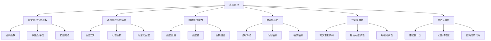

# 高阶函数

## 高阶函数定义

### 高阶函数特征


### 高阶函数类型
| 类型 | 特征 | 示例 |
|------|------|------|
| 接受函数参数 | 函数作为输入 | `map`, `filter`, `reduce` |
| 返回函数 | 函数作为输出 | `curry`, `bind`, `memoize` |
| 函数工厂 | 创建新函数 | `createValidator`, `createLogger` |
| 函数组合器 | 组合多个函数 | `compose`, `pipe`, `andThen` |
| 函数装饰器 | 增强函数功能 | `withLogging`, `withTiming` |

## 接受函数参数的高阶函数

### 数组方法
```javascript
// 1. map - 转换函数
function map(array, transformFn) {
    const result = [];
    for (let i = 0; i < array.length; i++) {
        result.push(transformFn(array[i], i, array));
    }
    return result;
}

// 使用示例
const numbers = [1, 2, 3, 4, 5];
const doubled = map(numbers, x => x * 2);
const squared = map(numbers, x => x * x);
const strings = map(numbers, x => `Number: ${x}`);

console.log(doubled); // [2, 4, 6, 8, 10]
console.log(squared); // [1, 4, 9, 16, 25]
console.log(strings); // ['Number: 1', 'Number: 2', ...]

// 2. filter - 过滤函数
function filter(array, predicateFn) {
    const result = [];
    for (let i = 0; i < array.length; i++) {
        if (predicateFn(array[i], i, array)) {
            result.push(array[i]);
        }
    }
    return result;
}

// 使用示例
const numbers = [1, 2, 3, 4, 5, 6, 7, 8, 9, 10];
const evens = filter(numbers, x => x % 2 === 0);
const greaterThan5 = filter(numbers, x => x > 5);
const strings = filter(['hello', 'world', 'test'], s => s.length > 4);

console.log(evens); // [2, 4, 6, 8, 10]
console.log(greaterThan5); // [6, 7, 8, 9, 10]
console.log(strings); // ['hello', 'world']

// 3. reduce - 归约函数
function reduce(array, reducerFn, initialValue) {
    let accumulator = initialValue;
    for (let i = 0; i < array.length; i++) {
        accumulator = reducerFn(accumulator, array[i], i, array);
    }
    return accumulator;
}

// 使用示例
const numbers = [1, 2, 3, 4, 5];
const sum = reduce(numbers, (acc, x) => acc + x, 0);
const product = reduce(numbers, (acc, x) => acc * x, 1);
const max = reduce(numbers, (acc, x) => Math.max(acc, x), -Infinity);

console.log(sum); // 15
console.log(product); // 120
console.log(max); // 5

// 4. forEach - 遍历函数
function forEach(array, actionFn) {
    for (let i = 0; i < array.length; i++) {
        actionFn(array[i], i, array);
    }
}

// 使用示例
const numbers = [1, 2, 3, 4, 5];
forEach(numbers, x => console.log(`Processing: ${x}`));

// 5. find - 查找函数
function find(array, predicateFn) {
    for (let i = 0; i < array.length; i++) {
        if (predicateFn(array[i], i, array)) {
            return array[i];
        }
    }
    return undefined;
}

// 使用示例
const users = [
    { id: 1, name: 'John', age: 30 },
    { id: 2, name: 'Jane', age: 25 },
    { id: 3, name: 'Bob', age: 35 }
];

const user = find(users, u => u.age > 30);
console.log(user); // { id: 3, name: 'Bob', age: 35 }
```

### 对象方法
```javascript
// 1. 对象映射
function mapObject(obj, transformFn) {
    const result = {};
    for (const key in obj) {
        if (obj.hasOwnProperty(key)) {
            result[key] = transformFn(obj[key], key, obj);
        }
    }
    return result;
}

// 使用示例
const user = { name: 'John', age: 30, city: 'New York' };
const upperCaseUser = mapObject(user, value => 
    typeof value === 'string' ? value.toUpperCase() : value
);
const withPrefix = mapObject(user, (value, key) => `${key}: ${value}`);

console.log(upperCaseUser); // { name: 'JOHN', age: 30, city: 'NEW YORK' }
console.log(withPrefix); // { name: 'name: John', age: 'age: 30', city: 'city: New York' }

// 2. 对象过滤
function filterObject(obj, predicateFn) {
    const result = {};
    for (const key in obj) {
        if (obj.hasOwnProperty(key) && predicateFn(obj[key], key, obj)) {
            result[key] = obj[key];
        }
    }
    return result;
}

// 使用示例
const config = {
    apiUrl: 'https://api.example.com',
    timeout: 5000,
    retries: 3,
    debug: true
};

const stringConfig = filterObject(config, value => typeof value === 'string');
const numericConfig = filterObject(config, value => typeof value === 'number');

console.log(stringConfig); // { apiUrl: 'https://api.example.com' }
console.log(numericConfig); // { timeout: 5000, retries: 3 }

// 3. 对象归约
function reduceObject(obj, reducerFn, initialValue) {
    let accumulator = initialValue;
    for (const key in obj) {
        if (obj.hasOwnProperty(key)) {
            accumulator = reducerFn(accumulator, obj[key], key, obj);
        }
    }
    return accumulator;
}

// 使用示例
const scores = { math: 90, english: 85, science: 92 };
const total = reduceObject(scores, (acc, score) => acc + score, 0);
const average = total / Object.keys(scores).length;

console.log(total); // 267
console.log(average); // 89
```

## 返回函数的高阶函数

### 函数工厂
```javascript
// 1. 创建验证器
function createValidator(rule, errorMessage) {
    return function(value) {
        if (rule(value)) {
            return { valid: true, value };
        } else {
            return { valid: false, error: errorMessage };
        }
    };
}

// 使用示例
const isRequired = createValidator(value => value != null && value !== '', 'Value is required');
const isEmail = createValidator(value => /^[^\s@]+@[^\s@]+\.[^\s@]+$/.test(value), 'Invalid email');
const isMinLength = (min) => createValidator(value => value.length >= min, `Minimum length is ${min}`);

console.log(isRequired('hello')); // { valid: true, value: 'hello' }
console.log(isRequired('')); // { valid: false, error: 'Value is required' }
console.log(isEmail('test@example.com')); // { valid: true, value: 'test@example.com' }
console.log(isMinLength(5)('hello')); // { valid: true, value: 'hello' }

// 2. 创建日志器
function createLogger(level) {
    return function(message, data = null) {
        const timestamp = new Date().toISOString();
        const logEntry = {
            timestamp,
            level,
            message,
            data
        };
        
        switch (level) {
            case 'error':
                console.error(logEntry);
                break;
            case 'warn':
                console.warn(logEntry);
                break;
            case 'info':
                console.info(logEntry);
                break;
            default:
                console.log(logEntry);
        }
    };
}

// 使用示例
const errorLogger = createLogger('error');
const warnLogger = createLogger('warn');
const infoLogger = createLogger('info');

errorLogger('Database connection failed', { error: 'Connection timeout' });
warnLogger('API rate limit approaching', { remaining: 5 });
infoLogger('User logged in', { userId: 123 });

// 3. 创建重试函数
function createRetryFunction(fn, maxAttempts = 3, delay = 1000) {
    return async function(...args) {
        let lastError;
        
        for (let attempt = 1; attempt <= maxAttempts; attempt++) {
            try {
                return await fn(...args);
            } catch (error) {
                lastError = error;
                console.log(`Attempt ${attempt} failed:`, error.message);
                
                if (attempt < maxAttempts) {
                    await new Promise(resolve => setTimeout(resolve, delay));
                }
            }
        }
        
        throw lastError;
    };
}

// 使用示例
const unreliableFunction = async () => {
    if (Math.random() < 0.7) {
        throw new Error('Random failure');
    }
    return 'Success!';
};

const retryFunction = createRetryFunction(unreliableFunction, 3, 1000);
retryFunction().then(result => console.log(result)).catch(error => console.error(error));
```

### 柯里化函数
```javascript
// 1. 基本柯里化
function curry(fn) {
    return function curried(...args) {
        if (args.length >= fn.length) {
            return fn.apply(this, args);
        } else {
            return function(...args2) {
                return curried.apply(this, args.concat(args2));
            };
        }
    };
}

// 使用示例
const add = (a, b, c) => a + b + c;
const curriedAdd = curry(add);

console.log(curriedAdd(1)(2)(3)); // 6
console.log(curriedAdd(1, 2)(3)); // 6
console.log(curriedAdd(1)(2, 3)); // 6

// 2. 部分应用
function partial(fn, ...presetArgs) {
    return function(...laterArgs) {
        return fn(...presetArgs, ...laterArgs);
    };
}

// 使用示例
const multiply = (a, b, c) => a * b * c;
const multiplyBy2 = partial(multiply, 2);
const multiplyBy2And3 = partial(multiply, 2, 3);

console.log(multiplyBy2(4, 5)); // 40
console.log(multiplyBy2And3(4)); // 24

// 3. 高级柯里化
function advancedCurry(fn) {
    return function curried(...args) {
        if (args.length >= fn.length) {
            return fn.apply(this, args);
        } else {
            return function(...args2) {
                if (args2.length === 0) {
                    return curried.apply(this, args);
                }
                return curried.apply(this, args.concat(args2));
            };
        }
    };
}

// 使用示例
const calculate = (operation, a, b) => {
    switch (operation) {
        case 'add': return a + b;
        case 'subtract': return a - b;
        case 'multiply': return a * b;
        case 'divide': return a / b;
        default: throw new Error('Unknown operation');
    }
};

const curriedCalculate = advancedCurry(calculate);
const add = curriedCalculate('add');
const multiply = curriedCalculate('multiply');

console.log(add(5)(3)); // 8
console.log(multiply(4)(2)); // 8
```

### 函数装饰器
```javascript
// 1. 日志装饰器
function withLogging(fn) {
    return function(...args) {
        console.log(`Calling ${fn.name} with args:`, args);
        const result = fn.apply(this, args);
        console.log(`${fn.name} returned:`, result);
        return result;
    };
}

// 2. 计时装饰器
function withTiming(fn) {
    return function(...args) {
        const start = Date.now();
        const result = fn.apply(this, args);
        const end = Date.now();
        console.log(`${fn.name} took ${end - start}ms`);
        return result;
    };
}

// 3. 缓存装饰器
function withCache(fn) {
    const cache = new Map();
    
    return function(...args) {
        const key = JSON.stringify(args);
        
        if (cache.has(key)) {
            console.log('Cache hit!');
            return cache.get(key);
        }
        
        console.log('Cache miss!');
        const result = fn.apply(this, args);
        cache.set(key, result);
        return result;
    };
}

// 4. 重试装饰器
function withRetry(fn, maxAttempts = 3, delay = 1000) {
    return async function(...args) {
        let lastError;
        
        for (let attempt = 1; attempt <= maxAttempts; attempt++) {
            try {
                return await fn.apply(this, args);
            } catch (error) {
                lastError = error;
                console.log(`Attempt ${attempt} failed:`, error.message);
                
                if (attempt < maxAttempts) {
                    await new Promise(resolve => setTimeout(resolve, delay));
                }
            }
        }
        
        throw lastError;
    };
}

// 使用示例
function expensiveCalculation(n) {
    console.log(`Calculating for ${n}...`);
    let result = 0;
    for (let i = 0; i < n * 1000000; i++) {
        result += i;
    }
    return result;
}

const decoratedFunction = withLogging(withTiming(withCache(expensiveCalculation)));

console.log(decoratedFunction(1000));
console.log(decoratedFunction(1000)); // 从缓存获取
```

## 函数组合器

### 基本组合器
```javascript
// 1. 函数组合
function compose(...functions) {
    return function(value) {
        return functions.reduceRight((acc, fn) => fn(acc), value);
    };
}

function pipe(...functions) {
    return function(value) {
        return functions.reduce((acc, fn) => fn(acc), value);
    };
}

// 使用示例
const add = (x) => (y) => x + y;
const multiply = (x) => (y) => x * y;
const subtract = (x) => (y) => y - x;

const calculate = pipe(
    add(5),
    multiply(2),
    subtract(3)
);

console.log(calculate(10)); // ((10 + 5) * 2) - 3 = 27

// 2. 条件组合器
function when(condition, fn) {
    return function(value) {
        return condition(value) ? fn(value) : value;
    };
}

function unless(condition, fn) {
    return function(value) {
        return !condition(value) ? fn(value) : value;
    };
}

// 使用示例
const isEven = x => x % 2 === 0;
const double = x => x * 2;
const increment = x => x + 1;

const processEven = when(isEven, double);
const processOdd = unless(isEven, increment);

console.log(processEven(4)); // 8
console.log(processOdd(3)); // 4

// 3. 分支组合器
function branch(predicate, trueFn, falseFn) {
    return function(value) {
        return predicate(value) ? trueFn(value) : falseFn(value);
    };
}

// 使用示例
const isPositive = x => x > 0;
const square = x => x * x;
const negate = x => -x;

const processNumber = branch(isPositive, square, negate);

console.log(processNumber(5)); // 25
console.log(processNumber(-3)); // 3
```

### 高级组合器
```javascript
// 1. 序列组合器
function sequence(...functions) {
    return function(value) {
        let result = value;
        for (const fn of functions) {
            result = fn(result);
        }
        return result;
    };
}

// 2. 并行组合器
function parallel(...functions) {
    return function(value) {
        return functions.map(fn => fn(value));
    };
}

// 3. 选择组合器
function choice(predicate, trueFn, falseFn) {
    return function(value) {
        return predicate(value) ? trueFn(value) : falseFn(value);
    };
}

// 使用示例
const add1 = x => x + 1;
const multiply2 = x => x * 2;
const square = x => x * x;

const sequenceFn = sequence(add1, multiply2, square);
const parallelFn = parallel(add1, multiply2, square);
const choiceFn = choice(x => x > 0, square, x => -x);

console.log(sequenceFn(3)); // ((3 + 1) * 2)² = 64
console.log(parallelFn(3)); // [4, 6, 9]
console.log(choiceFn(5)); // 25
console.log(choiceFn(-3)); // 3
```

## 实用高阶函数

### 工具函数
```javascript
// 1. 防抖函数
function debounce(fn, delay) {
    let timeoutId;
    
    return function(...args) {
        clearTimeout(timeoutId);
        timeoutId = setTimeout(() => fn.apply(this, args), delay);
    };
}

// 2. 节流函数
function throttle(fn, delay) {
    let lastCall = 0;
    
    return function(...args) {
        const now = Date.now();
        if (now - lastCall >= delay) {
            lastCall = now;
            return fn.apply(this, args);
        }
    };
}

// 3. 记忆化函数
function memoize(fn) {
    const cache = new Map();
    
    return function(...args) {
        const key = JSON.stringify(args);
        
        if (cache.has(key)) {
            return cache.get(key);
        }
        
        const result = fn.apply(this, args);
        cache.set(key, result);
        return result;
    };
}

// 4. 一次性函数
function once(fn) {
    let called = false;
    let result;
    
    return function(...args) {
        if (!called) {
            called = true;
            result = fn.apply(this, args);
        }
        return result;
    };
}

// 使用示例
const expensiveOperation = (n) => {
    console.log(`Computing for ${n}...`);
    return n * n;
};

const debouncedFn = debounce(expensiveOperation, 300);
const throttledFn = throttle(expensiveOperation, 300);
const memoizedFn = memoize(expensiveOperation);
const onceFn = once(expensiveOperation);

// 防抖测试
debouncedFn(5);
debouncedFn(5);
debouncedFn(5); // 只执行最后一次

// 节流测试
throttledFn(5);
throttledFn(5);
throttledFn(5); // 只执行第一次

// 记忆化测试
console.log(memoizedFn(5)); // 计算
console.log(memoizedFn(5)); // 从缓存获取

// 一次性测试
console.log(onceFn(5)); // 执行
console.log(onceFn(5)); // 返回缓存结果
```

## 相关链接
- [[04-高级精通层/02-函数式编程/01-纯函数概念]] - 纯函数概念
- [[04-高级精通层/02-函数式编程/03-函数组合]] - 函数组合
- [[04-高级精通层/02-函数式编程/04-不可变数据]] - 不可变数据
- [[04-高级精通层/02-函数式编程/05-函数式库(Lodash-Ramda)]] - 函数式库
- [[04-高级精通层/02-函数式编程/06-代码示例库-函数式编程]] - 代码示例
