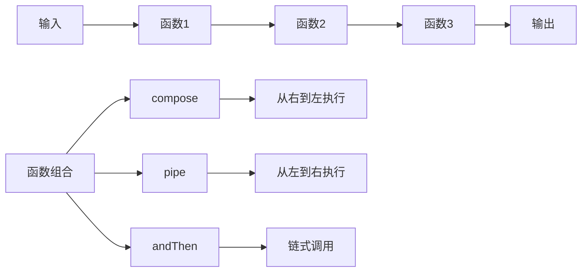

# 函数组合

## 函数组合基础

### 组合概念


### 组合类型
| 类型 | 执行方向 | 语法 | 示例 |
|------|----------|------|------|
| compose | 从右到左 | `compose(f, g, h)` | `f(g(h(x)))` |
| pipe | 从左到右 | `pipe(h, g, f)` | `f(g(h(x)))` |
| andThen | 链式调用 | `h.andThen(g).andThen(f)` | `f(g(h(x)))` |
| sequence | 顺序执行 | `sequence(h, g, f)` | `f(g(h(x)))` |

## 基本组合

### compose函数
```javascript
// 1. 基本compose实现
function compose(...functions) {
    return function(value) {
        return functions.reduceRight((acc, fn) => fn(acc), value);
    };
}

// 使用示例
const add = (x) => (y) => x + y;
const multiply = (x) => (y) => x * y;
const subtract = (x) => (y) => y - x;

const calculate = compose(
    subtract(3),
    multiply(2),
    add(5)
);

console.log(calculate(10)); // ((10 + 5) * 2) - 3 = 27

// 2. 高级compose实现
function advancedCompose(...functions) {
    if (functions.length === 0) {
        return (x) => x;
    }
    
    if (functions.length === 1) {
        return functions[0];
    }
    
    return functions.reduce((a, b) => (...args) => a(b(...args)));
}

// 使用示例
const toUpperCase = (str) => str.toUpperCase();
const addExclamation = (str) => str + '!';
const addPrefix = (prefix) => (str) => prefix + str;

const processString = advancedCompose(
    addExclamation,
    toUpperCase,
    addPrefix('Hello ')
);

console.log(processString('world')); // HELLO WORLD!

// 3. 类型安全的compose
function typedCompose(...functions) {
    return function(value) {
        let result = value;
        for (let i = functions.length - 1; i >= 0; i--) {
            result = functions[i](result);
        }
        return result;
    };
}

// 使用示例
const parseNumber = (str) => parseFloat(str);
const addTen = (num) => num + 10;
const formatCurrency = (num) => `$${num.toFixed(2)}`;

const processPrice = typedCompose(
    formatCurrency,
    addTen,
    parseNumber
);

console.log(processPrice('25.50')); // $35.50
```

### pipe函数
```javascript
// 1. 基本pipe实现
function pipe(...functions) {
    return function(value) {
        return functions.reduce((acc, fn) => fn(acc), value);
    };
}

// 使用示例
const add = (x) => (y) => x + y;
const multiply = (x) => (y) => x * y;
const subtract = (x) => (y) => y - x;

const calculate = pipe(
    add(5),
    multiply(2),
    subtract(3)
);

console.log(calculate(10)); // ((10 + 5) * 2) - 3 = 27

// 2. 高级pipe实现
function advancedPipe(...functions) {
    if (functions.length === 0) {
        return (x) => x;
    }
    
    if (functions.length === 1) {
        return functions[0];
    }
    
    return functions.reduce((a, b) => (...args) => b(a(...args)));
}

// 使用示例
const trim = (str) => str.trim();
const toLowerCase = (str) => str.toLowerCase();
const capitalize = (str) => str.charAt(0).toUpperCase() + str.slice(1);
const addSuffix = (suffix) => (str) => str + suffix;

const processName = advancedPipe(
    trim,
    toLowerCase,
    capitalize,
    addSuffix('!')
);

console.log(processName('  JOHN  ')); // John!

// 3. 异步pipe
async function asyncPipe(...functions) {
    return async function(value) {
        let result = value;
        for (const fn of functions) {
            result = await fn(result);
        }
        return result;
    };
}

// 使用示例
const fetchUser = async (id) => {
    console.log(`Fetching user ${id}...`);
    return { id, name: `User ${id}` };
};

const fetchPosts = async (user) => {
    console.log(`Fetching posts for ${user.name}...`);
    return { ...user, posts: [`Post 1 by ${user.name}`, `Post 2 by ${user.name}`] };
};

const formatUser = (user) => {
    console.log('Formatting user...');
    return {
        ...user,
        displayName: user.name.toUpperCase(),
        postCount: user.posts.length
    };
};

const processUser = asyncPipe(
    fetchUser,
    fetchPosts,
    formatUser
);

processUser(123).then(result => console.log(result));
```

## 高级组合

### 条件组合
```javascript
// 1. 条件组合器
function when(condition, fn) {
    return function(value) {
        return condition(value) ? fn(value) : value;
    };
}

function unless(condition, fn) {
    return function(value) {
        return !condition(value) ? fn(value) : value;
    };
}

// 使用示例
const isEven = (x) => x % 2 === 0;
const isPositive = (x) => x > 0;
const double = (x) => x * 2;
const negate = (x) => -x;

const processEven = when(isEven, double);
const processPositive = unless(isPositive, negate);

console.log(processEven(4)); // 8
console.log(processEven(3)); // 3
console.log(processPositive(5)); // 5
console.log(processPositive(-3)); // 3

// 2. 分支组合器
function branch(predicate, trueFn, falseFn) {
    return function(value) {
        return predicate(value) ? trueFn(value) : falseFn(value);
    };
}

// 使用示例
const isString = (x) => typeof x === 'string';
const isNumber = (x) => typeof x === 'number';

const toString = (x) => x.toString();
const toNumber = (x) => parseFloat(x);

const normalize = branch(
    isString,
    toNumber,
    toString
);

console.log(normalize('123')); // 123
console.log(normalize(456)); // '456'

// 3. 多条件组合器
function cond(pairs) {
    return function(value) {
        for (const [predicate, fn] of pairs) {
            if (predicate(value)) {
                return fn(value);
            }
        }
        return value;
    };
}

// 使用示例
const processValue = cond([
    [x => x < 0, x => `Negative: ${x}`],
    [x => x === 0, x => 'Zero'],
    [x => x > 100, x => `Large: ${x}`],
    [x => x > 0, x => `Positive: ${x}`]
]);

console.log(processValue(-5)); // Negative: -5
console.log(processValue(0)); // Zero
console.log(processValue(50)); // Positive: 50
console.log(processValue(150)); // Large: 150
```

### 并行组合
```javascript
// 1. 并行执行
function parallel(...functions) {
    return function(value) {
        return functions.map(fn => fn(value));
    };
}

// 使用示例
const add1 = (x) => x + 1;
const multiply2 = (x) => x * 2;
const square = (x) => x * x;

const processParallel = parallel(add1, multiply2, square);

console.log(processParallel(5)); // [6, 10, 25]

// 2. 并行归约
function parallelReduce(functions, reducer, initial) {
    return function(value) {
        const results = functions.map(fn => fn(value));
        return results.reduce(reducer, initial);
    };
}

// 使用示例
const getLength = (str) => str.length;
const getWords = (str) => str.split(' ').length;
const getVowels = (str) => (str.match(/[aeiou]/gi) || []).length;

const analyzeText = parallelReduce(
    [getLength, getWords, getVowels],
    (acc, result) => acc + result,
    0
);

console.log(analyzeText('Hello world')); // 11 + 2 + 3 = 16

// 3. 并行选择
function parallelChoice(functions, selector) {
    return function(value) {
        const results = functions.map(fn => fn(value));
        return selector(results);
    };
}

// 使用示例
const getMin = (results) => Math.min(...results);
const getMax = (results) => Math.max(...results);
const getSum = (results) => results.reduce((a, b) => a + b, 0);

const processNumbers = parallelChoice(
    [add1, multiply2, square],
    getMax
);

console.log(processNumbers(5)); // Math.max(6, 10, 25) = 25
```

### 序列组合
```javascript
// 1. 序列执行
function sequence(...functions) {
    return function(value) {
        let result = value;
        for (const fn of functions) {
            result = fn(result);
        }
        return result;
    };
}

// 使用示例
const trim = (str) => str.trim();
const toLowerCase = (str) => str.toLowerCase();
const capitalize = (str) => str.charAt(0).toUpperCase() + str.slice(1);

const processString = sequence(trim, toLowerCase, capitalize);

console.log(processString('  HELLO  ')); // Hello

// 2. 序列归约
function sequenceReduce(functions, reducer, initial) {
    return function(value) {
        let result = value;
        const results = [result];
        
        for (const fn of functions) {
            result = fn(result);
            results.push(result);
        }
        
        return results.reduce(reducer, initial);
    };
}

// 使用示例
const add1 = (x) => x + 1;
const multiply2 = (x) => x * 2;
const square = (x) => x * x;

const processSequence = sequenceReduce(
    [add1, multiply2, square],
    (acc, result) => acc + result,
    0
);

console.log(processSequence(5)); // 5 + 6 + 12 + 144 = 167

// 3. 序列选择
function sequenceChoice(functions, selector) {
    return function(value) {
        let result = value;
        const results = [result];
        
        for (const fn of functions) {
            result = fn(result);
            results.push(result);
        }
        
        return selector(results);
    };
}

// 使用示例
const getLast = (results) => results[results.length - 1];
const getFirst = (results) => results[0];
const getMiddle = (results) => results[Math.floor(results.length / 2)];

const processSequence = sequenceChoice(
    [add1, multiply2, square],
    getLast
);

console.log(processSequence(5)); // 144
```

## 实用组合

### 数据转换管道
```javascript
// 1. 数据清洗管道
const cleanData = pipe(
    // 移除空值
    (data) => data.filter(item => item != null),
    // 标准化字段
    (data) => data.map(item => ({
        ...item,
        name: item.name?.trim().toLowerCase(),
        age: parseInt(item.age) || 0
    })),
    // 过滤有效数据
    (data) => data.filter(item => item.name && item.age > 0),
    // 排序
    (data) => data.sort((a, b) => a.age - b.age)
);

// 使用示例
const rawData = [
    { name: '  John  ', age: '30' },
    { name: 'Jane', age: '25' },
    { name: '', age: '35' },
    { name: 'Bob', age: 'invalid' },
    null,
    { name: 'Alice', age: '28' }
];

console.log(cleanData(rawData));

// 2. 文本处理管道
const processText = pipe(
    // 清理文本
    (text) => text.replace(/[^\w\s]/g, ''),
    // 转换为小写
    (text) => text.toLowerCase(),
    // 分割单词
    (text) => text.split(/\s+/),
    // 过滤空字符串
    (words) => words.filter(word => word.length > 0),
    // 统计词频
    (words) => {
        const frequency = {};
        words.forEach(word => {
            frequency[word] = (frequency[word] || 0) + 1;
        });
        return frequency;
    },
    // 转换为数组并排序
    (frequency) => Object.entries(frequency)
        .sort(([,a], [,b]) => b - a)
        .slice(0, 10)
);

// 使用示例
const text = "Hello world! Hello JavaScript. World of programming.";
console.log(processText(text));

// 3. 数据验证管道
const validateUser = pipe(
    // 基本验证
    (user) => {
        if (!user.name || !user.email) {
            throw new Error('Name and email are required');
        }
        return user;
    },
    // 格式验证
    (user) => {
        const emailRegex = /^[^\s@]+@[^\s@]+\.[^\s@]+$/;
        if (!emailRegex.test(user.email)) {
            throw new Error('Invalid email format');
        }
        return user;
    },
    // 数据清理
    (user) => ({
        ...user,
        name: user.name.trim(),
        email: user.email.toLowerCase()
    }),
    // 添加默认值
    (user) => ({
        ...user,
        role: user.role || 'user',
        active: user.active !== false
    })
);

// 使用示例
try {
    const validUser = validateUser({
        name: '  John Doe  ',
        email: 'JOHN@EXAMPLE.COM'
    });
    console.log(validUser);
} catch (error) {
    console.error('Validation error:', error.message);
}
```

### 错误处理组合
```javascript
// 1. 安全组合
function safeCompose(...functions) {
    return function(value) {
        try {
            return functions.reduceRight((acc, fn) => fn(acc), value);
        } catch (error) {
            console.error('Composition error:', error);
            return null;
        }
    };
}

// 2. 错误处理组合
function withErrorHandling(fn, errorHandler) {
    return function(value) {
        try {
            return fn(value);
        } catch (error) {
            return errorHandler(error, value);
        }
    };
}

// 3. 重试组合
function withRetry(fn, maxAttempts = 3, delay = 1000) {
    return async function(value) {
        let lastError;
        
        for (let attempt = 1; attempt <= maxAttempts; attempt++) {
            try {
                return await fn(value);
            } catch (error) {
                lastError = error;
                console.log(`Attempt ${attempt} failed:`, error.message);
                
                if (attempt < maxAttempts) {
                    await new Promise(resolve => setTimeout(resolve, delay));
                }
            }
        }
        
        throw lastError;
    };
}

// 使用示例
const riskyFunction = (x) => {
    if (Math.random() < 0.7) {
        throw new Error('Random failure');
    }
    return x * 2;
};

const safeFunction = withErrorHandling(
    riskyFunction,
    (error, value) => {
        console.log(`Error processing ${value}:`, error.message);
        return value; // 返回原值作为fallback
    }
);

const retryFunction = withRetry(riskyFunction, 3, 1000);

// 测试
console.log(safeFunction(5)); // 可能返回10或5
retryFunction(5).then(result => console.log(result)).catch(error => console.error(error));
```

## 相关链接
- [[04-高级精通层/02-函数式编程/01-纯函数概念]] - 纯函数概念
- [[04-高级精通层/02-函数式编程/02-高阶函数]] - 高阶函数
- [[04-高级精通层/02-函数式编程/04-不可变数据]] - 不可变数据
- [[04-高级精通层/02-函数式编程/05-函数式库(Lodash-Ramda)]] - 函数式库
- [[04-高级精通层/02-函数式编程/06-代码示例库-函数式编程]] - 代码示例
