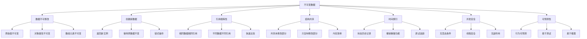

# 不可变数据

## 不可变数据概念

### 不可变性特征


### 可变 vs 不可变
| 特征 | 可变数据 | 不可变数据 |
|------|----------|------------|
| 修改方式 | 直接修改 | 创建新数据 |
| 内存使用 | 原地修改 | 结构共享 |
| 性能 | 修改快 | 创建快 |
| 安全性 | 可能被意外修改 | 不会被修改 |
| 并发性 | 需要同步 | 天然安全 |
| 调试 | 难以追踪 | 易于追踪 |
| 测试 | 需要重置状态 | 无需重置 |

## 基本不可变操作

### 数组不可变操作
```javascript
// 1. 添加元素
function addElement(array, element) {
    return [...array, element];
}

function addElementAt(array, index, element) {
    return [
        ...array.slice(0, index),
        element,
        ...array.slice(index)
    ];
}

// 使用示例
const numbers = [1, 2, 3];
const newNumbers = addElement(numbers, 4);
const newNumbersAt = addElementAt(numbers, 1, 1.5);

console.log(numbers); // [1, 2, 3] (原数组未变)
console.log(newNumbers); // [1, 2, 3, 4]
console.log(newNumbersAt); // [1, 1.5, 2, 3]

// 2. 删除元素
function removeElement(array, index) {
    return [
        ...array.slice(0, index),
        ...array.slice(index + 1)
    ];
}

function removeElementByValue(array, value) {
    return array.filter(item => item !== value);
}

// 使用示例
const fruits = ['apple', 'banana', 'orange'];
const newFruits = removeElement(fruits, 1);
const newFruitsByValue = removeElementByValue(fruits, 'banana');

console.log(fruits); // ['apple', 'banana', 'orange'] (原数组未变)
console.log(newFruits); // ['apple', 'orange']
console.log(newFruitsByValue); // ['apple', 'orange']

// 3. 更新元素
function updateElement(array, index, newValue) {
    return array.map((item, i) => i === index ? newValue : item);
}

function updateElementByCondition(array, condition, updater) {
    return array.map(item => condition(item) ? updater(item) : item);
}

// 使用示例
const users = [
    { id: 1, name: 'John', age: 30 },
    { id: 2, name: 'Jane', age: 25 },
    { id: 3, name: 'Bob', age: 35 }
];

const updatedUsers = updateElement(users, 1, { ...users[1], age: 26 });
const updatedUsersByCondition = updateElementByCondition(
    users,
    user => user.age > 30,
    user => ({ ...user, senior: true })
);

console.log(users); // 原数组未变
console.log(updatedUsers); // Jane的年龄更新为26
console.log(updatedUsersByCondition); // Bob标记为senior

// 4. 排序和过滤
function sortArray(array, compareFn) {
    return [...array].sort(compareFn);
}

function filterArray(array, predicate) {
    return array.filter(predicate);
}

// 使用示例
const numbers = [3, 1, 4, 1, 5, 9, 2, 6];
const sortedNumbers = sortArray(numbers, (a, b) => a - b);
const evenNumbers = filterArray(numbers, n => n % 2 === 0);

console.log(numbers); // [3, 1, 4, 1, 5, 9, 2, 6] (原数组未变)
console.log(sortedNumbers); // [1, 1, 2, 3, 4, 5, 6, 9]
console.log(evenNumbers); // [4, 2, 6]
```

### 对象不可变操作
```javascript
// 1. 添加属性
function addProperty(obj, key, value) {
    return { ...obj, [key]: value };
}

function addProperties(obj, properties) {
    return { ...obj, ...properties };
}

// 使用示例
const user = { name: 'John', age: 30 };
const newUser = addProperty(user, 'email', 'john@example.com');
const newUserWithProps = addProperties(user, { 
    email: 'john@example.com', 
    city: 'New York' 
});

console.log(user); // { name: 'John', age: 30 } (原对象未变)
console.log(newUser); // { name: 'John', age: 30, email: 'john@example.com' }
console.log(newUserWithProps); // { name: 'John', age: 30, email: 'john@example.com', city: 'New York' }

// 2. 删除属性
function removeProperty(obj, key) {
    const { [key]: removed, ...rest } = obj;
    return rest;
}

function removeProperties(obj, keys) {
    return keys.reduce((acc, key) => {
        const { [key]: removed, ...rest } = acc;
        return rest;
    }, obj);
}

// 使用示例
const user = { name: 'John', age: 30, email: 'john@example.com', city: 'New York' };
const newUser = removeProperty(user, 'age');
const newUserWithoutProps = removeProperties(user, ['email', 'city']);

console.log(user); // 原对象未变
console.log(newUser); // { name: 'John', email: 'john@example.com', city: 'New York' }
console.log(newUserWithoutProps); // { name: 'John', age: 30 }

// 3. 更新属性
function updateProperty(obj, key, value) {
    return { ...obj, [key]: value };
}

function updatePropertyByFunction(obj, key, updater) {
    return { ...obj, [key]: updater(obj[key]) };
}

// 使用示例
const user = { name: 'John', age: 30, score: 100 };
const newUser = updateProperty(user, 'age', 31);
const newUserWithFunction = updatePropertyByFunction(user, 'score', score => score + 10);

console.log(user); // 原对象未变
console.log(newUser); // { name: 'John', age: 31, score: 100 }
console.log(newUserWithFunction); // { name: 'John', age: 30, score: 110 }

// 4. 深度更新
function updateNestedProperty(obj, path, value) {
    if (path.length === 1) {
        return { ...obj, [path[0]]: value };
    }
    
    const [first, ...rest] = path;
    return {
        ...obj,
        [first]: updateNestedProperty(obj[first], rest, value)
    };
}

// 使用示例
const user = {
    name: 'John',
    address: {
        street: '123 Main St',
        city: 'New York',
        country: 'USA'
    }
};

const newUser = updateNestedProperty(user, ['address', 'city'], 'Boston');

console.log(user); // 原对象未变
console.log(newUser); // address.city 更新为 'Boston'
console.log(user.address === newUser.address); // false (新对象)
```

## 高级不可变操作

### 结构共享
```javascript
// 1. 基本结构共享
function updateArrayElement(array, index, newValue) {
    // 只复制需要修改的部分
    const newArray = [...array];
    newArray[index] = newValue;
    return newArray;
}

function updateObjectProperty(obj, key, value) {
    // 只复制需要修改的属性
    return { ...obj, [key]: value };
}

// 使用示例
const originalArray = [1, 2, 3, 4, 5];
const newArray = updateArrayElement(originalArray, 2, 10);

console.log(originalArray === newArray); // false
console.log(originalArray[0] === newArray[0]); // true (共享未修改元素)
console.log(originalArray[2] === newArray[2]); // false (修改的元素)

// 2. 深度结构共享
function deepUpdate(obj, path, value) {
    if (path.length === 0) return value;
    
    const [key, ...rest] = path;
    
    if (Array.isArray(obj)) {
        const newArray = [...obj];
        newArray[key] = deepUpdate(obj[key], rest, value);
        return newArray;
    } else {
        return {
            ...obj,
            [key]: deepUpdate(obj[key], rest, value)
        };
    }
}

// 使用示例
const state = {
    users: [
        { id: 1, name: 'John', posts: [{ id: 1, title: 'Post 1' }] },
        { id: 2, name: 'Jane', posts: [{ id: 2, title: 'Post 2' }] }
    ],
    settings: { theme: 'light', language: 'en' }
};

const newState = deepUpdate(state, ['users', 0, 'posts', 0, 'title'], 'Updated Post 1');

console.log(state === newState); // false
console.log(state.users === newState.users); // false
console.log(state.users[1] === newState.users[1]); // true (未修改的用户)
console.log(state.settings === newState.settings); // true (未修改的设置)

// 3. 批量更新
function batchUpdate(obj, updates) {
    return updates.reduce((acc, [path, value]) => {
        return deepUpdate(acc, path, value);
    }, obj);
}

// 使用示例
const state = {
    user: { name: 'John', age: 30 },
    posts: [{ id: 1, title: 'Post 1' }],
    settings: { theme: 'light' }
};

const newState = batchUpdate(state, [
    [['user', 'age'], 31],
    [['posts', 0, 'title'], 'Updated Post 1'],
    [['settings', 'theme'], 'dark']
]);

console.log(newState);
```

### 不可变数据结构
```javascript
// 1. 不可变列表
class ImmutableList {
    constructor(items = []) {
        this.items = [...items];
    }
    
    add(item) {
        return new ImmutableList([...this.items, item]);
    }
    
    remove(index) {
        return new ImmutableList([
            ...this.items.slice(0, index),
            ...this.items.slice(index + 1)
        ]);
    }
    
    update(index, item) {
        return new ImmutableList(
            this.items.map((existingItem, i) => i === index ? item : existingItem)
        );
    }
    
    get(index) {
        return this.items[index];
    }
    
    size() {
        return this.items.length;
    }
    
    toArray() {
        return [...this.items];
    }
}

// 使用示例
const list1 = new ImmutableList([1, 2, 3]);
const list2 = list1.add(4);
const list3 = list2.remove(1);
const list4 = list3.update(0, 10);

console.log(list1.toArray()); // [1, 2, 3]
console.log(list2.toArray()); // [1, 2, 3, 4]
console.log(list3.toArray()); // [1, 3, 4]
console.log(list4.toArray()); // [10, 3, 4]

// 2. 不可变映射
class ImmutableMap {
    constructor(entries = {}) {
        this.entries = { ...entries };
    }
    
    set(key, value) {
        return new ImmutableMap({ ...this.entries, [key]: value });
    }
    
    get(key) {
        return this.entries[key];
    }
    
    has(key) {
        return key in this.entries;
    }
    
    delete(key) {
        const { [key]: removed, ...rest } = this.entries;
        return new ImmutableMap(rest);
    }
    
    keys() {
        return Object.keys(this.entries);
    }
    
    values() {
        return Object.values(this.entries);
    }
    
    entries() {
        return Object.entries(this.entries);
    }
    
    toObject() {
        return { ...this.entries };
    }
}

// 使用示例
const map1 = new ImmutableMap({ a: 1, b: 2 });
const map2 = map1.set('c', 3);
const map3 = map2.delete('b');
const map4 = map3.set('a', 10);

console.log(map1.toObject()); // { a: 1, b: 2 }
console.log(map2.toObject()); // { a: 1, b: 2, c: 3 }
console.log(map3.toObject()); // { a: 1, c: 3 }
console.log(map4.toObject()); // { a: 10, c: 3 }

// 3. 不可变树
class ImmutableTree {
    constructor(value, children = []) {
        this.value = value;
        this.children = children.map(child => 
            child instanceof ImmutableTree ? child : new ImmutableTree(child)
        );
    }
    
    addChild(child) {
        return new ImmutableTree(this.value, [...this.children, child]);
    }
    
    removeChild(index) {
        return new ImmutableTree(
            this.value,
            this.children.filter((_, i) => i !== index)
        );
    }
    
    updateChild(index, newChild) {
        return new ImmutableTree(
            this.value,
            this.children.map((child, i) => i === index ? newChild : child)
        );
    }
    
    updateValue(newValue) {
        return new ImmutableTree(newValue, this.children);
    }
    
    find(predicate) {
        if (predicate(this.value)) {
            return this;
        }
        
        for (const child of this.children) {
            const found = child.find(predicate);
            if (found) return found;
        }
        
        return null;
    }
    
    map(fn) {
        return new ImmutableTree(
            fn(this.value),
            this.children.map(child => child.map(fn))
        );
    }
}

// 使用示例
const tree1 = new ImmutableTree('root', [
    new ImmutableTree('child1'),
    new ImmutableTree('child2', [
        new ImmutableTree('grandchild1')
    ])
]);

const tree2 = tree1.addChild(new ImmutableTree('child3'));
const tree3 = tree2.updateChild(0, new ImmutableTree('updated child1'));
const tree4 = tree3.map(value => value.toUpperCase());

console.log(tree1);
console.log(tree2);
console.log(tree3);
console.log(tree4);
```

## 不可变数据工具

### 实用工具函数
```javascript
// 1. 深度克隆
function deepClone(obj) {
    if (obj === null || typeof obj !== 'object') {
        return obj;
    }
    
    if (obj instanceof Date) {
        return new Date(obj.getTime());
    }
    
    if (obj instanceof Array) {
        return obj.map(item => deepClone(item));
    }
    
    if (typeof obj === 'object') {
        const cloned = {};
        for (const key in obj) {
            if (obj.hasOwnProperty(key)) {
                cloned[key] = deepClone(obj[key]);
            }
        }
        return cloned;
    }
}

// 2. 深度比较
function deepEqual(a, b) {
    if (a === b) return true;
    
    if (a == null || b == null) return false;
    
    if (typeof a !== typeof b) return false;
    
    if (typeof a !== 'object') return false;
    
    if (Array.isArray(a) !== Array.isArray(b)) return false;
    
    if (Array.isArray(a)) {
        if (a.length !== b.length) return false;
        for (let i = 0; i < a.length; i++) {
            if (!deepEqual(a[i], b[i])) return false;
        }
        return true;
    }
    
    const keysA = Object.keys(a);
    const keysB = Object.keys(b);
    
    if (keysA.length !== keysB.length) return false;
    
    for (const key of keysA) {
        if (!keysB.includes(key)) return false;
        if (!deepEqual(a[key], b[key])) return false;
    }
    
    return true;
}

// 3. 不可变更新工具
class ImmutableUpdater {
    static update(obj, path, value) {
        if (path.length === 0) return value;
        
        const [key, ...rest] = path;
        
        if (Array.isArray(obj)) {
            const newArray = [...obj];
            newArray[key] = this.update(obj[key], rest, value);
            return newArray;
        } else {
            return {
                ...obj,
                [key]: this.update(obj[key], rest, value)
            };
        }
    }
    
    static merge(target, source) {
        if (typeof target !== 'object' || typeof source !== 'object') {
            return source;
        }
        
        const result = { ...target };
        
        for (const key in source) {
            if (source.hasOwnProperty(key)) {
                if (typeof source[key] === 'object' && !Array.isArray(source[key])) {
                    result[key] = this.merge(target[key] || {}, source[key]);
                } else {
                    result[key] = source[key];
                }
            }
        }
        
        return result;
    }
    
    static setIn(obj, path, value) {
        return this.update(obj, path, value);
    }
    
    static getIn(obj, path) {
        return path.reduce((current, key) => current?.[key], obj);
    }
}

// 使用示例
const state = {
    user: { name: 'John', age: 30 },
    posts: [{ id: 1, title: 'Post 1' }]
};

const newState = ImmutableUpdater.update(state, ['user', 'age'], 31);
const mergedState = ImmutableUpdater.merge(state, { 
    user: { city: 'New York' },
    settings: { theme: 'dark' }
});

console.log(newState);
console.log(mergedState);
```

## 相关链接
- [[04-高级精通层/02-函数式编程/01-纯函数概念]] - 纯函数概念
- [[04-高级精通层/02-函数式编程/02-高阶函数]] - 高阶函数
- [[04-高级精通层/02-函数式编程/03-函数组合]] - 函数组合
- [[04-高级精通层/02-函数式编程/05-函数式库(Lodash-Ramda)]] - 函数式库
- [[04-高级精通层/02-函数式编程/06-代码示例库-函数式编程]] - 代码示例
