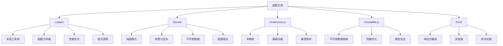

# 函数式库(Lodash-Ramda)

## 函数式库概述

### 主要函数式库对比


### 库特性对比
| 特性 | Lodash | Ramda | Underscore | Immutable | RxJS |
|------|--------|-------|------------|-----------|------|
| 函数式风格 | 部分支持 | 完全支持 | 部分支持 | 完全支持 | 完全支持 |
| 柯里化 | 部分支持 | 完全支持 | 不支持 | 不支持 | 部分支持 |
| 不可变性 | 部分支持 | 完全支持 | 不支持 | 完全支持 | 完全支持 |
| 性能 | 优秀 | 良好 | 良好 | 优秀 | 优秀 |
| 包大小 | 较大 | 中等 | 中等 | 较大 | 较大 |
| 学习曲线 | 平缓 | 陡峭 | 平缓 | 中等 | 陡峭 |

## Lodash函数式编程

### 基本函数式操作
```javascript
// 1. 数组操作
import _ from 'lodash';

const numbers = [1, 2, 3, 4, 5, 6, 7, 8, 9, 10];

// 链式调用
const result = _.chain(numbers)
    .filter(n => n % 2 === 0)
    .map(n => n * 2)
    .take(3)
    .value();

console.log(result); // [4, 8, 12]

// 2. 对象操作
const users = [
    { id: 1, name: 'John', age: 30, city: 'New York' },
    { id: 2, name: 'Jane', age: 25, city: 'Boston' },
    { id: 3, name: 'Bob', age: 35, city: 'New York' }
];

// 分组和统计
const groupedByCity = _.groupBy(users, 'city');
const averageAge = _.meanBy(users, 'age');
const oldestUser = _.maxBy(users, 'age');

console.log(groupedByCity);
console.log(averageAge); // 30
console.log(oldestUser); // { id: 3, name: 'Bob', age: 35, city: 'New York' }

// 3. 函数式工具
const add = (a, b) => a + b;
const multiply = (a, b) => a * b;

// 柯里化
const curriedAdd = _.curry(add);
const add5 = curriedAdd(5);

console.log(add5(3)); // 8

// 部分应用
const multiplyBy2 = _.partial(multiply, 2);
console.log(multiplyBy2(5)); // 10

// 4. 深度操作
const data = {
    user: {
        profile: {
            name: 'John',
            settings: {
                theme: 'dark',
                language: 'en'
            }
        }
    }
};

// 深度获取
const theme = _.get(data, 'user.profile.settings.theme');
console.log(theme); // 'dark'

// 深度设置
const newData = _.set(data, 'user.profile.settings.theme', 'light');
console.log(newData.user.profile.settings.theme); // 'light'

// 深度合并
const defaultSettings = {
    user: {
        profile: {
            settings: {
                theme: 'light',
                notifications: true
            }
        }
    }
};

const mergedData = _.merge(defaultSettings, data);
console.log(mergedData);
```

### Lodash函数式模式
```javascript
// 1. 函数组合
const processUsers = _.flow([
    users => _.filter(users, user => user.active),
    users => _.map(users, user => ({ ...user, name: user.name.toUpperCase() })),
    users => _.sortBy(users, 'age'),
    users => _.take(users, 5)
]);

const users = [
    { id: 1, name: 'john', age: 30, active: true },
    { id: 2, name: 'jane', age: 25, active: false },
    { id: 3, name: 'bob', age: 35, active: true }
];

console.log(processUsers(users));

// 2. 条件函数
const isEven = n => n % 2 === 0;
const isPositive = n => n > 0;

const processNumber = _.cond([
    [isEven, n => `Even: ${n}`],
    [isPositive, n => `Positive: ${n}`],
    [_.stubTrue, n => `Other: ${n}`]
]);

console.log(processNumber(4)); // Even: 4
console.log(processNumber(3)); // Positive: 3
console.log(processNumber(-2)); // Other: -2

// 3. 记忆化
const expensiveCalculation = (n) => {
    console.log(`Calculating for ${n}...`);
    let result = 0;
    for (let i = 0; i < n * 1000000; i++) {
        result += i;
    }
    return result;
};

const memoizedCalculation = _.memoize(expensiveCalculation);

console.log(memoizedCalculation(1000)); // 计算
console.log(memoizedCalculation(1000)); // 从缓存获取

// 4. 防抖和节流
const searchInput = document.getElementById('search');
const debouncedSearch = _.debounce((query) => {
    console.log(`Searching for: ${query}`);
}, 300);

const throttledScroll = _.throttle(() => {
    console.log('Scroll event');
}, 100);

searchInput.addEventListener('input', (e) => {
    debouncedSearch(e.target.value);
});

window.addEventListener('scroll', throttledScroll);
```

## Ramda函数式编程

### 基本Ramda操作
```javascript
// 1. 基本函数
import R from 'ramda';

const numbers = [1, 2, 3, 4, 5, 6, 7, 8, 9, 10];

// 函数组合
const processNumbers = R.pipe(
    R.filter(n => n % 2 === 0),
    R.map(n => n * 2),
    R.take(3)
);

console.log(processNumbers(numbers)); // [4, 8, 12]

// 2. 柯里化
const add = (a, b) => a + b;
const curriedAdd = R.curry(add);

const add5 = curriedAdd(5);
console.log(add5(3)); // 8

// 3. 对象操作
const users = [
    { id: 1, name: 'John', age: 30, city: 'New York' },
    { id: 2, name: 'Jane', age: 25, city: 'Boston' },
    { id: 3, name: 'Bob', age: 35, city: 'New York' }
];

// 投影和过滤
const activeUsers = R.filter(R.prop('active'), users);
const userNames = R.map(R.prop('name'), users);
const userAges = R.pluck('age', users);

// 分组
const groupedByCity = R.groupBy(R.prop('city'), users);
const averageAge = R.mean(userAges);

console.log(groupedByCity);
console.log(averageAge); // 30

// 4. 函数组合
const getActiveUserNames = R.pipe(
    R.filter(R.prop('active')),
    R.map(R.prop('name')),
    R.map(R.toUpper)
);

console.log(getActiveUserNames(users));
```

### Ramda高级模式
```javascript
// 1. 透镜(Lens)
const user = {
    name: 'John',
    address: {
        street: '123 Main St',
        city: 'New York'
    }
};

// 创建透镜
const nameLens = R.lensProp('name');
const cityLens = R.lensPath(['address', 'city']);

// 使用透镜
const newName = R.set(nameLens, 'Jane', user);
const currentCity = R.view(cityLens, user);
const upperCaseName = R.over(nameLens, R.toUpper, user);

console.log(newName);
console.log(currentCity); // 'New York'
console.log(upperCaseName);

// 2. 函数组合器
const isEven = n => n % 2 === 0;
const isPositive = n => n > 0;

// 条件组合
const processNumber = R.cond([
    [isEven, R.always('Even')],
    [isPositive, R.always('Positive')],
    [R.T, R.always('Other')]
]);

console.log(processNumber(4)); // 'Even'
console.log(processNumber(3)); // 'Positive'
console.log(processNumber(-2)); // 'Other'

// 3. 函数组合
const add = R.curry((a, b) => a + b);
const multiply = R.curry((a, b) => a * b);

const calculate = R.pipe(
    add(5),
    multiply(2),
    add(-3)
);

console.log(calculate(10)); // ((10 + 5) * 2) - 3 = 27

// 4. 不可变操作
const state = {
    users: [
        { id: 1, name: 'John', age: 30 },
        { id: 2, name: 'Jane', age: 25 }
    ],
    settings: { theme: 'light' }
};

// 不可变更新
const updateUserAge = (userId, newAge) => R.over(
    R.lensPath(['users']),
    R.map(user => 
        user.id === userId 
            ? R.assoc('age', newAge, user)
            : user
    )
);

const newState = updateUserAge(1, 31);
console.log(newState);
console.log(state === newState); // false
```

## Immutable.js

### 不可变数据结构
```javascript
// 1. List操作
import { List, Map, Set } from 'immutable';

const numbers = List([1, 2, 3, 4, 5]);
const doubled = numbers.map(n => n * 2);
const evens = numbers.filter(n => n % 2 === 0);

console.log(numbers.toArray()); // [1, 2, 3, 4, 5]
console.log(doubled.toArray()); // [2, 4, 6, 8, 10]
console.log(evens.toArray()); // [2, 4]

// 2. Map操作
const user = Map({
    name: 'John',
    age: 30,
    address: Map({
        street: '123 Main St',
        city: 'New York'
    })
});

const newUser = user
    .set('age', 31)
    .setIn(['address', 'city'], 'Boston');

console.log(user.get('age')); // 30
console.log(newUser.get('age')); // 31
console.log(newUser.getIn(['address', 'city'])); // 'Boston'

// 3. Set操作
const colors = Set(['red', 'green', 'blue']);
const newColors = colors.add('yellow').delete('red');

console.log(colors.has('red')); // true
console.log(newColors.has('red')); // false
console.log(newColors.has('yellow')); // true

// 4. 深度更新
const state = Map({
    users: List([
        Map({ id: 1, name: 'John', age: 30 }),
        Map({ id: 2, name: 'Jane', age: 25 })
    ]),
    settings: Map({ theme: 'light' })
});

const newState = state.updateIn(['users', 0, 'age'], age => age + 1);
console.log(newState.getIn(['users', 0, 'age'])); // 31
```

## RxJS响应式编程

### 基本流操作
```javascript
// 1. 基本流
import { from, of, interval } from 'rxjs';
import { map, filter, take, debounceTime, throttleTime } from 'rxjs/operators';

// 创建流
const numbers$ = from([1, 2, 3, 4, 5]);
const timer$ = interval(1000);

// 操作流
const processed$ = numbers$.pipe(
    filter(n => n % 2 === 0),
    map(n => n * 2),
    take(3)
);

processed$.subscribe(value => console.log(value)); // 4, 8

// 2. 异步流
const searchInput = document.getElementById('search');
const search$ = fromEvent(searchInput, 'input').pipe(
    map(event => event.target.value),
    debounceTime(300),
    filter(query => query.length > 2),
    distinctUntilChanged()
);

search$.subscribe(query => {
    console.log(`Searching for: ${query}`);
});

// 3. 流组合
const stream1$ = of(1, 2, 3);
const stream2$ = of('a', 'b', 'c');

const combined$ = combineLatest([stream1$, stream2$]).pipe(
    map(([num, letter]) => `${num}${letter}`)
);

combined$.subscribe(value => console.log(value)); // 3a, 3b, 3c

// 4. 错误处理
const errorProne$ = of(1, 2, 3, 'error', 4).pipe(
    map(value => {
        if (value === 'error') {
            throw new Error('Something went wrong');
        }
        return value * 2;
    }),
    catchError(error => of('Error handled:', error.message))
);

errorProne$.subscribe(value => console.log(value));
```

## 库选择指南

### 选择标准
```javascript
// 1. 项目需求分析
const projectRequirements = {
    // 简单工具函数
    simpleUtils: {
        recommendation: 'Lodash',
        reason: '功能全面，性能优秀，学习曲线平缓'
    },
    
    // 纯函数式编程
    functionalProgramming: {
        recommendation: 'Ramda',
        reason: '完全函数式，柯里化优先，不可变数据'
    },
    
    // 大型状态管理
    stateManagement: {
        recommendation: 'Immutable.js',
        reason: '不可变数据结构，性能优化，类型安全'
    },
    
    // 异步流处理
    asyncStreams: {
        recommendation: 'RxJS',
        reason: '响应式编程，流处理，异步操作'
    },
    
    // 轻量级项目
    lightweight: {
        recommendation: 'Underscore.js',
        reason: '包大小小，基础功能，兼容性好'
    }
};

// 2. 性能考虑
const performanceComparison = {
    lodash: {
        pros: ['高度优化', '链式调用', '内存效率'],
        cons: ['包大小较大', '部分函数式']
    },
    
    ramda: {
        pros: ['纯函数式', '柯里化', '函数组合'],
        cons: ['性能一般', '学习曲线陡峭']
    },
    
    immutable: {
        pros: ['结构共享', '性能优秀', '类型安全'],
        cons: ['包大小大', 'API复杂']
    }
};

// 3. 团队技能
const teamSkills = {
    beginner: {
        recommendation: 'Lodash',
        reason: '文档完善，社区支持，学习资源丰富'
    },
    
    intermediate: {
        recommendation: 'Ramda',
        reason: '函数式编程概念，提升代码质量'
    },
    
    advanced: {
        recommendation: 'Immutable.js + RxJS',
        reason: '复杂状态管理，响应式编程'
    }
};
```

## 相关链接
- [[04-高级精通层/02-函数式编程/01-纯函数概念]] - 纯函数概念
- [[04-高级精通层/02-函数式编程/02-高阶函数]] - 高阶函数
- [[04-高级精通层/02-函数式编程/03-函数组合]] - 函数组合
- [[04-高级精通层/02-函数式编程/04-不可变数据]] - 不可变数据
- [[04-高级精通层/02-函数式编程/06-代码示例库-函数式编程]] - 代码示例
