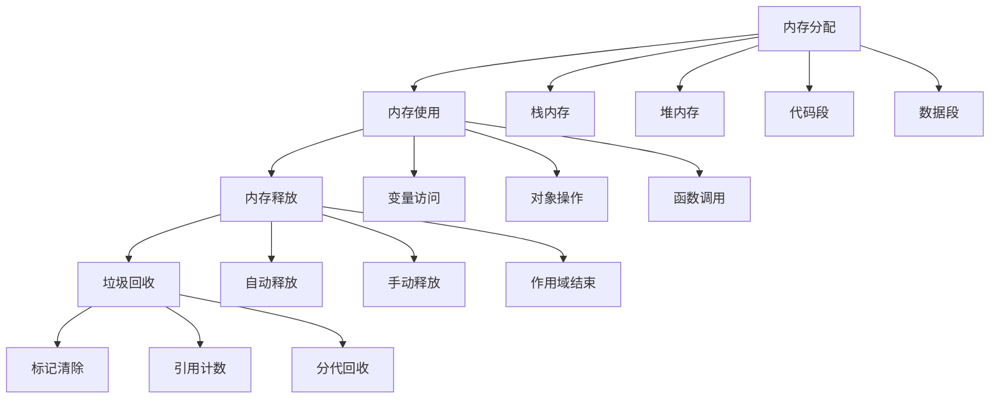

# 内存管理

## 内存管理基础

### 内存生命周期


### 内存类型
| 类型 | 特点 | 生命周期 | 管理方式 |
|------|------|----------|----------|
| 栈内存 | 快速访问，大小固定 | 函数调用期间 | 自动管理 |
| 堆内存 | 动态分配，大小可变 | 直到被回收 | 垃圾回收器 |
| 代码段 | 存储代码 | 程序运行期间 | 系统管理 |
| 数据段 | 存储全局变量 | 程序运行期间 | 系统管理 |

## 内存分配

### 基本内存分配
```javascript
// 1. 栈内存分配
function stackMemoryExample() {
    // 基本类型存储在栈中
    let number = 42;        // 数字
    let string = "hello";   // 字符串
    let boolean = true;     // 布尔值
    let nullValue = null;   // null
    let undefinedValue;     // undefined
    
    // 函数调用时，参数和局部变量在栈中
    function innerFunction(param) {
        let localVar = param * 2;
        return localVar;
    }
    
    return innerFunction(number);
}

// 2. 堆内存分配
function heapMemoryExample() {
    // 对象和数组存储在堆中
    let object = {
        name: "John",
        age: 30,
        hobbies: ["reading", "coding"]
    };
    
    let array = [1, 2, 3, 4, 5];
    let functionRef = function() { return "hello"; };
    
    // 复杂对象
    let complexObject = {
        user: {
            profile: {
                name: "Jane",
                settings: {
                    theme: "dark",
                    notifications: true
                }
            }
        },
        posts: [
            { id: 1, title: "Post 1" },
            { id: 2, title: "Post 2" }
        ]
    };
    
    return { object, array, functionRef, complexObject };
}

// 3. 内存分配模式
class MemoryAllocationPatterns {
    // 对象池模式
    static createObjectPool(size) {
        const pool = [];
        for (let i = 0; i < size; i++) {
            pool.push({
                id: i,
                data: null,
                inUse: false
            });
        }
        return pool;
    }
    
    // 获取对象
    static getObject(pool) {
        for (let obj of pool) {
            if (!obj.inUse) {
                obj.inUse = true;
                return obj;
            }
        }
        return null; // 池已满
    }
    
    // 释放对象
    static releaseObject(pool, obj) {
        obj.inUse = false;
        obj.data = null;
    }
    
    // 预分配数组
    static preAllocateArray(size, initialValue = 0) {
        const array = new Array(size);
        for (let i = 0; i < size; i++) {
            array[i] = initialValue;
        }
        return array;
    }
    
    // 字符串构建器
    static createStringBuilder() {
        const parts = [];
        return {
            append: function(str) {
                parts.push(str);
                return this;
            },
            toString: function() {
                return parts.join('');
            },
            clear: function() {
                parts.length = 0;
                return this;
            }
        };
    }
}

// 使用示例
const pool = MemoryAllocationPatterns.createObjectPool(10);
const obj = MemoryAllocationPatterns.getObject(pool);
if (obj) {
    obj.data = "some data";
    console.log(obj);
    MemoryAllocationPatterns.releaseObject(pool, obj);
}

const stringBuilder = MemoryAllocationPatterns.createStringBuilder();
const result = stringBuilder
    .append("Hello")
    .append(" ")
    .append("World")
    .toString();
console.log(result); // "Hello World"
```

### 内存优化策略
```javascript
// 1. 避免内存泄漏
class MemoryLeakPrevention {
    // 避免循环引用
    static createCircularReference() {
        const obj1 = { name: "Object 1" };
        const obj2 = { name: "Object 2" };
        
        // 创建循环引用
        obj1.ref = obj2;
        obj2.ref = obj1;
        
        return { obj1, obj2 };
    }
    
    // 正确的事件监听器管理
    static createEventListenerManager() {
        const listeners = new Map();
        
        return {
            addEventListener: function(element, event, handler) {
                if (!listeners.has(element)) {
                    listeners.set(element, new Map());
                }
                listeners.get(element).set(event, handler);
                element.addEventListener(event, handler);
            },
            
            removeEventListener: function(element, event) {
                const elementListeners = listeners.get(element);
                if (elementListeners && elementListeners.has(event)) {
                    const handler = elementListeners.get(event);
                    element.removeEventListener(event, handler);
                    elementListeners.delete(event);
                }
            },
            
            removeAllListeners: function(element) {
                const elementListeners = listeners.get(element);
                if (elementListeners) {
                    for (const [event, handler] of elementListeners) {
                        element.removeEventListener(event, handler);
                    }
                    listeners.delete(element);
                }
            }
        };
    }
    
    // 定时器管理
    static createTimerManager() {
        const timers = new Set();
        
        return {
            setTimeout: function(callback, delay) {
                const id = setTimeout(() => {
                    timers.delete(id);
                    callback();
                }, delay);
                timers.add(id);
                return id;
            },
            
            setInterval: function(callback, interval) {
                const id = setInterval(callback, interval);
                timers.add(id);
                return id;
            },
            
            clearTimeout: function(id) {
                clearTimeout(id);
                timers.delete(id);
            },
            
            clearInterval: function(id) {
                clearInterval(id);
                timers.delete(id);
            },
            
            clearAll: function() {
                for (const id of timers) {
                    clearTimeout(id);
                    clearInterval(id);
                }
                timers.clear();
            }
        };
    }
}

// 使用示例
const eventManager = MemoryLeakPrevention.createEventListenerManager();
const timerManager = MemoryLeakPrevention.createTimerManager();

// 2. 内存使用监控
class MemoryMonitor {
    static getMemoryUsage() {
        if (performance.memory) {
            return {
                used: performance.memory.usedJSHeapSize,
                total: performance.memory.totalJSHeapSize,
                limit: performance.memory.jsHeapSizeLimit,
                usedMB: Math.round(performance.memory.usedJSHeapSize / 1024 / 1024),
                totalMB: Math.round(performance.memory.totalJSHeapSize / 1024 / 1024),
                limitMB: Math.round(performance.memory.jsHeapSizeLimit / 1024 / 1024)
            };
        }
        return null;
    }
    
    static logMemoryUsage(label = 'Memory Usage') {
        const usage = this.getMemoryUsage();
        if (usage) {
            console.log(`${label}:`, {
                used: `${usage.usedMB}MB`,
                total: `${usage.totalMB}MB`,
                limit: `${usage.limitMB}MB`,
                percentage: `${Math.round((usage.used / usage.limit) * 100)}%`
            });
        }
    }
    
    static monitorMemory(interval = 5000) {
        return setInterval(() => {
            this.logMemoryUsage('Memory Monitor');
        }, interval);
    }
}

// 使用示例
MemoryMonitor.logMemoryUsage('Initial');
const monitor = MemoryMonitor.monitorMemory(3000);

// 3. 内存优化技巧
class MemoryOptimization {
    // 对象复用
    static createObjectReuser() {
        const reusableObjects = [];
        
        return {
            get: function() {
                return reusableObjects.pop() || {};
            },
            
            release: function(obj) {
                // 清理对象
                for (const key in obj) {
                    if (obj.hasOwnProperty(key)) {
                        delete obj[key];
                    }
                }
                reusableObjects.push(obj);
            }
        };
    }
    
    // 数组池
    static createArrayPool() {
        const arrays = [];
        
        return {
            get: function(size = 0) {
                let array = arrays.pop();
                if (!array || array.length < size) {
                    array = new Array(size);
                } else {
                    array.length = size;
                }
                return array;
            },
            
            release: function(array) {
                array.length = 0;
                arrays.push(array);
            }
        };
    }
    
    // 字符串优化
    static optimizeStringConcatenation(strings) {
        // 使用数组join而不是字符串拼接
        const parts = [];
        for (const str of strings) {
            parts.push(str);
        }
        return parts.join('');
    }
    
    // 对象属性优化
    static optimizeObjectProperties(obj) {
        // 使用Object.freeze防止对象被修改
        return Object.freeze(obj);
    }
}

// 使用示例
const objectReuser = MemoryOptimization.createObjectReuser();
const arrayPool = MemoryOptimization.createArrayPool();

const obj = objectReuser.get();
obj.name = "test";
console.log(obj);
objectReuser.release(obj);

const array = arrayPool.get(100);
// 使用数组
arrayPool.release(array);
```

## 垃圾回收

### 垃圾回收机制
```javascript
// 1. 引用计数
class ReferenceCounter {
    constructor() {
        this.references = new Map();
    }
    
    addReference(obj) {
        const count = this.references.get(obj) || 0;
        this.references.set(obj, count + 1);
    }
    
    removeReference(obj) {
        const count = this.references.get(obj) || 0;
        if (count <= 1) {
            this.references.delete(obj);
            return true; // 可以回收
        } else {
            this.references.set(obj, count - 1);
            return false; // 不能回收
        }
    }
    
    getReferenceCount(obj) {
        return this.references.get(obj) || 0;
    }
}

// 使用示例
const counter = new ReferenceCounter();
const obj1 = { name: "Object 1" };
const obj2 = { name: "Object 2" };

counter.addReference(obj1);
counter.addReference(obj1);
console.log(counter.getReferenceCount(obj1)); // 2

counter.removeReference(obj1);
console.log(counter.getReferenceCount(obj1)); // 1

counter.removeReference(obj1);
console.log(counter.getReferenceCount(obj1)); // 0 (可以回收)

// 2. 标记清除
class MarkAndSweep {
    constructor() {
        this.roots = new Set();
        this.objects = new Map();
    }
    
    addRoot(obj) {
        this.roots.add(obj);
    }
    
    removeRoot(obj) {
        this.roots.delete(obj);
    }
    
    addObject(obj, properties = []) {
        this.objects.set(obj, properties);
    }
    
    mark() {
        const marked = new Set();
        
        // 从根对象开始标记
        for (const root of this.roots) {
            this.markObject(root, marked);
        }
        
        return marked;
    }
    
    markObject(obj, marked) {
        if (marked.has(obj)) return;
        
        marked.add(obj);
        const properties = this.objects.get(obj) || [];
        
        for (const prop of properties) {
            if (typeof prop === 'object' && prop !== null) {
                this.markObject(prop, marked);
            }
        }
    }
    
    sweep(marked) {
        const toDelete = [];
        
        for (const obj of this.objects.keys()) {
            if (!marked.has(obj)) {
                toDelete.push(obj);
            }
        }
        
        for (const obj of toDelete) {
            this.objects.delete(obj);
        }
        
        return toDelete.length;
    }
    
    collect() {
        const marked = this.mark();
        return this.sweep(marked);
    }
}

// 使用示例
const gc = new MarkAndSweep();
const obj1 = { name: "Object 1" };
const obj2 = { name: "Object 2" };
const obj3 = { name: "Object 3" };

gc.addObject(obj1, [obj2]);
gc.addObject(obj2, [obj3]);
gc.addObject(obj3, []);

gc.addRoot(obj1); // obj1是根对象

const collected = gc.collect();
console.log(`Collected ${collected} objects`);

// 3. 分代回收
class GenerationalGC {
    constructor() {
        this.youngGeneration = new Set();
        this.oldGeneration = new Set();
        this.ageMap = new Map();
    }
    
    allocate(obj) {
        this.youngGeneration.add(obj);
        this.ageMap.set(obj, 0);
    }
    
    promote(obj) {
        this.youngGeneration.delete(obj);
        this.oldGeneration.add(obj);
    }
    
    ageObject(obj) {
        const currentAge = this.ageMap.get(obj) || 0;
        this.ageMap.set(obj, currentAge + 1);
        
        // 如果对象年龄超过阈值，提升到老年代
        if (currentAge >= 2) {
            this.promote(obj);
        }
    }
    
    collectYoung() {
        // 年轻代垃圾回收
        const toDelete = [];
        for (const obj of this.youngGeneration) {
            if (Math.random() < 0.5) { // 模拟垃圾回收
                toDelete.push(obj);
            } else {
                this.ageObject(obj);
            }
        }
        
        for (const obj of toDelete) {
            this.youngGeneration.delete(obj);
            this.ageMap.delete(obj);
        }
        
        return toDelete.length;
    }
    
    collectOld() {
        // 老年代垃圾回收
        const toDelete = [];
        for (const obj of this.oldGeneration) {
            if (Math.random() < 0.1) { // 老年代回收频率较低
                toDelete.push(obj);
            }
        }
        
        for (const obj of toDelete) {
            this.oldGeneration.delete(obj);
            this.ageMap.delete(obj);
        }
        
        return toDelete.length;
    }
}

// 使用示例
const generationalGC = new GenerationalGC();

// 分配一些对象
for (let i = 0; i < 100; i++) {
    generationalGC.allocate({ id: i, data: `data${i}` });
}

// 执行垃圾回收
const youngCollected = generationalGC.collectYoung();
const oldCollected = generationalGC.collectOld();

console.log(`Young generation collected: ${youngCollected}`);
console.log(`Old generation collected: ${oldCollected}`);
```

### 垃圾回收优化
```javascript
// 1. 减少垃圾回收压力
class GarbageCollectionOptimization {
    // 对象池
    static createObjectPool(createFn, resetFn) {
        const pool = [];
        
        return {
            get: function() {
                if (pool.length > 0) {
                    return pool.pop();
                }
                return createFn();
            },
            
            release: function(obj) {
                resetFn(obj);
                pool.push(obj);
            },
            
            size: function() {
                return pool.length;
            }
        };
    }
    
    // 字符串池
    static createStringPool() {
        const pool = new Map();
        
        return {
            get: function(str) {
                if (pool.has(str)) {
                    return pool.get(str);
                }
                pool.set(str, str);
                return str;
            },
            
            clear: function() {
                pool.clear();
            }
        };
    }
    
    // 数组复用
    static createArrayReuser() {
        const arrays = [];
        
        return {
            get: function(size = 0) {
                let array = arrays.pop();
                if (!array) {
                    array = [];
                }
                array.length = size;
                return array;
            },
            
            release: function(array) {
                array.length = 0;
                arrays.push(array);
            }
        };
    }
}

// 使用示例
const objectPool = GarbageCollectionOptimization.createObjectPool(
    () => ({ data: null, timestamp: 0 }),
    (obj) => { obj.data = null; obj.timestamp = 0; }
);

const stringPool = GarbageCollectionOptimization.createStringPool();
const arrayReuser = GarbageCollectionOptimization.createArrayReuser();

// 2. 内存泄漏检测
class MemoryLeakDetector {
    constructor() {
        this.snapshots = [];
        this.leaks = new Set();
    }
    
    takeSnapshot(label) {
        const snapshot = {
            label,
            timestamp: Date.now(),
            memory: MemoryMonitor.getMemoryUsage(),
            objects: this.countObjects()
        };
        
        this.snapshots.push(snapshot);
        return snapshot;
    }
    
    countObjects() {
        // 简化的对象计数
        return {
            total: 0,
            arrays: 0,
            objects: 0,
            functions: 0
        };
    }
    
    detectLeaks() {
        if (this.snapshots.length < 2) return [];
        
        const leaks = [];
        const latest = this.snapshots[this.snapshots.length - 1];
        const previous = this.snapshots[this.snapshots.length - 2];
        
        const memoryIncrease = latest.memory.used - previous.memory.used;
        const timeIncrease = latest.timestamp - previous.timestamp;
        
        if (memoryIncrease > 1024 * 1024) { // 1MB increase
            leaks.push({
                type: 'memory',
                increase: memoryIncrease,
                time: timeIncrease,
                severity: memoryIncrease > 10 * 1024 * 1024 ? 'high' : 'medium'
            });
        }
        
        return leaks;
    }
    
    generateReport() {
        const leaks = this.detectLeaks();
        return {
            snapshots: this.snapshots.length,
            leaks: leaks,
            summary: {
                totalLeaks: leaks.length,
                highSeverity: leaks.filter(l => l.severity === 'high').length,
                mediumSeverity: leaks.filter(l => l.severity === 'medium').length
            }
        };
    }
}

// 使用示例
const detector = new MemoryLeakDetector();

// 定期检测
setInterval(() => {
    detector.takeSnapshot(`Snapshot ${Date.now()}`);
    const report = detector.generateReport();
    if (report.leaks.length > 0) {
        console.log('Memory leaks detected:', report);
    }
}, 5000);

// 3. 性能监控
class PerformanceMonitor {
    constructor() {
        this.metrics = [];
        this.startTime = Date.now();
    }
    
    measure(name, fn) {
        const start = performance.now();
        const result = fn();
        const end = performance.now();
        
        const metric = {
            name,
            duration: end - start,
            timestamp: Date.now(),
            memory: MemoryMonitor.getMemoryUsage()
        };
        
        this.metrics.push(metric);
        return result;
    }
    
    async measureAsync(name, fn) {
        const start = performance.now();
        const result = await fn();
        const end = performance.now();
        
        const metric = {
            name,
            duration: end - start,
            timestamp: Date.now(),
            memory: MemoryMonitor.getMemoryUsage()
        };
        
        this.metrics.push(metric);
        return result;
    }
    
    getAverageDuration(name) {
        const relevantMetrics = this.metrics.filter(m => m.name === name);
        if (relevantMetrics.length === 0) return 0;
        
        const total = relevantMetrics.reduce((sum, m) => sum + m.duration, 0);
        return total / relevantMetrics.length;
    }
    
    getMemoryTrend() {
        return this.metrics.map(m => ({
            timestamp: m.timestamp,
            memory: m.memory?.used || 0
        }));
    }
    
    generateReport() {
        const uniqueNames = [...new Set(this.metrics.map(m => m.name))];
        const averages = uniqueNames.map(name => ({
            name,
            averageDuration: this.getAverageDuration(name),
            callCount: this.metrics.filter(m => m.name === name).length
        }));
        
        return {
            totalMetrics: this.metrics.length,
            averages,
            memoryTrend: this.getMemoryTrend(),
            runtime: Date.now() - this.startTime
        };
    }
}

// 使用示例
const monitor = new PerformanceMonitor();

// 测量同步函数
const result = monitor.measure('syncFunction', () => {
    let sum = 0;
    for (let i = 0; i < 1000000; i++) {
        sum += i;
    }
    return sum;
});

// 测量异步函数
monitor.measureAsync('asyncFunction', async () => {
    await new Promise(resolve => setTimeout(resolve, 100));
    return 'async result';
});

// 生成报告
setTimeout(() => {
    const report = monitor.generateReport();
    console.log('Performance Report:', report);
}, 2000);
```

## 相关链接
- [[04-高级精通层/03-性能优化/02-垃圾回收机制]] - 垃圾回收机制
- [[04-高级精通层/03-性能优化/03-代码分割]] - 代码分割
- [[04-高级精通层/03-性能优化/04-懒加载策略]] - 懒加载策略
- [[04-高级精通层/03-性能优化/05-缓存机制]] - 缓存机制
- [[04-高级精通层/03-性能优化/06-性能监控工具]] - 性能监控工具
- [[04-高级精通层/03-性能优化/07-代码示例库-性能优化]] - 代码示例
