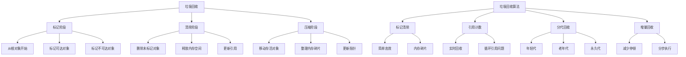

# 垃圾回收机制

## 垃圾回收基础

### 垃圾回收原理


### 垃圾回收算法对比
| 算法 | 优点 | 缺点 | 适用场景 |
|------|------|------|----------|
| 标记清除 | 简单，处理循环引用 | 内存碎片，停顿时间长 | 一般应用 |
| 引用计数 | 实时回收，无停顿 | 循环引用，计数器开销 | 简单对象 |
| 分代回收 | 效率高，停顿短 | 实现复杂 | 大型应用 |
| 增量回收 | 停顿时间短 | 实现复杂，总时间更长 | 实时应用 |

## 标记清除算法

### 基本标记清除
```javascript
// 1. 标记清除实现
class MarkAndSweepGC {
    constructor() {
        this.heap = new Map();
        this.roots = new Set();
        this.marked = new Set();
    }
    
    // 分配对象
    allocate(id, properties = []) {
        const obj = {
            id,
            properties,
            marked: false
        };
        this.heap.set(id, obj);
        return obj;
    }
    
    // 添加根对象
    addRoot(objId) {
        this.roots.add(objId);
    }
    
    // 移除根对象
    removeRoot(objId) {
        this.roots.delete(objId);
    }
    
    // 标记阶段
    mark() {
        this.marked.clear();
        
        // 从根对象开始标记
        for (const rootId of this.roots) {
            this.markObject(rootId);
        }
    }
    
    // 递归标记对象
    markObject(objId) {
        if (this.marked.has(objId)) return;
        
        const obj = this.heap.get(objId);
        if (!obj) return;
        
        this.marked.add(objId);
        obj.marked = true;
        
        // 标记所有引用的对象
        for (const prop of obj.properties) {
            if (typeof prop === 'object' && prop.id) {
                this.markObject(prop.id);
            }
        }
    }
    
    // 清除阶段
    sweep() {
        const toDelete = [];
        
        for (const [objId, obj] of this.heap) {
            if (!this.marked.has(objId)) {
                toDelete.push(objId);
            } else {
                obj.marked = false;
            }
        }
        
        // 删除未标记的对象
        for (const objId of toDelete) {
            this.heap.delete(objId);
        }
        
        return toDelete.length;
    }
    
    // 执行垃圾回收
    collect() {
        console.log('Starting garbage collection...');
        const beforeSize = this.heap.size();
        
        this.mark();
        const collected = this.sweep();
        
        const afterSize = this.heap.size();
        console.log(`GC completed. Collected ${collected} objects. Heap size: ${beforeSize} -> ${afterSize}`);
        
        return collected;
    }
    
    // 获取堆状态
    getHeapStatus() {
        return {
            totalObjects: this.heap.size(),
            rootObjects: this.roots.size(),
            markedObjects: this.marked.size()
        };
    }
}

// 使用示例
const gc = new MarkAndSweepGC();

// 创建对象
const obj1 = gc.allocate('obj1', []);
const obj2 = gc.allocate('obj2', [obj1]);
const obj3 = gc.allocate('obj3', [obj2]);
const obj4 = gc.allocate('obj4', []); // 孤立对象

// 设置根对象
gc.addRoot('obj1');

// 执行垃圾回收
gc.collect(); // obj4 将被回收

// 2. 改进的标记清除
class ImprovedMarkAndSweepGC extends MarkAndSweepGC {
    constructor() {
        super();
        this.freeList = [];
        this.compactionEnabled = true;
    }
    
    // 分配对象（使用空闲列表）
    allocate(id, properties = []) {
        let obj;
        
        if (this.freeList.length > 0) {
            obj = this.freeList.pop();
            obj.id = id;
            obj.properties = properties;
            obj.marked = false;
        } else {
            obj = {
                id,
                properties,
                marked: false
            };
        }
        
        this.heap.set(id, obj);
        return obj;
    }
    
    // 压缩内存
    compact() {
        if (!this.compactionEnabled) return;
        
        const objects = Array.from(this.heap.values());
        const sortedObjects = objects.sort((a, b) => a.id.localeCompare(b.id));
        
        // 重新排列对象
        const newHeap = new Map();
        for (const obj of sortedObjects) {
            newHeap.set(obj.id, obj);
        }
        
        this.heap = newHeap;
        console.log('Memory compaction completed');
    }
    
    // 执行垃圾回收（包含压缩）
    collect() {
        console.log('Starting improved garbage collection...');
        const beforeSize = this.heap.size();
        
        this.mark();
        const collected = this.sweep();
        
        // 压缩内存
        this.compact();
        
        const afterSize = this.heap.size();
        console.log(`Improved GC completed. Collected ${collected} objects. Heap size: ${beforeSize} -> ${afterSize}`);
        
        return collected;
    }
}

// 使用示例
const improvedGC = new ImprovedMarkAndSweepGC();

// 创建大量对象
for (let i = 0; i < 1000; i++) {
    improvedGC.allocate(`obj${i}`, []);
}

// 设置少量根对象
improvedGC.addRoot('obj1');
improvedGC.addRoot('obj100');

// 执行垃圾回收
improvedGC.collect();
```

### 标记清除优化
```javascript
// 1. 三色标记算法
class TriColorMarkingGC {
    constructor() {
        this.heap = new Map();
        this.roots = new Set();
        this.white = new Set();    // 未访问
        this.gray = new Set();     // 已访问但未处理
        this.black = new Set();    // 已处理
    }
    
    allocate(id, properties = []) {
        const obj = {
            id,
            properties,
            color: 'white'
        };
        this.heap.set(id, obj);
        this.white.add(id);
        return obj;
    }
    
    addRoot(objId) {
        this.roots.add(objId);
        // 根对象标记为灰色
        this.markGray(objId);
    }
    
    markGray(objId) {
        const obj = this.heap.get(objId);
        if (!obj || obj.color !== 'white') return;
        
        this.white.delete(objId);
        this.gray.add(objId);
        obj.color = 'gray';
    }
    
    markBlack(objId) {
        const obj = this.heap.get(objId);
        if (!obj || obj.color !== 'gray') return;
        
        this.gray.delete(objId);
        this.black.add(objId);
        obj.color = 'black';
        
        // 处理所有引用的对象
        for (const prop of obj.properties) {
            if (typeof prop === 'object' && prop.id) {
                this.markGray(prop.id);
            }
        }
    }
    
    collect() {
        console.log('Starting tri-color marking GC...');
        
        // 初始化：所有对象为白色
        for (const [objId, obj] of this.heap) {
            this.white.add(objId);
            obj.color = 'white';
        }
        this.gray.clear();
        this.black.clear();
        
        // 根对象标记为灰色
        for (const rootId of this.roots) {
            this.markGray(rootId);
        }
        
        // 处理灰色对象
        while (this.gray.size > 0) {
            const grayId = this.gray.values().next().value;
            this.markBlack(grayId);
        }
        
        // 清除白色对象
        const toDelete = Array.from(this.white);
        for (const objId of toDelete) {
            this.heap.delete(objId);
        }
        
        this.white.clear();
        
        console.log(`Tri-color GC completed. Collected ${toDelete.length} objects`);
        return toDelete.length;
    }
}

// 使用示例
const triColorGC = new TriColorMarkingGC();

// 创建对象图
const obj1 = triColorGC.allocate('obj1', []);
const obj2 = triColorGC.allocate('obj2', [obj1]);
const obj3 = triColorGC.allocate('obj3', [obj2]);
const obj4 = triColorGC.allocate('obj4', []); // 孤立对象

triColorGC.addRoot('obj1');
triColorGC.collect(); // obj4 将被回收

// 2. 增量标记清除
class IncrementalMarkAndSweepGC {
    constructor() {
        this.heap = new Map();
        this.roots = new Set();
        this.marked = new Set();
        this.markStack = [];
        this.sweepIndex = 0;
        this.heapArray = [];
        this.isMarking = false;
        this.isSweeping = false;
    }
    
    allocate(id, properties = []) {
        const obj = {
            id,
            properties,
            marked: false
        };
        this.heap.set(id, obj);
        this.heapArray.push(obj);
        return obj;
    }
    
    addRoot(objId) {
        this.roots.add(objId);
    }
    
    // 增量标记
    incrementalMark(workLimit = 10) {
        if (!this.isMarking) {
            // 开始标记阶段
            this.isMarking = true;
            this.marked.clear();
            this.markStack = Array.from(this.roots);
        }
        
        let workDone = 0;
        while (this.markStack.length > 0 && workDone < workLimit) {
            const objId = this.markStack.pop();
            this.markObject(objId);
            workDone++;
        }
        
        if (this.markStack.length === 0) {
            this.isMarking = false;
            this.isSweeping = true;
            this.sweepIndex = 0;
        }
        
        return workDone;
    }
    
    markObject(objId) {
        if (this.marked.has(objId)) return;
        
        const obj = this.heap.get(objId);
        if (!obj) return;
        
        this.marked.add(objId);
        obj.marked = true;
        
        // 将引用的对象加入标记栈
        for (const prop of obj.properties) {
            if (typeof prop === 'object' && prop.id) {
                this.markStack.push(prop.id);
            }
        }
    }
    
    // 增量清除
    incrementalSweep(workLimit = 10) {
        if (!this.isSweeping) return 0;
        
        let workDone = 0;
        const toDelete = [];
        
        while (this.sweepIndex < this.heapArray.length && workDone < workLimit) {
            const obj = this.heapArray[this.sweepIndex];
            
            if (!this.marked.has(obj.id)) {
                toDelete.push(obj.id);
            } else {
                obj.marked = false;
            }
            
            this.sweepIndex++;
            workDone++;
        }
        
        // 删除未标记的对象
        for (const objId of toDelete) {
            this.heap.delete(objId);
        }
        
        if (this.sweepIndex >= this.heapArray.length) {
            this.isSweeping = false;
            this.heapArray = Array.from(this.heap.values());
        }
        
        return toDelete.length;
    }
    
    // 执行增量垃圾回收
    incrementalCollect(workLimit = 10) {
        let totalCollected = 0;
        
        if (this.isMarking) {
            this.incrementalMark(workLimit);
        } else if (this.isSweeping) {
            totalCollected = this.incrementalSweep(workLimit);
        } else {
            // 开始新的垃圾回收周期
            this.incrementalMark(workLimit);
        }
        
        return totalCollected;
    }
    
    // 检查是否完成
    isComplete() {
        return !this.isMarking && !this.isSweeping;
    }
}

// 使用示例
const incrementalGC = new IncrementalMarkAndSweepGC();

// 创建大量对象
for (let i = 0; i < 10000; i++) {
    incrementalGC.allocate(`obj${i}`, []);
}

// 设置根对象
incrementalGC.addRoot('obj1');
incrementalGC.addRoot('obj100');

// 模拟增量垃圾回收
let totalCollected = 0;
const interval = setInterval(() => {
    const collected = incrementalGC.incrementalCollect(100);
    totalCollected += collected;
    
    if (incrementalGC.isComplete()) {
        console.log(`Incremental GC completed. Total collected: ${totalCollected}`);
        clearInterval(interval);
    }
}, 10);
```

## 引用计数算法

### 基本引用计数
```javascript
// 1. 引用计数实现
class ReferenceCountingGC {
    constructor() {
        this.heap = new Map();
        this.referenceCounts = new Map();
        this.roots = new Set();
    }
    
    allocate(id, properties = []) {
        const obj = {
            id,
            properties,
            refCount: 0
        };
        
        this.heap.set(id, obj);
        this.referenceCounts.set(id, 0);
        
        // 增加所有引用对象的计数
        for (const prop of properties) {
            if (typeof prop === 'object' && prop.id) {
                this.incrementRefCount(prop.id);
            }
        }
        
        return obj;
    }
    
    addRoot(objId) {
        this.roots.add(objId);
        this.incrementRefCount(objId);
    }
    
    removeRoot(objId) {
        this.roots.delete(objId);
        this.decrementRefCount(objId);
    }
    
    incrementRefCount(objId) {
        const count = this.referenceCounts.get(objId) || 0;
        this.referenceCounts.set(objId, count + 1);
        
        const obj = this.heap.get(objId);
        if (obj) {
            obj.refCount = count + 1;
        }
    }
    
    decrementRefCount(objId) {
        const count = this.referenceCounts.get(objId) || 0;
        if (count <= 1) {
            // 引用计数为0，可以回收
            this.referenceCounts.delete(objId);
            this.collectObject(objId);
        } else {
            this.referenceCounts.set(objId, count - 1);
            
            const obj = this.heap.get(objId);
            if (obj) {
                obj.refCount = count - 1;
            }
        }
    }
    
    collectObject(objId) {
        const obj = this.heap.get(objId);
        if (!obj) return;
        
        console.log(`Collecting object ${objId}`);
        
        // 减少所有引用对象的计数
        for (const prop of obj.properties) {
            if (typeof prop === 'object' && prop.id) {
                this.decrementRefCount(prop.id);
            }
        }
        
        // 删除对象
        this.heap.delete(objId);
    }
    
    getRefCount(objId) {
        return this.referenceCounts.get(objId) || 0;
    }
    
    getHeapStatus() {
        return {
            totalObjects: this.heap.size(),
            rootObjects: this.roots.size(),
            referenceCounts: Object.fromEntries(this.referenceCounts)
        };
    }
}

// 使用示例
const refCountGC = new ReferenceCountingGC();

// 创建对象
const obj1 = refCountGC.allocate('obj1', []);
const obj2 = refCountGC.allocate('obj2', [obj1]);
const obj3 = refCountGC.allocate('obj3', [obj2]);

// 设置根对象
refCountGC.addRoot('obj1');

console.log('Ref count for obj1:', refCountGC.getRefCount('obj1')); // 2
console.log('Ref count for obj2:', refCountGC.getRefCount('obj2')); // 1
console.log('Ref count for obj3:', refCountGC.getRefCount('obj3')); // 1

// 移除根对象
refCountGC.removeRoot('obj1'); // 将触发级联回收

// 2. 循环引用检测
class CyclicReferenceDetector {
    constructor() {
        this.heap = new Map();
        this.roots = new Set();
        this.visited = new Set();
        this.recursionStack = new Set();
    }
    
    allocate(id, properties = []) {
        const obj = {
            id,
            properties,
            refCount: 0
        };
        this.heap.set(id, obj);
        return obj;
    }
    
    addRoot(objId) {
        this.roots.add(objId);
    }
    
    // 检测循环引用
    detectCycles() {
        this.visited.clear();
        this.recursionStack.clear();
        const cycles = [];
        
        for (const rootId of this.roots) {
            const cycle = this.detectCycleFrom(rootId);
            if (cycle.length > 0) {
                cycles.push(cycle);
            }
        }
        
        return cycles;
    }
    
    detectCycleFrom(objId) {
        if (this.recursionStack.has(objId)) {
            // 发现循环
            const cycle = Array.from(this.recursionStack);
            cycle.push(objId);
            return cycle;
        }
        
        if (this.visited.has(objId)) {
            return [];
        }
        
        this.visited.add(objId);
        this.recursionStack.add(objId);
        
        const obj = this.heap.get(objId);
        if (obj) {
            for (const prop of obj.properties) {
                if (typeof prop === 'object' && prop.id) {
                    const cycle = this.detectCycleFrom(prop.id);
                    if (cycle.length > 0) {
                        return cycle;
                    }
                }
            }
        }
        
        this.recursionStack.delete(objId);
        return [];
    }
    
    // 打破循环引用
    breakCycles() {
        const cycles = this.detectCycles();
        let broken = 0;
        
        for (const cycle of cycles) {
            // 选择循环中的一个对象，移除其引用
            const objId = cycle[0];
            const obj = this.heap.get(objId);
            if (obj && obj.properties.length > 0) {
                // 移除第一个引用
                obj.properties.shift();
                broken++;
            }
        }
        
        return broken;
    }
}

// 使用示例
const cyclicDetector = new CyclicReferenceDetector();

// 创建循环引用
const obj1 = cyclicDetector.allocate('obj1', []);
const obj2 = cyclicDetector.allocate('obj2', [obj1]);
const obj3 = cyclicDetector.allocate('obj3', [obj2]);

// 创建循环
obj1.properties.push(obj3);

cyclicDetector.addRoot('obj1');

const cycles = cyclicDetector.detectCycles();
console.log('Detected cycles:', cycles);

const broken = cyclicDetector.breakCycles();
console.log(`Broken ${broken} cycles`);
```

## 分代回收算法

### 分代回收实现
```javascript
// 1. 分代垃圾回收器
class GenerationalGC {
    constructor() {
        this.youngGeneration = new Map();
        this.oldGeneration = new Map();
        this.permanentGeneration = new Map();
        this.ageMap = new Map();
        this.roots = new Set();
        this.promotionThreshold = 2;
    }
    
    allocate(objId, properties = []) {
        const obj = {
            id: objId,
            properties,
            age: 0,
            generation: 'young'
        };
        
        this.youngGeneration.set(objId, obj);
        this.ageMap.set(objId, 0);
        
        return obj;
    }
    
    addRoot(objId) {
        this.roots.add(objId);
    }
    
    // 年轻代垃圾回收
    collectYoung() {
        console.log('Collecting young generation...');
        const beforeSize = this.youngGeneration.size();
        
        // 标记年轻代中的存活对象
        const marked = new Set();
        this.markYoungGeneration(marked);
        
        // 提升存活对象
        const promoted = [];
        for (const [objId, obj] of this.youngGeneration) {
            if (marked.has(objId)) {
                obj.age++;
                if (obj.age >= this.promotionThreshold) {
                    this.promoteToOld(objId, obj);
                    promoted.push(objId);
                }
            }
        }
        
        // 清除未标记的对象
        const toDelete = [];
        for (const [objId, obj] of this.youngGeneration) {
            if (!marked.has(objId)) {
                toDelete.push(objId);
            }
        }
        
        for (const objId of toDelete) {
            this.youngGeneration.delete(objId);
            this.ageMap.delete(objId);
        }
        
        console.log(`Young GC: collected ${toDelete.length}, promoted ${promoted.length}`);
        return { collected: toDelete.length, promoted: promoted.length };
    }
    
    markYoungGeneration(marked) {
        // 从根对象开始标记
        for (const rootId of this.roots) {
            this.markObject(rootId, marked, 'young');
        }
    }
    
    markObject(objId, marked, targetGeneration) {
        if (marked.has(objId)) return;
        
        let obj = this.youngGeneration.get(objId);
        if (!obj && targetGeneration === 'young') {
            obj = this.oldGeneration.get(objId);
        }
        
        if (!obj) return;
        
        marked.add(objId);
        
        // 标记引用的对象
        for (const prop of obj.properties) {
            if (typeof prop === 'object' && prop.id) {
                this.markObject(prop.id, marked, targetGeneration);
            }
        }
    }
    
    // 提升到老年代
    promoteToOld(objId, obj) {
        this.youngGeneration.delete(objId);
        obj.generation = 'old';
        this.oldGeneration.set(objId, obj);
        console.log(`Promoted ${objId} to old generation`);
    }
    
    // 老年代垃圾回收
    collectOld() {
        console.log('Collecting old generation...');
        const beforeSize = this.oldGeneration.size();
        
        // 标记老年代中的存活对象
        const marked = new Set();
        this.markOldGeneration(marked);
        
        // 清除未标记的对象
        const toDelete = [];
        for (const [objId, obj] of this.oldGeneration) {
            if (!marked.has(objId)) {
                toDelete.push(objId);
            }
        }
        
        for (const objId of toDelete) {
            this.oldGeneration.delete(objId);
            this.ageMap.delete(objId);
        }
        
        console.log(`Old GC: collected ${toDelete.length} objects`);
        return toDelete.length;
    }
    
    markOldGeneration(marked) {
        // 从根对象开始标记
        for (const rootId of this.roots) {
            this.markObject(rootId, marked, 'old');
        }
    }
    
    // 执行垃圾回收
    collect() {
        console.log('Starting generational garbage collection...');
        
        // 先回收年轻代
        const youngResult = this.collectYoung();
        
        // 如果年轻代回收效果不好，回收老年代
        if (youngResult.collected < this.youngGeneration.size() * 0.5) {
            this.collectOld();
        }
        
        return youngResult;
    }
    
    // 获取各代状态
    getGenerationStatus() {
        return {
            young: {
                size: this.youngGeneration.size(),
                objects: Array.from(this.youngGeneration.keys())
            },
            old: {
                size: this.oldGeneration.size(),
                objects: Array.from(this.oldGeneration.keys())
            },
            permanent: {
                size: this.permanentGeneration.size(),
                objects: Array.from(this.permanentGeneration.keys())
            }
        };
    }
}

// 使用示例
const generationalGC = new GenerationalGC();

// 创建大量对象
for (let i = 0; i < 1000; i++) {
    generationalGC.allocate(`obj${i}`, []);
}

// 设置根对象
generationalGC.addRoot('obj1');
generationalGC.addRoot('obj100');

// 执行垃圾回收
const result = generationalGC.collect();
console.log('GC Result:', result);

// 查看各代状态
console.log('Generation Status:', generationalGC.getGenerationStatus());

// 2. 自适应分代回收
class AdaptiveGenerationalGC extends GenerationalGC {
    constructor() {
        super();
        this.collectionStats = {
            youngCollections: 0,
            oldCollections: 0,
            totalTime: 0,
            averageTime: 0
        };
        this.adaptiveThreshold = 0.7;
    }
    
    collect() {
        const startTime = performance.now();
        
        // 收集统计信息
        const youngSize = this.youngGeneration.size();
        const oldSize = this.oldGeneration.size();
        
        console.log('Starting adaptive generational GC...');
        
        // 先回收年轻代
        const youngResult = this.collectYoung();
        this.collectionStats.youngCollections++;
        
        // 自适应决定是否回收老年代
        const youngSurvivalRate = 1 - (youngResult.collected / youngSize);
        const oldSizeRatio = oldSize / (youngSize + oldSize);
        
        if (youngSurvivalRate > this.adaptiveThreshold || oldSizeRatio > 0.8) {
            this.collectOld();
            this.collectionStats.oldCollections++;
        }
        
        const endTime = performance.now();
        const duration = endTime - startTime;
        
        this.collectionStats.totalTime += duration;
        this.collectionStats.averageTime = this.collectionStats.totalTime / 
            (this.collectionStats.youngCollections + this.collectionStats.oldCollections);
        
        console.log(`Adaptive GC completed in ${duration.toFixed(2)}ms`);
        return { ...youngResult, duration };
    }
    
    // 调整参数
    adjustParameters() {
        if (this.collectionStats.averageTime > 100) {
            // 如果平均回收时间过长，增加提升阈值
            this.promotionThreshold = Math.min(this.promotionThreshold + 1, 5);
            console.log(`Increased promotion threshold to ${this.promotionThreshold}`);
        } else if (this.collectionStats.averageTime < 10) {
            // 如果平均回收时间很短，减少提升阈值
            this.promotionThreshold = Math.max(this.promotionThreshold - 1, 1);
            console.log(`Decreased promotion threshold to ${this.promotionThreshold}`);
        }
    }
    
    getStats() {
        return {
            ...this.collectionStats,
            promotionThreshold: this.promotionThreshold,
            adaptiveThreshold: this.adaptiveThreshold
        };
    }
}

// 使用示例
const adaptiveGC = new AdaptiveGenerationalGC();

// 模拟多次垃圾回收
for (let i = 0; i < 10; i++) {
    // 创建新对象
    for (let j = 0; j < 100; j++) {
        adaptiveGC.allocate(`obj${i}_${j}`, []);
    }
    
    // 执行垃圾回收
    adaptiveGC.collect();
    
    // 调整参数
    adaptiveGC.adjustParameters();
}

console.log('Adaptive GC Stats:', adaptiveGC.getStats());
```

## 相关链接
- [[04-高级精通层/03-性能优化/01-内存管理]] - 内存管理
- [[04-高级精通层/03-性能优化/03-代码分割]] - 代码分割
- [[04-高级精通层/03-性能优化/04-懒加载策略]] - 懒加载策略
- [[04-高级精通层/03-性能优化/05-缓存机制]] - 缓存机制
- [[04-高级精通层/03-性能优化/06-性能监控工具]] - 性能监控工具
- [[04-高级精通层/03-性能优化/07-代码示例库-性能优化]] - 代码示例
