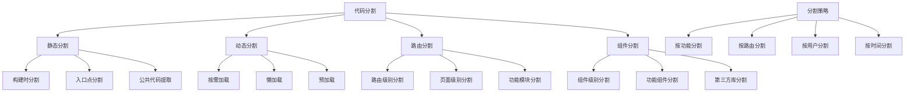

# 代码分割

## 代码分割基础

### 代码分割原理


### 代码分割类型
| 类型 | 特点 | 适用场景 | 实现方式 |
|------|------|----------|----------|
| 静态分割 | 构建时确定 | 稳定功能模块 | webpack配置 |
| 动态分割 | 运行时确定 | 按需加载 | import() |
| 路由分割 | 按页面分割 | SPA应用 | React.lazy |
| 组件分割 | 按组件分割 | 大型组件 | 动态导入 |

## 静态代码分割

### Webpack配置
```javascript
// 1. 基本代码分割配置
const webpack = require('webpack');
const path = require('path');

module.exports = {
    entry: {
        main: './src/index.js',
        vendor: './src/vendor.js'
    },
    output: {
        filename: '[name].[contenthash].js',
        path: path.resolve(__dirname, 'dist'),
        clean: true
    },
    optimization: {
        splitChunks: {
            chunks: 'all',
            cacheGroups: {
                vendor: {
                    test: /[\\/]node_modules[\\/]/,
                    name: 'vendors',
                    chunks: 'all',
                    priority: 10
                },
                common: {
                    name: 'common',
                    minChunks: 2,
                    chunks: 'all',
                    priority: 5,
                    reuseExistingChunk: true
                }
            }
        }
    }
};

// 2. 高级代码分割配置
module.exports = {
    optimization: {
        splitChunks: {
            chunks: 'all',
            minSize: 20000,
            maxSize: 244000,
            minChunks: 1,
            maxAsyncRequests: 30,
            maxInitialRequests: 30,
            enforceSizeThreshold: 50000,
            cacheGroups: {
                default: {
                    minChunks: 2,
                    priority: -20,
                    reuseExistingChunk: true
                },
                vendor: {
                    test: /[\\/]node_modules[\\/]/,
                    name: 'vendors',
                    priority: -10,
                    chunks: 'all'
                },
                react: {
                    test: /[\\/]node_modules[\\/](react|react-dom)[\\/]/,
                    name: 'react',
                    priority: 20,
                    chunks: 'all'
                },
                lodash: {
                    test: /[\\/]node_modules[\\/]lodash[\\/]/,
                    name: 'lodash',
                    priority: 15,
                    chunks: 'all'
                },
                utils: {
                    test: /[\\/]src[\\/]utils[\\/]/,
                    name: 'utils',
                    priority: 10,
                    chunks: 'all'
                }
            }
        }
    }
};

// 3. 运行时代码分割
module.exports = {
    optimization: {
        runtimeChunk: {
            name: 'runtime'
        },
        splitChunks: {
            chunks: 'all',
            cacheGroups: {
                vendor: {
                    test: /[\\/]node_modules[\\/]/,
                    name: 'vendors',
                    chunks: 'all'
                }
            }
        }
    }
};
```

### 入口点分割
```javascript
// 1. 多入口配置
module.exports = {
    entry: {
        main: './src/main.js',
        admin: './src/admin.js',
        user: './src/user.js'
    },
    output: {
        filename: '[name].[contenthash].js',
        path: path.resolve(__dirname, 'dist')
    },
    optimization: {
        splitChunks: {
            chunks: 'all',
            cacheGroups: {
                common: {
                    name: 'common',
                    minChunks: 2,
                    chunks: 'all'
                }
            }
        }
    }
};

// 2. 动态入口
class DynamicEntryPlugin {
    apply(compiler) {
        compiler.hooks.entryOption.tap('DynamicEntryPlugin', (context, entry) => {
            // 动态生成入口点
            const dynamicEntries = this.generateDynamicEntries();
            return { ...entry, ...dynamicEntries };
        });
    }
    
    generateDynamicEntries() {
        const entries = {};
        const modules = ['dashboard', 'profile', 'settings', 'reports'];
        
        modules.forEach(module => {
            entries[module] = `./src/modules/${module}/index.js`;
        });
        
        return entries;
    }
}

// 3. 条件入口
module.exports = (env, argv) => {
    const isProduction = argv.mode === 'production';
    
    return {
        entry: {
            main: './src/main.js',
            ...(isProduction ? {
                vendor: './src/vendor.js'
            } : {})
        },
        optimization: {
            splitChunks: {
                chunks: 'all',
                cacheGroups: {
                    vendor: {
                        test: /[\\/]node_modules[\\/]/,
                        name: 'vendors',
                        chunks: 'all',
                        enforce: isProduction
                    }
                }
            }
        }
    };
};
```

## 动态代码分割

### 动态导入
```javascript
// 1. 基本动态导入
async function loadModule(moduleName) {
    try {
        const module = await import(`./modules/${moduleName}.js`);
        return module;
    } catch (error) {
        console.error(`Failed to load module: ${moduleName}`, error);
        return null;
    }
}

// 使用示例
const mathModule = await loadModule('math');
if (mathModule) {
    console.log(mathModule.add(1, 2));
}

// 2. 条件动态导入
class ConditionalLoader {
    constructor() {
        this.cache = new Map();
    }
    
    async loadFeature(featureName, condition) {
        if (!condition) {
            return null;
        }
        
        if (this.cache.has(featureName)) {
            return this.cache.get(featureName);
        }
        
        try {
            const module = await import(`./features/${featureName}.js`);
            this.cache.set(featureName, module);
            return module;
        } catch (error) {
            console.error(`Failed to load feature: ${featureName}`, error);
            return null;
        }
    }
    
    async loadUserFeature(userType) {
        const features = {
            admin: ['admin-panel', 'user-management'],
            user: ['profile', 'settings'],
            guest: ['login', 'register']
        };
        
        const userFeatures = features[userType] || [];
        const loadedFeatures = {};
        
        for (const feature of userFeatures) {
            const module = await this.loadFeature(feature, true);
            if (module) {
                loadedFeatures[feature] = module;
            }
        }
        
        return loadedFeatures;
    }
}

// 使用示例
const loader = new ConditionalLoader();
const adminFeatures = await loader.loadUserFeature('admin');
console.log(adminFeatures);

// 3. 预加载策略
class PreloadStrategy {
    constructor() {
        this.preloadedModules = new Map();
        this.loadingPromises = new Map();
    }
    
    async preloadModule(moduleName, priority = 'low') {
        if (this.preloadedModules.has(moduleName)) {
            return this.preloadedModules.get(moduleName);
        }
        
        if (this.loadingPromises.has(moduleName)) {
            return this.loadingPromises.get(moduleName);
        }
        
        const loadPromise = this.loadModule(moduleName, priority);
        this.loadingPromises.set(moduleName, loadPromise);
        
        try {
            const module = await loadPromise;
            this.preloadedModules.set(moduleName, module);
            this.loadingPromises.delete(moduleName);
            return module;
        } catch (error) {
            this.loadingPromises.delete(moduleName);
            throw error;
        }
    }
    
    async loadModule(moduleName, priority) {
        const delay = priority === 'high' ? 0 : priority === 'medium' ? 100 : 1000;
        
        if (delay > 0) {
            await new Promise(resolve => setTimeout(resolve, delay));
        }
        
        return import(`./modules/${moduleName}.js`);
    }
    
    // 基于用户行为的预加载
    preloadOnHover(element, moduleName) {
        let preloadTimeout;
        
        element.addEventListener('mouseenter', () => {
            preloadTimeout = setTimeout(() => {
                this.preloadModule(moduleName, 'medium');
            }, 200);
        });
        
        element.addEventListener('mouseleave', () => {
            clearTimeout(preloadTimeout);
        });
    }
    
    // 基于路由的预加载
    preloadOnRoute(route, moduleName) {
        const currentRoute = window.location.pathname;
        if (currentRoute === route) {
            this.preloadModule(moduleName, 'high');
        }
    }
}

// 使用示例
const preloader = new PreloadStrategy();

// 预加载关键模块
preloader.preloadModule('critical-module', 'high');

// 基于用户交互预加载
const button = document.getElementById('load-feature');
preloader.preloadOnHover(button, 'feature-module');
```

### 懒加载实现
```javascript
// 1. 组件懒加载
import React, { Suspense, lazy } from 'react';

// 懒加载组件
const LazyComponent = lazy(() => import('./LazyComponent'));
const AdminPanel = lazy(() => import('./AdminPanel'));
const UserProfile = lazy(() => import('./UserProfile'));

// 加载中组件
const LoadingSpinner = () => (
    <div className="loading-spinner">
        <div className="spinner"></div>
        <p>Loading...</p>
    </div>
);

// 错误边界
class ErrorBoundary extends React.Component {
    constructor(props) {
        super(props);
        this.state = { hasError: false };
    }
    
    static getDerivedStateFromError(error) {
        return { hasError: true };
    }
    
    componentDidCatch(error, errorInfo) {
        console.error('Lazy loading error:', error, errorInfo);
    }
    
    render() {
        if (this.state.hasError) {
            return <div>Something went wrong loading this component.</div>;
        }
        
        return this.props.children;
    }
}

// 使用懒加载组件
function App() {
    const [showLazy, setShowLazy] = React.useState(false);
    const [userType, setUserType] = React.useState('user');
    
    return (
        <div>
            <button onClick={() => setShowLazy(true)}>
                Load Lazy Component
            </button>
            
            {showLazy && (
                <ErrorBoundary>
                    <Suspense fallback={<LoadingSpinner />}>
                        <LazyComponent />
                    </Suspense>
                </ErrorBoundary>
            )}
            
            <ErrorBoundary>
                <Suspense fallback={<LoadingSpinner />}>
                    {userType === 'admin' ? <AdminPanel /> : <UserProfile />}
                </Suspense>
            </ErrorBoundary>
        </div>
    );
}

// 2. 路由懒加载
import { BrowserRouter, Routes, Route } from 'react-router-dom';

// 懒加载路由组件
const Home = lazy(() => import('./pages/Home'));
const About = lazy(() => import('./pages/About'));
const Contact = lazy(() => import('./pages/Contact'));
const Dashboard = lazy(() => import('./pages/Dashboard'));

// 路由配置
function AppRouter() {
    return (
        <BrowserRouter>
            <ErrorBoundary>
                <Suspense fallback={<LoadingSpinner />}>
                    <Routes>
                        <Route path="/" element={<Home />} />
                        <Route path="/about" element={<About />} />
                        <Route path="/contact" element={<Contact />} />
                        <Route path="/dashboard" element={<Dashboard />} />
                    </Routes>
                </Suspense>
            </ErrorBoundary>
        </BrowserRouter>
    );
}

// 3. 高级懒加载策略
class AdvancedLazyLoader {
    constructor() {
        this.loadedModules = new Map();
        this.loadingPromises = new Map();
        this.retryCount = new Map();
        this.maxRetries = 3;
    }
    
    async loadWithRetry(moduleName, retryCount = 0) {
        try {
            const module = await import(`./modules/${moduleName}.js`);
            this.loadedModules.set(moduleName, module);
            this.retryCount.delete(moduleName);
            return module;
        } catch (error) {
            if (retryCount < this.maxRetries) {
                console.warn(`Retrying load for ${moduleName}, attempt ${retryCount + 1}`);
                await new Promise(resolve => setTimeout(resolve, 1000 * (retryCount + 1)));
                return this.loadWithRetry(moduleName, retryCount + 1);
            } else {
                console.error(`Failed to load ${moduleName} after ${this.maxRetries} retries`);
                throw error;
            }
        }
    }
    
    async loadModule(moduleName) {
        if (this.loadedModules.has(moduleName)) {
            return this.loadedModules.get(moduleName);
        }
        
        if (this.loadingPromises.has(moduleName)) {
            return this.loadingPromises.get(moduleName);
        }
        
        const loadPromise = this.loadWithRetry(moduleName);
        this.loadingPromises.set(moduleName, loadPromise);
        
        try {
            const module = await loadPromise;
            this.loadingPromises.delete(moduleName);
            return module;
        } catch (error) {
            this.loadingPromises.delete(moduleName);
            throw error;
        }
    }
    
    // 批量加载
    async loadModules(moduleNames) {
        const loadPromises = moduleNames.map(name => this.loadModule(name));
        const results = await Promise.allSettled(loadPromises);
        
        const loaded = [];
        const failed = [];
        
        results.forEach((result, index) => {
            if (result.status === 'fulfilled') {
                loaded.push({ name: moduleNames[index], module: result.value });
            } else {
                failed.push({ name: moduleNames[index], error: result.reason });
            }
        });
        
        return { loaded, failed };
    }
    
    // 基于网络状态的加载策略
    async loadWithNetworkAwareness(moduleName) {
        const connection = navigator.connection || navigator.mozConnection || navigator.webkitConnection;
        
        if (connection) {
            const { effectiveType, downlink } = connection;
            
            if (effectiveType === 'slow-2g' || downlink < 0.5) {
                // 慢网络，延迟加载
                await new Promise(resolve => setTimeout(resolve, 2000));
            } else if (effectiveType === '2g' || downlink < 1) {
                // 中等网络，稍作延迟
                await new Promise(resolve => setTimeout(resolve, 1000));
            }
        }
        
        return this.loadModule(moduleName);
    }
}

// 使用示例
const advancedLoader = new AdvancedLazyLoader();

// 单个模块加载
advancedLoader.loadModule('critical-module').then(module => {
    console.log('Module loaded:', module);
});

// 批量模块加载
advancedLoader.loadModules(['module1', 'module2', 'module3']).then(({ loaded, failed }) => {
    console.log('Loaded modules:', loaded);
    console.log('Failed modules:', failed);
});

// 网络感知加载
advancedLoader.loadWithNetworkAwareness('heavy-module').then(module => {
    console.log('Network-aware loaded:', module);
});
```

## 路由代码分割

### React路由分割
```javascript
// 1. 基本路由分割
import { BrowserRouter, Routes, Route } from 'react-router-dom';
import { Suspense, lazy } from 'react';

// 懒加载页面组件
const Home = lazy(() => import('./pages/Home'));
const About = lazy(() => import('./pages/About'));
const Products = lazy(() => import('./pages/Products'));
const ProductDetail = lazy(() => import('./pages/ProductDetail'));
const Cart = lazy(() => import('./pages/Cart'));
const Checkout = lazy(() => import('./pages/Checkout'));

// 加载中组件
const PageLoader = () => (
    <div className="page-loader">
        <div className="loader"></div>
        <p>Loading page...</p>
    </div>
);

// 路由配置
function AppRouter() {
    return (
        <BrowserRouter>
            <Suspense fallback={<PageLoader />}>
                <Routes>
                    <Route path="/" element={<Home />} />
                    <Route path="/about" element={<About />} />
                    <Route path="/products" element={<Products />} />
                    <Route path="/products/:id" element={<ProductDetail />} />
                    <Route path="/cart" element={<Cart />} />
                    <Route path="/checkout" element={<Checkout />} />
                </Routes>
            </Suspense>
        </BrowserRouter>
    );
}

// 2. 嵌套路由分割
const Dashboard = lazy(() => import('./pages/Dashboard'));
const DashboardHome = lazy(() => import('./pages/dashboard/Home'));
const DashboardUsers = lazy(() => import('./pages/dashboard/Users'));
const DashboardSettings = lazy(() => import('./pages/dashboard/Settings'));

function DashboardRouter() {
    return (
        <Suspense fallback={<PageLoader />}>
            <Routes>
                <Route path="/dashboard" element={<Dashboard />}>
                    <Route index element={<DashboardHome />} />
                    <Route path="users" element={<DashboardUsers />} />
                    <Route path="settings" element={<DashboardSettings />} />
                </Route>
            </Routes>
        </Suspense>
    );
}

// 3. 权限路由分割
class ProtectedRoute extends React.Component {
    constructor(props) {
        super(props);
        this.state = {
            isAuthenticated: false,
            isLoading: true,
            user: null
        };
    }
    
    async componentDidMount() {
        try {
            const user = await this.checkAuthentication();
            this.setState({
                isAuthenticated: !!user,
                user,
                isLoading: false
            });
        } catch (error) {
            this.setState({
                isAuthenticated: false,
                user: null,
                isLoading: false
            });
        }
    }
    
    async checkAuthentication() {
        // 检查用户认证状态
        const token = localStorage.getItem('authToken');
        if (!token) return null;
        
        try {
            const response = await fetch('/api/verify-token', {
                headers: { Authorization: `Bearer ${token}` }
            });
            
            if (response.ok) {
                return await response.json();
            }
        } catch (error) {
            console.error('Authentication check failed:', error);
        }
        
        return null;
    }
    
    render() {
        const { isAuthenticated, isLoading, user } = this.state;
        const { component: Component, requiredRole, ...props } = this.props;
        
        if (isLoading) {
            return <PageLoader />;
        }
        
        if (!isAuthenticated) {
            return <Navigate to="/login" replace />;
        }
        
        if (requiredRole && user.role !== requiredRole) {
            return <Navigate to="/unauthorized" replace />;
        }
        
        return <Component {...props} user={user} />;
    }
}

// 使用权限路由
const AdminPanel = lazy(() => import('./pages/AdminPanel'));
const UserProfile = lazy(() => import('./pages/UserProfile'));

function ProtectedRouter() {
    return (
        <Routes>
            <Route 
                path="/admin" 
                element={
                    <ProtectedRoute 
                        component={AdminPanel} 
                        requiredRole="admin" 
                    />
                } 
            />
            <Route 
                path="/profile" 
                element={<ProtectedRoute component={UserProfile} />} 
            />
        </Routes>
    );
}
```

### Vue路由分割
```javascript
// 1. Vue路由懒加载
import { createRouter, createWebHistory } from 'vue-router';

const routes = [
    {
        path: '/',
        name: 'Home',
        component: () => import('../views/Home.vue')
    },
    {
        path: '/about',
        name: 'About',
        component: () => import('../views/About.vue')
    },
    {
        path: '/products',
        name: 'Products',
        component: () => import('../views/Products.vue')
    },
    {
        path: '/products/:id',
        name: 'ProductDetail',
        component: () => import('../views/ProductDetail.vue')
    }
];

const router = createRouter({
    history: createWebHistory(),
    routes
});

// 2. 路由守卫和预加载
router.beforeEach((to, from, next) => {
    // 预加载下一个路由
    if (to.matched.length > 0) {
        const component = to.matched[0].components.default;
        if (typeof component === 'function') {
            component().catch(error => {
                console.error('Failed to preload route:', error);
            });
        }
    }
    
    next();
});

// 3. 动态路由
function generateDynamicRoutes() {
    const routes = [];
    
    // 从API获取路由配置
    fetch('/api/routes')
        .then(response => response.json())
        .then(routeConfigs => {
            routeConfigs.forEach(config => {
                routes.push({
                    path: config.path,
                    name: config.name,
                    component: () => import(`../views/${config.component}.vue`),
                    meta: config.meta
                });
            });
            
            // 动态添加路由
            routes.forEach(route => {
                router.addRoute(route);
            });
        });
    
    return routes;
}
```

## 相关链接
- [[04-高级精通层/03-性能优化/01-内存管理]] - 内存管理
- [[04-高级精通层/03-性能优化/02-垃圾回收机制]] - 垃圾回收机制
- [[04-高级精通层/03-性能优化/04-懒加载策略]] - 懒加载策略
- [[04-高级精通层/03-性能优化/05-缓存机制]] - 缓存机制
- [[04-高级精通层/03-性能优化/06-性能监控工具]] - 性能监控工具
- [[04-高级精通层/03-性能优化/07-代码示例库-性能优化]] - 代码示例
