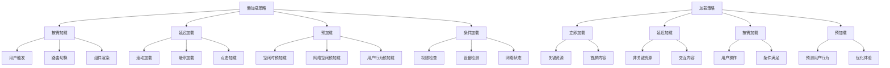

# 懒加载策略

## 懒加载基础

### 懒加载原理


### 懒加载类型
| 类型 | 触发条件 | 适用场景 | 优势 |
|------|----------|----------|------|
| 滚动懒加载 | 元素进入视口 | 长列表、图片 | 减少初始加载时间 |
| 交互懒加载 | 用户操作 | 按钮、表单 | 按需加载功能 |
| 路由懒加载 | 路由切换 | SPA应用 | 减少初始包大小 |
| 组件懒加载 | 组件渲染 | 大型组件 | 提高首屏性能 |
| 资源懒加载 | 条件满足 | 图片、视频 | 节省带宽 |

## 滚动懒加载

### 基本滚动懒加载
```javascript
// 1. 基本Intersection Observer实现
class ScrollLazyLoader {
    constructor(options = {}) {
        this.options = {
            root: null,
            rootMargin: '50px',
            threshold: 0.1,
            ...options
        };
        this.observer = null;
        this.elements = new Map();
        this.init();
    }
    
    init() {
        this.observer = new IntersectionObserver(
            this.handleIntersection.bind(this),
            this.options
        );
    }
    
    observe(element, callback) {
        this.elements.set(element, callback);
        this.observer.observe(element);
    }
    
    unobserve(element) {
        this.elements.delete(element);
        this.observer.unobserve(element);
    }
    
    handleIntersection(entries) {
        entries.forEach(entry => {
            if (entry.isIntersecting) {
                const callback = this.elements.get(entry.target);
                if (callback) {
                    callback(entry.target);
                    this.unobserve(entry.target);
                }
            }
        });
    }
    
    destroy() {
        this.observer.disconnect();
        this.elements.clear();
    }
}

// 使用示例
const lazyLoader = new ScrollLazyLoader();

// 懒加载图片
document.querySelectorAll('img[data-src]').forEach(img => {
    lazyLoader.observe(img, (element) => {
        element.src = element.dataset.src;
        element.classList.add('loaded');
    });
});

// 懒加载组件
document.querySelectorAll('[data-lazy-component]').forEach(element => {
    lazyLoader.observe(element, (el) => {
        const componentName = el.dataset.lazyComponent;
        loadComponent(componentName).then(Component => {
            ReactDOM.render(<Component />, el);
        });
    });
});

// 2. 高级滚动懒加载
class AdvancedScrollLazyLoader {
    constructor(options = {}) {
        this.options = {
            root: null,
            rootMargin: '100px',
            threshold: [0, 0.25, 0.5, 0.75, 1],
            ...options
        };
        this.observer = null;
        this.elements = new Map();
        this.loadedElements = new Set();
        this.failedElements = new Set();
        this.retryCount = new Map();
        this.maxRetries = 3;
        this.init();
    }
    
    init() {
        this.observer = new IntersectionObserver(
            this.handleIntersection.bind(this),
            this.options
        );
    }
    
    observe(element, options = {}) {
        const config = {
            callback: null,
            retryOnFail: true,
            preload: false,
            priority: 'normal',
            ...options
        };
        
        this.elements.set(element, config);
        this.observer.observe(element);
        
        // 预加载处理
        if (config.preload) {
            this.preloadElement(element, config);
        }
    }
    
    async preloadElement(element, config) {
        try {
            await config.callback(element, 'preload');
        } catch (error) {
            console.warn('Preload failed:', error);
        }
    }
    
    handleIntersection(entries) {
        entries.forEach(entry => {
            const element = entry.target;
            const config = this.elements.get(element);
            
            if (!config) return;
            
            if (entry.isIntersecting) {
                this.loadElement(element, config);
            } else if (entry.intersectionRatio === 0) {
                // 元素完全离开视口，可以卸载
                this.unloadElement(element, config);
            }
        });
    }
    
    async loadElement(element, config) {
        if (this.loadedElements.has(element)) return;
        
        try {
            await config.callback(element, 'load');
            this.loadedElements.add(element);
            this.retryCount.delete(element);
            
            // 加载成功后停止观察
            this.observer.unobserve(element);
        } catch (error) {
            console.error('Load failed:', error);
            this.handleLoadError(element, config, error);
        }
    }
    
    async unloadElement(element, config) {
        if (config.unload) {
            try {
                await config.unload(element);
                this.loadedElements.delete(element);
            } catch (error) {
                console.error('Unload failed:', error);
            }
        }
    }
    
    handleLoadError(element, config, error) {
        const retries = this.retryCount.get(element) || 0;
        
        if (config.retryOnFail && retries < this.maxRetries) {
            this.retryCount.set(element, retries + 1);
            
            // 延迟重试
            setTimeout(() => {
                this.loadElement(element, config);
            }, 1000 * (retries + 1));
        } else {
            this.failedElements.add(element);
            this.observer.unobserve(element);
        }
    }
    
    getStats() {
        return {
            total: this.elements.size,
            loaded: this.loadedElements.size,
            failed: this.failedElements.size,
            pending: this.elements.size - this.loadedElements.size - this.failedElements.size
        };
    }
}

// 使用示例
const advancedLoader = new AdvancedScrollLazyLoader();

// 懒加载图片（带重试）
document.querySelectorAll('img[data-src]').forEach(img => {
    advancedLoader.observe(img, {
        callback: async (element, type) => {
            if (type === 'preload') {
                // 预加载：创建Image对象但不设置src
                const image = new Image();
                return new Promise((resolve, reject) => {
                    image.onload = resolve;
                    image.onerror = reject;
                });
            } else {
                // 实际加载
                element.src = element.dataset.src;
                element.classList.add('loaded');
            }
        },
        retryOnFail: true,
        preload: true
    });
});

// 3. 虚拟滚动懒加载
class VirtualScrollLazyLoader {
    constructor(container, options = {}) {
        this.container = container;
        this.options = {
            itemHeight: 50,
            buffer: 5,
            ...options
        };
        this.items = [];
        this.visibleItems = [];
        this.scrollTop = 0;
        this.containerHeight = 0;
        this.init();
    }
    
    init() {
        this.containerHeight = this.container.clientHeight;
        this.container.addEventListener('scroll', this.handleScroll.bind(this));
        this.updateVisibleItems();
    }
    
    setItems(items) {
        this.items = items;
        this.updateVisibleItems();
        this.render();
    }
    
    handleScroll() {
        this.scrollTop = this.container.scrollTop;
        this.updateVisibleItems();
        this.render();
    }
    
    updateVisibleItems() {
        const startIndex = Math.floor(this.scrollTop / this.options.itemHeight);
        const endIndex = Math.min(
            startIndex + Math.ceil(this.containerHeight / this.options.itemHeight) + this.options.buffer,
            this.items.length
        );
        
        this.visibleItems = this.items.slice(startIndex, endIndex);
    }
    
    render() {
        const startIndex = Math.floor(this.scrollTop / this.options.itemHeight);
        const offsetY = startIndex * this.options.itemHeight;
        
        // 更新容器样式
        this.container.style.paddingTop = `${offsetY}px`;
        this.container.style.height = `${this.items.length * this.options.itemHeight}px`;
        
        // 渲染可见项目
        this.renderVisibleItems();
    }
    
    renderVisibleItems() {
        // 这里应该渲染可见的项目
        // 具体实现取决于使用的框架
    }
    
    destroy() {
        this.container.removeEventListener('scroll', this.handleScroll);
    }
}

// 使用示例
const container = document.getElementById('virtual-scroll');
const virtualLoader = new VirtualScrollLazyLoader(container, {
    itemHeight: 60,
    buffer: 10
});

// 设置大量数据
const largeDataSet = Array.from({ length: 10000 }, (_, i) => ({
    id: i,
    name: `Item ${i}`,
    data: `Data for item ${i}`
}));

virtualLoader.setItems(largeDataSet);
```

## 交互懒加载

### 用户交互触发
```javascript
// 1. 点击懒加载
class ClickLazyLoader {
    constructor() {
        this.loadedComponents = new Map();
        this.loadingPromises = new Map();
    }
    
    async loadOnClick(element, componentPath, options = {}) {
        const config = {
            loadingText: 'Loading...',
            errorText: 'Failed to load',
            retryText: 'Retry',
            maxRetries: 3,
            ...options
        };
        
        element.addEventListener('click', async (e) => {
            e.preventDefault();
            
            if (this.loadedComponents.has(componentPath)) {
                // 已经加载过，直接使用
                this.renderComponent(element, this.loadedComponents.get(componentPath));
                return;
            }
            
            if (this.loadingPromises.has(componentPath)) {
                // 正在加载中，等待完成
                try {
                    const component = await this.loadingPromises.get(componentPath);
                    this.renderComponent(element, component);
                } catch (error) {
                    this.showError(element, config.errorText);
                }
                return;
            }
            
            // 开始加载
            this.showLoading(element, config.loadingText);
            
            const loadPromise = this.loadComponent(componentPath, config);
            this.loadingPromises.set(componentPath, loadPromise);
            
            try {
                const component = await loadPromise;
                this.loadedComponents.set(componentPath, component);
                this.loadingPromises.delete(componentPath);
                this.renderComponent(element, component);
            } catch (error) {
                this.loadingPromises.delete(componentPath);
                this.showError(element, config.errorText, () => {
                    this.loadOnClick(element, componentPath, config);
                });
            }
        });
    }
    
    async loadComponent(componentPath, config) {
        let retries = 0;
        
        while (retries < config.maxRetries) {
            try {
                const module = await import(componentPath);
                return module.default || module;
            } catch (error) {
                retries++;
                if (retries >= config.maxRetries) {
                    throw error;
                }
                await new Promise(resolve => setTimeout(resolve, 1000 * retries));
            }
        }
    }
    
    showLoading(element, text) {
        element.innerHTML = `<div class="loading">${text}</div>`;
        element.disabled = true;
    }
    
    showError(element, text, retryCallback) {
        element.innerHTML = `
            <div class="error">
                ${text}
                <button onclick="retryCallback()">Retry</button>
            </div>
        `;
        element.disabled = false;
    }
    
    renderComponent(element, component) {
        element.innerHTML = '';
        element.disabled = false;
        
        // 渲染组件（具体实现取决于框架）
        if (typeof component === 'function') {
            ReactDOM.render(React.createElement(component), element);
        } else {
            element.appendChild(component);
        }
    }
}

// 使用示例
const clickLoader = new ClickLazyLoader();

// 懒加载表单组件
const formButton = document.getElementById('load-form');
clickLoader.loadOnClick(formButton, './components/AdvancedForm.jsx', {
    loadingText: 'Loading form...',
    errorText: 'Failed to load form'
});

// 2. 悬停懒加载
class HoverLazyLoader {
    constructor() {
        this.hoverTimeout = new Map();
        this.loadedComponents = new Map();
        this.preloadDelay = 300;
    }
    
    loadOnHover(element, componentPath, options = {}) {
        const config = {
            preloadDelay: this.preloadDelay,
            loadOnClick: true,
            ...options
        };
        
        element.addEventListener('mouseenter', () => {
            const timeoutId = setTimeout(() => {
                this.preloadComponent(componentPath);
            }, config.preloadDelay);
            
            this.hoverTimeout.set(element, timeoutId);
        });
        
        element.addEventListener('mouseleave', () => {
            const timeoutId = this.hoverTimeout.get(element);
            if (timeoutId) {
                clearTimeout(timeoutId);
                this.hoverTimeout.delete(element);
            }
        });
        
        if (config.loadOnClick) {
            element.addEventListener('click', () => {
                this.loadAndRender(element, componentPath);
            });
        }
    }
    
    async preloadComponent(componentPath) {
        if (this.loadedComponents.has(componentPath)) {
            return this.loadedComponents.get(componentPath);
        }
        
        try {
            const module = await import(componentPath);
            const component = module.default || module;
            this.loadedComponents.set(componentPath, component);
            return component;
        } catch (error) {
            console.error('Preload failed:', error);
            return null;
        }
    }
    
    async loadAndRender(element, componentPath) {
        const component = await this.preloadComponent(componentPath);
        if (component) {
            this.renderComponent(element, component);
        }
    }
    
    renderComponent(element, component) {
        // 渲染组件
        if (typeof component === 'function') {
            ReactDOM.render(React.createElement(component), element);
        } else {
            element.appendChild(component);
        }
    }
}

// 使用示例
const hoverLoader = new HoverLazyLoader();

// 悬停预加载，点击渲染
const menuItem = document.getElementById('menu-item');
hoverLoader.loadOnHover(menuItem, './components/MenuPanel.jsx', {
    preloadDelay: 200,
    loadOnClick: true
});

// 3. 焦点懒加载
class FocusLazyLoader {
    constructor() {
        this.loadedComponents = new Map();
        this.focusTimeout = new Map();
    }
    
    loadOnFocus(element, componentPath, options = {}) {
        const config = {
            focusDelay: 100,
            blurDelay: 1000,
            ...options
        };
        
        element.addEventListener('focus', () => {
            const timeoutId = setTimeout(() => {
                this.loadComponent(element, componentPath);
            }, config.focusDelay);
            
            this.focusTimeout.set(element, timeoutId);
        });
        
        element.addEventListener('blur', () => {
            const timeoutId = this.focusTimeout.get(element);
            if (timeoutId) {
                clearTimeout(timeoutId);
                this.focusTimeout.delete(element);
            }
        });
    }
    
    async loadComponent(element, componentPath) {
        if (this.loadedComponents.has(componentPath)) {
            this.renderComponent(element, this.loadedComponents.get(componentPath));
            return;
        }
        
        try {
            const module = await import(componentPath);
            const component = module.default || module;
            this.loadedComponents.set(componentPath, component);
            this.renderComponent(element, component);
        } catch (error) {
            console.error('Focus load failed:', error);
        }
    }
    
    renderComponent(element, component) {
        // 渲染组件
        if (typeof component === 'function') {
            ReactDOM.render(React.createElement(component), element);
        } else {
            element.appendChild(component);
        }
    }
}

// 使用示例
const focusLoader = new FocusLazyLoader();

// 焦点时加载
const input = document.getElementById('search-input');
focusLoader.loadOnFocus(input, './components/SearchSuggestions.jsx', {
    focusDelay: 150,
    blurDelay: 500
});
```

## 预加载策略

### 智能预加载
```javascript
// 1. 基于用户行为的预加载
class BehaviorBasedPreloader {
    constructor() {
        this.userBehavior = {
            clickHistory: [],
            hoverHistory: [],
            scrollHistory: [],
            timeOnPage: 0
        };
        this.preloadedComponents = new Map();
        this.preloadQueue = [];
        this.isPreloading = false;
        this.init();
    }
    
    init() {
        this.trackUserBehavior();
        this.startPreloadScheduler();
    }
    
    trackUserBehavior() {
        // 跟踪点击行为
        document.addEventListener('click', (e) => {
            this.userBehavior.clickHistory.push({
                element: e.target,
                timestamp: Date.now(),
                path: this.getComponentPath(e.target)
            });
        });
        
        // 跟踪悬停行为
        document.addEventListener('mouseover', (e) => {
            this.userBehavior.hoverHistory.push({
                element: e.target,
                timestamp: Date.now(),
                path: this.getComponentPath(e.target)
            });
        });
        
        // 跟踪滚动行为
        let scrollTimeout;
        window.addEventListener('scroll', () => {
            clearTimeout(scrollTimeout);
            scrollTimeout = setTimeout(() => {
                this.userBehavior.scrollHistory.push({
                    timestamp: Date.now(),
                    scrollY: window.scrollY
                });
            }, 100);
        });
        
        // 跟踪页面停留时间
        setInterval(() => {
            this.userBehavior.timeOnPage += 1000;
        }, 1000);
    }
    
    getComponentPath(element) {
        // 根据元素属性推断可能的组件路径
        const dataComponent = element.dataset.component;
        const className = element.className;
        const id = element.id;
        
        if (dataComponent) {
            return `./components/${dataComponent}.jsx`;
        }
        
        if (className.includes('menu')) {
            return './components/Menu.jsx';
        }
        
        if (id.includes('form')) {
            return './components/Form.jsx';
        }
        
        return null;
    }
    
    predictNextComponents() {
        const predictions = [];
        const recentClicks = this.userBehavior.clickHistory.slice(-10);
        const recentHovers = this.userBehavior.hoverHistory.slice(-10);
        
        // 基于点击历史预测
        recentClicks.forEach(click => {
            if (click.path) {
                predictions.push({
                    path: click.path,
                    probability: 0.8,
                    reason: 'click_history'
                });
            }
        });
        
        // 基于悬停历史预测
        recentHovers.forEach(hover => {
            if (hover.path) {
                predictions.push({
                    path: hover.path,
                    probability: 0.6,
                    reason: 'hover_history'
                });
            }
        });
        
        // 基于页面停留时间预测
        if (this.userBehavior.timeOnPage > 30000) {
            predictions.push({
                path: './components/AdvancedFeatures.jsx',
                probability: 0.4,
                reason: 'time_on_page'
            });
        }
        
        return predictions.sort((a, b) => b.probability - a.probability);
    }
    
    async preloadComponent(componentPath) {
        if (this.preloadedComponents.has(componentPath)) {
            return this.preloadedComponents.get(componentPath);
        }
        
        try {
            const module = await import(componentPath);
            const component = module.default || module;
            this.preloadedComponents.set(componentPath, component);
            return component;
        } catch (error) {
            console.error('Preload failed:', error);
            return null;
        }
    }
    
    startPreloadScheduler() {
        setInterval(() => {
            if (!this.isPreloading) {
                this.executePreloadStrategy();
            }
        }, 5000);
    }
    
    async executePreloadStrategy() {
        this.isPreloading = true;
        
        try {
            const predictions = this.predictNextComponents();
            const topPredictions = predictions.slice(0, 3);
            
            for (const prediction of topPredictions) {
                if (prediction.probability > 0.5) {
                    await this.preloadComponent(prediction.path);
                }
            }
        } catch (error) {
            console.error('Preload strategy failed:', error);
        } finally {
            this.isPreloading = false;
        }
    }
    
    getPreloadStats() {
        return {
            preloadedComponents: this.preloadedComponents.size,
            userBehavior: this.userBehavior,
            predictions: this.predictNextComponents()
        };
    }
}

// 使用示例
const behaviorPreloader = new BehaviorBasedPreloader();

// 2. 网络感知预加载
class NetworkAwarePreloader {
    constructor() {
        this.connection = navigator.connection || navigator.mozConnection || navigator.webkitConnection;
        this.preloadQueue = [];
        this.isPreloading = false;
        this.preloadDelay = 0;
        this.init();
    }
    
    init() {
        this.updatePreloadStrategy();
        
        if (this.connection) {
            this.connection.addEventListener('change', () => {
                this.updatePreloadStrategy();
            });
        }
    }
    
    updatePreloadStrategy() {
        if (!this.connection) {
            this.preloadDelay = 0;
            return;
        }
        
        const { effectiveType, downlink, saveData } = this.connection;
        
        if (saveData) {
            // 用户启用了数据节省模式
            this.preloadDelay = 10000;
        } else if (effectiveType === 'slow-2g' || downlink < 0.5) {
            // 慢网络
            this.preloadDelay = 5000;
        } else if (effectiveType === '2g' || downlink < 1) {
            // 中等网络
            this.preloadDelay = 2000;
        } else if (effectiveType === '3g' || downlink < 2) {
            // 较快网络
            this.preloadDelay = 1000;
        } else {
            // 快速网络
            this.preloadDelay = 0;
        }
    }
    
    async preloadComponent(componentPath, priority = 'normal') {
        const preloadTask = {
            path: componentPath,
            priority,
            timestamp: Date.now()
        };
        
        this.preloadQueue.push(preloadTask);
        this.preloadQueue.sort((a, b) => {
            const priorityOrder = { high: 3, normal: 2, low: 1 };
            return priorityOrder[b.priority] - priorityOrder[a.priority];
        });
        
        if (!this.isPreloading) {
            this.processPreloadQueue();
        }
    }
    
    async processPreloadQueue() {
        this.isPreloading = true;
        
        while (this.preloadQueue.length > 0) {
            const task = this.preloadQueue.shift();
            
            try {
                // 根据网络状况延迟
                if (this.preloadDelay > 0) {
                    await new Promise(resolve => setTimeout(resolve, this.preloadDelay));
                }
                
                await import(task.path);
                console.log(`Preloaded: ${task.path}`);
            } catch (error) {
                console.error(`Preload failed: ${task.path}`, error);
            }
        }
        
        this.isPreloading = false;
    }
    
    getNetworkInfo() {
        if (!this.connection) {
            return { type: 'unknown', downlink: 'unknown' };
        }
        
        return {
            effectiveType: this.connection.effectiveType,
            downlink: this.connection.downlink,
            saveData: this.connection.saveData,
            preloadDelay: this.preloadDelay
        };
    }
}

// 使用示例
const networkPreloader = new NetworkAwarePreloader();

// 根据网络状况预加载
networkPreloader.preloadComponent('./components/HeavyComponent.jsx', 'low');
networkPreloader.preloadComponent('./components/CriticalComponent.jsx', 'high');

// 3. 空闲时间预加载
class IdleTimePreloader {
    constructor() {
        this.preloadQueue = [];
        this.isPreloading = false;
        this.idleTimeout = 2000;
        this.maxIdleTime = 5000;
        this.init();
    }
    
    init() {
        this.scheduleIdlePreload();
    }
    
    scheduleIdlePreload() {
        if ('requestIdleCallback' in window) {
            requestIdleCallback(() => {
                this.executeIdlePreload();
            }, { timeout: this.idleTimeout });
        } else {
            // 降级方案
            setTimeout(() => {
                this.executeIdlePreload();
            }, this.idleTimeout);
        }
    }
    
    async executeIdlePreload() {
        if (this.isPreloading || this.preloadQueue.length === 0) {
            return;
        }
        
        this.isPreloading = true;
        const startTime = Date.now();
        
        while (this.preloadQueue.length > 0) {
            const task = this.preloadQueue.shift();
            
            try {
                await import(task.path);
                console.log(`Idle preloaded: ${task.path}`);
            } catch (error) {
                console.error(`Idle preload failed: ${task.path}`, error);
            }
            
            // 检查是否还有空闲时间
            if (Date.now() - startTime > this.maxIdleTime) {
                break;
            }
        }
        
        this.isPreloading = false;
        
        // 继续调度
        this.scheduleIdlePreload();
    }
    
    addToPreloadQueue(componentPath, priority = 'normal') {
        this.preloadQueue.push({
            path: componentPath,
            priority,
            timestamp: Date.now()
        });
        
        this.preloadQueue.sort((a, b) => {
            const priorityOrder = { high: 3, normal: 2, low: 1 };
            return priorityOrder[b.priority] - priorityOrder[a.priority];
        });
    }
    
    getPreloadStats() {
        return {
            queueLength: this.preloadQueue.length,
            isPreloading: this.isPreloading,
            idleTimeout: this.idleTimeout,
            maxIdleTime: this.maxIdleTime
        };
    }
}

// 使用示例
const idlePreloader = new IdleTimePreloader();

// 添加预加载任务
idlePreloader.addToPreloadQueue('./components/NonCriticalComponent.jsx', 'low');
idlePreloader.addToPreloadQueue('./components/UtilityComponent.jsx', 'normal');
```

## 相关链接
- [[04-高级精通层/03-性能优化/01-内存管理]] - 内存管理
- [[04-高级精通层/03-性能优化/02-垃圾回收机制]] - 垃圾回收机制
- [[04-高级精通层/03-性能优化/03-代码分割]] - 代码分割
- [[04-高级精通层/03-性能优化/05-缓存机制]] - 缓存机制
- [[04-高级精通层/03-性能优化/06-性能监控工具]] - 性能监控工具
- [[04-高级精通层/03-性能优化/07-代码示例库-性能优化]] - 代码示例
