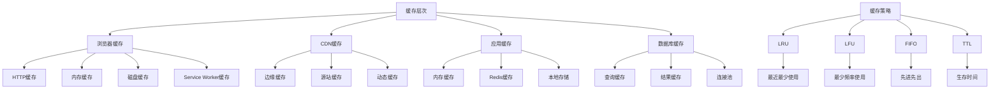

# 缓存机制

## 缓存基础

### 缓存层次结构


### 缓存类型对比
| 类型 | 存储位置 | 容量 | 速度 | 持久性 | 适用场景 |
|------|----------|------|------|--------|----------|
| 内存缓存 | RAM | 小 | 极快 | 临时 | 热点数据 |
| 磁盘缓存 | 硬盘 | 大 | 快 | 持久 | 静态资源 |
| CDN缓存 | 边缘节点 | 大 | 快 | 临时 | 静态内容 |
| 数据库缓存 | 内存/磁盘 | 中 | 快 | 持久 | 查询结果 |
| 应用缓存 | 应用内存 | 中 | 极快 | 临时 | 计算结果 |

## 浏览器缓存

### HTTP缓存
```javascript
// 1. HTTP缓存控制
class HTTPCacheManager {
    constructor() {
        this.cache = new Map();
        this.maxSize = 100;
        this.ttl = 300000; // 5分钟
    }
    
    // 设置缓存头
    setCacheHeaders(response, options = {}) {
        const {
            maxAge = 3600,
            sMaxAge = 86400,
            mustRevalidate = false,
            noCache = false,
            noStore = false,
            etag = null,
            lastModified = null
        } = options;
        
        if (noStore) {
            response.setHeader('Cache-Control', 'no-store');
            return;
        }
        
        if (noCache) {
            response.setHeader('Cache-Control', 'no-cache');
            return;
        }
        
        let cacheControl = `public, max-age=${maxAge}`;
        
        if (sMaxAge) {
            cacheControl += `, s-maxage=${sMaxAge}`;
        }
        
        if (mustRevalidate) {
            cacheControl += ', must-revalidate';
        }
        
        response.setHeader('Cache-Control', cacheControl);
        
        if (etag) {
            response.setHeader('ETag', etag);
        }
        
        if (lastModified) {
            response.setHeader('Last-Modified', lastModified);
        }
    }
    
    // 检查缓存有效性
    checkCacheValidity(request, response) {
        const ifNoneMatch = request.headers['if-none-match'];
        const ifModifiedSince = request.headers['if-modified-since'];
        
        const etag = response.getHeader('ETag');
        const lastModified = response.getHeader('Last-Modified');
        
        // ETag 检查
        if (ifNoneMatch && etag) {
            if (ifNoneMatch === etag) {
                return { valid: true, status: 304 };
            }
        }
        
        // Last-Modified 检查
        if (ifModifiedSince && lastModified) {
            const ifModifiedSinceDate = new Date(ifModifiedSince);
            const lastModifiedDate = new Date(lastModified);
            
            if (lastModifiedDate <= ifModifiedSinceDate) {
                return { valid: true, status: 304 };
            }
        }
        
        return { valid: false, status: 200 };
    }
    
    // 生成ETag
    generateETag(content) {
        const crypto = require('crypto');
        return crypto.createHash('md5').update(content).digest('hex');
    }
    
    // 缓存响应
    cacheResponse(url, response, content) {
        if (this.cache.size >= this.maxSize) {
            // 移除最旧的缓存项
            const firstKey = this.cache.keys().next().value;
            this.cache.delete(firstKey);
        }
        
        const cacheItem = {
            content,
            timestamp: Date.now(),
            etag: this.generateETag(content),
            lastModified: new Date().toUTCString()
        };
        
        this.cache.set(url, cacheItem);
    }
    
    // 获取缓存
    getCachedResponse(url) {
        const cacheItem = this.cache.get(url);
        
        if (!cacheItem) {
            return null;
        }
        
        // 检查TTL
        if (Date.now() - cacheItem.timestamp > this.ttl) {
            this.cache.delete(url);
            return null;
        }
        
        return cacheItem;
    }
}

// 使用示例
const cacheManager = new HTTPCacheManager();

// Express中间件
function cacheMiddleware(req, res, next) {
    const url = req.url;
    const cached = cacheManager.getCachedResponse(url);
    
    if (cached) {
        res.setHeader('ETag', cached.etag);
        res.setHeader('Last-Modified', cached.lastModified);
        res.send(cached.content);
        return;
    }
    
    // 保存原始send方法
    const originalSend = res.send;
    
    res.send = function(content) {
        // 设置缓存头
        cacheManager.setCacheHeaders(res, {
            maxAge: 3600,
            etag: cached?.etag,
            lastModified: cached?.lastModified
        });
        
        // 缓存响应
        cacheManager.cacheResponse(url, res, content);
        
        // 调用原始send方法
        originalSend.call(this, content);
    };
    
    next();
}

// 2. 高级HTTP缓存
class AdvancedHTTPCache {
    constructor() {
        this.cache = new Map();
        this.stats = {
            hits: 0,
            misses: 0,
            evictions: 0
        };
        this.maxSize = 1000;
        this.ttl = 300000;
        this.cleanupInterval = 60000; // 1分钟
        this.startCleanup();
    }
    
    startCleanup() {
        setInterval(() => {
            this.cleanup();
        }, this.cleanupInterval);
    }
    
    cleanup() {
        const now = Date.now();
        let cleaned = 0;
        
        for (const [key, value] of this.cache) {
            if (now - value.timestamp > this.ttl) {
                this.cache.delete(key);
                cleaned++;
            }
        }
        
        this.stats.evictions += cleaned;
    }
    
    // 智能缓存策略
    cacheWithStrategy(url, content, strategy = 'default') {
        const strategies = {
            default: { ttl: 300000, maxAge: 3600 },
            short: { ttl: 60000, maxAge: 300 },
            long: { ttl: 3600000, maxAge: 86400 },
            static: { ttl: 86400000, maxAge: 604800 }
        };
        
        const config = strategies[strategy] || strategies.default;
        
        const cacheItem = {
            content,
            timestamp: Date.now(),
            ttl: config.ttl,
            maxAge: config.maxAge,
            etag: this.generateETag(content),
            lastModified: new Date().toUTCString(),
            strategy,
            accessCount: 0,
            lastAccess: Date.now()
        };
        
        this.cache.set(url, cacheItem);
    }
    
    getCachedResponse(url) {
        const cacheItem = this.cache.get(url);
        
        if (!cacheItem) {
            this.stats.misses++;
            return null;
        }
        
        // 检查TTL
        if (Date.now() - cacheItem.timestamp > cacheItem.ttl) {
            this.cache.delete(url);
            this.stats.misses++;
            return null;
        }
        
        // 更新访问统计
        cacheItem.accessCount++;
        cacheItem.lastAccess = Date.now();
        
        this.stats.hits++;
        return cacheItem;
    }
    
    // LRU淘汰策略
    evictLRU() {
        if (this.cache.size < this.maxSize) {
            return;
        }
        
        let oldestKey = null;
        let oldestTime = Date.now();
        
        for (const [key, value] of this.cache) {
            if (value.lastAccess < oldestTime) {
                oldestTime = value.lastAccess;
                oldestKey = key;
            }
        }
        
        if (oldestKey) {
            this.cache.delete(oldestKey);
            this.stats.evictions++;
        }
    }
    
    generateETag(content) {
        const crypto = require('crypto');
        return crypto.createHash('md5').update(content).digest('hex');
    }
    
    getStats() {
        const hitRate = this.stats.hits / (this.stats.hits + this.stats.misses);
        return {
            ...this.stats,
            hitRate: hitRate.toFixed(2),
            cacheSize: this.cache.size,
            maxSize: this.maxSize
        };
    }
}

// 使用示例
const advancedCache = new AdvancedHTTPCache();

// 缓存静态资源
advancedCache.cacheWithStrategy('/static/style.css', cssContent, 'static');
advancedCache.cacheWithStrategy('/api/data', apiResponse, 'short');
advancedCache.cacheWithStrategy('/api/config', configData, 'long');
```

### Service Worker缓存
```javascript
// 1. Service Worker缓存策略
class ServiceWorkerCache {
    constructor() {
        this.cacheName = 'app-cache-v1';
        this.strategies = {
            cacheFirst: 'cache-first',
            networkFirst: 'network-first',
            staleWhileRevalidate: 'stale-while-revalidate',
            networkOnly: 'network-only',
            cacheOnly: 'cache-only'
        };
    }
    
    // 安装Service Worker
    install() {
        self.addEventListener('install', (event) => {
            event.waitUntil(
                caches.open(this.cacheName)
                    .then(cache => {
                        return cache.addAll([
                            '/',
                            '/static/style.css',
                            '/static/script.js',
                            '/static/logo.png'
                        ]);
                    })
            );
        });
    }
    
    // 激活Service Worker
    activate() {
        self.addEventListener('activate', (event) => {
            event.waitUntil(
                caches.keys().then(cacheNames => {
                    return Promise.all(
                        cacheNames.map(cacheName => {
                            if (cacheName !== this.cacheName) {
                                return caches.delete(cacheName);
                            }
                        })
                    );
                })
            );
        });
    }
    
    // 缓存优先策略
    async cacheFirst(request) {
        const cachedResponse = await caches.match(request);
        if (cachedResponse) {
            return cachedResponse;
        }
        
        const networkResponse = await fetch(request);
        const cache = await caches.open(this.cacheName);
        cache.put(request, networkResponse.clone());
        
        return networkResponse;
    }
    
    // 网络优先策略
    async networkFirst(request) {
        try {
            const networkResponse = await fetch(request);
            const cache = await caches.open(this.cacheName);
            cache.put(request, networkResponse.clone());
            return networkResponse;
        } catch (error) {
            const cachedResponse = await caches.match(request);
            if (cachedResponse) {
                return cachedResponse;
            }
            throw error;
        }
    }
    
    // 陈旧重新验证策略
    async staleWhileRevalidate(request) {
        const cache = await caches.open(this.cacheName);
        const cachedResponse = await cache.match(request);
        
        const fetchPromise = fetch(request).then(networkResponse => {
            cache.put(request, networkResponse.clone());
            return networkResponse;
        });
        
        return cachedResponse || fetchPromise;
    }
    
    // 处理请求
    handleRequest(request) {
        const url = new URL(request.url);
        
        // 静态资源使用缓存优先
        if (url.pathname.startsWith('/static/')) {
            return this.cacheFirst(request);
        }
        
        // API请求使用网络优先
        if (url.pathname.startsWith('/api/')) {
            return this.networkFirst(request);
        }
        
        // 页面使用陈旧重新验证
        return this.staleWhileRevalidate(request);
    }
    
    // 注册Service Worker
    register() {
        if ('serviceWorker' in navigator) {
            navigator.serviceWorker.register('/sw.js')
                .then(registration => {
                    console.log('Service Worker registered:', registration);
                })
                .catch(error => {
                    console.error('Service Worker registration failed:', error);
                });
        }
    }
}

// 使用示例
const swCache = new ServiceWorkerCache();
swCache.register();

// 2. 高级Service Worker缓存
class AdvancedServiceWorkerCache {
    constructor() {
        this.cacheName = 'advanced-cache-v1';
        this.cacheConfig = {
            static: { maxAge: 86400000, maxEntries: 100 },
            api: { maxAge: 300000, maxEntries: 50 },
            images: { maxAge: 604800000, maxEntries: 200 }
        };
    }
    
    // 智能缓存策略
    async smartCache(request) {
        const url = new URL(request.url);
        const cacheType = this.getCacheType(url);
        const config = this.cacheConfig[cacheType];
        
        switch (cacheType) {
            case 'static':
                return this.cacheFirst(request, config);
            case 'api':
                return this.networkFirst(request, config);
            case 'images':
                return this.cacheFirst(request, config);
            default:
                return this.staleWhileRevalidate(request, config);
        }
    }
    
    getCacheType(url) {
        if (url.pathname.startsWith('/static/')) {
            return 'static';
        }
        if (url.pathname.startsWith('/api/')) {
            return 'api';
        }
        if (url.pathname.match(/\.(jpg|jpeg|png|gif|webp)$/)) {
            return 'images';
        }
        return 'default';
    }
    
    // 带配置的缓存优先
    async cacheFirst(request, config) {
        const cache = await caches.open(this.cacheName);
        const cachedResponse = await cache.match(request);
        
        if (cachedResponse) {
            // 检查缓存是否过期
            if (this.isCacheValid(cachedResponse, config.maxAge)) {
                return cachedResponse;
            }
        }
        
        try {
            const networkResponse = await fetch(request);
            if (networkResponse.ok) {
                await this.cacheResponse(cache, request, networkResponse, config);
            }
            return networkResponse;
        } catch (error) {
            return cachedResponse || new Response('Network error', { status: 503 });
        }
    }
    
    // 带配置的网络优先
    async networkFirst(request, config) {
        try {
            const networkResponse = await fetch(request);
            if (networkResponse.ok) {
                const cache = await caches.open(this.cacheName);
                await this.cacheResponse(cache, request, networkResponse, config);
            }
            return networkResponse;
        } catch (error) {
            const cache = await caches.open(this.cacheName);
            const cachedResponse = await cache.match(request);
            
            if (cachedResponse && this.isCacheValid(cachedResponse, config.maxAge)) {
                return cachedResponse;
            }
            
            throw error;
        }
    }
    
    // 缓存响应
    async cacheResponse(cache, request, response, config) {
        // 检查缓存大小限制
        const keys = await cache.keys();
        if (keys.length >= config.maxEntries) {
            // 移除最旧的缓存项
            const oldestKey = keys[0];
            await cache.delete(oldestKey);
        }
        
        // 添加缓存时间戳
        const responseWithTimestamp = new Response(response.body, {
            status: response.status,
            statusText: response.statusText,
            headers: {
                ...response.headers,
                'sw-cache-timestamp': Date.now().toString()
            }
        });
        
        await cache.put(request, responseWithTimestamp);
    }
    
    // 检查缓存有效性
    isCacheValid(response, maxAge) {
        const timestamp = response.headers.get('sw-cache-timestamp');
        if (!timestamp) return false;
        
        const age = Date.now() - parseInt(timestamp);
        return age < maxAge;
    }
    
    // 清理过期缓存
    async cleanupExpiredCache() {
        const cache = await caches.open(this.cacheName);
        const keys = await cache.keys();
        
        for (const key of keys) {
            const response = await cache.match(key);
            if (response) {
                const url = new URL(key.url);
                const cacheType = this.getCacheType(url);
                const config = this.cacheConfig[cacheType];
                
                if (!this.isCacheValid(response, config.maxAge)) {
                    await cache.delete(key);
                }
            }
        }
    }
}

// 使用示例
const advancedSWCache = new AdvancedServiceWorkerCache();

// 定期清理过期缓存
setInterval(() => {
    advancedSWCache.cleanupExpiredCache();
}, 300000); // 5分钟
```

## 应用缓存

### 内存缓存
```javascript
// 1. LRU缓存实现
class LRUCache {
    constructor(maxSize = 100) {
        this.maxSize = maxSize;
        this.cache = new Map();
    }
    
    get(key) {
        if (this.cache.has(key)) {
            // 移动到末尾（最近使用）
            const value = this.cache.get(key);
            this.cache.delete(key);
            this.cache.set(key, value);
            return value;
        }
        return null;
    }
    
    set(key, value) {
        if (this.cache.has(key)) {
            // 更新现有值
            this.cache.delete(key);
        } else if (this.cache.size >= this.maxSize) {
            // 移除最旧的项（第一个）
            const firstKey = this.cache.keys().next().value;
            this.cache.delete(firstKey);
        }
        
        this.cache.set(key, value);
    }
    
    delete(key) {
        return this.cache.delete(key);
    }
    
    clear() {
        this.cache.clear();
    }
    
    size() {
        return this.cache.size;
    }
    
    keys() {
        return Array.from(this.cache.keys());
    }
    
    values() {
        return Array.from(this.cache.values());
    }
}

// 使用示例
const lruCache = new LRUCache(5);

lruCache.set('a', 1);
lruCache.set('b', 2);
lruCache.set('c', 3);
lruCache.set('d', 4);
lruCache.set('e', 5);

console.log(lruCache.get('a')); // 1
lruCache.set('f', 6); // 'b' 被移除
console.log(lruCache.get('b')); // null

// 2. TTL缓存实现
class TTLCache {
    constructor(maxSize = 100, defaultTTL = 300000) {
        this.maxSize = maxSize;
        this.defaultTTL = defaultTTL;
        this.cache = new Map();
        this.timers = new Map();
    }
    
    set(key, value, ttl = this.defaultTTL) {
        // 清除现有定时器
        if (this.timers.has(key)) {
            clearTimeout(this.timers.get(key));
        }
        
        // 设置新值
        this.cache.set(key, value);
        
        // 设置过期定时器
        const timer = setTimeout(() => {
            this.delete(key);
        }, ttl);
        
        this.timers.set(key, timer);
        
        // 检查大小限制
        if (this.cache.size > this.maxSize) {
            const firstKey = this.cache.keys().next().value;
            this.delete(firstKey);
        }
    }
    
    get(key) {
        const value = this.cache.get(key);
        if (value !== undefined) {
            return value;
        }
        return null;
    }
    
    delete(key) {
        const deleted = this.cache.delete(key);
        if (this.timers.has(key)) {
            clearTimeout(this.timers.get(key));
            this.timers.delete(key);
        }
        return deleted;
    }
    
    clear() {
        // 清除所有定时器
        for (const timer of this.timers.values()) {
            clearTimeout(timer);
        }
        
        this.cache.clear();
        this.timers.clear();
    }
    
    size() {
        return this.cache.size;
    }
    
    // 手动清理过期项
    cleanup() {
        const now = Date.now();
        for (const [key, value] of this.cache) {
            if (value.expires && value.expires < now) {
                this.delete(key);
            }
        }
    }
}

// 使用示例
const ttlCache = new TTLCache(10, 5000); // 5秒TTL

ttlCache.set('user:123', { name: 'John', email: 'john@example.com' });
console.log(ttlCache.get('user:123')); // { name: 'John', email: 'john@example.com' }

setTimeout(() => {
    console.log(ttlCache.get('user:123')); // null (已过期)
}, 6000);

// 3. 多级缓存
class MultiLevelCache {
    constructor() {
        this.l1Cache = new LRUCache(100); // 内存缓存
        this.l2Cache = new TTLCache(1000, 300000); // TTL缓存
        this.stats = {
            l1Hits: 0,
            l2Hits: 0,
            misses: 0
        };
    }
    
    async get(key) {
        // 检查L1缓存
        let value = this.l1Cache.get(key);
        if (value !== null) {
            this.stats.l1Hits++;
            return value;
        }
        
        // 检查L2缓存
        value = this.l2Cache.get(key);
        if (value !== null) {
            this.stats.l2Hits++;
            // 提升到L1缓存
            this.l1Cache.set(key, value);
            return value;
        }
        
        this.stats.misses++;
        return null;
    }
    
    set(key, value, ttl = 300000) {
        // 设置到L1缓存
        this.l1Cache.set(key, value);
        
        // 设置到L2缓存
        this.l2Cache.set(key, value, ttl);
    }
    
    delete(key) {
        this.l1Cache.delete(key);
        this.l2Cache.delete(key);
    }
    
    clear() {
        this.l1Cache.clear();
        this.l2Cache.clear();
    }
    
    getStats() {
        const total = this.stats.l1Hits + this.stats.l2Hits + this.stats.misses;
        return {
            ...this.stats,
            total,
            hitRate: total > 0 ? ((this.stats.l1Hits + this.stats.l2Hits) / total).toFixed(2) : 0,
            l1HitRate: total > 0 ? (this.stats.l1Hits / total).toFixed(2) : 0,
            l2HitRate: total > 0 ? (this.stats.l2Hits / total).toFixed(2) : 0
        };
    }
}

// 使用示例
const multiCache = new MultiLevelCache();

multiCache.set('user:123', { name: 'John' });
console.log(multiCache.get('user:123')); // { name: 'John' }
console.log(multiCache.getStats());
```

### Redis缓存
```javascript
// 1. Redis缓存客户端
class RedisCacheClient {
    constructor(redisClient) {
        this.redis = redisClient;
        this.defaultTTL = 3600; // 1小时
    }
    
    async get(key) {
        try {
            const value = await this.redis.get(key);
            return value ? JSON.parse(value) : null;
        } catch (error) {
            console.error('Redis get error:', error);
            return null;
        }
    }
    
    async set(key, value, ttl = this.defaultTTL) {
        try {
            const serialized = JSON.stringify(value);
            await this.redis.setex(key, ttl, serialized);
            return true;
        } catch (error) {
            console.error('Redis set error:', error);
            return false;
        }
    }
    
    async delete(key) {
        try {
            const result = await this.redis.del(key);
            return result > 0;
        } catch (error) {
            console.error('Redis delete error:', error);
            return false;
        }
    }
    
    async exists(key) {
        try {
            const result = await this.redis.exists(key);
            return result === 1;
        } catch (error) {
            console.error('Redis exists error:', error);
            return false;
        }
    }
    
    async expire(key, ttl) {
        try {
            const result = await this.redis.expire(key, ttl);
            return result === 1;
        } catch (error) {
            console.error('Redis expire error:', error);
            return false;
        }
    }
    
    async ttl(key) {
        try {
            return await this.redis.ttl(key);
        } catch (error) {
            console.error('Redis ttl error:', error);
            return -1;
        }
    }
    
    // 批量操作
    async mget(keys) {
        try {
            const values = await this.redis.mget(keys);
            return values.map(value => value ? JSON.parse(value) : null);
        } catch (error) {
            console.error('Redis mget error:', error);
            return [];
        }
    }
    
    async mset(keyValuePairs, ttl = this.defaultTTL) {
        try {
            const pipeline = this.redis.pipeline();
            
            for (const [key, value] of keyValuePairs) {
                const serialized = JSON.stringify(value);
                pipeline.setex(key, ttl, serialized);
            }
            
            await pipeline.exec();
            return true;
        } catch (error) {
            console.error('Redis mset error:', error);
            return false;
        }
    }
    
    // 模式匹配
    async keys(pattern) {
        try {
            return await this.redis.keys(pattern);
        } catch (error) {
            console.error('Redis keys error:', error);
            return [];
        }
    }
    
    // 清理模式匹配的键
    async deletePattern(pattern) {
        try {
            const keys = await this.keys(pattern);
            if (keys.length > 0) {
                await this.redis.del(...keys);
            }
            return keys.length;
        } catch (error) {
            console.error('Redis deletePattern error:', error);
            return 0;
        }
    }
}

// 使用示例
const redis = require('redis');
const redisClient = redis.createClient();
const cache = new RedisCacheClient(redisClient);

// 缓存用户数据
await cache.set('user:123', { name: 'John', email: 'john@example.com' }, 1800);
const user = await cache.get('user:123');
console.log(user);

// 2. 缓存装饰器
function cacheDecorator(cacheClient, keyGenerator, ttl = 3600) {
    return function(target, propertyName, descriptor) {
        const method = descriptor.value;
        
        descriptor.value = async function(...args) {
            const key = keyGenerator(...args);
            
            // 尝试从缓存获取
            let result = await cacheClient.get(key);
            if (result !== null) {
                return result;
            }
            
            // 缓存未命中，执行原方法
            result = await method.apply(this, args);
            
            // 缓存结果
            if (result !== null && result !== undefined) {
                await cacheClient.set(key, result, ttl);
            }
            
            return result;
        };
        
        return descriptor;
    };
}

// 使用示例
class UserService {
    constructor(cacheClient) {
        this.cache = cacheClient;
    }
    
    @cacheDecorator(
        this.cache,
        (userId) => `user:${userId}`,
        1800
    )
    async getUserById(userId) {
        // 模拟数据库查询
        return { id: userId, name: `User ${userId}` };
    }
    
    @cacheDecorator(
        this.cache,
        (email) => `user:email:${email}`,
        1800
    )
    async getUserByEmail(email) {
        // 模拟数据库查询
        return { email, name: `User with ${email}` };
    }
}

// 3. 缓存策略
class CacheStrategy {
    constructor(cacheClient) {
        this.cache = cacheClient;
        this.stats = {
            hits: 0,
            misses: 0,
            sets: 0,
            deletes: 0
        };
    }
    
    // 写入策略
    async writeThrough(key, value, ttl = 3600) {
        // 同时写入缓存和数据库
        await this.cache.set(key, value, ttl);
        await this.writeToDatabase(key, value);
        this.stats.sets++;
    }
    
    async writeBehind(key, value, ttl = 3600) {
        // 先写入缓存，异步写入数据库
        await this.cache.set(key, value, ttl);
        this.stats.sets++;
        
        // 异步写入数据库
        setImmediate(() => {
            this.writeToDatabase(key, value);
        });
    }
    
    async writeAround(key, value, ttl = 3600) {
        // 直接写入数据库，删除缓存
        await this.writeToDatabase(key, value);
        await this.cache.delete(key);
        this.stats.sets++;
    }
    
    // 读取策略
    async readThrough(key, fallbackFunction, ttl = 3600) {
        let value = await this.cache.get(key);
        
        if (value === null) {
            // 缓存未命中，从数据库获取
            value = await fallbackFunction();
            if (value !== null) {
                await this.cache.set(key, value, ttl);
            }
            this.stats.misses++;
        } else {
            this.stats.hits++;
        }
        
        return value;
    }
    
    async readAside(key, fallbackFunction, ttl = 3600) {
        let value = await this.cache.get(key);
        
        if (value === null) {
            // 缓存未命中，从数据库获取
            value = await fallbackFunction();
            if (value !== null) {
                // 异步更新缓存
                setImmediate(() => {
                    this.cache.set(key, value, ttl);
                });
            }
            this.stats.misses++;
        } else {
            this.stats.hits++;
        }
        
        return value;
    }
    
    // 模拟数据库操作
    async writeToDatabase(key, value) {
        // 模拟数据库写入
        console.log(`Writing to database: ${key}`, value);
    }
    
    getStats() {
        const total = this.stats.hits + this.stats.misses;
        return {
            ...this.stats,
            hitRate: total > 0 ? (this.stats.hits / total).toFixed(2) : 0
        };
    }
}

// 使用示例
const strategy = new CacheStrategy(cache);

// 写入策略
await strategy.writeThrough('user:123', { name: 'John' });

// 读取策略
const user = await strategy.readThrough(
    'user:123',
    () => ({ id: 123, name: 'John from DB' })
);

console.log(user);
console.log(strategy.getStats());
```

## 相关链接
- [[04-高级精通层/03-性能优化/01-内存管理]] - 内存管理
- [[04-高级精通层/03-性能优化/02-垃圾回收机制]] - 垃圾回收机制
- [[04-高级精通层/03-性能优化/03-代码分割]] - 代码分割
- [[04-高级精通层/03-性能优化/04-懒加载策略]] - 懒加载策略
- [[04-高级精通层/03-性能优化/06-性能监控工具]] - 性能监控工具
- [[04-高级精通层/03-性能优化/07-代码示例库-性能优化]] - 代码示例
